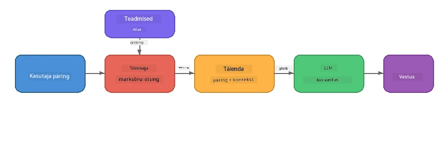

# Osa 4: RAG-rakenduse loomine Foundry Localiga

## Ülevaade

Suurte keelemudelite jõudlus on suur, kuid nad teavad ainult seda, mis oli nende treeningandmetes. **Retrieval-Augmented Generation (RAG)** lahendab selle, andes mudelile päringu ajal asjakohase konteksti – mis on võetud teie enda dokumentidest, andmebaasidest või teadmistebaasidest.

Selles laboris ehitate täieliku RAG-torustiku, mis töötab **täielikult teie seadmes**, kasutades Foundry Localit. Ilma pilveteenusteta, vektoriandmebaasideta ega sisestuste API-dega – ainult kohalik otsing ja kohalik mudel.

## Õpieesmärgid

Selle labori lõpuks suudate:

- Selgitada, mis on RAG ja miks see on AI-rakenduste jaoks oluline
- Luua tekstidokumentidest kohalik teadmistebaas
- Rakendada lihtsat otsingufunktsiooni asjakohase konteksti leidmiseks
- Koostada süsteemi käsu, mis põhineb otsitavatel faktidel
- Käivitada täispikk Retrieve → Augment → Generate torustik seadmes
- Mõista lihtsa märksõnaotsingu ja vektoriotsingu vahelisi kompromisse

---

## Eeltingimused

- Läbida [Osa 3: Foundry Local SDK kasutamine OpenAI-ga](part3-sdk-and-apis.md)
- Paigaldada Foundry Local CLI ja alla laadida mudel `phi-3.5-mini`

---

## Kontseptsioon: Mis on RAG?

Ilma RAG-ita saab LLM vastata ainult oma treeningandmete põhjal – mis võib olla aegunud, puudulik või ilma teie privaatse infota:

```
User: "What is Zava's return policy?"
LLM:  "I do not have information about Zava's return policy."  ← No context!
```

RAGiga **otsite** esmalt asjakohased dokumendid ning seejärel **täiendate** käsku selle kontekstiga enne vastuse **genereerimist**:



Oluline põhimõte: **mudelil ei pea vastust „teadma“, ta peab lihtsalt lugema õigeid dokumente.**

---

## Laboratoorsed ülesanded

### Ülesanne 1: Tutvu teadmistebaasiga

Ava oma keele RAG näide ja vaata teadmistebaasi:

<details>
<summary><b>🐍 Python: <code>python/foundry-local-rag.py</code></b></summary>

Teadmistebaas on lihtne sõnastike nimekiri, millel on `title` ja `content` väljad:

```python
KNOWLEDGE_BASE = [
    {
        "title": "Foundry Local Overview",
        "content": (
            "Foundry Local brings the power of Azure AI Foundry to your local "
            "device without requiring an Azure subscription..."
        ),
    },
    {
        "title": "Supported Hardware",
        "content": (
            "Foundry Local automatically selects the best model variant for "
            "your hardware. If you have an Nvidia CUDA GPU it downloads the "
            "CUDA-optimized model..."
        ),
    },
    # ... rohkem kirjeid
]
```

Iga kirje esindab “tükki” teadmisi – keskendunud infokilpi ühe teema kohta.

</details>

<details>
<summary><b>📘 JavaScript: <code>javascript/foundry-local-rag.mjs</code></b></summary>

Teadmistebaas kasutab sama struktuuri objekti massiivina:

```javascript
const KNOWLEDGE_BASE = [
  {
    title: "Foundry Local Overview",
    content:
      "Foundry Local brings the power of Azure AI Foundry to your local " +
      "device without requiring an Azure subscription...",
  },
  {
    title: "Supported Hardware",
    content:
      "Foundry Local automatically selects the best model variant for " +
      "your hardware...",
  },
  // ... veel kirjeid
];
```

</details>

<details>
<summary><b>💜 C#: <code>csharp/RagPipeline.cs</code></b></summary>

Teadmistebaas kasutab nimeliste tupplite nimekirja:

```csharp
private static readonly List<(string Title, string Content)> KnowledgeBase =
[
    ("Foundry Local Overview",
     "Foundry Local brings the power of Azure AI Foundry to your local " +
     "device without requiring an Azure subscription..."),

    ("Supported Hardware",
     "Foundry Local automatically selects the best model variant for " +
     "your hardware..."),

    // ... more entries
];
```

</details>

> **Tegelikus rakenduses** tuleks teadmistebaas luua failidest kettal, andmebaasist, otsinguindeksist või API-st. Selle labori puhul kasutame lihtsuse mõttes mälus olevat listi.

---

### Ülesanne 2: Mõista otsingufunktsiooni

Otsingu etapp leiab kasutaja küsimuse jaoks kõige asjakohasemad tükid. See näide kasutab **märksõnade kattuvust** – loendades, kui palju päringu sõnu esineb igas tükis:

<details>
<summary><b>🐍 Python</b></summary>

```python
def retrieve(query: str, top_k: int = 2) -> list[dict]:
    """Return the top-k knowledge chunks most relevant to the query."""
    query_words = set(query.lower().split())
    scored = []
    for chunk in KNOWLEDGE_BASE:
        chunk_words = set(chunk["content"].lower().split())
        overlap = len(query_words & chunk_words)
        scored.append((overlap, chunk))
    scored.sort(key=lambda x: x[0], reverse=True)
    return [item[1] for item in scored[:top_k]]
```

</details>

<details>
<summary><b>📘 JavaScript</b></summary>

```javascript
function retrieve(query, topK = 2) {
  const queryWords = new Set(query.toLowerCase().split(/\s+/));
  const scored = KNOWLEDGE_BASE.map((chunk) => {
    const chunkWords = new Set(chunk.content.toLowerCase().split(/\s+/));
    let overlap = 0;
    for (const w of queryWords) {
      if (chunkWords.has(w)) overlap++;
    }
    return { overlap, chunk };
  });
  scored.sort((a, b) => b.overlap - a.overlap);
  return scored.slice(0, topK).map((s) => s.chunk);
}
```

</details>

<details>
<summary><b>💜 C#</b></summary>

```csharp
private static List<(string Title, string Content)> Retrieve(string query, int topK = 2)
{
    var queryWords = new HashSet<string>(
        query.ToLowerInvariant().Split(' ', StringSplitOptions.RemoveEmptyEntries));

    return KnowledgeBase
        .Select(chunk =>
        {
            var chunkWords = new HashSet<string>(
                chunk.Content.ToLowerInvariant().Split(' ', StringSplitOptions.RemoveEmptyEntries));
            var overlap = queryWords.Intersect(chunkWords).Count();
            return (Overlap: overlap, Chunk: chunk);
        })
        .OrderByDescending(x => x.Overlap)
        .Take(topK)
        .Select(x => x.Chunk)
        .ToList();
}
```

</details>

**Kuidas see töötab:**
1. Jagab päringu üksikuteks sõnadeks
2. Iga teadmiste tükiga loendab, mitu päringu sõna selles tükis esineb
3. Sorteerib kattuvuse skoori järgi (kõrgeim ees)
4. Tagastab kõige asjakohasemad top-k tükid

> **Kompromiss:** Märksõnade kattuvus on lihtne, kuid piiratud; ei mõista sünonüüme ega tähendust. Tootmises kasutatavad RAG-süsteemid kasutavad tavaliselt **sisestusvektoreid** ja **vektoriandmebaasi** semantilise otsingu jaoks. Kuid märksõnade kattuvus on hea alguspunkt ega vaja lisasõltuvusi.

---

### Ülesanne 3: Mõista täiendatud käsku

Leitud kontekst sisestatakse **süsteemi käsus** enne mudelile saatmist:

```python
system_prompt = (
    "You are a helpful assistant. Answer the user's question using ONLY "
    "the information provided in the context below. If the context does "
    "not contain enough information, say so.\n\n"
    f"Context:\n{context_text}"
)
```

Olulised disainiotsused:
- **„AINULT antud info“** – takistab mudelil faktide hallutsineerimist, mida kontekst ei sisalda
- **„Kui kontekst ei sisalda piisavalt infot, ütle seda“** – julgustab ausaid vastuseid „ma ei tea“
- Kogu kontekst on süsteemiteates, mis mõjutab kõiki vastuseid

---

### Ülesanne 4: Käivita RAG torustik

Käivita täielik näide:

**Python:**
```bash
cd python
python foundry-local-rag.py
```

**JavaScript:**
```bash
cd javascript
node foundry-local-rag.mjs
```

**C#:**
```bash
cd csharp
dotnet run rag
```

Peaksid nägema kolme tulemust:
1. **Esitatud küsimus**
2. **Leitud kontekst** – varem valitud teadmiste tükid
3. **Vastus** – mudel genereeritud vastus, kasutades ainult seda konteksti

Näiteks väljund:
```
Question: How do I install Foundry Local and what hardware does it support?

--- Retrieved Context ---
### Installation
On Windows install Foundry Local with: winget install Microsoft.FoundryLocal...

### Supported Hardware
Foundry Local automatically selects the best model variant for your hardware...
-------------------------

Answer: To install Foundry Local, you can use the following methods depending
on your operating system: On Windows, run `winget install Microsoft.FoundryLocal`.
On macOS, use `brew install microsoft/foundrylocal/foundrylocal`...
```

Tähelepanu, mudeli vastus on **põhinenud** leitud kontekstis – mainib vaid teadmistebaasi dokumentide fakte.

---

### Ülesanne 5: Katseta ja laienda

Proovi järgmisi muudatusi, et süvendada arusaamist:

1. **Muuda küsimust** – küsi midagi, mis ON teadmistebaasis ja midagi, mis EI OLE:
   ```python
   question = "What programming languages does Foundry Local support?"  # ← Kontekstis
   question = "How much does Foundry Local cost?"                       # ← Mitte kontekstis
   ```
   Kas mudel ütleb õigesti „Ma ei tea“, kui vastus pole kontekstis?

2. **Lisa uus teadmiste tükk** – lisa uus kirje `KNOWLEDGE_BASE`-i:
   ```python
   {
       "title": "Pricing",
       "content": "Foundry Local is completely free and open source under the MIT license.",
   }
   ```
   Küsi nüüd hinda uuesti.

3. **Muuda `top_k` väärtust** – too välja rohkem või vähem tükkide arvu:
   ```python
   context_chunks = retrieve(question, top_k=3)  # Rohkem konteksti
   context_chunks = retrieve(question, top_k=1)  # Vähem konteksti
   ```
   Kuidas konteksti maht mõjutab vastuse kvaliteeti?

4. **Eemalda konteksti piirang** – muuda süsteemikäsuks lihtsalt „Sa oled abivalmis assistent.“ ja vaata, kas mudel hakkab fakte hallutsineerima.

---

## Süvitsi: RAG optimeerimine seadmes töötamiseks

RAG-i jooksutamine seadmes seab piiranguid, mida pilves ei ole: piiratud RAM, puudub spetsiaalne GPU (CPU/NPU käitamine) ja väike mudeli kontekstiaken. Alljärgsed disainiotsused käsitlevad neid piiranguid otse, tuginedes tootmislähedastele kohalikele RAG-rakendustele, mis on loodud Foundry Localiga.

### Tükeldamise strateegia: fikseeritud suurusega libisev aken

Tükeldamine – kuidas dokumendid paladeks jagada – on ühed mõjukamad otsused igas RAG süsteemis. Seadmesse töötamiseks on soovitatav alustada **fikseeritud suurusega libiseva akna ja kattuvusega**:

| Parameeter | Soovitatav väärtus | Miks |
|------------|--------------------|-----|
| **Tüki suurus** | ~200 tokenit | Hoiab leitava konteksti kompaktse, jättes Phi-3.5 Mini kontekstiaknasse ruumi süsteemikäsule, vestlusajaloole ja genereeritud väljundile |
| **Kattuvus** | ~25 tokenit (12,5%) | Takistab info kadumist tükikeste piiridel – oluline protseduuride ja samm-sammult juhiste puhul |
| **Tokeniseerimine** | Tühiku järgi jagamine | Nullsõltuvust, pole vaja eraldi tokeniseerijat. Kõik arvutusressursid jäävad LLM-ile |

Kattuvus töötab nagu libisev aken: iga uus tükk algab 25 tokenit enne eelmise lõppu, nii et laused, mis ulatuvad tükkide piiridesse, ilmuvad mõlemas tükis.

> **Miks mitte teised strateegiad?**
> - **Lausepõhine jagamine** annab ettearvamatud tükisuurused; mõned ohutusjuhised on pikad üksikud laused, mida raske jagada
> - **Sektsiooniteadlik jagamine** (## pealkirjade järgi) tekitab väga erineva suurusega tükke – mõni liiga väike, teine liiga suur mudeli kontekstiaknasse
> - **Semantiline tükeldamine** (sisendpõhine teema tuvastus) annab parima otsingukvaliteedi, kuid vajab Phi-3.5 Mini kõrval teist mudelit mälus – ohtlik riistvaral, millel on vaid 8–16 GB ühismälu

### Järgmine tasand otsingus: TF-IDF vektorid

Selles laboris kasutatav märksõnade kattuvuse meetod töötab, kuid kui soovid paremat otsingut ilma sisestusmudelit lisamata, on **TF-IDF (Term Frequency-Inverse Document Frequency)** suurepärane vahesamm:

```
Keyword Overlap  →  TF-IDF Vectors  →  Embedding Models
    (this lab)     (lightweight upgrade)   (production)
  Simple & fast    Better ranking,         Best quality,
  No dependencies  still no ML model       requires embedding model
  ~Basic matching  ~1ms retrieval          ~100-500ms per query
```

TF-IDF teisendab iga tüki numbrilisteks vektoriteks, lähtudes selle sõna tähtsusest selles tükis *võrreldes kõigi tükkidega*. Päringu ajal vektoriseeritakse küsimus samamoodi ja võrreldakse kosinus-sarnasuse alusel. Seda saab rakendada SQLite ja puhta JavaScripti/Pythoni abil – pole vektoriandmebaasi ega sisestuste API-d vaja.

> **Jõudlus:** TF-IDF kosinus-sarnasus fikseeritud suurusega tükkidel saavutab tavaliselt **~1 ms otsingu**, võrreldes ~100-500 ms-ga, kui sisestusmudel kodeerib iga päringu. Kõik 20+ dokumenti saadakse paladeks ja indekseeritakse alla sekundiga.

### Äärmiselt madala energiatarbega/kompaktne režiim piiratud seadmetele

Kui jooksutad väga piiratud riistvaral (vanemad sülearvutid, tahvelarvutid, väliseadmed), saad ressursse vähendada kolme nupu vähendamisega:

| Seade | Tavaline režiim | Äärmine/kompaktne režiim |
|--------|-----------------|--------------------------|
| **Süsteemi käsk** | ~300 tokenit | ~80 tokenit |
| **Maksimaalne väljundi tokenite arv** | 1024 | 512 |
| **Leitud tükid (top-k)** | 5 | 3 |

Vähem leitud tükke tähendab mudelile vähem konteksti töödeldavaks, vähendades latentsust ja mälukasutust. Lühim süsteemikäsk vabastab kontekstiaknas rohkem ruumi vastusele. See kompromiss on kasulik seadmetele, kus konteksti iga token loeb.

### Üks mudel mälus

Üks olulisemaid põhimõtteid seadmes töötavale RAG-ile: **hoia mälus ainult üks mudel**. Kui kasutad lisaks sisestusmudelit otsinguks *ja* keelemudelit genereerimiseks, jagad piiratud NPU/RAM ressursse kahe mudeli vahel. Kergekaaluline otsing (märksõnade kattuvus, TF-IDF) väldib seda täielikult:

- Pole sisestusmudelit, mis konkureeriks LLM-i mäluressursside pärast
- Kiirem külm käivitamine – ainult üks mudel laaditakse
- Ennustatav mälukasutus – LLM saab kogu olemasoleva ressursi
- Töötab masinatel alates 8 GB RAM-iga

### SQLite kui kohalik vektorihoidla

Väikeste kuni keskmiste dokumentide kogumite jaoks (sajad kuni madalad tuhanded tükid) on **SQLite piisavalt kiire** jämedakarvaliseks kosinus-sarnasuse otsinguks ning ei lisa lisainfrastruktuuri:

- Üks `.db` fail kettal – pole vaja serveriprotsessi ega seadistust
- Tuleb iga suurema keeleruntime’iga kaasa (Python `sqlite3`, Node.js `better-sqlite3`, .NET `Microsoft.Data.Sqlite`)
- Salvestab dokumenditükid koos nende TF-IDF vektoritega ühes tabelis
- Pole vaja Pinecone’i, Qdranti, Chromat ega FAISS-i sellisel tasemel

### Jõudluse kokkuvõte

Need disainiotsused võimaldavad reageerivat RAG-i tarbijariistvaral:

| Mõõdik | Seadmes töötamise jõudlus |
|--------|---------------------------|
| **Otsingu latentsus** | ~1 ms (TF-IDF) kuni ~5 ms (märksõnade kattuvus) |
| **Andmete indekseerimise kiirus** | 20 dokumenti tükkideks ja indeksisse alla sekundiga |
| **Mudelite arv mälus** | 1 (ainult LLM – sisestusmudelit ei ole) |
| **Salvestusmaht** | < 1 MB tükkide + vektorite jaoks SQLite’is |
| **Külm käivitus** | Üks mudel laadib – ei sisestuste jooksutusaega |
| **Riistvaranõuded** | 8 GB RAM, ainult CPU (GPU-d ei nõuta) |

> **Millal uuendada:** Kui skaleerid sadade pikkade dokumentideni, segatüüpi sisude (tabelid, kood, proosa) või vajate päringute semantilist mõistmist, kaalu lisamudeli kasutamist ja üleminemist vektori sarnasuse otsingule. Enamikul põletitest RAG-i kasutustest kitsaste dokumentidega annab TF-IDF + SQLite suurepärase tulemuse minimaalse ressursikasutusega.

---

## Põhimõisted

| Mõiste | Selgitus |
|--------|----------|
| **Otsing** | Asjakohaste dokumentide leidmine teadmistebaasist kasutaja päringu põhjal |
| **Täiendamine** | Leitud dokumentide lisamine käsu kontekstina |
| **Generatsioon** | LLM genereerib vastuse pakutud konteksti põhjal |
| **Tükeldamine** | Suurte dokumentide jagamine väiksemateks, fokusseeritud osadeks |
| **Põhjustamine** | Mudelit piiratakse kasutama ainult antud konteksti (vähendab hallutsineerimist) |
| **Top-k** | Kõige asjakohasemate tükikeste arv, mida otsida ja kasutada |

---

## RAG tootmises vs. see labor

| Aspekt | See labor | Seadmes optimeeritud | Pilvetootmine |
|--------|-----------|---------------------|--------------|
| **Teadmistebaas** | Mälu sees olev nimekiri | Failid kettal, SQLite | Andmebaas, otsinguindeks |
| **Otsing** | Märksõnade kattuvus | TF-IDF + kosinus-sarnasus | Vektorsisestused + sarnasuse otsing |
| **Sisestused** | Pole vaja | Pole vaja – TF-IDF vektorid | Sisestusmudel (kohalik või pilv) |
| **Vektori andmebaas** | Pole vaja | SQLite (üks `.db` fail) | FAISS, Chroma, Azure AI Search jne |
| **Tükeldamine** | Käsitsi | Fikseeritud suurusega libisev aken (~200 tokenit, 25 tokeni kattuvus) | Semantiline või rekursiivne tükeldamine |
| **Mudelite arv mälus** | 1 (LLM) | 1 (LLM) | 2+ (sisestus + LLM) |
| **Kättesaamise latentsus** | ~5ms | ~1ms | ~100-500ms |
| **Skaala** | 5 dokumenti | Sajad dokumendid | Miljonid dokumendid |

Mustrid, mida siin õpid (otsi, täienda, genereeri), on samad igas suuruses. Kättesaamise meetod paraneb, kuid üldine arhitektuur jääb samaks. Keskmine veerg näitab, mida on võimalik teha seadmes kerged tehnikate abil, mis on sageli ideaalne kohalike rakenduste jaoks, kus vahetad pilveskaala privaatsuse, võrguühenduseta võimaluse ja nulllatentsusega väliste teenuste vastu.

---

## Peamised järeldused

| Mõiste | Mida õppisite |
|---------|------------------|
| RAG muster | Otsi + Täienda + Genereeri: anna mudelile õige kontekst ja ta suudab vastata sinu andmete põhistele küsimustele |
| Seadmes | Kõik töötab lokaalselt ilma pilveteenuste API-de või vektandmebaasi tellimusteta |
| Põhjalikkuse juhised | Süsteemi promptide piirangud on kriitilised hallutsinatsioonide vältimiseks |
| Märksõnade kattuvus | Lihtne, kuid tõhus lähtepunkt otsinguks |
| TF-IDF + SQLite | Kerge uuendusteede, mis hoiab otsimise alla 1 ms ilma manustamismudelita |
| Üks mudel mälus | Vältida manustamismudeli koos laadimist LLM-iga piiratud riistvaral |
| Tükkide suurus | Umbes 200 sümbolit kattuvusega tasakaalustab otsimise täpsuse ja konteksti akna efektiivsuse |
| Edge/kompaktrežiim | Kasuta vähem tükke ja lühemaid prompt’e väga piiratud seadmete jaoks |
| Universaalne muster | Sama RAG arhitektuur töötab igat tüüpi andmeallikate jaoks: dokumendid, andmebaasid, API-d või vikid |

> **Tahad näha täisfunktsionaalset seadmes töötavat RAG rakendust?** Vaata [Gas Field Local RAG](https://github.com/leestott/local-rag), tootmisklassi võrguühenduseta RAG agenti, mis on tehtud Foundry Local ja Phi-3.5 Mini abil ning demonstreerib neid optimeerimismustreid pärismaailma dokumentide komplektiga.

---

## Järgmised sammud

Jätka [Osa 5: AI agentide loomine](part5-single-agents.md) juurde, et õppida, kuidas luua intelligentseid agente personaade, juhiste ja mitme vooru vestluste abil Microsoft Agent Frameworki kasutades.