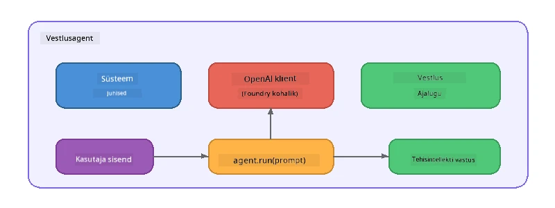

# Osa 5: AI-agentide loomine Agent Frameworkiga

> **Eesmärk:** Ehita oma esimene AI-agent, kellel on püsivad juhised ja määratletud isiksus, mida juhib kohalik mudel Foundry Locali kaudu.

## Mis on AI-agent?

AI-agent kombineerib keelemudeli **süsteemi juhistega**, mis määravad selle käitumise, isiksuse ja piirangud. Erinevalt ühest vestluskompleti päringust pakub agent:

- **Isiksus** – järjepidev identiteet („Sa oled abivalmis koodi ülevaataja“)
- **Mälu** – vestluse ajalugu mitme sammuna
- **Spetsialiseerumine** – fookustatud käitumine hästi koostatud juhiste põhjal



---

## Microsoft Agent Framework

**Microsoft Agent Framework** (AGF) pakub standardset agendi abstraktsiooni, mis töötab erinevate mudeli tagaosadega. Selles töötoas kasutame seda koos Foundry Localiga, et kõik jookseks sinu arvutis – pilve pole vaja.

| Kontseptsioon | Kirjeldus |
|---------------|-----------|
| `FoundryLocalClient` | Python: haldab teenuse käivitust, mudeli allalaadimist/laadimist ja loob agente |
| `client.as_agent()` | Python: loob Foundry Local kliendist agendi |
| `AsAIAgent()` | C#: laiendusmeetod `ChatClient`-il – loob `AIAgenti` |
| `instructions` | Süsteemipõhine prompt, mis kujundab agendi käitumist |
| `name` | Inimloetav silt, kasulik mitme agendi olukordades |
| `agent.run(prompt)` / `RunAsync()` | Saadab kasutaja sõnumi ja tagastab agendi vastuse |

> **Märkus:** Agent Frameworkil on Python ja .NET SDK. JavaScripti jaoks realiseerime kergekaalulise `ChatAgent` klassi, mis järgib sama mustrit, kasutades OpenAI SDK-d otse.

---

## Harjutused

### Harjutus 1 – Tutvu agendi mustriga

Enne koodi kirjutamist õpi tundma agendi põhikomponente:

1. **Mudeli klient** – ühendub Foundry Locali OpenAI-ga ühilduva API-ga
2. **Süsteemi juhised** – „isiksuse“ prompt
3. **Töötsükkel** – saada kasutaja sisend, saada väljund

> **Mõtle:** Kuidas erinevad süsteemi juhised tavalisest kasutaja sõnumist? Mis juhtub, kui neid muuta?

---

### Harjutus 2 – Käivita ühe agendi näide

<details>
<summary><strong>🐍 Python</strong></summary>

**Eeltingimused:**
```bash
cd python
python -m venv venv

# Windows (PowerShell):
venv\Scripts\Activate.ps1
# macOS:
source venv/bin/activate

pip install -r requirements.txt
```

**Käivita:**
```bash
python foundry-local-with-agf.py
```

**Koodi selgitus** (`python/foundry-local-with-agf.py`):

```python
import asyncio
from agent_framework_foundry_local import FoundryLocalClient

async def main():
    alias = "phi-4-mini"

    # FoundryLocalClient haldab teenuse käivitamist, mudeli allalaadimist ja laadimist
    client = FoundryLocalClient(model_id=alias)
    print(f"Client Model ID: {client.model_id}")

    # Loo agent süsteemi juhistega
    agent = client.as_agent(
        name="Joker",
        instructions="You are good at telling jokes.",
    )

    # Mitte-voogedastus: saada täielik vastus korraga
    result = await agent.run("Tell me a joke about a pirate.")
    print(f"Agent: {result}")

    # Voogedastus: saada tulemused kohe, kui need genereeritakse
    async for chunk in agent.run("Tell me another joke.", stream=True):
        if chunk.text:
            print(chunk.text, end="", flush=True)

asyncio.run(main())
```

**Olulised punktid:**
- `FoundryLocalClient(model_id=alias)` haldab teenuse käivitust, allalaadimist ja mudeli laadimist ühes sammus
- `client.as_agent()` loob agendi süsteemi juhiste ja nimega
- `agent.run()` toetab nii voogedastamata kui ka voogedastavat režiimi
- Paigalda käsuga `pip install agent-framework-foundry-local --pre`

</details>

<details>
<summary><strong>📦 JavaScript</strong></summary>

**Eeltingimused:**
```bash
cd javascript
npm install
```

**Käivita:**
```bash
node foundry-local-with-agent.mjs
```

**Koodi selgitus** (`javascript/foundry-local-with-agent.mjs`):

```javascript
import { OpenAI } from "openai";
import { FoundryLocalManager } from "foundry-local-sdk";

class ChatAgent {
  constructor({ client, modelId, instructions, name }) {
    this.client = client;
    this.modelId = modelId;
    this.instructions = instructions;
    this.name = name;
    this.history = [];
  }

  async run(userMessage) {
    const messages = [
      { role: "system", content: this.instructions },
      ...this.history,
      { role: "user", content: userMessage },
    ];
    const response = await this.client.chat.completions.create({
      model: this.modelId,
      messages,
    });
    const assistantMessage = response.choices[0].message.content;

    // Säilita vestluse ajalugu mitmekäiguliste suhtluste jaoks
    this.history.push({ role: "user", content: userMessage });
    this.history.push({ role: "assistant", content: assistantMessage });
    return { text: assistantMessage };
  }
}

async function main() {
  FoundryLocalManager.create({ appName: "FoundryLocalWorkshop" });
  const manager = FoundryLocalManager.instance;
  await manager.startWebService();

  const catalog = manager.catalog;
  const model = await catalog.getModel("phi-3.5-mini");
  if (!model.isCached) {
    console.log("Downloading model: phi-3.5-mini...");
    await model.download();
  }
  await model.load();

  const client = new OpenAI({
    baseURL: manager.urls[0] + "/v1",
    apiKey: "foundry-local",
  });

  const agent = new ChatAgent({
    client,
    modelId: model.id,
    instructions: "You are good at telling jokes.",
    name: "Joker",
  });

  const result = await agent.run("Tell me a joke about a pirate.");
  console.log(result.text);
}

main();
```

**Olulised punktid:**
- JavaScript ehitab oma `ChatAgent` klassi, mis peegeldab Python AGF mustrit
- `this.history` salvestab vestlusmängud mitme sammu toe jaoks
- Selge `startWebService()` → vahemälu kontroll → `model.download()` → `model.load()` annab täieliku nähtavuse

</details>

<details>
<summary><strong>💜 C#</strong></summary>

**Eeltingimused:**
```bash
cd csharp
dotnet restore
```

**Käivita:**
```bash
dotnet run agent
```

**Koodi selgitus** (`csharp/SingleAgent.cs`):

```csharp
using Microsoft.AI.Foundry.Local;
using Microsoft.Extensions.Logging.Abstractions;
using Microsoft.Agents.AI;
using OpenAI;
using System.ClientModel;

// 1. Start Foundry Local and load a model
var alias = "phi-3.5-mini";
await FoundryLocalManager.CreateAsync(
    new Configuration
    {
        AppName = "FoundryLocalSamples",
        Web = new Configuration.WebService { Urls = "http://127.0.0.1:0" }
    }, NullLogger.Instance, default);
var manager = FoundryLocalManager.Instance;
await manager.StartWebServiceAsync(default);

var catalog = await manager.GetCatalogAsync(default);
var model = await catalog.GetModelAsync(alias, default);

var isCached = await model.IsCachedAsync(default);
if (!isCached)
{
    Console.WriteLine($"Downloading model: {alias}...");
    await model.DownloadAsync(null, default);
}
await model.LoadAsync(default);

var key = new ApiKeyCredential("foundry-local");
var client = new OpenAIClient(key, new OpenAIClientOptions
{
    Endpoint = new Uri(manager.Urls[0] + "/v1")
});

// 2. Create an AIAgent using the Agent Framework extension method
AIAgent joker = client
    .GetChatClient(model.Id)
    .AsAIAgent(
        instructions: "You are good at telling jokes. Keep your jokes short and family-friendly.",
        name: "Joker"
    );

// 3. Run the agent (non-streaming)
var response = await joker.RunAsync("Tell me a joke about a pirate.");
Console.WriteLine($"Joker: {response}");

// 4. Run with streaming
await foreach (var update in joker.RunStreamingAsync("Tell me another joke."))
{
    Console.Write(update);
}
```

**Olulised punktid:**
- `AsAIAgent()` on laiendusmeetod `Microsoft.Agents.AI.OpenAI`-st – kohustuslikku `ChatAgent` klassi ei ole vaja
- `RunAsync()` tagastab täieliku vastuse; `RunStreamingAsync()` voogedastab tokkeni kaupa
- Paigalda käsuga `dotnet add package Microsoft.Agents.AI.OpenAI --version 1.0.0-rc3`

</details>

---

### Harjutus 3 – Muuda isiksust

Muuda agendi `instructions` teksti, et luua eri isiksusi. Proovi igaüht ja jälgi, kuidas väljund muutub:

| Isiksus | Juhised |
|---------|---------|
| Koodi ülevaataja | `"Sa oled asjatundlik koodi ülevaataja. Anna konstruktiivset tagasisidet, keskendudes loetavusele, jõudlusele ja korrektsusele."` |
| Reisijuht | `"Sa oled sõbralik reisijuht. Anna isikupärastatud soovitusi sihtkohtade, tegevuste ja kohaliku köögi kohta."` |
| Sokratiline juhendaja | `"Sa oled sokratiline juhendaja. Ära anna otseseid vastuseid – juhenda õpilast mõtlemapanevate küsimustega."` |
| Tehniline kirjanik | `"Sa oled tehniline kirjanik. Selgita kontseptsioone selgelt ja lühidalt. Kasuta näiteid. Väldi žargooni."` |

**Proovi:**
1. Vali tabelist isiksus
2. Asenda koodis `instructions` string
3. Kohanda kasutaja prompt vastavalt (nt palu koodi ülevaatajal funktsiooni hinnata)
4. Käivita näide uuesti ja võrdle väljundit

> **Nipp:** Agendi kvaliteet sõltub tugevalt juhistest. Konkreetsed ja hästi organiseeritud juhised annavad paremaid tulemusi kui udused.

---

### Harjutus 4 – Lisa mitme sammu vestlus

Laienda näidet, et toetada mitmes sammudes vestlust, võimaldades sõbralikku dialoogi agendiga.

<details>
<summary><strong>🐍 Python – mitmesammu tsükkel</strong></summary>

```python
import asyncio
from agent_framework_foundry_local import FoundryLocalClient

async def main():
    client = FoundryLocalClient(model_id="phi-4-mini")

    agent = client.as_agent(
        name="Assistant",
        instructions="You are a helpful assistant.",
    )

    print("Chat with the agent (type 'quit' to exit):\n")
    while True:
        user_input = input("You: ")
        if user_input.strip().lower() in ("quit", "exit"):
            break
        result = await agent.run(user_input)
        print(f"Agent: {result}\n")

asyncio.run(main())
```

</details>

<details>
<summary><strong>📦 JavaScript – mitmesammu tsükkel</strong></summary>

```javascript
import { OpenAI } from "openai";
import { FoundryLocalManager } from "foundry-local-sdk";
import * as readline from "node:readline/promises";

// (taaskasuta ChatAgent klassi harjutusest 2)

async function main() {
  FoundryLocalManager.create({ appName: "FoundryLocalWorkshop" });
  const manager = FoundryLocalManager.instance;
  await manager.startWebService();

  const catalog = manager.catalog;
  const model = await catalog.getModel("phi-3.5-mini");
  if (!model.isCached) {
    console.log("Downloading model: phi-3.5-mini...");
    await model.download();
  }
  await model.load();

  const client = new OpenAI({
    baseURL: manager.urls[0] + "/v1",
    apiKey: "foundry-local",
  });

  const agent = new ChatAgent({
    client,
    modelId: model.id,
    instructions: "You are a helpful assistant.",
    name: "Assistant",
  });

  const rl = readline.createInterface({
    input: process.stdin,
    output: process.stdout,
  });

  console.log("Chat with the agent (type 'quit' to exit):\n");
  while (true) {
    const userInput = await rl.question("You: ");
    if (["quit", "exit"].includes(userInput.trim().toLowerCase())) break;
    const result = await agent.run(userInput);
    console.log(`Agent: ${result.text}\n`);
  }
  rl.close();
}

main();
```

</details>

<details>
<summary><strong>💜 C# – mitmesammu tsükkel</strong></summary>

```csharp
using Microsoft.AI.Foundry.Local;
using Microsoft.Extensions.Logging.Abstractions;
using Microsoft.Agents.AI;
using OpenAI;
using System.ClientModel;

var alias = "phi-3.5-mini";
var config = new Configuration
{
    AppName = "FoundryLocalSamples",
    Web = new Configuration.WebService { Urls = "http://127.0.0.1:0" }
};
await FoundryLocalManager.CreateAsync(config, NullLogger.Instance, default);
var manager = FoundryLocalManager.Instance;
await manager.StartWebServiceAsync(default);

var catalog = await manager.GetCatalogAsync(default);
var model = await catalog.GetModelAsync(alias, default);

var isCached = await model.IsCachedAsync(default);
if (!isCached)
{
    Console.WriteLine($"Downloading model: {alias}...");
    await model.DownloadAsync(null, default);
}
await model.LoadAsync(default);

var key = new ApiKeyCredential("foundry-local");
var client = new OpenAIClient(key, new OpenAIClientOptions
{
    Endpoint = new Uri(manager.Urls[0] + "/v1")
});

AIAgent agent = client
    .GetChatClient(model.Id)
    .AsAIAgent(
        instructions: "You are a helpful assistant.",
        name: "Assistant"
    );

Console.WriteLine("Chat with the agent (type 'quit' to exit):\n");
while (true)
{
    Console.Write("You: ");
    var userInput = Console.ReadLine();
    if (string.IsNullOrWhiteSpace(userInput) ||
        userInput.Equals("quit", StringComparison.OrdinalIgnoreCase) ||
        userInput.Equals("exit", StringComparison.OrdinalIgnoreCase))
        break;

    var result = await agent.RunAsync(userInput);
    Console.WriteLine($"Agent: {result}\n");
}
```

</details>

Pane tähele, kuidas agent mäletab eelnevaid samme – esita täiendav küsimus ja näe, kuidas kontekst säilib.

---

### Harjutus 5 – Struktureeritud väljund

Juhenda agenti vastama alati kindlas vormingus (nt JSON) ja parsi tulemus:

<details>
<summary><strong>🐍 Python – JSON väljund</strong></summary>

```python
import asyncio
import json
from agent_framework_foundry_local import FoundryLocalClient

async def main():
    client = FoundryLocalClient(model_id="phi-4-mini")

    agent = client.as_agent(
        name="SentimentAnalyzer",
        instructions=(
            "You are a sentiment analysis agent. "
            "For every user message, respond ONLY with valid JSON in this format: "
            '{"sentiment": "positive|negative|neutral", "confidence": 0.0-1.0, "summary": "brief reason"}'
        ),
    )

    result = await agent.run("I absolutely loved the new restaurant downtown!")
    print("Raw:", result)

    try:
        parsed = json.loads(str(result))
        print(f"Sentiment: {parsed['sentiment']} (confidence: {parsed['confidence']})")
    except json.JSONDecodeError:
        print("Agent did not return valid JSON - try refining the instructions.")

asyncio.run(main())
```

</details>

<details>
<summary><strong>💜 C# – JSON väljund</strong></summary>

```csharp
using System.Text.Json;

AIAgent analyzer = chatClient.AsAIAgent(
    name: "SentimentAnalyzer",
    instructions:
        "You are a sentiment analysis agent. " +
        "For every user message, respond ONLY with valid JSON in this format: " +
        "{\"sentiment\": \"positive|negative|neutral\", \"confidence\": 0.0-1.0, \"summary\": \"brief reason\"}"
);

var response = await analyzer.RunAsync("I absolutely loved the new restaurant downtown!");
Console.WriteLine($"Raw: {response}");

try
{
    var parsed = JsonSerializer.Deserialize<JsonElement>(response.ToString());
    Console.WriteLine($"Sentiment: {parsed.GetProperty("sentiment")} " +
                      $"(confidence: {parsed.GetProperty("confidence")})");
}
catch (JsonException)
{
    Console.WriteLine("Agent did not return valid JSON - try refining the instructions.");
}
```

</details>

> **Märkus:** Väikesed kohalikud mudelid ei pruugi alati genereerida täiuslikult kehtivat JSON-i. Usaldusväärsuse parandamiseks lisa juhistesse näide ja ole formatiivsel juhul väga täpne.

---

## Peamised õppetunnid

| Kontseptsioon | Mida õppisid |
|---------------|--------------|
| Agent vs. tavaline LLM-kõne | Agent ühendab mudeli juhiste ja mäluga |
| Süsteemi juhised | Olulisim kang reguleerimaks agendi käitumist |
| Mitme sammu vestlus | Agendid võivad kanda konteksti üle mitme kasutajapäringu |
| Struktureeritud väljund | Juhised võivad sundida väljundit vormindama (JSON, markdown jms) |
| Kohalik täitmine | Kõik jookseb seadmes Foundry Locali kaudu – pilve pole vaja |

---

## Järgmised sammud

Järgmises osas **[Osa 6: Mitme agendi töövood](part6-multi-agent-workflows.md)** ühendad mitu agenti koordineeritud torujuhtmeks, kus igaühel on spetsiaalne roll.