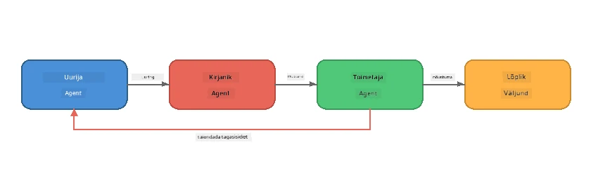
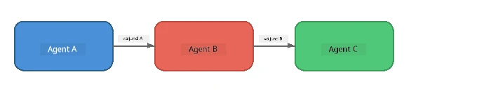
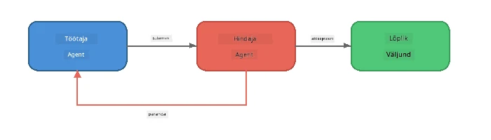
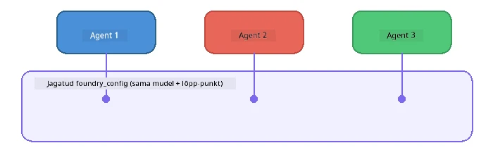

# Osa 6: Mitmeagendilised töövood

> **Eesmärk:** Ühendada mitu spetsialiseerunud agenti koordineeritud torujuhtmeteks, mis jagavad keerulisi ülesandeid koostööd tegevate agentide vahel – kõik töötab lokaalselt koos Foundry Localiga.

## Miks mitmeagendiline?

Üks agent suudab hallata palju ülesandeid, kuid keerukad töövood vajavad **spetsialiseerumist**. Ühe agendi asemel, kes püüab uurida, kirjutada ja redigeerida samaaegselt, jagatakse töö fookustatud rollideks:



| Muster | Kirjeldus |
|---------|-----------|
| **Järjestikune** | Agendi A väljund läheb agendile B → Agendile C |
| **Tagasisideahel** | Hindaja agent võib töö saata tagasi parandamiseks |
| **Jagatud kontekst** | Kõik agentid kasutavad sama mudelit/otsapunkti, aga erinevaid juhiseid |
| **Tüübitud väljund** | Agendid toodavad struktureeritud tulemusi (JSON) usaldusväärseks edastuseks |

---

## Harjutused

### Harjutus 1 - Käivita mitmeagendiline torujuhe

Töötoa hulka kuulub täielik Uurija → Kirjutaja → Toimetaja töövoog.

<details>
<summary><strong>🐍 Python</strong></summary>

**Seadistus:**
```bash
cd python
python -m venv venv

# Windows (PowerShell):
venv\Scripts\Activate.ps1
# macOS:
source venv/bin/activate

pip install -r requirements.txt
```

**Käivita:**
```bash
python foundry-local-multi-agent.py
```

**Mis juhtub:**
1. **Uurija** saab teema ja tagastab punktis loetavad faktid
2. **Kirjutaja** kasutab uurimistööd ja koostatab blogipostituse (3-4 lõiku)
3. **Toimetaja** kontrollib artikli kvaliteeti ja tagastab VASTUVÕTA või PARANDA

</details>

<details>
<summary><strong>📦 JavaScript</strong></summary>

**Seadistus:**
```bash
cd javascript
npm install
```

**Käivita:**
```bash
node foundry-local-multi-agent.mjs
```

**Sama kolmeetapiline torujuhe** - Uurija → Kirjutaja → Toimetaja.

</details>

<details>
<summary><strong>💜 C#</strong></summary>

**Seadistus:**
```bash
cd csharp
dotnet restore
```

**Käivita:**
```bash
dotnet run multi
```

**Sama kolmeetapiline torujuhe** - Uurija → Kirjutaja → Toimetaja.

</details>

---

### Harjutus 2 - Torujuhtme anatoomia

Õpi, kuidas agendid on defineeritud ja ühendatud:

**1. Jagatud mudeli klient**

Kõik agentid kasutavad sama Foundry Local mudelit:

```python
# Python - FoundryLocalClient haldab kõiki asju
from agent_framework_foundry_local import FoundryLocalClient

client = FoundryLocalClient(model_id="phi-3.5-mini")
```

```javascript
// JavaScript - OpenAI SDK suunatud Foundry Locali
const client = new OpenAI({
  baseURL: manager.urls[0] + "/v1",
  apiKey: "foundry-local",
});
```

```csharp
// C# - OpenAIClient pointed at Foundry Local
var key = new ApiKeyCredential("foundry-local");
var client = new OpenAIClient(key, new OpenAIClientOptions
{
    Endpoint = new Uri(manager.Urls[0] + "/v1")
});
var chatClient = client.GetChatClient(model.Id);
```

**2. spetsialiseeritud juhised**

Igal agentil on eraldi roll:

| Agent | Juhised (kokkuvõte) |
|-------|----------------------|
| Uurija | "Esita peamised faktid, statistika ja taust. Korralda punktidena." |
| Kirjutaja | "Kirjuta uurimistöö märkmetest köitev blogipostitus (3-4 lõiku). Ära leiuta fakte." |
| Toimetaja | "Kontrolli selgust, grammatikat ja faktide järjepidevust. Otsus: VASTUVÕTA või PARANDA." |

**3. Andmevood agentide vahel**

```python
# Samm 1 - teadlase väljund muutub kirjutaja sisendiks
research_result = await researcher.run(f"Research: {topic}")

# Samm 2 - kirjutaja väljund muutub toimetaja sisendiks
writer_result = await writer.run(f"Write using:\n{research_result}")

# Samm 3 - toimetaja vaatab üle nii uurimuse kui artikli
editor_result = await editor.run(
    f"Research:\n{research_result}\n\nArticle:\n{writer_result}"
)
```

```csharp
// C# - same pattern, async calls with AIAgent
var researchNotes = await researcher.RunAsync(
    $"Research the following topic and provide key facts:\n{topic}");

var draft = await writer.RunAsync(
    $"Write a blog post based on these research notes:\n\n{researchNotes}");

var verdict = await editor.RunAsync(
    $"Review this article for quality and accuracy.\n\n" +
    $"Research notes:\n{researchNotes}\n\n" +
    $"Article:\n{draft}");
```

> **Oluline tähelepanek:** Iga agent saab kogutud konteksti eelnevate agentide väljunditest. Toimetaja näeb nii algset uurimist kui ka mustandit – see võimaldab kontrollida faktide järjepidevust.

---

### Harjutus 3 - Lisa neljas agent

Laienda torujuhet uue agendiga. Vali üks:

| Agent | Eesmärk | Juhised |
|-------|---------|---------|
| **Faktide kontrollija** | Kontrolli artikli väiteid | `"Sa kontrollid faktilisi väiteid. Iga väite puhul märgi, kas see toetub uurimismärkmetele. Tagasta JSON kontrollitud/kontrollimata üksustega."` |
| **Pealkirjakirjutaja** | Koosta tabavad pealkirjad | `"Loo artikli jaoks 5 pealkirjavahetust. Muuda stiile: informatiivne, klikimagnet, küsimus, nimekiri, emotsionaalne."` |
| **Sotsiaalmeedia** | Koosta reklaampostitused | `"Koosta 3 sotsiaalmeedia postitust selle artikli reklaamimiseks: üks Twitteri jaoks (280 tähemärki), üks LinkedIni jaoks (professionaalne toon), üks Instagrami jaoks (juhuslik koos emotikonisoovitustega)."` |

<details>
<summary><strong>🐍 Python - pealkirjakirjutaja lisamine</strong></summary>

```python
headline_agent = client.as_agent(
    name="HeadlineWriter",
    instructions=(
        "You are a headline specialist. Given an article, generate exactly "
        "5 headline options. Vary the style: informative, question-based, "
        "listicle, emotional, and provocative. Return them as a numbered list."
    ),
)

# Pärast redaktori nõusolekut genereeri pealkirjad
headline_result = await headline_agent.run(
    f"Generate headlines for this article:\n\n{writer_result}"
)
print(f"\n--- Headlines ---\n{headline_result}")
```

</details>

<details>
<summary><strong>📦 JavaScript - pealkirjakirjutaja lisamine</strong></summary>

```javascript
const headlineAgent = new ChatAgent({
  client,
  modelId: modelInfo.id,
  instructions:
    "You are a headline specialist. Given an article, generate exactly " +
    "5 headline options. Vary the style: informative, question-based, " +
    "listicle, emotional, and provocative. Return them as a numbered list.",
  name: "HeadlineWriter",
});

const headlineResult = await headlineAgent.run(
  `Generate headlines for this article:\n\n${writerResult.text}`
);
console.log(`\n--- Headlines ---\n${headlineResult.text}`);
```

</details>

<details>
<summary><strong>💜 C# - pealkirjakirjutaja lisamine</strong></summary>

```csharp
AIAgent headlineAgent = chatClient.AsAIAgent(
    name: "HeadlineWriter",
    instructions:
        "You are a headline specialist. Given an article, generate exactly " +
        "5 headline options. Vary the style: informative, question-based, " +
        "listicle, emotional, and provocative. Return them as a numbered list."
);

// After the editor accepts, generate headlines
var headlines = await headlineAgent.RunAsync(
    $"Generate headlines for this article:\n\n{draft}");
Console.WriteLine($"\n--- Headlines ---\n{headlines}");
```

</details>

---

### Harjutus 4 - Kujunda oma töövoog

Kujunda mitmeagendiline torujuhe mõne teise valdkonna jaoks. Siin on ideid:

| Valdkond | Agendid | Voog |
|----------|---------|------|
| **Koodi ülevaade** | Analüsaator → Ülevaataja → Kokkuvõtte tegija | Analüüsi koodi struktuuri → vaata üle vead → koosta kokkuvõte |
| **Klienditugi** | Klassifikaator → Vastaja → Kvaliteedikontroll | Klasifitseeri pilet → kirjuta vastus → kontrolli kvaliteeti |
| **Haridus** | Viktoriini koostaja → Õpilase simulaator → Hindaja | Koosta viktoriin → simuleeri vastuseid → hinda ja kommentaari järgi |
| **Andmeanalüüs** | Tõlgendaja → Analüütik → Reporter | Tõlgenda andmepäring → analüüsi mustrid → kirjuta aruanne |

**Sammud:**
1. Määra 3+ agenti eristuvate `juhistega`
2. Otsusta andmevoog - mida iga agent saab ja toodab?
3. Rakenda torujuhe kasutades harjutustes 1-3 nähtud mustreid
4. Lisa tagasisideahel, kui mõni agent peaks hindama teise tööd

---

## Orkestreerimismustrid

Siin on orkestreerimismustrid, mis kehtivad mis tahes mitmeagendilise süsteemi kohta (lähemalt [Osas 7](part7-zava-creative-writer.md)):

### Järjestikune torujuhe



Iga agent töötleb eelmise väljundit. Lihtne ja ettearvatav.

### Tagasisideahel



Hindaja agent võib käivitada eelmiste etappide uuesti täitmise. Zava Kirjutaja kasutab seda: toimetaja võib saata tagasisidet uurijale ja kirjutajale.

### Jagatud kontekst



Kõik agentid jagavad ühte `foundry_config` ja kasutavad sama mudelit ning otsapunkti.

---

## Põhitähelepanekud

| Kontseptsioon | Mida õppisid |
|---------------|--------------|
| Agendi spetsialiseerumine | Iga agent teeb ühte asja hästi, keskendunud juhistega |
| Andmeülekanne | Ühe agendi väljund muutub järgmise sisendiks |
| Tagasisideahelad | Hindaja võib käivitada kordusi parema kvaliteedi nimel |
| Struktureeritud väljund | JSON-vormingus vastused võimaldavad usaldusväärset agentidevahelist suhtlust |
| Orkestreerimine | Koordinaator juhib torujuhtme järjestust ja vigade käsitlemist |
| Tootmismustrid | Rakendatud [Osas 7: Zava Creative Writer](part7-zava-creative-writer.md) |

---

## Edasised sammud

Jätka [Osasse 7: Zava Creative Writer – Capstone rakendus](part7-zava-creative-writer.md), et uurida tootmisstiilis mitmeagendilist rakendust 4 spetsialiseerunud agentiga, voogedastusega väljundiga, tootepõhja otsinguga ja tagasisideahelatega – saadaval Pythonis, JavaScriptis ja C#-s.