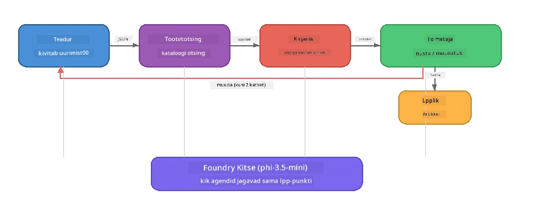

# Osa 7: Zava Creative Writer - lõpprakendus

> **Eesmärk:** Uurida tootmisstiilis mitme agendiga rakendust, kus neli spetsialiseerunud agenti teevad koostööd, et toota Zava Retail DIY-le ajakirjakvaliteediga artikleid – kõik töötades täielikult sinu seadmes Foundry Localiga.

See on töötoa **lõpplabor**. See ühendab kõik, mida oled õppinud – SDK integratsioon (osa 3), andmete tagasitoomine lokaalsest andmekogust (osa 4), agentide isikud (osa 5) ja mitme agendi orkestreerimine (osa 6) – terviklikuks rakenduseks, mis on saadaval **Pythonis**, **JavaScriptis** ja **C#-s**.

---

## Mida Sa Avastad

| Mõiste | Kus Zava Writeris |
|---------|----------------------------|
| 4-etapiline mudeli laadimine | Jagatud konfiguratsioonimoodul käivitab Foundry Locali |
| RAG-tüüpi päringud | Tooteagent otsib kohalikust kataloogist |
| Agendi spetsialiseerumine | 4 agenti erinevate süsteemipäringutega |
| Vooalane väljund | Kirjutaja esitab reaaliaegselt tokeneid |
| Struktureeritud ülesanded | Teadur → JSON, Toimetaja → JSON otsus |
| Tagasisideahelad | Toimetaja võib käivitada uuesti (maks. 2 katset) |

---

## Arhitektuur

Zava Creative Writer kasutab **järjestikust torujuhtme- ehk pipeline'i, kus tagasisidet juhib hindaja**. Kõik kolm keeleversiooni järgivad sama arhitektuuri:



### Neli Agentid

| Agent | Sisend | Väljund | Eesmärk |
|-------|-------|--------|---------|
| **Teadur** | Teema + valikuline tagasiside | `{"web": [{url, name, description}, ...]}` | Kogub taustauuringut LLM-i abil |
| **Tooteotsing** | Toote konteksti sõne | Sobivate toodete nimekiri | LLM-i genereeritud päringud + märksõnapõhine otsing kohalikus kataloogis |
| **Kirjutaja** | Uuringud + tooted + ülesanne + tagasiside | Voolav artikli tekst (jaotatud `---`) | Koostab ajakirjakvaliteediga artikli reaalajas |
| **Toimetaja** | Artikkel + kirjutaja enesetagasiside | `{"decision": "accept/revise", "editorFeedback": "...", "researchFeedback": "..."}` | Hinnang kvaliteedile, vajadusel kutsub uuesti käivituse |

### Torujuhtme voo kirjeldus

1. **Teadur** saab teema ja genereerib struktureeritud uurimismärkmeid (JSON)
2. **Tooteotsing** otsib kohalikust tootekataloogist LLM-i genereeritud otsinguterminitega
3. **Kirjutaja** ühendab uuringud + tooted + ülesande voolava artiklina, lisades enesetagasiside `---` eralduri järel
4. **Toimetaja** hindab artiklit ja annab JSON-i tõlgendi:
   - `"accept"` → toru lõpetab töö
   - `"revise"` → tagasiside saadetakse tagasi teadurile ja kirjutajale (maksimaalselt 2 kordust)

---

## Eeltingimused

- Lõpeta [Osa 6: Mitme Agendi Töövood](part6-multi-agent-workflows.md)
- Foundry Local CLI paigaldatud ja mudel `phi-3.5-mini` alla laaditud

---

## Harjutused

### Harjutus 1 - Käivita Zava Creative Writer

Vali keel ja käivita rakendus:

<details>
<summary><strong>🐍 Python – FastAPI veebiteenus</strong></summary>

Python'i versioon töötab **veebiteenusena** REST API-ga, demonstreerides tootmisvalmis backend'i ehitamist.

**Seadistamine:**
```bash
cd zava-creative-writer-local/src/api
python -m venv venv

# Windows (PowerShell):
venv\Scripts\Activate.ps1
# macOS:
source venv/bin/activate

pip install -r requirements.txt
```

**Käivita:**
```bash
uvicorn main:app --reload
```

**Testeeri:**
```bash
curl -X POST http://localhost:8000/api/article \
  -H "Content-Type: application/json" \
  -d '{
    "research": "DIY home improvement trends",
    "products": "power tools and paints",
    "assignment": "Write an article about weekend renovation projects for DIY enthusiasts"
  }'
```

Vastus voolab tagasi uue rea eraldatud JSON-põhiste sõnumitena, mis näitavad iga agendi edenemist.

</details>

<details>
<summary><strong>📦 JavaScript – Node.js CLI</strong></summary>

JavaScripti versioon töötab **CLI-rakendusena**, trükkides agentide edenemise ja artikli otse konsooli.

**Seadistamine:**
```bash
cd zava-creative-writer-local/src/javascript
npm install
```

**Käivita:**
```bash
node main.mjs
```

Näed:
1. Foundry Local mudeli laadimine (laadimisel edenemisriba)
2. Iga agent töös järjest ning olekuteated
3. Artikkel reaalajas konsoolile voolamas
4. Toimetaja nõusoleku või parandamise otsus

</details>

<details>
<summary><strong>💜 C# – .NET konsoolirakendus</strong></summary>

C# versioon töötab **.NET konsoolirakendusena** samade torujuhtme ja vooväljunditega.

**Seadistamine:**
```bash
cd zava-creative-writer-local/src/csharp
dotnet restore
```

**Käivita:**
```bash
dotnet run
```

Väljundmuster on sama, mis JavaScriptil – agentide olekuteated, voolav artikkel ja toimetaja otsus.

</details>

---

### Harjutus 2 – Uuri Koodi Struktuuri

Igas keeles on sama loogikaga komponendid. Võrdle struktuure:

**Python** (`src/api/`):
| Fail | Eesmärk |
|------|---------|
| `foundry_config.py` | Jagatud Foundry Local haldur, mudel ja klient (4-astmeline algatus) |
| `orchestrator.py` | Torujuhtme koordineerimine tagasisideahelaga |
| `main.py` | FastAPI lõpp-punktid (`POST /api/article`) |
| `agents/researcher/researcher.py` | LLM-põhine uurimine JSON-väljundiga |
| `agents/product/product.py` | LLM-i päringud + märksõnaotsing |
| `agents/writer/writer.py` | Artikli vooveeremine |
| `agents/editor/editor.py` | JSON-põhine otsus "aktiivtakse/parandatakse" |

**JavaScript** (`src/javascript/`):
| Fail | Eesmärk |
|------|---------|
| `foundryConfig.mjs` | Jagatud Foundry Local konfiguratsioon (4-astmeline algatus edenemisriba näiduga) |
| `main.mjs` | Orkestreerija + CLI alguspunkt |
| `researcher.mjs` | LLM-põhine uurimisagent |
| `product.mjs` | LLM päringugeneratsioon + märksõnade otsing |
| `writer.mjs` | Artikli voogedastamine (asünkroonne generaator) |
| `editor.mjs` | JSON aktsepteerimise/parandamise otsus |
| `products.mjs` | Tootekataloogi andmed |

**C#** (`src/csharp/`):
| Fail | Eesmärk |
|------|---------|
| `Program.cs` | Täielik torujuhe: mudeli laadimine, agentide funktsioonid, orkestreerija, tagasisideahel |
| `ZavaCreativeWriter.csproj` | .NET 9 projekt koos Foundry Local + OpenAI paketiga |

> **Disaini märkus:** Pythonil on iga agent eraldi failis/kataloogis (sobib suurematele meeskondadele). JavaScriptil on üks moodul iga agendi kohta (sobib keskmiste projektide jaoks). C#-s on kõik ühes failis kohalike funktsioonidega (sobib iseseisvateks näideteks). Tootmises vali oma meeskonna konventsioonidele sobiv muster.

---

### Harjutus 3 – Jälgi Jagatud Konfiguratsiooni

Kogu torujuhtme agendid kasutavad ühist Foundry Local mudeli klienti. Uuri, kuidas see on seadistatud igas keeles:

<details>
<summary><strong>🐍 Python – foundry_config.py</strong></summary>

```python
from foundry_local import FoundryLocalManager

MODEL_ALIAS = "phi-3.5-mini"

# Samm 1: Loo haldur ja käivita Foundry Local teenus
manager = FoundryLocalManager()
manager.start_service()

# Samm 2: Kontrolli, kas mudel on juba alla laaditud
cached = manager.list_cached_models()
catalog_info = manager.get_model_info(MODEL_ALIAS)
is_cached = any(m.id == catalog_info.id for m in cached) if catalog_info else False

if not is_cached:
    manager.download_model(MODEL_ALIAS)

# Samm 3: Laadi mudel mällu
manager.load_model(MODEL_ALIAS)
model_id = manager.get_model_info(MODEL_ALIAS).id

# Jagatud OpenAI klient
client = openai.OpenAI(base_url=manager.endpoint, api_key=manager.api_key)
```

Kõik agendid impordivad `from foundry_config import client, model_id`.

</details>

<details>
<summary><strong>📦 JavaScript – foundryConfig.mjs</strong></summary>

```javascript
import { FoundryLocalManager } from "foundry-local-sdk";
import { OpenAI } from "openai";

FoundryLocalManager.create({ appName: "ZavaCreativeWriter" });
const manager = FoundryLocalManager.instance;
await manager.startWebService();

// Kontrolli vahemälu → laadi alla → lae (uus SDK muster)
const catalog = manager.catalog;
const model = await catalog.getModel(MODEL_ALIAS);
if (!model.isCached) {
  console.log(`Downloading model: ${MODEL_ALIAS}...`);
  await model.download();
}
await model.load();

const client = new OpenAI({ baseURL: manager.urls[0] + "/v1", apiKey: "foundry-local" });
const modelId = model.id;
export { client, modelId };
```

Kõik agendid impordivad `{ client, modelId } from "./foundryConfig.mjs"`.

</details>

<details>
<summary><strong>💜 C# – Program.cs alguses</strong></summary>

```csharp
await FoundryLocalManager.CreateAsync(
    new Configuration
    {
        AppName = "ZavaCreativeWriter",
        Web = new Configuration.WebService { Urls = "http://127.0.0.1:0" }
    }, NullLogger.Instance, default);
var manager = FoundryLocalManager.Instance;
await manager.StartWebServiceAsync(default);

var catalog = await manager.GetCatalogAsync(default);
var catalogModel = await catalog.GetModelAsync(alias, default);
var isCached = await catalogModel.IsCachedAsync(default);
if (!isCached)
    await catalogModel.DownloadAsync(null, default);

await catalogModel.LoadAsync(default);
var key = new ApiKeyCredential("foundry-local");
var chatClient = new OpenAIClient(key, new OpenAIClientOptions
{
    Endpoint = new Uri(manager.Urls[0] + "/v1")
}).GetChatClient(catalogModel.Id);
```

`chatClient` antakse edasi kõigile agendi funktsioonidele samas failis.

</details>

> **Põhimustr:** Mudeli laadimise muster (teenuse käivitamine → vahemälu kontroll → allalaadimine → laadimine) tagab kasutajale selged edenemisnäidud ja mudelit alla laaditakse vaid kord. See on parem tava kõigi Foundry Local rakenduste jaoks.

---

### Harjutus 4 – Mõista Tagasisideahelat

Tagasisideahel on see, mis teeb sellest torust "targa" – toimetaja võib tööd tagasi saata parandamiseks. Jälgi loogikat:

```
Orchestrator:
  1. researcher.research(topic, "No Feedback")    ← first pass
  2. product.findProducts(productContext)
  3. writer.write(research, products, assignment)  ← streams article
  4. Split article at "---" → article + writerFeedback
  5. editor.edit(article, writerFeedback)

  WHILE editor says "revise" AND retryCount < 2:
    6. researcher.research(topic, editor.researchFeedback)  ← refined
    7. writer.write(research, products, editor.editorFeedback)
    8. editor.edit(newArticle, newWriterFeedback)
    9. retryCount++
```

**Küsimused arutamiseks:**
- Miks on taastekatsete limiit seatud 2-le? Mis juhtuks, kui suurendada?
- Miks saab teadur `researchFeedback` ja kirjutaja `editorFeedback`?
- Mis juhtuks, kui toimetaja alati ütleb "paranda"?

---

### Harjutus 5 – Muuda Ühte Agenti

Proovi ühe agendi käitumist muuta ja jälgi, kuidas see torujuhtme tööd mõjutab:

| Muudatus | Mis muuta |
|-------------|----------------|
| **Rangeim toimetaja** | Muuda toimetaja süsteemipäringut nii, et ta nõuaks alati vähemalt ühte parandust |
| **Pikemad artiklid** | Muuda kirjutaja päringut "800-1000 sõna" asemel "1500-2000 sõna" |
| **Erinevad tooted** | Lisa või muuda tooteid tootekataloogis |
| **Uus uurimisteema** | Muuda vaikimisi `researchContext` teist teemat käsitlevaks |
| **Ainult JSON teadlane** | Pane teadur tagastama 10 kirjet asemel 3-5 |

> **Nipp:** Kuna kõik kolm keelt rakendavad sama arhitektuuri, saad sama muudatuse teha endale mugavas keeles.

---

### Harjutus 6 – Lisa Viies Agent

Laienda torujuhet uue agendiga. Mõned ideed:

| Agent | Kus torujuhtmes | Eesmärk |
|-------|-----------------|---------|
| **Faktikontrollija** | Pärast kirjutajat, enne toimetajat | Kontrollib väiteid uuringuandmetega |
| **SEO optimeerija** | Pärast toimetaja kinnitust | Lisab meta kirjelduse, märksõnad, slug'i |
| **Illustraator** | Pärast toimetaja kinnitust | Genereerib pildipäringuid artiklile |
| **Tõlkija** | Pärast toimetaja kinnitust | Tõlgib artikli teise keelde |

**Sammud:**
1. Kirjuta agendi süsteemipäring
2. Loo agendi funktsioon (vastavalt keele olemasolevale mustrile)
3. Lisa see orkestreerijasse õigele positsioonile
4. Uuenda väljundit/logimist, et näidata uue agendi panust

---

## Kuidas Foundry Local ja Agendi Raamistik Koos Töötavad

See rakendus demonstreerib soovitatud mustrit mitme agendi süsteemide ehitamiseks Foundry Localiga:

| Kiht | Komponent | Roll |
|-------|-----------|------|
| **Täitmine (Runtime)** | Foundry Local | Laeb alla, haldab ja teenindab mudelit lokaalselt |
| **Klient** | OpenAI SDK | Saadab vestluste täiendusi kohaliku liidese poole |
| **Agent** | Süsteemipäring + vestlus | Spetsialiseerunud käitumine, juhiste keskendumine |
| **Orkestreerija** | Torujuhtme koordinaator | Halduse voogude, järjestuse ja tagasisideahelate juhtimine |
| **Raamistik** | Microsoft Agent Framework | Pakub ChatAgent abstraktsiooni ja mustreid |

Oluline taipamine: **Foundry Local asendab pilvepõhise backend'i, mitte rakenduse arhitektuuri.** Need samad agendi mustrid, orkestreerimisstrateegiad ja struktureeritud ülesanded, mis töötavad pilvemudelitega, töötavad identse täpsusega kohalikul mudelil — lihtsalt suunad kliendi kohaliku otsesele liidesele Azure'i asemel.

---

## Põhisõnumid

| Mõiste | Mida Sa Õppisid |
|---------|-----------------|
| Tootmisarhitektuur | Kuidas struktuurida mitme agendi rakendus jagatud konfiguratsiooni ja eraldatud agentidega |
| 4-astmeline mudeli laadimine | Parim tava Foundry Local algatamiseks kasutajale nähtava edenemisnäiduga |
| Agendi spetsialiseerumine | Igal 4 agendil on keskendunud juhised ja spetsiifiline väljundi formaat |
| Vooalane genereerimine | Kirjutaja esitab reaalajas tokeneid, võimaldades kiiret kasutajaliidest |
| Tagasisideahelad | Toimetaja juhitud katsete kordamine parandab väljundi kvaliteeti ilma inimsekkumiseta |
| Keelteülene muster | Sama arhitektuur töötab Pythonis, JavaScriptis ja C#-s |
| Kohalik = tootmiseks valmis | Foundry Local pakub sama OpenAI-ühilduvat API-d, mida kasutatakse pilves |

---

## Järgmine Samm

Jätka [Osa 8: Hindamispõhine Arendus](part8-evaluation-led-development.md), et ehitada oma agentidele süsteemne hindamisraamistik, kasutades kuldseid andmekogumeid, reeglitel põhinevaid kontrollimisi ja LLM-i hindajana.