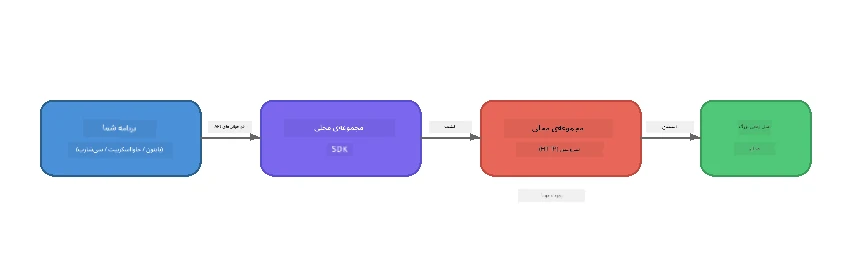

# بخش ۱: شروع کار با Foundry Local


## Foundry Local چیست؟

[Foundry Local](https://foundrylocal.ai) به شما این امکان را می‌دهد که مدل‌های زبانی هوش مصنوعی متن‌باز را **مستقیماً روی کامپیوتر خود اجرا کنید** - بدون نیاز به اینترنت، هزینه‌های ابری و با حفظ کامل حریم خصوصی داده‌ها. این برنامه:

- **مدل‌ها را به صورت محلی دانلود و اجرا می‌کند** با بهینه‌سازی خودکار سخت‌افزار (GPU، CPU، یا NPU)
- **یک API سازگار با OpenAI ارائه می‌دهد** تا بتوانید از SDKها و ابزارهای آشنا استفاده کنید
- **نیازی به اشتراک Azure یا ثبت‌نام ندارد** - فقط نصب کنید و شروع به ساخت کنید

انگار این یک هوش مصنوعی خصوصی شماست که کاملاً روی دستگاه شما اجرا می‌شود.

## اهداف یادگیری

تا پایان این لابراتوار شما قادر خواهید بود:

- نصب رابط خط فرمان Foundry Local را روی سیستم عامل خود انجام دهید
- بفهمید که نام مستعار مدل‌ها چیست و چگونه کار می‌کند
- اولین مدل هوش مصنوعی محلی خود را دانلود و اجرا کنید
- از طریق خط فرمان، پیام چت به یک مدل محلی ارسال کنید
- تفاوت بین مدل‌های هوش مصنوعی محلی و میزبان ابری را درک کنید

---

## پیش‌نیازها

### نیازمندی‌های سیستم

| نیازمندی | حداقل | پیشنهادی |
|-------------|---------|-------------|
| **رم (RAM)** | ۸ گیگابایت | ۱۶ گیگابایت |
| **فضای دیسک** | ۵ گیگابایت (برای مدل‌ها) | ۱۰ گیگابایت |
| **پردازنده (CPU)** | ۴ هسته | ۸ هسته یا بیشتر |
| **پردازنده گرافیکی (GPU)** | اختیاری | NVIDIA با CUDA نسخه 11.8 به بالا |
| **سیستم‌عامل** | Windows 10/11 (x64/ARM)، Windows Server 2025، macOS 13+ | - |

> **نکته:** Foundry Local به طور خودکار بهترین نسخه مدل را بر اساس سخت‌افزار شما انتخاب می‌کند. اگر GPU انویدیا دارید، از تسریع CUDA استفاده می‌کند. اگر NPU کوالکام دارید، از آن بهره می‌برد. در غیر این صورت به نسخه بهینه شده CPU برمی‌گردد.

### نصب رابط خط فرمان Foundry Local

**ویندوز** (PowerShell):  
```powershell
winget install Microsoft.FoundryLocal
```
  
**مک‌او‌اس** (Homebrew):  
```bash
brew tap microsoft/foundrylocal
brew install foundrylocal
```
  
> **نکته:** در حال حاضر Foundry Local فقط از ویندوز و مک‌او‌اس پشتیبانی می‌کند. در حال حاضر لینوکس پشتیبانی نمی‌شود.

نصب را تأیید کنید:  
```bash
foundry --version
```
  
---

## تمرین‌های لابراتوار

### تمرین ۱: کاوش مدل‌های موجود

Foundry Local یک کاتالوگ از مدل‌های متن‌باز بهینه‌شده دارد. آن‌ها را فهرست کنید:  

```bash
foundry model list
```
  
مدل‌هایی را مشاهده خواهید کرد مانند:  
- `phi-3.5-mini` - مدل 3.8 میلیارد پارامتری مایکروسافت (سریع، کیفیت قابل قبول)  
- `phi-4-mini` - مدل فی جدیدتر و توانمندتر  
- `phi-4-mini-reasoning` - مدل فی با استدلال زنجیره‌ای (`<think>` تگ‌ها)  
- `phi-4` - بزرگ‌ترین مدل فی مایکروسافت (۱۰.۴ گیگابایت)  
- `qwen2.5-0.5b` - بسیار کوچک و سریع (مناسب دستگاه‌های با منابع کم)  
- `qwen2.5-7b` - مدل عمومی قوی با پشتیبانی از فراخوانی ابزار  
- `qwen2.5-coder-7b` - بهینه‌سازی شده برای تولید کد  
- `deepseek-r1-7b` - مدل استدلال قوی  
- `gpt-oss-20b` - مدل بزرگ متن‌باز (مجوز MIT، ۱۲.۵ گیگابایت)  
- `whisper-base` - تبدیل گفتار به متن (۳۸۳ مگابایت)  
- `whisper-large-v3-turbo` - تبدیل دقیق گفتار به متن (۹ گیگابایت)  

> **نام مستعار مدل چیست؟** نام‌های مستعاری مانند `phi-3.5-mini` میانبر هستند. وقتی از نام مستعار استفاده می‌کنید، Foundry Local به طور خودکار بهترین نسخه برای سخت‌افزار خاص شما را دانلود می‌کند (CUDA برای GPUهای NVIDIA، نسخه بهینه CPU در غیر اینصورت). شما نیازی به انتخاب نسخه درست ندارید.

### تمرین ۲: اجرای اولین مدل

یک مدل را دانلود کنید و به صورت تعاملی شروع به چت کنید:  

```bash
foundry model run phi-3.5-mini
```
  
اولین بار که این دستور را اجرا می‌کنید، Foundry Local:  
1. سخت‌افزار شما را شناسایی می‌کند  
2. بهترین نسخه مدل را دانلود می‌کند (ممکن است چند دقیقه طول بکشد)  
3. مدل را در حافظه بارگذاری می‌کند  
4. جلسه چت تعاملی را آغاز می‌کند  

چند سوال از آن بپرسید:  
```
You: What is the golden ratio?
You: Can you explain it as if I were 10 years old?
You: Write a haiku about mathematics
```
  
برای خروج، تایپ کنید `exit` یا کلید `Ctrl+C` را فشار دهید.

### تمرین ۳: پیش‌دانلود مدل

اگر می‌خواهید مدلی را بدون شروع چت دانلود کنید:  

```bash
foundry model download phi-3.5-mini
```
  
بررسی کنید که کدام مدل‌ها روی دستگاه شما قبلاً دانلود شده‌اند:  

```bash
foundry cache list
```
  
### تمرین ۴: معماری را درک کنید

Foundry Local به عنوان یک **سرویس HTTP محلی** اجرا می‌شود که یک API REST سازگار با OpenAI را ارائه می‌دهد. این یعنی:

1. سرویس روی یک **پورت پویا** (هر بار پورت متفاوت) اجرا می‌شود  
2. شما از طریق SDK آدرس دقیق نقطه انتهایی را کشف می‌کنید  
3. می‌توانید از **هر** کتابخانه کلاینت سازگار با OpenAI برای ارتباط استفاده کنید  



> **مهم:** Foundry Local هر بار که اجرا می‌شود یک **پورت پویا** اختصاص می‌دهد. هرگز یک شماره پورت ثابت مانند `localhost:5272` ثابت نکنید. همیشه از SDK برای یافتن آدرس فعلی استفاده کنید (مثلاً `manager.endpoint` در پایتون یا `manager.urls[0]` در جاوااسکریپت).

---

## نکات کلیدی

| مفهوم | آنچه یاد گرفتید |
|---------|------------------|
| هوش مصنوعی روی دستگاه | Foundry Local مدل‌ها را کاملاً روی دستگاه شما اجرا می‌کند بدون نیاز به ابر، کلید API یا هزینه |
| نام مستعار مدل‌ها | نام‌های مستعار مانند `phi-3.5-mini` به طور خودکار بهترین نسخه را برای سخت‌افزار شما انتخاب می‌کنند |
| پورت‌های پویا | سرویس روی پورت پویا اجرا می‌شود؛ همیشه از SDK برای پیدا کردن نقطه انتهایی استفاده کنید |
| CLI و SDK | می‌توانید از طریق CLI (`foundry model run`) یا به صورت برنامه‌نویسی از طریق SDK با مدل‌ها تعامل کنید |

---

## گام‌های بعدی

برای تسلط بر APIهای SDK جهت مدیریت مدل‌ها، سرویس‌ها و کش به صورت برنامه‌نویسی، به [بخش ۲: بررسی عمیق Foundry Local SDK](part2-foundry-local-sdk.md) ادامه دهید.

---

<!-- CO-OP TRANSLATOR DISCLAIMER START -->
**سلب مسئولیت**:  
این سند با استفاده از سرویس ترجمه هوش مصنوعی [Co-op Translator](https://github.com/Azure/co-op-translator) ترجمه شده است. در حالی که ما در تلاش برای دقت هستیم، لطفاً آگاه باشید که ترجمه‌های خودکار ممکن است شامل خطاها یا نادرستی‌هایی باشند. سند اصلی به زبان بومی خود باید به عنوان منبع معتبر در نظر گرفته شود. برای اطلاعات حیاتی، ترجمه حرفه‌ای انسانی توصیه می‌شود. ما مسئول هیچ گونه سوءتفاهم یا برداشت نادرستی که ناشی از استفاده از این ترجمه باشد، نیستیم.
<!-- CO-OP TRANSLATOR DISCLAIMER END -->