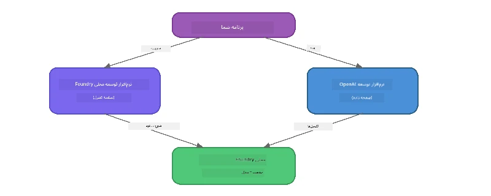

# بخش ۳: استفاده از SDK فاندری لوکال همراه با OpenAI

## مرور کلی

در بخش ۱ از CLI فاندری لوکال برای اجرای تعاملی مدل‌ها استفاده کردید. در بخش ۲، سطح کامل API SDK را بررسی کردید. اکنون خواهید آموخت که چگونه **فاندری لوکال را در برنامه‌های خود ادغام کنید** با استفاده از SDK و API سازگار با OpenAI.

فاندری لوکال SDK هایی برای سه زبان ارائه می‌دهد. زبان مورد علاقه خود را انتخاب کنید - مفاهیم در هر سه زبان یکسان است.

## اهداف یادگیری

تا پایان این کارگاه قادر خواهید بود:

- نصب SDK فاندری لوکال برای زبان خود (پایتون، جاوااسکریپت یا C#)
- مقداردهی اولیه `FoundryLocalManager` برای راه‌اندازی سرویس، بررسی کش، دانلود و بارگذاری مدل
- اتصال به مدل محلی با استفاده از SDK OpenAI
- ارسال تکمیل چت و مدیریت پاسخ‌های جریان داده‌ای (streaming)
- درک معماری پورت داینامیک

---

## پیش‌نیازها

ابتدا [بخش ۱: شروع به کار با فاندری لوکال](part1-getting-started.md) و [بخش ۲: بررسی عمیق SDK فاندری لوکال](part2-foundry-local-sdk.md) را کامل کنید.

یکی از محیط‌های اجرایی زبان زیر را نصب کنید:
- **پایتون ۳.۹+** - [python.org/downloads](https://www.python.org/downloads/)
- **Node.js 18+** - [nodejs.org](https://nodejs.org/)
- **.NET 9.0+** - [dot.net/download](https://dotnet.microsoft.com/download)

---

## مفهوم: نحوه کار SDK

SDK فاندری لوکال، **صفحه کنترل** را مدیریت می‌کند (راه‌اندازی سرویس، دانلود مدل‌ها)، در حالی که SDK OpenAI، **صفحه داده** را مدیریت می‌کند (ارسال درخواست‌ها، دریافت تکمیل‌ها).



---

## تمرین‌های کارگاه

### تمرین ۱: راه‌اندازی محیط خود

<details>
<summary><b>🐍 پایتون</b></summary>

```bash
cd python
python -m venv venv

# فعال کردن محیط مجازی:
# ویندوز (PowerShell):
venv\Scripts\Activate.ps1
# ویندوز (خط فرمان):
venv\Scripts\activate.bat
# مک‌اواس:
source venv/bin/activate

pip install -r requirements.txt
```

فایل `requirements.txt` موارد زیر را نصب می‌کند:
- `foundry-local-sdk` - SDK فاندری لوکال (درون‌ریزی به‌عنوان `foundry_local`)
- `openai` - SDK پایتون OpenAI
- `agent-framework` - چارچوب کارگزاری مایکروسافت (برای بخش‌های بعدی استفاده می‌شود)

</details>

<details>
<summary><b>📘 جاوااسکریپت</b></summary>

```bash
cd javascript
npm install
```

فایل `package.json` موارد زیر را نصب می‌کند:
- `foundry-local-sdk` - SDK فاندری لوکال
- `openai` - SDK Node.js OpenAI

</details>

<details>
<summary><b>💜 C#</b></summary>

```bash
cd csharp
dotnet restore
dotnet build
```

فایل `csharp.csproj` از موارد زیر استفاده می‌کند:
- `Microsoft.AI.Foundry.Local` - SDK فاندری لوکال (NuGet)
- `OpenAI` - SDK C# OpenAI (NuGet)

> **ساختار پروژه:** پروژه C# از یک مسیریاب خط فرمان در `Program.cs` استفاده می‌کند که به فایل‌های نمونه جداگانه ارجاع می‌دهد. برای این بخش دستور `dotnet run chat` (یا فقط `dotnet run`) را اجرا کنید. بخش‌های دیگر از `dotnet run rag`، `dotnet run agent` و `dotnet run multi` استفاده می‌کنند.

</details>

---

### تمرین ۲: تکمیل چت پایه

نمونه کد چت پایه زبان خود را باز کنید و کد را بررسی کنید. هر اسکریپت از الگوی سه مرحله‌ای زیر پیروی می‌کند:

۱. **راه‌اندازی سرویس** - `FoundryLocalManager` زمان اجرای فاندری لوکال را شروع می‌کند  
۲. **دانلود و بارگذاری مدل** - بررسی کش، در صورت نیاز دانلود و سپس بارگذاری مدل در حافظه  
۳. **ایجاد کلاینت OpenAI** - اتصال به نقطه انتهایی محلی و ارسال درخواست تکمیل چت به صورت جریان داده‌ای

<details>
<summary><b>🐍 پایتون - <code>python/foundry-local.py</code></b></summary>

```python
import sys
import openai
from foundry_local import FoundryLocalManager

alias = "phi-3.5-mini"

# گام ۱: ایجاد یک FoundryLocalManager و شروع سرویس
print("Starting Foundry Local service...")
manager = FoundryLocalManager()
manager.start_service()

# گام ۲: بررسی اینکه آیا مدل قبلاً دانلود شده است
cached = manager.list_cached_models()
catalog_info = manager.get_model_info(alias)
is_cached = any(m.id == catalog_info.id for m in cached) if catalog_info else False

if is_cached:
    print(f"Model already downloaded: {alias}")
else:
    print(f"Downloading model: {alias} (this may take several minutes)...")
    manager.download_model(alias)
    print(f"Download complete: {alias}")

# گام ۳: بارگذاری مدل در حافظه
print(f"Loading model: {alias}...")
manager.load_model(alias)

# ایجاد یک کلاینت OpenAI که به سرویس Foundry محلی اشاره می‌کند
client = openai.OpenAI(
    base_url=manager.endpoint,   # پورت داینامیک - هرگز به صورت سخت‌کد نباشد!
    api_key=manager.api_key
)

# تولید تکمیل چت به صورت استریمی
stream = client.chat.completions.create(
    model=manager.get_model_info(alias).id,
    messages=[{"role": "user", "content": "What is the golden ratio?"}],
    stream=True,
)

for chunk in stream:
    if chunk.choices[0].delta.content is not None:
        print(chunk.choices[0].delta.content, end="", flush=True)
print()
```

**اجرایش کنید:**
```bash
python foundry-local.py
```

</details>

<details>
<summary><b>📘 جاوااسکریپت - <code>javascript/foundry-local.mjs</code></b></summary>

```javascript
import { OpenAI } from "openai";
import { FoundryLocalManager } from "foundry-local-sdk";

const alias = "phi-3.5-mini";

// مرحله ۱: سرویس لوکال Foundry را شروع کنید
console.log("Starting Foundry Local service...");
FoundryLocalManager.create({ appName: "FoundryLocalWorkshop" });
const manager = FoundryLocalManager.instance;
await manager.startWebService();

// مرحله ۲: بررسی کنید که آیا مدل قبلاً دانلود شده است
const catalog = manager.catalog;
const model = await catalog.getModel(alias);

if (model.isCached) {
  console.log(`Model already downloaded: ${alias}`);
} else {
  console.log(`Downloading model: ${alias} (this may take several minutes)...`);
  await model.download();
  console.log(`Download complete: ${alias}`);
}

// مرحله ۳: مدل را به حافظه بارگذاری کنید
console.log(`Loading model: ${alias}...`);
await model.load();
console.log(`Model loaded: ${model.id}`);

// ایجاد یک کلاینت OpenAI که به سرویس LOCAL Foundry اشاره می‌کند
const client = new OpenAI({
  baseURL: manager.urls[0] + "/v1",   // پورت دینامیک - هرگز به صورت ثابت کدگذاری نکنید!
  apiKey: "foundry-local",
});

// تولید یک تکمیل چت به صورت استریمینگ
const stream = await client.chat.completions.create({
  model: model.id,
  messages: [{ role: "user", content: "What is the golden ratio?" }],
  stream: true,
});

for await (const chunk of stream) {
  if (chunk.choices[0]?.delta?.content) {
    process.stdout.write(chunk.choices[0].delta.content);
  }
}
console.log();
```

**اجرایش کنید:**
```bash
node foundry-local.mjs
```

</details>

<details>
<summary><b>💜 C# - <code>csharp/BasicChat.cs</code></b></summary>

```csharp
using Microsoft.AI.Foundry.Local;
using Microsoft.Extensions.Logging.Abstractions;
using OpenAI;
using OpenAI.Chat;
using System.ClientModel;

var alias = "phi-3.5-mini";

// Step 1: Start the Foundry Local service
Console.WriteLine("Starting Foundry Local service...");
await FoundryLocalManager.CreateAsync(
    new Configuration
    {
        AppName = "FoundryLocalSamples",
        Web = new Configuration.WebService { Urls = "http://127.0.0.1:0" }
    }, NullLogger.Instance, default);
var manager = FoundryLocalManager.Instance;
await manager.StartWebServiceAsync(default);

// Step 2: Get the model from the catalog
var catalog = await manager.GetCatalogAsync(default);
var model = await catalog.GetModelAsync(alias, default);

// Step 3: Check if the model is already downloaded
var isCached = await model.IsCachedAsync(default);

if (isCached)
{
    Console.WriteLine($"Model already downloaded: {alias}");
}
else
{
    Console.WriteLine($"Downloading model: {alias} (this may take several minutes)...");
    await model.DownloadAsync(null, default);
    Console.WriteLine($"Download complete: {alias}");
}

// Step 4: Load the model into memory
Console.WriteLine($"Loading model: {alias}...");
await model.LoadAsync(default);
Console.WriteLine($"Loaded model: {model.Id}");
Console.WriteLine($"Endpoint: {manager.Urls[0]}");

// Create OpenAI client pointing to the LOCAL Foundry service
var key = new ApiKeyCredential("foundry-local");
var client = new OpenAIClient(key, new OpenAIClientOptions
{
    Endpoint = new Uri(manager.Urls[0] + "/v1")  // Dynamic port - never hardcode!
});

var chatClient = client.GetChatClient(model.Id);

// Stream a chat completion
var completionUpdates = chatClient.CompleteChatStreaming("What is the golden ratio?");

foreach (var update in completionUpdates)
{
    if (update.ContentUpdate.Count > 0)
    {
        Console.Write(update.ContentUpdate[0].Text);
    }
}
Console.WriteLine();
```

**اجرایش کنید:**
```bash
dotnet run chat
```

</details>

---

### تمرین ۳: آزمایش با پرامپت‌ها

زمانی که نمونه اولیه شما اجرا شد، کد را تغییر دهید:

۱. **تغییر پیام کاربر** - سؤالات مختلف را امتحان کنید  
۲. **افزودن پرامپت سیستم** - مدل را با شخصیت خاصی تنظیم کنید  
۳. **غیرفعال کردن جریان داده‌ای** - مقدار `stream=False` را قرار داده و پاسخ کامل را یکجا چاپ کنید  
۴. **امتحان مدل متفاوت** - نام مستعار از `phi-3.5-mini` به مدل دیگری از `foundry model list` تغییر دهید

<details>
<summary><b>🐍 پایتون</b></summary>

```python
# افزودن یک پرامپت سیستمی - به مدل یک شخصیت بدهید:
stream = client.chat.completions.create(
    model=manager.get_model_info(alias).id,
    messages=[
        {"role": "system", "content": "You are a pirate. Answer everything in pirate speak."},
        {"role": "user", "content": "What is the golden ratio?"}
    ],
    stream=True,
)

# یا پخش زنده را خاموش کنید:
response = client.chat.completions.create(
    model=manager.get_model_info(alias).id,
    messages=[{"role": "user", "content": "What is the golden ratio?"}],
    stream=False,
)
print(response.choices[0].message.content)
```

</details>

<details>
<summary><b>📘 جاوااسکریپت</b></summary>

```javascript
// افزودن یک دستور سیستم – یک شخصیت به مدل بدهید:
const stream = await client.chat.completions.create({
  model: modelInfo.id,
  messages: [
    { role: "system", content: "You are a pirate. Answer everything in pirate speak." },
    { role: "user", content: "What is the golden ratio?" },
  ],
  stream: true,
});

// یا پخش زنده را خاموش کنید:
const response = await client.chat.completions.create({
  model: modelInfo.id,
  messages: [{ role: "user", content: "What is the golden ratio?" }],
  stream: false,
});
console.log(response.choices[0].message.content);
```

</details>

<details>
<summary><b>💜 C#</b></summary>

```csharp
// Add a system prompt - give the model a persona:
var completionUpdates = chatClient.CompleteChatStreaming(
    new ChatMessage[]
    {
        new SystemChatMessage("You are a pirate. Answer everything in pirate speak."),
        new UserChatMessage("What is the golden ratio?")
    }
);

// Or turn off streaming:
var response = chatClient.CompleteChat("What is the golden ratio?");
Console.WriteLine(response.Value.Content[0].Text);
```

</details>

---

### مرجع متدهای SDK

<details>
<summary><b>🐍 متدهای SDK پایتون</b></summary>

| متد | هدف |
|--------|---------|
| `FoundryLocalManager()` | ایجاد نمونه مدیر |
| `manager.start_service()` | شروع سرویس فاندری لوکال |
| `manager.list_cached_models()` | فهرست مدل‌های دانلود شده روی دستگاه |
| `manager.get_model_info(alias)` | دریافت شناسه مدل و متادیتا |
| `manager.download_model(alias, progress_callback=fn)` | دانلود مدل با فراخوانی پیشرفت اختیاری |
| `manager.load_model(alias)` | بارگذاری مدل در حافظه |
| `manager.endpoint` | دریافت URL نقطه انتهایی داینامیک |
| `manager.api_key` | دریافت کلید API (جاگذار محلی) |

</details>

<details>
<summary><b>📘 متدهای SDK جاوااسکریپت</b></summary>

| متد | هدف |
|--------|---------|
| `FoundryLocalManager.create({ appName })` | ایجاد نمونه مدیر |
| `FoundryLocalManager.instance` | دسترسی به مدیر تک‌نمونه |
| `await manager.startWebService()` | شروع سرویس فاندری لوکال |
| `await manager.catalog.getModel(alias)` | دریافت مدل از کاتالوگ |
| `model.isCached` | بررسی اینکه مدل قبلاً دانلود شده است |
| `await model.download()` | دانلود مدل |
| `await model.load()` | بارگذاری مدل در حافظه |
| `model.id` | دریافت شناسه مدل برای فراخوانی API OpenAI |
| `manager.urls[0] + "/v1"` | دریافت URL نقطه انتهایی داینامیک |
| `"foundry-local"` | کلید API (جاگذار محلی) |

</details>

<details>
<summary><b>💜 متدهای SDK C#</b></summary>

| متد | هدف |
|--------|---------|
| `FoundryLocalManager.CreateAsync(config)` | ایجاد و مقداردهی اولیه مدیر |
| `manager.StartWebServiceAsync()` | شروع سرویس وب فاندری لوکال |
| `manager.GetCatalogAsync()` | دریافت کاتالوگ مدل‌ها |
| `catalog.ListModelsAsync()` | فهرست همه مدل‌های موجود |
| `catalog.GetModelAsync(alias)` | دریافت مدل خاص با نام مستعار |
| `model.IsCachedAsync()` | بررسی اینکه آیا مدل دانلود شده است |
| `model.DownloadAsync()` | دانلود مدل |
| `model.LoadAsync()` | بارگذاری مدل در حافظه |
| `manager.Urls[0]` | دریافت URL نقطه انتهایی داینامیک |
| `new ApiKeyCredential("foundry-local")` | اعتبار کلید API برای حالت محلی |

</details>

---

### تمرین ۴: استفاده از ChatClient بومی (جایگزین SDK OpenAI)

در تمرین‌های ۲ و ۳ از SDK OpenAI برای تکمیل چت استفاده کردید. SDK های جاوااسکریپت و C# همچنین یک **ChatClient بومی** ارائه می‌کنند که نیاز به SDK OpenAI را کاملا حذف می‌کند.

<details>
<summary><b>📘 جاوااسکریپت - <code>model.createChatClient()</code></b></summary>

```javascript
import { FoundryLocalManager } from "foundry-local-sdk";

const alias = "phi-3.5-mini";

FoundryLocalManager.create({ appName: "ChatClientDemo" });
const manager = FoundryLocalManager.instance;
await manager.startWebService();

const model = await manager.catalog.getModel(alias);
if (!model.isCached) await model.download();
await model.load();

// نیازی به وارد کردن OpenAI نیست — مستقیماً یک مشتری از مدل بگیرید
const chatClient = model.createChatClient();

// تکمیل بدون پخش
const response = await chatClient.completeChat([
  { role: "system", content: "You are a pirate. Answer everything in pirate speak." },
  { role: "user", content: "What is the golden ratio?" }
]);
console.log(response.choices[0].message.content);

// تکمیل پخش شده (از الگوی بازخوانی استفاده می‌کند)
await chatClient.completeStreamingChat(
  [{ role: "user", content: "What is the golden ratio?" }],
  (chunk) => {
    if (chunk.choices?.[0]?.delta?.content) {
      process.stdout.write(chunk.choices[0].delta.content);
    }
  }
);
console.log();
```

> **توجه:** متد `completeStreamingChat()` در ChatClient از الگوی **callback** استفاده می‌کند نه تکرارگر async. باید فی‌البداهه به عنوان آرگومان دوم تابع ارسال کنید.

</details>

<details>
<summary><b>💜 C# - <code>model.GetChatClientAsync()</code></b></summary>

```csharp
var catalog = await manager.GetCatalogAsync(default);
var model = await catalog.GetModelAsync("phi-3.5-mini", default);
if (!await model.IsCachedAsync(default))
    await model.DownloadAsync(null, default);
await model.LoadAsync(default);

// No OpenAI NuGet needed — get a client directly from the model
var chatClient = await model.GetChatClientAsync(default);

// Use it like a standard OpenAI ChatClient
var response = chatClient.CompleteChat("What is the golden ratio?");
Console.WriteLine(response.Value.Content[0].Text);
```

</details>

> **چه زمانی از کدام استفاده کنیم:**
> | روش | مناسب برای |
> |----------|----------|
> | SDK OpenAI | کنترل کامل پارامترها، برنامه‌های تولید، کدهای موجود OpenAI |
> | ChatClient بومی | نمونه‌سازی سریع، وابستگی کمتر، راه‌اندازی ساده‌تر |

---

## نکات کلیدی

| مفهوم | آنچه آموختید |
|---------|------------------|
| صفحه کنترل | SDK فاندری لوکال راه‌اندازی سرویس و بارگذاری مدل را مدیریت می‌کند |
| صفحه داده | SDK OpenAI تکمیل چت و جریان داده‌ای را مدیریت می‌کند |
| پورت‌های داینامیک | همیشه از SDK برای کشف نقطه انتهایی استفاده کنید؛ از هاردکدکردن URL جلوگیری کنید |
| چندزبانگی | الگوی کد یکسان در پایتون، جاوااسکریپت و C# کار می‌کند |
| سازگاری با OpenAI | سازگاری کامل با API OpenAI به این معنی است که کدهای موجود OpenAI با تغییرات حداقلی کار می‌کنند |
| ChatClient بومی | `createChatClient()` (JS) / `GetChatClientAsync()` (C#) جایگزینی برای SDK OpenAI فراهم می‌کنند |

---

## مراحل بعدی

ادامه دهید به [بخش ۴: ساخت برنامه RAG](part4-rag-fundamentals.md) برای یادگیری ساخت یک خط تولید تولید تقویت‌شده بازیابی که کاملاً روی دستگاه شما اجرا می‌شود.

---

<!-- CO-OP TRANSLATOR DISCLAIMER START -->
**توضیح تکمیلی**:  
این سند با استفاده از سرویس ترجمه ماشینی [Co-op Translator](https://github.com/Azure/co-op-translator) ترجمه شده است. در حالی که ما بر دقت تلاش می‌کنیم، لطفاً آگاه باشید که ترجمه‌های خودکار ممکن است حاوی خطاها یا نادرستی‌هایی باشند. سند اصلی به زبان بومی آن باید به عنوان منبع معتبر در نظر گرفته شود. برای اطلاعات حیاتی، ترجمه حرفه‌ای انسانی توصیه می‌شود. ما در قبال هرگونه سوتفاهم یا تفسیر نادرست ناشی از استفاده از این ترجمه مسئولیتی نداریم.
<!-- CO-OP TRANSLATOR DISCLAIMER END -->