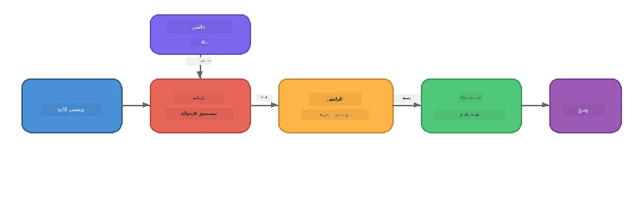

# بخش ۴: ساخت یک برنامه RAG با Foundry Local

## مرور کلی

مدل‌های زبان بزرگ قدرتمند هستند، اما تنها آنچه در داده‌های آموزشی خود داشته‌اند را می‌دانند. **تولید تقویت‌شده با بازیابی (RAG)** این مشکل را با دادن زمینه مربوطه به مدل در زمان پرسش حل می‌کند - که از اسناد، پایگاه داده‌ها، یا پایگاه‌های دانش خود شما استخراج می‌شود.

در این آزمایشگاه شما یک خط لوله کامل RAG می‌سازید که **کاملاً روی دستگاه شما اجرا می‌شود** با استفاده از Foundry Local. بدون خدمات ابری، بدون پایگاه داده برداری، بدون API جاسازی‌ها - فقط بازیابی محلی و یک مدل محلی.

## اهداف یادگیری

تا پایان این آزمایشگاه قادر خواهید بود:

- توضیح دهید RAG چیست و چرا برای برنامه‌های هوش مصنوعی اهمیت دارد
- یک پایگاه دانش محلی از اسناد متنی بسازید
- یک تابع بازیابی ساده برای یافتن زمینه مرتبط پیاده‌سازی کنید
- یک پرامپت سیستم بسازید که مدل را بر اساس حقایق بازیابی‌شده پایه‌گذاری کند
- خط لوله کامل بازیابی → تقویت → تولید را روی دستگاه اجرا کنید
- تفاوت‌ها بین بازیابی کلیدواژه ساده و جستجوی برداری را درک کنید

---

## پیش نیازها

- تکمیل [بخش ۳: استفاده از Foundry Local SDK با OpenAI](part3-sdk-and-apis.md)
- نصب Foundry Local CLI و دانلود مدل `phi-3.5-mini`

---

## مفهوم: RAG چیست؟

بدون RAG، یک مدل زبان بزرگ فقط می‌تواند از داده‌های آموزشی خود پاسخ دهد - که ممکن است قدیمی، ناقص، یا فاقد اطلاعات خصوصی شما باشد:

```
User: "What is Zava's return policy?"
LLM:  "I do not have information about Zava's return policy."  ← No context!
```

با RAG، ابتدا اسناد مرتبط **بازیابی** می‌شوند، سپس پرامپت با آن زمینه **تقویت** شده و پاسخ **تولید** می‌شود:



نکته کلیدی: **مدل لازم نیست جواب را "بداند"؛ فقط باید اسناد درست را بخواند.**

---

## تمرین‌های آزمایشگاه

### تمرین ۱: درک پایگاه دانش

مثال RAG مربوط به زبان خود را باز کنید و پایگاه دانش را بررسی کنید:

<details>
<summary><b>🐍 پایتون: <code>python/foundry-local-rag.py</code></b></summary>

پایگاه دانش یک لیست ساده از دیکشنری‌ها با فیلدهای `title` و `content` است:

```python
KNOWLEDGE_BASE = [
    {
        "title": "Foundry Local Overview",
        "content": (
            "Foundry Local brings the power of Azure AI Foundry to your local "
            "device without requiring an Azure subscription..."
        ),
    },
    {
        "title": "Supported Hardware",
        "content": (
            "Foundry Local automatically selects the best model variant for "
            "your hardware. If you have an Nvidia CUDA GPU it downloads the "
            "CUDA-optimized model..."
        ),
    },
    # ... ورودی‌های بیشتر
]
```

هر ورودی نمایانگر یک "بخش" دانش است - یک قطعه متمرکز اطلاعات درباره یک موضوع.

</details>

<details>
<summary><b>📘 جاوااسکریپت: <code>javascript/foundry-local-rag.mjs</code></b></summary>

پایگاه دانش از همان ساختار آرایه‌ای از اشیاء استفاده می‌کند:

```javascript
const KNOWLEDGE_BASE = [
  {
    title: "Foundry Local Overview",
    content:
      "Foundry Local brings the power of Azure AI Foundry to your local " +
      "device without requiring an Azure subscription...",
  },
  {
    title: "Supported Hardware",
    content:
      "Foundry Local automatically selects the best model variant for " +
      "your hardware...",
  },
  // ... ورودی های بیشتر
];
```

</details>

<details>
<summary><b>💜 سی‌شارپ: <code>csharp/RagPipeline.cs</code></b></summary>

پایگاه دانش از یک لیست زوج‌های نام‌گذاری‌شده استفاده می‌کند:

```csharp
private static readonly List<(string Title, string Content)> KnowledgeBase =
[
    ("Foundry Local Overview",
     "Foundry Local brings the power of Azure AI Foundry to your local " +
     "device without requiring an Azure subscription..."),

    ("Supported Hardware",
     "Foundry Local automatically selects the best model variant for " +
     "your hardware..."),

    // ... more entries
];
```

</details>

> **در یک برنامه واقعی**، پایگاه دانش می‌تواند از فایل‌های روی دیسک، پایگاه داده، فهرست جستجو یا API بیاید. برای این آزمایشگاه، از یک لیست در حافظه برای ساده‌سازی استفاده می‌کنیم.

---

### تمرین ۲: درک تابع بازیابی

گام بازیابی، مرتبط‌ترین بخش‌ها را برای سؤال کاربر پیدا می‌کند. این مثال از **همپوشانی کلیدواژه‌ها** استفاده می‌کند - شمارش تعداد کلمات پرسش که در هر بخش هم رخ داده‌اند:

<details>
<summary><b>🐍 پایتون</b></summary>

```python
def retrieve(query: str, top_k: int = 2) -> list[dict]:
    """Return the top-k knowledge chunks most relevant to the query."""
    query_words = set(query.lower().split())
    scored = []
    for chunk in KNOWLEDGE_BASE:
        chunk_words = set(chunk["content"].lower().split())
        overlap = len(query_words & chunk_words)
        scored.append((overlap, chunk))
    scored.sort(key=lambda x: x[0], reverse=True)
    return [item[1] for item in scored[:top_k]]
```

</details>

<details>
<summary><b>📘 جاوااسکریپت</b></summary>

```javascript
function retrieve(query, topK = 2) {
  const queryWords = new Set(query.toLowerCase().split(/\s+/));
  const scored = KNOWLEDGE_BASE.map((chunk) => {
    const chunkWords = new Set(chunk.content.toLowerCase().split(/\s+/));
    let overlap = 0;
    for (const w of queryWords) {
      if (chunkWords.has(w)) overlap++;
    }
    return { overlap, chunk };
  });
  scored.sort((a, b) => b.overlap - a.overlap);
  return scored.slice(0, topK).map((s) => s.chunk);
}
```

</details>

<details>
<summary><b>💜 سی‌شارپ</b></summary>

```csharp
private static List<(string Title, string Content)> Retrieve(string query, int topK = 2)
{
    var queryWords = new HashSet<string>(
        query.ToLowerInvariant().Split(' ', StringSplitOptions.RemoveEmptyEntries));

    return KnowledgeBase
        .Select(chunk =>
        {
            var chunkWords = new HashSet<string>(
                chunk.Content.ToLowerInvariant().Split(' ', StringSplitOptions.RemoveEmptyEntries));
            var overlap = queryWords.Intersect(chunkWords).Count();
            return (Overlap: overlap, Chunk: chunk);
        })
        .OrderByDescending(x => x.Overlap)
        .Take(topK)
        .Select(x => x.Chunk)
        .ToList();
}
```

</details>

**نحوه کارکرد:**
1. پرسش را به کلمات جداگانه تقسیم می‌کند
2. برای هر بخش دانش، تعداد کلمات پرسش موجود در آن بخش را می‌شمارد
3. بر اساس امتیاز همپوشانی (بیشترین اول) مرتب می‌کند
4. برترین k بخش مرتبط را برمی‌گرداند

> **محدودیت:** همپوشانی کلیدواژه ساده و محدود است؛ معنی یا مترادف‌ها را نمی‌فهمد. سیستم‌های RAG حرفه‌ای معمولاً از **بردارهای جاسازی** و یک **پایگاه داده برداری** برای جستجوی معنایی استفاده می‌کنند. با این حال، همپوشانی کلیدواژه نقطه شروع خوبی است و وابستگی اضافی ندارد.

---

### تمرین ۳: درک پرامپت تقویت‌شده

زمینه بازیابی‌شده قبل از ارسال به مدل در **پرامپت سیستم** تزریق می‌شود:

```python
system_prompt = (
    "You are a helpful assistant. Answer the user's question using ONLY "
    "the information provided in the context below. If the context does "
    "not contain enough information, say so.\n\n"
    f"Context:\n{context_text}"
)
```

تصمیمات کلیدی طراحی:
- **"تنها اطلاعات ارائه‌شده"** - از توهم زدن مدل درباره حقایق خارج از زمینه جلوگیری می‌کند
- **"اگر زمینه اطلاعات کافی ندارد، این را بگو"** - پاسخ‌های صادقانه "نمی‌دانم" را تشویق می‌کند
- زمینه در پیام سیستم قرار می‌گیرد تا روی تمام پاسخ‌ها اثر بگذارد

---

### تمرین ۴: اجرای خط لوله RAG

مثال کامل را اجرا کنید:

**پایتون:**
```bash
cd python
python foundry-local-rag.py
```

**جاوااسکریپت:**
```bash
cd javascript
node foundry-local-rag.mjs
```

**سی‌شارپ:**
```bash
cd csharp
dotnet run rag
```

شما باید سه چیز چاپ شده ببینید:
1. **سؤال** پرسیده شده
2. **زمینه بازیابی شده** - بخش‌های انتخاب شده از پایگاه دانش
3. **پاسخ** - تولید شده توسط مدل فقط با آن زمینه

نمونه خروجی:
```
Question: How do I install Foundry Local and what hardware does it support?

--- Retrieved Context ---
### Installation
On Windows install Foundry Local with: winget install Microsoft.FoundryLocal...

### Supported Hardware
Foundry Local automatically selects the best model variant for your hardware...
-------------------------

Answer: To install Foundry Local, you can use the following methods depending
on your operating system: On Windows, run `winget install Microsoft.FoundryLocal`.
On macOS, use `brew install microsoft/foundrylocal/foundrylocal`...
```

توجه کنید پاسخ مدل کاملاً در زمینه بازیابی‌شده پایه دارد - فقط حقایق موجود در اسناد پایگاه دانش را ذکر می‌کند.

---

### تمرین ۵: آزمایش و گسترش

این تغییرات را برای تعمیق درک خود امتحان کنید:

1. **سؤال را تغییر دهید** - چیزی بپرسید که در پایگاه دانش باشد یا نباشد:
   ```python
   question = "What programming languages does Foundry Local support?"  # ← در زمینه
   question = "How much does Foundry Local cost?"                       # ← خارج از زمینه
   ```
 آیا مدل وقتی پاسخ در زمینه نیست درست "نمی‌دانم" می‌گوید؟

2. **یک بخش دانش جدید اضافه کنید** - یک ورودی جدید به `KNOWLEDGE_BASE` اضافه کنید:
   ```python
   {
       "title": "Pricing",
       "content": "Foundry Local is completely free and open source under the MIT license.",
   }
   ```
 سپس دوباره سؤال قیمت‌گذاری را بپرسید.

3. **مقدار `top_k` را تغییر دهید** - بخش‌های بیشتری یا کمتری بازیابی کنید:
   ```python
   context_chunks = retrieve(question, top_k=3)  # با زمینه بیشتر
   context_chunks = retrieve(question, top_k=1)  # با زمینه کمتر
   ```
 میزان زمینه چگونه کیفیت پاسخ را تحت تأثیر قرار می‌دهد؟

4. **دستور پایه‌گذاری را حذف کنید** - پرامپت سیستم را فقط به "شما یک دستیار کمک‌کننده هستید." تغییر دهید و ببینید آیا مدل شروع به توهم زدن می‌کند یا خیر.

---

## بررسی عمیق: بهینه‌سازی RAG برای عملکرد روی دستگاه

اجرای RAG روی دستگاه محدودیت‌هایی دارد که در ابر با آن مواجه نیستید: حافظه محدود، بدون GPU اختصاصی (اجرای CPU/NPU)، و پنجره متن کوچک مدل. تصمیمات طراحی زیر مستقیماً این محدودیت‌ها را هدف گرفته‌اند و بر اساس الگوهایی از برنامه‌های RAG محلی حرفه‌ای ساخته شده با Foundry Local است.

### استراتژی تقسیم‌بندی: پنجره لغزشی با اندازه ثابت

تقسیم‌بندی - نحوه تقسیم اسناد به قطعات - یکی از تصمیمات مهم در هر سیستم RAG است. برای موقعیت‌های روی دستگاه، **پنجره لغزشی با اندازه ثابت و همپوشانی** نقطه شروع توصیه شده است:

| پارامتر | مقدار پیشنهادی | چرا |
|---------|----------------|-----|
| **اندازه بخش** | حدود ۲۰۰ توکن | زمینه بازیابی‌شده جمع و جور می‌ماند و در پنجره متن Phi-3.5 Mini جا برای پرامپت سیستم، تاریخچه گفتگو و خروجی تولید شده می‌ماند |
| **همپوشانی** | حدود ۲۵ توکن (۱۲.۵٪) | از دست رفتن اطلاعات در مرزهای بخش جلوگیری می‌کند - برای دستورالعمل‌های مرحله به مرحله مهم است |
| **توکنیزه کردن** | تقسیم بر فواصل سفید | بدون وابستگی‌ها، نیاز به کتابخانه توکنیزه‌کننده نیست. تمام بودجه محاسباتی صرف مدل می‌شود |

همپوشانی مانند پنجره لغزشی است: هر بخش جدید از ۲۵ توکن قبل از پایان بخش قبلی شروع می‌شود، بنابراین جملاتی که در مرز بخش‌ها قرار دارند در هر دو بخش تکرار می‌شوند.

> **چرا استراتژی‌های دیگر نه؟**
> - **تقسیم بر اساس جمله** اندازه بخش‌ها را غیرقابل پیش‌بینی می‌کند؛ برخی روش‌های ایمنی جملات طولانی هستند که خوب تقسیم نمی‌شوند
> - **تقسیم آگاه به بخش** (بر اساس سرفصل‌های `##`) اندازه بخش‌ها بسیار متفاوت می‌شود - بعضی خیلی کوچک و بعضی خیلی بزرگ برای پنجره متن مدل
> - **تقسیم معنایی** (شناسایی موضوع با جاسازی) بهترین کیفیت بازیابی را دارد، اما نیاز به مدل ثانویه در حافظه کنار Phi-3.5 Mini دارد - ریسک بالا روی سخت‌افزار با حافظه مشترک ۸-۱۶ گیگابایت

### ارتقاء بازیابی: بردارهای TF-IDF

روش همپوشانی کلیدواژه در این آزمایشگاه کار می‌کند، اما اگر می‌خواهید بازیابی بهتری بدون افزودن مدل جاسازی داشته باشید، **TF-IDF (فرکانس واژه - معکوس فرکانس سند)** میان‌راه عالی است:

```
Keyword Overlap  →  TF-IDF Vectors  →  Embedding Models
    (this lab)     (lightweight upgrade)   (production)
  Simple & fast    Better ranking,         Best quality,
  No dependencies  still no ML model       requires embedding model
  ~Basic matching  ~1ms retrieval          ~100-500ms per query
```

TF-IDF هر بخش را به برداری عددی تبدیل می‌کند بر اساس اهمیت هر کلمه در آن بخش *نسبت به تمام بخش‌ها*. در زمان پرسش، سؤال به همان شکل برداری می‌شود و با شباهت کسینوسی مقایسه می‌شود. می‌توانید این را با SQLite و جاوااسکریپت/پایتون خالص پیاده‌سازی کنید - بدون پایگاه داده برداری، بدون API جاسازی.

> **عملکرد:** شباهت کسینوسی TF-IDF روی بخش‌های اندازه ثابت معمولاً با **حدود ۱ میلی‌ثانیه زمان بازیابی** انجام می‌شود، در حالی که مدل جاسازی هر پرسش را حدود ۱۰۰-۵۰۰ میلی‌ثانیه کدگذاری می‌کند. همه ۲۰+ سند می‌توانند کمتر از ۱ ثانیه بخش‌بندی و نمایه‌سازی شوند.

### حالت Edge/Compact برای دستگاه‌های محدود

وقتی روی سخت‌افزار بسیار محدود (لپ‌تاپ‌های قدیمی، تبلت‌ها، دستگاه‌های میدانی) اجرا می‌کنید، می‌توانید با کوچک کردن سه گزینه مصرف منابع را کاهش دهید:

| تنظیمات | حالت استاندارد | حالت Edge/Compact |
|---------|----------------|-------------------|
| **پرامپت سیستم** | حدود ۳۰۰ توکن | حدود ۸۰ توکن |
| **حداکثر توکن خروجی** | ۱۰۲۴ | ۵۱۲ |
| **بخش‌های بازیابی‌شده (top-k)** | ۵ | ۳ |

بخش‌های کمتر بازیابی‌شده یعنی زمینه کمتر برای پردازش مدل که تأخیر و فشار حافظه را کاهش می‌دهد. پرامپت سیستم کوتاه‌تر فضای پنجره متن بیشتری برای پاسخ واقعی آزاد می‌کند. این تعادل روی دستگاه‌هایی که هر توکن در پنجره متن اهمیت دارد، ارزشمند است.

### یک مدل در حافظه

یکی از اصول مهم RAG روی دستگاه: **فقط یک مدل لود شود**. اگر برای بازیابی یک مدل جاسازی و برای تولید یک مدل زبان استفاده کنید، منابع محدود NPU/RAM بین دو مدل تقسیم می‌شود. بازیابی سبک (همپوشانی کلیدواژه، TF-IDF) این مشکل را کاملاً حل می‌کند:

- بدون مدل جاسازی رقابت‌کننده برای حافظه با LLM
- شروع سریع‌تر - فقط یک مدل لود می‌شود
- مصرف حافظه پیش‌بینی‌شده - LLM تمام منابع را دارد
- روی ماشین‌هایی با حافظه فقط ۸ گیگابایت کار می‌کند

### SQLite به عنوان فروشگاه برداری محلی

برای مجموعه‌های اسناد کوچک تا متوسط (صدها تا هزاران بخش)، **SQLite به اندازه کافی سریع** برای جستجوی کسینوسی ساده است و نیاز به هیچ زیرساختی ندارد:

- یک فایل `.db` روی دیسک - بدون پردازش سرور یا پیکربندی
- همراه هر محیط زمان اجرای زبان‌های اصلی (پایتون `sqlite3`، Node.js `better-sqlite3`, .NET `Microsoft.Data.Sqlite`)
- بخش‌های سند را همراه بردارهای TF-IDF در یک جدول ذخیره می‌کند
- نیازی به Pinecone، Qdrant، Chroma یا FAISS در این مقیاس نیست

### خلاصه عملکرد

این انتخاب‌های طراحی کنار هم اجرای پاسخگوی RAG روی سخت‌افزار مصرف‌کننده را ارائه می‌دهند:

| معیار | عملکرد روی دستگاه |
|--------|--------------------|
| **زمان تاخیر بازیابی** | حدود ۱ میلی‌ثانیه (TF-IDF) تا ۵ میلی‌ثانیه (همپوشانی کلیدواژه) |
| **سرعت دریافت داده** | ۲۰ سند بخش‌بندی و نمایه‌سازی شده در کمتر از ۱ ثانیه |
| **مدل‌ها در حافظه** | ۱ (فقط LLM - بدون مدل جاسازی) |
| **فضای ذخیره‌سازی** | کمتر از ۱ مگابایت برای بخش‌ها + بردارها در SQLite |
| **شروع سرد** | بارگذاری یک مدل، بدون راه‌اندازی محیط اجرایی جاسازی |
| **سخت‌افزار مورد نیاز** | ۸ گیگابایت رم، فقط CPU (نیاز به GPU ندارد) |

> **چه زمانی ارتقا دهید:** اگر به صدها سند بلند، انواع محتوای مختلط (جداول، کد، متن) می‌رسید یا به فهم معنایی پرسش‌ها نیاز دارید، استفاده از مدل جاسازی و جستجوی شباهت برداری را مد نظر داشته باشید. برای اکثر موارد استفاده روی دستگاه با مجموعه اسناد متمرکز، TF-IDF + SQLite نتایج عالی با حداقل مصرف منابع ارائه می‌دهد.

---

## مفاهیم کلیدی

| مفهوم | توضیح |
|-------|--------|
| **بازیابی** | یافتن اسناد مرتبط از پایگاه دانش بر اساس پرسش کاربر |
| **تقویت** | قرار دادن اسناد بازیابی‌شده در پرامپت به عنوان زمینه |
| **تولید** | تولید پاسخ توسط LLM با اتکا بر زمینه ارائه شده |
| **تقسیم‌بندی** | شکستن اسناد بزرگ به قطعات کوچکتر و متمرکز |
| **پایه‌گذاری** | محدود کردن مدل به استفاده تنها از زمینه ارائه شده (کاهش توهم) |
| **Top-k** | تعداد بخش‌های مرتبط برای بازیابی |

---

## RAG در تولید در برابر این آزمایشگاه

| جنبه | این آزمایشگاه | بهینه‌شده روی دستگاه | تولید ابری |
|-------|---------------|----------------------|-----------|
| **پایگاه دانش** | لیست در حافظه | فایل‌ها روی دیسک، SQLite | پایگاه داده، فهرست جستجو |
| **بازیابی** | همپوشانی کلیدواژه | TF-IDF + شباهت کسینوسی | جاسازی برداری + جستجوی شباهت |
| **جاسازی‌ها** | نیاز نیست | نیاز نیست - بردارهای TF-IDF | مدل جاسازی (محلی یا ابری) |
| **پایگاه برداری** | نیاز نیست | SQLite (یک فایل `.db`) | FAISS، Chroma، Azure AI Search و غیره |
| **تقسیم‌بندی** | دستی | پنجره لغزشی اندازه ثابت (~۲۰۰ توکن، همپوشانی ۲۵ توکن) | تقسیم معنایی یا بازگشتی |
| **مدل‌ها در حافظه** | ۱ (LLM) | ۱ (LLM) | ۲+ (جاسازی + LLM) |
| **زمان تأخیر بازیابی** | ~۵ میلی‌ثانیه | ~۱ میلی‌ثانیه | ~۱۰۰-۵۰۰ میلی‌ثانیه |
| **مقیاس** | ۵ سند | صدها سند | میلیون‌ها سند |

الگوهایی که اینجا یاد می‌گیرید (بازیابی، افزایش، تولید) در هر مقیاسی یکسان هستند. روش بازیابی بهبود می‌یابد، اما معماری کلی یکسان باقی می‌ماند. ستون میانی نشان می‌دهد که چه چیزی می‌تواند به صورت محلی روی دستگاه با تکنیک‌های سبک وزن انجام شود، که اغلب نقطه‌ی ایده‌آل برای برنامه‌های محلی است که در آن مقیاس ابری را برای حفظ حریم خصوصی، قابلیت کار آفلاین و بدون تأخیر در خدمات خارجی فدا می‌کنید.

---

## نکات کلیدی

| مفهوم | چیزی که یاد گرفتید |
|---------|------------------|
| الگوی RAG | بازیابی + افزایش + تولید: به مدل زمینه مناسب بدهید تا بتواند به سوالات داده‌های شما پاسخ دهد |
| روی دستگاه | همه چیز به صورت محلی اجرا می‌شود بدون نیاز به APIهای ابری یا اشتراک پایگاه داده برداری |
| دستورالعمل‌های تثبیت | محدودیت‌های درخواست سیستم برای جلوگیری از توهم‌سازی حیاتی است |
| همپوشانی کلمات کلیدی | یک نقطه شروع ساده اما موثر برای بازیابی |
| TF-IDF + SQLite | مسیر ارتقاء سبک وزنی که بازیابی را زیر ۱ میلی‌ثانیه نگه می‌دارد بدون مدل جاسازی |
| یک مدل در حافظه | از بارگذاری مدل جاسازی کنار LLM در سخت‌افزار محدود اجتناب کنید |
| اندازه بخش | تقریباً ۲۰۰ توکن با همپوشانی به تعادل دقت بازیابی و کارایی پنجره متن کمک می‌کند |
| حالت لبه/فشرده | برای دستگاه‌های بسیار محدود از بخش‌های کمتر و پرسش‌های کوتاه‌تر استفاده کنید |
| الگوی جهانی | همان معماری RAG برای هر منبع داده‌ای کار می‌کند: اسناد، پایگاه داده‌ها، APIها یا ویکی‌ها |

> **می‌خواهید یک برنامه کامل RAG روی دستگاه ببینید؟** به [Gas Field Local RAG](https://github.com/leestott/local-rag) مراجعه کنید، یک عامل RAG آفلاین با سبک تولید ساخته شده با Foundry Local و Phi-3.5 Mini که این الگوهای بهینه‌سازی را با مجموعه‌ای واقعی از اسناد نشان می‌دهد.

---

## گام‌های بعدی

ادامه دهید به [بخش ۵: ساخت عامل‌های هوش مصنوعی](part5-single-agents.md) تا یاد بگیرید چگونه عامل‌های هوشمند با شخصیت، دستورالعمل‌ها و مکالمات چند مرحله‌ای با استفاده از چارچوب عامل مایکروسافت بسازید.

---

<!-- CO-OP TRANSLATOR DISCLAIMER START -->
**سلب مسئولیت**:  
این سند با استفاده از سرویس ترجمه ماشینی [Co-op Translator](https://github.com/Azure/co-op-translator) ترجمه شده است. در حالی که ما در تلاش برای دقت هستیم، لطفاً توجه داشته باشید که ترجمه‌های خودکار ممکن است حاوی خطاها یا نواقصی باشند. سند اصلی به زبان بومی آن باید به عنوان منبع معتبر در نظر گرفته شود. برای اطلاعات حیاتی، ترجمه حرفه‌ای انسانی توصیه می‌شود. ما در قبال هرگونه سوءتفاهم یا تفسیر نادرست ناشی از استفاده از این ترجمه مسئولیتی نداریم.
<!-- CO-OP TRANSLATOR DISCLAIMER END -->