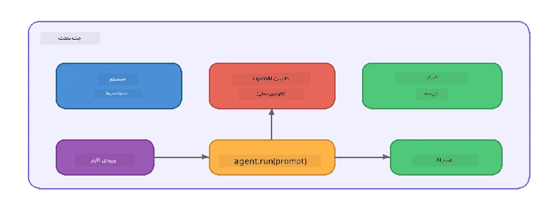

# بخش ۵: ساخت عامل‌های هوش مصنوعی با چارچوب عامل

> **هدف:** ساخت اولین عامل هوش مصنوعی با دستورالعمل‌های پایدار و شخصیت تعریف‌شده، با استفاده از مدل محلی از طریق Foundry Local.

## عامل هوش مصنوعی چیست؟

یک عامل هوش مصنوعی، یک مدل زبان را با **دستورالعمل‌های سیستمی** که رفتار، شخصیت و محدودیت‌های آن را تعریف می‌کنند، می‌پوشاند. بر خلاف فراخوانی تک‌مرتبه چت، یک عامل امکانات زیر را فراهم می‌کند:

- **شخصیت** - هویت ثابتی ("شما یک بازبین کد مفید هستید")
- **حافظه** - تاریخچه مکالمه در بین نوبت‌ها
- **تخصص** - رفتار متمرکز شده که براساس دستورالعمل‌های دقیق توسعه یافته است



---

## چارچوب عامل مایکروسافت

**چارچوب عامل مایکروسافت** (AGF) یک انتزاع استاندارد عامل را فراهم می‌کند که در بک‌اندهای مختلف مدل کار می‌کند. در این کارگاه، آن را با Foundry Local جفت می‌کنیم تا همه چیز روی دستگاه شما اجرا شود - بدون نیاز به فضای ابری.

| مفهوم | توضیح |
|---------|-------------|
| `FoundryLocalClient` | پایتون: شروع سرویس، دانلود/بارگذاری مدل، و ایجاد عامل‌ها را مدیریت می‌کند |
| `client.as_agent()` | پایتون: از کلاینت Foundry Local یک عامل می‌سازد |
| `AsAIAgent()` | سی‌شارپ: متد توسعه‌ای روی `ChatClient` - یک `AIAgent` می‌سازد |
| `instructions` | پرامپت سیستمی که رفتار عامل را شکل می‌دهد |
| `name` | برچسب قابل خواندن برای انسان، مفید در سناریوهای چند عامله |
| `agent.run(prompt)` / `RunAsync()` | پیام کاربر ارسال و پاسخ عامل را برمی‌گرداند |

> **نکته:** چارچوب عامل SDKهای پایتون و دات‌نت دارد. برای جاوااسکریپت، ما یک کلاس سبک `ChatAgent` پیاده‌سازی می‌کنیم که الگوی مشابه را با استفاده مستقیم از OpenAI SDK تکرار می‌کند.

---

## تمرین‌ها

### تمرین ۱ - درک الگوی عامل

قبل از نوشتن کد، اجزای کلیدی یک عامل را مطالعه کنید:

1. **کلاینت مدل** - اتصال به API سازگار با OpenAI در Foundry Local
2. **دستورالعمل‌های سیستمی** - پرامپت "شخصیت"
3. **حلقه اجرا** - ارسال ورودی کاربر، دریافت خروجی

> **فکر کنید:** دستورالعمل‌های سیستمی چگونه با پیام معمولی کاربر متفاوت است؟ اگر آنها را تغییر دهید چه اتفاقی می‌افتد؟

---

### تمرین ۲ - اجرای نمونه یک عامل

<details>
<summary><strong>🐍 پایتون</strong></summary>

**پیش‌نیازها:**
```bash
cd python
python -m venv venv

# ویندوز (پاورشل):
venv\Scripts\Activate.ps1
# مک‌اواس:
source venv/bin/activate

pip install -r requirements.txt
```

**اجرّا:**
```bash
python foundry-local-with-agf.py
```

**بررسی کد** (`python/foundry-local-with-agf.py`):

```python
import asyncio
from agent_framework_foundry_local import FoundryLocalClient

async def main():
    alias = "phi-4-mini"

    # کلاینت FoundryLocal مسئول شروع سرویس، دانلود مدل و بارگذاری است
    client = FoundryLocalClient(model_id=alias)
    print(f"Client Model ID: {client.model_id}")

    # ایجاد یک عامل با دستورالعمل‌های سیستم
    agent = client.as_agent(
        name="Joker",
        instructions="You are good at telling jokes.",
    )

    # غیرپخش زنده: دریافت پاسخ کامل به صورت همزمان
    result = await agent.run("Tell me a joke about a pirate.")
    print(f"Agent: {result}")

    # پخش زنده: دریافت نتایج در حین تولید شدن
    async for chunk in agent.run("Tell me another joke.", stream=True):
        if chunk.text:
            print(chunk.text, end="", flush=True)

asyncio.run(main())
```

**نکات کلیدی:**
- `FoundryLocalClient(model_id=alias)` شروع سرویس، دانلود و بارگذاری مدل را در یک مرحله انجام می‌دهد
- `client.as_agent()` عاملی با دستورالعمل‌های سیستمی و نام ایجاد می‌کند
- `agent.run()` حالت‌های غیرجریان و جریان را پشتیبانی می‌کند
- نصب با دستور `pip install agent-framework-foundry-local --pre`

</details>

<details>
<summary><strong>📦 جاوااسکریپت</strong></summary>

**پیش‌نیازها:**
```bash
cd javascript
npm install
```

**اجرّا:**
```bash
node foundry-local-with-agent.mjs
```

**بررسی کد** (`javascript/foundry-local-with-agent.mjs`):

```javascript
import { OpenAI } from "openai";
import { FoundryLocalManager } from "foundry-local-sdk";

class ChatAgent {
  constructor({ client, modelId, instructions, name }) {
    this.client = client;
    this.modelId = modelId;
    this.instructions = instructions;
    this.name = name;
    this.history = [];
  }

  async run(userMessage) {
    const messages = [
      { role: "system", content: this.instructions },
      ...this.history,
      { role: "user", content: userMessage },
    ];
    const response = await this.client.chat.completions.create({
      model: this.modelId,
      messages,
    });
    const assistantMessage = response.choices[0].message.content;

    // نگه‌داشتن تاریخچهٔ گفتگو برای تعاملات چندمرحله‌ای
    this.history.push({ role: "user", content: userMessage });
    this.history.push({ role: "assistant", content: assistantMessage });
    return { text: assistantMessage };
  }
}

async function main() {
  FoundryLocalManager.create({ appName: "FoundryLocalWorkshop" });
  const manager = FoundryLocalManager.instance;
  await manager.startWebService();

  const catalog = manager.catalog;
  const model = await catalog.getModel("phi-3.5-mini");
  if (!model.isCached) {
    console.log("Downloading model: phi-3.5-mini...");
    await model.download();
  }
  await model.load();

  const client = new OpenAI({
    baseURL: manager.urls[0] + "/v1",
    apiKey: "foundry-local",
  });

  const agent = new ChatAgent({
    client,
    modelId: model.id,
    instructions: "You are good at telling jokes.",
    name: "Joker",
  });

  const result = await agent.run("Tell me a joke about a pirate.");
  console.log(result.text);
}

main();
```

**نکات کلیدی:**
- جاوااسکریپت کلاس `ChatAgent` خود را ساخته که الگوی AGF پایتون را بازتولید می‌کند
- `this.history` گردش‌های مکالمه را برای پشتیبانی چند نوبته ذخیره می‌کند
- اجراهای متوالی `startWebService()` → بررسی کش → `model.download()` → `model.load()` کنترل کامل را فراهم می‌کند

</details>

<details>
<summary><strong>💜 سی‌شارپ</strong></summary>

**پیش‌نیازها:**
```bash
cd csharp
dotnet restore
```

**اجرّا:**
```bash
dotnet run agent
```

**بررسی کد** (`csharp/SingleAgent.cs`):

```csharp
using Microsoft.AI.Foundry.Local;
using Microsoft.Extensions.Logging.Abstractions;
using Microsoft.Agents.AI;
using OpenAI;
using System.ClientModel;

// 1. Start Foundry Local and load a model
var alias = "phi-3.5-mini";
await FoundryLocalManager.CreateAsync(
    new Configuration
    {
        AppName = "FoundryLocalSamples",
        Web = new Configuration.WebService { Urls = "http://127.0.0.1:0" }
    }, NullLogger.Instance, default);
var manager = FoundryLocalManager.Instance;
await manager.StartWebServiceAsync(default);

var catalog = await manager.GetCatalogAsync(default);
var model = await catalog.GetModelAsync(alias, default);

var isCached = await model.IsCachedAsync(default);
if (!isCached)
{
    Console.WriteLine($"Downloading model: {alias}...");
    await model.DownloadAsync(null, default);
}
await model.LoadAsync(default);

var key = new ApiKeyCredential("foundry-local");
var client = new OpenAIClient(key, new OpenAIClientOptions
{
    Endpoint = new Uri(manager.Urls[0] + "/v1")
});

// 2. Create an AIAgent using the Agent Framework extension method
AIAgent joker = client
    .GetChatClient(model.Id)
    .AsAIAgent(
        instructions: "You are good at telling jokes. Keep your jokes short and family-friendly.",
        name: "Joker"
    );

// 3. Run the agent (non-streaming)
var response = await joker.RunAsync("Tell me a joke about a pirate.");
Console.WriteLine($"Joker: {response}");

// 4. Run with streaming
await foreach (var update in joker.RunStreamingAsync("Tell me another joke."))
{
    Console.Write(update);
}
```

**نکات کلیدی:**
- `AsAIAgent()` متد توسعه‌ای از `Microsoft.Agents.AI.OpenAI` است - نیازی به کلاس `ChatAgent` سفارشی نیست
- `RunAsync()` پاسخ کامل را برمی‌گرداند؛ `RunStreamingAsync()` به صورت توکن به توکن جریان می‌دهد
- نصب با دستور `dotnet add package Microsoft.Agents.AI.OpenAI --version 1.0.0-rc3`

</details>

---

### تمرین ۳ - تغییر شخصیت

دستورالعمل‌های عامل `instructions` را تغییر دهید تا شخصیت متفاوتی بسازید. هر کدام را امتحان کنید و ببینید خروجی چگونه تغییر می‌کند:

| شخصیت | دستورالعمل‌ها |
|---------|-------------|
| بازبین کد | `"شما یک بازبین کد خبره هستید. بازخورد سازنده با تمرکز بر خوانایی، عملکرد و درستی ارائه دهید."` |
| راهنمای سفر | `"شما یک راهنمای سفر دوستانه هستید. توصیه‌های شخصی‌سازی شده درباره مقصدها، فعالیت‌ها و غذاهای محلی بدهید."` |
| معلم سقراطی | `"شما یک معلم سقراطی هستید. هرگز پاسخ مستقیم ندهید - به جای آن با سوالات تأمل‌برانگیز دانش‌آموز را هدایت کنید."` |
| نویسنده فنی | `"شما نویسنده فنی هستید. مفاهیم را واضح و مختصر توضیح دهید. از مثال استفاده کنید. از اصطلاحات پیچیده بپرهیزید."` |

**امتحان کنید:**
1. یک شخصیت از جدول بالا انتخاب کنید
2. رشته `instructions` را در کد جایگزین کنید
3. پرامپت کاربری را متناسب تنظیم کنید (مثلاً از بازبین کد بخواهید یک تابع را بررسی کند)
4. نمونه را دوباره اجرا کرده و خروجی را مقایسه کنید

> **نکته:** کیفیت عامل به شدت به دستورالعمل‌ها وابسته است. دستورالعمل‌های مشخص و ساختارمند نتایج بهتری نسبت به مبهم‌ها تولید می‌کنند.

---

### تمرین ۴ - افزودن مکالمه چند نوبتی

نمونه را گسترش دهید تا از یک حلقه چت چند نوبتی پشتیبانی کند تا بتوانید مکالمه رفت و برگشتی با عامل داشته باشید.

<details>
<summary><strong>🐍 پایتون - حلقه چند نوبتی</strong></summary>

```python
import asyncio
from agent_framework_foundry_local import FoundryLocalClient

async def main():
    client = FoundryLocalClient(model_id="phi-4-mini")

    agent = client.as_agent(
        name="Assistant",
        instructions="You are a helpful assistant.",
    )

    print("Chat with the agent (type 'quit' to exit):\n")
    while True:
        user_input = input("You: ")
        if user_input.strip().lower() in ("quit", "exit"):
            break
        result = await agent.run(user_input)
        print(f"Agent: {result}\n")

asyncio.run(main())
```

</details>

<details>
<summary><strong>📦 جاوااسکریپت - حلقه چند نوبتی</strong></summary>

```javascript
import { OpenAI } from "openai";
import { FoundryLocalManager } from "foundry-local-sdk";
import * as readline from "node:readline/promises";

// (استفاده مجدد از کلاس ChatAgent از تمرین ۲)

async function main() {
  FoundryLocalManager.create({ appName: "FoundryLocalWorkshop" });
  const manager = FoundryLocalManager.instance;
  await manager.startWebService();

  const catalog = manager.catalog;
  const model = await catalog.getModel("phi-3.5-mini");
  if (!model.isCached) {
    console.log("Downloading model: phi-3.5-mini...");
    await model.download();
  }
  await model.load();

  const client = new OpenAI({
    baseURL: manager.urls[0] + "/v1",
    apiKey: "foundry-local",
  });

  const agent = new ChatAgent({
    client,
    modelId: model.id,
    instructions: "You are a helpful assistant.",
    name: "Assistant",
  });

  const rl = readline.createInterface({
    input: process.stdin,
    output: process.stdout,
  });

  console.log("Chat with the agent (type 'quit' to exit):\n");
  while (true) {
    const userInput = await rl.question("You: ");
    if (["quit", "exit"].includes(userInput.trim().toLowerCase())) break;
    const result = await agent.run(userInput);
    console.log(`Agent: ${result.text}\n`);
  }
  rl.close();
}

main();
```

</details>

<details>
<summary><strong>💜 سی‌شارپ - حلقه چند نوبتی</strong></summary>

```csharp
using Microsoft.AI.Foundry.Local;
using Microsoft.Extensions.Logging.Abstractions;
using Microsoft.Agents.AI;
using OpenAI;
using System.ClientModel;

var alias = "phi-3.5-mini";
var config = new Configuration
{
    AppName = "FoundryLocalSamples",
    Web = new Configuration.WebService { Urls = "http://127.0.0.1:0" }
};
await FoundryLocalManager.CreateAsync(config, NullLogger.Instance, default);
var manager = FoundryLocalManager.Instance;
await manager.StartWebServiceAsync(default);

var catalog = await manager.GetCatalogAsync(default);
var model = await catalog.GetModelAsync(alias, default);

var isCached = await model.IsCachedAsync(default);
if (!isCached)
{
    Console.WriteLine($"Downloading model: {alias}...");
    await model.DownloadAsync(null, default);
}
await model.LoadAsync(default);

var key = new ApiKeyCredential("foundry-local");
var client = new OpenAIClient(key, new OpenAIClientOptions
{
    Endpoint = new Uri(manager.Urls[0] + "/v1")
});

AIAgent agent = client
    .GetChatClient(model.Id)
    .AsAIAgent(
        instructions: "You are a helpful assistant.",
        name: "Assistant"
    );

Console.WriteLine("Chat with the agent (type 'quit' to exit):\n");
while (true)
{
    Console.Write("You: ");
    var userInput = Console.ReadLine();
    if (string.IsNullOrWhiteSpace(userInput) ||
        userInput.Equals("quit", StringComparison.OrdinalIgnoreCase) ||
        userInput.Equals("exit", StringComparison.OrdinalIgnoreCase))
        break;

    var result = await agent.RunAsync(userInput);
    Console.WriteLine($"Agent: {result}\n");
}
```

</details>

توجه کنید عامل چگونه نوبت‌های قبلی را به خاطر می‌آورد - یک سوال پیگیری بپرسید و ببینید زمینه چگونه حفظ می‌شود.

---

### تمرین ۵ - خروجی ساختارمند

به عامل دستور دهید همیشه به فرمت مشخصی پاسخ دهد (مثلاً JSON) و نتیجه را تحلیل کنید:

<details>
<summary><strong>🐍 پایتون - خروجی JSON</strong></summary>

```python
import asyncio
import json
from agent_framework_foundry_local import FoundryLocalClient

async def main():
    client = FoundryLocalClient(model_id="phi-4-mini")

    agent = client.as_agent(
        name="SentimentAnalyzer",
        instructions=(
            "You are a sentiment analysis agent. "
            "For every user message, respond ONLY with valid JSON in this format: "
            '{"sentiment": "positive|negative|neutral", "confidence": 0.0-1.0, "summary": "brief reason"}'
        ),
    )

    result = await agent.run("I absolutely loved the new restaurant downtown!")
    print("Raw:", result)

    try:
        parsed = json.loads(str(result))
        print(f"Sentiment: {parsed['sentiment']} (confidence: {parsed['confidence']})")
    except json.JSONDecodeError:
        print("Agent did not return valid JSON - try refining the instructions.")

asyncio.run(main())
```

</details>

<details>
<summary><strong>💜 سی‌شارپ - خروجی JSON</strong></summary>

```csharp
using System.Text.Json;

AIAgent analyzer = chatClient.AsAIAgent(
    name: "SentimentAnalyzer",
    instructions:
        "You are a sentiment analysis agent. " +
        "For every user message, respond ONLY with valid JSON in this format: " +
        "{\"sentiment\": \"positive|negative|neutral\", \"confidence\": 0.0-1.0, \"summary\": \"brief reason\"}"
);

var response = await analyzer.RunAsync("I absolutely loved the new restaurant downtown!");
Console.WriteLine($"Raw: {response}");

try
{
    var parsed = JsonSerializer.Deserialize<JsonElement>(response.ToString());
    Console.WriteLine($"Sentiment: {parsed.GetProperty("sentiment")} " +
                      $"(confidence: {parsed.GetProperty("confidence")})");
}
catch (JsonException)
{
    Console.WriteLine("Agent did not return valid JSON - try refining the instructions.");
}
```

</details>

> **نکته:** مدل‌های کوچک محلی همیشه خروجی JSON کاملاً معتبر تولید نمی‌کنند. می‌توانید با اضافه کردن نمونه در دستورالعمل‌ها و بیان بسیار صریح فرمت مورد انتظار، قابلیت اطمینان را افزایش دهید.

---

## نکات کلیدی

| مفهوم | آنچه یاد گرفتید |
|---------|-----------------|
| عامل در مقابل فراخوانی خام LLM | عامل مدل را با دستورالعمل‌ها و حافظه می‌پوشاند |
| دستورالعمل‌های سیستمی | مهم‌ترین اهرم برای کنترل رفتار عامل |
| مکالمه چند نوبتی | عامل‌ها می‌توانند زمینه را در چند تعامل کاربر حفظ کنند |
| خروجی ساختارمند | دستورالعمل‌ها می‌توانند فرمت خروجی را تحمیل کنند (JSON، مارک‌داون، و غیره) |
| اجرای محلی | همه چیز روی دستگاه با Foundry Local اجرا می‌شود - نیاز به فضای ابری نیست |

---

## مراحل بعدی

در **[بخش ۶: گردش‌کارهای چند عاملی](part6-multi-agent-workflows.md)**، چند عامل را در یک جریان هماهنگ ترکیب می‌کنید که هر عامل نقش تخصصی دارد.

---

<!-- CO-OP TRANSLATOR DISCLAIMER START -->
**سلب مسئولیت**:  
این سند با استفاده از سرویس ترجمه هوش مصنوعی [Co-op Translator](https://github.com/Azure/co-op-translator) ترجمه شده است. در حالی که ما در تلاش برای دقت هستیم، لطفاً توجه داشته باشید که ترجمه‌های خودکار ممکن است شامل خطاها یا نادرستی‌هایی باشند. سند اصلی به زبان بومی خود باید به عنوان منبع معتبر در نظر گرفته شود. برای اطلاعات حیاتی، ترجمه حرفه‌ای انسانی توصیه می‌شود. ما مسئول هیچ گونه سوء تفاهم یا تفسیر نادرستی که ناشی از استفاده از این ترجمه باشد، نیستیم.
<!-- CO-OP TRANSLATOR DISCLAIMER END -->