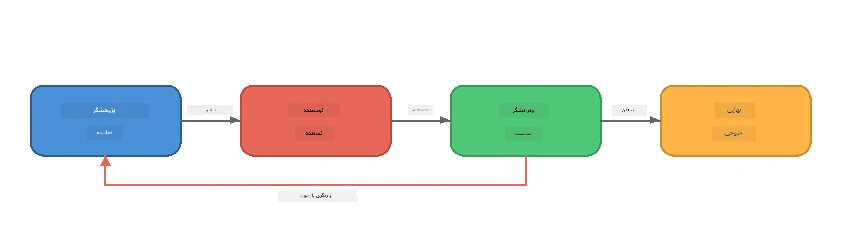
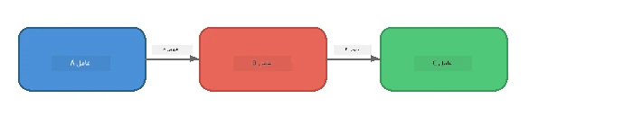
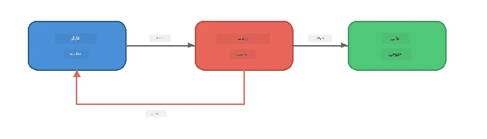
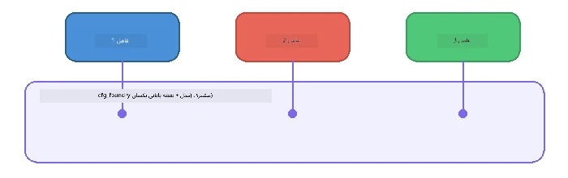

# بخش ۶: جریان‌های کاری چند عامله

> **هدف:** ترکیب چند عامل تخصصی در خطوط لوله هماهنگ شده که وظایف پیچیده را میان عوامل همکاری‌کننده تقسیم می‌کنند - که همه به‌صورت محلی با Foundry Local اجرا می‌شوند.

## چرا چند عامله؟

یک عامل واحد می‌تواند بسیاری از کارها را انجام دهد، اما جریان‌های کاری پیچیده از **تخصصی شدن** بهره‌مند می‌شوند. به جای اینکه یک عامل تلاش کند همزمان تحقیق، نوشتن و ویرایش کند، کار را به نقش‌های متمرکز تقسیم می‌کنید:



| الگو | توضیح |
|---------|-------------|
| **متوالی** | خروجی عامل A به عامل B → عامل C داده می‌شود |
| **حلقه بازخورد** | یک عامل ارزیاب می‌تواند کار را برای بازبینی ارسال کند |
| **زمینه مشترک** | همه عوامل از یک مدل/نقطه انتهایی یکسان استفاده می‌کنند، اما دستورالعمل‌های متفاوت دارند |
| **خروجی تایپ‌شده** | عوامل نتایج ساختاریافته (JSON) تولید می‌کنند برای انتقال‌های قابل اطمینان |

---

## تمرین‌ها

### تمرین ۱ - اجرای خط لوله چند عامله

کارگاه شامل یک جریان کامل پژوهشگر → نویسنده → ویراستار است.

<details>
<summary><strong>🐍 پایتون</strong></summary>

**راه‌اندازی:**
```bash
cd python
python -m venv venv

# ویندوز (پاورشل):
venv\Scripts\Activate.ps1
# مک‌اواس:
source venv/bin/activate

pip install -r requirements.txt
```

**اجرا:**
```bash
python foundry-local-multi-agent.py
```

**چه اتفاقی می‌افتد:**
1. **پژوهشگر** یک موضوع دریافت می‌کند و نکات کلیدی را به صورت فهرست بازمی‌گرداند
2. **نویسنده** پژوهش را می‌گیرد و یک پست وبلاگ پیش‌نویس می‌کند (۳-۴ پاراگراف)
3. **ویراستار** مقاله را برای کیفیت بررسی می‌کند و پاسخ می‌دهد پذیرش یا بازبینی

</details>

<details>
<summary><strong>📦 جاوااسکریپت</strong></summary>

**راه‌اندازی:**
```bash
cd javascript
npm install
```

**اجرا:**
```bash
node foundry-local-multi-agent.mjs
```

**همان خط لوله سه مرحله‌ای** - پژوهشگر → نویسنده → ویراستار.

</details>

<details>
<summary><strong>💜 سی‌شارپ</strong></summary>

**راه‌اندازی:**
```bash
cd csharp
dotnet restore
```

**اجرا:**
```bash
dotnet run multi
```

**همان خط لوله سه مرحله‌ای** - پژوهشگر → نویسنده → ویراستار.

</details>

---

### تمرین ۲ - کالبدشناسی خط لوله

مطالعه کنید که چگونه عوامل تعریف و متصل شده‌اند:

**۱. کلاینت مدل مشترک**

همه عوامل از مدل Foundry Local یکسان استفاده می‌کنند:

```python
# پایتون - FoundryLocalClient همه چیز را مدیریت می‌کند
from agent_framework_foundry_local import FoundryLocalClient

client = FoundryLocalClient(model_id="phi-3.5-mini")
```

```javascript
// جاوااسکریپت - کیت توسعه نرم‌افزار OpenAI اشاره شده به Foundry Local
const client = new OpenAI({
  baseURL: manager.urls[0] + "/v1",
  apiKey: "foundry-local",
});
```

```csharp
// C# - OpenAIClient pointed at Foundry Local
var key = new ApiKeyCredential("foundry-local");
var client = new OpenAIClient(key, new OpenAIClientOptions
{
    Endpoint = new Uri(manager.Urls[0] + "/v1")
});
var chatClient = client.GetChatClient(model.Id);
```

**۲. دستورالعمل‌های تخصصی**

هر عامل دارای یک شخصیت متمایز است:

| عامل | دستورالعمل‌ها (خلاصه) |
|-------|----------------------|
| پژوهشگر | "حقایق کلیدی، آمار و زمینه را ارائه دهید. به صورت نکات بولت‌دار سازماندهی کنید." |
| نویسنده | "یک پست وبلاگ جذاب (۳-۴ پاراگراف) از یادداشت‌های پژوهشی بنویسید. اطلاعات نادرست نسازید." |
| ویراستار | "برای وضوح، املاء و سازگاری اطلاعات بررسی کنید. حکم: پذیرش یا بازبینی." |

**۳. جریان داده بین عوامل**

```python
# مرحله ۱ - خروجی پژوهشگر تبدیل به ورودی نویسنده می‌شود
research_result = await researcher.run(f"Research: {topic}")

# مرحله ۲ - خروجی نویسنده تبدیل به ورودی ویراستار می‌شود
writer_result = await writer.run(f"Write using:\n{research_result}")

# مرحله ۳ - ویراستار هر دو پژوهش و مقاله را بررسی می‌کند
editor_result = await editor.run(
    f"Research:\n{research_result}\n\nArticle:\n{writer_result}"
)
```

```csharp
// C# - same pattern, async calls with AIAgent
var researchNotes = await researcher.RunAsync(
    $"Research the following topic and provide key facts:\n{topic}");

var draft = await writer.RunAsync(
    $"Write a blog post based on these research notes:\n\n{researchNotes}");

var verdict = await editor.RunAsync(
    $"Review this article for quality and accuracy.\n\n" +
    $"Research notes:\n{researchNotes}\n\n" +
    $"Article:\n{draft}");
```

> **بینش کلیدی:** هر عامل زمینه تجمعی ارسالی از عوامل قبلی را دریافت می‌کند. ویراستار هر دو متن پژوهش اصلی و پیش‌نویس را می‌بیند - این اجازه می‌دهد سازگاری حقایق بررسی شود.

---

### تمرین ۳ - افزودن چهارمین عامل

خط لوله را با افزودن یک عامل جدید گسترش دهید. یکی را انتخاب کنید:

| عامل | هدف | دستورالعمل‌ها |
|-------|---------|-------------|
| **راستی‌آزمایی** | بررسی ادعاهای مقاله | `"شما ادعاهای واقعی را بررسی می‌کنید. برای هر ادعا بگویید آیا توسط یادداشت‌های پژوهشی پشتیبانی می‌شود. JSON شامل موارد تایید شده/تایید نشده برگردانید."` |
| **نویسنده تیتر** | ایجاد عناوین جذاب | `"۵ گزینه تیتر برای مقاله تولید کنید. سبک‌ها را متنوع کنید: اطلاعاتی، کلیک‌خور، سوالی، فهرستی، احساسی."` |
| **رسانه‌های اجتماعی** | ایجاد پست‌های تبلیغاتی | `"۳ پست رسانه اجتماعی برای این مقاله ایجاد کنید: یکی برای توییتر (۲۸۰ کاراکتر)، یکی برای لینکدین (لحن حرفه‌ای)، یکی برای اینستاگرام (رسمی با پیشنهاد ایموجی)."` |

<details>
<summary><strong>🐍 پایتون - افزودن نویسنده تیتر</strong></summary>

```python
headline_agent = client.as_agent(
    name="HeadlineWriter",
    instructions=(
        "You are a headline specialist. Given an article, generate exactly "
        "5 headline options. Vary the style: informative, question-based, "
        "listicle, emotional, and provocative. Return them as a numbered list."
    ),
)

# پس از تایید ویرایشگر، عناوین را ایجاد کنید
headline_result = await headline_agent.run(
    f"Generate headlines for this article:\n\n{writer_result}"
)
print(f"\n--- Headlines ---\n{headline_result}")
```

</details>

<details>
<summary><strong>📦 جاوااسکریپت - افزودن نویسنده تیتر</strong></summary>

```javascript
const headlineAgent = new ChatAgent({
  client,
  modelId: modelInfo.id,
  instructions:
    "You are a headline specialist. Given an article, generate exactly " +
    "5 headline options. Vary the style: informative, question-based, " +
    "listicle, emotional, and provocative. Return them as a numbered list.",
  name: "HeadlineWriter",
});

const headlineResult = await headlineAgent.run(
  `Generate headlines for this article:\n\n${writerResult.text}`
);
console.log(`\n--- Headlines ---\n${headlineResult.text}`);
```

</details>

<details>
<summary><strong>💜 سی‌شارپ - افزودن نویسنده تیتر</strong></summary>

```csharp
AIAgent headlineAgent = chatClient.AsAIAgent(
    name: "HeadlineWriter",
    instructions:
        "You are a headline specialist. Given an article, generate exactly " +
        "5 headline options. Vary the style: informative, question-based, " +
        "listicle, emotional, and provocative. Return them as a numbered list."
);

// After the editor accepts, generate headlines
var headlines = await headlineAgent.RunAsync(
    $"Generate headlines for this article:\n\n{draft}");
Console.WriteLine($"\n--- Headlines ---\n{headlines}");
```

</details>

---

### تمرین ۴ - طراحی جریان کاری خودتان

یک خط لوله چند عامله برای حوزه‌ای متفاوت طراحی کنید. در اینجا چند ایده است:

| حوزه | عوامل | جریان |
|--------|--------|------|
| **بازبینی کد** | تحلیل‌گر → بازبین → خلاصه‌ساز | تحلیل ساختار کد → بازبینی مشکلات → تولید گزارش خلاصه |
| **پشتیبانی مشتری** | طبقه‌بندی‌کننده → پاسخ‌دهنده → کنترل کیفیت | دسته‌بندی تیکت → پیش‌نویس پاسخ → بررسی کیفیت |
| **آموزش** | سازنده آزمون → شبیه‌ساز دانش‌آموز → نمره‌دهنده | تولید آزمون → شبیه‌سازی پاسخ‌ها → نمره‌دهی و توضیح |
| **تحلیل داده** | مفسر → تحلیل‌گر → گزارشگر | تفسیر درخواست داده → تحلیل الگوها → نوشتن گزارش |

**مراحل:**
1. تعریف حداقل ۳ عامل با `دستورالعمل` متمایز
2. تصمیم‌گیری درباره جریان داده - هر عامل چه دریافت و تولید می‌کند؟
3. پیاده‌سازی خط لوله با استفاده از الگوهای تمرین‌های ۱ تا ۳
4. افزودن حلقه بازخورد در صورت نیاز به ارزیابی کار یک عامل توسط دیگری

---

## الگوهای هماهنگی

در اینجا الگوهای هماهنگی که برای هر سیستم چند عامله کاربرد دارند آورده شده است (در [بخش ۷](part7-zava-creative-writer.md) به تفصیل بررسی شده است):

### خط لوله متوالی



هر عامل خروجی عامل قبلی را پردازش می‌کند. ساده و قابل پیش‌بینی.

### حلقه بازخورد



یک عامل ارزیاب می‌تواند اجرای مراحل قبلی را مجدداً فعال کند. Zava Writer این را استفاده می‌کند: ویراستار می‌تواند بازخورد را به پژوهشگر و نویسنده ارسال کند.

### زمینه مشترک



همه عوامل یک `foundry_config` مشترک دارند تا از همان مدل و نقطه انتهایی استفاده کنند.

---

## نکات کلیدی

| مفهوم | آنچه یاد گرفتید |
|---------|-----------------|
| تخصصی شدن عامل | هر عامل یک کار را با دستورالعمل‌های متمرکز خوب انجام می‌دهد |
| انتقال داده | خروجی یک عامل ورودی عامل بعدی می‌شود |
| حلقه‌های بازخورد | یک ارزیاب می‌تواند برای کیفیت بالاتر اجرای مجدد را فعال کند |
| خروجی ساختاریافته | پاسخ‌های قالب JSON ارتباط مطمئن بین عوامل را ممکن می‌سازد |
| هماهنگی | یک هماهنگ‌کننده ترتیب خط لوله و مدیریت خطا را کنترل می‌کند |
| الگوهای تولید | کاربردی در [بخش ۷: نویسنده خلاق زاو](part7-zava-creative-writer.md) |

---

## مراحل بعدی

ادامه دهید به [بخش ۷: نویسنده خلاق زاو - برنامه کاربردی پروژه نهایی](part7-zava-creative-writer.md) برای کشف یک اپ چند عامله تولیدی با ۴ عامل تخصصی، خروجی جریان‌یافته، جستجوی محصول و حلقه‌های بازخورد - که در پایتون، جاوااسکریپت و سی‌شارپ در دسترس است.

---

<!-- CO-OP TRANSLATOR DISCLAIMER START -->
**توضیح مسئولیت**:  
این سند با استفاده از سرویس ترجمه هوش مصنوعی [Co-op Translator](https://github.com/Azure/co-op-translator) ترجمه شده است. در حالی که ما تلاش می‌کنیم دقت را حفظ کنیم، لطفاً توجه داشته باشید که ترجمه‌های خودکار ممکن است حاوی خطاها یا نادرستی‌هایی باشند. سند اصلی به زبان بومی آن باید به عنوان منبع معتبر در نظر گرفته شود. برای اطلاعات حیاتی، ترجمه حرفه‌ای توسط انسان توصیه می‌شود. ما مسئول هیچ گونه سوءتفاهم یا برداشت نادرستی که ناشی از استفاده از این ترجمه باشد، نیستیم.
<!-- CO-OP TRANSLATOR DISCLAIMER END -->