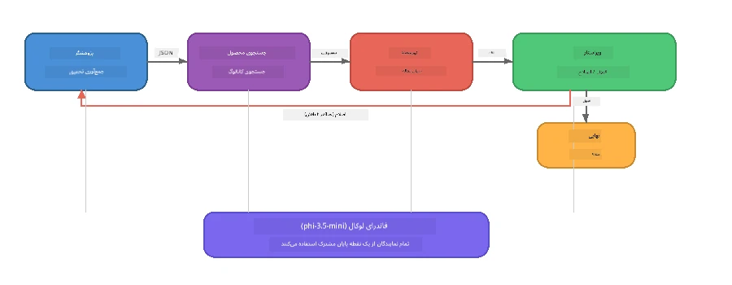

# بخش ۷: نویسنده خلاق Zava - برنامه نهایی

> **هدف:** کاوش یک برنامه چندعامله به سبک تولید که در آن چهار عامل تخصصی همکاری می‌کنند تا مقالات با کیفیت مجله برای Zava Retail DIY تولید کنند - کاملاً بر روی دستگاه شما با Foundry Local اجرا می‌شود.

این **آزمایشگاه نهایی** کارگاه است. این بخش همه آنچه یاد گرفته‌اید را در کنار هم می‌آورد - ادغام SDK (بخش ۳)، بازیابی از داده‌های محلی (بخش ۴)، شخصیت‌های عامل (بخش ۵) و ارکستراسیون چندعامله (بخش ۶) - و آن را به یک برنامه کامل عرضه می‌کند که در **پایتون**، **جاوااسکریپت** و **C#** در دسترس است.

---

## آنچه کاوش خواهید کرد

| مفهوم | کجا در Zava Writer |
|---------|----------------------------|
| بارگذاری مدل در ۴ مرحله | ماژول پیکربندی مشترک Foundry Local را بوت‌استرپ می‌کند |
| بازیابی به سبک RAG | عامل محصول کاتالوگ محلی را جستجو می‌کند |
| تخصص عامل | ۴ عامل با پرامپت‌های سیستمی متمایز |
| خروجی جریان داده | نویسنده به صورت زنده توکن‌ها را ارائه می‌دهد |
| انتقال ساختاریافته | پژوهشگر → JSON، ویراستار → تصمیم JSON |
| حلقه‌های بازخورد | ویراستار می‌تواند بازاجرا را فعال کند (حداکثر ۲ بار تلاش) |

---

## معماری

نویسنده خلاق Zava از **خط لوله متوالی با بازخورد ارزیاب‌محور** استفاده می‌کند. هر سه پیاده‌سازی زبانی از همین معماری پیروی می‌کنند:



### چهار عامل

| عامل | ورودی | خروجی | هدف |
|-------|-------|--------|---------|
| **پژوهشگر** | موضوع + بازخورد اختیاری | `{"web": [{url, name, description}, ...]}` | گردآوری پژوهش پس‌زمینه با استفاده از LLM |
| **جستجوی محصول** | رشته زمینه محصول | فهرست محصولات منطبق | پرسش‌های تولید شده توسط LLM + جستجوی کلیدواژه در کاتالوگ محلی |
| **نویسنده** | پژوهش + محصولات + تکلیف + بازخورد | متن مقاله جریان‌یافته (تفکیک شده با `---`) | پیش‌نویس مقاله‌ای باکیفیت مجله به صورت زنده |
| **ویراستار** | مقاله + بازخورد خود نویسنده | `{"decision": "accept/revise", "editorFeedback": "...", "researchFeedback": "..."}` | بازبینی کیفیت، فعال‌سازی تلاش مجدد در صورت نیاز |

### جریان خط لوله

1. **پژوهشگر** موضوع را دریافت کرده و یادداشت‌های پژوهشی ساختاریافته (JSON) تولید می‌کند  
2. **جستجوی محصول** با استفاده از اصطلاحات جستجوی تولید شده توسط LLM به جستجوی کاتالوگ محصولات محلی می‌پردازد  
3. **نویسنده** پژوهش + محصولات + تکلیف را به یک مقاله جریان‌یافته ترکیب می‌کند و بازخورد خود را پس از جداکننده `---` اضافه می‌کند  
4. **ویراستار** مقاله را بازبینی کرده و یک حکم JSON بازمی‌گرداند:  
   - `"accept"` → خط لوله کامل می‌شود  
   - `"revise"` → بازخورد به پژوهشگر و نویسنده ارسال می‌شود (حداکثر ۲ تلاش مجدد)  

---

## پیش‌نیازها

- تکمیل [بخش ۶: جریان‌های کاری چندعامله](part6-multi-agent-workflows.md)  
- نصب Foundry Local CLI و دانلود مدل `phi-3.5-mini`  

---

## تمرین‌ها

### تمرین ۱ - اجرای نویسنده خلاق Zava

زبان خود را انتخاب کرده و برنامه را اجرا کنید:

<details>
<summary><strong>🐍 پایتون - سرویس وب FastAPI</strong></summary>

نسخه پایتون به صورت یک **سرویس وب** با API REST اجرا می‌شود و نشان می‌دهد چگونه یک بک‌اند تولیدی بسازیم.

**راه‌اندازی:**  
```bash
cd zava-creative-writer-local/src/api
python -m venv venv

# ویندوز (پاورشل):
venv\Scripts\Activate.ps1
# مک‌اواس:
source venv/bin/activate

pip install -r requirements.txt
```
  
**اجرا:**  
```bash
uvicorn main:app --reload
```
  
**تست کنید:**  
```bash
curl -X POST http://localhost:8000/api/article \
  -H "Content-Type: application/json" \
  -d '{
    "research": "DIY home improvement trends",
    "products": "power tools and paints",
    "assignment": "Write an article about weekend renovation projects for DIY enthusiasts"
  }'
```
  
پاسخ به صورت پیام‌های JSON جداشده با خط جدید پخش می‌شود که پیشرفت هر عامل را نشان می‌دهد.

</details>

<details>
<summary><strong>📦 جاوااسکریپت - CLI Node.js</strong></summary>

نسخه جاوااسکریپت به صورت **برنامه خط فرمان** اجرا می‌شود و پیشرفت عامل‌ها و مقاله را مستقیم در کنسول چاپ می‌کند.

**راه‌اندازی:**  
```bash
cd zava-creative-writer-local/src/javascript
npm install
```
  
**اجرا:**  
```bash
node main.mjs
```
  
شما خواهید دید:  
1. بارگذاری مدل Foundry Local (با نوار پیشرفت در صورت دانلود)  
2. اجرای هر عامل به ترتیب با پیام‌های وضعیت  
3. مقاله به صورت زنده روی کنسول جریان می‌یابد  
4. تصمیم ویراستار برای پذیرش یا بازنگری  

</details>

<details>
<summary><strong>💜 C# - برنامه کنسول .NET</strong></summary>

نسخه C# به عنوان یک **برنامه کنسول .NET** با همان خط لوله و خروجی جریان داده اجرا می‌شود.

**راه‌اندازی:**  
```bash
cd zava-creative-writer-local/src/csharp
dotnet restore
```
  
**اجرا:**  
```bash
dotnet run
```
  
الگوی خروجی همانند نسخه جاوااسکریپت است - پیام‌های وضعیت عامل، مقاله جریان‌یافته، و حکم ویراستار.

</details>

---

### تمرین ۲ - بررسی ساختار کد

هر پیاده‌سازی زبانی اجزای منطقی یکسانی دارد. ساختارها را مقایسه کنید:

**پایتون** (`src/api/`):  
| فایل | هدف |  
|------|---------|  
| `foundry_config.py` | مدیریت‌کننده، مدل و کلاینت مشترک Foundry Local (بارگذاری ۴ مرحله‌ای) |  
| `orchestrator.py` | هماهنگی خط لوله با حلقه بازخورد |  
| `main.py` | نقاط انتهایی FastAPI (`POST /api/article`) |  
| `agents/researcher/researcher.py` | پژوهش مبتنی بر LLM با خروجی JSON |  
| `agents/product/product.py` | تولید پرسش از LLM + جستجوی کلیدواژه |  
| `agents/writer/writer.py` | تولید مقاله جریان‌یافته |  
| `agents/editor/editor.py` | تصمیم پذیرش/بازنگری مبتنی بر JSON |  

**جاوااسکریپت** (`src/javascript/`):  
| فایل | هدف |  
|------|---------|  
| `foundryConfig.mjs` | پیکربندی مشترک Foundry Local (بارگذاری ۴ مرحله‌ای با نوار پیشرفت) |  
| `main.mjs` | هماهنگ‌کننده + نقطه ورودی CLI |  
| `researcher.mjs` | عامل پژوهش مبتنی بر LLM |  
| `product.mjs` | تولید پرسش‌های LLM + جستجوی کلیدواژه |  
| `writer.mjs` | تولید مقاله جریان‌یافته (تولیدکننده آسنکرون) |  
| `editor.mjs` | تصمیم پذیرش/بازنگری JSON |  
| `products.mjs` | داده‌های کاتالوگ محصول |  

**C#** (`src/csharp/`):  
| فایل | هدف |  
|------|---------|  
| `Program.cs` | خط لوله کامل: بارگذاری مدل، عامل‌ها، هماهنگ‌کننده، حلقه بازخورد |  
| `ZavaCreativeWriter.csproj` | پروژه .NET 9 با پکیج‌های Foundry Local + OpenAI |  

> **نکته طراحی:** پایتون هر عامل را در فایل/دایرکتوری جداگانه نگه می‌دارد (مناسب تیم‌های بزرگ‌تر). جاوااسکریپت هر عامل را در یک ماژول جداگانه دارد (مناسب پروژه‌های متوسط). C# همه چیز را در یک فایل با توابع محلی نگه می‌دارد (مناسب نمونه‌های مستقل). در تولید، الگوی سازگار با تیم خود را انتخاب کنید.

---

### تمرین ۳ - ردیابی پیکربندی مشترک

هر عامل در خط لوله یک کلاینت مدل Foundry Local مشترک دارد. نحوه تنظیم آن را در هر زبان بررسی کنید:

<details>
<summary><strong>🐍 پایتون - foundry_config.py</strong></summary>

```python
from foundry_local import FoundryLocalManager

MODEL_ALIAS = "phi-3.5-mini"

# مرحله ۱: ساخت مدیر و شروع سرویس Foundry Local
manager = FoundryLocalManager()
manager.start_service()

# مرحله ۲: بررسی اینکه آیا مدل قبلاً دانلود شده است
cached = manager.list_cached_models()
catalog_info = manager.get_model_info(MODEL_ALIAS)
is_cached = any(m.id == catalog_info.id for m in cached) if catalog_info else False

if not is_cached:
    manager.download_model(MODEL_ALIAS)

# مرحله ۳: بارگذاری مدل در حافظه
manager.load_model(MODEL_ALIAS)
model_id = manager.get_model_info(MODEL_ALIAS).id

# کلاینت OpenAI مشترک
client = openai.OpenAI(base_url=manager.endpoint, api_key=manager.api_key)
```
  
تمام عامل‌ها `from foundry_config import client, model_id` را وارد می‌کنند.

</details>

<details>
<summary><strong>📦 جاوااسکریپت - foundryConfig.mjs</strong></summary>

```javascript
import { FoundryLocalManager } from "foundry-local-sdk";
import { OpenAI } from "openai";

FoundryLocalManager.create({ appName: "ZavaCreativeWriter" });
const manager = FoundryLocalManager.instance;
await manager.startWebService();

// بررسی حافظه پنهان → دانلود → بارگیری (الگوی جدید SDK)
const catalog = manager.catalog;
const model = await catalog.getModel(MODEL_ALIAS);
if (!model.isCached) {
  console.log(`Downloading model: ${MODEL_ALIAS}...`);
  await model.download();
}
await model.load();

const client = new OpenAI({ baseURL: manager.urls[0] + "/v1", apiKey: "foundry-local" });
const modelId = model.id;
export { client, modelId };
```
  
تمام عامل‌ها `{ client, modelId } from "./foundryConfig.mjs"` را وارد می‌کنند.

</details>

<details>
<summary><strong>💜 C# - ابتدای Program.cs</strong></summary>

```csharp
await FoundryLocalManager.CreateAsync(
    new Configuration
    {
        AppName = "ZavaCreativeWriter",
        Web = new Configuration.WebService { Urls = "http://127.0.0.1:0" }
    }, NullLogger.Instance, default);
var manager = FoundryLocalManager.Instance;
await manager.StartWebServiceAsync(default);

var catalog = await manager.GetCatalogAsync(default);
var catalogModel = await catalog.GetModelAsync(alias, default);
var isCached = await catalogModel.IsCachedAsync(default);
if (!isCached)
    await catalogModel.DownloadAsync(null, default);

await catalogModel.LoadAsync(default);
var key = new ApiKeyCredential("foundry-local");
var chatClient = new OpenAIClient(key, new OpenAIClientOptions
{
    Endpoint = new Uri(manager.Urls[0] + "/v1")
}).GetChatClient(catalogModel.Id);
```
  
سپس `chatClient` به تمام توابع عامل در همان فایل پاس داده می‌شود.

</details>

> **الگوی کلیدی:** الگوی بارگذاری مدل (شروع سرویس → بررسی کش → دانلود → بارگذاری) تضمین می‌کند که کاربر پیشرفت واضح را ببیند و مدل فقط یک بار دانلود شود. این بهترین روش برای هر برنامه Foundry Local است.

---

### تمرین ۴ - درک حلقه بازخورد

حلقه بازخورد چیزی است که این خط لوله را "هوشمند" می‌کند - ویراستار می‌تواند کار را برای بازنگری بازگرداند. منطق را دنبال کنید:

```
Orchestrator:
  1. researcher.research(topic, "No Feedback")    ← first pass
  2. product.findProducts(productContext)
  3. writer.write(research, products, assignment)  ← streams article
  4. Split article at "---" → article + writerFeedback
  5. editor.edit(article, writerFeedback)

  WHILE editor says "revise" AND retryCount < 2:
    6. researcher.research(topic, editor.researchFeedback)  ← refined
    7. writer.write(research, products, editor.editorFeedback)
    8. editor.edit(newArticle, newWriterFeedback)
    9. retryCount++
```
  
**سؤالات برای بررسی:**  
- چرا محدودیت تلاش مجدد ۲ است؟ اگر آن را افزایش دهید چه اتفاقی می‌افتد؟  
- چرا پژوهشگر `researchFeedback` می‌گیرد ولی نویسنده `editorFeedback`؟  
- اگر ویراستار همیشه "بازنگری" بگوید چه می‌شود؟  

---

### تمرین ۵ - تغییر رفتار یک عامل

سعی کنید رفتار یکی از عامل‌ها را تغییر دهید و ببینید چگونه خط لوله را تحت تأثیر قرار می‌دهد:

| تغییر | چه چیزی باید تغییر کند |  
|-------------|----------------|  
| **ویراستار سخت‌تر** | پرامپت سیستمی ویراستار را طوری تغییر دهید که همیشه حداقل یک بازنگری درخواست کند |  
| **مقالات بلندتر** | پرامپت نویسنده را از "۸۰۰-۱۰۰۰ کلمه" به "۱۵۰۰-۲۰۰۰ کلمه" تغییر دهید |  
| **محصولات متفاوت** | محصولات را در کاتالوگ محصول اضافه یا تغییر دهید |  
| **موضوع پژوهش جدید** | مقدار پیش‌فرض `researchContext` را به موضوعی دیگر تغییر دهید |  
| **پژوهشگر فقط JSON** | پژوهشگر را طوری کنید که به جای ۳-۵ مورد، ۱۰ مورد برگرداند |  

> **نکته:** چون هر سه زبان یک معماری مشابه دارند، می‌توانید همان تغییر را به زبان دلخواه خود اعمال کنید.

---

### تمرین ۶ - اضافه کردن عامل پنجم

خط لوله را با یک عامل جدید گسترش دهید. ایده‌هایی:

| عامل | کجا در خط لوله | هدف |  
|-------|-------------------|---------|  
| **بازرس صحت** | بعد از نویسنده، قبل از ویراستار | تأیید ادعاها در برابر داده‌های پژوهشی |  
| **بهینه‌ساز SEO** | پس از پذیرش ویراستار | افزودن توضیحات متا، کلیدواژه‌ها، شناسه URL |  
| **تصویرساز** | پس از پذیرش ویراستار | تولید پرامپت‌های تصویر برای مقاله |  
| **مترجم** | پس از پذیرش ویراستار | ترجمه مقاله به زبان دیگر |  

**مراحل:**  
1. پرامپت سیستمی عامل را بنویسید  
2. تابع عامل را ایجاد کنید (مطابق الگوی موجود در زبان شما)  
3. آن را در هماهنگ‌کننده در نقطه مناسب درج کنید  
4. خروجی/لاگ را به‌روزرسانی کنید تا سهم عامل جدید نمایش داده شود  

---

## چگونه Foundry Local و چارچوب عامل با هم کار می‌کنند

این برنامه الگوی توصیه ‌شده برای ساخت سیستم‌های چندعامله با Foundry Local را نشان می‌دهد:

| لایه | جزء | نقش |  
|-------|-----------|------|  
| **زمان اجرا** | Foundry Local | مدل را دانلود، مدیریت و به صورت محلی ارائه می‌دهد |  
| **کلاینت** | OpenAI SDK | درخواست تکمیل چت را به نقطه انتهایی محلی ارسال می‌کند |  
| **عامل** | پرامپت سیستم + تماس چت | رفتار تخصصی از طریق دستورات متمرکز |  
| **هماهنگ‌کننده** | هماهنگ‌کننده خط لوله | مدیریت جریان داده، ترتیب‌دهی و حلقه‌های بازخورد |  
| **چارچوب** | چارچوب عامل مایکروسافت | انتزاع و الگوهای `ChatAgent` را فراهم می‌کند |  

بینش کلیدی: **Foundry Local جایگزین بک‌اند ابری است، نه معماری برنامه.** همان الگوهای عامل، استراتژی‌های ارکستراسیون و انتقال‌های ساختاریافته که با مدل‌های ابری کار می‌کنند دقیقاً با مدل‌های محلی نیز کار می‌کنند — فقط کلاینت به جای نقطه انتهایی Azure به نقطه انتهایی محلی اشاره می‌کند.

---

## نکات کلیدی

| مفهوم | آنچه یاد گرفتید |  
|---------|-----------------|  
| معماری تولید | نحوه ساخت برنامه چندعامله با پیکربندی مشترک و عوامل جداگانه |  
| بارگذاری مدل ۴ مرحله‌ای | بهترین روش برای مقداردهی Foundry Local با پیشرفت قابل مشاهده کاربر |  
| تخصص عامل | هر ۴ عامل دستورات متمرکز و فرمت خروجی مشخص دارند |  
| تولید جریان‌یافته | نویسنده توکن‌ها را به صورت زنده تولید می‌کند تا رابط‌های تعاملی را ممکن سازد |  
| حلقه‌های بازخورد | تلاش مجدد هدایت‌شده توسط ویراستار کیفیت خروجی را بدون دخالت انسان بهبود می‌بخشد |  
| الگوهای چندزبانه | همان معماری در پایتون، جاوااسکریپت و C# کار می‌کند |  
| محلی = آماده تولید | Foundry Local همان API سازگار با OpenAI را که در استقرارهای ابری استفاده می‌شود فراهم می‌کند |  

---

## گام بعدی

به [بخش ۸: توسعه مبتنی بر ارزیابی](part8-evaluation-led-development.md) بروید تا چارچوب ارزیابی نظام‌مند برای عامل‌های خود بسازید، با استفاده از مجموعه داده‌های طلایی، بررسی‌های مبتنی بر قانون و امتیازدهی قاضی LLM.

---

<!-- CO-OP TRANSLATOR DISCLAIMER START -->
**توجه**:
این سند با استفاده از سرویس ترجمه هوش مصنوعی [Co-op Translator](https://github.com/Azure/co-op-translator) ترجمه شده است. در حالی که ما برای دقت تلاش می‌کنیم، لطفاً توجه داشته باشید که ترجمه‌های خودکار ممکن است حاوی خطاها یا نادرستی‌هایی باشند. سند اصلی به زبان خود منبع معتبر تلقی می‌شود. برای اطلاعات حیاتی، ترجمه حرفه‌ای انسانی توصیه می‌شود. ما مسئول هیچگونه سوء تفاهم یا برداشت نادرست ناشی از استفاده از این ترجمه نیستیم.
<!-- CO-OP TRANSLATOR DISCLAIMER END -->