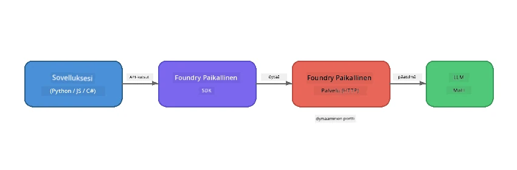

# Osa 1: Aloittaminen Foundry Localin kanssa


## Mikä on Foundry Local?

[Foundry Local](https://foundrylocal.ai) antaa sinun ajaa avoimen lähdekoodin AI-kielimalleja **suoraan tietokoneellasi** – ei internet-yhteyttä, ei pilvikustannuksia, ja täydellinen tietosuoja. Se:

- **Lataa ja ajaa malleja paikallisesti** automaattisella laitteisto-optimoinnilla (GPU, CPU tai NPU)
- **Tarjoaa OpenAI-yhteensopivan API:n**, joten voit käyttää tuttuja SDK:ita ja työkaluja
- **Ei vaadi Azure-tilausta** tai rekisteröitymistä – asenna vain ja ala rakentaa

Ajattele sitä kuin omaksi yksityiseksi tekoälyksesi, joka toimii kokonaan laitteellasi.

## Oppimistavoitteet

Tämän laboratorion lopussa osaat:

- Asentaa Foundry Local CLI:n käyttöjärjestelmääsi
- Ymmärtää mitä mallialiäsit ovat ja miten ne toimivat
- Ladata ja ajaa ensimmäisen paikallisen AI-mallin
- Lähettää keskustelukomennon paikalliselle mallille komentoriviltä
- Ymmärtää paikallisten ja pilvipohjaisten AI-mallien erot

---

## Edellytykset

### Järjestelmävaatimukset

| Vaatimus | Minimi | Suositus |
|----------|---------|----------|
| **RAM** | 8 GB | 16 GB |
| **Tallennustila** | 5 GB (malleille) | 10 GB |
| **CPU** | 4 ydintä | 8+ ydintä |
| **GPU** | Valinnainen | NVIDIA CUDA 11.8+ |
| **Käyttöjärjestelmä** | Windows 10/11 (x64/ARM), Windows Server 2025, macOS 13+ | - |

> **Huom:** Foundry Local valitsee automaattisesti parhaan mallivariaation laitteistosi mukaan. Jos sinulla on NVIDIA GPU, se käyttää CUDA-kiihdytystä. Jos sinulla on Qualcomm NPU, se käyttää sitä. Muussa tapauksessa se valitsee optimoidun CPU-vaihtoehdon.

### Asenna Foundry Local CLI

**Windows** (PowerShell):
```powershell
winget install Microsoft.FoundryLocal
```

**macOS** (Homebrew):
```bash
brew tap microsoft/foundrylocal
brew install foundrylocal
```

> **Huom:** Foundry Local tukee tällä hetkellä vain Windowsia ja macOS:ää. Linuxia ei vielä tueta.

Varmista asennus:
```bash
foundry --version
```

---

## Harjoitukset

### Harjoitus 1: Tutki saatavilla olevia malleja

Foundry Local sisältää valikoiman esityöstettyjä avoimen lähdekoodin malleja. Listaa ne:

```bash
foundry model list
```

Näet malleja kuten:
- `phi-3.5-mini` – Microsoftin 3,8 miljardin parametrin malli (nopea, hyvä laatu)
- `phi-4-mini` – Uudempi, kykenevämpi Phi-malli
- `phi-4-mini-reasoning` – Phi-malli ketjupäättelyllä (`<think>`-tagit)
- `phi-4` – Microsoftin suurin Phi-malli (10,4 GB)
- `qwen2.5-0.5b` – Erittäin pieni ja nopea (hyvä vähäresurssisille laitteille)
- `qwen2.5-7b` – Vahva yleiskäyttöinen malli työkalukutsujen tuella
- `qwen2.5-coder-7b` – Koodin generointiin optimoitu
- `deepseek-r1-7b` – Vahva päättelymalli
- `gpt-oss-20b` – Suuri avoimen lähdekoodin malli (MIT-lisenssi, 12,5 GB)
- `whisper-base` – Puheesta tekstiksi -transkriptio (383 MB)
- `whisper-large-v3-turbo` – Tarkka transkriptio (9 GB)

> **Mikä on mallialias?** Alias-nimet kuten `phi-3.5-mini` ovat pikakuvakkeita. Kun käytät aliasia, Foundry Local lataa automaattisesti parhaan variantin laitteistollesi (CUDA NVIDIA GPU:lle, CPU-optimoitu muuten). Sinun ei koskaan tarvitse huolehtia oikean variantin valinnasta.

### Harjoitus 2: Aja ensimmäinen mallisi

Lataa ja aloita vuorovaikutteinen keskustelu mallin kanssa:

```bash
foundry model run phi-3.5-mini
```

Kun suoritat tämän ensimmäistä kertaa, Foundry Local:
1. Havaitsee laitteistosi
2. Lataa optimaalisen mallivariaation (voi kestää muutaman minuutin)
3. Lataa mallin muistiin
4. Käynnistää vuorovaikutteisen keskustelusession

Kokeile esittää sille kysymyksiä:
```
You: What is the golden ratio?
You: Can you explain it as if I were 10 years old?
You: Write a haiku about mathematics
```

Kirjoita `exit` tai paina `Ctrl+C` lopettaaksesi.

### Harjoitus 3: Lataa malli etukäteen

Jos haluat ladata mallin ilman keskustelun aloittamista:

```bash
foundry model download phi-3.5-mini
```

Tarkista mitkä mallit on jo ladattu koneellesi:

```bash
foundry cache list
```

### Harjoitus 4: Ymmärrä arkkitehtuuri

Foundry Local toimii **paikallisena HTTP-palveluna**, joka tarjoaa OpenAI-yhteensopivan REST API:n. Tämä tarkoittaa:

1. Palvelu käynnistyy **dynaamisella portilla** (eri portti joka käynnistyskerralla)
2. Käytät SDK:ta löytääksesi oikean päätepisteen URL-osoitteen
3. Voit käyttää **mitä tahansa** OpenAI-yhteensopivaa asiakirjastoa sen kanssa kommunikoimiseen



> **Tärkeää:** Foundry Local määrittää **dynaamisen portin** aina käynnistyessään. Älä koskaan kovakoodaa porttinumeroa kuten `localhost:5272`. Käytä aina SDK:ta löytääksesi nykyisen URL-osoitteen (esim. `manager.endpoint` Pythonissa tai `manager.urls[0]` JavaScriptissä).

---

## Keskeiset opit

| Käsite | Mitä opit |
|---------|------------------|
| Laitteiston paikallinen AI | Foundry Local ajaa mallit kokonaan laitteellasi ilman pilveä, API-avaimia tai kustannuksia |
| Mallialiäsit | Alias-nimet kuten `phi-3.5-mini` valitsevat automaattisesti parhaan variantin laitteistollesi |
| Dynaamiset portit | Palvelu toimii dynaamisella portilla; käytä aina SDK:ta löytääksesi päätepisteen |
| CLI ja SDK | Voit käyttää malleja CLI:n (`foundry model run`) kautta tai ohjelmallisesti SDK:n avulla |

---

## Seuraavat askeleet

Jatka osaan [Osa 2: Foundry Local SDK Syväluotaus](part2-foundry-local-sdk.md) hallitaksesi SDK API:ta mallien, palveluiden ja välimuistin hallintaan ohjelmallisesti.