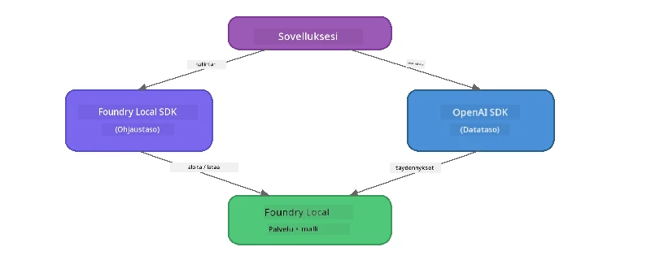

# Osa 3: Foundry Local SDK:n käyttö OpenAI:n kanssa

## Yleiskatsaus

Osassa 1 käytit Foundry Local CLI:tä mallien interaktiiviseen käyttöön. Osassa 2 tutustuit SDK:n täydelliseen API-pinta-alaan. Nyt opit, kuinka **integroida Foundry Local sovelluksiisi** SDK:n ja OpenAI-yhteensopivan API:n avulla.

Foundry Local tarjoaa SDK:t kolmelle kielelle. Valitse sinulle tutuin - käsitteet ovat identtiset kaikilla kolmella.

## Oppimistavoitteet

Tämän harjoituksen lopuksi osaat:

- Asentaa Foundry Local SDK:n valitsemallesi kielelle (Python, JavaScript tai C#)
- Alustaa `FoundryLocalManager`:n käynnistääksesi palvelun, tarkistaa välimuistin, ladata ja ladata mallin
- Yhdistää paikalliseen malliin OpenAI SDK:n avulla
- Lähettää chat-täydennyksiä ja käsitellä striimattuja vastauksia
- Ymmärtää dynaamisen porttiarkkitehtuurin

---

## Edellytykset

Suorita ensin [Osa 1: Foundry Local - Aloitusopas](part1-getting-started.md) ja [Osa 2: Foundry Local SDK Syväluotaus](part2-foundry-local-sdk.md).

Asenna **yksi** seuraavista kieliajoista:
- **Python 3.9+** - [python.org/downloads](https://www.python.org/downloads/)
- **Node.js 18+** - [nodejs.org](https://nodejs.org/)
- **.NET 9.0+** - [dot.net/download](https://dotnet.microsoft.com/download)

---

## Käsite: Miten SDK toimii

Foundry Local SDK hallinnoi **ohjaustasoa** (palvelun käynnistys, mallien lataus), kun taas OpenAI SDK hoitaa **datatason** (kehotteiden lähetys, täydennysten vastaanotto).



---

## Harjoitukset

### Harjoitus 1: Ympäristön asennus

<details>
<summary><b>🐍 Python</b></summary>

```bash
cd python
python -m venv venv

# Aktivoi virtuaaliympäristö:
# Windows (PowerShell):
venv\Scripts\Activate.ps1
# Windows (Komentokehote):
venv\Scripts\activate.bat
# macOS:
source venv/bin/activate

pip install -r requirements.txt
```

`requirements.txt` asentaa:
- `foundry-local-sdk` - Foundry Local SDK (tuodaan nimellä `foundry_local`)
- `openai` - OpenAI Python SDK
- `agent-framework` - Microsoft Agent Framework (käytössä myöhemmissä osissa)

</details>

<details>
<summary><b>📘 JavaScript</b></summary>

```bash
cd javascript
npm install
```

`package.json` asentaa:
- `foundry-local-sdk` - Foundry Local SDK
- `openai` - OpenAI Node.js SDK

</details>

<details>
<summary><b>💜 C#</b></summary>

```bash
cd csharp
dotnet restore
dotnet build
```

`csharp.csproj` käyttää:
- `Microsoft.AI.Foundry.Local` - Foundry Local SDK (NuGet)
- `OpenAI` - OpenAI C# SDK (NuGet)

> **Projektirakenne:** C#-projekti käyttää komentorivireititintä `Program.cs`:ssä, joka ohjaa eri esimerkkitiedostoihin. Suorita `dotnet run chat` (tai pelkkä `dotnet run`) tähän osaan. Muut osat käyttävät `dotnet run rag`, `dotnet run agent` ja `dotnet run multi`.

</details>

---

### Harjoitus 2: Perus chat-täydennys

Avaa perus chat-esimerkki valitsemallesi kielelle ja tutustu koodiin. Jokainen skripti noudattaa samaa kolmen vaiheen kaavaa:

1. **Käynnistä palvelu** - `FoundryLocalManager` käynnistää Foundry Local -ympäristön
2. **Lataa ja aktivoi malli** - tarkista välimuisti, lataa tarvittaessa, lataa muistiin
3. **Luo OpenAI-asiakas** - yhdistä paikalliseen päätepisteeseen ja lähetä striimattu chat-täydennys

<details>
<summary><b>🐍 Python - <code>python/foundry-local.py</code></b></summary>

```python
import sys
import openai
from foundry_local import FoundryLocalManager

alias = "phi-3.5-mini"

# Vaihe 1: Luo FoundryLocalManager ja käynnistä palvelu
print("Starting Foundry Local service...")
manager = FoundryLocalManager()
manager.start_service()

# Vaihe 2: Tarkista, onko malli jo ladattu
cached = manager.list_cached_models()
catalog_info = manager.get_model_info(alias)
is_cached = any(m.id == catalog_info.id for m in cached) if catalog_info else False

if is_cached:
    print(f"Model already downloaded: {alias}")
else:
    print(f"Downloading model: {alias} (this may take several minutes)...")
    manager.download_model(alias)
    print(f"Download complete: {alias}")

# Vaihe 3: Lataa malli muistiin
print(f"Loading model: {alias}...")
manager.load_model(alias)

# Luo OpenAI-asiakasosoituksella paikalliseen Foundry-palveluun
client = openai.OpenAI(
    base_url=manager.endpoint,   # Dynaaminen portti - älä koskaan kovakoodaa!
    api_key=manager.api_key
)

# Generoi suoratoistava chat-päätös
stream = client.chat.completions.create(
    model=manager.get_model_info(alias).id,
    messages=[{"role": "user", "content": "What is the golden ratio?"}],
    stream=True,
)

for chunk in stream:
    if chunk.choices[0].delta.content is not None:
        print(chunk.choices[0].delta.content, end="", flush=True)
print()
```

**Suorita:**
```bash
python foundry-local.py
```

</details>

<details>
<summary><b>📘 JavaScript - <code>javascript/foundry-local.mjs</code></b></summary>

```javascript
import { OpenAI } from "openai";
import { FoundryLocalManager } from "foundry-local-sdk";

const alias = "phi-3.5-mini";

// Vaihe 1: Käynnistä Foundry Local -palvelu
console.log("Starting Foundry Local service...");
FoundryLocalManager.create({ appName: "FoundryLocalWorkshop" });
const manager = FoundryLocalManager.instance;
await manager.startWebService();

// Vaihe 2: Tarkista, onko malli jo ladattu
const catalog = manager.catalog;
const model = await catalog.getModel(alias);

if (model.isCached) {
  console.log(`Model already downloaded: ${alias}`);
} else {
  console.log(`Downloading model: ${alias} (this may take several minutes)...`);
  await model.download();
  console.log(`Download complete: ${alias}`);
}

// Vaihe 3: Lataa malli muistiin
console.log(`Loading model: ${alias}...`);
await model.load();
console.log(`Model loaded: ${model.id}`);

// Luo OpenAI-asiakas, joka osoittaa paikalliseen Foundry-palveluun
const client = new OpenAI({
  baseURL: manager.urls[0] + "/v1",   // Dynaaminen portti - älä koskaan kovakoodaa!
  apiKey: "foundry-local",
});

// Luo suoratoistava chat-vastaus
const stream = await client.chat.completions.create({
  model: model.id,
  messages: [{ role: "user", content: "What is the golden ratio?" }],
  stream: true,
});

for await (const chunk of stream) {
  if (chunk.choices[0]?.delta?.content) {
    process.stdout.write(chunk.choices[0].delta.content);
  }
}
console.log();
```

**Suorita:**
```bash
node foundry-local.mjs
```

</details>

<details>
<summary><b>💜 C# - <code>csharp/BasicChat.cs</code></b></summary>

```csharp
using Microsoft.AI.Foundry.Local;
using Microsoft.Extensions.Logging.Abstractions;
using OpenAI;
using OpenAI.Chat;
using System.ClientModel;

var alias = "phi-3.5-mini";

// Step 1: Start the Foundry Local service
Console.WriteLine("Starting Foundry Local service...");
await FoundryLocalManager.CreateAsync(
    new Configuration
    {
        AppName = "FoundryLocalSamples",
        Web = new Configuration.WebService { Urls = "http://127.0.0.1:0" }
    }, NullLogger.Instance, default);
var manager = FoundryLocalManager.Instance;
await manager.StartWebServiceAsync(default);

// Step 2: Get the model from the catalog
var catalog = await manager.GetCatalogAsync(default);
var model = await catalog.GetModelAsync(alias, default);

// Step 3: Check if the model is already downloaded
var isCached = await model.IsCachedAsync(default);

if (isCached)
{
    Console.WriteLine($"Model already downloaded: {alias}");
}
else
{
    Console.WriteLine($"Downloading model: {alias} (this may take several minutes)...");
    await model.DownloadAsync(null, default);
    Console.WriteLine($"Download complete: {alias}");
}

// Step 4: Load the model into memory
Console.WriteLine($"Loading model: {alias}...");
await model.LoadAsync(default);
Console.WriteLine($"Loaded model: {model.Id}");
Console.WriteLine($"Endpoint: {manager.Urls[0]}");

// Create OpenAI client pointing to the LOCAL Foundry service
var key = new ApiKeyCredential("foundry-local");
var client = new OpenAIClient(key, new OpenAIClientOptions
{
    Endpoint = new Uri(manager.Urls[0] + "/v1")  // Dynamic port - never hardcode!
});

var chatClient = client.GetChatClient(model.Id);

// Stream a chat completion
var completionUpdates = chatClient.CompleteChatStreaming("What is the golden ratio?");

foreach (var update in completionUpdates)
{
    if (update.ContentUpdate.Count > 0)
    {
        Console.Write(update.ContentUpdate[0].Text);
    }
}
Console.WriteLine();
```

**Suorita:**
```bash
dotnet run chat
```

</details>

---

### Harjoitus 3: Kokeile kehotteita

Kun perusesimerkki toimii, kokeile muuttaa koodia:

1. **Muuta käyttäjäviestiä** - kokeile erilaisia kysymyksiä
2. **Lisää järjestelmäkehotus** - määritä mallille persoona
3. **Sammuta striimaus** - aseta `stream=False` ja tulosta koko vastaus kerralla
4. **Kokeile eri mallia** - vaihda alias `phi-3.5-mini` toiseen malliin komennolla `foundry model list`

<details>
<summary><b>🐍 Python</b></summary>

```python
# Lisää järjestelmäkehote - anna mallille persoonallisuus:
stream = client.chat.completions.create(
    model=manager.get_model_info(alias).id,
    messages=[
        {"role": "system", "content": "You are a pirate. Answer everything in pirate speak."},
        {"role": "user", "content": "What is the golden ratio?"}
    ],
    stream=True,
)

# Tai poista suoratoisto käytöstä:
response = client.chat.completions.create(
    model=manager.get_model_info(alias).id,
    messages=[{"role": "user", "content": "What is the golden ratio?"}],
    stream=False,
)
print(response.choices[0].message.content)
```

</details>

<details>
<summary><b>📘 JavaScript</b></summary>

```javascript
// Lisää järjestelmäkehotus – anna mallille persoonallisuus:
const stream = await client.chat.completions.create({
  model: modelInfo.id,
  messages: [
    { role: "system", content: "You are a pirate. Answer everything in pirate speak." },
    { role: "user", content: "What is the golden ratio?" },
  ],
  stream: true,
});

// Tai poista suoratoisto käytöstä:
const response = await client.chat.completions.create({
  model: modelInfo.id,
  messages: [{ role: "user", content: "What is the golden ratio?" }],
  stream: false,
});
console.log(response.choices[0].message.content);
```

</details>

<details>
<summary><b>💜 C#</b></summary>

```csharp
// Add a system prompt - give the model a persona:
var completionUpdates = chatClient.CompleteChatStreaming(
    new ChatMessage[]
    {
        new SystemChatMessage("You are a pirate. Answer everything in pirate speak."),
        new UserChatMessage("What is the golden ratio?")
    }
);

// Or turn off streaming:
var response = chatClient.CompleteChat("What is the golden ratio?");
Console.WriteLine(response.Value.Content[0].Text);
```

</details>

---

### SDK-metodit

<details>
<summary><b>🐍 Python SDK -metodit</b></summary>

| Metodi | Tarkoitus |
|--------|-----------|
| `FoundryLocalManager()` | Luo hallintainstanssi |
| `manager.start_service()` | Käynnistä Foundry Local -palvelu |
| `manager.list_cached_models()` | Listaa laitteelle ladatut mallit |
| `manager.get_model_info(alias)` | Hae mallin ID ja metatiedot |
| `manager.download_model(alias, progress_callback=fn)` | Lataa malli ja tilaa etenemispalautetta |
| `manager.load_model(alias)` | Lataa malli muistiin |
| `manager.endpoint` | Hae dynaaminen päätepisteen URL |
| `manager.api_key` | Hae API-avain (paikallinen paikkamerkki) |

</details>

<details>
<summary><b>📘 JavaScript SDK -metodit</b></summary>

| Metodi | Tarkoitus |
|--------|-----------|
| `FoundryLocalManager.create({ appName })` | Luo hallintainstanssi |
| `FoundryLocalManager.instance` | Singleton-palvelun pääsy |
| `await manager.startWebService()` | Käynnistä Foundry Local -palvelu |
| `await manager.catalog.getModel(alias)` | Hae malli luettelosta |
| `model.isCached` | Tarkista onko malli ladattu |
| `await model.download()` | Lataa malli |
| `await model.load()` | Lataa malli muistiin |
| `model.id` | Hae mallin ID OpenAI-kutsuja varten |
| `manager.urls[0] + "/v1"` | Hae dynaaminen päätepisteen URL |
| `"foundry-local"` | API-avain (paikallinen paikkamerkki) |

</details>

<details>
<summary><b>💜 C# SDK -metodit</b></summary>

| Metodi | Tarkoitus |
|--------|-----------|
| `FoundryLocalManager.CreateAsync(config)` | Luo ja alusta hallintainstanssi |
| `manager.StartWebServiceAsync()` | Käynnistä Foundry Local -webpalvelu |
| `manager.GetCatalogAsync()` | Hae malliluettelo |
| `catalog.ListModelsAsync()` | Listaa kaikki käytettävissä olevat mallit |
| `catalog.GetModelAsync(alias)` | Hae malli alias-nimellä |
| `model.IsCachedAsync()` | Tarkista, onko malli ladattu |
| `model.DownloadAsync()` | Lataa malli |
| `model.LoadAsync()` | Lataa malli muistiin |
| `manager.Urls[0]` | Hae dynaaminen päätepisteen URL |
| `new ApiKeyCredential("foundry-local")` | API-avain vahvistus paikalliselle |

</details>

---

### Harjoitus 4: Natiivin ChatClientin käyttö (vaihtoehto OpenAI SDK:lle)

Harjoituksissa 2 ja 3 käytit OpenAI SDK:ta chat-täydennyksiin. JavaScript- ja C#-SDK:t tarjoavat myös **natiivin ChatClientin**, joka poistaa kokonaan tarpeen OpenAI SDK:lle.

<details>
<summary><b>📘 JavaScript - <code>model.createChatClient()</code></b></summary>

```javascript
import { FoundryLocalManager } from "foundry-local-sdk";

const alias = "phi-3.5-mini";

FoundryLocalManager.create({ appName: "ChatClientDemo" });
const manager = FoundryLocalManager.instance;
await manager.startWebService();

const model = await manager.catalog.getModel(alias);
if (!model.isCached) await model.download();
await model.load();

// Ei tarvetta OpenAI-importille — hae asiakas suoraan mallista
const chatClient = model.createChatClient();

// Ei-suoratoistoinen täydennys
const response = await chatClient.completeChat([
  { role: "system", content: "You are a pirate. Answer everything in pirate speak." },
  { role: "user", content: "What is the golden ratio?" }
]);
console.log(response.choices[0].message.content);

// Suoratoistoinen täydennys (käyttää callback-kuviota)
await chatClient.completeStreamingChat(
  [{ role: "user", content: "What is the golden ratio?" }],
  (chunk) => {
    if (chunk.choices?.[0]?.delta?.content) {
      process.stdout.write(chunk.choices[0].delta.content);
    }
  }
);
console.log();
```

> **Huom:** ChatClientin `completeStreamingChat()` käyttää **callback-mallia**, ei asynkronista iteraattoria. Anna toinen argumentti funktiona.

</details>

<details>
<summary><b>💜 C# - <code>model.GetChatClientAsync()</code></b></summary>

```csharp
var catalog = await manager.GetCatalogAsync(default);
var model = await catalog.GetModelAsync("phi-3.5-mini", default);
if (!await model.IsCachedAsync(default))
    await model.DownloadAsync(null, default);
await model.LoadAsync(default);

// No OpenAI NuGet needed — get a client directly from the model
var chatClient = await model.GetChatClientAsync(default);

// Use it like a standard OpenAI ChatClient
var response = chatClient.CompleteChat("What is the golden ratio?");
Console.WriteLine(response.Value.Content[0].Text);
```

</details>

> **Milloin käyttää kumpaa:**
> | Tapa | Parhaiten sopiva |
> |------|------------------|
> | OpenAI SDK | Täydellinen parametrien hallinta, tuotantosovellukset, olemassa oleva OpenAI-koodi |
> | Natiivi ChatClient | Nopeaan prototypointiin, vähemmän riippuvuuksia, yksinkertaisempi käyttöönotto |

---

## Keskeiset opit

| Käsite | Mitä opit |
|---------|-----------|
| Ohjaustaso | Foundry Local SDK hoitaa palvelun käynnistyksen ja mallien latauksen |
| Datataso | OpenAI SDK hoitaa chat-täydennykset ja striimauksen |
| Dynaamiset portit | Käytä aina SDK:ta päätepisteen löytämiseen; älä koskaan kovakoodaa URL:ia |
| Monikielisyys | Sama koodikuvio toimii Pythonissa, JavaScriptissä ja C#:ssa |
| OpenAI-yhteensopivuus | Täysi OpenAI API -yhteensopivuus tarkoittaa, että olemassa oleva OpenAI-koodi toimii vähäisillä muutoksilla |
| Natiivi ChatClient | `createChatClient()` (JS) / `GetChatClientAsync()` (C#) tarjoaa vaihtoehdon OpenAI SDK:lle |

---

## Seuraavat askeleet

Jatka [Osa 4: RAG-sovelluksen rakentaminen](part4-rag-fundamentals.md) oppiaksesi, miten rakennetaan kokonaan laitteellasi pyörivä Retrieval-Augmented Generation -putki.