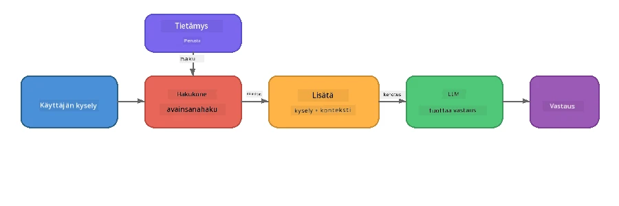

# Osa 4: RAG-sovelluksen rakentaminen Foundry Localilla

## Yleiskatsaus

Suuret kielimallit ovat tehokkaita, mutta ne tietävät vain sen, mikä oli niiden koulutusdatassa. **Retrieval-Augmented Generation (RAG)** ratkaisee tämän antamalla mallille merkityksellisen kontekstin kyselyhetkellä - haettuna omista asiakirjoistasi, tietokannoistasi tai tietopankeistasi.

Tässä laboratoriossa rakennat täydellisen RAG-putken, joka ajetaan **kokonaan laitteellasi** käyttämällä Foundry Localia. Ei pilvipalveluita, ei vektoritietokantoja, ei embedding-rajapintoja - pelkkä paikallinen haku ja paikallinen malli.

## Oppimistavoitteet

Tämän laboratorion lopussa osaat:

- Selittää, mitä RAG on ja miksi se on tärkeä tekoälysovelluksille
- Rakentaa paikallisen tietopankin tekstiasiakirjoista
- Toteuttaa yksinkertaisen hakutoiminnon merkityksellisen kontekstin löytämiseksi
- Koota järjestelmäkehotteen, joka sitoo mallin haettuihin faktoihin
- Ajaa koko Hae → Täydennä → Generoi -putken laitteellasi
- Ymmärtää yksinkertaisen avainsanahaun ja vektorihakujen väliset kompromissit

---

## Esivaatimukset

- Suorita loppuun [Osa 3: Foundry Local SDK:n käyttäminen OpenAI:n kanssa](part3-sdk-and-apis.md)
- Foundry Local CLI asennettuna ja `phi-3.5-mini` malli ladattuna

---

## Käsite: Mikä on RAG?

Ilman RAGia LLM voi vastata vain koulutusdatansa perusteella – joka saattaa olla vanhentunutta, epätäydellistä tai siinä ei ole yksityisiä tietojasi:

```
User: "What is Zava's return policy?"
LLM:  "I do not have information about Zava's return policy."  ← No context!
```

RAGin avulla **haet** ensin merkitykselliset dokumentit, sitten **täydennät** kehote sen kontekstilla ennen kuin **generoit** vastauksen:



Keskeinen oivallus: **mallin ei tarvitse "tietää" vastausta; sen tarvitsee vain lukea oikeat dokumentit.**

---

## Laboratoriotehtävät

### Tehtävä 1: Ymmärrä tietopankki

Avaa RAG-esimerkki omalla kielelläsi ja tutki tietopankkia:

<details>
<summary><b>🐍 Python: <code>python/foundry-local-rag.py</code></b></summary>

Tietopankki on yksinkertainen lista sanakirjoja, joissa on kentät `title` ja `content`:

```python
KNOWLEDGE_BASE = [
    {
        "title": "Foundry Local Overview",
        "content": (
            "Foundry Local brings the power of Azure AI Foundry to your local "
            "device without requiring an Azure subscription..."
        ),
    },
    {
        "title": "Supported Hardware",
        "content": (
            "Foundry Local automatically selects the best model variant for "
            "your hardware. If you have an Nvidia CUDA GPU it downloads the "
            "CUDA-optimized model..."
        ),
    },
    # ... lisää merkintöjä
]
```

Jokainen kohta edustaa "tietopalaa" – keskittynyttä tietoa yhdestä aiheesta.

</details>

<details>
<summary><b>📘 JavaScript: <code>javascript/foundry-local-rag.mjs</code></b></summary>

Tietopankki käyttää samaa rakennetta olioiden taulukkona:

```javascript
const KNOWLEDGE_BASE = [
  {
    title: "Foundry Local Overview",
    content:
      "Foundry Local brings the power of Azure AI Foundry to your local " +
      "device without requiring an Azure subscription...",
  },
  {
    title: "Supported Hardware",
    content:
      "Foundry Local automatically selects the best model variant for " +
      "your hardware...",
  },
  // ... lisää merkintöjä
];
```

</details>

<details>
<summary><b>💜 C#: <code>csharp/RagPipeline.cs</code></b></summary>

Tietopankki käyttää listaa nimetyistä tupleista:

```csharp
private static readonly List<(string Title, string Content)> KnowledgeBase =
[
    ("Foundry Local Overview",
     "Foundry Local brings the power of Azure AI Foundry to your local " +
     "device without requiring an Azure subscription..."),

    ("Supported Hardware",
     "Foundry Local automatically selects the best model variant for " +
     "your hardware..."),

    // ... more entries
];
```

</details>

> **Todellisessa sovelluksessa** tietopankki voisi olla tiedostoja levyllä, tietokanta, hakemisto tai API. Tässä laboratoriossa käytämme muistissa olevaa listaa yksinkertaisuuden vuoksi.

---

### Tehtävä 2: Ymmärrä hakutoiminto

Hakuvaihe löytää käyttäjän kysymykseen merkityksellisimmät tietopalat. Tämä esimerkki käyttää **avainsanojen päällekkäisyyttä** – lasketaan kuinka monta jonka kyselyn sanaa esiintyy kussakin tietopalassa:

<details>
<summary><b>🐍 Python</b></summary>

```python
def retrieve(query: str, top_k: int = 2) -> list[dict]:
    """Return the top-k knowledge chunks most relevant to the query."""
    query_words = set(query.lower().split())
    scored = []
    for chunk in KNOWLEDGE_BASE:
        chunk_words = set(chunk["content"].lower().split())
        overlap = len(query_words & chunk_words)
        scored.append((overlap, chunk))
    scored.sort(key=lambda x: x[0], reverse=True)
    return [item[1] for item in scored[:top_k]]
```

</details>

<details>
<summary><b>📘 JavaScript</b></summary>

```javascript
function retrieve(query, topK = 2) {
  const queryWords = new Set(query.toLowerCase().split(/\s+/));
  const scored = KNOWLEDGE_BASE.map((chunk) => {
    const chunkWords = new Set(chunk.content.toLowerCase().split(/\s+/));
    let overlap = 0;
    for (const w of queryWords) {
      if (chunkWords.has(w)) overlap++;
    }
    return { overlap, chunk };
  });
  scored.sort((a, b) => b.overlap - a.overlap);
  return scored.slice(0, topK).map((s) => s.chunk);
}
```

</details>

<details>
<summary><b>💜 C#</b></summary>

```csharp
private static List<(string Title, string Content)> Retrieve(string query, int topK = 2)
{
    var queryWords = new HashSet<string>(
        query.ToLowerInvariant().Split(' ', StringSplitOptions.RemoveEmptyEntries));

    return KnowledgeBase
        .Select(chunk =>
        {
            var chunkWords = new HashSet<string>(
                chunk.Content.ToLowerInvariant().Split(' ', StringSplitOptions.RemoveEmptyEntries));
            var overlap = queryWords.Intersect(chunkWords).Count();
            return (Overlap: overlap, Chunk: chunk);
        })
        .OrderByDescending(x => x.Overlap)
        .Take(topK)
        .Select(x => x.Chunk)
        .ToList();
}
```

</details>

**Miten toimii:**
1. Jaa kysely yksittäisiksi sanoiksi
2. Laske jokaiselle tietopalalle, kuinka monta kyselyn sanaa esiintyy siinä
3. Järjestä pisteytyksen mukaan (korkein ensin)
4. Palauta top-k merkityksellisintä tietopalaa

> **Kompromissi:** Avainsanojen päällekkäisyys on yksinkertainen mutta rajallinen; se ei ymmärrä synonyymejä tai merkitystä. Tuotantotason RAG-järjestelmät käyttävät tyypillisesti **embedding-vektoreita** ja **vektoritietokantaa** semanttiseen hakuun. Avainsanapäällekkäisyys on kuitenkin hyvä lähtökohta eikä vaadi lisäriippuvuuksia.

---

### Tehtävä 3: Ymmärrä täydennetty kehotus

Haettu konteksti lisätään **järjestelmäkehotteeseen** ennen mallille lähettämistä:

```python
system_prompt = (
    "You are a helpful assistant. Answer the user's question using ONLY "
    "the information provided in the context below. If the context does "
    "not contain enough information, say so.\n\n"
    f"Context:\n{context_text}"
)
```

Tärkeät suunnittelupäätökset:
- **"Vain annettu tieto"** - estää mallia näkemästä kontekstin ulkopuolisia harhoja
- **"Jos kontekstissa ei ole tarpeeksi tietoa, sano niin"** - kannustaa rehellisiin "en tiedä" -vastauksiin
- Konteksti sijoitetaan järjestelmäviestiin, jotta se muokkaa kaikkia vastauksia

---

### Tehtävä 4: Aja RAG-putki

Aja täydellinen esimerkki:

**Python:**
```bash
cd python
python foundry-local-rag.py
```

**JavaScript:**
```bash
cd javascript
node foundry-local-rag.mjs
```

**C#:**
```bash
cd csharp
dotnet run rag
```

Näet tulostettuna kolme asiaa:
1. **Kysymys** joka esitetään
2. **Haettu konteksti** - tietopalat, jotka valittiin tietopankista
3. **Vastaus** - mallin generoima käyttäen vain tätä kontekstia

Esimerkkituloste:
```
Question: How do I install Foundry Local and what hardware does it support?

--- Retrieved Context ---
### Installation
On Windows install Foundry Local with: winget install Microsoft.FoundryLocal...

### Supported Hardware
Foundry Local automatically selects the best model variant for your hardware...
-------------------------

Answer: To install Foundry Local, you can use the following methods depending
on your operating system: On Windows, run `winget install Microsoft.FoundryLocal`.
On macOS, use `brew install microsoft/foundrylocal/foundrylocal`...
```

Huomaa, miten mallin vastaus on **sidottu** haettuun kontekstiin – se mainitsee vain tiedot tietopankin dokumenteista.

---

### Tehtävä 5: Kokeile ja laajenna

Kokeile näitä muutoksia syventääksesi ymmärrystäsi:

1. **Vaihda kysymystä** – kysy jotain, joka ON tietopankissa verrattuna johonkin, joka EI OLE:
   ```python
   question = "What programming languages does Foundry Local support?"  # ← Kontextissa
   question = "How much does Foundry Local cost?"                       # ← Ei kontekstissa
   ```
   Sanoo malli oikein "en tiedä", kun vastaus ei ole kontekstissa?

2. **Lisää uusi tietopala** – liitä uusi kohta `KNOWLEDGE_BASE`-listaan:
   ```python
   {
       "title": "Pricing",
       "content": "Foundry Local is completely free and open source under the MIT license.",
   }
   ```
   Kysy nyt hinnoittelukysymys uudelleen.

3. **Vaihda `top_k`-arvoa** – hae enemmän tai vähemmän tietopaloja:
   ```python
   context_chunks = retrieve(question, top_k=3)  # Enemmän kontekstia
   context_chunks = retrieve(question, top_k=1)  # Vähemmän kontekstia
   ```
   Miten kontekstin määrä vaikuttaa vastauksen laatuun?

4. **Poista sidontakäsky** – muuta järjestelmäkehotteeksi esimerkiksi "Olet avulias avustaja." ja katso, alkaako malli luoda harha-alkuperäisiä tietoja.

---

## Syventävä osio: RAG:n optimointi laitetasolla

RAG:n suorittaminen laitteella tuo rajoituksia, joita ei ole pilvessä: rajallinen RAM-muisti, ei dedikoitua GPU:ta (CPU/NPU-käyttö), pieni mallin konteksti-ikkuna. Seuraavat suunnitteluratkaisut vastaavat näihin rajoituksiin ja perustuvat Foundry Localilla rakennettuihin tuotantotasoisiin paikallisiin RAG-sovelluksiin.

### Paloitusstrategia: Kiinteän kokoinen liukuva ikkuna

Paloittaminen – asiakirjojen jakaminen osiin – on yksi vaikutusvaltaisimmista päätöksistä missä tahansa RAG-järjestelmässä. Laitteessa ajettaviin sovelluksiin suositellaan **kiinteän kokoista liukuvaa ikkunaa, jossa on päällekkäisyys**:

| Parametri | Suositusarvo | Miksi |
|-----------|--------------|-------|
| **Palojen koko** | ~200 tokenia | Pitää haetun kontekstin kompaktina, jättäen Phi-3.5 Minin konteksti-ikkunaan tilaa järjestelmäkehotteelle, keskusteluhistorialle ja generoidulle vastaukselle |
| **Päällekkäisyys** | ~25 tokenia (12.5 %) | Estää tiedon katoamista palojen reunoilla – tärkeää toimintojen ja vaiheittain annettujen ohjeiden kohdalla |
| **Tokenisointi** | Välilyönnein jako | Ei tuo riippuvuuksia, ei tarvita erillistä tokenisointikirjastoa. Kaikki laskenta tapahtuu LLM:llä |

Päällekkäisyys toimii kuin liukuva ikkuna: jokainen uusi pala alkaa 25 tokenia edellisen lopun edeltä, joten lauseet, jotka ulottuvat palojen yli, esiintyvät molemmissa palaaissa.

> **Miksi eivät muut menetelmät?**
> - **Lausepohjainen jako** tuottaa arvaamattomia palkan kokoja; jotkin turvatoimet ovat yksittäisiä pitkiä lauseita, joita ei jakautuisi hyvin
> - **Otsikkotietoinen jako** (##-otsikoiden mukaan) luo erittäin vaihtelevan kokoisia paloja – osa liian pieniä, osa liian suuria mallin konteksti-ikkunaan
> - **Semanttinen paloitus** (embedding-pohjainen aiheiden tunnistus) tarjoaa parhaan haun laadun, mutta vaatii toisen mallin muistiin Phi-3.5 Minin rinnalle – riskialtista laitteille, joissa on 8-16 GB jaettua muistia

### Edistyneempi haku: TF-IDF vektorit

Tämän laboratorion avainsanapohjainen haku toimii, mutta jos haluat paremman haun ilman embedding-mallin lisäämistä, **TF-IDF (Term Frequency-Inverse Document Frequency)** on erinomainen keskitie:

```
Keyword Overlap  →  TF-IDF Vectors  →  Embedding Models
    (this lab)     (lightweight upgrade)   (production)
  Simple & fast    Better ranking,         Best quality,
  No dependencies  still no ML model       requires embedding model
  ~Basic matching  ~1ms retrieval          ~100-500ms per query
```

TF-IDF muuntaa jokaisen palkan numeeriseksi vektoriksi sen mukaan, kuinka tärkeä jokainen sana on kyseisessä palkassa suhteessa kaikkiin palkkoihin. Kyselyhetkellä myös kysymys vektoroidaan samalla tavalla ja verrataan kosinussamankaltaisuudella. Voit toteuttaa tämän SQLitella ja puhtaalla JavaScriptillä/Pythonilla – ei vektoritietokantaa, ei embedding-rajapintaa.

> **Suorituskyky:** TF-IDF kosinussamankaltaisuus kiinteäkokoisiin paloihin saavuttaa tyypillisesti **~1 ms haun**, verrattuna noin 100–500 ms:ään, kun embedding-malli koodaa joka kyselyn. Kaikki yli 20 dokumenttia voidaan pilkkoa ja indeksoida alle sekunnissa.

### Edge/Compact-tila rajoitetuille laitteille

Todella rajatuilla laitteilla (vanhemmat läppärit, tabletit, kenttä- tai sulautetut laitteet) resurssien käyttöä voi vähentää säätämällä kolmea asetusta:

| Asetus | Normaali tila | Edge/Compact-tila |
|--------|--------------|------------------|
| **Järjestelmäkehotteen pituus** | ~300 tokenia | ~80 tokenia |
| **Maksimi ulostulotokenit** | 1024 | 512 |
| **Haettavien palojen määrä (top-k)** | 5 | 3 |

Vähemmän haettuja pätkiä tarkoittaa, että malli käsittelee vähemmän kontekstia, mikä pienentää latenssia ja muistin painetta. Lyhyempi järjestelmäkehotus vapauttaa konteksti-ikkunasta enemmän tilaa vastaukselle. Tämä kompromissi on kannattava laitteissa, joissa jokainen tokenin verran konteksti-ikkunaa on arvokas.

### Yksi malli muistissa

Tärkeimpiä periaatteita laitteella ajettavassa RAG:ssa: **pidä ladattuna vain yksi malli**. Jos käytät embedding-mallia hakuun *ja* kielimallia generointiin, jaat rajalliset NPU-/RAM-resurssit kahden mallin kesken. Kevyt haku (avainsanapohjainen, TF-IDF) välttää tämän kokonaan:

- Ei embedding-mallia kilpailemassa muistin kanssa
- Nopeampi kylmäkäynnistys – ladattavien mallien määrä vain yksi
- Ennakoitavampi muistin käyttö – LLM saa kaikki käytettävissä olevat resurssit
- Toimii laitteilla, joissa vain 8 GB RAM

### SQLite paikallisena vektorivarastona

Pienille ja keskisuurille asiakirjakokoelmille (satoja tai muutama tuhat palaa) **SQLite on tarpeeksi nopea** raa’an kosinushakulogiikan pohjalta ja ei vaadi yhtään infrastruktuuria:

- Yksi `.db`-tiedosto levyllä – ei palveluprosessia, ei konfigurointia
- Mukana kaikissa tärkeimmissä kieliympäristöissä (Pythonin `sqlite3`, Node.js `better-sqlite3`, .NET `Microsoft.Data.Sqlite`)
- Tallentaa dokumenttipalat ja niiden TF-IDF-vektorit samaan tauluun
- Ei tarvetta Pineconelle, Qdrantille, Chromalle tai FAISSille tässä mittakaavassa

### Suorituskyvyn yhteenveto

Nämä suunnitteluratkaisut yhdistettynä tarjoavat reagoivan RAG-kokemuksen kuluttajalaitteilla:

| Mittari | Laitetasoinen suorituskyky |
|---------|---------------------------|
| **Haun latenssi** | ~1 ms (TF-IDF) – ~5 ms (avainsanapäälläkkäisyys) |
| **Ingestio/nopeus** | 20 asiakirjaa jaettu paloiksi ja indeksoitu alle sekunnissa |
| **Muistissa olevat mallit** | 1 (vain LLM – ei embedding-mallia) |
| **Tallennustilan tarve** | < 1 Mt paloille + vektoreille SQLitessa |
| **Kylmäkäynnistys** | Yksi malli ladattavana, ei embedding-runtimea |
| **Laitteistovaatimukset** | 8 GB RAM, CPU-only (GPU ei vaadita) |

> **Milloin päivittää:** Jos käsittelet satoja pitkiä dokumentteja, sekalaista sisältöä (taulukot, koodi, proosa) tai tarvitset semanttista ymmärrystä kyselyistä, harkitse embedding-mallin lisäämistä ja siirtymistä vektorihakuihin. Useimpiin laitetason käyttötilanteisiin keskittyneisiin dokumenttijoukkoihin TF-IDF + SQLite tarjoaa erinomaiset tulokset minimaalisella resurssien käytöllä.

---

## Keskeiset käsitteet

| Käsite | Kuvaus |
|--------|---------|
| **Haku (Retrieval)** | Merkityksellisten dokumenttien löytäminen tietopankista käyttäjän kyselyn perusteella |
| **Täydennys (Augmentation)** | Haettujen dokumenttien lisääminen kehotteeseen kontekstina |
| **Generointi (Generation)** | LLM tuottaa vastauksen, joka perustuu annettuun kontekstiin |
| **Paloittaminen (Chunking)** | Suurten dokumenttien jakaminen pienempiin, kohdennettuun tietoon |
| **Sidonta (Grounding)** | Mallin rajoittaminen käyttämään vain annettua kontekstia (vähentää hallusinaatioita) |
| **Top-k** | Haettavien relevanttien palojen enimmäismäärä |

---

## RAG tuotannossa vs. tässä laboratoriossa

| Näkökulma | Tämä laboratorio | Laitetasolle optimoitu | Pilvituotanto |
|-----------|------------------|-----------------------|---------------|
| **Tietopankki** | Muistissa oleva lista | Tiedostot levyllä, SQLite | Tietokanta, hakemisto |
| **Haku** | Avainsanapäälläkkäisyys | TF-IDF + kosinussamankaltaisuus | Vektorien embeddingit + samankaltaisuushaku |
| **Embeddingit** | Ei tarvita | Ei – TF-IDF-vektorit | Embedding-malli (paikallinen tai pilvi) |
| **Vektorivarasto** | Ei tarvita | SQLite (yhden `.db`-tiedoston) | FAISS, Chroma, Azure AI Search jne. |
| **Paloittaminen** | Manuaalinen | Kiinteän kokoinen liukuva ikkuna (~200 tokenia, 25 tokenin päällekkäisyys) | Semanttinen tai rekursiivinen paloitus |
| **Muistissa olevat mallit** | 1 (LLM) | 1 (LLM) | 2+ (embedding + LLM) |
| **Hakunopeus** | ~5ms | ~1ms | ~100-500ms |
| **Mitta** | 5 dokumenttia | Satoja dokumentteja | Miljoonia dokumentteja |

Tässä opitut mallit (haku, täydennys, generointi) ovat samat kaikilla mittakaavoilla. Hakumenetelmä paranee, mutta kokonaisarkkitehtuuri pysyy samana. Keskimmäinen sarake näyttää, mitä kevyillä tekniikoilla on saavutettavissa laitteessa, usein paikallisten sovellusten makea piste, jossa vaihdetaan pilvimitta yksityisyyteen, offline-kykyyn ja nollaviiveeseen ulkoisiin palveluihin.

---

## Tärkeimmät havainnot

| Käsite | Mitä opit |
|---------|------------------|
| RAG-malli | Hae + Täydennä + Generoi: anna mallille oikea konteksti, niin se voi vastata kysymyksiisi datastasi |
| Laitteessa | Kaikki ajetaan paikallisesti ilman pilvi-API:ita tai vektoridatabasetilauksia |
| Maadoitusohjeet | Järjestelmäkehotteen rajoitukset ovat kriittisiä harhojen estämiseksi |
| Avainsanayhteensopivuus | Yksinkertainen mutta tehokas lähtökohta haulle |
| TF-IDF + SQLite | Kevyt päivityspolku, joka pitää haun alle 1 ms ilman upotusmallia |
| Yksi malli muistissa | Vältä upotusmallin lataamista samanaikaisesti LLM:n kanssa rajoitetulla laitteistolla |
| Kappaleen koko | Noin 200 tokenia päällekkäisyyksineen tasapainottaa haun tarkkuuden ja kontekstin ikkunaefektiivisyyden |
| Edge/kompaktitila | Käytä vähemmän kappaleita ja lyhyempiä kehotteita hyvin rajoitetuilla laitteilla |
| Yleismalli | Sama RAG-arkkitehtuuri toimii mille tahansa datalähteelle: dokumentit, tietokannat, API:t tai wikit |

> **Haluatko nähdä täyden laitteessa toimivan RAG-sovelluksen?** Tutustu [Gas Field Local RAG](https://github.com/leestott/local-rag) -projektiin, tuotantotyyppiseen offline RAG-agenttiin, joka on rakennettu Foundry Localilla ja Phi-3.5 Minillä ja joka demonstroi näitä optimointimalleja todellisella dokumenttijoukolla.

---

## Seuraavat vaiheet

Jatka kohtaan [Osa 5: Älykkäiden agenttien rakentaminen](part5-single-agents.md) oppiaksesi, miten rakentaa älykkäitä agentteja persoonallisuuksilla, ohjeilla ja monikierroksisilla keskusteluilla Microsoft Agent Frameworkin avulla.