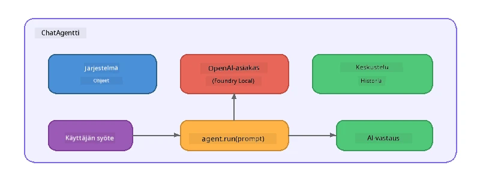

# Osa 5: AI-agenttien rakentaminen Agent Frameworkilla

> **Tavoite:** Rakenna ensimmäinen AI-agenttisi, jolla on pysyvät ohjeet ja määritelty persoona, ja joka toimii paikallisen mallin avulla Foundry Localin kautta.

## Mikä on AI-agentti?

AI-agentti kietoo kielimallin **järjestelmäohjeisiin**, jotka määrittävät sen käyttäytymisen, persoonallisuuden ja rajoitukset. Toisin kuin yksittäinen chat-suorituskutsu, agentti tarjoaa:

- **Persoona** – johdonmukainen identiteetti ("Olet avulias koodin arvostelija")
- **Muisti** – keskusteluhistoria useiden vuorojen yli
- **Erikoistuminen** – tarkkaan laadittuihin ohjeisiin perustuva keskittynyt käyttäytyminen



---

## Microsoft Agent Framework

**Microsoft Agent Framework** (AGF) tarjoaa standardoidun agenttikäsitteen, joka toimii eri mallitaustoilla. Tässä työpajassa käytämme sitä yhdessä Foundry Localin kanssa, joten kaikki toimii koneellasi – pilveä ei tarvita.

| Käsite | Kuvaus |
|---------|-------------|
| `FoundryLocalClient` | Python: hoitaa palvelun käynnistyksen, mallin latauksen ja agenttien luomisen |
| `client.as_agent()` | Python: luo agentin Foundry Local -asiakkaasta |
| `AsAIAgent()` | C#: laajennusmetodi `ChatClient`-luokassa - luo `AIAgent`-agentin |
| `instructions` | Järjestelmän kehotus, joka muokkaa agentin käyttäytymistä |
| `name` | Ihmisen luettava nimi, hyödyllinen moni-agenttien tilanteissa |
| `agent.run(prompt)` / `RunAsync()` | Lähettää käyttäjän viestin ja palauttaa agentin vastauksen |

> **Huom:** Agent Frameworkilla on Python- ja .NET-SDK:t. JavaScriptille toteutamme kevyen `ChatAgent`-luokan, joka noudattaa samaa kaavaa käyttämällä suoraan OpenAI-SDK:ta.

---

## Harjoitukset

### Harjoitus 1 - Ymmärrä agenttikuvio

Ennen koodin kirjoittamista tutustu agentin keskeisiin osiin:

1. **Malliasiakas** – yhdistää Foundry Localin OpenAI-yhteensopivaan APIin
2. **Järjestelmäohjeet** – "persoonallisuus" kehotus
3. **Suoritus-silmukka** – lähetä käyttäjän syöte, vastaanota vastaus

> **Pohdi:** Miten järjestelmäohjeet eroavat tavallisesta käyttäjän viestistä? Mitä tapahtuu, jos muutat niitä?

---

### Harjoitus 2 - Aja yksittäisagentin esimerkki

<details>
<summary><strong>🐍 Python</strong></summary>

**Esivaatimukset:**
```bash
cd python
python -m venv venv

# Windows (PowerShell):
venv\Scripts\Activate.ps1
# macOS:
source venv/bin/activate

pip install -r requirements.txt
```

**Suorita:**
```bash
python foundry-local-with-agf.py
```

**Koodikatsaus** (`python/foundry-local-with-agf.py`):

```python
import asyncio
from agent_framework_foundry_local import FoundryLocalClient

async def main():
    alias = "phi-4-mini"

    # FoundryLocalClient hoitaa palvelun käynnistyksen, mallin latauksen ja lataamisen
    client = FoundryLocalClient(model_id=alias)
    print(f"Client Model ID: {client.model_id}")

    # Luo agentti järjestelmän ohjeilla
    agent = client.as_agent(
        name="Joker",
        instructions="You are good at telling jokes.",
    )

    # Ei suoratoistoa: hanki koko vastaus kerralla
    result = await agent.run("Tell me a joke about a pirate.")
    print(f"Agent: {result}")

    # Suoratoisto: saa tulokset sitä mukaa kun ne generoidaan
    async for chunk in agent.run("Tell me another joke.", stream=True):
        if chunk.text:
            print(chunk.text, end="", flush=True)

asyncio.run(main())
```

**Tärkeimmät kohdat:**
- `FoundryLocalClient(model_id=alias)` hoitaa palvelun käynnistyksen, latauksen ja mallin lataamisen yhdellä kertaa
- `client.as_agent()` luo agentin järjestelmäohjeilla ja nimellä
- `agent.run()` tukee sekä ei-streamaavaa että streamaavaa tilaa
- Asenna komennolla `pip install agent-framework-foundry-local --pre`

</details>

<details>
<summary><strong>📦 JavaScript</strong></summary>

**Esivaatimukset:**
```bash
cd javascript
npm install
```

**Suorita:**
```bash
node foundry-local-with-agent.mjs
```

**Koodikatsaus** (`javascript/foundry-local-with-agent.mjs`):

```javascript
import { OpenAI } from "openai";
import { FoundryLocalManager } from "foundry-local-sdk";

class ChatAgent {
  constructor({ client, modelId, instructions, name }) {
    this.client = client;
    this.modelId = modelId;
    this.instructions = instructions;
    this.name = name;
    this.history = [];
  }

  async run(userMessage) {
    const messages = [
      { role: "system", content: this.instructions },
      ...this.history,
      { role: "user", content: userMessage },
    ];
    const response = await this.client.chat.completions.create({
      model: this.modelId,
      messages,
    });
    const assistantMessage = response.choices[0].message.content;

    // Säilytä keskusteluhistoria monikertaa vaativia vuorovaikutuksia varten
    this.history.push({ role: "user", content: userMessage });
    this.history.push({ role: "assistant", content: assistantMessage });
    return { text: assistantMessage };
  }
}

async function main() {
  FoundryLocalManager.create({ appName: "FoundryLocalWorkshop" });
  const manager = FoundryLocalManager.instance;
  await manager.startWebService();

  const catalog = manager.catalog;
  const model = await catalog.getModel("phi-3.5-mini");
  if (!model.isCached) {
    console.log("Downloading model: phi-3.5-mini...");
    await model.download();
  }
  await model.load();

  const client = new OpenAI({
    baseURL: manager.urls[0] + "/v1",
    apiKey: "foundry-local",
  });

  const agent = new ChatAgent({
    client,
    modelId: model.id,
    instructions: "You are good at telling jokes.",
    name: "Joker",
  });

  const result = await agent.run("Tell me a joke about a pirate.");
  console.log(result.text);
}

main();
```

**Tärkeimmät kohdat:**
- JavaScript rakentaa oman `ChatAgent`-luokan, joka peilaa Pythonin AGF-kuviota
- `this.history` tallentaa keskusteluvuorot moni-vuorotukea varten
- Selkeä `startWebService()` → välimuistitarkastus → `model.download()` → `model.load()` antaa täydellisen näkyvyyden

</details>

<details>
<summary><strong>💜 C#</strong></summary>

**Esivaatimukset:**
```bash
cd csharp
dotnet restore
```

**Suorita:**
```bash
dotnet run agent
```

**Koodikatsaus** (`csharp/SingleAgent.cs`):

```csharp
using Microsoft.AI.Foundry.Local;
using Microsoft.Extensions.Logging.Abstractions;
using Microsoft.Agents.AI;
using OpenAI;
using System.ClientModel;

// 1. Start Foundry Local and load a model
var alias = "phi-3.5-mini";
await FoundryLocalManager.CreateAsync(
    new Configuration
    {
        AppName = "FoundryLocalSamples",
        Web = new Configuration.WebService { Urls = "http://127.0.0.1:0" }
    }, NullLogger.Instance, default);
var manager = FoundryLocalManager.Instance;
await manager.StartWebServiceAsync(default);

var catalog = await manager.GetCatalogAsync(default);
var model = await catalog.GetModelAsync(alias, default);

var isCached = await model.IsCachedAsync(default);
if (!isCached)
{
    Console.WriteLine($"Downloading model: {alias}...");
    await model.DownloadAsync(null, default);
}
await model.LoadAsync(default);

var key = new ApiKeyCredential("foundry-local");
var client = new OpenAIClient(key, new OpenAIClientOptions
{
    Endpoint = new Uri(manager.Urls[0] + "/v1")
});

// 2. Create an AIAgent using the Agent Framework extension method
AIAgent joker = client
    .GetChatClient(model.Id)
    .AsAIAgent(
        instructions: "You are good at telling jokes. Keep your jokes short and family-friendly.",
        name: "Joker"
    );

// 3. Run the agent (non-streaming)
var response = await joker.RunAsync("Tell me a joke about a pirate.");
Console.WriteLine($"Joker: {response}");

// 4. Run with streaming
await foreach (var update in joker.RunStreamingAsync("Tell me another joke."))
{
    Console.Write(update);
}
```

**Tärkeimmät kohdat:**
- `AsAIAgent()` on laajennusmetodi `Microsoft.Agents.AI.OpenAI` -kirjastosta - ei tarvita omaa `ChatAgent`-luokkaa
- `RunAsync()` palauttaa koko vastauksen; `RunStreamingAsync()` striimaa token tokenilta
- Asenna komennolla `dotnet add package Microsoft.Agents.AI.OpenAI --version 1.0.0-rc3`

</details>

---

### Harjoitus 3 - Muuta persoonaa

Muokkaa agentin `instructions`-ohjetta luodaksesi eri persoonan. Kokeile jokaista ja seuraa, miten tulos muuttuu:

| Persoona | Ohjeet |
|---------|-------------|
| Koodin arvostelija | `"Olet asiantunteva koodin arvostelija. Anna rakentavaa palautetta, joka keskittyy luettavuuteen, suorituskykyyn ja oikeellisuuteen."` |
| Matkaopas | `"Olet ystävällinen matkaopas. Anna henkilökohtaisia suosituksia kohteista, aktiviteeteista ja paikallisista herkuista."` |
| Sokraattinen opettaja | `"Olet sokraattinen opettaja. Älä koskaan anna suoria vastauksia – ohjaa oppilasta ajatuksia herättävillä kysymyksillä."` |
| Tekninen kirjoittaja | `"Olet tekninen kirjoittaja. Selitä käsitteet selkeästi ja ytimekkäästi. Käytä esimerkkejä. Vältä ammattislangia."` |

**Kokeile:**
1. Valitse taulukosta persoona
2. Korvaa `instructions`-merkkijono koodissa
3. Säädä käyttäjän kehotetta vastaamaan muuttunutta persoonaa (esim. pyydä koodin arvostelijaa arvioimaan funktio)
4. Aja esimerkki uudelleen ja vertaa tuloksia

> **Vinkki:** Agentin laatu riippuu vahvasti ohjeista. Tarkat, hyvin jäsennellyt ohjeet tuottavat parempia tuloksia kuin epäselvät.

---

### Harjoitus 4 - Lisää moni-vuorokeskustelu

Laajenna esimerkkiä tukemaan moni-vuoroinen chat-silmukkaa, jotta voit käydä edestakaista keskustelua agentin kanssa.

<details>
<summary><strong>🐍 Python - moni-vuoroinen silmukka</strong></summary>

```python
import asyncio
from agent_framework_foundry_local import FoundryLocalClient

async def main():
    client = FoundryLocalClient(model_id="phi-4-mini")

    agent = client.as_agent(
        name="Assistant",
        instructions="You are a helpful assistant.",
    )

    print("Chat with the agent (type 'quit' to exit):\n")
    while True:
        user_input = input("You: ")
        if user_input.strip().lower() in ("quit", "exit"):
            break
        result = await agent.run(user_input)
        print(f"Agent: {result}\n")

asyncio.run(main())
```

</details>

<details>
<summary><strong>📦 JavaScript - moni-vuoroinen silmukka</strong></summary>

```javascript
import { OpenAI } from "openai";
import { FoundryLocalManager } from "foundry-local-sdk";
import * as readline from "node:readline/promises";

// (käytä uudelleen ChatAgent-luokkaa harjoituksesta 2)

async function main() {
  FoundryLocalManager.create({ appName: "FoundryLocalWorkshop" });
  const manager = FoundryLocalManager.instance;
  await manager.startWebService();

  const catalog = manager.catalog;
  const model = await catalog.getModel("phi-3.5-mini");
  if (!model.isCached) {
    console.log("Downloading model: phi-3.5-mini...");
    await model.download();
  }
  await model.load();

  const client = new OpenAI({
    baseURL: manager.urls[0] + "/v1",
    apiKey: "foundry-local",
  });

  const agent = new ChatAgent({
    client,
    modelId: model.id,
    instructions: "You are a helpful assistant.",
    name: "Assistant",
  });

  const rl = readline.createInterface({
    input: process.stdin,
    output: process.stdout,
  });

  console.log("Chat with the agent (type 'quit' to exit):\n");
  while (true) {
    const userInput = await rl.question("You: ");
    if (["quit", "exit"].includes(userInput.trim().toLowerCase())) break;
    const result = await agent.run(userInput);
    console.log(`Agent: ${result.text}\n`);
  }
  rl.close();
}

main();
```

</details>

<details>
<summary><strong>💜 C# - moni-vuoroinen silmukka</strong></summary>

```csharp
using Microsoft.AI.Foundry.Local;
using Microsoft.Extensions.Logging.Abstractions;
using Microsoft.Agents.AI;
using OpenAI;
using System.ClientModel;

var alias = "phi-3.5-mini";
var config = new Configuration
{
    AppName = "FoundryLocalSamples",
    Web = new Configuration.WebService { Urls = "http://127.0.0.1:0" }
};
await FoundryLocalManager.CreateAsync(config, NullLogger.Instance, default);
var manager = FoundryLocalManager.Instance;
await manager.StartWebServiceAsync(default);

var catalog = await manager.GetCatalogAsync(default);
var model = await catalog.GetModelAsync(alias, default);

var isCached = await model.IsCachedAsync(default);
if (!isCached)
{
    Console.WriteLine($"Downloading model: {alias}...");
    await model.DownloadAsync(null, default);
}
await model.LoadAsync(default);

var key = new ApiKeyCredential("foundry-local");
var client = new OpenAIClient(key, new OpenAIClientOptions
{
    Endpoint = new Uri(manager.Urls[0] + "/v1")
});

AIAgent agent = client
    .GetChatClient(model.Id)
    .AsAIAgent(
        instructions: "You are a helpful assistant.",
        name: "Assistant"
    );

Console.WriteLine("Chat with the agent (type 'quit' to exit):\n");
while (true)
{
    Console.Write("You: ");
    var userInput = Console.ReadLine();
    if (string.IsNullOrWhiteSpace(userInput) ||
        userInput.Equals("quit", StringComparison.OrdinalIgnoreCase) ||
        userInput.Equals("exit", StringComparison.OrdinalIgnoreCase))
        break;

    var result = await agent.RunAsync(userInput);
    Console.WriteLine($"Agent: {result}\n");
}
```

</details>

Huomaa, miten agentti muistaa aiemmat vuorot – kysy jatkokysymys ja näe, miten konteksti säilyy.

---

### Harjoitus 5 - Rakenteinen tuloste

Kehota agenttia vastaamaan aina tietyssä muodossa (esim. JSON) ja jäsennä tulos:

<details>
<summary><strong>🐍 Python - JSON-tuloste</strong></summary>

```python
import asyncio
import json
from agent_framework_foundry_local import FoundryLocalClient

async def main():
    client = FoundryLocalClient(model_id="phi-4-mini")

    agent = client.as_agent(
        name="SentimentAnalyzer",
        instructions=(
            "You are a sentiment analysis agent. "
            "For every user message, respond ONLY with valid JSON in this format: "
            '{"sentiment": "positive|negative|neutral", "confidence": 0.0-1.0, "summary": "brief reason"}'
        ),
    )

    result = await agent.run("I absolutely loved the new restaurant downtown!")
    print("Raw:", result)

    try:
        parsed = json.loads(str(result))
        print(f"Sentiment: {parsed['sentiment']} (confidence: {parsed['confidence']})")
    except json.JSONDecodeError:
        print("Agent did not return valid JSON - try refining the instructions.")

asyncio.run(main())
```

</details>

<details>
<summary><strong>💜 C# - JSON-tuloste</strong></summary>

```csharp
using System.Text.Json;

AIAgent analyzer = chatClient.AsAIAgent(
    name: "SentimentAnalyzer",
    instructions:
        "You are a sentiment analysis agent. " +
        "For every user message, respond ONLY with valid JSON in this format: " +
        "{\"sentiment\": \"positive|negative|neutral\", \"confidence\": 0.0-1.0, \"summary\": \"brief reason\"}"
);

var response = await analyzer.RunAsync("I absolutely loved the new restaurant downtown!");
Console.WriteLine($"Raw: {response}");

try
{
    var parsed = JsonSerializer.Deserialize<JsonElement>(response.ToString());
    Console.WriteLine($"Sentiment: {parsed.GetProperty("sentiment")} " +
                      $"(confidence: {parsed.GetProperty("confidence")})");
}
catch (JsonException)
{
    Console.WriteLine("Agent did not return valid JSON - try refining the instructions.");
}
```

</details>

> **Huom:** Pienet paikalliset mallit eivät aina tuota täydellisesti kelvollista JSON:ia. Luotettavuutta voi parantaa sisällyttämällä esimerkin ohjeisiin ja olemalla hyvin tarkka odotetun muodon suhteen.

---

## Keskeiset opit

| Käsite | Mitä opit |
|---------|-----------------|
| Agentti vs. suora LLM-kutsu | Agentti kietoo mallin ohjeiden ja muistin ympärille |
| Järjestelmäohjeet | Tärkein hallintavipu agentin käyttäytymiseen |
| Moni-vuoroinen keskustelu | Agentit voivat kantaa kontekstia monen käyttäjävuorovaikutuksen yli |
| Rakenteinen tuloste | Ohjeet voivat pakottaa tulosteen muodon (JSON, markdown jne.) |
| Paikallinen suoritus | Kaikki ajetaan laitteella Foundry Localin kautta – pilveä ei tarvita |

---

## Seuraavat askeleet

**[Osa 6: Moni-agenttityönkulut](part6-multi-agent-workflows.md)** yhdistät useita agentteja koordinoiduksi ketjuksi, jossa jokaisella agentilla on oma erikoistunut roolinsa.