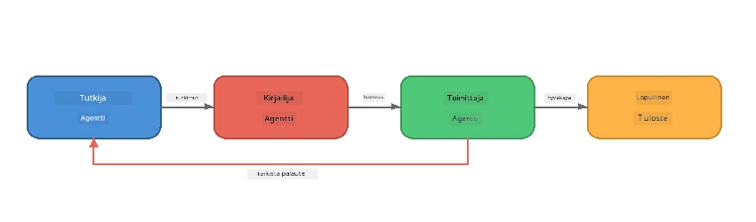
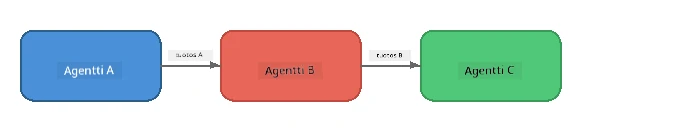
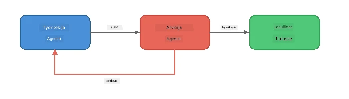
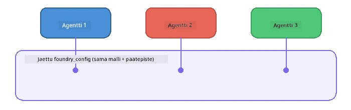

# Osa 6: Moniagenttiset työnkulut

> **Tavoite:** Yhdistä useita erikoistuneita agenteja koordinoiduiksi työnkuluiksi, jotka jakavat monimutkaiset tehtävät yhteistyötä tekevien agenttien kesken – kaikki paikallisesti Foundry Localin avulla.

## Miksi moniagenttinen?

Yksi agentti voi hoitaa monia tehtäviä, mutta monimutkaiset työnkulut hyötyvät **erikoistumisesta**. Sen sijaan, että yksi agentti yrittäisi tutkia, kirjoittaa ja muokata samanaikaisesti, työ jaetaan keskittyneisiin rooleihin:



| Kuvio | Kuvaus |
|---------|-------------|
| **Peräkkäinen** | Agentin A tulos syötetään agentille B → agentille C |
| **Palautesilmukka** | Arvioija-agentti voi lähettää työn takaisin tarkistettavaksi |
| **Jaettu konteksti** | Kaikki agentit käyttävät samaa mallia/päätepistettä, mutta eri ohjeilla |
| **Tyypitetty tulos** | Agentit tuottavat jäsenneltyjä tuloksia (JSON) luotettaviin siirtoihin |

---

## Harjoitukset

### Harjoitus 1 - Aja moniagenttinen työnkulku

Työpaja sisältää täydellisen Tutkija → Kirjoittaja → Toimittaja -työnkulun.

<details>
<summary><strong>🐍 Python</strong></summary>

**Asetus:**
```bash
cd python
python -m venv venv

# Windows (PowerShell):
venv\Scripts\Activate.ps1
# macOS:
source venv/bin/activate

pip install -r requirements.txt
```

**Aja:**
```bash
python foundry-local-multi-agent.py
```

**Mitä tapahtuu:**
1. **Tutkija** saa aiheen ja palauttaa ytimekkäitä faktatietoja
2. **Kirjoittaja** käyttää tutkimusta ja laatii blogikirjoituksen (3-4 kappaletta)
3. **Toimittaja** tarkistaa artikkelin laadun ja palauttaa HYVÄKSY tai TARKISTA UUDENNA

</details>

<details>
<summary><strong>📦 JavaScript</strong></summary>

**Asetus:**
```bash
cd javascript
npm install
```

**Aja:**
```bash
node foundry-local-multi-agent.mjs
```

**Sama kolmivaiheinen työnkulku** - Tutkija → Kirjoittaja → Toimittaja.

</details>

<details>
<summary><strong>💜 C#</strong></summary>

**Asetus:**
```bash
cd csharp
dotnet restore
```

**Aja:**
```bash
dotnet run multi
```

**Sama kolmivaiheinen työnkulku** - Tutkija → Kirjoittaja → Toimittaja.

</details>

---

### Harjoitus 2 - Työnkulun anatomia

Tarkastele, miten agentit määritellään ja yhdistetään:

**1. Jaettu malliasiakas**

Kaikki agentit jakavat saman Foundry Local -mallin:

```python
# Python - FoundryLocalClient hoitaa kaiken
from agent_framework_foundry_local import FoundryLocalClient

client = FoundryLocalClient(model_id="phi-3.5-mini")
```

```javascript
// JavaScript - OpenAI SDK osoitetaan Foundry Localiin
const client = new OpenAI({
  baseURL: manager.urls[0] + "/v1",
  apiKey: "foundry-local",
});
```

```csharp
// C# - OpenAIClient pointed at Foundry Local
var key = new ApiKeyCredential("foundry-local");
var client = new OpenAIClient(key, new OpenAIClientOptions
{
    Endpoint = new Uri(manager.Urls[0] + "/v1")
});
var chatClient = client.GetChatClient(model.Id);
```

**2. erikoistuneet ohjeet**

Jokaisella agentilla on oma persoona:

| Agentti | Ohjeet (yhteenveto) |
|-------|----------------------|
| Tutkija | "Anna keskeiset faktat, tilastot ja taustatiedot. Järjestä luetelmana." |
| Kirjoittaja | "Kirjoita mukaansatempaava blogikirjoitus (3-4 kappaletta) tutkimusmuistiinpanoista. Älä keksi faktoja." |
| Toimittaja | "Tarkista selkeys, kielioppivirheet ja faktojen johdonmukaisuus. Päätös: HYVÄKSY tai TARKISTA UUDENNA." |

**3. Tiedonkulku agenttien välillä**

```python
# Vaihe 1 - tutkijan tuotos muuttuu kirjoittajan syötteeksi
research_result = await researcher.run(f"Research: {topic}")

# Vaihe 2 - kirjoittajan tuotos muuttuu toimittajan syötteeksi
writer_result = await writer.run(f"Write using:\n{research_result}")

# Vaihe 3 - toimittaja arvioi sekä tutkimuksen että artikkelin
editor_result = await editor.run(
    f"Research:\n{research_result}\n\nArticle:\n{writer_result}"
)
```

```csharp
// C# - same pattern, async calls with AIAgent
var researchNotes = await researcher.RunAsync(
    $"Research the following topic and provide key facts:\n{topic}");

var draft = await writer.RunAsync(
    $"Write a blog post based on these research notes:\n\n{researchNotes}");

var verdict = await editor.RunAsync(
    $"Review this article for quality and accuracy.\n\n" +
    $"Research notes:\n{researchNotes}\n\n" +
    $"Article:\n{draft}");
```

> **Keskeinen oivallus:** Kukin agentti saa kumulatiivisen kontekstin edellisiltä agenteilta. Toimittaja näkee sekä alkuperäisen tutkimuksen että luonnoksen – näin se voi tarkistaa faktojen johdonmukaisuuden.

---

### Harjoitus 3 - Lisää neljäs agentti

Laajenna työnkulkua lisäämällä uusi agentti. Valitse yksi:

| Agentti | Tarkoitus | Ohjeet |
|-------|---------|-------------|
| **Faktantarkastaja** | Varmistaa artikkelin väitteet | `"Tarkistat faktaväitteet. Jokaisesta väitteestä kerrot, onko se tutkimusmuistiinpanojen tukema. Palauta JSON, jossa vahvistetut/ vahvistamattomat kohteet."` |
| **Otsikkokirjoittaja** | Luo houkuttelevia otsikoita | `"Luo 5 eri tyylistä otsikkovaihtoehtoa artikkelille: informatiivinen, klikkijulkaisu, kysymys, listaus, tunteisiin vetoava."` |
| **Sosiaalinen media** | Luo mainosviestejä | `"Laadi 3 sosiaalisen median postausta, jotka mainostavat tätä artikkelia: yksi Twitterille (280 merkkiä), yksi LinkedInille (ammatillinen sävy), yksi Instagramille (rentoa emojisuosituksilla)."` |

<details>
<summary><strong>🐍 Python - otsikkokirjoittajan lisääminen</strong></summary>

```python
headline_agent = client.as_agent(
    name="HeadlineWriter",
    instructions=(
        "You are a headline specialist. Given an article, generate exactly "
        "5 headline options. Vary the style: informative, question-based, "
        "listicle, emotional, and provocative. Return them as a numbered list."
    ),
)

# Kun muokkaaja hyväksyy, luo otsikot
headline_result = await headline_agent.run(
    f"Generate headlines for this article:\n\n{writer_result}"
)
print(f"\n--- Headlines ---\n{headline_result}")
```

</details>

<details>
<summary><strong>📦 JavaScript - otsikkokirjoittajan lisääminen</strong></summary>

```javascript
const headlineAgent = new ChatAgent({
  client,
  modelId: modelInfo.id,
  instructions:
    "You are a headline specialist. Given an article, generate exactly " +
    "5 headline options. Vary the style: informative, question-based, " +
    "listicle, emotional, and provocative. Return them as a numbered list.",
  name: "HeadlineWriter",
});

const headlineResult = await headlineAgent.run(
  `Generate headlines for this article:\n\n${writerResult.text}`
);
console.log(`\n--- Headlines ---\n${headlineResult.text}`);
```

</details>

<details>
<summary><strong>💜 C# - otsikkokirjoittajan lisääminen</strong></summary>

```csharp
AIAgent headlineAgent = chatClient.AsAIAgent(
    name: "HeadlineWriter",
    instructions:
        "You are a headline specialist. Given an article, generate exactly " +
        "5 headline options. Vary the style: informative, question-based, " +
        "listicle, emotional, and provocative. Return them as a numbered list."
);

// After the editor accepts, generate headlines
var headlines = await headlineAgent.RunAsync(
    $"Generate headlines for this article:\n\n{draft}");
Console.WriteLine($"\n--- Headlines ---\n{headlines}");
```

</details>

---

### Harjoitus 4 - Suunnittele oma työnkulku

Suunnittele moniagenttinen työnkulku eri alalle. Tässä muutamia ideoita:

| Ala | Agentit | Kulku |
|--------|--------|------|
| **Koodikatselmointi** | Analysoija → Tarkastaja → Yhteenvetäjä | Analysoi koodirakenne → tarkasta ongelmat → laadi yhteenvetoraportti |
| **Asiakaspalvelu** | Luokittelija → Vastaaja → Laadunvalvoja | Luokittele tiketti → luonnostele vastaus → tarkista laatu |
| **Koulutus** | Kysymyspankin tekijä → Oppilas-simulaattori → Arvostelija | Laadi kysely → simuloi vastaukset → arvioi ja selitä |
| **Datan analysointi** | Tulkitsija → Analyytikko → Raportoija | Tulkkaa datapyynnöt → analysoi mallit → kirjoita raportti |

**Vaiheet:**
1. Määritä 3+ agenttia eri `ohjeilla`
2. Päätä datan kulku – mitä kukin agentti saa ja tuottaa?
3. Toteuta työnkulku Harjoitusten 1–3 kuvioiden mukaan
4. Lisää palautesilmukka, jos jokin agentti arvioi toisen työn

---

## Orkestrointikuvioita

Tässä yleiset orkestrointimallit, joita voi soveltaa mihin tahansa moniagenttijärjestelmään (syvällisemmin käsitelty [Osa 7](part7-zava-creative-writer.md)):

### Peräkkäinen työnkulku



Jokainen agentti käsittelee aiemman tuottaman tuloksen. Yksinkertaista ja ennustettavaa.

### Palautesilmukka



Arvioija-agentti voi laukaista varhaisemman vaiheen uudelleenkäytön. Zava Writer käyttää tätä: toimittaja voi lähettää palautetta tutkijalle ja kirjoittajalle.

### Jaettu konteksti



Kaikki agentit jakavat saman `foundry_config`-asetuksen, joten he käyttävät samaa mallia ja päätepistettä.

---

## Keskeiset opit

| Käsite | Mitä opit |
|---------|-----------------|
| Agenttien erikoistuminen | Jokainen agentti tekee yhden asian hyvin keskittyneillä ohjeilla |
| Datan siirrot | Toisen agentin tulos syötteenä seuraavalle |
| Palautesilmukat | Arvioija voi laukoa uudelleenyrityksiä laadun parantamiseksi |
| Jäsennelty tulos | JSON-muotoiset vastaukset mahdollistavat luotettavan agenttien välisen viestinnän |
| Orkestrointi | Koordinaattori hallitsee työnkulun etenemisen ja virheenkäsittelyn |
| Tuotantomallit | Käytetty [Osa 7: Zava Creative Writerissä](part7-zava-creative-writer.md) |

---

## Seuraavat askeleet

Jatka [Osa 7: Zava Creative Writer - lopputyösovellus](part7-zava-creative-writer.md), jossa tutkitaan tuotantotyyppistä moniagenttisovellusta neljällä erikoistuneella agentilla, suoran syötteen tulostuksella, tuotteen haulla ja palautesilmukoilla – saatavilla Pythonille, JavaScriptille ja C#:lle.