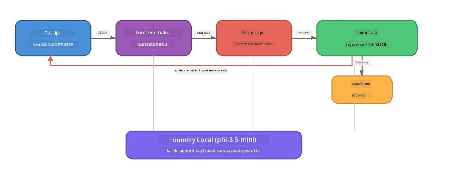

# Osa 7: Zava Creative Writer - Lopputyösovellus

> **Tavoite:** Tutkia tuotantotyyppistä moniagenttisovellusta, jossa neljä erikoistunutta agenttia yhteistyössä tuottavat aikakauslehtimittaisia artikkeleita Zava Retail DIY:lle — kaikki suoraan omalla laitteellasi Foundry Localin avulla.

Tämä on työpajan **lopputyöosio**. Se kokoaa yhteen kaiken oppimasi - SDK-integraation (Osa 3), paikallisesta datasta haun (Osa 4), agenttihahmot (Osa 5) ja moniagenttien orkestroinnin (Osa 6) - ja muodostaa täydellisen sovelluksen, saatavilla **Pythonilla**, **JavaScriptillä** ja **C#:lla**.

---

## Mitä Tutkit

| Käsite | Missä Zava Writerissa |
|---------|------------------------|
| 4-vaiheinen mallin lataus | Yhteinen konfiguraatiomoduuli käynnistää Foundry Localin |
| RAG-tyyppinen haku | Tuoteagentti etsii paikallisesta luettelosta |
| Agenttien erikoistuminen | 4 agenttia, joilla eri järjestelmäkehotteet |
| Virtaava tulostus | Kirjoittaja tuottaa sanoja reaaliajassa |
| Rakenteelliset siirtymät | Tutkija → JSON, Toimittaja → JSON-päätös |
| Palautesilmukat | Toimittaja voi laukaista uudelleensuorituksen (max 2 yritystä) |

---

## Arkkitehtuuri

Zava Creative Writer käyttää **peräkkäistä putkistoa arvioijavetoisella palautteella**. Kaikki kolme kieliversiota noudattavat samaa arkkitehtuuria:



### Neljä Agenttia

| Agentti | Syöte | Tuloste | Tarkoitus |
|---------|-------|---------|-----------|
| **Tutkija** | Aihe + valinnainen palaute | `{"web": [{url, name, description}, ...]}` | Kerää taustatutkimusta LLM:n avulla |
| **Tuotehaku** | Tuotekontekstimerkkijono | Lista vastanneista tuotteista | LLM:n generoimat kyselyt + avainsanahaku paikallisessa luettelossa |
| **Kirjoittaja** | Tutkimus + tuotteet + tehtävä + palaute | Virtaava artikkelin teksti (jaetaan `---` kohdalta) | Laatii aikakauslehtitason artikkelin reaaliajassa |
| **Toimittaja** | Artikkeli + kirjoittajan itsearviointi | `{"decision": "accept/revise", "editorFeedback": "...", "researchFeedback": "..."}` | Arvioi laatua, laukaisee tarvittaessa uudelleen yrityksen |

### Putkiston Kulku

1. **Tutkija** vastaanottaa aiheen ja tuottaa rakenteellisia tutkimusmuistiinpanoja (JSON)
2. **Tuotehaku** tekee hakuja paikalliseen tuotekatalogiin LLM:n generoimilla hakusanoilla
3. **Kirjoittaja** yhdistää tutkimuksen, tuotteet, tehtävän ja virtaavan artikkelin, lisää itsearvioinnin `---` erotinmerkin jälkeen
4. **Toimittaja** arvioi artikkelin ja palauttaa JSON-käytös:
   - `"accept"` → putkisto loppuu
   - `"revise"` → palaute lähetetään takaisin Tutkijalle ja Kirjoittajalle (max 2 yritystä)

---

## Esivalmistelut

- Suorita [Osa 6: Moniagenttien työnkulut](part6-multi-agent-workflows.md)
- Foundry Local CLI asennettuna ja `phi-3.5-mini` -malli ladattuna

---

## Harjoitukset

### Harjoitus 1 - Käynnistä Zava Creative Writer

Valitse kielesi ja aja sovellus:

<details>
<summary><strong>🐍 Python - FastAPI Web-palvelu</strong></summary>

Python-versio toimii **web-palveluna** REST API:lla, näyttää esimerkin tuotannon backendistä.

**Asennus:**
```bash
cd zava-creative-writer-local/src/api
python -m venv venv

# Windows (PowerShell):
venv\Scripts\Activate.ps1
# macOS:
source venv/bin/activate

pip install -r requirements.txt
```

**Käynnistys:**
```bash
uvicorn main:app --reload
```

**Testaa:**
```bash
curl -X POST http://localhost:8000/api/article \
  -H "Content-Type: application/json" \
  -d '{
    "research": "DIY home improvement trends",
    "products": "power tools and paints",
    "assignment": "Write an article about weekend renovation projects for DIY enthusiasts"
  }'
```

Vastaus tulee virtaavana uudelle rivi-riviltä muodostuvana JSON-viestinä, jossa näkyy kunkin agentin eteneminen.

</details>

<details>
<summary><strong>📦 JavaScript - Node.js CLI</strong></summary>

JavaScript-versio toimii **CLI-sovelluksena**, tulostaa agenttien etenemisen ja artikkelin suoraan konsoliin.

**Asennus:**
```bash
cd zava-creative-writer-local/src/javascript
npm install
```

**Käynnistys:**
```bash
node main.mjs
```

Näet:
1. Foundry Local mallin lataus (edistymispalkki näkyy latauksen aikana)
2. Jokaisen agentin peräkkäinen suoritus tilaviestien kanssa
3. Artikkelin reaaliaikainen virtauskirjoitus konsoliin
4. Toimittajan hyväksymis-/muokkauspäätös

</details>

<details>
<summary><strong>💜 C# - .NET Konsolisovellus</strong></summary>

C#-versio toimii **.NET-konsolisovelluksena**, sama putkisto ja virtausulostulo.

**Asennus:**
```bash
cd zava-creative-writer-local/src/csharp
dotnet restore
```

**Käynnistys:**
```bash
dotnet run
```

Sama tulostuskuvio kuin JavaScriptissä - agenttien tilaviestit, virtaava artikkeli ja toimittajan päätös.

</details>

---

### Harjoitus 2 - Tutki Koodirakennetta

Jokaisella kielellä on samat loogiset osat. Vertaa rakenteita:

**Python** (`src/api/`):
| Tiedosto | Tarkoitus |
|----------|-----------|
| `foundry_config.py` | Yhteinen Foundry Local manager, malli ja client (4-vaiheinen init) |
| `orchestrator.py` | Putkiston koordinointi palautesilmukalla |
| `main.py` | FastAPI-päätepisteet (`POST /api/article`) |
| `agents/researcher/researcher.py` | LLM-pohjainen tutkimus JSON-tulosteella |
| `agents/product/product.py` | LLM:n generoimat kyselyt + avainsanahaku |
| `agents/writer/writer.py` | Virtaava artikkelinluonti |
| `agents/editor/editor.py` | JSON-pohjainen hyväksy/muokkaa-päätös |

**JavaScript** (`src/javascript/`):
| Tiedosto | Tarkoitus |
|----------|-----------|
| `foundryConfig.mjs` | Yhteinen Foundry Local konfiguraatio (4-vaiheinen init edistymispalkilla) |
| `main.mjs` | Orkestroija + CLI-sisäänkäynti |
| `researcher.mjs` | LLM-pohjainen tutkimusagentti |
| `product.mjs` | LLM-kyselyiden generointi + avainsanahaku |
| `writer.mjs` | Virtaava artikkelin generointi (async-generoija) |
| `editor.mjs` | JSON hyväksy/muokkaa-päätös |
| `products.mjs` | Tuotekatalogin data |

**C#** (`src/csharp/`):
| Tiedosto | Tarkoitus |
|----------|-----------|
| `Program.cs` | Koko putkisto: mallin lataus, agentit, orkestroija, palautesilmukka |
| `ZavaCreativeWriter.csproj` | .NET 9 projekti Foundry Localilla + OpenAI-paketeilla |

> **Suunnittelumuistiinpano:** Python erottaa jokaisen agentin omaksi tiedostoksi/ympäristöksi (hyvä isommille tiimeille). JavaScript käyttää yhtä moduulia per agentti (hyvä keskisuurille projekteille). C# pitää kaiken samassa tiedostossa paikallisilla funktioilla (hyvä itsenäisille esimerkeille). Tuotannossa valitse malli, joka sopii tiimisi tapoihin.

---

### Harjoitus 3 - Seuraa Yhteistä Konfiguraatiota

Jokainen putkiston agentti jakaa saman Foundry Local -malliasiakkaan. Tutki, miten se on toteutettu kussakin kielessä:

<details>
<summary><strong>🐍 Python - foundry_config.py</strong></summary>

```python
from foundry_local import FoundryLocalManager

MODEL_ALIAS = "phi-3.5-mini"

# Vaihe 1: Luo manageri ja käynnistä Foundry Local -palvelu
manager = FoundryLocalManager()
manager.start_service()

# Vaihe 2: Tarkista, onko malli jo ladattu
cached = manager.list_cached_models()
catalog_info = manager.get_model_info(MODEL_ALIAS)
is_cached = any(m.id == catalog_info.id for m in cached) if catalog_info else False

if not is_cached:
    manager.download_model(MODEL_ALIAS)

# Vaihe 3: Lataa malli muistiin
manager.load_model(MODEL_ALIAS)
model_id = manager.get_model_info(MODEL_ALIAS).id

# Jaettu OpenAI-asiakas
client = openai.OpenAI(base_url=manager.endpoint, api_key=manager.api_key)
```

Kaikki agentit tuovat `from foundry_config import client, model_id`.

</details>

<details>
<summary><strong>📦 JavaScript - foundryConfig.mjs</strong></summary>

```javascript
import { FoundryLocalManager } from "foundry-local-sdk";
import { OpenAI } from "openai";

FoundryLocalManager.create({ appName: "ZavaCreativeWriter" });
const manager = FoundryLocalManager.instance;
await manager.startWebService();

// Tarkista välimuisti → lataa → käynnistä (uusi SDK-malli)
const catalog = manager.catalog;
const model = await catalog.getModel(MODEL_ALIAS);
if (!model.isCached) {
  console.log(`Downloading model: ${MODEL_ALIAS}...`);
  await model.download();
}
await model.load();

const client = new OpenAI({ baseURL: manager.urls[0] + "/v1", apiKey: "foundry-local" });
const modelId = model.id;
export { client, modelId };
```

Kaikki agentit tuovat `{ client, modelId } from "./foundryConfig.mjs"`.

</details>

<details>
<summary><strong>💜 C# - Program.cs:n alku</strong></summary>

```csharp
await FoundryLocalManager.CreateAsync(
    new Configuration
    {
        AppName = "ZavaCreativeWriter",
        Web = new Configuration.WebService { Urls = "http://127.0.0.1:0" }
    }, NullLogger.Instance, default);
var manager = FoundryLocalManager.Instance;
await manager.StartWebServiceAsync(default);

var catalog = await manager.GetCatalogAsync(default);
var catalogModel = await catalog.GetModelAsync(alias, default);
var isCached = await catalogModel.IsCachedAsync(default);
if (!isCached)
    await catalogModel.DownloadAsync(null, default);

await catalogModel.LoadAsync(default);
var key = new ApiKeyCredential("foundry-local");
var chatClient = new OpenAIClient(key, new OpenAIClientOptions
{
    Endpoint = new Uri(manager.Urls[0] + "/v1")
}).GetChatClient(catalogModel.Id);
```

`chatClient` välitetään kaikille agenttifunktioille samassa tiedostossa.

</details>

> **Keskeinen malli:** mallin latauksen malli (käynnistä palvelu → tarkista välimuisti → lataa → lataa malli) takaa näkyvän etenemisen käyttäjälle ja mallin lataamisen vain kerran. Tämä on suositeltu käytäntö kaikissa Foundry Local -sovelluksissa.

---

### Harjoitus 4 - Ymmärrä Palautesilmukka

Palautesilmukka tekee putkistosta "älykkään" — Toimittaja voi palauttaa työn muokattavaksi. Seuraa logiikkaa:

```
Orchestrator:
  1. researcher.research(topic, "No Feedback")    ← first pass
  2. product.findProducts(productContext)
  3. writer.write(research, products, assignment)  ← streams article
  4. Split article at "---" → article + writerFeedback
  5. editor.edit(article, writerFeedback)

  WHILE editor says "revise" AND retryCount < 2:
    6. researcher.research(topic, editor.researchFeedback)  ← refined
    7. writer.write(research, products, editor.editorFeedback)
    8. editor.edit(newArticle, newWriterFeedback)
    9. retryCount++
```

**Pohdittavia kysymyksiä:**
- Miksi uudelleenyritysraja on 2? Mitä tapahtuu, jos kasvatat sitä?
- Miksi tutkija saa `researchFeedback` mutta kirjoittaja `editorFeedback`?
- Mitä tapahtuisi, jos toimittaja sanoisi aina "revise"?

---

### Harjoitus 5 - Muokkaa Agentin Käyttäytymistä

Yritä muuttaa yhden agentin toimintaa ja seuraa, miten se vaikuttaa putkistoon:

| Muutos | Mitä muuttaa |
|--------|--------------|
| **Tiukempi toimittaja** | Muuta toimittajan järjestelmäkehotetta niin, että se vaatii aina vähintään yhden muokkauskierroksen |
| **Pidemmät artikkelit** | Muuta kirjoittajan kehotetta "800-1000 sanaa" → "1500-2000 sanaa" |
| **Eri tuotteet** | Lisää tai muokkaa tuotteita tuotekatalogissa |
| **Uusi tutkimusaihe** | Vaihda oletus `researchContext` eri aiheeseen |
| **Vain JSON-tutkija** | Tee tutkijasta palauttamaan 10 kohdetta 3-5 sijaan |

> **Vinkki:** Koska kaikki kolme kieltä käyttävät samaa arkkitehtuuria, voit tehdä saman muutoksen siinä kielessä, jossa olet mukavin.

---

### Harjoitus 6 - Lisää Viides Agentti

Laajenna putkistoa uudella agentilla. Joitakin ideoita:

| Agentti | Missä putkistossa | Tarkoitus |
|---------|--------------------|-----------|
| **Faktantarkistaja** | Kirjoittajan jälkeen, ennen Toimittajaa | Varmistaa väitteet tutkimusdatan perusteella |
| **SEO-Optimoiija** | Toimittajan hyväksynnän jälkeen | Lisää meta-kuvaus, avainsanat, URL-polku |
| **Kuvittaja** | Toimittajan hyväksynnän jälkeen | Luo kuvan ohjeistuksia artikkeliin |
| **Kääntäjä** | Toimittajan hyväksynnän jälkeen | Käännä artikkeli toiselle kielelle |

**Vaiheet:**
1. Kirjoita agentin järjestelmäkehotus
2. Luo agenttifunktio (vastaa olemassa olevaa mallia kielessäsi)
3. Lisää se orkestroijaan oikeaan kohtaan
4. Päivitä tulostus/lokinäkymä näyttämään agentin panos

---

## Miten Foundry Local ja Agenttikehys Toimivat Yhdessä

Tämä sovellus demonstroi suositeltua mallia moniagenttijärjestelmille Foundry Localin kanssa:

| Kerros | Komponentti | Rooli |
|--------|-------------|-------|
| **Ajonaika** | Foundry Local | Lataa, hallinnoi ja palvelee mallia paikallisesti |
| **Asiakas** | OpenAI SDK | Lähettää chat-valmiit vastaukset paikalliselle päätepisteelle |
| **Agentti** | Järjestelmäkehotus + chat-kutsu | erikoistunut käyttäytyminen keskittyneiden ohjeiden kautta |
| **Orkestroija** | Putkiston koordinaattori | Hallinnoi datan kulkua, sarjoitusta ja palautesilmukoita |
| **Kehys** | Microsoft Agent Framework | Tarjoaa `ChatAgent`-abstraktion ja mallirakenteet |

Keskeinen ymmärrys: **Foundry Local korvaa pilvialustan, ei sovelluksen arkkitehtuuria.** Samat agenttimallit, orkestrointistrategiat ja rakenteelliset siirtymät, jotka toimivat pilvessä, toimivat identtisesti paikallisilla malleilla — sinun tarvitsee vain osoittaa asiakas paikalliselle päätepisteelle Azuren sijaan.

---

## Keskeiset Opit

| Käsite | Mitä Opit |
|--------|-----------|
| Tuotantoarkkitehtuuri | Kuinka rakentaa moniagenttisovellus yhteisellä konfiguraatiolla ja erillisin agentein |
| 4-vaiheinen mallin lataus | Parhaat käytännöt Foundry Localin aloitukseen käyttäjän nähtävällä edistymisellä |
| Agenttien erikoistuminen | Jokaisella 4 agentilla on omat ohjeensa ja oma tulostemuotonsa |
| Virtaava generointi | Kirjoittaja tuottaa sanoja reaaliajassa, mahdollistaen reagoivat käyttöliittymät |
| Palautesilmukat | Toimittajan ohjaama uudelleenyritys parantaa laatua ilman ihmiskäsittelyä |
| Poikkikieliset mallit | Sama arkkitehtuuri toimii Pythonissa, JavaScriptissä ja C#:ssa |
| Paikallinen = tuotantovalmi | Foundry Local palvelee samaa OpenAI-yhteensopivaa API:a kuin pilvipalvelut |

---

## Seuraava Ask

Jatka [Osa 8: Arviointivetoisen kehityksen](part8-evaluation-led-development.md) pariin rakentaaksesi systemaattisen arviointikehyksen agenteillesi käyttäen kulta-aineistoja, sääntöpohjaisia tarkistuksia ja LLM:n tuomarointipisteytyksiä.