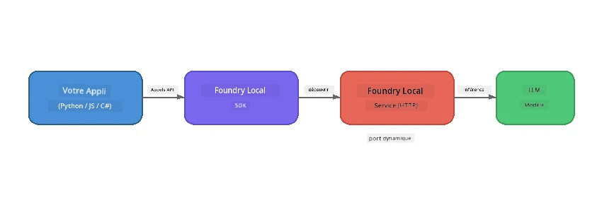

# Partie 1 : Premiers pas avec Foundry Local


## Qu'est-ce que Foundry Local ?

[Foundry Local](https://foundrylocal.ai) vous permet d'exécuter des modèles de langage IA open source **directement sur votre ordinateur** - sans internet, sans coûts cloud et avec une confidentialité totale des données. Il :

- **Télécharge et exécute des modèles localement** avec une optimisation matérielle automatique (GPU, CPU ou NPU)
- **Fournit une API compatible OpenAI** pour que vous puissiez utiliser les SDK et outils familiers
- **Ne nécessite pas d'abonnement Azure** ni d'inscription - installez simplement et commencez à développer

Pensez-y comme à votre propre IA privée qui fonctionne entièrement sur votre machine.

## Objectifs d'apprentissage

À la fin de ce laboratoire, vous serez capable de :

- Installer le CLI Foundry Local sur votre système d'exploitation
- Comprendre ce que sont les alias de modèles et comment ils fonctionnent
- Télécharger et exécuter votre premier modèle IA local
- Envoyer un message de chat à un modèle local depuis la ligne de commande
- Comprendre la différence entre les modèles IA locaux et hébergés dans le cloud

---

## Prérequis

### Configuration système requise

| Exigence | Minimum | Recommandé |
|-------------|---------|-------------|
| **RAM** | 8 Go | 16 Go |
| **Espace disque** | 5 Go (pour les modèles) | 10 Go |
| **CPU** | 4 cœurs | 8+ cœurs |
| **GPU** | Optionnel | NVIDIA avec CUDA 11.8+ |
| **Système d'exploitation** | Windows 10/11 (x64/ARM), Windows Server 2025, macOS 13+ | - |

> **Note :** Foundry Local sélectionne automatiquement la meilleure variante de modèle pour votre matériel. Si vous avez un GPU NVIDIA, il utilise l'accélération CUDA. Si vous avez un NPU Qualcomm, il l'utilise. Sinon, il revient à une variante optimisée pour CPU.

### Installer Foundry Local CLI

**Windows** (PowerShell) :  
```powershell
winget install Microsoft.FoundryLocal
```
  
**macOS** (Homebrew) :  
```bash
brew tap microsoft/foundrylocal
brew install foundrylocal
```
  
> **Note :** Foundry Local prend actuellement en charge uniquement Windows et macOS. Linux n'est pas pris en charge pour le moment.

Vérifiez l'installation :  
```bash
foundry --version
```
  
---

## Exercices du laboratoire

### Exercice 1 : Explorer les modèles disponibles

Foundry Local inclut un catalogue de modèles open source pré-optimisés. Listez-les :

```bash
foundry model list
```
  
Vous verrez des modèles tels que :  
- `phi-3.5-mini` - Modèle Microsoft de 3,8 milliards de paramètres (rapide, bonne qualité)  
- `phi-4-mini` - Modèle Phi plus récent et plus performant  
- `phi-4-mini-reasoning` - Modèle Phi avec raisonnement en chaîne (`<think>` tags)  
- `phi-4` - Plus grand modèle Phi de Microsoft (10,4 Go)  
- `qwen2.5-0.5b` - Très petit et rapide (idéal pour les appareils peu puissants)  
- `qwen2.5-7b` - Modèle polyvalent puissant avec support d'appel d'outils  
- `qwen2.5-coder-7b` - Optimisé pour la génération de code  
- `deepseek-r1-7b` - Modèle puissant pour le raisonnement  
- `gpt-oss-20b` - Grand modèle open source (licence MIT, 12,5 Go)  
- `whisper-base` - Transcription vocal-texte (383 Mo)  
- `whisper-large-v3-turbo` - Transcription haute précision (9 Go)  

> **Qu'est-ce qu'un alias de modèle ?** Les alias comme `phi-3.5-mini` sont des raccourcis. Lorsque vous utilisez un alias, Foundry Local télécharge automatiquement la meilleure variante pour votre matériel spécifique (CUDA pour GPU NVIDIA, variante optimisée CPU sinon). Vous n'avez jamais à vous soucier de choisir la bonne variante.

### Exercice 2 : Exécutez votre premier modèle

Téléchargez et commencez à discuter avec un modèle de manière interactive :

```bash
foundry model run phi-3.5-mini
```
  
La première fois que vous lancez cette commande, Foundry Local va :  
1. Détecter votre matériel  
2. Télécharger la variante optimale du modèle (cela peut prendre quelques minutes)  
3. Charger le modèle en mémoire  
4. Démarrer une session de chat interactive

Essayez de lui poser quelques questions :  
```
You: What is the golden ratio?
You: Can you explain it as if I were 10 years old?
You: Write a haiku about mathematics
```
  
Tapez `exit` ou appuyez sur `Ctrl+C` pour quitter.

### Exercice 3 : Pré-télécharger un modèle

Si vous souhaitez télécharger un modèle sans démarrer une session de chat :

```bash
foundry model download phi-3.5-mini
```
  
Vérifiez quels modèles sont déjà téléchargés sur votre machine :

```bash
foundry cache list
```
  
### Exercice 4 : Comprendre l'architecture

Foundry Local fonctionne comme un **service HTTP local** qui expose une API REST compatible OpenAI. Cela signifie :

1. Le service démarre sur un **port dynamique** (un port différent à chaque démarrage)  
2. Vous utilisez le SDK pour découvrir l'URL d'accès réelle  
3. Vous pouvez utiliser **n'importe quelle** bibliothèque cliente compatible OpenAI pour communiquer avec lui



> **Important :** Foundry Local attribue un **port dynamique** à chaque démarrage. Ne codez jamais en dur un numéro de port comme `localhost:5272`. Utilisez toujours le SDK pour découvrir l'URL actuelle (par exemple `manager.endpoint` en Python ou `manager.urls[0]` en JavaScript).

---

## Points clés à retenir

| Concept | Ce que vous avez appris |
|---------|------------------------|
| IA sur appareil | Foundry Local exécute les modèles entièrement sur votre appareil sans cloud, sans clés API, sans coûts |
| Alias de modèles | Les alias comme `phi-3.5-mini` sélectionnent automatiquement la meilleure variante pour votre matériel |
| Ports dynamiques | Le service tourne sur un port dynamique ; utilisez toujours le SDK pour découvrir le point d'accès |
| CLI et SDK | Vous pouvez interagir avec les modèles via la CLI (`foundry model run`) ou de manière programmatique via le SDK |

---

## Étapes suivantes

Continuez avec [Partie 2 : Exploration approfondie du SDK Foundry Local](part2-foundry-local-sdk.md) pour maîtriser l'API SDK permettant de gérer les modèles, services et mises en cache de manière programmatique.