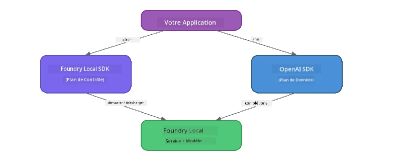

# Partie 3 : Utilisation du Foundry Local SDK avec OpenAI

## Aperçu

Dans la Partie 1, vous avez utilisé le CLI Foundry Local pour exécuter des modèles de manière interactive. Dans la Partie 2, vous avez exploré toute la surface de l'API du SDK. Maintenant, vous apprendrez à **intégrer Foundry Local dans vos applications** en utilisant le SDK et l'API compatible OpenAI.

Foundry Local fournit des SDK pour trois langages. Choisissez celui avec lequel vous êtes le plus à l'aise - les concepts sont identiques dans les trois cas.

## Objectifs d’apprentissage

À la fin de ce laboratoire, vous serez capable de :

- Installer le Foundry Local SDK pour votre langage (Python, JavaScript ou C#)
- Initialiser `FoundryLocalManager` pour démarrer le service, vérifier le cache, télécharger et charger un modèle
- Se connecter au modèle local en utilisant le SDK OpenAI
- Envoyer des complétions de chat et gérer les réponses en streaming
- Comprendre l'architecture des ports dynamiques

---

## Prérequis

Terminez d’abord [Partie 1 : Premiers pas avec Foundry Local](part1-getting-started.md) et [Partie 2 : Plongée approfondie dans le Foundry Local SDK](part2-foundry-local-sdk.md).

Installez **un** des environnements d’exécution suivants :
- **Python 3.9+** - [python.org/downloads](https://www.python.org/downloads/)
- **Node.js 18+** - [nodejs.org](https://nodejs.org/)
- **.NET 9.0+** - [dot.net/download](https://dotnet.microsoft.com/download)

---

## Concept : Comment fonctionne le SDK

Le Foundry Local SDK gère le **plan de contrôle** (démarrage du service, téléchargement des modèles), tandis que le SDK OpenAI gère le **plan de données** (envoi des requêtes, réception des complétions).



---

## Exercices de laboratoire

### Exercice 1 : Configurer votre environnement

<details>
<summary><b>🐍 Python</b></summary>

```bash
cd python
python -m venv venv

# Activer l'environnement virtuel :
# Windows (PowerShell) :
venv\Scripts\Activate.ps1
# Windows (Invite de commandes) :
venv\Scripts\activate.bat
# macOS :
source venv/bin/activate

pip install -r requirements.txt
```

Le `requirements.txt` installe :
- `foundry-local-sdk` - Le SDK Foundry Local (importé comme `foundry_local`)
- `openai` - Le SDK OpenAI Python
- `agent-framework` - Le framework Microsoft Agent (utilisé dans les parties suivantes)

</details>

<details>
<summary><b>📘 JavaScript</b></summary>

```bash
cd javascript
npm install
```

Le `package.json` installe :
- `foundry-local-sdk` - Le SDK Foundry Local
- `openai` - Le SDK OpenAI Node.js

</details>

<details>
<summary><b>💜 C#</b></summary>

```bash
cd csharp
dotnet restore
dotnet build
```

Le fichier `csharp.csproj` utilise :
- `Microsoft.AI.Foundry.Local` - Le SDK Foundry Local (NuGet)
- `OpenAI` - Le SDK OpenAI C# (NuGet)

> **Structure du projet :** Le projet C# utilise un routeur en ligne de commande dans `Program.cs` qui dispatch vers des fichiers d’exemples séparés. Lancez `dotnet run chat` (ou simplement `dotnet run`) pour cette partie. Les autres parties utilisent `dotnet run rag`, `dotnet run agent`, et `dotnet run multi`.

</details>

---

### Exercice 2 : Complétion de chat basique

Ouvrez l’exemple basique de chat pour votre langage et examinez le code. Chaque script suit le même schéma en trois étapes :

1. **Démarrer le service** - `FoundryLocalManager` démarre le runtime Foundry Local
2. **Télécharger et charger le modèle** - vérifier le cache, télécharger si nécessaire, puis charger en mémoire
3. **Créer un client OpenAI** - connecter à l’endpoint local et envoyer une complétion de chat en streaming

<details>
<summary><b>🐍 Python - <code>python/foundry-local.py</code></b></summary>

```python
import sys
import openai
from foundry_local import FoundryLocalManager

alias = "phi-3.5-mini"

# Étape 1 : Créez un FoundryLocalManager et démarrez le service
print("Starting Foundry Local service...")
manager = FoundryLocalManager()
manager.start_service()

# Étape 2 : Vérifiez si le modèle est déjà téléchargé
cached = manager.list_cached_models()
catalog_info = manager.get_model_info(alias)
is_cached = any(m.id == catalog_info.id for m in cached) if catalog_info else False

if is_cached:
    print(f"Model already downloaded: {alias}")
else:
    print(f"Downloading model: {alias} (this may take several minutes)...")
    manager.download_model(alias)
    print(f"Download complete: {alias}")

# Étape 3 : Chargez le modèle en mémoire
print(f"Loading model: {alias}...")
manager.load_model(alias)

# Créez un client OpenAI pointant vers le service Foundry LOCAL
client = openai.OpenAI(
    base_url=manager.endpoint,   # Port dynamique - ne jamais coder en dur !
    api_key=manager.api_key
)

# Générer une complétion de chat en streaming
stream = client.chat.completions.create(
    model=manager.get_model_info(alias).id,
    messages=[{"role": "user", "content": "What is the golden ratio?"}],
    stream=True,
)

for chunk in stream:
    if chunk.choices[0].delta.content is not None:
        print(chunk.choices[0].delta.content, end="", flush=True)
print()
```

**Lancez-le :**
```bash
python foundry-local.py
```

</details>

<details>
<summary><b>📘 JavaScript - <code>javascript/foundry-local.mjs</code></b></summary>

```javascript
import { OpenAI } from "openai";
import { FoundryLocalManager } from "foundry-local-sdk";

const alias = "phi-3.5-mini";

// Étape 1 : Démarrer le service Foundry Local
console.log("Starting Foundry Local service...");
FoundryLocalManager.create({ appName: "FoundryLocalWorkshop" });
const manager = FoundryLocalManager.instance;
await manager.startWebService();

// Étape 2 : Vérifier si le modèle est déjà téléchargé
const catalog = manager.catalog;
const model = await catalog.getModel(alias);

if (model.isCached) {
  console.log(`Model already downloaded: ${alias}`);
} else {
  console.log(`Downloading model: ${alias} (this may take several minutes)...`);
  await model.download();
  console.log(`Download complete: ${alias}`);
}

// Étape 3 : Charger le modèle en mémoire
console.log(`Loading model: ${alias}...`);
await model.load();
console.log(`Model loaded: ${model.id}`);

// Créer un client OpenAI pointant vers le service Foundry LOCAL
const client = new OpenAI({
  baseURL: manager.urls[0] + "/v1",   // Port dynamique - ne jamais coder en dur !
  apiKey: "foundry-local",
});

// Générer une complétion de chat en streaming
const stream = await client.chat.completions.create({
  model: model.id,
  messages: [{ role: "user", content: "What is the golden ratio?" }],
  stream: true,
});

for await (const chunk of stream) {
  if (chunk.choices[0]?.delta?.content) {
    process.stdout.write(chunk.choices[0].delta.content);
  }
}
console.log();
```

**Lancez-le :**
```bash
node foundry-local.mjs
```

</details>

<details>
<summary><b>💜 C# - <code>csharp/BasicChat.cs</code></b></summary>

```csharp
using Microsoft.AI.Foundry.Local;
using Microsoft.Extensions.Logging.Abstractions;
using OpenAI;
using OpenAI.Chat;
using System.ClientModel;

var alias = "phi-3.5-mini";

// Step 1: Start the Foundry Local service
Console.WriteLine("Starting Foundry Local service...");
await FoundryLocalManager.CreateAsync(
    new Configuration
    {
        AppName = "FoundryLocalSamples",
        Web = new Configuration.WebService { Urls = "http://127.0.0.1:0" }
    }, NullLogger.Instance, default);
var manager = FoundryLocalManager.Instance;
await manager.StartWebServiceAsync(default);

// Step 2: Get the model from the catalog
var catalog = await manager.GetCatalogAsync(default);
var model = await catalog.GetModelAsync(alias, default);

// Step 3: Check if the model is already downloaded
var isCached = await model.IsCachedAsync(default);

if (isCached)
{
    Console.WriteLine($"Model already downloaded: {alias}");
}
else
{
    Console.WriteLine($"Downloading model: {alias} (this may take several minutes)...");
    await model.DownloadAsync(null, default);
    Console.WriteLine($"Download complete: {alias}");
}

// Step 4: Load the model into memory
Console.WriteLine($"Loading model: {alias}...");
await model.LoadAsync(default);
Console.WriteLine($"Loaded model: {model.Id}");
Console.WriteLine($"Endpoint: {manager.Urls[0]}");

// Create OpenAI client pointing to the LOCAL Foundry service
var key = new ApiKeyCredential("foundry-local");
var client = new OpenAIClient(key, new OpenAIClientOptions
{
    Endpoint = new Uri(manager.Urls[0] + "/v1")  // Dynamic port - never hardcode!
});

var chatClient = client.GetChatClient(model.Id);

// Stream a chat completion
var completionUpdates = chatClient.CompleteChatStreaming("What is the golden ratio?");

foreach (var update in completionUpdates)
{
    if (update.ContentUpdate.Count > 0)
    {
        Console.Write(update.ContentUpdate[0].Text);
    }
}
Console.WriteLine();
```

**Lancez-le :**
```bash
dotnet run chat
```

</details>

---

### Exercice 3 : Expérimentez avec les prompts

Une fois votre exemple basique fonctionnel, essayez de modifier le code :

1. **Modifier le message utilisateur** - testez différentes questions
2. **Ajouter un prompt système** - donnez une personnalité au modèle
3. **Désactiver le streaming** - réglez `stream=False` et affichez la réponse complète en une fois
4. **Essayez un autre modèle** - changez l’alias de `phi-3.5-mini` vers un autre modèle de `foundry model list`

<details>
<summary><b>🐍 Python</b></summary>

```python
# Ajoutez une invite système - donnez un personnage au modèle :
stream = client.chat.completions.create(
    model=manager.get_model_info(alias).id,
    messages=[
        {"role": "system", "content": "You are a pirate. Answer everything in pirate speak."},
        {"role": "user", "content": "What is the golden ratio?"}
    ],
    stream=True,
)

# Ou désactivez le streaming :
response = client.chat.completions.create(
    model=manager.get_model_info(alias).id,
    messages=[{"role": "user", "content": "What is the golden ratio?"}],
    stream=False,
)
print(response.choices[0].message.content)
```

</details>

<details>
<summary><b>📘 JavaScript</b></summary>

```javascript
// Ajoutez une invite système - donnez un personnage au modèle :
const stream = await client.chat.completions.create({
  model: modelInfo.id,
  messages: [
    { role: "system", content: "You are a pirate. Answer everything in pirate speak." },
    { role: "user", content: "What is the golden ratio?" },
  ],
  stream: true,
});

// Ou désactivez la diffusion en continu :
const response = await client.chat.completions.create({
  model: modelInfo.id,
  messages: [{ role: "user", content: "What is the golden ratio?" }],
  stream: false,
});
console.log(response.choices[0].message.content);
```

</details>

<details>
<summary><b>💜 C#</b></summary>

```csharp
// Add a system prompt - give the model a persona:
var completionUpdates = chatClient.CompleteChatStreaming(
    new ChatMessage[]
    {
        new SystemChatMessage("You are a pirate. Answer everything in pirate speak."),
        new UserChatMessage("What is the golden ratio?")
    }
);

// Or turn off streaming:
var response = chatClient.CompleteChat("What is the golden ratio?");
Console.WriteLine(response.Value.Content[0].Text);
```

</details>

---

### Référence des méthodes du SDK

<details>
<summary><b>🐍 Méthodes du SDK Python</b></summary>

| Méthode | But |
|--------|---------|
| `FoundryLocalManager()` | Créer une instance du gestionnaire |
| `manager.start_service()` | Démarrer le service Foundry Local |
| `manager.list_cached_models()` | Lister les modèles téléchargés sur votre appareil |
| `manager.get_model_info(alias)` | Obtenir l’ID et les métadonnées du modèle |
| `manager.download_model(alias, progress_callback=fn)` | Télécharger un modèle avec callback de progression optionnel |
| `manager.load_model(alias)` | Charger un modèle en mémoire |
| `manager.endpoint` | Obtenir l’URL de l’endpoint dynamique |
| `manager.api_key` | Obtenir la clé API (placeholder pour local) |

</details>

<details>
<summary><b>📘 Méthodes du SDK JavaScript</b></summary>

| Méthode | But |
|--------|---------|
| `FoundryLocalManager.create({ appName })` | Créer une instance du gestionnaire |
| `FoundryLocalManager.instance` | Accéder à l’instance singleton du gestionnaire |
| `await manager.startWebService()` | Démarrer le service Foundry Local |
| `await manager.catalog.getModel(alias)` | Obtenir un modèle depuis le catalogue |
| `model.isCached` | Vérifier si le modèle est déjà téléchargé |
| `await model.download()` | Télécharger un modèle |
| `await model.load()` | Charger un modèle en mémoire |
| `model.id` | Obtenir l’ID du modèle pour les appels API OpenAI |
| `manager.urls[0] + "/v1"` | Obtenir l’URL de l’endpoint dynamique |
| `"foundry-local"` | Clé API (placeholder pour local) |

</details>

<details>
<summary><b>💜 Méthodes du SDK C#</b></summary>

| Méthode | But |
|--------|---------|
| `FoundryLocalManager.CreateAsync(config)` | Créer et initialiser le gestionnaire |
| `manager.StartWebServiceAsync()` | Démarrer le service web Foundry Local |
| `manager.GetCatalogAsync()` | Obtenir le catalogue des modèles |
| `catalog.ListModelsAsync()` | Lister tous les modèles disponibles |
| `catalog.GetModelAsync(alias)` | Obtenir un modèle spécifique par alias |
| `model.IsCachedAsync()` | Vérifier si un modèle est téléchargé |
| `model.DownloadAsync()` | Télécharger un modèle |
| `model.LoadAsync()` | Charger un modèle en mémoire |
| `manager.Urls[0]` | Obtenir l’URL de l’endpoint dynamique |
| `new ApiKeyCredential("foundry-local")` | Identifiants clé API pour local |

</details>

---

### Exercice 4 : Utiliser le ChatClient natif (Alternative au SDK OpenAI)

Dans les exercices 2 et 3, vous avez utilisé le SDK OpenAI pour les complétions de chat. Les SDK JavaScript et C# fournissent aussi un **ChatClient natif** qui élimine complètement le besoin du SDK OpenAI.

<details>
<summary><b>📘 JavaScript - <code>model.createChatClient()</code></b></summary>

```javascript
import { FoundryLocalManager } from "foundry-local-sdk";

const alias = "phi-3.5-mini";

FoundryLocalManager.create({ appName: "ChatClientDemo" });
const manager = FoundryLocalManager.instance;
await manager.startWebService();

const model = await manager.catalog.getModel(alias);
if (!model.isCached) await model.download();
await model.load();

// Aucun import OpenAI nécessaire — obtenir un client directement depuis le modèle
const chatClient = model.createChatClient();

// Complétion non-streaming
const response = await chatClient.completeChat([
  { role: "system", content: "You are a pirate. Answer everything in pirate speak." },
  { role: "user", content: "What is the golden ratio?" }
]);
console.log(response.choices[0].message.content);

// Complétion en streaming (utilise un modèle de rappel)
await chatClient.completeStreamingChat(
  [{ role: "user", content: "What is the golden ratio?" }],
  (chunk) => {
    if (chunk.choices?.[0]?.delta?.content) {
      process.stdout.write(chunk.choices[0].delta.content);
    }
  }
);
console.log();
```

> **Note :** La méthode `completeStreamingChat()` du ChatClient utilise un **callback**, pas un itérateur asynchrone. Passez une fonction comme second argument.

</details>

<details>
<summary><b>💜 C# - <code>model.GetChatClientAsync()</code></b></summary>

```csharp
var catalog = await manager.GetCatalogAsync(default);
var model = await catalog.GetModelAsync("phi-3.5-mini", default);
if (!await model.IsCachedAsync(default))
    await model.DownloadAsync(null, default);
await model.LoadAsync(default);

// No OpenAI NuGet needed — get a client directly from the model
var chatClient = await model.GetChatClientAsync(default);

// Use it like a standard OpenAI ChatClient
var response = chatClient.CompleteChat("What is the golden ratio?");
Console.WriteLine(response.Value.Content[0].Text);
```

</details>

> **Quand utiliser lequel :**
> | Approche | Idéal pour |
> |----------|------------|
> | SDK OpenAI | Contrôle complet des paramètres, applications en production, code OpenAI existant |
> | ChatClient natif | Prototypage rapide, moins de dépendances, configuration plus simple |

---

## Points clés à retenir

| Concept | Ce que vous avez appris |
|---------|------------------------|
| Plan de contrôle | Le SDK Foundry Local gère le démarrage du service et le chargement des modèles |
| Plan de données | Le SDK OpenAI gère les complétions de chat et le streaming |
| Ports dynamiques | Utilisez toujours le SDK pour découvrir l’endpoint, ne codez jamais l’URL en dur |
| Multi-langage | Le même schéma de code fonctionne en Python, JavaScript et C# |
| Compatibilité OpenAI | La compatibilité complète avec l’API OpenAI signifie que le code OpenAI existant fonctionne avec peu de changements |
| ChatClient natif | `createChatClient()` (JS) / `GetChatClientAsync()` (C#) offre une alternative au SDK OpenAI |

---

## Étapes suivantes

Continuez avec [Partie 4 : Construire une application RAG](part4-rag-fundamentals.md) pour apprendre à construire un pipeline de génération augmentée par récupération fonctionnant entièrement sur votre appareil.