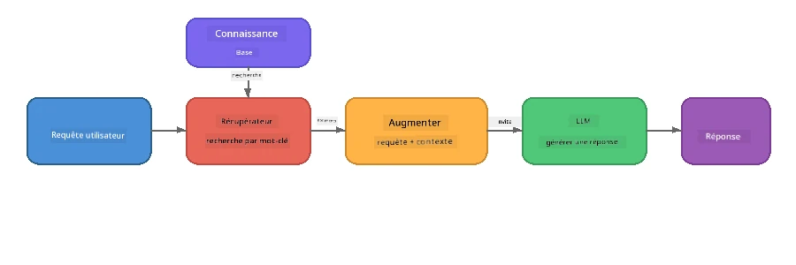

# Partie 4 : Construire une application RAG avec Foundry Local

## Présentation

Les grands modèles de langage sont puissants, mais ils ne connaissent que ce qui figure dans leurs données d'entraînement. **La génération augmentée par récupération (RAG)** résout ce problème en fournissant au modèle un contexte pertinent au moment de la requête - extrait de vos propres documents, bases de données ou bases de connaissances.

Dans ce laboratoire, vous allez construire un pipeline RAG complet qui fonctionne **entièrement sur votre appareil** en utilisant Foundry Local. Pas de services cloud, pas de bases de données vectorielles, pas d'API d'incorporation - juste une récupération locale et un modèle local.

## Objectifs d'apprentissage

À la fin de ce laboratoire, vous serez capable de :

- Expliquer ce qu'est le RAG et pourquoi il est important pour les applications d'IA
- Construire une base de connaissances locale à partir de documents texte
- Implémenter une fonction de récupération simple pour trouver un contexte pertinent
- Composer une invite système qui ancre le modèle sur des faits récupérés
- Exécuter le pipeline complet Récupérer → Augmenter → Générer sur appareil
- Comprendre les compromis entre une récupération par mots-clés simple et une recherche vectorielle

---

## Prérequis

- Avoir complété la [Partie 3 : Utiliser le Foundry Local SDK avec OpenAI](part3-sdk-and-apis.md)
- Installer Foundry Local CLI et avoir téléchargé le modèle `phi-3.5-mini`

---

## Concept : Qu'est-ce que le RAG ?

Sans RAG, un LLM ne peut répondre qu'à partir de ses données d'entraînement - qui peuvent être obsolètes, incomplètes ou manquer vos informations privées :

```
User: "What is Zava's return policy?"
LLM:  "I do not have information about Zava's return policy."  ← No context!
```

Avec le RAG, vous **récupérez** d'abord les documents pertinents, puis **augmentez** l'invite avec ce contexte avant de **générer** une réponse :



L'idée clé : **le modèle n'a pas besoin de "connaître" la réponse ; il doit juste lire les bons documents.**

---

## Exercices du laboratoire

### Exercice 1 : Comprendre la base de connaissances

Ouvrez l'exemple RAG pour votre langage et examinez la base de connaissances :

<details>
<summary><b>🐍 Python : <code>python/foundry-local-rag.py</code></b></summary>

La base de connaissances est une simple liste de dictionnaires avec des champs `title` et `content` :

```python
KNOWLEDGE_BASE = [
    {
        "title": "Foundry Local Overview",
        "content": (
            "Foundry Local brings the power of Azure AI Foundry to your local "
            "device without requiring an Azure subscription..."
        ),
    },
    {
        "title": "Supported Hardware",
        "content": (
            "Foundry Local automatically selects the best model variant for "
            "your hardware. If you have an Nvidia CUDA GPU it downloads the "
            "CUDA-optimized model..."
        ),
    },
    # ... plus d'entrées
]
```

Chaque entrée représente un "morceau" de connaissance - une information ciblée sur un sujet précis.

</details>

<details>
<summary><b>📘 JavaScript : <code>javascript/foundry-local-rag.mjs</code></b></summary>

La base de connaissances utilise la même structure sous forme de tableau d'objets :

```javascript
const KNOWLEDGE_BASE = [
  {
    title: "Foundry Local Overview",
    content:
      "Foundry Local brings the power of Azure AI Foundry to your local " +
      "device without requiring an Azure subscription...",
  },
  {
    title: "Supported Hardware",
    content:
      "Foundry Local automatically selects the best model variant for " +
      "your hardware...",
  },
  // ... plus d'entrées
];
```

</details>

<details>
<summary><b>💜 C# : <code>csharp/RagPipeline.cs</code></b></summary>

La base de connaissances utilise une liste de tuples nommés :

```csharp
private static readonly List<(string Title, string Content)> KnowledgeBase =
[
    ("Foundry Local Overview",
     "Foundry Local brings the power of Azure AI Foundry to your local " +
     "device without requiring an Azure subscription..."),

    ("Supported Hardware",
     "Foundry Local automatically selects the best model variant for " +
     "your hardware..."),

    // ... more entries
];
```

</details>

> **Dans une application réelle**, la base de connaissances proviendrait de fichiers sur disque, d'une base de données, d'un index de recherche ou d'une API. Pour ce labo, nous utilisons une liste en mémoire pour simplifier.

---

### Exercice 2 : Comprendre la fonction de récupération

L'étape de récupération trouve les morceaux les plus pertinents pour la question de l'utilisateur. Cet exemple utilise le **recoupement de mots-clés** - en comptant combien de mots de la requête apparaissent dans chaque morceau :

<details>
<summary><b>🐍 Python</b></summary>

```python
def retrieve(query: str, top_k: int = 2) -> list[dict]:
    """Return the top-k knowledge chunks most relevant to the query."""
    query_words = set(query.lower().split())
    scored = []
    for chunk in KNOWLEDGE_BASE:
        chunk_words = set(chunk["content"].lower().split())
        overlap = len(query_words & chunk_words)
        scored.append((overlap, chunk))
    scored.sort(key=lambda x: x[0], reverse=True)
    return [item[1] for item in scored[:top_k]]
```

</details>

<details>
<summary><b>📘 JavaScript</b></summary>

```javascript
function retrieve(query, topK = 2) {
  const queryWords = new Set(query.toLowerCase().split(/\s+/));
  const scored = KNOWLEDGE_BASE.map((chunk) => {
    const chunkWords = new Set(chunk.content.toLowerCase().split(/\s+/));
    let overlap = 0;
    for (const w of queryWords) {
      if (chunkWords.has(w)) overlap++;
    }
    return { overlap, chunk };
  });
  scored.sort((a, b) => b.overlap - a.overlap);
  return scored.slice(0, topK).map((s) => s.chunk);
}
```

</details>

<details>
<summary><b>💜 C#</b></summary>

```csharp
private static List<(string Title, string Content)> Retrieve(string query, int topK = 2)
{
    var queryWords = new HashSet<string>(
        query.ToLowerInvariant().Split(' ', StringSplitOptions.RemoveEmptyEntries));

    return KnowledgeBase
        .Select(chunk =>
        {
            var chunkWords = new HashSet<string>(
                chunk.Content.ToLowerInvariant().Split(' ', StringSplitOptions.RemoveEmptyEntries));
            var overlap = queryWords.Intersect(chunkWords).Count();
            return (Overlap: overlap, Chunk: chunk);
        })
        .OrderByDescending(x => x.Overlap)
        .Take(topK)
        .Select(x => x.Chunk)
        .ToList();
}
```

</details>

**Comment ça fonctionne :**
1. Séparer la requête en mots individuels
2. Pour chaque morceau de connaissance, compter combien de mots de la requête y apparaissent
3. Trier par score de recoupement (le plus élevé en premier)
4. Retourner les top-k morceaux les plus pertinents

> **Compromis :** Le recoupement de mots-clés est simple mais limité ; il ne comprend pas les synonymes ni le sens. Les systèmes RAG en production utilisent typiquement des **vecteurs d'incorporation** et une **base de données vectorielle** pour la recherche sémantique. Cependant, le recoupement de mots-clés est un excellent point de départ et ne nécessite aucune dépendance supplémentaire.

---

### Exercice 3 : Comprendre l'invite augmentée

Le contexte récupéré est injecté dans l'**invite système** avant d'être envoyé au modèle :

```python
system_prompt = (
    "You are a helpful assistant. Answer the user's question using ONLY "
    "the information provided in the context below. If the context does "
    "not contain enough information, say so.\n\n"
    f"Context:\n{context_text}"
)
```

Décisions clés de conception :
- **"SEULEMENT les informations fournies"** - empêche le modèle d'halluciner des faits hors contexte
- **"Si le contexte ne contient pas assez d'informations, dites-le"** - encourage des réponses honnêtes du type "je ne sais pas"
- Le contexte est placé dans le message système afin d'influencer toutes les réponses

---

### Exercice 4 : Exécuter le pipeline RAG

Lancez l'exemple complet :

**Python :**
```bash
cd python
python foundry-local-rag.py
```

**JavaScript :**
```bash
cd javascript
node foundry-local-rag.mjs
```

**C# :**
```bash
cd csharp
dotnet run rag
```

Vous devriez voir trois éléments affichés :
1. **La question** posée
2. **Le contexte récupéré** – les morceaux sélectionnés dans la base de connaissances
3. **La réponse** – générée par le modèle en utilisant uniquement ce contexte

Exemple de sortie :
```
Question: How do I install Foundry Local and what hardware does it support?

--- Retrieved Context ---
### Installation
On Windows install Foundry Local with: winget install Microsoft.FoundryLocal...

### Supported Hardware
Foundry Local automatically selects the best model variant for your hardware...
-------------------------

Answer: To install Foundry Local, you can use the following methods depending
on your operating system: On Windows, run `winget install Microsoft.FoundryLocal`.
On macOS, use `brew install microsoft/foundrylocal/foundrylocal`...
```

Notez comment la réponse du modèle est **ancrée** dans le contexte récupéré – il ne mentionne que des faits provenant des documents de la base de connaissances.

---

### Exercice 5 : Expérimentez et étendez

Testez ces modifications pour approfondir votre compréhension :

1. **Changez la question** - posez quelque chose qui EST dans la base de connaissances contre quelque chose qui N’EST PAS :
   ```python
   question = "What programming languages does Foundry Local support?"  # ← Dans le contexte
   question = "How much does Foundry Local cost?"                       # ← Pas dans le contexte
   ```
   Le modèle dit-il correctement "Je ne sais pas" lorsque la réponse n’est pas dans le contexte ?

2. **Ajoutez un nouveau morceau de connaissance** - ajoutez une nouvelle entrée à `KNOWLEDGE_BASE` :
   ```python
   {
       "title": "Pricing",
       "content": "Foundry Local is completely free and open source under the MIT license.",
   }
   ```
   Posez à nouveau la question sur les tarifs.

3. **Modifiez `top_k`** - récupérez plus ou moins de morceaux :
   ```python
   context_chunks = retrieve(question, top_k=3)  # Plus de contexte
   context_chunks = retrieve(question, top_k=1)  # Moins de contexte
   ```
   Comment la quantité de contexte affecte-t-elle la qualité de la réponse ?

4. **Supprimez l'instruction d'ancrage** - changez l'invite système en "Vous êtes un assistant utile." et voyez si le modèle commence à halluciner des faits.

---

## Approfondissement : Optimiser le RAG pour la performance sur appareil

Exécuter le RAG sur appareil introduit des contraintes inexistantes sur le cloud : RAM limitée, absence de GPU dédié (exécution CPU/NPU), et une fenêtre de contexte de modèle petite. Les décisions de conception ci-dessous répondent directement à ces contraintes et sont basées sur les pratiques de systèmes RAG locaux en production construits avec Foundry Local.

### Stratégie de découpage : fenêtre glissante de taille fixe

Le découpage - comment vous segmentez les documents - est une des décisions les plus impactantes dans tout système RAG. Pour les scénarios sur appareil, une **fenêtre glissante de taille fixe avec chevauchement** est le point de départ recommandé :

| Paramètre | Valeur recommandée | Pourquoi |
|-----------|--------------------|----------|
| **Taille des morceaux** | ~200 tokens | Garde le contexte récupéré compact, laissant de la place dans la fenêtre de contexte de Phi-3.5 Mini pour l'invite système, l'historique des conversations, et la sortie générée |
| **Chevauchement** | ~25 tokens (12,5%) | Évite la perte d'information aux frontières des morceaux – important pour les procédures et les instructions étape par étape |
| **Tokenisation** | Séparation par espaces | Pas de dépendances, pas besoin de bibliothèque de tokenizer. Tout le budget compute est pour le LLM |

Le chevauchement fonctionne comme une fenêtre glissante : chaque nouveau morceau commence 25 tokens avant la fin du précédent, donc les phrases qui traversent les frontières apparaissent dans les deux morceaux.

> **Pourquoi pas d'autres stratégies ?**
> - **Découpage basé sur les phrases** produit des tailles de morceaux imprévisibles ; certaines procédures de sécurité sont des phrases longues qui ne se diviseraient pas bien
> - **Découpage basé sur les sections** (aux titres `##`) crée des tailles très variables - certaines trop petites, d'autres trop grandes pour la fenêtre de contexte du modèle
> - **Découpage sémantique** (détection de sujets basée sur embeddings) offre la meilleure qualité de récupération, mais nécessite un second modèle en mémoire aux côtés de Phi-3.5 Mini - risqué sur du matériel avec 8-16 Go de mémoire partagée

### Amélioration de la récupération : vecteurs TF-IDF

L’approche de recoupement par mots-clés de ce labo fonctionne, mais si vous voulez une récupération meilleure sans ajouter un modèle d'incorporation, **TF-IDF (Fréquence Terme-Fréquence Inverse Document)** est un excellent compromis :

```
Keyword Overlap  →  TF-IDF Vectors  →  Embedding Models
    (this lab)     (lightweight upgrade)   (production)
  Simple & fast    Better ranking,         Best quality,
  No dependencies  still no ML model       requires embedding model
  ~Basic matching  ~1ms retrieval          ~100-500ms per query
```

TF-IDF convertit chaque morceau en un vecteur numérique basé sur l’importance de chaque mot dans ce morceau *par rapport à tous les morceaux*. Lors d'une requête, la question est vectorisée de la même façon et comparée en utilisant la similarité cosinus. Vous pouvez implémenter cela avec SQLite et du pur JavaScript/Python - pas de base vectorielle, pas d'API d'incorporation.

> **Performance :** La similarité cosinus TF-IDF sur des morceaux de taille fixe atteint typiquement **~1ms de récupération**, contre 100-500 ms lorsqu’un modèle d’incorporation encode chaque requête. Plus de 20 documents peuvent être découpés et indexés en moins d’une seconde.

### Mode Edge/Compact pour appareils contraints

Quand vous travaillez sur du matériel très contraint (anciens ordinateurs portables, tablettes, appareils de terrain), vous pouvez réduire la consommation en ajustant trois paramètres :

| Réglage | Mode standard | Mode Edge/Compact |
|---------|---------------|------------------|
| **Invite système** | ~300 tokens | ~80 tokens |
| **Max tokens de sortie** | 1024 | 512 |
| **Morceaux récupérés (top-k)** | 5 | 3 |

Moins de morceaux récupérés signifie moins de contexte à traiter pour le modèle, ce qui réduit la latence et la pression mémoire. Une invite système plus courte libère plus de place dans la fenêtre de contexte pour la réponse proprement dite. Ce compromis vaut la peine sur des appareils où chaque token de la fenêtre de contexte compte.

### Un seul modèle en mémoire

Un des principes les plus importants pour le RAG sur appareil : **garder un seul modèle chargé**. Si vous utilisez un modèle d'incorporation pour la récupération *et* un modèle de langage pour la génération, vous divisez les ressources NPU/RAM limitées entre deux modèles. La récupération légère (recoupement de mots-clés, TF-IDF) évite cela entièrement :

- Pas de modèle d'incorporation en compétition pour la mémoire avec le LLM
- Démarrage à froid plus rapide - un seul modèle à charger
- Usage mémoire prévisible - le LLM a toutes les ressources disponibles
- Fonctionne sur des machines avec seulement 8 Go de RAM

### SQLite comme magasin vectoriel local

Pour des collections de documents petites à moyennes (des centaines à quelques milliers de morceaux), **SQLite est suffisamment rapide** pour une recherche par similarité cosinus brute-force et ajoute zéro infrastructure :

- Un seul fichier `.db` sur disque - pas de serveur, pas de configuration
- Distribué avec tous les principaux runtimes (Python `sqlite3`, Node.js `better-sqlite3`, .NET `Microsoft.Data.Sqlite`)
- Stocke les morceaux de documents avec leurs vecteurs TF-IDF dans une table unique
- Pas besoin de Pinecone, Qdrant, Chroma ou FAISS à cette échelle

### Résumé des performances

Ces choix de conception combinés offrent un RAG réactif sur matériel grand public :

| Indicateur | Performance sur appareil |
|------------|-------------------------|
| **Latence récupération** | ~1ms (TF-IDF) à ~5ms (recoupement mots-clés) |
| **Vitesse ingestion** | 20 documents découpés et indexés en < 1 seconde |
| **Modèles en mémoire** | 1 (LLM uniquement - pas de modèle d'incorporation) |
| **Espace de stockage** | < 1 Mo pour morceaux + vecteurs dans SQLite |
| **Démarrage à froid** | Chargement d'un seul modèle, pas de lancement d’API d’incorporation |
| **Plancher matériel** | 8 Go RAM, CPU seulement (GPU non requis) |

> **Quand évoluer :** Si vous passez à des centaines de documents longs, des contenus mixtes (tables, code, prose) ou que vous avez besoin de compréhension sémantique des requêtes, envisagez d’ajouter un modèle d’incorporation et de basculer vers une recherche par similarité vectorielle. Pour la plupart des cas d’usage sur appareil avec des ensembles documentaires ciblés, TF-IDF + SQLite offre d’excellents résultats avec un minimum de ressources.

---

## Concepts clés

| Concept | Description |
|---------|-------------|
| **Récupération** | Trouver des documents pertinents dans une base de connaissances selon la requête de l’utilisateur |
| **Augmentation** | Insérer les documents récupérés dans l’invite comme contexte |
| **Génération** | Le LLM produit une réponse ancrée dans le contexte fourni |
| **Découpage** | Diviser de grands documents en morceaux plus petits et ciblés |
| **Ancrage** | Contraindre le modèle à n’utiliser que le contexte fourni (réduit les hallucinations) |
| **Top-k** | Le nombre de morceaux les plus pertinents à récupérer |

---

## RAG en production vs. ce laboratoire

| Aspect | Ce laboratoire | Optimisé On-Device | Production Cloud |
|--------|----------------|--------------------|------------------|
| **Base de connaissances** | Liste en mémoire | Fichiers sur disque, SQLite | Base de données, index de recherche |
| **Récupération** | Recoupement mots-clés | TF-IDF + similarité cosinus | Embeddings vecteurs + recherche par similarité |
| **Embeddings** | Aucun nécessaire | Aucun - vecteurs TF-IDF | Modèle d’incorporation (local ou cloud) |
| **Magasin vectoriel** | Aucun nécessaire | SQLite (fichier `.db` unique) | FAISS, Chroma, Azure AI Search, etc. |
| **Découpage** | Manuel | Fenêtre glissante taille fixe (~200 tokens, chevauchement 25 tokens) | Découpage sémantique ou récursif |
| **Modèles en mémoire** | 1 (LLM) | 1 (LLM) | 2+ (incorporation + LLM) |
| **Latence de récupération** | ~5ms | ~1ms | ~100-500ms |
| **Échelle** | 5 documents | Des centaines de documents | Des millions de documents |

Les modèles que vous apprenez ici (récupérer, augmenter, générer) sont les mêmes à toute échelle. La méthode de récupération s'améliore, mais l'architecture globale reste identique. La colonne du milieu montre ce qui est réalisable sur appareil avec des techniques légères, souvent le compromis idéal pour les applications locales où vous sacrifiez l'échelle cloud pour la confidentialité, la capacité hors ligne, et une latence zéro vers les services externes.

---

## Points clés à retenir

| Concept | Ce que vous avez appris |
|---------|-------------------------|
| Modèle RAG | Récupérer + Augmenter + Générer : donnez au modèle le bon contexte et il peut répondre aux questions sur vos données |
| Sur appareil | Tout fonctionne localement sans API cloud ni abonnement à une base de données vectorielle |
| Instructions d'ancrage | Les contraintes de la prompt système sont cruciales pour éviter les hallucinations |
| Chevauchement de mots-clés | Un point de départ simple mais efficace pour la récupération |
| TF-IDF + SQLite | Une voie de mise à niveau légère qui maintient la récupération sous 1 ms sans modèle d'encodage |
| Un modèle en mémoire | Évitez de charger un modèle d'encodage en plus du LLM sur un matériel contraint |
| Taille des segments | Environ 200 tokens avec chevauchement équilibre la précision de récupération et l'efficacité de la fenêtre de contexte |
| Mode Edge/compact | Utilisez moins de segments et des prompts plus courts pour les appareils très contraints |
| Modèle universel | La même architecture RAG fonctionne pour toute source de données : documents, bases de données, API ou wikis |

> **Vous voulez voir une application RAG complète sur appareil ?** Découvrez [Gas Field Local RAG](https://github.com/leestott/local-rag), un agent RAG hors ligne de style production construit avec Foundry Local et Phi-3.5 Mini qui démontre ces modèles d'optimisation avec un ensemble de documents réel.

---

## Prochaines étapes

Continuez vers [Partie 5 : Construire des agents IA](part5-single-agents.md) pour apprendre comment construire des agents intelligents avec des personas, des instructions et des conversations à plusieurs tours en utilisant le Microsoft Agent Framework.