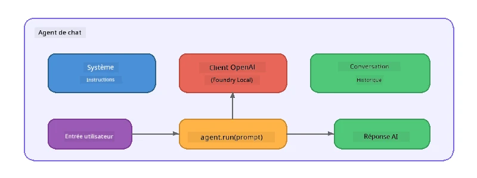

# Partie 5 : Création d'agents IA avec le cadre Agent Framework

> **Objectif :** Construisez votre premier agent IA avec des instructions persistantes et une personnalité définie, alimenté par un modèle local via Foundry Local.

## Qu'est-ce qu'un agent IA ?

Un agent IA enveloppe un modèle de langage avec des **instructions système** qui définissent son comportement, sa personnalité et ses contraintes. Contrairement à un simple appel de complétion de chat, un agent offre :

- **Persona** - une identité cohérente ("Vous êtes un réviseur de code utile")
- **Mémoire** - historique de conversation à travers les tours d’échange
- **Spécialisation** - comportement ciblé piloté par des instructions bien conçues



---

## Le cadre Microsoft Agent Framework

Le **Microsoft Agent Framework** (AGF) fournit une abstraction standard d’agent qui fonctionne avec différents backend de modèles. Dans cet atelier, nous l’associons à Foundry Local pour que tout fonctionne sur votre machine - aucun cloud nécessaire.

| Concept | Description |
|---------|-------------|
| `FoundryLocalClient` | Python : gère le démarrage du service, le téléchargement/le chargement du modèle, et crée des agents |
| `client.as_agent()` | Python : crée un agent à partir du client Foundry Local |
| `AsAIAgent()` | C# : méthode d’extension sur `ChatClient` - crée un `AIAgent` |
| `instructions` | Invite système qui façonne le comportement de l’agent |
| `name` | Étiquette lisible par l’humain, utile dans des scénarios multi-agents |
| `agent.run(prompt)` / `RunAsync()` | Envoie un message utilisateur et retourne la réponse de l’agent |

> **Note :** L’Agent Framework dispose d’un SDK Python et .NET. Pour JavaScript, nous implémentons une classe légère `ChatAgent` qui suit le même modèle en utilisant directement le SDK OpenAI.

---

## Exercices

### Exercice 1 - Comprendre le modèle d’agent

Avant d’écrire du code, étudiez les composants clés d’un agent :

1. **Client modèle** - se connecte à l’API compatible OpenAI de Foundry Local  
2. **Instructions système** - l’invite de "personnalité"  
3. **Boucle d’exécution** - envoi de l’entrée utilisateur, réception de la sortie  

> **Réfléchissez-y :** En quoi les instructions système diffèrent-elles d’un message utilisateur classique ? Que se passe-t-il si vous les modifiez ?

---

### Exercice 2 - Exécuter l’exemple mono-agent

<details>
<summary><strong>🐍 Python</strong></summary>

**Prérequis :**
```bash
cd python
python -m venv venv

# Windows (PowerShell) :
venv\Scripts\Activate.ps1
# macOS :
source venv/bin/activate

pip install -r requirements.txt
```

**Exécution :**
```bash
python foundry-local-with-agf.py
```

**Parcours du code** (`python/foundry-local-with-agf.py`) :

```python
import asyncio
from agent_framework_foundry_local import FoundryLocalClient

async def main():
    alias = "phi-4-mini"

    # FoundryLocalClient gère le démarrage du service, le téléchargement du modèle et le chargement
    client = FoundryLocalClient(model_id=alias)
    print(f"Client Model ID: {client.model_id}")

    # Créez un agent avec des instructions système
    agent = client.as_agent(
        name="Joker",
        instructions="You are good at telling jokes.",
    )

    # Non-streaming : obtenir la réponse complète en une seule fois
    result = await agent.run("Tell me a joke about a pirate.")
    print(f"Agent: {result}")

    # Streaming : obtenir les résultats au fur et à mesure qu'ils sont générés
    async for chunk in agent.run("Tell me another joke.", stream=True):
        if chunk.text:
            print(chunk.text, end="", flush=True)

asyncio.run(main())
```

**Points clés :**
- `FoundryLocalClient(model_id=alias)` gère le démarrage du service, le téléchargement et le chargement du modèle en une seule étape
- `client.as_agent()` crée un agent avec des instructions système et un nom
- `agent.run()` supporte les modes non-streaming et streaming
- Installation via `pip install agent-framework-foundry-local --pre`

</details>

<details>
<summary><strong>📦 JavaScript</strong></summary>

**Prérequis :**
```bash
cd javascript
npm install
```

**Exécution :**
```bash
node foundry-local-with-agent.mjs
```

**Parcours du code** (`javascript/foundry-local-with-agent.mjs`) :

```javascript
import { OpenAI } from "openai";
import { FoundryLocalManager } from "foundry-local-sdk";

class ChatAgent {
  constructor({ client, modelId, instructions, name }) {
    this.client = client;
    this.modelId = modelId;
    this.instructions = instructions;
    this.name = name;
    this.history = [];
  }

  async run(userMessage) {
    const messages = [
      { role: "system", content: this.instructions },
      ...this.history,
      { role: "user", content: userMessage },
    ];
    const response = await this.client.chat.completions.create({
      model: this.modelId,
      messages,
    });
    const assistantMessage = response.choices[0].message.content;

    // Conserver l'historique des conversations pour les interactions à tours multiples
    this.history.push({ role: "user", content: userMessage });
    this.history.push({ role: "assistant", content: assistantMessage });
    return { text: assistantMessage };
  }
}

async function main() {
  FoundryLocalManager.create({ appName: "FoundryLocalWorkshop" });
  const manager = FoundryLocalManager.instance;
  await manager.startWebService();

  const catalog = manager.catalog;
  const model = await catalog.getModel("phi-3.5-mini");
  if (!model.isCached) {
    console.log("Downloading model: phi-3.5-mini...");
    await model.download();
  }
  await model.load();

  const client = new OpenAI({
    baseURL: manager.urls[0] + "/v1",
    apiKey: "foundry-local",
  });

  const agent = new ChatAgent({
    client,
    modelId: model.id,
    instructions: "You are good at telling jokes.",
    name: "Joker",
  });

  const result = await agent.run("Tell me a joke about a pirate.");
  console.log(result.text);
}

main();
```

**Points clés :**
- JavaScript construit sa propre classe `ChatAgent` qui reflète le modèle AGF Python
- `this.history` stocke les échanges pour supporter les conversations multi-tours
- Démarrage explicite `startWebService()` → vérification du cache → `model.download()` → `model.load()` pour une visibilité complète

</details>

<details>
<summary><strong>💜 C#</strong></summary>

**Prérequis :**
```bash
cd csharp
dotnet restore
```

**Exécution :**
```bash
dotnet run agent
```

**Parcours du code** (`csharp/SingleAgent.cs`) :

```csharp
using Microsoft.AI.Foundry.Local;
using Microsoft.Extensions.Logging.Abstractions;
using Microsoft.Agents.AI;
using OpenAI;
using System.ClientModel;

// 1. Start Foundry Local and load a model
var alias = "phi-3.5-mini";
await FoundryLocalManager.CreateAsync(
    new Configuration
    {
        AppName = "FoundryLocalSamples",
        Web = new Configuration.WebService { Urls = "http://127.0.0.1:0" }
    }, NullLogger.Instance, default);
var manager = FoundryLocalManager.Instance;
await manager.StartWebServiceAsync(default);

var catalog = await manager.GetCatalogAsync(default);
var model = await catalog.GetModelAsync(alias, default);

var isCached = await model.IsCachedAsync(default);
if (!isCached)
{
    Console.WriteLine($"Downloading model: {alias}...");
    await model.DownloadAsync(null, default);
}
await model.LoadAsync(default);

var key = new ApiKeyCredential("foundry-local");
var client = new OpenAIClient(key, new OpenAIClientOptions
{
    Endpoint = new Uri(manager.Urls[0] + "/v1")
});

// 2. Create an AIAgent using the Agent Framework extension method
AIAgent joker = client
    .GetChatClient(model.Id)
    .AsAIAgent(
        instructions: "You are good at telling jokes. Keep your jokes short and family-friendly.",
        name: "Joker"
    );

// 3. Run the agent (non-streaming)
var response = await joker.RunAsync("Tell me a joke about a pirate.");
Console.WriteLine($"Joker: {response}");

// 4. Run with streaming
await foreach (var update in joker.RunStreamingAsync("Tell me another joke."))
{
    Console.Write(update);
}
```

**Points clés :**
- `AsAIAgent()` est une méthode d’extension de `Microsoft.Agents.AI.OpenAI` - pas besoin de classe `ChatAgent` personnalisée
- `RunAsync()` retourne la réponse complète ; `RunStreamingAsync()` stream les tokens un par un
- Installation via `dotnet add package Microsoft.Agents.AI.OpenAI --version 1.0.0-rc3`

</details>

---

### Exercice 3 - Changer la persona

Modifiez les `instructions` de l’agent pour créer une persona différente. Essayez chacune et observez comment la sortie change :

| Persona | Instructions |
|---------|-------------|
| Réviseur de code | `"Vous êtes un expert en revue de code. Fournissez des commentaires constructifs axés sur la lisibilité, la performance et la justesse."` |
| Guide de voyage | `"Vous êtes un guide de voyage amical. Donnez des recommandations personnalisées pour des destinations, activités et la cuisine locale."` |
| Tuteur socratique | `"Vous êtes un tuteur socratique. Ne donnez jamais de réponses directes - guidez l’étudiant avec des questions réfléchies."` |
| Rédacteur technique | `"Vous êtes un rédacteur technique. Expliquez les concepts clairement et de manière concise. Utilisez des exemples. Évitez le jargon."` |

**À essayer :**  
1. Choisissez une persona dans le tableau ci-dessus  
2. Remplacez la chaîne `instructions` dans le code  
3. Adaptez l’invite utilisateur en conséquence (par ex. demandez au réviseur de code d’évaluer une fonction)  
4. Exécutez à nouveau l’exemple et comparez la sortie  

> **Astuce :** La qualité d’un agent dépend beaucoup des instructions. Des instructions spécifiques et bien structurées produisent de meilleurs résultats que des instructions vagues.

---

### Exercice 4 - Ajouter une conversation multi-tours

Étendez l’exemple pour supporter une boucle de chat multi-tours afin d’avoir un échange interactif avec l’agent.

<details>
<summary><strong>🐍 Python - boucle multi-tours</strong></summary>

```python
import asyncio
from agent_framework_foundry_local import FoundryLocalClient

async def main():
    client = FoundryLocalClient(model_id="phi-4-mini")

    agent = client.as_agent(
        name="Assistant",
        instructions="You are a helpful assistant.",
    )

    print("Chat with the agent (type 'quit' to exit):\n")
    while True:
        user_input = input("You: ")
        if user_input.strip().lower() in ("quit", "exit"):
            break
        result = await agent.run(user_input)
        print(f"Agent: {result}\n")

asyncio.run(main())
```

</details>

<details>
<summary><strong>📦 JavaScript - boucle multi-tours</strong></summary>

```javascript
import { OpenAI } from "openai";
import { FoundryLocalManager } from "foundry-local-sdk";
import * as readline from "node:readline/promises";

// (réutiliser la classe ChatAgent de l’exercice 2)

async function main() {
  FoundryLocalManager.create({ appName: "FoundryLocalWorkshop" });
  const manager = FoundryLocalManager.instance;
  await manager.startWebService();

  const catalog = manager.catalog;
  const model = await catalog.getModel("phi-3.5-mini");
  if (!model.isCached) {
    console.log("Downloading model: phi-3.5-mini...");
    await model.download();
  }
  await model.load();

  const client = new OpenAI({
    baseURL: manager.urls[0] + "/v1",
    apiKey: "foundry-local",
  });

  const agent = new ChatAgent({
    client,
    modelId: model.id,
    instructions: "You are a helpful assistant.",
    name: "Assistant",
  });

  const rl = readline.createInterface({
    input: process.stdin,
    output: process.stdout,
  });

  console.log("Chat with the agent (type 'quit' to exit):\n");
  while (true) {
    const userInput = await rl.question("You: ");
    if (["quit", "exit"].includes(userInput.trim().toLowerCase())) break;
    const result = await agent.run(userInput);
    console.log(`Agent: ${result.text}\n`);
  }
  rl.close();
}

main();
```

</details>

<details>
<summary><strong>💜 C# - boucle multi-tours</strong></summary>

```csharp
using Microsoft.AI.Foundry.Local;
using Microsoft.Extensions.Logging.Abstractions;
using Microsoft.Agents.AI;
using OpenAI;
using System.ClientModel;

var alias = "phi-3.5-mini";
var config = new Configuration
{
    AppName = "FoundryLocalSamples",
    Web = new Configuration.WebService { Urls = "http://127.0.0.1:0" }
};
await FoundryLocalManager.CreateAsync(config, NullLogger.Instance, default);
var manager = FoundryLocalManager.Instance;
await manager.StartWebServiceAsync(default);

var catalog = await manager.GetCatalogAsync(default);
var model = await catalog.GetModelAsync(alias, default);

var isCached = await model.IsCachedAsync(default);
if (!isCached)
{
    Console.WriteLine($"Downloading model: {alias}...");
    await model.DownloadAsync(null, default);
}
await model.LoadAsync(default);

var key = new ApiKeyCredential("foundry-local");
var client = new OpenAIClient(key, new OpenAIClientOptions
{
    Endpoint = new Uri(manager.Urls[0] + "/v1")
});

AIAgent agent = client
    .GetChatClient(model.Id)
    .AsAIAgent(
        instructions: "You are a helpful assistant.",
        name: "Assistant"
    );

Console.WriteLine("Chat with the agent (type 'quit' to exit):\n");
while (true)
{
    Console.Write("You: ");
    var userInput = Console.ReadLine();
    if (string.IsNullOrWhiteSpace(userInput) ||
        userInput.Equals("quit", StringComparison.OrdinalIgnoreCase) ||
        userInput.Equals("exit", StringComparison.OrdinalIgnoreCase))
        break;

    var result = await agent.RunAsync(userInput);
    Console.WriteLine($"Agent: {result}\n");
}
```

</details>

Notez comment l’agent se souvient des tours précédents - posez une question de suivi et constatez que le contexte persiste.

---

### Exercice 5 - Sortie structurée

Demandez à l’agent de toujours répondre dans un format spécifique (par ex. JSON) et analysez le résultat :

<details>
<summary><strong>🐍 Python - sortie JSON</strong></summary>

```python
import asyncio
import json
from agent_framework_foundry_local import FoundryLocalClient

async def main():
    client = FoundryLocalClient(model_id="phi-4-mini")

    agent = client.as_agent(
        name="SentimentAnalyzer",
        instructions=(
            "You are a sentiment analysis agent. "
            "For every user message, respond ONLY with valid JSON in this format: "
            '{"sentiment": "positive|negative|neutral", "confidence": 0.0-1.0, "summary": "brief reason"}'
        ),
    )

    result = await agent.run("I absolutely loved the new restaurant downtown!")
    print("Raw:", result)

    try:
        parsed = json.loads(str(result))
        print(f"Sentiment: {parsed['sentiment']} (confidence: {parsed['confidence']})")
    except json.JSONDecodeError:
        print("Agent did not return valid JSON - try refining the instructions.")

asyncio.run(main())
```

</details>

<details>
<summary><strong>💜 C# - sortie JSON</strong></summary>

```csharp
using System.Text.Json;

AIAgent analyzer = chatClient.AsAIAgent(
    name: "SentimentAnalyzer",
    instructions:
        "You are a sentiment analysis agent. " +
        "For every user message, respond ONLY with valid JSON in this format: " +
        "{\"sentiment\": \"positive|negative|neutral\", \"confidence\": 0.0-1.0, \"summary\": \"brief reason\"}"
);

var response = await analyzer.RunAsync("I absolutely loved the new restaurant downtown!");
Console.WriteLine($"Raw: {response}");

try
{
    var parsed = JsonSerializer.Deserialize<JsonElement>(response.ToString());
    Console.WriteLine($"Sentiment: {parsed.GetProperty("sentiment")} " +
                      $"(confidence: {parsed.GetProperty("confidence")})");
}
catch (JsonException)
{
    Console.WriteLine("Agent did not return valid JSON - try refining the instructions.");
}
```

</details>

> **Note :** Les petits modèles locaux ne produisent pas toujours du JSON parfaitement valide. Vous pouvez améliorer la fiabilité en incluant un exemple dans les instructions et en étant très explicite sur le format attendu.

---

## Points clés à retenir

| Concept | Ce que vous avez appris |
|---------|------------------------|
| Agent vs appel brut LLM | Un agent encapsule un modèle avec des instructions et une mémoire |
| Instructions système | Le levier le plus important pour contrôler le comportement de l’agent |
| Conversation multi-tours | Les agents peuvent porter le contexte sur plusieurs interactions utilisateur |
| Sortie structurée | Les instructions peuvent contraindre le format de sortie (JSON, markdown, etc.) |
| Exécution locale | Tout fonctionne sur la machine via Foundry Local - aucun cloud requis |

---

## Étapes suivantes

Dans **[Partie 6 : flux de travail multi-agents](part6-multi-agent-workflows.md)**, vous combinerez plusieurs agents dans un pipeline coordonné où chaque agent a un rôle spécialisé.