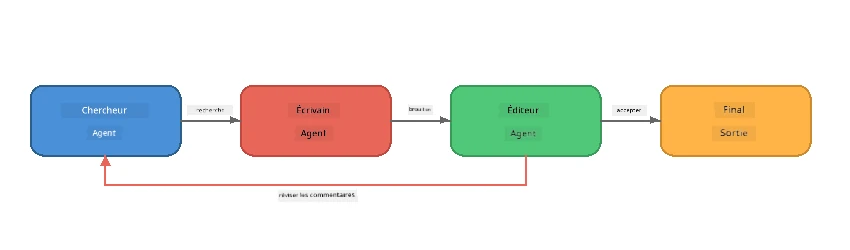
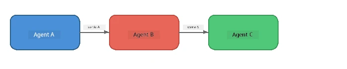
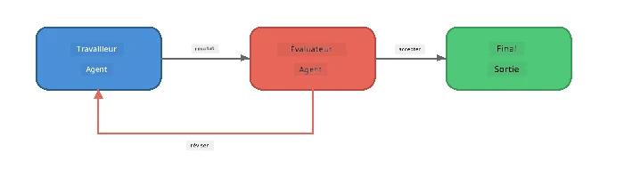
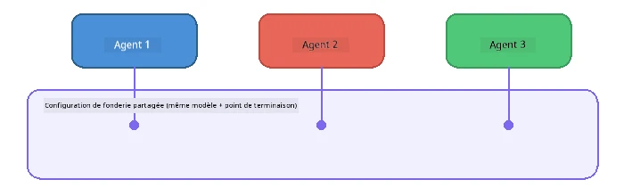

# Partie 6 : Flux de travail multi-agents

> **Objectif :** Combiner plusieurs agents spécialisés en pipelines coordonnées qui divisent des tâches complexes entre agents collaboratifs - tous fonctionnant localement avec Foundry Local.

## Pourquoi Multi-Agent ?

Un seul agent peut gérer de nombreuses tâches, mais les flux de travail complexes bénéficient de la **Spécialisation**. Au lieu qu'un agent tente de rechercher, écrire et éditer simultanément, on divise le travail en rôles ciblés :



| Modèle | Description |
|---------|-------------|
| **Séquentiel** | La sortie de l’Agent A alimente l’Agent B → Agent C |
| **Boucle de rétroaction** | Un agent évaluateur peut renvoyer le travail pour révision |
| **Contexte partagé** | Tous les agents utilisent le même modèle/endpoint, mais des instructions différentes |
| **Sortie typée** | Les agents produisent des résultats structurés (JSON) pour des remises fiables |

---

## Exercices

### Exercice 1 - Exécuter le pipeline multi-agent

L’atelier inclut un flux complet Chercheur → Rédacteur → Éditeur.

<details>
<summary><strong>🐍 Python</strong></summary>

**Configuration :**
```bash
cd python
python -m venv venv

# Windows (PowerShell) :
venv\Scripts\Activate.ps1
# macOS :
source venv/bin/activate

pip install -r requirements.txt
```

**Exécution :**
```bash
python foundry-local-multi-agent.py
```

**Ce qui se passe :**
1. **Chercheur** reçoit un sujet et retourne des faits sous forme de points clés
2. **Rédacteur** prend la recherche et rédige un article de blog (3-4 paragraphes)
3. **Éditeur** relit l’article pour la qualité et retourne ACCEPTÉ ou À RÉVISER

</details>

<details>
<summary><strong>📦 JavaScript</strong></summary>

**Configuration :**
```bash
cd javascript
npm install
```

**Exécution :**
```bash
node foundry-local-multi-agent.mjs
```

**Même pipeline en trois étapes** - Chercheur → Rédacteur → Éditeur.

</details>

<details>
<summary><strong>💜 C#</strong></summary>

**Configuration :**
```bash
cd csharp
dotnet restore
```

**Exécution :**
```bash
dotnet run multi
```

**Même pipeline en trois étapes** - Chercheur → Rédacteur → Éditeur.

</details>

---

### Exercice 2 - Anatomie du pipeline

Étudiez comment les agents sont définis et connectés :

**1. Client modèle partagé**

Tous les agents partagent le même modèle Foundry Local :

```python
# Python - FoundryLocalClient gère tout
from agent_framework_foundry_local import FoundryLocalClient

client = FoundryLocalClient(model_id="phi-3.5-mini")
```

```javascript
// JavaScript - SDK OpenAI pointé sur Foundry Local
const client = new OpenAI({
  baseURL: manager.urls[0] + "/v1",
  apiKey: "foundry-local",
});
```

```csharp
// C# - OpenAIClient pointed at Foundry Local
var key = new ApiKeyCredential("foundry-local");
var client = new OpenAIClient(key, new OpenAIClientOptions
{
    Endpoint = new Uri(manager.Urls[0] + "/v1")
});
var chatClient = client.GetChatClient(model.Id);
```

**2. Instructions spécialisées**

Chaque agent possède une personnalité distincte :

| Agent | Instructions (résumé) |
|-------|----------------------|
| Chercheur | "Fournir les faits clés, statistiques et contexte. Organiser sous forme de points." |
| Rédacteur | "Rédiger un article engageant (3-4 paragraphes) à partir des notes de recherche. Ne pas inventer de faits." |
| Éditeur | "Vérifier la clarté, la grammaire et la cohérence factuelle. Verdict : ACCEPTÉ ou À RÉVISER." |

**3. Flux de données entre agents**

```python
# Étape 1 - la sortie du chercheur devient l'entrée pour l'écrivain
research_result = await researcher.run(f"Research: {topic}")

# Étape 2 - la sortie de l'écrivain devient l'entrée pour le rédacteur
writer_result = await writer.run(f"Write using:\n{research_result}")

# Étape 3 - le rédacteur examine à la fois la recherche et l'article
editor_result = await editor.run(
    f"Research:\n{research_result}\n\nArticle:\n{writer_result}"
)
```

```csharp
// C# - same pattern, async calls with AIAgent
var researchNotes = await researcher.RunAsync(
    $"Research the following topic and provide key facts:\n{topic}");

var draft = await writer.RunAsync(
    $"Write a blog post based on these research notes:\n\n{researchNotes}");

var verdict = await editor.RunAsync(
    $"Review this article for quality and accuracy.\n\n" +
    $"Research notes:\n{researchNotes}\n\n" +
    $"Article:\n{draft}");
```

> **Idée clé :** Chaque agent reçoit le contexte cumulatif des agents précédents. L’éditeur voit à la fois la recherche originale et le brouillon - cela lui permet de vérifier la cohérence factuelle.

---

### Exercice 3 - Ajouter un quatrième agent

Étendez le pipeline en ajoutant un nouvel agent. Choisissez-en un :

| Agent | But | Instructions |
|-------|---------|-------------|
| **Vérificateur de faits** | Vérifier les affirmations dans l’article | `"Vous vérifiez les affirmations factuelles. Pour chaque affirmation, indiquez si elle est soutenue par les notes de recherche. Retournez un JSON avec les éléments vérifiés/non vérifiés."` |
| **Rédacteur de titre** | Créer des titres accrocheurs | `"Générer 5 options de titres pour l’article. Varier les styles : informatif, clickbait, question, liste, émotionnel."` |
| **Réseaux sociaux** | Créer des posts promotionnels | `"Créer 3 posts pour réseaux sociaux promouvant cet article : un pour Twitter (280 caractères), un pour LinkedIn (ton professionnel), un pour Instagram (décontracté avec suggestions d’émojis)."` |

<details>
<summary><strong>🐍 Python - ajout d’un Rédacteur de titre</strong></summary>

```python
headline_agent = client.as_agent(
    name="HeadlineWriter",
    instructions=(
        "You are a headline specialist. Given an article, generate exactly "
        "5 headline options. Vary the style: informative, question-based, "
        "listicle, emotional, and provocative. Return them as a numbered list."
    ),
)

# Après l'acceptation par l'éditeur, générer les titres
headline_result = await headline_agent.run(
    f"Generate headlines for this article:\n\n{writer_result}"
)
print(f"\n--- Headlines ---\n{headline_result}")
```

</details>

<details>
<summary><strong>📦 JavaScript - ajout d’un Rédacteur de titre</strong></summary>

```javascript
const headlineAgent = new ChatAgent({
  client,
  modelId: modelInfo.id,
  instructions:
    "You are a headline specialist. Given an article, generate exactly " +
    "5 headline options. Vary the style: informative, question-based, " +
    "listicle, emotional, and provocative. Return them as a numbered list.",
  name: "HeadlineWriter",
});

const headlineResult = await headlineAgent.run(
  `Generate headlines for this article:\n\n${writerResult.text}`
);
console.log(`\n--- Headlines ---\n${headlineResult.text}`);
```

</details>

<details>
<summary><strong>💜 C# - ajout d’un Rédacteur de titre</strong></summary>

```csharp
AIAgent headlineAgent = chatClient.AsAIAgent(
    name: "HeadlineWriter",
    instructions:
        "You are a headline specialist. Given an article, generate exactly " +
        "5 headline options. Vary the style: informative, question-based, " +
        "listicle, emotional, and provocative. Return them as a numbered list."
);

// After the editor accepts, generate headlines
var headlines = await headlineAgent.RunAsync(
    $"Generate headlines for this article:\n\n{draft}");
Console.WriteLine($"\n--- Headlines ---\n{headlines}");
```

</details>

---

### Exercice 4 - Concevez votre propre flux de travail

Concevez un pipeline multi-agent pour un domaine différent. Voici quelques idées :

| Domaine | Agents | Flux |
|--------|--------|------|
| **Revue de code** | Analyseur → Relecteur → Synthétiseur | Analyser la structure du code → réviser pour les problèmes → produire un rapport résumé |
| **Support client** | Classificateur → Répondeur → Contrôle qualité | Classer le ticket → rédiger réponse → vérifier la qualité |
| **Éducation** | Créateur de quiz → Simulateur d’étudiant → Correcteur | Générer quiz → simuler réponses → corriger et expliquer |
| **Analyse de données** | Interprète → Analyste → Rapporteur | Interpréter la demande de données → analyser les tendances → rédiger un rapport |

**Étapes :**
1. Définir 3+ agents avec des `instructions` distinctes
2. Décider du flux de données - ce que chaque agent reçoit et produit
3. Implémenter le pipeline en utilisant les modèles des Exercices 1-3
4. Ajouter une boucle de rétroaction si un agent doit évaluer le travail d’un autre

---

## Modèles d’orchestration

Voici des modèles d’orchestration qui s’appliquent à tout système multi-agent (explorés en détail dans [Partie 7](part7-zava-creative-writer.md)) :

### Pipeline séquentiel



Chaque agent traite la sortie du précédent. Simple et prévisible.

### Boucle de rétroaction



Un agent évaluateur peut déclencher la réexécution des étapes antérieures. L’écrivain Zava utilise cela : l’éditeur peut envoyer des retours au chercheur et au rédacteur.

### Contexte partagé



Tous les agents partagent une seule `foundry_config` afin d'utiliser le même modèle et endpoint.

---

## Points clés à retenir

| Concept | Ce que vous avez appris |
|---------|-----------------|
| Spécialisation des agents | Chaque agent fait bien une tâche grâce à des instructions ciblées |
| Transferts de données | La sortie d’un agent devient l’entrée du suivant |
| Boucles de rétroaction | Un évaluateur peut déclencher des réessais pour une meilleure qualité |
| Sortie structurée | Des réponses au format JSON permettent une communication fiable entre agents |
| Orchestration | Un coordinateur gère la séquence du pipeline et la gestion des erreurs |
| Modèles de production | Appliqués dans [Partie 7 : Écrivain créatif Zava](part7-zava-creative-writer.md) |

---

## Prochaines étapes

Continuez vers la [Partie 7 : Écrivain créatif Zava - Application finale](part7-zava-creative-writer.md) pour explorer une application multi-agent de style production avec 4 agents spécialisés, sortie en streaming, recherche produit et boucles de rétroaction - disponible en Python, JavaScript et C#.