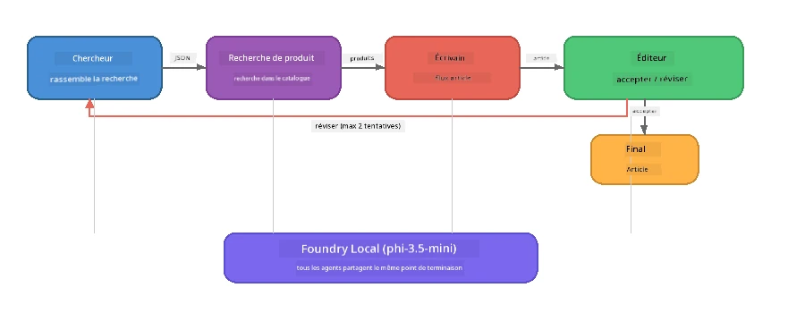

# Partie 7 : Zava Creative Writer - Application finale

> **Objectif :** Explorer une application multi-agent en production où quatre agents spécialisés collaborent pour produire des articles de qualité magazine pour Zava Retail DIY - fonctionnant entièrement sur votre appareil avec Foundry Local.

Ceci est le **laboratoire final** de l'atelier. Il réunit tout ce que vous avez appris - intégration du SDK (Partie 3), récupération de données locales (Partie 4), personnalités d'agents (Partie 5) et orchestration multi-agent (Partie 6) - en une application complète disponible en **Python**, **JavaScript** et **C#**.

---

## Ce que vous allez explorer

| Concept | Où dans Zava Writer |
|---------|---------------------|
| Chargement du modèle en 4 étapes | Module de configuration partagé qui démarre Foundry Local |
| Récupération de type RAG | L’agent produit recherche dans un catalogue local |
| Spécialisation des agents | 4 agents avec des prompts systèmes distincts |
| Sortie en streaming | L’écrivain génère des tokens en temps réel |
| Transferts structurés | Chercheur → JSON, Rédacteur → décision JSON |
| Boucles de rétroaction | Le rédacteur peut déclencher une réexécution (max 2 tentatives) |

---

## Architecture

Le Zava Creative Writer utilise un **pipeline séquentiel avec retour d’évaluation**. Les trois implémentations linguistiques suivent la même architecture :



### Les quatre agents

| Agent | Entrée | Sortie | But |
|-------|--------|--------|-----|
| **Chercheur** | Sujet + retour optionnel | `{"web": [{url, name, description}, ...]}` | Recueille des recherches documentaires via LLM |
| **Recherche Produit** | Chaîne de contexte produit | Liste de produits correspondants | Requêtes générées par LLM + recherche par mots-clés dans catalogue local |
| **Écrivain** | Recherche + produits + affectation + retour | Texte d’article en streaming (séparé par `---`) | Rédige un article de qualité magazine en temps réel |
| **Éditeur** | Article + auto-évaluation du rédacteur | `{"decision": "accept/revise", "editorFeedback": "...", "researchFeedback": "..."}` | Évalue la qualité, déclenche une nouvelle tentative si besoin |

### Flux du pipeline

1. Le **chercheur** reçoit le sujet et produit des notes de recherche structurées (JSON)
2. La **recherche produit** interroge le catalogue produit local avec des termes générés par LLM
3. L’**écrivain** combine recherches + produits + consignes en un article diffusé en streaming, ajoutant une auto-évaluation après un séparateur `---`
4. L’**éditeur** évalue l’article et renvoie un verdict JSON :
   - `"accept"` → pipeline terminé
   - `"revise"` → retour envoyé au chercheur et à l’écrivain (max 2 tentatives)

---

## Prérequis

- Avoir terminé [Partie 6 : Workflows Multi-Agents](part6-multi-agent-workflows.md)
- Avoir installé Foundry Local CLI et téléchargé le modèle `phi-3.5-mini`

---

## Exercices

### Exercice 1 - Lancer Zava Creative Writer

Choisissez votre langage et lancez l’application :

<details>
<summary><strong>🐍 Python - Service Web FastAPI</strong></summary>

La version Python fonctionne comme un **service web** avec une API REST, démontrant comment construire un backend en production.

**Installation :**
```bash
cd zava-creative-writer-local/src/api
python -m venv venv

# Windows (PowerShell) :
venv\Scripts\Activate.ps1
# macOS :
source venv/bin/activate

pip install -r requirements.txt
```

**Lancement :**
```bash
uvicorn main:app --reload
```

**Tester :**
```bash
curl -X POST http://localhost:8000/api/article \
  -H "Content-Type: application/json" \
  -d '{
    "research": "DIY home improvement trends",
    "products": "power tools and paints",
    "assignment": "Write an article about weekend renovation projects for DIY enthusiasts"
  }'
```

La réponse est diffusée sous forme de messages JSON délimités par des retours à la ligne, montrant la progression de chaque agent.

</details>

<details>
<summary><strong>📦 JavaScript - CLI Node.js</strong></summary>

La version JavaScript s’exécute comme une **application CLI**, affichant la progression des agents et l’article directement dans la console.

**Installation :**
```bash
cd zava-creative-writer-local/src/javascript
npm install
```

**Lancement :**
```bash
node main.mjs
```

Vous verrez :
1. Chargement du modèle Foundry Local (avec barre de progression si téléchargement)
2. Chaque agent s’exécute en séquence avec messages de statut
3. L’article diffusé dans la console en temps réel
4. La décision d’acceptation ou de révision de l’éditeur

</details>

<details>
<summary><strong>💜 C# - Application Console .NET</strong></summary>

La version C# fonctionne comme une **application console .NET** avec le même pipeline et sortie en streaming.

**Installation :**
```bash
cd zava-creative-writer-local/src/csharp
dotnet restore
```

**Lancement :**
```bash
dotnet run
```

Même schéma de sortie que la version JavaScript – messages de statut des agents, article en streaming, verdict de l’éditeur.

</details>

---

### Exercice 2 - Étudier la structure du code

Chaque implémentation utilise les mêmes composants logiques. Comparez les structures :

**Python** (`src/api/`) :
| Fichier | But |
|---------|-----|
| `foundry_config.py` | Gestionnaire Foundry Local partagé, modèle et client (initialisation en 4 étapes) |
| `orchestrator.py` | Coordination du pipeline avec boucle de rétroaction |
| `main.py` | Endpoints FastAPI (`POST /api/article`) |
| `agents/researcher/researcher.py` | Recherche basée sur LLM avec sortie JSON |
| `agents/product/product.py` | Requêtes générées par LLM + recherche par mots-clés |
| `agents/writer/writer.py` | Génération d’article en streaming |
| `agents/editor/editor.py` | Décision d’acceptation/révision en JSON |

**JavaScript** (`src/javascript/`) :
| Fichier | But |
|---------|-----|
| `foundryConfig.mjs` | Configuration Foundry Local partagée (initialisation en 4 étapes avec barre de progression) |
| `main.mjs` | Orchestrateur + point d’entrée CLI |
| `researcher.mjs` | Agent chercheur basé sur LLM |
| `product.mjs` | Génération de requêtes LLM + recherche par mots-clés |
| `writer.mjs` | Génération d’article en streaming (générateur asynchrone) |
| `editor.mjs` | Décision d’acceptation/révision JSON |
| `products.mjs` | Données du catalogue produit |

**C#** (`src/csharp/`) :
| Fichier | But |
|---------|-----|
| `Program.cs` | Pipeline complet : chargement modèle, agents, orchestrateur, boucle de rétroaction |
| `ZavaCreativeWriter.csproj` | Projet .NET 9 avec packages Foundry Local + OpenAI |

> **Note de conception :** Python sépare chaque agent dans son propre fichier/dossier (adapté aux grandes équipes). JavaScript utilise un module par agent (adapté aux projets moyens). C# garde tout dans un seul fichier avec fonctions locales (adapté aux exemples autonomes). En production, choisissez le modèle selon les conventions de votre équipe.

---

### Exercice 3 - Suivre la configuration partagée

Chaque agent du pipeline partage un seul client de modèle Foundry Local. Étudiez comment c’est configuré dans chaque langage :

<details>
<summary><strong>🐍 Python - foundry_config.py</strong></summary>

```python
from foundry_local import FoundryLocalManager

MODEL_ALIAS = "phi-3.5-mini"

# Étape 1 : Créer le gestionnaire et démarrer le service Foundry Local
manager = FoundryLocalManager()
manager.start_service()

# Étape 2 : Vérifier si le modèle est déjà téléchargé
cached = manager.list_cached_models()
catalog_info = manager.get_model_info(MODEL_ALIAS)
is_cached = any(m.id == catalog_info.id for m in cached) if catalog_info else False

if not is_cached:
    manager.download_model(MODEL_ALIAS)

# Étape 3 : Charger le modèle en mémoire
manager.load_model(MODEL_ALIAS)
model_id = manager.get_model_info(MODEL_ALIAS).id

# Client OpenAI partagé
client = openai.OpenAI(base_url=manager.endpoint, api_key=manager.api_key)
```

Tous les agents importent `from foundry_config import client, model_id`.

</details>

<details>
<summary><strong>📦 JavaScript - foundryConfig.mjs</strong></summary>

```javascript
import { FoundryLocalManager } from "foundry-local-sdk";
import { OpenAI } from "openai";

FoundryLocalManager.create({ appName: "ZavaCreativeWriter" });
const manager = FoundryLocalManager.instance;
await manager.startWebService();

// Vérifier le cache → télécharger → charger (nouveau modèle SDK)
const catalog = manager.catalog;
const model = await catalog.getModel(MODEL_ALIAS);
if (!model.isCached) {
  console.log(`Downloading model: ${MODEL_ALIAS}...`);
  await model.download();
}
await model.load();

const client = new OpenAI({ baseURL: manager.urls[0] + "/v1", apiKey: "foundry-local" });
const modelId = model.id;
export { client, modelId };
```

Tous les agents importent `{ client, modelId } from "./foundryConfig.mjs"`.

</details>

<details>
<summary><strong>💜 C# - début de Program.cs</strong></summary>

```csharp
await FoundryLocalManager.CreateAsync(
    new Configuration
    {
        AppName = "ZavaCreativeWriter",
        Web = new Configuration.WebService { Urls = "http://127.0.0.1:0" }
    }, NullLogger.Instance, default);
var manager = FoundryLocalManager.Instance;
await manager.StartWebServiceAsync(default);

var catalog = await manager.GetCatalogAsync(default);
var catalogModel = await catalog.GetModelAsync(alias, default);
var isCached = await catalogModel.IsCachedAsync(default);
if (!isCached)
    await catalogModel.DownloadAsync(null, default);

await catalogModel.LoadAsync(default);
var key = new ApiKeyCredential("foundry-local");
var chatClient = new OpenAIClient(key, new OpenAIClientOptions
{
    Endpoint = new Uri(manager.Urls[0] + "/v1")
}).GetChatClient(catalogModel.Id);
```

Le `chatClient` est ensuite passé à toutes les fonctions agents dans le même fichier.

</details>

> **Motif clé :** Le schéma de chargement du modèle (démarrer service → vérifier cache → télécharger → charger) garantit une progression visible à l’utilisateur et que le modèle n’est téléchargé qu’une seule fois. C’est une bonne pratique pour toute application Foundry Local.

---

### Exercice 4 - Comprendre la boucle de rétroaction

La boucle de rétroaction rend ce pipeline "intelligent" - l’éditeur peut renvoyer le travail pour révision. Analysez la logique :

```
Orchestrator:
  1. researcher.research(topic, "No Feedback")    ← first pass
  2. product.findProducts(productContext)
  3. writer.write(research, products, assignment)  ← streams article
  4. Split article at "---" → article + writerFeedback
  5. editor.edit(article, writerFeedback)

  WHILE editor says "revise" AND retryCount < 2:
    6. researcher.research(topic, editor.researchFeedback)  ← refined
    7. writer.write(research, products, editor.editorFeedback)
    8. editor.edit(newArticle, newWriterFeedback)
    9. retryCount++
```

**Questions à considérer :**
- Pourquoi la limite de tentatives est-elle fixée à 2 ? Que se passe-t-il si on l’augmente ?
- Pourquoi le chercheur reçoit `researchFeedback` tandis que l’écrivain reçoit `editorFeedback` ?
- Que se passerait-il si l’éditeur disait toujours "revise" ?

---

### Exercice 5 - Modifier un agent

Essayez de modifier le comportement d’un agent et observez l’impact sur le pipeline :

| Modification | Ce qu’il faut changer |
|--------------|-----------------------|
| **Éditeur plus strict** | Modifier le prompt système de l’éditeur pour toujours demander au moins une révision |
| **Articles plus longs** | Modifier le prompt de l’écrivain de "800-1000 mots" à "1500-2000 mots" |
| **Produits différents** | Ajouter ou modifier des produits dans le catalogue produit |
| **Nouveau sujet de recherche** | Modifier le `researchContext` par défaut pour un autre sujet |
| **Chercheur JSON uniquement** | Faire retourner au chercheur 10 éléments au lieu de 3-5 |

> **Conseil :** Comme les trois langages implémentent la même architecture, vous pouvez faire la même modification dans celui que vous maîtrisez le mieux.

---

### Exercice 6 - Ajouter un cinquième agent

Étendez le pipeline avec un nouvel agent. Quelques idées :

| Agent | Où dans le pipeline | But |
|-------|---------------------|-----|
| **Vérificateur de faits** | Après l’écrivain, avant l’éditeur | Vérifier les affirmations par rapport aux données de recherche |
| **Optimiseur SEO** | Après acceptation de l’éditeur | Ajouter meta description, mots-clés, slug |
| **Illustrateur** | Après acceptation de l’éditeur | Générer des prompts d’images pour l’article |
| **Traducteur** | Après acceptation de l’éditeur | Traduire l’article dans une autre langue |

**Étapes :**
1. Rédiger le prompt système de l’agent
2. Créer la fonction agent (suivant le modèle existant dans votre langage)
3. L’insérer dans l’orchestrateur au bon endroit
4. Mettre à jour la sortie/journalisation pour montrer la contribution du nouvel agent

---

## Comment Foundry Local et le Framework Agent fonctionnent ensemble

Cette application démontre le modèle recommandé pour construire des systèmes multi-agents avec Foundry Local :

| Couche | Composant | Rôle |
|--------|-----------|------|
| **Runtime** | Foundry Local | Télécharge, gère et sert le modèle localement |
| **Client** | SDK OpenAI | Envoie les complétions de chat à l’endpoint local |
| **Agent** | Prompt système + appel chat | comportement spécialisé via instructions ciblées |
| **Orchestrateur** | Coordinateur du pipeline | Gère le flux de données, la séquence et les boucles de rétroaction |
| **Framework** | Microsoft Agent Framework | Fournit l’abstraction `ChatAgent` et les modèles |

L’intuition clé : **Foundry Local remplace le backend cloud, pas l’architecture applicative.** Les mêmes modèles d’agents, stratégies d’orchestration et transferts structurés fonctionnant avec des modèles hébergés dans le cloud fonctionnent identiquement avec des modèles locaux — vous pointez simplement le client vers l’endpoint local au lieu d’un endpoint Azure.

---

## Points clés à retenir

| Concept | Ce que vous avez appris |
|---------|------------------------|
| Architecture de production | Comment structurer une app multi-agent avec config partagée et agents séparés |
| Chargement modèle en 4 étapes | Bonne pratique pour initialiser Foundry Local avec progression visible |
| Spécialisation des agents | Chaque agent a des instructions ciblées et un format de sortie spécifique |
| Génération en streaming | L’écrivain émet des tokens en temps réel, permettant des interfaces réactives |
| Boucles de rétroaction | Tentatives pilotées par l’éditeur améliorent la qualité sans intervention humaine |
| Modèles multi-langages | Même architecture fonctionne en Python, JavaScript et C# |
| Local = prêt production | Foundry Local sert la même API compatible OpenAI utilisée dans le cloud |

---

## Étape suivante

Poursuivez avec [Partie 8 : Développement piloté par l’évaluation](part8-evaluation-led-development.md) pour construire un cadre d’évaluation systématique de vos agents, utilisant des jeux de données de référence, des contrôles basés sur règles, et des notations LLM en tant que juge.