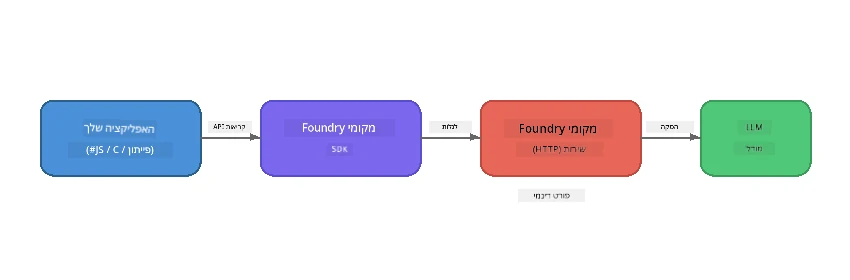

# חלק 1: התחלה עם Foundry Local


## מה זה Foundry Local?

[Foundry Local](https://foundrylocal.ai) מאפשר לך להריץ מודלים של שפה מבוססי בינה מלאכותית בקוד פתוח **ישר על המחשב שלך** - ללא צורך באינטרנט, ללא עלויות ענן, ועם פרטיות מלאה לנתונים. הוא:

- **מוריד ומריץ מודלים באופן מקומי** עם אופטימיזציה אוטומטית לחומרה (GPU, CPU, או NPU)
- **מספק API תואם OpenAI** כך שתוכל להשתמש ב-SDKs וכלים מוכרים
- **לא דורש מנוי ל-Azure** או הרשמה - פשוט התקן והתחל לבנות

תחשוב עליו כבינה מלאכותית פרטית שלך שרצה במלואה על המכשיר שלך.

## מטרות הלמידה

בסוף המעבדה הזו תוכל:

- להתקין את Foundry Local CLI במערכת ההפעלה שלך
- להבין מה הם כינויים למודלים וכיצד הם פועלים
- להוריד ולרוץ את מודל ה-AI המקומי הראשון שלך
- לשלוח הודעת שיחה למודל מקומי משורת הפקודה
- להבין את ההבדל בין מודלים מקומיים למודלים שמאוחסנים בענן

---

## דרישות מוקדמות

### דרישות מערכת

| דרישה | מינימום | מומלץ |
|-------------|---------|-------------|
| **זיכרון (RAM)** | 8 GB | 16 GB |
| **שטח אחסון** | 5 GB (עבור מודלים) | 10 GB |
| **מעבד (CPU)** | 4 ליבות | 8+ ליבות |
| **כרטיס גרפי (GPU)** | אופציונלי | NVIDIA עם CUDA 11.8+ |
| **מערכת הפעלה** | Windows 10/11 (x64/ARM), Windows Server 2025, macOS 13+ | - |

> **הערה:** Foundry Local בוחר אוטומטית את גרסת המודל הטובה ביותר עבור החומרה שלך. אם יש לך GPU של NVIDIA, הוא משתמש בהאצת CUDA. אם יש לך NPU של Qualcomm, הוא משתמש בזה. אחרת הוא חוזר לגרסת CPU מותאמת.

### התקנת Foundry Local CLI

**Windows** (PowerShell):
```powershell
winget install Microsoft.FoundryLocal
```

**macOS** (Homebrew):
```bash
brew tap microsoft/foundrylocal
brew install foundrylocal
```

> **הערה:** Foundry Local תומך כרגע רק ב-Windows וב-macOS. לינוקס לא נתמכת כרגע.

אמת את ההתקנה:
```bash
foundry --version
```

---

## תרגילי מעבדה

### תרגיל 1: חקור מודלים זמינים

Foundry Local כולל קטלוג של מודלים מבוססי קוד פתוח אופרטימיזציה מראש. רשום אותם:

```bash
foundry model list
```

תראה מודלים כמו:
- `phi-3.5-mini` - המודל של מיקרוסופט עם 3.8 מיליארד פרמטרים (מהיר, איכות טובה)
- `phi-4-mini` - מודל Phi חדש ומתקדם יותר
- `phi-4-mini-reasoning` - מודל Phi עם יכולת חשיבה שרשרת (`<think>` תגים)
- `phi-4` - המודל הגדול ביותר של מיקרוסופט (10.4 GB)
- `qwen2.5-0.5b` - קטן ומהיר מאוד (טוב למכשירים בעלי משאבים מוגבלים)
- `qwen2.5-7b` - מודל חזק כללי עם תמיכה בקריאת כלים
- `qwen2.5-coder-7b` - מותאם ליצירת קוד
- `deepseek-r1-7b` - מודל חזק ליכולת טיעון
- `gpt-oss-20b` - מודל קוד פתוח גדול (רישיון MIT, 12.5 GB)
- `whisper-base` - תמלול דיבור לטקסט (383 MB)
- `whisper-large-v3-turbo` - תמלול מדויק (9 GB)

> **מה זה כינוי למודל?** כינויים כמו `phi-3.5-mini` הם קיצורים. כשאתה משתמש בכינוי, Foundry Local מוריד אוטומטית את הגרסה הטובה ביותר לחומרה הספציפית שלך (CUDA עבור NVIDIA GPU, CPU מותאם אחרת). אין צורך לדאוג לבחירת הגרסה הנכונה.

### תרגיל 2: הרץ את המודל הראשון שלך

הורד והתחל שיחה עם מודל בצורה אינטראקטיבית:

```bash
foundry model run phi-3.5-mini
```

בפעם הראשונה שתריץ את זה, Foundry Local יבצע:
1. זיהוי החומרה שלך
2. הורדת גרסת המודל האופטימלית (יכול לקחת כמה דקות)
3. טעינת המודל לזיכרון
4. פתיחת סשן שיחה אינטראקטיבי

נסה לשאול אותו כמה שאלות:
```
You: What is the golden ratio?
You: Can you explain it as if I were 10 years old?
You: Write a haiku about mathematics
```

הקלד `exit` או לחץ `Ctrl+C` ליציאה.

### תרגיל 3: הורד מודל מראש

אם ברצונך להוריד מודל בלי להתחיל שיחה:

```bash
foundry model download phi-3.5-mini
```

בדוק אילו מודלים כבר הורדו על המכשיר שלך:

```bash
foundry cache list
```

### תרגיל 4: הבנת הארכיטקטורה

Foundry Local פועל כ**שירות HTTP מקומי** הפותח API תואם OpenAI. משמעות הדבר:

1. השירות מתחיל על **פורט דינמי** (פורט שונה כל פעם)
2. אתה משתמש ב-SDK כדי לגלות את כתובת ה-URL המדויקת
3. אפשר להשתמש ב**כל** ספריית לקוח תואמת OpenAI כדי לתקשר איתו



> **חשוב:** Foundry Local מקצה **פורט דינמי** בכל פעם שהוא מתחיל. אל תעשה הקצאת פורט קשיחה כמו `localhost:5272`. תמיד השתמש ב-SDK כדי לגלות את ה-URL הנוכחי (למשל `manager.endpoint` בפייתון או `manager.urls[0]` ב-JavaScript).

---

## מושגים מרכזיים

| מונח | מה למדת |
|---------|------------------|
| AI במכשיר | Foundry Local מריץ מודלים במלואם על המכשיר שלך ללא ענן, ללא מפתחות API וללא עלויות |
| כינויים למודלים | כינויים כמו `phi-3.5-mini` בוחרים אוטומטית את הגרסה הטובה ביותר לחומרה שלך |
| פורטים דינמיים | השירות רץ על פורט דינמי; תמיד השתמש ב-SDK כדי לגלות את נקודת הקצה |
| CLI ו-SDK | ניתן לתקשר עם מודלים דרך ה-CLI (`foundry model run`) או תכנותית דרך ה-SDK |

---

## הצעדים הבאים

המשך ל[חלק 2: Foundry Local SDK מעמיק](part2-foundry-local-sdk.md) כדי לשלוט ב-API של ה-SDK לניהול מודלים, שירותים, וזיכרון מטמון בתכנות.