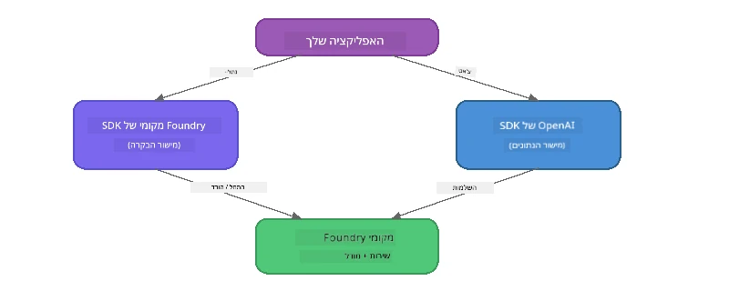

# חלק 3: שימוש ב-Foundry Local SDK עם OpenAI

## סקירה כללית

בחלק 1 השתמשת ב-Foundry Local CLI כדי להפעיל מודלים באינטראקטיביות. בחלק 2 חקרת את ממשק ה-API המלא של SDK. כעת תלמד כיצד **לאינטגרציה של Foundry Local באפליקציות שלך** באמצעות ה-SDK ו-API תואם OpenAI.

Foundry Local מספק SDK בשלוש שפות תכנות. בחר את השפה שאתה מרגיש בה הכי נוח - המושגים זהים בכל השלוש.

## יעדי הלמידה

בתום המעבדה תוכל:

- להתקין את Foundry Local SDK לשפת התכנות שלך (Python, JavaScript או C#)
- לאתחל את `FoundryLocalManager` כדי להפעיל את השירות, לבדוק את המטמון, להוריד ולטעון מודל
- להתחבר למודל המקומי באמצעות OpenAI SDK
- לשלוח השלמות צ'אט ולטפל בתגובות בזרימת מידע
- להבין את ארכיטקטורת הפורטים הדינמית

---

## דרישות מוקדמות

סיים קודם את [חלק 1: התחלת עבודה עם Foundry Local](part1-getting-started.md) ואת [חלק 2: מבט מעמיק על Foundry Local SDK](part2-foundry-local-sdk.md).

התקן **אחת** מהסביבות הבאות לשפת תכנות:
- **Python 3.9+** - [python.org/downloads](https://www.python.org/downloads/)
- **Node.js 18+** - [nodejs.org](https://nodejs.org/)
- **.NET 9.0+** - [dot.net/download](https://dotnet.microsoft.com/download)

---

## מושג: כיצד עובד ה-SDK

Foundry Local SDK מנהל את **מישור הבקרה** (הפעלת השירות, הורדת מודלים), בעוד OpenAI SDK מטפל ב**מישור הנתונים** (שליחת פרומפטים, קבלת השלמות).



---

## תרגילי מעבדה

### תרגיל 1: הגדרת הסביבה שלך

<details>
<summary><b>🐍 Python</b></summary>

```bash
cd python
python -m venv venv

# הפעל את הסביבה הווירטואלית:
# Windows (PowerShell):
venv\Scripts\Activate.ps1
# Windows (Command Prompt):
venv\Scripts\activate.bat
# macOS:
source venv/bin/activate

pip install -r requirements.txt
```

הקובץ `requirements.txt` מתקין:
- `foundry-local-sdk` - ה-Foundry Local SDK (מיובא כ-`foundry_local`)
- `openai` - ה-OpenAI Python SDK
- `agent-framework` - Microsoft Agent Framework (משמש בחלקים מאוחרים יותר)

</details>

<details>
<summary><b>📘 JavaScript</b></summary>

```bash
cd javascript
npm install
```

הקובץ `package.json` מתקין:
- `foundry-local-sdk` - ה-Foundry Local SDK
- `openai` - ה-OpenAI Node.js SDK

</details>

<details>
<summary><b>💜 C#</b></summary>

```bash
cd csharp
dotnet restore
dotnet build
```

ה-`csharp.csproj` משתמש ב:
- `Microsoft.AI.Foundry.Local` - ה-Foundry Local SDK (נוגט)
- `OpenAI` - ה-OpenAI C# SDK (נוגט)

> **מבנה הפרויקט:** בפרויקט C# יש נתב שורת פקודה ב-`Program.cs` המפציל לקבצי דוגמה נפרדים. הפעל את `dotnet run chat` (או פשוט `dotnet run`) עבור חלק זה. חלקים אחרים משתמשים ב-`dotnet run rag`, `dotnet run agent`, ו-`dotnet run multi`.

</details>

---

### תרגיל 2: השלמת שיחה בסיסית

פתח את הדוגמה הבסיסית לשיחה לשפת התכנות שלך ועיין בקוד. כל סקריפט עוקב אחרי תבנית תלת-שלבית:

1. **הפעל את השירות** - `FoundryLocalManager` מפעיל את סביבת הביצוע של Foundry Local
2. **הורד וטעון את המודל** - בדוק את המטמון, הורד במידת הצורך, ואז טען לזיכרון
3. **צור לקוח OpenAI** - התחבר לכתובת המקומית ושלח השלמת שיחה בזרימה

<details>
<summary><b>🐍 Python - <code>python/foundry-local.py</code></b></summary>

```python
import sys
import openai
from foundry_local import FoundryLocalManager

alias = "phi-3.5-mini"

# שלב 1: צור FoundryLocalManager והפעל את השירות
print("Starting Foundry Local service...")
manager = FoundryLocalManager()
manager.start_service()

# שלב 2: בדוק אם המודל כבר הורד
cached = manager.list_cached_models()
catalog_info = manager.get_model_info(alias)
is_cached = any(m.id == catalog_info.id for m in cached) if catalog_info else False

if is_cached:
    print(f"Model already downloaded: {alias}")
else:
    print(f"Downloading model: {alias} (this may take several minutes)...")
    manager.download_model(alias)
    print(f"Download complete: {alias}")

# שלב 3: טען את המודל לזיכרון
print(f"Loading model: {alias}...")
manager.load_model(alias)

# צור לקוח OpenAI הפונה לשירות Foundry המקומי
client = openai.OpenAI(
    base_url=manager.endpoint,   # פורט דינמי - לעולם אל תקודד קשיח!
    api_key=manager.api_key
)

# צור השלמת צ'אט בזרימה חיה
stream = client.chat.completions.create(
    model=manager.get_model_info(alias).id,
    messages=[{"role": "user", "content": "What is the golden ratio?"}],
    stream=True,
)

for chunk in stream:
    if chunk.choices[0].delta.content is not None:
        print(chunk.choices[0].delta.content, end="", flush=True)
print()
```

**הפעל את זה:**
```bash
python foundry-local.py
```

</details>

<details>
<summary><b>📘 JavaScript - <code>javascript/foundry-local.mjs</code></b></summary>

```javascript
import { OpenAI } from "openai";
import { FoundryLocalManager } from "foundry-local-sdk";

const alias = "phi-3.5-mini";

// שלב 1: הפעל את שירות Foundry Local
console.log("Starting Foundry Local service...");
FoundryLocalManager.create({ appName: "FoundryLocalWorkshop" });
const manager = FoundryLocalManager.instance;
await manager.startWebService();

// שלב 2: בדוק האם המודל כבר הורד
const catalog = manager.catalog;
const model = await catalog.getModel(alias);

if (model.isCached) {
  console.log(`Model already downloaded: ${alias}`);
} else {
  console.log(`Downloading model: ${alias} (this may take several minutes)...`);
  await model.download();
  console.log(`Download complete: ${alias}`);
}

// שלב 3: טען את המודל לזיכרון
console.log(`Loading model: ${alias}...`);
await model.load();
console.log(`Model loaded: ${model.id}`);

// צור לקוח OpenAI שמצביע לשירות Foundry המקומי
const client = new OpenAI({
  baseURL: manager.urls[0] + "/v1",   // פורט דינמי - אף פעם לא לקבוע קשיח!
  apiKey: "foundry-local",
});

// הפעל השלמת שיחה בזרימה חיים
const stream = await client.chat.completions.create({
  model: model.id,
  messages: [{ role: "user", content: "What is the golden ratio?" }],
  stream: true,
});

for await (const chunk of stream) {
  if (chunk.choices[0]?.delta?.content) {
    process.stdout.write(chunk.choices[0].delta.content);
  }
}
console.log();
```

**הפעל את זה:**
```bash
node foundry-local.mjs
```

</details>

<details>
<summary><b>💜 C# - <code>csharp/BasicChat.cs</code></b></summary>

```csharp
using Microsoft.AI.Foundry.Local;
using Microsoft.Extensions.Logging.Abstractions;
using OpenAI;
using OpenAI.Chat;
using System.ClientModel;

var alias = "phi-3.5-mini";

// Step 1: Start the Foundry Local service
Console.WriteLine("Starting Foundry Local service...");
await FoundryLocalManager.CreateAsync(
    new Configuration
    {
        AppName = "FoundryLocalSamples",
        Web = new Configuration.WebService { Urls = "http://127.0.0.1:0" }
    }, NullLogger.Instance, default);
var manager = FoundryLocalManager.Instance;
await manager.StartWebServiceAsync(default);

// Step 2: Get the model from the catalog
var catalog = await manager.GetCatalogAsync(default);
var model = await catalog.GetModelAsync(alias, default);

// Step 3: Check if the model is already downloaded
var isCached = await model.IsCachedAsync(default);

if (isCached)
{
    Console.WriteLine($"Model already downloaded: {alias}");
}
else
{
    Console.WriteLine($"Downloading model: {alias} (this may take several minutes)...");
    await model.DownloadAsync(null, default);
    Console.WriteLine($"Download complete: {alias}");
}

// Step 4: Load the model into memory
Console.WriteLine($"Loading model: {alias}...");
await model.LoadAsync(default);
Console.WriteLine($"Loaded model: {model.Id}");
Console.WriteLine($"Endpoint: {manager.Urls[0]}");

// Create OpenAI client pointing to the LOCAL Foundry service
var key = new ApiKeyCredential("foundry-local");
var client = new OpenAIClient(key, new OpenAIClientOptions
{
    Endpoint = new Uri(manager.Urls[0] + "/v1")  // Dynamic port - never hardcode!
});

var chatClient = client.GetChatClient(model.Id);

// Stream a chat completion
var completionUpdates = chatClient.CompleteChatStreaming("What is the golden ratio?");

foreach (var update in completionUpdates)
{
    if (update.ContentUpdate.Count > 0)
    {
        Console.Write(update.ContentUpdate[0].Text);
    }
}
Console.WriteLine();
```

**הפעל את זה:**
```bash
dotnet run chat
```

</details>

---

### תרגיל 3: ניסוי בפרומפטים

לאחר שהדוגמה הבסיסית שלך רצה, נסה לשנות את הקוד:

1. **שנה את הודעת המשתמש** - נסה שאלות שונות
2. **הוסף פרומפט מערכת** - תן למודל אישיות
3. **כבה את הזרימה** - הגדר `stream=False` והדפס את התגובה המלאה בבת אחת
4. **נסה מודל שונה** - שנה את הכינוי מ-`phi-3.5-mini` למודל אחר מפקודת `foundry model list`

<details>
<summary><b>🐍 Python</b></summary>

```python
# הוסף התראה למערכת - תן לדגם פרסונה:
stream = client.chat.completions.create(
    model=manager.get_model_info(alias).id,
    messages=[
        {"role": "system", "content": "You are a pirate. Answer everything in pirate speak."},
        {"role": "user", "content": "What is the golden ratio?"}
    ],
    stream=True,
)

# או כבה את הזרמת הנתונים:
response = client.chat.completions.create(
    model=manager.get_model_info(alias).id,
    messages=[{"role": "user", "content": "What is the golden ratio?"}],
    stream=False,
)
print(response.choices[0].message.content)
```

</details>

<details>
<summary><b>📘 JavaScript</b></summary>

```javascript
// הוסף בקשת מערכת - תן למודל אופי:
const stream = await client.chat.completions.create({
  model: modelInfo.id,
  messages: [
    { role: "system", content: "You are a pirate. Answer everything in pirate speak." },
    { role: "user", content: "What is the golden ratio?" },
  ],
  stream: true,
});

// או כבה שידור חי:
const response = await client.chat.completions.create({
  model: modelInfo.id,
  messages: [{ role: "user", content: "What is the golden ratio?" }],
  stream: false,
});
console.log(response.choices[0].message.content);
```

</details>

<details>
<summary><b>💜 C#</b></summary>

```csharp
// Add a system prompt - give the model a persona:
var completionUpdates = chatClient.CompleteChatStreaming(
    new ChatMessage[]
    {
        new SystemChatMessage("You are a pirate. Answer everything in pirate speak."),
        new UserChatMessage("What is the golden ratio?")
    }
);

// Or turn off streaming:
var response = chatClient.CompleteChat("What is the golden ratio?");
Console.WriteLine(response.Value.Content[0].Text);
```

</details>

---

### הפניות לשיטות SDK

<details>
<summary><b>🐍 שיטות Python SDK</b></summary>

| שיטה | תכלית |
|--------|---------|
| `FoundryLocalManager()` | צור מופע מנהל |
| `manager.start_service()` | הפעל את שירות Foundry Local |
| `manager.list_cached_models()` | רשום את המודלים שהורדו למכשיר שלך |
| `manager.get_model_info(alias)` | קבל מזהה מודל ומטא-נתונים |
| `manager.download_model(alias, progress_callback=fn)` | הורד מודל עם callback אופציונלי להתקדמות |
| `manager.load_model(alias)` | טען מודל לזיכרון |
| `manager.endpoint` | קבל כתובת נקודת הקצה הדינמית |
| `manager.api_key` | קבל את מפתח ה-API (ממלא מקום למקומי) |

</details>

<details>
<summary><b>📘 שיטות JavaScript SDK</b></summary>

| שיטה | תכלית |
|--------|---------|
| `FoundryLocalManager.create({ appName })` | צור מופע מנהל |
| `FoundryLocalManager.instance` | גש למנהל הסינגלטון |
| `await manager.startWebService()` | הפעל את שירות Foundry Local |
| `await manager.catalog.getModel(alias)` | קבל מודל מהקטלוג |
| `model.isCached` | בדוק אם המודל כבר הורד |
| `await model.download()` | הורד מודל |
| `await model.load()` | טען מודל לזיכרון |
| `model.id` | קבל את מזהה המודל לקריאות API של OpenAI |
| `manager.urls[0] + "/v1"` | קבל את כתובת נקודת הקצה הדינמית |
| `"foundry-local"` | מפתח API (ממלא מקום למקומי) |

</details>

<details>
<summary><b>💜 שיטות C# SDK</b></summary>

| שיטה | תכלית |
|--------|---------|
| `FoundryLocalManager.CreateAsync(config)` | צור ואתחל את המנהל |
| `manager.StartWebServiceAsync()` | הפעל את שירות הרשת של Foundry Local |
| `manager.GetCatalogAsync()` | קבל את קטלוג המודלים |
| `catalog.ListModelsAsync()` | רשום את כל המודלים הזמינים |
| `catalog.GetModelAsync(alias)` | קבל מודל ספציפי לפי כינוי |
| `model.IsCachedAsync()` | בדוק אם מודל הורד |
| `model.DownloadAsync()` | הורד מודל |
| `model.LoadAsync()` | טען מודל לזיכרון |
| `manager.Urls[0]` | קבל את כתובת נקודת הקצה הדינמית |
| `new ApiKeyCredential("foundry-local")` | אישור מפתח API למקומי |

</details>

---

### תרגיל 4: שימוש ב-ChatClient המקומי (חלופה ל-OpenAI SDK)

בתרגילים 2 ו-3 השתמשת ב-OpenAI SDK להשלמות שיחה. ה-SDK של JavaScript ו-C# גם מספקים **ChatClient מקומי** שמבטל את הצורך ב-OpenAI SDK לחלוטין.

<details>
<summary><b>📘 JavaScript - <code>model.createChatClient()</code></b></summary>

```javascript
import { FoundryLocalManager } from "foundry-local-sdk";

const alias = "phi-3.5-mini";

FoundryLocalManager.create({ appName: "ChatClientDemo" });
const manager = FoundryLocalManager.instance;
await manager.startWebService();

const model = await manager.catalog.getModel(alias);
if (!model.isCached) await model.download();
await model.load();

// אין צורך בייבוא OpenAI — קבל לקוח ישירות מהמודל
const chatClient = model.createChatClient();

// השלמה ללא זרימה
const response = await chatClient.completeChat([
  { role: "system", content: "You are a pirate. Answer everything in pirate speak." },
  { role: "user", content: "What is the golden ratio?" }
]);
console.log(response.choices[0].message.content);

// השלמה עם זרימה (משתמש בתבנית קריאת חוזר)
await chatClient.completeStreamingChat(
  [{ role: "user", content: "What is the golden ratio?" }],
  (chunk) => {
    if (chunk.choices?.[0]?.delta?.content) {
      process.stdout.write(chunk.choices[0].delta.content);
    }
  }
);
console.log();
```

> **הערה:** שיטת `completeStreamingChat()` של ChatClient משתמשת בתבנית **callback**, לא במערך אסינכרוני. העבר פונקציה כארגומנט השני.

</details>

<details>
<summary><b>💜 C# - <code>model.GetChatClientAsync()</code></b></summary>

```csharp
var catalog = await manager.GetCatalogAsync(default);
var model = await catalog.GetModelAsync("phi-3.5-mini", default);
if (!await model.IsCachedAsync(default))
    await model.DownloadAsync(null, default);
await model.LoadAsync(default);

// No OpenAI NuGet needed — get a client directly from the model
var chatClient = await model.GetChatClientAsync(default);

// Use it like a standard OpenAI ChatClient
var response = chatClient.CompleteChat("What is the golden ratio?");
Console.WriteLine(response.Value.Content[0].Text);
```

</details>

> **מתי להשתמש באיזה:**
> | גישה | מתאים ל- |
> |----------|----------|
> | OpenAI SDK | שליטה מלאה בפרמטרים, אפליקציות ייצור, קוד OpenAI קיים |
> | ChatClient מקומי | פרוטוטייפ מהיר, פחות תלותיות, הגדרה פשוטה |

---

## סיכומי מפתח

| מושג | מה שלמדת |
|---------|------------------|
| מישור הבקרה | Foundry Local SDK מטפל בהפעלת השירות וטעינת מודלים |
| מישור הנתונים | OpenAI SDK מטפל בהשלמות שיחה וזרימה |
| פורטים דינמיים | תמיד השתמש ב-SDK כדי לגלות את נקודת הקצה; אל תשתמש בכתובות קבועות |
| רב-שפתיות | אותה תבנית קוד עובדת ב-Python, JavaScript ו-C# |
| תאימות OpenAI | תאימות מלאה ל-API של OpenAI מאפשרת שימוש בקוד OpenAI קיים עם שינויים מינימליים |
| ChatClient מקומי | `createChatClient()` (JS) / `GetChatClientAsync()` (C#) מספקים חלופה ל-OpenAI SDK |

---

## צעדים הבאים

המשך ל-[חלק 4: בניית אפליקציית RAG](part4-rag-fundamentals.md) כדי ללמוד כיצד לבנות צינור הפקת תוכן משולב במשיכת מידע הפועל לחלוטין במכשיר שלך.