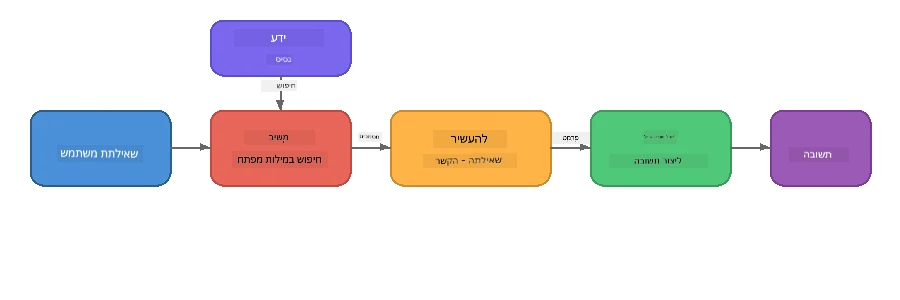

# חלק 4: בניית יישום RAG עם Foundry Local

## סקירה כללית

מודלים גדולים של שפה הם רבי עוצמה, אך הם יודעים רק מה שהיה בנתוני האימון שלהם. **יצירה מוגברת בהבאה (RAG)** פותרת זאת על ידי מתן הקשר רלוונטי למודל בזמן השאילתה - שנשלף מהמסמכים, מסדי הנתונים או מאגרי הידע שלך.

במכון עבודה זה תבנה צינור RAG שלם שמריץ **מונחה לחלוטין על המכשיר שלך** באמצעות Foundry Local. בלי שירותי ענן, בלי מסדי נתונים וקטוריים, בלי API של הטמעות - רק שליפה מקומית ודגם מקומי.

## מטרות למידה

בסיום מעבדה זו תוכל:

- להסביר מהו RAG ולמה הוא חשוב ליישומי בינה מלאכותית
- לבנות מאגר ידע מקומי מתוך מסמכי טקסט
- לממש פונקציית שליפה פשוטה למציאת הקשר רלוונטי
- להרכיב הנחיית מערכת שמבוססת על העובדות שנשלפו
- להריץ את כל צינור ה-Retrieve → Augment → Generate במכשיר
- להבין את הפשרות בין שליפת מילות מפתח פשוטה לחיפוש וקטורי

---

## דרישות מוקדמות

- השלמת [חלק 3: שימוש ב-Foundry Local SDK עם OpenAI](part3-sdk-and-apis.md)
- התקנת Foundry Local CLI והורדת דגם `phi-3.5-mini`

---

## מושג: מהו RAG?

בלי RAG, מודל LLM יכול רק לענות מתוך נתוני האימון שלו - שעלולים להיות מיושנים, לא שלמים או חסרים מידע פרטי שלך:

```
User: "What is Zava's return policy?"
LLM:  "I do not have information about Zava's return policy."  ← No context!
```
  
עם RAG, אתה **משלף** קודם מסמכים רלוונטיים, ואז **מaugments** את ההנחיה עם ההקשר הזה לפני **יצירת** התשובה:



התובנה המרכזית: **המודל לא חייב "לדעת" את התשובה; הוא רק צריך לקרוא את המסמכים הנכונים.**

---

## תרגילי מעבדה

### תרגיל 1: להבין את מאגר הידע

פתח את דוגמת RAG עבור שפתך וסקור את מאגר הידע:

<details>
<summary><b>🐍 פייתון: <code>python/foundry-local-rag.py</code></b></summary>

מאגר הידע הוא רשימה פשוטה של מילונים עם שדות `title` ו-`content`:

```python
KNOWLEDGE_BASE = [
    {
        "title": "Foundry Local Overview",
        "content": (
            "Foundry Local brings the power of Azure AI Foundry to your local "
            "device without requiring an Azure subscription..."
        ),
    },
    {
        "title": "Supported Hardware",
        "content": (
            "Foundry Local automatically selects the best model variant for "
            "your hardware. If you have an Nvidia CUDA GPU it downloads the "
            "CUDA-optimized model..."
        ),
    },
    # ... עוד ערכים
]
```
  
כל רשומה מייצגת "חתיכת" ידע ממוקדת בנושא אחד.

</details>

<details>
<summary><b>📘 JavaScript: <code>javascript/foundry-local-rag.mjs</code></b></summary>

מאגר הידע משתמש במבנה זהה כמערך של אובייקטים:

```javascript
const KNOWLEDGE_BASE = [
  {
    title: "Foundry Local Overview",
    content:
      "Foundry Local brings the power of Azure AI Foundry to your local " +
      "device without requiring an Azure subscription...",
  },
  {
    title: "Supported Hardware",
    content:
      "Foundry Local automatically selects the best model variant for " +
      "your hardware...",
  },
  // ... עוד רשומות
];
```
  
</details>

<details>
<summary><b>💜 C#: <code>csharp/RagPipeline.cs</code></b></summary>

מאגר הידע משתמש ברשימת טופלים בשם:

```csharp
private static readonly List<(string Title, string Content)> KnowledgeBase =
[
    ("Foundry Local Overview",
     "Foundry Local brings the power of Azure AI Foundry to your local " +
     "device without requiring an Azure subscription..."),

    ("Supported Hardware",
     "Foundry Local automatically selects the best model variant for " +
     "your hardware..."),

    // ... more entries
];
```
  
</details>

> **ביישום אמיתי**, מאגר הידע מגיע מקבצים בדיסק, מסד נתונים, אינדקס חיפוש או API. במעבדה זו אנו משתמשים ברשימה בזיכרון לשם פשטות.

---

### תרגיל 2: להבין את פונקציית השליפה

שלב השליפה מוצא את החתיכות הרלוונטיות ביותר לשאלה של המשתמש. בדוגמה זו משתמשים ב**חפיפה בין מילות מפתח** - סופרים כמה מילים בשאילתה מופיעות בכל חתיכה:

<details>
<summary><b>🐍 פייתון</b></summary>

```python
def retrieve(query: str, top_k: int = 2) -> list[dict]:
    """Return the top-k knowledge chunks most relevant to the query."""
    query_words = set(query.lower().split())
    scored = []
    for chunk in KNOWLEDGE_BASE:
        chunk_words = set(chunk["content"].lower().split())
        overlap = len(query_words & chunk_words)
        scored.append((overlap, chunk))
    scored.sort(key=lambda x: x[0], reverse=True)
    return [item[1] for item in scored[:top_k]]
```
  
</details>

<details>
<summary><b>📘 JavaScript</b></summary>

```javascript
function retrieve(query, topK = 2) {
  const queryWords = new Set(query.toLowerCase().split(/\s+/));
  const scored = KNOWLEDGE_BASE.map((chunk) => {
    const chunkWords = new Set(chunk.content.toLowerCase().split(/\s+/));
    let overlap = 0;
    for (const w of queryWords) {
      if (chunkWords.has(w)) overlap++;
    }
    return { overlap, chunk };
  });
  scored.sort((a, b) => b.overlap - a.overlap);
  return scored.slice(0, topK).map((s) => s.chunk);
}
```
  
</details>

<details>
<summary><b>💜 C#</b></summary>

```csharp
private static List<(string Title, string Content)> Retrieve(string query, int topK = 2)
{
    var queryWords = new HashSet<string>(
        query.ToLowerInvariant().Split(' ', StringSplitOptions.RemoveEmptyEntries));

    return KnowledgeBase
        .Select(chunk =>
        {
            var chunkWords = new HashSet<string>(
                chunk.Content.ToLowerInvariant().Split(' ', StringSplitOptions.RemoveEmptyEntries));
            var overlap = queryWords.Intersect(chunkWords).Count();
            return (Overlap: overlap, Chunk: chunk);
        })
        .OrderByDescending(x => x.Overlap)
        .Take(topK)
        .Select(x => x.Chunk)
        .ToList();
}
```
  
</details>

**איך זה עובד:**
1. מפצלים את השאילתה למילים בודדות  
2. עבור כל חתיכת ידע, סופרים כמה מילים מהשאילתה מופיעות בחתיכה  
3. ממיינים לפי ציון חפיפה (מקסימום ראשון)  
4. מחזירים את החתיכות הרלוונטיות ביותר (top-k)

> **פשרה:** חפיפת מילות מפתח היא פשוטה אך מוגבלת; היא אינה מבינה סינונימים או משמעות. מערכות RAG ייצור בדרך כלל משתמשות ב**וקטורי הטמעות** ו**מסד נתונים וקטורי** לחיפוש סמנטי. עם זאת, חפיפת מילות מפתח היא נקודת התחלה טובה ואינה דורשת תלויות נוספות.

---

### תרגיל 3: להבין את ההנחיה המועשרת

ההקשר שנשלף מוזן לתוך **הנחיית המערכת** לפני שליחתו למודל:

```python
system_prompt = (
    "You are a helpful assistant. Answer the user's question using ONLY "
    "the information provided in the context below. If the context does "
    "not contain enough information, say so.\n\n"
    f"Context:\n{context_text}"
)
```
  
החלטות מפתח בעיצוב:
- **"רק המידע שסופק"** - מונע מהמודל להזים עובדות שאינן בהקשר  
- **"אם ההקשר חסר מידע מספיק, אמור זאת"** - מעודד תשובות כנות "אני לא יודע"  
- ההקשר ממוקם בהודעת המערכת כדי לעצב את כל התגובות

---

### תרגיל 4: הרצת צינור ה-RAG

הרץ את הדוגמה השלמה:

**פייתון:**  
```bash
cd python
python foundry-local-rag.py
```
  
**JavaScript:**  
```bash
cd javascript
node foundry-local-rag.mjs
```
  
**C#:**  
```bash
cd csharp
dotnet run rag
```
  
עליך לראות שלוש תוצאות מודפסות:  
1. **השאלה** שנשאלת  
2. **ההקשר שנשלף** - החתיכות שנבחרו ממאגר הידע  
3. **התשובה** - שנוצרה על ידי המודל תוך שימוש רק בהקשר זה

פלט לדוגמה:  
```
Question: How do I install Foundry Local and what hardware does it support?

--- Retrieved Context ---
### Installation
On Windows install Foundry Local with: winget install Microsoft.FoundryLocal...

### Supported Hardware
Foundry Local automatically selects the best model variant for your hardware...
-------------------------

Answer: To install Foundry Local, you can use the following methods depending
on your operating system: On Windows, run `winget install Microsoft.FoundryLocal`.
On macOS, use `brew install microsoft/foundrylocal/foundrylocal`...
```
  
שים לב איך התשובה של המודל **מבוססת** על ההקשר שנשלף - היא מזכירה רק עובדות ממסמכי מאגר הידע.

---

### תרגיל 5: נסה והרחב

נסה את השינויים הבאים להעמקת ההבנה שלך:

1. **שנה את השאלה** - שאל משהו שקיים במאגר הידע לעומת משהו שלא:  
   ```python
   question = "What programming languages does Foundry Local support?"  # ← בהקשר
   question = "How much does Foundry Local cost?"                       # ← לא בהקשר
   ```
 האם המודל אומר נכון "אני לא יודע" כשאין תשובה בהקשר?

2. **הוסף חתיכת ידע חדשה** - הוסף רשומה חדשה ל-`KNOWLEDGE_BASE`:  
   ```python
   {
       "title": "Pricing",
       "content": "Foundry Local is completely free and open source under the MIT license.",
   }
   ```
 עכשיו שאל שוב את שאלת התמחור.

3. **שנה את `top_k`** - שלף יותר או פחות חתיכות:  
   ```python
   context_chunks = retrieve(question, top_k=3)  # יותר הקשר
   context_chunks = retrieve(question, top_k=1)  # פחות הקשר
   ```
 איך כמות ההקשר משפיעה על איכות התשובה?

4. **הסר את הוראת הייצוב** - שנה את הנחיית המערכת ל"אתה עוזר נדיב." וראה אם המודל מתחיל להזים עובדות.

---

## מבט מעמיק: אופטימיזציה של RAG לביצועים במכשיר

הרצת RAG במכשיר מציבה מגבלות שלא חווים בענן: זיכרון RAM מוגבל, אין GPU ייעודי (הרצה על CPU/NPU), וחלון הקשר קטן בדגם. החלטות העיצוב הבאות מתמודדות ישירות עם המגבלות ומבוססות על דפוסים מיישומי RAG מקומיים בסגנון פרודקשן שנבנו עם Foundry Local.

### אסטרטגיית פיצול: חלון חליק קבוע גודל

פיצול - כיצד מחלקים מסמכים לחתיכות - היא אחת ההחלטות המשפיעות ביותר במערכת RAG. בתרחישי מכשיר, **חלון חליק קבוע גודל עם חפיפה** הוא נקודת ההתחלה המומלצת:

| פרמטר | ערך מומלץ | למה |
|---------|-----------|-----|
| **גודל חתיכה** | ~200 טוקנים | שומר על הקשר קטן ומקומי, משאיר מקום בחלון ההקשר של Phi-3.5 Mini להנחיית המערכת, היסטוריית שיחה ותוצאה |
| **חפיפה** | ~25 טוקנים (12.5%) | מונע אובדן מידע בגבולות החתיכות - חשוב להוראות וצעדים מפורטים |
| **טוקניזציה** | פיצול לפי רווחים | בלי תלויות, לא דרושה ספריית טוקניזציה. כל תקציב המחשוב נשמר ל-LLM |

החפיפה פועלת כמו חלון מחליק: כל חתיכה חדשה מתחילה 25 טוקנים לפני סיום החתיכה הקודמת, כך ש משפטים החוצים גבולות חתיכה מופיעים בכל שתי החתיכות.

> **למה לא אסטרטגיות אחרות?**  
> - **פיצול לפי משפטים** מייצר גדלי חתיכות בלתי צפויים; חלק מהנהלים הם משפטים ארוכים שלא יתפצלו טוב  
> - **פיצול מודע לסעיפים** (כותרות `##`) מייצר חתיכות בגדלים משתנים מאוד - חלק קטן מדי, אחרים גדולים מדי לחלון ההקשר של המודל  
> - **פיצול סמנטי** (גילוי נושאים מבוסס הטמעות) נותן את איכות השליפה הטובה ביותר, אך דורש דגם שני בזיכרון לצד Phi-3.5 Mini - מסוכן בחומרה עם 8-16 GB זיכרון משותף

### שדרוג השליפה: וקטורי TF-IDF

שיטת חפיפת מילות המפתח במעבדה זו עובדת, אך אם תרצה שליפה טובה יותר בלי להוסיף דגם הטמעות, **TF-IDF (תדירות מונח-היפוכיות מסמך)** היא פתרון מצוין:

```
Keyword Overlap  →  TF-IDF Vectors  →  Embedding Models
    (this lab)     (lightweight upgrade)   (production)
  Simple & fast    Better ranking,         Best quality,
  No dependencies  still no ML model       requires embedding model
  ~Basic matching  ~1ms retrieval          ~100-500ms per query
```
  
TF-IDF ממיר כל חתיכה לווקטור מספרי המבוסס על חשיבות כל מילה בחתיכה *לעומת כל שאר החתיכות*. בזמן השאילתה, השאלה מועמדת בדרך דומה ומשווית באמצעות דמיון קוסינוס. ניתן לממש זאת עם SQLite ו-JavaScript/פייתון נקיים - ללא מסד נתונים וקטורי, ללא API הטמעות.

> **ביצועים:** דמיון קוסינוס TF-IDF על חתיכות בגודל קבוע בדרך כלל משיג **~1ms שליפה**, לעומת כ-100-500ms כשהדגם הטמעה מקודד כל שאילתה. כל 20+ מסמכים יכולים להתחלק ולהתאינדקס בפחות משנייה.

### מצב Edge/Compact למכשירים מוגבלים

בהרצה על חומרה מוגבלת מאוד (מחשבים ניידים ישנים, טאבלטים, מכשירי שדה), ניתן להפחית שימוש במשאבים על ידי צמצום שלושה פרמטרים:

| הגדרה | מצב סטנדרטי | מצב Edge/Compact |
|---------|--------------|-----------------|
| **הנחיית מערכת** | כ-300 טוקנים | כ-80 טוקנים |
| **מקסימום טוקני פלט** | 1024 | 512 |
| **חתיכות שלופות (top-k)** | 5 | 3 |

פחות חתיכות שלופות משמע פחות הקשר לעיבוד המודל, מה שמפחית השהייה ולחץ זיכרון. הנחיית מערכת קצרה משחררת מקום נוסף בחלון ההקשר לתשובה עצמה. פשרה זו שווה את זה במכשירים שכל טוקן בחלון ההקשר חשוב.

### דגם יחיד בזיכרון

אחד העקרונות החשובים להפעלת RAG במכשיר: **שמור רק דגם אחד טעון**. אם אתה משתמש בדגם הטמעות לשליפה *וגם* בדגם שפה ליצירה, אתה מחלק משאבי NPU/RAM מוגבלים בין שני דגמים. שליפה קלה (חפיפת מילות מפתח, TF-IDF) נמנעת מכך לגמרי:

- אין דגם הטמעות שמתחרה על זיכרון עם ה-LLM  
- התחלה קרה מהירה יותר - דגם אחד בלבד לטעינה  
- שימוש בזיכרון צפוי - ה-LLM מקבל את כל המשאבים הזמינים  
- עובד על מכונות עם 8 GB RAM בלבד

### SQLite כמאגר וקטורי מקומי

לאוספי מסמכים קטנים-בינוניים (מאות עד אלפים בודדים של חתיכות), **SQLite מהיר מספיק** לחיפוש דמיון קוסינוס בכוח גס ומוסיף אפס תשתית:

- קובץ `.db` יחיד בדיסק - ללא תהליך שרת, ללא תצורה  
- מצורף לכל סביבת ריצה עיקרית (Python `sqlite3`, Node.js `better-sqlite3`, .NET `Microsoft.Data.Sqlite`)  
- מאחסן חתיכות מסמכים לצד וקטורי TF-IDF בטבלה אחת  
- לא צריך Pinecone, Qdrant, Chroma או FAISS בקנה מידה זה

### סיכום ביצועים

החלטות עיצוב אלה משלבות לספק RAG תגובתי על חומרת צרכנים:

| מדד | ביצוע על המכשיר |
|-------|-----------------|
| **שהיית שליפה** | ~1ms (TF-IDF) עד ~5ms (חפיפת מילות מפתח) |
| **מהירות קליטה** | 20 מסמכים מחולקים ומואנדקסים בפחות משנייה |
| **דגמים בזיכרון** | 1 (רק LLM - בלי דגם הטמעות) |
| **שטף אחסון** | פחות מ-1 MB לחתיכות + וקטורים ב-SQLite |
| **התחלה קרה** | טעינת דגם יחיד, ללא אתחול ריצה של הטמעות |
| **חומרת מינימום** | 8 GB RAM, רק-CPU (ללא GPU דרוש) |

> **מתי לשדרג:** אם אתה מתרחב למאות מסמכים ארוכים, תוכן מעורב (טבלאות, קוד, פרוזה), או זקוק להבנה סמנטית של שאילתות, שקול להוסיף דגם הטמעות ולעבור לחיפוש דמיון וקטורי. ברוב מקרי השימוש על המכשיר עם אוסף מסמכים ממוקד, TF-IDF + SQLite מספק תוצאות מצוינות עם מינימום שימוש במשאבים.

---

## מושגים מרכזיים

| מושג | תיאור |
|---------|---------|
| **שליפה** | מציאת מסמכים רלוונטיים ממאגר ידע על בסיס השאילתה של המשתמש |
| **הגדלה** | הכנסת המסמכים שנשלפו לתוך ההנחיה כהקשר |
| **יצירה** | המודל מייצר תשובה המבוססת על ההקשר שסופק |
| **פיצול לחתיכות** | חלוקת מסמכים גדולים לחתיכות קטנות וממוקדות |
| **ייצוב** | הגבלת המודל לשימוש רק בהקשר שסופק (מפחית הזיות) |
| **top-k** | מספר החתיכות הרלוונטיות ביותר שנשלפות |

---

## RAG בפרודקשן לעומת המעבדה הזו

| אספקט | מעבדה זו | אופטימיזציה למכשיר | פרודקשן ענן |
|---------|----------|--------------------|--------------|
| **מאגר ידע** | ברשימת זיכרון | קבצים בדיסק, SQLite | מסד נתונים, אינדקס חיפוש |
| **שליפה** | חפיפת מילות מפתח | TF-IDF + דמיון קוסינוס | הטמעות וקטוריות + חיפוש דמיון |
| **הטמעות** | לא דרוש | לא דרוש - וקטורי TF-IDF | דגם הטמעות (מקומי או בענן) |
| **מאגר וקטורים** | לא דרוש | SQLite (קובץ `.db` יחיד) | FAISS, Chroma, Azure AI Search, וכו' |
| **פיצול לחתיכות** | ידני | חלון מחליק בגודל קבוע (~200 טוקנים, חפיפה 25 טוקנים) | פיצול סמנטי או רקורסיבי |
| **דגמים בזיכרון** | 1 (LLM) | 1 (LLM) | 2+ (הטמעות + LLM) |
| **זמן אחזור** | ~5ms | ~1ms | ~100-500ms |
| **קנה מידה** | 5 מסמכים | מאות מסמכים | מיליוני מסמכים |

התבניות שאתם לומדים כאן (אחזור, העשרה, יצירה) הן אותן תבניות בכל קנה מידה. שיטת האחזור משתפרת, אך הארכיטקטורה הכוללת נשארת זהה. העמודה האמצעית מציגה מה שניתן להשיג במכשיר עם טכניקות קלות, לעתים הנקודה המתוקה עבור יישומים מקומיים בהם אתם מחליפים קנה מידה ענני בפרטיות, יכולת ללא חיבור לרשת ואפס זמן השהייה לשירותים חיצוניים.

---

## נקודות מפתח

| מושג | מה שלמדתם |
|---------|------------------|
| תבנית RAG | אחזור + העשרה + יצירה: ספקו למודל את ההקשר הנכון והוא יוכל לענות על שאלות לגבי הנתונים שלכם |
| על המכשיר | הכל פועל באופן מקומי ללא API ענן או מנויים למסד נתונים וקטורי |
| הוראות עיגון | מגבלות פקודת המערכת קריטיות למניעת הזיות |
| חפיפת מילים מפתח | נקודת התחלה פשוטה אך יעילה לאחזור |
| TF-IDF + SQLite | דרך שדרוג קלה שמשמרת אחזור מתחת ל-1ms ללא שימוש במודל הטמעה |
| מודל אחד בזיכרון | הימנעו מטעינת מודל הטמעה לצד LLM בחומרה מוגבלת |
| גודל קטע | כ-200 טוקנים עם חפיפה מאזנת בין דיוק האחזור ליעילות חלון ההקשר |
| מצב Edge/קומפקטי | השתמשו בפחות קטעים ובפקודות קצרות יותר למכשירים מוגבלים מאוד |
| תבנית אוניברסלית | ארכיטקטורת RAG זהה עובדת עם כל מקור נתונים: מסמכים, מסדי נתונים, APIs או ויקי |

> **רוצים לראות יישום RAG מלא על המכשיר?** בדקו את [Gas Field Local RAG](https://github.com/leestott/local-rag), סוכן RAG אופליין בסגנון ייצור שנבנה עם Foundry Local ו-Phi-3.5 Mini ומדגים את תבניות האופטימיזציה האלה עם מערכת מסמכים אמיתית.

---

## שלבים הבאים

המשיכו ל[חלק 5: בניית סוכני AI](part5-single-agents.md) כדי ללמוד כיצד לבנות סוכנים אינטליגנטים עם פרסונות, הוראות ושיחות מרובות סבבים באמצעות Microsoft Agent Framework.