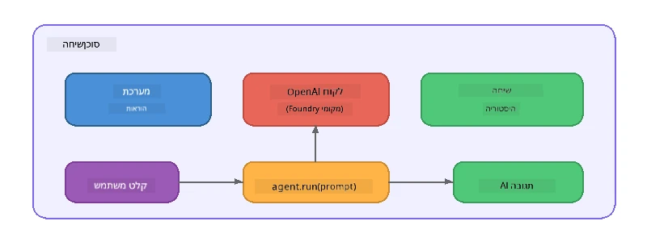

# חלק 5: בניית סוכני AI עם מסגרת הסוכן

> **מטרה:** בנה את סוכן ה-AI הראשון שלך עם הוראות מתמשכות ופרסונה מוגדרת, המופעל על ידי מודל מקומי דרך Foundry Local.

## מהו סוכן AI?

סוכן AI עוטף מודל שפה עם **הוראות מערכת** שמגדירות את ההתנהגות, האישיות והמגבלות שלו. בניגוד לקריאת השלמת שיחה בודדת, סוכן מספק:

- **פרסונה** - זהות עקבית ("אתה בודק קוד עוזר")
- **זיכרון** - היסטוריית שיחות לאורך סבבים
- **התמחות** - התנהגות ממוקדת מונעת על ידי הוראות מתוכננות היטב



---

## מסגרת הסוכן של מיקרוסופט

**מסגרת הסוכן של מיקרוסופט** (AGF) מספקת הפשטת סוכן סטנדרטית שעובדת על פני ממשקי מודל שונים. בסדנה זו אנחנו משלבים אותה עם Foundry Local כך שהכל מתבצע על המחשב שלך - ללא ענן נדרש.

| מושג | תיאור |
|---------|-------------|
| `FoundryLocalClient` | פייתון: מנהל הפעלת השירות, הורדה/טעינת מודל, ויוצר סוכנים |
| `client.as_agent()` | פייתון: יוצר סוכן מלקוח Foundry Local |
| `AsAIAgent()` | C#: שיטת הרחבה על `ChatClient` - יוצר `AIAgent` |
| `instructions` | טקסט מערכת שמעצבת את התנהגות הסוכן |
| `name` | תווית קריאה לאדם, שימושית בתרחישי ריבוי סוכנים |
| `agent.run(prompt)` / `RunAsync()` | שולח הודעת משתמש ומחזיר את תגובת הסוכן |

> **הערה:** למסגרת הסוכן יש ערכת פיתוח ב-Python וב-.NET. עבור JavaScript, יישמנו מחלקת `ChatAgent` קלה שמדמה את אותו דפוס באמצעות ה-SDK של OpenAI ישירות.

---

## תרגילים

### תרגיל 1 - הבנת דפוס הסוכן

לפני כתיבת קוד, למד את הרכיבים המרכזיים של סוכן:

1. **לקוח מודל** - מתחבר ל-API תואם OpenAI של Foundry Local
2. **הוראות מערכת** - פרומפט "אישיות"
3. **לולאת ריצה** - שליחת קלט משתמש, קבלת פלט

> **חשוב על זה:** כיצד הוראות מערכת שונות מהודעת משתמש רגילה? מה קורה אם תשנה אותן?

---

### תרגיל 2 - הרצת דוגמת סוכן יחיד

<details>
<summary><strong>🐍 פייתון</strong></summary>

**דרישות מוקדמות:**
```bash
cd python
python -m venv venv

# Windows (PowerShell):
venv\Scripts\Activate.ps1
# macOS:
source venv/bin/activate

pip install -r requirements.txt
```

**הרצה:**
```bash
python foundry-local-with-agf.py
```

**הליכה דרך הקוד** (`python/foundry-local-with-agf.py`):

```python
import asyncio
from agent_framework_foundry_local import FoundryLocalClient

async def main():
    alias = "phi-4-mini"

    # מפעיל אתחול שירות, הורדת מודל וטעינה ב-FoundryLocalClient
    client = FoundryLocalClient(model_id=alias)
    print(f"Client Model ID: {client.model_id}")

    # צור סוכן עם הנחיות מערכת
    agent = client.as_agent(
        name="Joker",
        instructions="You are good at telling jokes.",
    )

    # לא בשידור: קבל את התשובה המלאה בבת אחת
    result = await agent.run("Tell me a joke about a pirate.")
    print(f"Agent: {result}")

    # בשידור: קבל תוצאות בזמן שהן מיוצרות
    async for chunk in agent.run("Tell me another joke.", stream=True):
        if chunk.text:
            print(chunk.text, end="", flush=True)

asyncio.run(main())
```

**נקודות מפתח:**
- `FoundryLocalClient(model_id=alias)` מנהל הפעלת שירות, הורדה וטעינת מודל בשלב אחד
- `client.as_agent()` יוצר סוכן עם הוראות מערכת ושם
- `agent.run()` תומך גם במצב לא זורם וגם במצב סטרימינג
- התקנה דרך `pip install agent-framework-foundry-local --pre`

</details>

<details>
<summary><strong>📦 JavaScript</strong></summary>

**דרישות מוקדמות:**
```bash
cd javascript
npm install
```

**הרצה:**
```bash
node foundry-local-with-agent.mjs
```

**הליכה דרך הקוד** (`javascript/foundry-local-with-agent.mjs`):

```javascript
import { OpenAI } from "openai";
import { FoundryLocalManager } from "foundry-local-sdk";

class ChatAgent {
  constructor({ client, modelId, instructions, name }) {
    this.client = client;
    this.modelId = modelId;
    this.instructions = instructions;
    this.name = name;
    this.history = [];
  }

  async run(userMessage) {
    const messages = [
      { role: "system", content: this.instructions },
      ...this.history,
      { role: "user", content: userMessage },
    ];
    const response = await this.client.chat.completions.create({
      model: this.modelId,
      messages,
    });
    const assistantMessage = response.choices[0].message.content;

    // לשמור היסטוריית שיחות לאינטראקציות מרובות סבבים
    this.history.push({ role: "user", content: userMessage });
    this.history.push({ role: "assistant", content: assistantMessage });
    return { text: assistantMessage };
  }
}

async function main() {
  FoundryLocalManager.create({ appName: "FoundryLocalWorkshop" });
  const manager = FoundryLocalManager.instance;
  await manager.startWebService();

  const catalog = manager.catalog;
  const model = await catalog.getModel("phi-3.5-mini");
  if (!model.isCached) {
    console.log("Downloading model: phi-3.5-mini...");
    await model.download();
  }
  await model.load();

  const client = new OpenAI({
    baseURL: manager.urls[0] + "/v1",
    apiKey: "foundry-local",
  });

  const agent = new ChatAgent({
    client,
    modelId: model.id,
    instructions: "You are good at telling jokes.",
    name: "Joker",
  });

  const result = await agent.run("Tell me a joke about a pirate.");
  console.log(result.text);
}

main();
```

**נקודות מפתח:**
- JavaScript בונה מחלקת `ChatAgent` משל עצמה המדמה את דפוס AGF בפייתון
- `this.history` מאחסן סבבי שיחה לתמיכה ברב-סבב
- `startWebService()` מפורש → בדיקת מטמון → `model.download()` → `model.load()` לסינון מושלם

</details>

<details>
<summary><strong>💜 C#</strong></summary>

**דרישות מוקדמות:**
```bash
cd csharp
dotnet restore
```

**הרצה:**
```bash
dotnet run agent
```

**הליכה דרך הקוד** (`csharp/SingleAgent.cs`):

```csharp
using Microsoft.AI.Foundry.Local;
using Microsoft.Extensions.Logging.Abstractions;
using Microsoft.Agents.AI;
using OpenAI;
using System.ClientModel;

// 1. Start Foundry Local and load a model
var alias = "phi-3.5-mini";
await FoundryLocalManager.CreateAsync(
    new Configuration
    {
        AppName = "FoundryLocalSamples",
        Web = new Configuration.WebService { Urls = "http://127.0.0.1:0" }
    }, NullLogger.Instance, default);
var manager = FoundryLocalManager.Instance;
await manager.StartWebServiceAsync(default);

var catalog = await manager.GetCatalogAsync(default);
var model = await catalog.GetModelAsync(alias, default);

var isCached = await model.IsCachedAsync(default);
if (!isCached)
{
    Console.WriteLine($"Downloading model: {alias}...");
    await model.DownloadAsync(null, default);
}
await model.LoadAsync(default);

var key = new ApiKeyCredential("foundry-local");
var client = new OpenAIClient(key, new OpenAIClientOptions
{
    Endpoint = new Uri(manager.Urls[0] + "/v1")
});

// 2. Create an AIAgent using the Agent Framework extension method
AIAgent joker = client
    .GetChatClient(model.Id)
    .AsAIAgent(
        instructions: "You are good at telling jokes. Keep your jokes short and family-friendly.",
        name: "Joker"
    );

// 3. Run the agent (non-streaming)
var response = await joker.RunAsync("Tell me a joke about a pirate.");
Console.WriteLine($"Joker: {response}");

// 4. Run with streaming
await foreach (var update in joker.RunStreamingAsync("Tell me another joke."))
{
    Console.Write(update);
}
```

**נקודות מפתח:**
- `AsAIAgent()` היא שיטת הרחבה מ-`Microsoft.Agents.AI.OpenAI` - אין צורך במחלקת `ChatAgent` מותאמת אישית
- `RunAsync()` מחזיר את התגובה המלאה; `RunStreamingAsync()` משדר טוקן אחר טוקן
- התקנה דרך `dotnet add package Microsoft.Agents.AI.OpenAI --version 1.0.0-rc3`

</details>

---

### תרגיל 3 - שינוי הפרסונה

שנה את ה-`instructions` של הסוכן כדי ליצור פרסונה שונה. נסה כל אחת וראה כיצד הפלט משתנה:

| פרסונה | הוראות |
|---------|-------------|
| בודק קוד | `"אתה בודק קוד מומחה. מספק משוב בונה ממוקד בקריאות, ביצועים ונכונות."` |
| מדריך טיולים | `"אתה מדריך טיולים ידידותי. נותן המלצות מותאמות אישית ליעדים, פעילויות ומטבח מקומי."` |
| מורה סוקרטי | `"אתה מורה סוקרטי. לעולם לא נותן תשובות ישירות - במקום זאת, מדריך את התלמיד בשאלות מעמיקות."` |
| כותב טכני | `"אתה כותב טכני. מסביר מושגים בצורה ברורה ותמציתית. משתמש בדוגמאות. נמנע מז'רגון."` |

**נסה זאת:**
1. בחר פרסונה מהטבלה למעלה
2. החלף את מחרוזת ה-`instructions` בקוד
3. התאם את הפרומפט למשתמש (למשל בקש מהבודק קוד לבדוק פונקציה)
4. הרץ את הדוגמה שוב והשווה את הפלט

> **טיפ:** איכות הסוכן תלויה מאוד בהוראות. הוראות ספציפיות ומבוססות מייצרות תוצאות טובות יותר מאשר הוראות מעורפלות.

---

### תרגיל 4 - הוסף שיחת רב-סבבית

הרחב את הדוגמה לתמיכה בלולאת שיחה רב-סבבית כך שתוכל לנהל שיחה דו-כיוונית עם הסוכן.

<details>
<summary><strong>🐍 פייתון - לולאת רב-סבבית</strong></summary>

```python
import asyncio
from agent_framework_foundry_local import FoundryLocalClient

async def main():
    client = FoundryLocalClient(model_id="phi-4-mini")

    agent = client.as_agent(
        name="Assistant",
        instructions="You are a helpful assistant.",
    )

    print("Chat with the agent (type 'quit' to exit):\n")
    while True:
        user_input = input("You: ")
        if user_input.strip().lower() in ("quit", "exit"):
            break
        result = await agent.run(user_input)
        print(f"Agent: {result}\n")

asyncio.run(main())
```

</details>

<details>
<summary><strong>📦 JavaScript - לולאת רב-סבבית</strong></summary>

```javascript
import { OpenAI } from "openai";
import { FoundryLocalManager } from "foundry-local-sdk";
import * as readline from "node:readline/promises";

// (שימוש חוזר במחלקת ChatAgent מתוך תרגיל 2)

async function main() {
  FoundryLocalManager.create({ appName: "FoundryLocalWorkshop" });
  const manager = FoundryLocalManager.instance;
  await manager.startWebService();

  const catalog = manager.catalog;
  const model = await catalog.getModel("phi-3.5-mini");
  if (!model.isCached) {
    console.log("Downloading model: phi-3.5-mini...");
    await model.download();
  }
  await model.load();

  const client = new OpenAI({
    baseURL: manager.urls[0] + "/v1",
    apiKey: "foundry-local",
  });

  const agent = new ChatAgent({
    client,
    modelId: model.id,
    instructions: "You are a helpful assistant.",
    name: "Assistant",
  });

  const rl = readline.createInterface({
    input: process.stdin,
    output: process.stdout,
  });

  console.log("Chat with the agent (type 'quit' to exit):\n");
  while (true) {
    const userInput = await rl.question("You: ");
    if (["quit", "exit"].includes(userInput.trim().toLowerCase())) break;
    const result = await agent.run(userInput);
    console.log(`Agent: ${result.text}\n`);
  }
  rl.close();
}

main();
```

</details>

<details>
<summary><strong>💜 C# - לולאת רב-סבבית</strong></summary>

```csharp
using Microsoft.AI.Foundry.Local;
using Microsoft.Extensions.Logging.Abstractions;
using Microsoft.Agents.AI;
using OpenAI;
using System.ClientModel;

var alias = "phi-3.5-mini";
var config = new Configuration
{
    AppName = "FoundryLocalSamples",
    Web = new Configuration.WebService { Urls = "http://127.0.0.1:0" }
};
await FoundryLocalManager.CreateAsync(config, NullLogger.Instance, default);
var manager = FoundryLocalManager.Instance;
await manager.StartWebServiceAsync(default);

var catalog = await manager.GetCatalogAsync(default);
var model = await catalog.GetModelAsync(alias, default);

var isCached = await model.IsCachedAsync(default);
if (!isCached)
{
    Console.WriteLine($"Downloading model: {alias}...");
    await model.DownloadAsync(null, default);
}
await model.LoadAsync(default);

var key = new ApiKeyCredential("foundry-local");
var client = new OpenAIClient(key, new OpenAIClientOptions
{
    Endpoint = new Uri(manager.Urls[0] + "/v1")
});

AIAgent agent = client
    .GetChatClient(model.Id)
    .AsAIAgent(
        instructions: "You are a helpful assistant.",
        name: "Assistant"
    );

Console.WriteLine("Chat with the agent (type 'quit' to exit):\n");
while (true)
{
    Console.Write("You: ");
    var userInput = Console.ReadLine();
    if (string.IsNullOrWhiteSpace(userInput) ||
        userInput.Equals("quit", StringComparison.OrdinalIgnoreCase) ||
        userInput.Equals("exit", StringComparison.OrdinalIgnoreCase))
        break;

    var result = await agent.RunAsync(userInput);
    Console.WriteLine($"Agent: {result}\n");
}
```

</details>

שים לב כיצד הסוכן זוכר סבבים קודמים - שאל שאלה המשך וראה את ההקשר שנמשך.

---

### תרגיל 5 - פלט מובנה

הנחה לסוכן תמיד להשיב בפורמט מסוים (למשל JSON) ופרס את התוצאה:

<details>
<summary><strong>🐍 פייתון - פלט JSON</strong></summary>

```python
import asyncio
import json
from agent_framework_foundry_local import FoundryLocalClient

async def main():
    client = FoundryLocalClient(model_id="phi-4-mini")

    agent = client.as_agent(
        name="SentimentAnalyzer",
        instructions=(
            "You are a sentiment analysis agent. "
            "For every user message, respond ONLY with valid JSON in this format: "
            '{"sentiment": "positive|negative|neutral", "confidence": 0.0-1.0, "summary": "brief reason"}'
        ),
    )

    result = await agent.run("I absolutely loved the new restaurant downtown!")
    print("Raw:", result)

    try:
        parsed = json.loads(str(result))
        print(f"Sentiment: {parsed['sentiment']} (confidence: {parsed['confidence']})")
    except json.JSONDecodeError:
        print("Agent did not return valid JSON - try refining the instructions.")

asyncio.run(main())
```

</details>

<details>
<summary><strong>💜 C# - פלט JSON</strong></summary>

```csharp
using System.Text.Json;

AIAgent analyzer = chatClient.AsAIAgent(
    name: "SentimentAnalyzer",
    instructions:
        "You are a sentiment analysis agent. " +
        "For every user message, respond ONLY with valid JSON in this format: " +
        "{\"sentiment\": \"positive|negative|neutral\", \"confidence\": 0.0-1.0, \"summary\": \"brief reason\"}"
);

var response = await analyzer.RunAsync("I absolutely loved the new restaurant downtown!");
Console.WriteLine($"Raw: {response}");

try
{
    var parsed = JsonSerializer.Deserialize<JsonElement>(response.ToString());
    Console.WriteLine($"Sentiment: {parsed.GetProperty("sentiment")} " +
                      $"(confidence: {parsed.GetProperty("confidence")})");
}
catch (JsonException)
{
    Console.WriteLine("Agent did not return valid JSON - try refining the instructions.");
}
```

</details>

> **הערה:** מודלים מקומיים קטנים עשויים לא תמיד לייצר JSON תקף לחלוטין. ניתן לשפר את האמינות על ידי הוספת דוגמה בהוראות והיות מפורש מאוד לגבי הפורמט המצופה.

---

## נקודות מפתח

| מושג | מה שלמדת |
|---------|-----------------|
| סוכן לעומת קריאת LLM גולמית | סוכן עוטף מודל עם הוראות וזיכרון |
| הוראות מערכת | המנוף החשוב ביותר לשליטה בהתנהגות הסוכן |
| שיחת רב-סבבית | סוכנים יכולים לשאת הקשר על פני מספר אינטראקציות משתמש |
| פלט מובנה | הוראות יכולות לכפות פורמט פלט (JSON, markdown וכו') |
| הרצה מקומית | הכל פועל במכשיר באמצעות Foundry Local - ללא ענן נדרש |

---

## השלבים הבאים

ב-**[חלק 6: תהליכי עבודה ריבוי-סוכנים](part6-multi-agent-workflows.md)**, תחבר מספר סוכנים לצינור מתואם שבו לכל סוכן תפקיד מומחה.