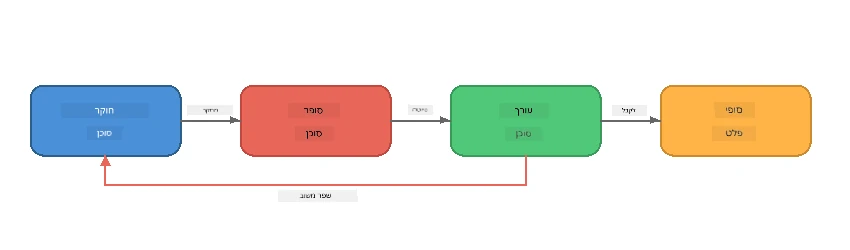
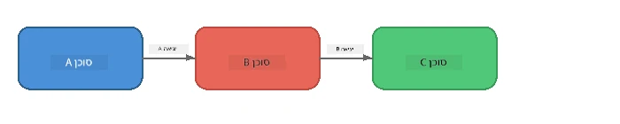
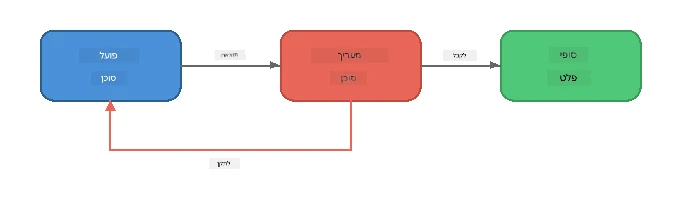
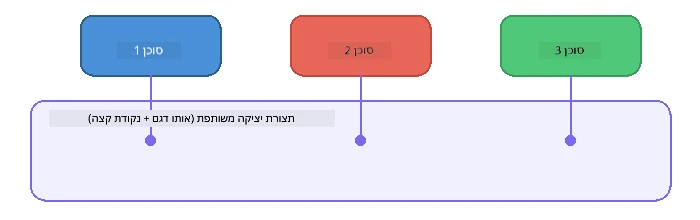

# חלק 6: זרימות עבודה מרובות-סוכנים

> **מטרה:** לשלב סוכנים מקצועיים מרובים לצינורות מתואמים שמחלקים משימות מורכבות בין סוכנים משתפי פעולה - הכל מתבצע באופן מקומי עם Foundry Local.

## למה מרובי סוכנים?

סוכן יחיד יכול להתמודד עם משימות רבות, אך זרימות עבודה מורכבות נהנות מ-**התמקצעות**. במקום שסוכן אחד ינסה לחקור, לכתוב ולערוך בו זמנית, מפצלים את העבודה לתפקידים ממוקדים:



| תבנית | תיאור |
|---------|-------------|
| **רציף** | פלט של סוכן A מוזן לסוכן B → סוכן C |
| **לולאת משוב** | סוכן מעריך יכול לשלוח עבודה בחזרה לתיקון |
| **הקשר משותף** | כל הסוכנים משתמשים באותו מודל/נקודה סופית, אך עם הוראות שונות |
| **פלט מסוגנן** | הסוכנים מייצרים תוצאות מובנות (JSON) להעברות אמינות |

---

## תרגילים

### תרגיל 1 - הרץ את צינור מרובה-סוכנים

הסדנה כוללת זרימת עבודה מלאה של חוקר → כותב → עורך.

<details>
<summary><strong>🐍 Python</strong></summary>

**הגדרה:**
```bash
cd python
python -m venv venv

# ווינדוס (PowerShell):
venv\Scripts\Activate.ps1
# מק או אס:
source venv/bin/activate

pip install -r requirements.txt
```

**הרצה:**
```bash
python foundry-local-multi-agent.py
```

**מה קורה:**
1. **החוקר** מקבל נושא ומחזיר נקודות מידע
2. **הכותב** לוקח את המחקר ומנסח פוסט בלוג (3-4 פסקאות)
3. **העורך** בוחן את המאמר לאיכות ומחזיר אישור או תיקון

</details>

<details>
<summary><strong>📦 JavaScript</strong></summary>

**הגדרה:**
```bash
cd javascript
npm install
```

**הרצה:**
```bash
node foundry-local-multi-agent.mjs
```

**אותו צינור בשלושה שלבים** - חוקר → כותב → עורך.

</details>

<details>
<summary><strong>💜 C#</strong></summary>

**הגדרה:**
```bash
cd csharp
dotnet restore
```

**הרצה:**
```bash
dotnet run multi
```

**אותו צינור בשלושה שלבים** - חוקר → כותב → עורך.

</details>

---

### תרגיל 2 - אנטומיית הצינור

למד כיצד הסוכנים מוגדרים ומחוברים:

**1. לקוח מודל משותף**

כל הסוכנים משתמשים באותו מודל Foundry Local:

```python
# Python - FoundryLocalClient מטפל בכל ההיבטים
from agent_framework_foundry_local import FoundryLocalClient

client = FoundryLocalClient(model_id="phi-3.5-mini")
```

```javascript
// JavaScript - ערכת פיתוח OpenAI המכוונת ל-Foundry Local
const client = new OpenAI({
  baseURL: manager.urls[0] + "/v1",
  apiKey: "foundry-local",
});
```

```csharp
// C# - OpenAIClient pointed at Foundry Local
var key = new ApiKeyCredential("foundry-local");
var client = new OpenAIClient(key, new OpenAIClientOptions
{
    Endpoint = new Uri(manager.Urls[0] + "/v1")
});
var chatClient = client.GetChatClient(model.Id);
```

**2. הוראות מתמחות**

לכל סוכן יש אישיות מובחנת:

| סוכן | הוראות (תקציר) |
|-------|----------------------|
| חוקר | "ספק עובדות מרכזיות, נתונים וסקירה כללית. ארגן כנקודות בולטות." |
| כותב | "כתוב פוסט בלוג מרתק (3-4 פסקאות) מתוך הערות המחקר. אל תמציא עובדות." |
| עורך | "בחן בהירות, דקדוק ועקביות עובדתית. פסק דין: אישור או תיקון." |

**3. זרימות נתונים בין סוכנים**

```python
# שלב 1 - הפלט מהחוקר הופך לקלט עבור הכותב
research_result = await researcher.run(f"Research: {topic}")

# שלב 2 - הפלט מהכותב הופך לקלט עבור העורך
writer_result = await writer.run(f"Write using:\n{research_result}")

# שלב 3 - העורך בוחן גם את המחקר וגם את המאמר
editor_result = await editor.run(
    f"Research:\n{research_result}\n\nArticle:\n{writer_result}"
)
```

```csharp
// C# - same pattern, async calls with AIAgent
var researchNotes = await researcher.RunAsync(
    $"Research the following topic and provide key facts:\n{topic}");

var draft = await writer.RunAsync(
    $"Write a blog post based on these research notes:\n\n{researchNotes}");

var verdict = await editor.RunAsync(
    $"Review this article for quality and accuracy.\n\n" +
    $"Research notes:\n{researchNotes}\n\n" +
    $"Article:\n{draft}");
```

> **תובנה מרכזית:** כל סוכן מקבל את ההקשר המצטבר מהסוכנים הקודמים. העורך רואה גם את המחקר המקורי וגם את הטיוטה - מה שמאפשר לו לבדוק עקביות עובדתית.

---

### תרגיל 3 - הוסף סוכן רביעי

הרחב את הצינור עם סוכן נוסף. בחר אחד:

| סוכן | מטרה | הוראות |
|-------|---------|-------------|
| **בודק עובדות** | אמת טענות במאמר | `"אתה מאמת טענות עובדתיות. עבור כל טענה, ציין האם היא נתמכת על ידי הערות המחקר. החזר JSON עם פריטים מאומתים/לא מאומתים."` |
| **כותב כותרות** | יצירת כותרות מושכות | `"צור 5 אפשרויות כותרת למאמר. גוון בסגנונות: אינפורמטיבי, פיתיון קליקים, שאלה, רשימה, רגשי."` |
| **רשתות חברתיות** | יצירת פוסטים לקידום | `"צור 3 פוסטים לרשתות חברתיות לקידום המאמר: אחד לטוויטר (280 תווים), אחד ללינקדאין (טון מקצועי), אחד לאינסטגרם (קז׳ואל עם הצעות אימוג׳י)."` |

<details>
<summary><strong>🐍 Python - הוספת כותב כותרות</strong></summary>

```python
headline_agent = client.as_agent(
    name="HeadlineWriter",
    instructions=(
        "You are a headline specialist. Given an article, generate exactly "
        "5 headline options. Vary the style: informative, question-based, "
        "listicle, emotional, and provocative. Return them as a numbered list."
    ),
)

# לאחר שהעורך מאשר, ליצור כותרות
headline_result = await headline_agent.run(
    f"Generate headlines for this article:\n\n{writer_result}"
)
print(f"\n--- Headlines ---\n{headline_result}")
```

</details>

<details>
<summary><strong>📦 JavaScript - הוספת כותב כותרות</strong></summary>

```javascript
const headlineAgent = new ChatAgent({
  client,
  modelId: modelInfo.id,
  instructions:
    "You are a headline specialist. Given an article, generate exactly " +
    "5 headline options. Vary the style: informative, question-based, " +
    "listicle, emotional, and provocative. Return them as a numbered list.",
  name: "HeadlineWriter",
});

const headlineResult = await headlineAgent.run(
  `Generate headlines for this article:\n\n${writerResult.text}`
);
console.log(`\n--- Headlines ---\n${headlineResult.text}`);
```

</details>

<details>
<summary><strong>💜 C# - הוספת כותב כותרות</strong></summary>

```csharp
AIAgent headlineAgent = chatClient.AsAIAgent(
    name: "HeadlineWriter",
    instructions:
        "You are a headline specialist. Given an article, generate exactly " +
        "5 headline options. Vary the style: informative, question-based, " +
        "listicle, emotional, and provocative. Return them as a numbered list."
);

// After the editor accepts, generate headlines
var headlines = await headlineAgent.RunAsync(
    $"Generate headlines for this article:\n\n{draft}");
Console.WriteLine($"\n--- Headlines ---\n{headlines}");
```

</details>

---

### תרגיל 4 - עצב את זרימת העבודה שלך

עצב צינור מרובה-סוכנים לתחום שונה. הנה כמה רעיונות:

| תחום | סוכנים | זרימה |
|--------|--------|------|
| **סקירת קוד** | מנתח → בוחן → מסכּם | ניתוח מבנה קוד → סקירת בעיות → הפקת דוח סיכום |
| **תמיכת לקוחות** | מסווג → מגיב → בקרת איכות | סיווג כרטיס → ניסוח תגובה → בדיקת איכות |
| **חינוך** | יוצר מבחנים → מדמה תלמיד → מדרג | יצירת מבחן → סימולציה של תשובות → דירוג והסבר |
| **ניתוח נתונים** | מפרש → מנתח → מדווח | פרש בקשת נתונים → ניתוח דפוסים → כתיבת דוח |

**שלבים:**
1. הגדר 3+ סוכנים עם `הוראות` מובחנות
2. החליט על זרימת הנתונים - מה כל סוכן מקבל ומפיק?
3. מימש את הצינור לפי התבניות מתרגילים 1-3
4. הוסף לולאת משוב אם סוכן אחד צריך להעריך עבודה של אחר

---

## תבניות תזמור

הנה תבניות תזמור החלות על כל מערכת מרובת סוכנים (מפורט ב-[חלק 7](part7-zava-creative-writer.md)):

### צינור רציף



כל סוכן מעבד את הפלט של קודמו. פשוט וניבא.

### לולאת משוב



סוכן מעריך יכול להפעיל ביצוע מחודש של שלבים מוקדמים. זבה רייטר משתמש בזה: העורך יכול לשלוח משוב חזרה לחוקר ולקטב.

### הקשר משותף



כל הסוכנים משתמשים באותו `foundry_config` ולכן באותו מודל ונקודה סופית.

---

## נקודות מפתח

| מושג | מה למדת |
|---------|-----------------|
| התמקצעות סוכן | כל סוכן עושה דבר אחד היטב עם הוראות ממוקדות |
| העברות נתונים | פלט מסוכן אחד הופך לקלט של הבא |
| לולאות משוב | מעריך יכול להפעיל נסיונות חוזרים לאיכות גבוהה יותר |
| פלט מובנה | תגובות מעוצבות JSON מאפשרות תקשורת אמינה בין סוכנים |
| תזמור | מתאם מנהל את רצף הצינור וטיפול בשגיאות |
| תבניות הפקה | מיושמות ב-[חלק 7: זבה רייטר קריאייטיב](part7-zava-creative-writer.md) |

---

## השלבים הבאים

המשך ל[חלק 7: זבה רייטר קריאייטיב - יישום פרויקט גמר](part7-zava-creative-writer.md) כדי לחקור אפליקציית מרובי-סוכנים בסגנון הפקה עם 4 סוכנים מתמחים, פלט זורם, חיפוש מוצר ולולאות משוב - זמינים בפייתון, ג'אווהסקריפט ו-C#.