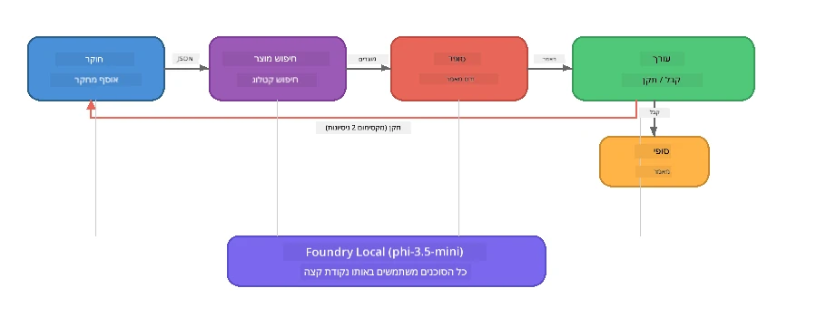

# חלק 7: Zava Creative Writer - אפליקציית שיא

> **מטרה:** לחקור אפליקציית רב-סוכנים בסגנון ייצור שבה ארבעה סוכנים מתמחים משתפים פעולה ליצירת מאמרים באיכות מגזין עבור Zava Retail DIY - הפועלת במלואה במכשיר שלך עם Foundry Local.

זו מעבדת **שיא** של הסדנה. היא מאחדת את כל מה שלמדת - שילוב SDK (חלק 3), שליפה מנתונים מקומיים (חלק 4), פרסונות סוכן (חלק 5), ותזמור רב-סוכני (חלק 6) - לאפליקציה מלאה הזמינה ב-**Python**, **JavaScript**, ו-**C#**.

---

## מה תחקור

| מושג | היכן ב-Zava Writer |
|---------|----------------------------|
| טעינת מודל ב-4 שלבים | מודול конфיג משותף מאתחל את Foundry Local |
| שליפת RAG-style | סוכן מוצר מחפש בקטלוג מקומי |
| התמחות סוכן | 4 סוכנים עם פרומפטים מערכתיים מובחנים |
| פלט סטרימינג | הכותב מייצר טוקנים בזמן אמת |
| העברות מובנות | חוקר → JSON, עורך → החלטת JSON |
| לולאות משוב | העורך יכול להפעיל ריצות חוזרות (עד 2 ניסיונות) |

---

## ארכיטקטורה

Zava Creative Writer משתמשת ב**צינור רציף עם משוב מונחה מעריך**. שלוש ההטמעות של השפות עוקבות אחרי אותה ארכיטקטורה:



### ארבעת הסוכנים

| סוכן | קלט | פלט | מטרה |
|-------|-------|--------|---------|
| **חוקר** | נושא + משוב אופציונלי | `{"web": [{url, name, description}, ...]}` | אוסף מחקר רקע דרך LLM |
| **חיפוש מוצר** | מחרוזת הקשר מוצר | רשימת מוצרים תואמים | שאילתות שנוצרו על ידי LLM + חיפוש מילות מפתח בקטלוג מקומי |
| **כותב** | מחקר + מוצרים + מטלה + משוב | טקסט מאמר בזרימה (מופרד ב-`---`) | טיוטת מאמר איכות מגזין בזמן אמת |
| **עורך** | מאמר + משוב עצמי של הכותב | `{"decision": "accept/revise", "editorFeedback": "...", "researchFeedback": "..."}` | סוקר איכות, מפעיל ניסיון חוזר לפי הצורך |

### זרימת הצינור

1. **חוקר** מקבל את הנושא ומפיק הערות מחקר מובנות (JSON)  
2. **חיפוש מוצר** מבצע שאילתות בקטלוג המוצרים המקומי באמצעות מונחי חיפוש שנוצרו על ידי LLM  
3. **כותב** מאחד מחקר + מוצרים + מטלה למאמר בזרם, ומוסיף משוב עצמי אחרי מפריד `---`  
4. **עורך** סוקר את המאמר ומחזיר פסק דין ב-JSON:  
   - `"accept"` → הצינור מסתיים  
   - `"revise"` → משוב נשלח בחזרה לחוקר ולכותב (מקסימום 2 ניסיונות)  

---

## דרישות מוקדמות

- להשלים את [חלק 6: זרימות עבודה רב-סוכניות](part6-multi-agent-workflows.md)  
- מותקן Foundry Local CLI והמודל `phi-3.5-mini` יורד  

---

## תרגילים

### תרגיל 1 - הפעל את Zava Creative Writer

בחר את שפתך והפעל את האפליקציה:

<details>
<summary><strong>🐍 Python - שירות ווב FastAPI</strong></summary>

גרסת הפייתון פועלת כ**שירות ווב** עם REST API, ומדגימה כיצד לבנות Backend לייצור.

**התקנה:**  
```bash
cd zava-creative-writer-local/src/api
python -m venv venv

# ווינדוז (PowerShell):
venv\Scripts\Activate.ps1
# מק או אס:
source venv/bin/activate

pip install -r requirements.txt
```
  
**הפעלה:**  
```bash
uvicorn main:app --reload
```
  
**בדיקה:**  
```bash
curl -X POST http://localhost:8000/api/article \
  -H "Content-Type: application/json" \
  -d '{
    "research": "DIY home improvement trends",
    "products": "power tools and paints",
    "assignment": "Write an article about weekend renovation projects for DIY enthusiasts"
  }'
```
  
התשובה מוזרמת בהודעות JSON מופרדות בשורת חדשה המציגות את התקדמות כל סוכן.

</details>

<details>
<summary><strong>📦 JavaScript - CLI Node.js</strong></summary>

גרסת ה-JavaScript פועלת כאפליקציית **CLI**, ומדפיסה התקדמות סוכן ואת המאמר ישירות לקונסול.

**התקנה:**  
```bash
cd zava-creative-writer-local/src/javascript
npm install
```
  
**הפעלה:**  
```bash
node main.mjs
```
  
תראה:  
1. טעינת מודל Foundry Local (עם סרגל התקדמות אם מוריד)  
2. כל סוכן מופעל ברצף עם הודעות סטטוס  
3. המאמר מוזרם לקונסול בזמן אמת  
4. החלטת העורך (קבל/ערוך)  

</details>

<details>
<summary><strong>💜 C# - אפליקציית קונסול .NET</strong></summary>

גרסת ה-C# פועלת כאפליקציית קונסול **.NET** עם אותה צנרת ופלט סטרימינג.

**התקנה:**  
```bash
cd zava-creative-writer-local/src/csharp
dotnet restore
```
  
**הפעלה:**  
```bash
dotnet run
```
  
אותה תבנית פלט כמו ב-JavaScript - הודעות מצב סוכן, מאמר זורם, פסק דין של עורך.

</details>

---

### תרגיל 2 - חקור את מבנה הקוד

לכל הטמעת שפה יש את אותם רכיבים לוגיים. השווה את המבנים:

**Python** (`src/api/`):  
| קובץ | מטרה |  
|------|---------|  
| `foundry_config.py` | מנהל Foundry Local, מודל ולקוח משותף (אתחול ב-4 שלבים) |  
| `orchestrator.py` | תיאום הצנרת עם לולאת משוב |  
| `main.py` | נקודות קצה FastAPI (`POST /api/article`) |  
| `agents/researcher/researcher.py` | מחקר מבוסס LLM עם פלט JSON |  
| `agents/product/product.py` | שאילתות שנוצרו על ידי LLM + חיפוש מילות מפתח |  
| `agents/writer/writer.py` | יצירת מאמר בזרימה |  
| `agents/editor/editor.py` | החלטת קבל/ערוך מבוססת JSON |  

**JavaScript** (`src/javascript/`):  
| קובץ | מטרה |  
|------|---------|  
| `foundryConfig.mjs` | קונפיג Foundry Local משותף (אתחול ב-4 שלבים עם סרגל התקדמות) |  
| `main.mjs` | מתזמן + נקודת כניסה ל-CLI |  
| `researcher.mjs` | סוכן מחקר מבוסס LLM |  
| `product.mjs` | יצירת שאילתה ב-LLM + חיפוש מילות מפתח |  
| `writer.mjs` | יצירת מאמר בזרימה (יוצר אסינכרוני) |  
| `editor.mjs` | החלטת קבל/ערוך ב-JSON |  
| `products.mjs` | נתוני קטלוג מוצרים |  

**C#** (`src/csharp/`):  
| קובץ | מטרה |  
|------|---------|  
| `Program.cs` | צינור מלא: טעינת מודל, סוכנים, מתזמן, לולאת משוב |  
| `ZavaCreativeWriter.csproj` | פרויקט .NET 9 עם Foundry Local + חבילות OpenAI |  

> **הערת עיצוב:** Python מפרידה כל סוכן לקובץ/תיקייה בנפרד (טוב לצוותים גדולים). JavaScript משתמש במודול אחד לכל סוכן (טוב לפרויקטים בגודל בינוני). C# שומר הכל בקובץ אחד עם פונקציות מקומיות (טוב לדוגמאות עצמאיות). בפרודקשן, בחר את התבנית שמתאימה לנורמות הצוות שלך.

---

### תרגיל 3 - עקוב אחרי הקונפיג השיתופי

כל סוכן בצינור משתמש בלקוח מודל Foundry Local משותף. למד כיצד זה מוגדר בכל שפה:

<details>
<summary><strong>🐍 Python - foundry_config.py</strong></summary>

```python
from foundry_local import FoundryLocalManager

MODEL_ALIAS = "phi-3.5-mini"

# שלב 1: צור מנהל והפעל את שירות Foundry Local
manager = FoundryLocalManager()
manager.start_service()

# שלב 2: בדוק אם המודל כבר הורד
cached = manager.list_cached_models()
catalog_info = manager.get_model_info(MODEL_ALIAS)
is_cached = any(m.id == catalog_info.id for m in cached) if catalog_info else False

if not is_cached:
    manager.download_model(MODEL_ALIAS)

# שלב 3: טען את המודל לזיכרון
manager.load_model(MODEL_ALIAS)
model_id = manager.get_model_info(MODEL_ALIAS).id

# לקוח OpenAI משותף
client = openai.OpenAI(base_url=manager.endpoint, api_key=manager.api_key)
```
  
כל הסוכנים מייבאים `from foundry_config import client, model_id`.

</details>

<details>
<summary><strong>📦 JavaScript - foundryConfig.mjs</strong></summary>

```javascript
import { FoundryLocalManager } from "foundry-local-sdk";
import { OpenAI } from "openai";

FoundryLocalManager.create({ appName: "ZavaCreativeWriter" });
const manager = FoundryLocalManager.instance;
await manager.startWebService();

// בדוק מטמון → הורד → טען (תבנית SDK חדשה)
const catalog = manager.catalog;
const model = await catalog.getModel(MODEL_ALIAS);
if (!model.isCached) {
  console.log(`Downloading model: ${MODEL_ALIAS}...`);
  await model.download();
}
await model.load();

const client = new OpenAI({ baseURL: manager.urls[0] + "/v1", apiKey: "foundry-local" });
const modelId = model.id;
export { client, modelId };
```
  
כל הסוכנים מייבאים `{ client, modelId } from "./foundryConfig.mjs"`.

</details>

<details>
<summary><strong>💜 C# - תחילת Program.cs</strong></summary>

```csharp
await FoundryLocalManager.CreateAsync(
    new Configuration
    {
        AppName = "ZavaCreativeWriter",
        Web = new Configuration.WebService { Urls = "http://127.0.0.1:0" }
    }, NullLogger.Instance, default);
var manager = FoundryLocalManager.Instance;
await manager.StartWebServiceAsync(default);

var catalog = await manager.GetCatalogAsync(default);
var catalogModel = await catalog.GetModelAsync(alias, default);
var isCached = await catalogModel.IsCachedAsync(default);
if (!isCached)
    await catalogModel.DownloadAsync(null, default);

await catalogModel.LoadAsync(default);
var key = new ApiKeyCredential("foundry-local");
var chatClient = new OpenAIClient(key, new OpenAIClientOptions
{
    Endpoint = new Uri(manager.Urls[0] + "/v1")
}).GetChatClient(catalogModel.Id);
```
  
`chatClient` מועבר אחר כך לכל פונקציות הסוכנים באותו קובץ.

</details>

> **תבנית מפתח:** תבנית טעינת המודל (הפעלת שירות → בדיקת מטמון → הורדה → טעינה) מבטיחה שהמשתמש רואה התקדמות ברורה והמודל יורד רק פעם אחת. זו שיטה מומלצת לכל אפליקציית Foundry Local.

---

### תרגיל 4 - הבן את לולאת המשוב

לולאת המשוב היא מה שהופך את הצינור ל"חכם" - העורך יכול לשלוח עבודה חזרה לעדכון. עקוב אחרי הלוגיקה:

```
Orchestrator:
  1. researcher.research(topic, "No Feedback")    ← first pass
  2. product.findProducts(productContext)
  3. writer.write(research, products, assignment)  ← streams article
  4. Split article at "---" → article + writerFeedback
  5. editor.edit(article, writerFeedback)

  WHILE editor says "revise" AND retryCount < 2:
    6. researcher.research(topic, editor.researchFeedback)  ← refined
    7. writer.write(research, products, editor.editorFeedback)
    8. editor.edit(newArticle, newWriterFeedback)
    9. retryCount++
```
  
**שאלות למחשבה:**  
- למה הגבלת הניסיונות היא 2? מה קורה אם מעלים אותה?  
- למה החוקר מקבל `researchFeedback` ואילו הכותב מקבל `editorFeedback`?  
- מה יקרה אם העורך תמיד יגיד "revise"?

---

### תרגיל 5 - שנה סוכן

נסה לשנות התנהגות של סוכן וצפה כיצד זה משפיע על הצינור:

| שינוי | מה לשנות |  
|-------------|----------------|  
| **עורך תקיף יותר** | שנה את פרומפט המערכת של העורך שיבקש תמיד לפחות תיקון אחד |  
| **מאמרים ארוכים יותר** | שנה את הפרומפט של הכותב מ-"800-1000 מילים" ל-"1500-2000 מילים" |  
| **מוצרים שונים** | הוסף או שנה מוצרים בקטלוג המוצרים |  
| **נושא מחקר חדש** | שנה את ברירת המחדל `researchContext` לנושא שונה |  
| **חוקר עם JSON בלבד** | הפוך שהחוקר יחזיר 10 פריטים במקום 3-5 |  

> **טיפ:** מכיוון שכל שלוש השפות מיישמות את אותה הארכיטקטורה, אפשר לעשות את אותו שינוי בשפה שבה אתה מרגיש נוח ביותר.

---

### תרגיל 6 - הוסף סוכן חמישי

הרחב את הצינור עם סוכן חדש. כמה רעיונות:

| סוכן | היכן בצינור | מטרה |  
|-------|-------------------|---------|  
| **בודק עובדות** | אחרי הכותב, לפני העורך | אימות טענות מול נתוני המחקר |  
| **אופטימיזציה SEO** | אחרי שהעורך מקבל | הוספת תיאור מטה, מילות מפתח, סלוג |  
| **מאייר** | אחרי שהעורך מקבל | יצירת פרומפטים לתמונות למאמר |  
| **מתרגם** | אחרי שהעורך מקבל | תרגום המאמר לשפה אחרת |  

**צעדים:**  
1. כתוב את פרומפט המערכת של הסוכן  
2. צור את פונקציית הסוכן (תואמת את התבנית הקיימת בשפתך)  
3. הוסף אותה למתזמן בנקודה המתאימה  
4. עדכן את הפלט/הרישום להציג את תרומת הסוכן החדש  

---

## כיצד Foundry Local ומסגרת הסוכן עובדים יחד

אפליקציה זו מראה את התבנית המומלצת לבניית מערכות רב-סוכניות עם Foundry Local:

| שכבה | רכיב | תפקיד |  
|-------|-----------|------|  
| **זמן ריצה** | Foundry Local | מוריד, מנהל ומגיש את המודל מקומית |  
| **לקוח** | OpenAI SDK | שולח השלמות צ'אט לכתובת מקומית |  
| **סוכן** | פרומפט מערכת + שיחת צ'אט | התנהגות ממוקדת דרך הוראות מפורטות |  
| **מתזמן** | מתאם צינור | מנהל זרימת נתונים, ריצופים ולולאות משוב |  
| **מסגרת עבודה** | Microsoft Agent Framework | מספק את אבסטרקצית `ChatAgent` ודפוסים |

התובנה המרכזית: **Foundry Local מחליף את ה-Backend בענן, לא את ארכיטקטורת האפליקציה.** אותם דפוסי סוכן, אסטרטגיות תזמור והעברות מובנות שעובדים עם מודלים באחסון ענני עובדים זהים עם מודלים מקומיים — רק מכוונים את הלקוח לנקודת הקצה המקומית במקום נקודת קצה Azure.

---

## נקודות מפתח

| מושג | מה שלמדת |  
|---------|-----------------|  
| ארכיטקטורת ייצור | איך לארגן אפליקציית רב-סוכנים עם קונפיג משותף וסוכנים נפרדים |  
| טעינת מודל ב-4 שלבים | שיטת עבודה מומלצת לאתחול Foundry Local עם התקדמות נראית למשתמש |  
| התמחות סוכן | לכל אחד מארבעת הסוכנים יש הוראות ממוקדות ופורמט פלט ספציפי |  
| יצירה בזרימה | הכותב מייצר טוקנים בזמן אמת, מאפשר ממשקי משתמש רספונסיביים |  
| לולאות משוב | ניסיונות חוזרים בבקרה של העורך משפרים איכות בלי התערבות אנושית |  
| דפוסי שפות מוצלבות | אותה ארכיטקטורה עובדת ב-Python, JavaScript, ו-C# |  
| מקומי = מוכן לייצור | Foundry Local מספק את אותה API תואמת OpenAI המשמשת בפריסות ענן |  

---

## השלב הבא

המשך ל-[חלק 8: פיתוח מונחה הערכה](part8-evaluation-led-development.md) כדי לבנות מסגרת הערכה שיטתית לסוכנים שלך, באמצעות מערכי נתונים זהב, בדיקות מבוססות חוק, וניקוד LLM כשופט.