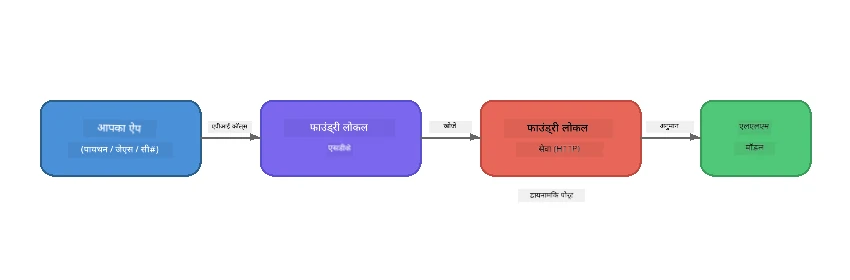

# हिस्सा 1: Foundry Local के साथ शुरुआत


## Foundry Local क्या है?

[Foundry Local](https://foundrylocal.ai) आपको ओपन-सोर्स AI भाषा मॉडल **आपके कंप्यूटर पर सीधे चलाने** की अनुमति देता है - कोई इंटरनेट आवश्यक नहीं, कोई क्लाउड लागत नहीं, और पूर्ण डेटा गोपनीयता। यह:

- **मॉडल को स्थानीय रूप से डाउनलोड और चलाता है** स्वचालित हार्डवेयर अनुकूलन (GPU, CPU, या NPU) के साथ
- **OpenAI-संगत API प्रदान करता है** ताकि आप परिचित SDKs और टूल्स का उपयोग कर सकें
- **कोई Azure सदस्यता या साइन-अप आवश्यक नहीं** - बस इंस्टॉल करें और निर्माण शुरू करें

इसे अपनी मशीन पर पूरी तरह से चलने वाले अपने निजी AI की तरह सोचें।

## सीखने के उद्देश्य

इस प्रयोगशाला के अंत तक आप सक्षम होंगे:

- अपने ऑपरेटिंग सिस्टम पर Foundry Local CLI इंस्टॉल करना
- समझना कि मॉडल उपनाम (alias) क्या हैं और वे कैसे काम करते हैं
- अपना पहला स्थानीय AI मॉडल डाउनलोड और चलाना
- कमांड लाइन से स्थानीय मॉडल को चैट संदेश भेजना
- स्थानीय और क्लाउड-होस्टेड AI मॉडलों के बीच अंतर समझना

---

## पूर्वापेक्षाएँ

### सिस्टम आवश्यकताएँ

| आवश्यकता | न्यूनतम | अनुशंसित |
|-------------|---------|-------------|
| **रैम (RAM)** | 8 GB | 16 GB |
| **डिस्क स्पेस** | 5 GB (मॉडल के लिए) | 10 GB |
| **सीपीयू (CPU)** | 4 कोर | 8+ कोर |
| **जीपीयू (GPU)** | वैकल्पिक | NVIDIA के साथ CUDA 11.8+ |
| **ऑपरेटिंग सिस्टम** | Windows 10/11 (x64/ARM), Windows Server 2025, macOS 13+ | - |

> **नोट:** Foundry Local स्वचालित रूप से आपके हार्डवेयर के लिए सर्वोत्तम मॉडल संस्करण का चयन करता है। यदि आपके पास NVIDIA GPU है, तो यह CUDA त्वरक का उपयोग करता है। यदि आपके पास Qualcomm NPU है, तो यह उसका उपयोग करता है। अन्यथा यह एक अनुकूलित CPU संस्करण पर वापस चला जाता है।

### Foundry Local CLI इंस्टॉल करें

**Windows** (PowerShell):  
```powershell
winget install Microsoft.FoundryLocal
```
  
**macOS** (Homebrew):  
```bash
brew tap microsoft/foundrylocal
brew install foundrylocal
```
  
> **नोट:** Foundry Local वर्तमान में केवल Windows और macOS का समर्थन करता है। Linux इस समय समर्थित नहीं है।

इंस्टॉलेशन सत्यापित करें:  
```bash
foundry --version
```
  
---

## प्रयोगशाला अभ्यास

### अभ्यास 1: उपलब्ध मॉडलों का अन्वेषण करें

Foundry Local में पूर्व-अनुकूलित ओपन-सोर्स मॉडलों का एक कैटलॉग शामिल है। उन्हें सूचीबद्ध करें:

```bash
foundry model list
```
  
आपको निम्न जैसे मॉडल दिखेंगे:  
- `phi-3.5-mini` - Microsoft का 3.8B पैरामीटर मॉडल (तेज़, अच्छी गुणवत्ता)  
- `phi-4-mini` - नया, अधिक सक्षम Phi मॉडल  
- `phi-4-mini-reasoning` - Phi मॉडल चेन-ऑफ-थॉट reasoning (`<think>` टैग्स) के साथ  
- `phi-4` - Microsoft का सबसे बड़ा Phi मॉडल (10.4 GB)  
- `qwen2.5-0.5b` - बहुत छोटा और तेज (कम संसाधन वाले उपकरणों के लिए अच्छा)  
- `qwen2.5-7b` - टूल-कॉलिंग समर्थन के साथ मजबूत सामान्य-उद्देश्य मॉडल  
- `qwen2.5-coder-7b` - कोड जनरेशन के लिए अनुकूलित  
- `deepseek-r1-7b` - मजबूत reasoning मॉडल  
- `gpt-oss-20b` - बड़ा ओपन-सोर्स मॉडल (MIT लाइसेंस, 12.5 GB)  
- `whisper-base` - भाषण-से-पाठ ट्रांसक्रिप्शन (383 MB)  
- `whisper-large-v3-turbo` - उच्च-सटीकता ट्रांसक्रिप्शन (9 GB)  

> **मॉडल उपनाम क्या है?** `phi-3.5-mini` जैसे उपनाम शॉर्टकट होते हैं। जब आप किसी उपनाम का उपयोग करते हैं, तो Foundry Local स्वचालित रूप से आपके विशिष्ट हार्डवेयर के लिए सर्वोत्तम संस्करण डाउनलोड करता है (NVIDIA GPUs के लिए CUDA, अन्यथा CPU-अनुकूलित)। आपको कभी भी सही संस्करण चुनने की चिंता नहीं करनी पड़ती।

### अभ्यास 2: अपना पहला मॉडल चलाएं

इंटरैक्टिव रूप से एक मॉडल डाउनलोड करें और चैट शुरू करें:  

```bash
foundry model run phi-3.5-mini
```
  
पहली बार जब आप इसे चलाएंगे, तो Foundry Local:  
1. आपके हार्डवेयर का पता लगाएगा  
2. इष्टतम मॉडल संस्करण डाउनलोड करेगा (इसमें कुछ मिनट लग सकते हैं)  
3. मॉडल को मेमोरी में लोड करेगा  
4. एक इंटरैक्टिव चैट सत्र शुरू करेगा  

इसे कुछ सवाल पूछकर आजमाएं:  
```
You: What is the golden ratio?
You: Can you explain it as if I were 10 years old?
You: Write a haiku about mathematics
```
  
बाहर निकलने के लिए `exit` टाइप करें या `Ctrl+C` दबाएं।

### अभ्यास 3: मॉडल प्री-डाउनलोड करें

यदि आप चैट शुरू किए बिना मॉडल डाउनलोड करना चाहते हैं:  

```bash
foundry model download phi-3.5-mini
```
  
देखें कौन से मॉडल पहले से आपके मशीन पर डाउनलोड हो चुके हैं:  

```bash
foundry cache list
```
  
### अभ्यास 4: संरचना को समझें

Foundry Local एक **स्थानीय HTTP सेवा** के रूप में चलता है जो OpenAI-संगत REST API उजागर करता है। इसका मतलब है:

1. सेवा एक **डायनामिक पोर्ट** पर शुरू होती है (हर बार अलग पोर्ट)  
2. आप SDK का उपयोग करके वास्तविक endpoint URL पता करते हैं  
3. आप बात करने के लिए **कोई भी** OpenAI-संगत क्लाइंट लाइब्रेरी इस्तेमाल कर सकते हैं



> **महत्वपूर्ण:** Foundry Local हर बार शुरू होने पर एक **डायनामिक पोर्ट** असाइन करता है। कभी भी पोर्ट नंबर को हार्डकोड न करें जैसे `localhost:5272`। हमेशा SDK का उपयोग करके वर्तमान URL खोजें (जैसे Python में `manager.endpoint` या JavaScript में `manager.urls[0]`)।

---

## मुख्य बिंदु

| अवधारणा | आपने क्या सीखा |
|---------|------------------|
| ऑन-डिवाइस AI | Foundry Local आपके डिवाइस पर मॉडल को पूरी तरह से चलाता है, बिना क्लाउड, API कुंजियों, और बिना लागत के |
| मॉडल उपनाम | `phi-3.5-mini` जैसे उपनाम आपके हार्डवेयर के लिए सर्वश्रेष्ठ संस्करण अपने आप चुन लेते हैं |
| डायनामिक पोर्ट | सेवा डायनामिक पोर्ट पर चलती है; हमेशा SDK का उपयोग करें endpoint खोजने के लिए |
| CLI और SDK | आप CLI (`foundry model run`) या SDK के माध्यम से प्रोग्रामेटिक रूप से मॉडलों के साथ बातचीत कर सकते हैं |

---

## अगला कदम

[भाग 2: Foundry Local SDK डीप डाइव](part2-foundry-local-sdk.md) पर जारी रखें ताकि आप मॉडल, सेवाओं, और कैशिंग को प्रोग्रामेटिक रूप से प्रबंधित करने के लिए SDK API में महारत हासिल कर सकें।