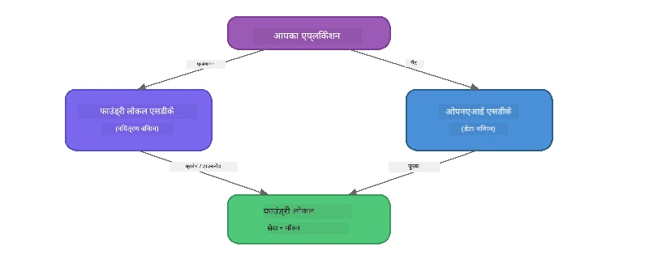

# भाग 3: Foundry Local SDK का उपयोग OpenAI के साथ करना

## अवलोकन

भाग 1 में आपने Foundry Local CLI का उपयोग इंटरैक्टिवली मॉडल चलाने के लिए किया था। भाग 2 में आपने SDK API की पूरी सतह का अन्वेषण किया। अब आप सीखेंगे कि **Foundry Local को अपनी एप्लिकेशन में कैसे एकीकृत करें** SDK और OpenAI-संगत API का उपयोग करके।

Foundry Local तीन भाषाओं के लिए SDK प्रदान करता है। वह चुनें जिसमें आप सबसे अधिक सहज हों - तीनों में अवधारणाएँ समान हैं।

## सीखने के उद्देश्य

इस लैब के अंत तक आप सक्षम होंगे:

- अपनी भाषा (Python, JavaScript, या C#) के लिए Foundry Local SDK इंस्टॉल करना
- `FoundryLocalManager` को प्रारंभ करना ताकि सेवा शुरू करें, कैश जांचें, डाउनलोड करें, और मॉडल लोड करें
- OpenAI SDK का उपयोग करके स्थानीय मॉडल से कनेक्ट करें
- चैट पूर्णताएँ भेजें और स्ट्रीमिंग प्रतिक्रियाओं को संभालें
- डाइनेमिक पोर्ट आर्किटेक्चर को समझें

---

## पूर्व आवश्यकताएँ

पहले [भाग 1: Foundry Local के साथ शुरुआत](part1-getting-started.md) और [भाग 2: Foundry Local SDK गहराई से](part2-foundry-local-sdk.md) पूरा करें।

निम्नलिखित में से **एक** भाषा रनटाइम इंस्टॉल करें:
- **Python 3.9+** - [python.org/downloads](https://www.python.org/downloads/)
- **Node.js 18+** - [nodejs.org](https://nodejs.org/)
- **.NET 9.0+** - [dot.net/download](https://dotnet.microsoft.com/download)

---

## अवधारणा: SDK कैसे काम करता है

Foundry Local SDK **कंट्रोल प्लेन** का प्रबंधन करता है (सेवा शुरू करना, मॉडल डाउनलोड करना), जबकि OpenAI SDK **डेटा प्लेन** को संभालता है (प्रॉम्प्ट भेजना, पूर्णताएँ प्राप्त करना)।



---

## लैब अभ्यास

### अभ्यास 1: अपना पर्यावरण सेट करें

<details>
<summary><b>🐍 Python</b></summary>

```bash
cd python
python -m venv venv

# वर्चुअल वातावरण सक्रिय करें:
# विंडोज़ (पावरशेल):
venv\Scripts\Activate.ps1
# विंडोज़ (कमांड प्रॉम्प्ट):
venv\Scripts\activate.bat
# मैकओएस:
source venv/bin/activate

pip install -r requirements.txt
```

`requirements.txt` निम्नलिखित इंस्टॉल करता है:
- `foundry-local-sdk` - Foundry Local SDK (इम्पोर्ट में `foundry_local`)
- `openai` - OpenAI Python SDK
- `agent-framework` - Microsoft Agent Framework (आगे के भागों में उपयोग किया जाएगा)

</details>

<details>
<summary><b>📘 JavaScript</b></summary>

```bash
cd javascript
npm install
```

`package.json` निम्नलिखित इंस्टॉल करता है:
- `foundry-local-sdk` - Foundry Local SDK
- `openai` - OpenAI Node.js SDK

</details>

<details>
<summary><b>💜 C#</b></summary>

```bash
cd csharp
dotnet restore
dotnet build
```

`csharp.csproj` उपयोग करता है:
- `Microsoft.AI.Foundry.Local` - Foundry Local SDK (NuGet)
- `OpenAI` - OpenAI C# SDK (NuGet)

> **प्रोजेक्ट संरचना:** C# प्रोजेक्ट में `Program.cs` में कमांड-लाइन राउटर होता है जो अलग-अलग उदाहरण फ़ाइलों को डिस्पैच करता है। इस भाग के लिए `dotnet run chat` (या केवल `dotnet run`) चलाएं। अन्य भागों में `dotnet run rag`, `dotnet run agent`, और `dotnet run multi` उपयोग होते हैं।

</details>

---

### अभ्यास 2: बुनियादी चैट पूर्णता

अपने भाषा के लिए बुनियादी चैट उदाहरण खोलें और कोड देखें। हर स्क्रिप्ट निम्न तीन चरणों का पालन करती है:

1. **सेवा शुरू करें** - `FoundryLocalManager` Foundry Local रनटाइम शुरू करता है
2. **मॉडल डाउनलोड और लोड करें** - कैश जांचें, जरूरत पड़ने पर डाउनलोड करें, फिर मेमोरी में लोड करें
3. **एक OpenAI क्लाइंट बनाएं** - स्थानीय एंडपॉइंट से कनेक्ट करें और स्ट्रीमिंग चैट पूर्णता भेजें

<details>
<summary><b>🐍 Python - <code>python/foundry-local.py</code></b></summary>

```python
import sys
import openai
from foundry_local import FoundryLocalManager

alias = "phi-3.5-mini"

# चरण 1: एक FoundryLocalManager बनाएं और सेवा शुरू करें
print("Starting Foundry Local service...")
manager = FoundryLocalManager()
manager.start_service()

# चरण 2: जांचें कि मॉडल पहले से डाउनलोड किया गया है या नहीं
cached = manager.list_cached_models()
catalog_info = manager.get_model_info(alias)
is_cached = any(m.id == catalog_info.id for m in cached) if catalog_info else False

if is_cached:
    print(f"Model already downloaded: {alias}")
else:
    print(f"Downloading model: {alias} (this may take several minutes)...")
    manager.download_model(alias)
    print(f"Download complete: {alias}")

# चरण 3: मॉडल को मेमोरी में लोड करें
print(f"Loading model: {alias}...")
manager.load_model(alias)

# LOCAL Foundry सेवा की ओर संकेत करता हुआ एक OpenAI क्लाइंट बनाएं
client = openai.OpenAI(
    base_url=manager.endpoint,   # डायनामिक पोर्ट - कभी हार्डकोड न करें!
    api_key=manager.api_key
)

# एक स्ट्रीमिंग चैट पूर्णता उत्पन्न करें
stream = client.chat.completions.create(
    model=manager.get_model_info(alias).id,
    messages=[{"role": "user", "content": "What is the golden ratio?"}],
    stream=True,
)

for chunk in stream:
    if chunk.choices[0].delta.content is not None:
        print(chunk.choices[0].delta.content, end="", flush=True)
print()
```

**इसे चलाएं:**
```bash
python foundry-local.py
```

</details>

<details>
<summary><b>📘 JavaScript - <code>javascript/foundry-local.mjs</code></b></summary>

```javascript
import { OpenAI } from "openai";
import { FoundryLocalManager } from "foundry-local-sdk";

const alias = "phi-3.5-mini";

// चरण 1: फाउंड्री लोकल सेवा शुरू करें
console.log("Starting Foundry Local service...");
FoundryLocalManager.create({ appName: "FoundryLocalWorkshop" });
const manager = FoundryLocalManager.instance;
await manager.startWebService();

// चरण 2: जांचें कि मॉडल पहले से डाउनलोड है या नहीं
const catalog = manager.catalog;
const model = await catalog.getModel(alias);

if (model.isCached) {
  console.log(`Model already downloaded: ${alias}`);
} else {
  console.log(`Downloading model: ${alias} (this may take several minutes)...`);
  await model.download();
  console.log(`Download complete: ${alias}`);
}

// चरण 3: मॉडल को मेमोरी में लोड करें
console.log(`Loading model: ${alias}...`);
await model.load();
console.log(`Model loaded: ${model.id}`);

// लोकल फाउंड्री सेवा की ओर इंगित करता हुआ एक OpenAI क्लाइंट बनाएं
const client = new OpenAI({
  baseURL: manager.urls[0] + "/v1",   // डायनेमिक पोर्ट - कभी भी हार्डकोड न करें!
  apiKey: "foundry-local",
});

// एक स्ट्रीमिंग चैट पूर्णता जनरेट करें
const stream = await client.chat.completions.create({
  model: model.id,
  messages: [{ role: "user", content: "What is the golden ratio?" }],
  stream: true,
});

for await (const chunk of stream) {
  if (chunk.choices[0]?.delta?.content) {
    process.stdout.write(chunk.choices[0].delta.content);
  }
}
console.log();
```

**इसे चलाएं:**
```bash
node foundry-local.mjs
```

</details>

<details>
<summary><b>💜 C# - <code>csharp/BasicChat.cs</code></b></summary>

```csharp
using Microsoft.AI.Foundry.Local;
using Microsoft.Extensions.Logging.Abstractions;
using OpenAI;
using OpenAI.Chat;
using System.ClientModel;

var alias = "phi-3.5-mini";

// Step 1: Start the Foundry Local service
Console.WriteLine("Starting Foundry Local service...");
await FoundryLocalManager.CreateAsync(
    new Configuration
    {
        AppName = "FoundryLocalSamples",
        Web = new Configuration.WebService { Urls = "http://127.0.0.1:0" }
    }, NullLogger.Instance, default);
var manager = FoundryLocalManager.Instance;
await manager.StartWebServiceAsync(default);

// Step 2: Get the model from the catalog
var catalog = await manager.GetCatalogAsync(default);
var model = await catalog.GetModelAsync(alias, default);

// Step 3: Check if the model is already downloaded
var isCached = await model.IsCachedAsync(default);

if (isCached)
{
    Console.WriteLine($"Model already downloaded: {alias}");
}
else
{
    Console.WriteLine($"Downloading model: {alias} (this may take several minutes)...");
    await model.DownloadAsync(null, default);
    Console.WriteLine($"Download complete: {alias}");
}

// Step 4: Load the model into memory
Console.WriteLine($"Loading model: {alias}...");
await model.LoadAsync(default);
Console.WriteLine($"Loaded model: {model.Id}");
Console.WriteLine($"Endpoint: {manager.Urls[0]}");

// Create OpenAI client pointing to the LOCAL Foundry service
var key = new ApiKeyCredential("foundry-local");
var client = new OpenAIClient(key, new OpenAIClientOptions
{
    Endpoint = new Uri(manager.Urls[0] + "/v1")  // Dynamic port - never hardcode!
});

var chatClient = client.GetChatClient(model.Id);

// Stream a chat completion
var completionUpdates = chatClient.CompleteChatStreaming("What is the golden ratio?");

foreach (var update in completionUpdates)
{
    if (update.ContentUpdate.Count > 0)
    {
        Console.Write(update.ContentUpdate[0].Text);
    }
}
Console.WriteLine();
```

**इसे चलाएं:**
```bash
dotnet run chat
```

</details>

---

### अभ्यास 3: प्रॉम्प्ट के साथ प्रयोग करें

एक बार आपका बुनियादी उदाहरण चल जाए, तो कोड में बदलाव करके देखें:

1. **उपयोगकर्ता संदेश बदलें** - विभिन्न प्रश्न पूछें
2. **एक सिस्टम प्रॉम्प्ट जोड़ें** - मॉडल को एक व्यक्तित्व दें
3. **स्ट्रीमिंग बंद करें** - `stream=False` सेट करें और पूरी प्रतिक्रिया एक बार में प्रिंट करें
4. **कोई अलग मॉडल आजमाएं** - `phi-3.5-mini` की जगह `foundry model list` से कोई और मॉडल चुनें

<details>
<summary><b>🐍 Python</b></summary>

```python
# एक सिस्टम प्रॉम्प्ट जोड़ें - मॉडल को एक व्यक्तित्व दें:
stream = client.chat.completions.create(
    model=manager.get_model_info(alias).id,
    messages=[
        {"role": "system", "content": "You are a pirate. Answer everything in pirate speak."},
        {"role": "user", "content": "What is the golden ratio?"}
    ],
    stream=True,
)

# या स्ट्रीमिंग बंद करें:
response = client.chat.completions.create(
    model=manager.get_model_info(alias).id,
    messages=[{"role": "user", "content": "What is the golden ratio?"}],
    stream=False,
)
print(response.choices[0].message.content)
```

</details>

<details>
<summary><b>📘 JavaScript</b></summary>

```javascript
// एक सिस्टम प्रॉम्प्ट जोड़ें - मॉडल को एक व्यक्तित्व दें:
const stream = await client.chat.completions.create({
  model: modelInfo.id,
  messages: [
    { role: "system", content: "You are a pirate. Answer everything in pirate speak." },
    { role: "user", content: "What is the golden ratio?" },
  ],
  stream: true,
});

// या स्ट्रीमिंग बंद करें:
const response = await client.chat.completions.create({
  model: modelInfo.id,
  messages: [{ role: "user", content: "What is the golden ratio?" }],
  stream: false,
});
console.log(response.choices[0].message.content);
```

</details>

<details>
<summary><b>💜 C#</b></summary>

```csharp
// Add a system prompt - give the model a persona:
var completionUpdates = chatClient.CompleteChatStreaming(
    new ChatMessage[]
    {
        new SystemChatMessage("You are a pirate. Answer everything in pirate speak."),
        new UserChatMessage("What is the golden ratio?")
    }
);

// Or turn off streaming:
var response = chatClient.CompleteChat("What is the golden ratio?");
Console.WriteLine(response.Value.Content[0].Text);
```

</details>

---

### SDK मेथड संदर्भ

<details>
<summary><b>🐍 Python SDK मेथड्स</b></summary>

| मेथड | उद्देश्य |
|--------|---------|
| `FoundryLocalManager()` | मैनेजर उदाहरण बनाएँ |
| `manager.start_service()` | Foundry Local सेवा शुरू करें |
| `manager.list_cached_models()` | आपके डिवाइस पर डाउनलोड किए गए मॉडल सूचीबद्ध करें |
| `manager.get_model_info(alias)` | मॉडल ID और मेटाडेटा प्राप्त करें |
| `manager.download_model(alias, progress_callback=fn)` | प्रोग्रेस कॉलबैक सहित मॉडल डाउनलोड करें |
| `manager.load_model(alias)` | मॉडल को मेमोरी में लोड करें |
| `manager.endpoint` | डाइनेमिक एंडपॉइंट URL प्राप्त करें |
| `manager.api_key` | API कुंजी प्राप्त करें (स्थानीय के लिए प्लेसहोल्डर) |

</details>

<details>
<summary><b>📘 JavaScript SDK मेथड्स</b></summary>

| मेथड | उद्देश्य |
|--------|---------|
| `FoundryLocalManager.create({ appName })` | मैनेजर उदाहरण बनाएँ |
| `FoundryLocalManager.instance` | सिंगलटन मैनेजर तक पहुँचें |
| `await manager.startWebService()` | Foundry Local सेवा शुरू करें |
| `await manager.catalog.getModel(alias)` | कैटलॉग से मॉडल प्राप्त करें |
| `model.isCached` | जांचें कि मॉडल पहले से डाउनलोड है या नहीं |
| `await model.download()` | मॉडल डाउनलोड करें |
| `await model.load()` | मॉडल को मेमोरी में लोड करें |
| `model.id` | OpenAI API कॉल के लिए मॉडल ID प्राप्त करें |
| `manager.urls[0] + "/v1"` | डाइनेमिक एंडपॉइंट URL प्राप्त करें |
| `"foundry-local"` | API कुंजी (स्थानीय के लिए प्लेसहोल्डर) |

</details>

<details>
<summary><b>💜 C# SDK मेथड्स</b></summary>

| मेथड | उद्देश्य |
|--------|---------|
| `FoundryLocalManager.CreateAsync(config)` | मैनेजर बनाएँ और प्रारंभ करें |
| `manager.StartWebServiceAsync()` | Foundry Local वेब सेवा शुरू करें |
| `manager.GetCatalogAsync()` | मॉडल कैटलॉग प्राप्त करें |
| `catalog.ListModelsAsync()` | सभी उपलब्ध मॉडल सूचीबद्ध करें |
| `catalog.GetModelAsync(alias)` | किसी विशेष मॉडल को आइडेंटिफायर से प्राप्त करें |
| `model.IsCachedAsync()` | जांचें कि मॉडल डाउनलोड है या नहीं |
| `model.DownloadAsync()` | मॉडल डाउनलोड करें |
| `model.LoadAsync()` | मॉडल को मेमोरी में लोड करें |
| `manager.Urls[0]` | डाइनेमिक एंडपॉइंट URL प्राप्त करें |
| `new ApiKeyCredential("foundry-local")` | स्थानीय API कुंजी क्रेडेंशियल |

</details>

---

### अभ्यास 4: नेटिव ChatClient का उपयोग करना (OpenAI SDK के विकल्प के रूप में)

अभ्यास 2 और 3 में आपने OpenAI SDK का उपयोग चैट पूर्णताओं के लिए किया। JavaScript और C# SDK भी एक **नेटिव ChatClient** प्रदान करते हैं जो OpenAI SDK की पूरी आवश्यकता को खत्म कर देता है।

<details>
<summary><b>📘 JavaScript - <code>model.createChatClient()</code></b></summary>

```javascript
import { FoundryLocalManager } from "foundry-local-sdk";

const alias = "phi-3.5-mini";

FoundryLocalManager.create({ appName: "ChatClientDemo" });
const manager = FoundryLocalManager.instance;
await manager.startWebService();

const model = await manager.catalog.getModel(alias);
if (!model.isCached) await model.download();
await model.load();

// कोई OpenAI इम्पोर्ट आवश्यक नहीं — मॉडल से सीधे एक क्लाइंट प्राप्त करें
const chatClient = model.createChatClient();

// गैर-स्ट्रीमिंग पूर्णता
const response = await chatClient.completeChat([
  { role: "system", content: "You are a pirate. Answer everything in pirate speak." },
  { role: "user", content: "What is the golden ratio?" }
]);
console.log(response.choices[0].message.content);

// स्ट्रीमिंग पूर्णता (कॉलबैक पैटर्न का उपयोग करता है)
await chatClient.completeStreamingChat(
  [{ role: "user", content: "What is the golden ratio?" }],
  (chunk) => {
    if (chunk.choices?.[0]?.delta?.content) {
      process.stdout.write(chunk.choices[0].delta.content);
    }
  }
);
console.log();
```

> **नोट:** ChatClient की `completeStreamingChat()` एक **callback** पैटर्न का उपयोग करती है, async iterator नहीं। दूसरे तर्क के रूप में एक फ़ंक्शन पास करें।

</details>

<details>
<summary><b>💜 C# - <code>model.GetChatClientAsync()</code></b></summary>

```csharp
var catalog = await manager.GetCatalogAsync(default);
var model = await catalog.GetModelAsync("phi-3.5-mini", default);
if (!await model.IsCachedAsync(default))
    await model.DownloadAsync(null, default);
await model.LoadAsync(default);

// No OpenAI NuGet needed — get a client directly from the model
var chatClient = await model.GetChatClientAsync(default);

// Use it like a standard OpenAI ChatClient
var response = chatClient.CompleteChat("What is the golden ratio?");
Console.WriteLine(response.Value.Content[0].Text);
```

</details>

> **कब किसका उपयोग करें:**
> | तरीका | सबसे उपयुक्त |
> |----------|----------|
> | OpenAI SDK | पूर्ण पैरामीटर नियंत्रण, प्रोडक्शन एप्स, पहले से मौजूद OpenAI कोड |
> | नेटिव ChatClient | त्वरित प्रोटोटाइपिंग, कम निर्भरताएँ, सरल सेटअप |

---

## मुख्य निष्कर्ष

| अवधारणा | आपने क्या सीखा |
|---------|------------------|
| कंट्रोल प्लेन | Foundry Local SDK सेवा शुरू करने और मॉडल लोड करने का प्रबंधन करता है |
| डेटा प्लेन | OpenAI SDK चैट पूर्णताएँ और स्ट्रीमिंग को संभालता है |
| डाइनेमिक पोर्ट्स | हमेशा SDK का उपयोग एंडपॉइंट खोजने के लिए करें; URLs हार्डकोड न करें |
| क्रॉस-भाषा | वही कोड पैटर्न Python, JavaScript, और C# के लिए काम करता है |
| OpenAI संगतता | पूरी OpenAI API संगतता मतलब मौजूदा OpenAI कोड के साथ न्यूनतम बदलाव में काम करता है |
| नेटिव ChatClient | `createChatClient()` (JS) / `GetChatClientAsync()` (C#) OpenAI SDK का विकल्प प्रदान करता है |

---

## अगले कदम

जारी रखें [भाग 4: RAG एप्लिकेशन बनाना](part4-rag-fundamentals.md) ताकि आप सीख सकें कि एक पूरी तरह से आपके डिवाइस पर चलने वाली Retrieval-Augmented Generation पाइपलाइन कैसे बनाएं।