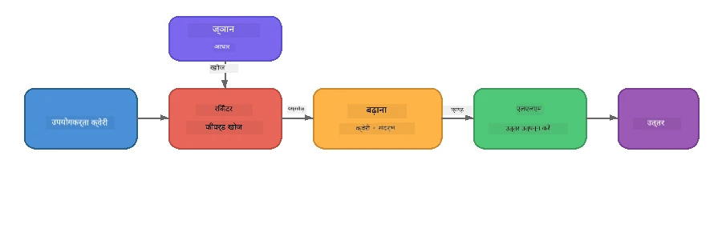

# पार्ट 4: Foundry Local के साथ RAG एप्लिकेशन बनाना

## सिंहावलोकन

बड़े लैंग्वेज मॉडल शक्तिशाली हैं, लेकिन वे केवल वही जानते हैं जो उनके प्रशिक्षण डेटा में था। **रिट्रीवल-ऑगमेंटेड जनरेशन (RAG)** इसे हल करता है मॉडल को क्वेरी समय पर संबंधित संदर्भ देकर - जो आपके अपने दस्तावेज़ों, डेटाबेस या ज्ञान आधारों से निकाला जाता है।

इस प्रयोगशाला में आप एक पूर्ण RAG पाइपलाइन बनाएंगे जो **पूरी तरह से आपके डिवाइस पर चलती है** Foundry Local का उपयोग करके। कोई क्लाउड सेवाएँ नहीं, कोई वेक्टर डेटाबेस नहीं, कोई एम्बेडिंग API नहीं - केवल स्थानीय रिट्रीवल और एक स्थानीय मॉडल।

## सीखने के उद्देश्य

इस प्रयोगशाला के अंत तक आप सक्षम होंगे:

- समझाना कि RAG क्या है और यह AI एप्लिकेशन के लिए क्यों महत्वपूर्ण है
- टेक्स्ट दस्तावेजों से एक स्थानीय ज्ञान आधार बनाना
- प्रासंगिक संदर्भ खोजने के लिए एक सरल रिट्रीवल फ़ंक्शन लागू करना
- एक सिस्टम प्रॉम्प्ट तैयार करना जो मॉडल को प्राप्त तथ्यों पर आधारित करता है
- ऑन-डिवाइस पूर्ण Retrieve → Augment → Generate पाइपलाइन चलाना
- सरल कीवर्ड रिट्रीवल और वेक्टर सर्च के बीच समझौते को समझना

---

## पूर्वापेक्षाएँ

- पूरा करें [Part 3: Using the Foundry Local SDK with OpenAI](part3-sdk-and-apis.md)
- Foundry Local CLI स्थापित और `phi-3.5-mini` मॉडल डाउनलोड किया हुआ हो

---

## अवधारणा: RAG क्या है?

RAG के बिना, एक LLM केवल अपने प्रशिक्षण डेटा से ही जवाब दे सकता है - जो पुराना, अधूरा, या आपकी निजी जानकारी से भरा नहीं हो सकता:

```
User: "What is Zava's return policy?"
LLM:  "I do not have information about Zava's return policy."  ← No context!
```

RAG के साथ, आप पहले प्रासंगिक दस्तावेजों को **पुर्नप्राप्त** करते हैं, फिर उस संदर्भ के साथ प्रॉम्प्ट को **ऑगमेंट** करते हैं और अंत में एक प्रतिक्रिया **जनरेट** करते हैं:



मुख्य अंतर्दृष्टि: **मॉडल को उत्तर "जानने" की ज़रूरत नहीं है; इसे केवल सही दस्तावेज़ पढ़ने की जरूरत है।**

---

## प्रयोगशाला अभ्यास

### अभ्यास 1: ज्ञान आधार को समझना

अपने भाषा के लिए RAG उदाहरण खोलें और ज्ञान आधार का निरीक्षण करें:

<details>
<summary><b>🐍 Python: <code>python/foundry-local-rag.py</code></b></summary>

ज्ञान आधार एक सरल सूची है जिसमें शब्दकोश होते हैं जिनमें `title` और `content` फ़ील्ड होते हैं:

```python
KNOWLEDGE_BASE = [
    {
        "title": "Foundry Local Overview",
        "content": (
            "Foundry Local brings the power of Azure AI Foundry to your local "
            "device without requiring an Azure subscription..."
        ),
    },
    {
        "title": "Supported Hardware",
        "content": (
            "Foundry Local automatically selects the best model variant for "
            "your hardware. If you have an Nvidia CUDA GPU it downloads the "
            "CUDA-optimized model..."
        ),
    },
    # ... और प्रविष्टियाँ
]
```

प्रत्येक प्रविष्टि ज्ञान के " टुकड़े " का प्रतिनिधित्व करती है - एक विषय पर केंद्रित सूचना का हिस्सा।

</details>

<details>
<summary><b>📘 JavaScript: <code>javascript/foundry-local-rag.mjs</code></b></summary>

ज्ञान आधार उसी संरचना का उपयोग करता है जैसे वस्तुओं की एक सरणी:

```javascript
const KNOWLEDGE_BASE = [
  {
    title: "Foundry Local Overview",
    content:
      "Foundry Local brings the power of Azure AI Foundry to your local " +
      "device without requiring an Azure subscription...",
  },
  {
    title: "Supported Hardware",
    content:
      "Foundry Local automatically selects the best model variant for " +
      "your hardware...",
  },
  // ... और प्रविष्टियाँ
];
```

</details>

<details>
<summary><b>💜 C#: <code>csharp/RagPipeline.cs</code></b></summary>

ज्ञान आधार नामित ट्यूपल की एक सूची का उपयोग करता है:

```csharp
private static readonly List<(string Title, string Content)> KnowledgeBase =
[
    ("Foundry Local Overview",
     "Foundry Local brings the power of Azure AI Foundry to your local " +
     "device without requiring an Azure subscription..."),

    ("Supported Hardware",
     "Foundry Local automatically selects the best model variant for " +
     "your hardware..."),

    // ... more entries
];
```

</details>

> **एक वास्तविक एप्लिकेशन में**, ज्ञान आधार डिस्क पर फ़ाइलों, डेटाबेस, खोज सूचकांक, या API से आता है। इस प्रयोगशाला के लिए, हम सरलता बनाए रखने के लिए इन-मेमोरी सूची का उपयोग करते हैं।

---

### अभ्यास 2: रिट्रीवल फ़ंक्शन को समझना

रिट्रीवल चरण उपयोगकर्ता के प्रश्न के लिए सबसे प्रासंगिक टुकड़े खोजता है। यह उदाहरण **कीवर्ड ओवरलैप** का उपयोग करता है - यह गिनती करता है कि क्वेरी में कितने शब्द प्रत्येक टुकड़े में भी होते हैं:

<details>
<summary><b>🐍 Python</b></summary>

```python
def retrieve(query: str, top_k: int = 2) -> list[dict]:
    """Return the top-k knowledge chunks most relevant to the query."""
    query_words = set(query.lower().split())
    scored = []
    for chunk in KNOWLEDGE_BASE:
        chunk_words = set(chunk["content"].lower().split())
        overlap = len(query_words & chunk_words)
        scored.append((overlap, chunk))
    scored.sort(key=lambda x: x[0], reverse=True)
    return [item[1] for item in scored[:top_k]]
```

</details>

<details>
<summary><b>📘 JavaScript</b></summary>

```javascript
function retrieve(query, topK = 2) {
  const queryWords = new Set(query.toLowerCase().split(/\s+/));
  const scored = KNOWLEDGE_BASE.map((chunk) => {
    const chunkWords = new Set(chunk.content.toLowerCase().split(/\s+/));
    let overlap = 0;
    for (const w of queryWords) {
      if (chunkWords.has(w)) overlap++;
    }
    return { overlap, chunk };
  });
  scored.sort((a, b) => b.overlap - a.overlap);
  return scored.slice(0, topK).map((s) => s.chunk);
}
```

</details>

<details>
<summary><b>💜 C#</b></summary>

```csharp
private static List<(string Title, string Content)> Retrieve(string query, int topK = 2)
{
    var queryWords = new HashSet<string>(
        query.ToLowerInvariant().Split(' ', StringSplitOptions.RemoveEmptyEntries));

    return KnowledgeBase
        .Select(chunk =>
        {
            var chunkWords = new HashSet<string>(
                chunk.Content.ToLowerInvariant().Split(' ', StringSplitOptions.RemoveEmptyEntries));
            var overlap = queryWords.Intersect(chunkWords).Count();
            return (Overlap: overlap, Chunk: chunk);
        })
        .OrderByDescending(x => x.Overlap)
        .Take(topK)
        .Select(x => x.Chunk)
        .ToList();
}
```

</details>

**यह कैसे काम करता है:**
1. क्वेरी को अलग-अलग शब्दों में विभाजित करें
2. प्रत्येक ज्ञान टुकड़े के लिए, गिनें कि कितने क्वेरी शब्द उस टुकड़े में हैं
3. ओवरलैप स्कोर के अनुसार (सबसे अधिक पहले) सॉर्ट करें
4. शीर्ष-k सबसे प्रासंगिक टुकड़े लौटाएं

> **समझौता:** कीवर्ड ओवरलैप सरल लेकिन सीमित है; यह पर्यायवाची या अर्थ को नहीं समझता। उत्पादन RAG सिस्टम आमतौर पर **एम्बेडिंग वेक्टर** और **वेक्टर डेटाबेस** का उपयोग सेमांटिक सर्च के लिए करते हैं। हालांकि, कीवर्ड ओवरलैप एक बहुत अच्छा शुरुआती बिंदु है और इसे चलाने के लिए अतिरिक्त निर्भरताओं की आवश्यकता नहीं होती।

---

### अभ्यास 3: ऑगमेंटेड प्रॉम्प्ट को समझना

पुर्नप्राप्त संदर्भ को मॉडल को भेजने से पहले **सिस्टम प्रॉम्प्ट** में डाला जाता है:

```python
system_prompt = (
    "You are a helpful assistant. Answer the user's question using ONLY "
    "the information provided in the context below. If the context does "
    "not contain enough information, say so.\n\n"
    f"Context:\n{context_text}"
)
```

महत्वपूर्ण डिज़ाइन निर्णय:
- **"केवल प्रदान की गई जानकारी"** - मॉडल को संदर्भ के बिना तथ्यों का भ्रम फैलाने से रोकता है
- **"अगर संदर्भ में पर्याप्त जानकारी नहीं है, तो इसे बताएं"** - ईमानदार "मुझे नहीं पता" जवाब को प्रोत्साहित करता है
- संदर्भ सिस्टम संदेश में रखा जाता है ताकि यह सभी प्रतिक्रियाओं को प्रभावित करे

---

### अभ्यास 4: RAG पाइपलाइन चलाएं

पूर्ण उदाहरण चलाएं:

**Python:**
```bash
cd python
python foundry-local-rag.py
```

**JavaScript:**
```bash
cd javascript
node foundry-local-rag.mjs
```

**C#:**
```bash
cd csharp
dotnet run rag
```

आपको तीन चीजें प्रिंट होती देखनी चाहिए:
1. **प्रश्न** जो पूछा गया है
2. **पुर्नप्राप्त संदर्भ** - ज्ञान आधार से चुने गए टुकड़े
3. **उत्तर** - मॉडल द्वारा केवल उस संदर्भ का उपयोग करते हुए जनरेट किया गया

उदाहरण आउटपुट:
```
Question: How do I install Foundry Local and what hardware does it support?

--- Retrieved Context ---
### Installation
On Windows install Foundry Local with: winget install Microsoft.FoundryLocal...

### Supported Hardware
Foundry Local automatically selects the best model variant for your hardware...
-------------------------

Answer: To install Foundry Local, you can use the following methods depending
on your operating system: On Windows, run `winget install Microsoft.FoundryLocal`.
On macOS, use `brew install microsoft/foundrylocal/foundrylocal`...
```

ध्यान दें कि मॉडल का उत्तर **प्राप्त संदर्भ पर आधारित** है - यह केवल ज्ञान आधार दस्तावेज़ के तथ्य ही बताता है।

---

### अभ्यास 5: प्रयोग करें और विस्तार करें

अपनी समझ को गहरा करने के लिए ये संशोधन आज़माएं:

1. **प्रश्न बदलें** - कुछ ऐसा पूछें जो ज्ञान आधार में हो और कुछ ऐसा जो न हो:
   ```python
   question = "What programming languages does Foundry Local support?"  # ← संदर्भ में
   question = "How much does Foundry Local cost?"                       # ← संदर्भ में नहीं
   ```
   क्या मॉडल सही ढंग से पूछता है "मुझे नहीं पता" जब उत्तर संदर्भ में न हो?

2. **नया ज्ञान टुकड़ा जोड़ें** - `KNOWLEDGE_BASE` में एक नई प्रविष्टि जोड़ें:
   ```python
   {
       "title": "Pricing",
       "content": "Foundry Local is completely free and open source under the MIT license.",
   }
   ```
   अब फिर से मूल्य निर्धारण प्रश्न पूछें।

3. **`top_k` बदलें** - अधिक या कम टुकड़े पुनः प्राप्त करें:
   ```python
   context_chunks = retrieve(question, top_k=3)  # अधिक संदर्भ
   context_chunks = retrieve(question, top_k=1)  # कम संदर्भ
   ```
   संदर्भ की मात्रा उत्तर की गुणवत्ता को कैसे प्रभावित करती है?

4. **ग्राउंडिंग निर्देश हटाएं** - सिस्टम प्रॉम्प्ट को सिर्फ "आप एक सहायक हैं।" में बदलें और देखें कि क्या मॉडल तथ्यों का भ्रम पैदा करने लगता है।

---

## गहराई से देखें: ऑन-डिवाइस प्रदर्शन के लिए RAG का अनुकूलन

ऑन-डिवाइस RAG चलाने पर आपको क्लाउड में न मिलने वाली बाधाओं का सामना करना पड़ता है: सीमित RAM, कोई समर्पित GPU नहीं (CPU/NPU निष्पादन), और छोटा मॉडल संदर्भ विंडो। नीचे डिज़ाइन निर्णय सीधे इन बाधाओं को संबोधित करते हैं और Foundry Local द्वारा निर्मित उत्पादन-शैली स्थानीय RAG एप्लिकेशन के पैटर्न पर आधारित हैं।

### चंकिंग रणनीति: निश्चित आकार की स्लाइडिंग विंडो

चंकिंग - आप दस्तावेजों को टुकड़ों में कैसे विभाजित करते हैं - किसी भी RAG सिस्टम में सबसे प्रभावशाली निर्णयों में से एक है। ऑन-डिवाइस परिदृश्यों के लिए, **ओवरलैप के साथ निश्चित आकार की स्लाइडिंग विंडो** अनुशंसित शुरुआती बिंदु है:

| पैरामीटर | अनुशंसित मान | क्यों |
|-----------|--------------|-------|
| **चंक आकार** | ~200 टोकन | पुनः प्राप्त संदर्भ को कॉम्पैक्ट रखता है, Phi-3.5 Mini की संदर्भ विंडो में सिस्टम प्रॉम्प्ट, बातचीत इतिहास, और जनरेटेड आउटपुट के लिए जगह छोड़ता है |
| **ओवरलैप** | ~25 टोकन (12.5%) | टुकड़ों की सीमाओं पर सूचना हानि को रोकता है - प्रक्रियाओं और चरण-दर-चरण निर्देशों के लिए महत्वपूर्ण |
| **टोकनाइजेशन** | व्हाइटस्पेस विभाजन | कोई निर्भरता नहीं, कोई टोकनाइज़र लाइब्रेरी आवश्यक नहीं। सभी कम्प्यूट बजट LLM के साथ रहता है |

ओवरलैप स्लाइडिंग विंडो की तरह काम करता है: प्रत्येक नया टुकड़ा पिछले टुकड़े के अंत से 25 टोकन पहले शुरू होता है, इसलिए ऐसे वाक्य जो टुकड़ा सीमाओं को पार करते हैं, दोनों टुकड़ों में दिखाई देते हैं।

> **अन्य रणनीतियाँ क्यों नहीं?**
> - **वाक्य आधारित विभाजन** असंगत टुकड़े आकार उत्पन्न करता है; कुछ सुरक्षा प्रक्रियाएं लंबे वाक्य होती हैं जो अच्छी तरह से विभाजित नहीं होतीं
> - **सेक्शन-अवेयर विभाजन** (`##` हेडिंग्स पर) असंगत टुकड़े आकार बनाता है - कुछ बहुत छोटे, कुछ बड़े मॉडल की संदर्भ विंडो के लिए
> - **सेमांटिक चंकिंग** (एम्बेडिंग आधारित विषय पहचान) सर्वश्रेष्ठ पुनः प्राप्त गुणवत्ता देता है, लेकिन Phi-3.5 Mini के साथ एक दूसरा मॉडल मेमोरी में होना चाहिए - 8-16 GB साझा मेमोरी वाले हार्डवेयर पर जोखिम भरा

### रिट्रीवल को बेहतर बनाना: TF-IDF वेक्टर

इस प्रयोगशाला में कीवर्ड ओवरलैप रणनीति काम करती है, लेकिन यदि आप एम्बेडिंग मॉडल जोड़े बिना बेहतर पुनः प्राप्ति चाहते हैं, तो **TF-IDF (टर्म फ़्रीक्वेंसी-इनवर्स डॉक्यूमेंट फ़्रीक्वेंसी)** एक उत्कृष्ट मध्यस्थ है:

```
Keyword Overlap  →  TF-IDF Vectors  →  Embedding Models
    (this lab)     (lightweight upgrade)   (production)
  Simple & fast    Better ranking,         Best quality,
  No dependencies  still no ML model       requires embedding model
  ~Basic matching  ~1ms retrieval          ~100-500ms per query
```

TF-IDF प्रत्येक टुकड़े को एक संख्यात्मक वेक्टर में परिवर्तित करता है जो यह दर्शाता है कि प्रत्येक शब्द उस टुकड़े में *सभी टुकड़ों के सापेक्ष* कितना महत्वपूर्ण है। क्वेरी समय पर, प्रश्न को भी इसी तरह वेक्टर बनाया जाता है और कोसाइन सापेक्षता से तुलना की जाती है। इसे SQLite और शुद्ध JavaScript/Python के साथ लागू किया जा सकता है - कोई वेक्टर डेटाबेस, कोई एम्बेडिंग API नहीं।

> **प्रदर्शन:** TF-IDF कोसाइन सापेक्षता स्थिर आकार के टुकड़ों पर आमतौर पर **~1ms रिट्रीवल** प्रदान करता है, जबकि एम्बेडिंग मॉडल द्वारा प्रत्येक क्वेरी एन्कोड करने में ~100-500ms लगते हैं। सभी 20+ दस्तावेज़ों को सेकंड से कम में चंक और इंडेक्स किया जा सकता है।

### सीमित डिवाइस के लिए एज/कम्पैक्ट मोड

बहुत सीमित हार्डवेयर (पुराने लैपटॉप, टैबलेट, फील्ड डिवाइस) पर चलाते समय, आप तीन नियंत्रकों को कम करके संसाधन उपयोग घटा सकते हैं:

| सेटिंग | स्टैंडर्ड मोड | एज/कम्पैक्ट मोड |
|---------|--------------|------------------|
| **सिस्टम प्रॉम्प्ट** | ~300 टोकन | ~80 टोकन |
| **अधिकतम आउटपुट टोकन** | 1024 | 512 |
| **पुनः प्राप्त टुकड़े (top-k)** | 5 | 3 |

कम टुकड़े पुनः प्राप्त करने का मतलब मॉडल के लिए कम संदर्भ प्रोसेस करना है, जिससे विलंबता और मेमोरी दबाव कम होता है। एक छोटा सिस्टम प्रॉम्प्ट वास्तविक उत्तर के लिए संदर्भ विंडो की अधिक जगह छोड़ता है। यह समझौता उन उपकरणों पर मूल्यवान है जहां संदर्भ विंडो के प्रत्येक टोकन का महत्व होता है।

### मेमोरी में एकल मॉडल

ऑन-डिवाइस RAG के लिए सबसे महत्वपूर्ण सिद्धांतों में से एक: **केवल एक मॉडल लोड रखें**। यदि आप रिट्रीवल के लिए एम्बेडिंग मॉडल *और* जनरेशन के लिए लैंग्वेज मॉडल दोनों का उपयोग करते हैं, तो आप सीमित NPU/RAM संसाधनों को दो मॉडलों के बीच विभाजित कर रहे हैं। हल्का रिट्रीवल (कीवर्ड ओवरलैप, TF-IDF) इसे पूरी तरह से बचाता है:

- कोई एम्बेडिंग मॉडल LLM के साथ मेमोरी के लिए प्रतिस्पर्धा नहीं करता
- तेज़ ठंडा स्टार्ट - केवल एक मॉडल लोड करना
- पूर्वानुमेय मेमोरी उपयोग - LLM को सभी उपलब्ध संसाधन मिलते हैं
- 8 GB RAM जैसे कम मेमोरी वाले मशीनों पर भी काम करता है

### स्थानीय वेक्टर स्टोर के रूप में SQLite

छोटे से मध्यम दस्तावेज़ संग्रह (सैकड़ों से हजारों टुकड़े तक) के लिए, **SQLite बग़ैर किसी अतिरिक्त इन्फ्रास्ट्रक्चर के तेज़ कोसाइन सर्च समर्थित है**:

- डिस्क पर एकल `.db` फ़ाइल - कोई सर्वर प्रक्रिया या कॉन्फ़िगरेशन नहीं
- यह प्रत्येक प्रमुख भाषा रनटाइम के साथ आता है (Python `sqlite3`, Node.js `better-sqlite3`, .NET `Microsoft.Data.Sqlite`)
- दस्तावेज़ टुकड़ों को उनके TF-IDF वेक्टरों के साथ एक टेबल में स्टोर करता है
- इस पैमाने पर Pinecone, Qdrant, Chroma, या FAISS की जरूरत नहीं

### प्रदर्शन सारांश

ये डिज़ाइन विकल्प उपभोक्ता हार्डवेयर पर प्रतिक्रियाशील RAG प्रदान करते हैं:

| मेट्रिक | ऑन-डिवाइस प्रदर्शन |
|---------|---------------------|
| **रिट्रीवल विलंबता** | ~1ms (TF-IDF) से ~5ms (कीवर्ड ओवरलैप) |
| **इंजेस्ट स्पीड** | 20 दस्तावेज़ सेकंड से कम में चंक और इंडेक्स |
| **मेमोरी में मॉडल्स** | 1 (केवल LLM - कोई एम्बेडिंग मॉडल नहीं) |
| **स्टोरेज ओवरहेड** | SQLite में टुकड़े + वेक्टर के लिए < 1 MB |
| **ठंडा स्टार्ट** | एकल मॉडल लोड, कोई एम्बेडिंग रनटाइम स्टार्टअप नहीं |
| **हार्डवेयर न्यूनतम** | 8 GB RAM, CPU-केवल (कोई GPU आवश्यक नहीं) |

> **कब अपग्रेड करें:** यदि आप सैकड़ों लंबे दस्तावेज़, मिश्रित सामग्री प्रकार (टेबल, कोड, गद्य), या क्वेरी के सेमांटिक समझ की आवश्यकता रखते हैं, तो एम्बेडिंग मॉडल जोड़ने और वेक्टर सिमिलैरिटी सर्च पर स्विच करने पर विचार करें। अधिकांश ऑन-डिवाइस उपयोग मामलों के लिए केंद्रित दस्तावेज़ सेट के साथ, TF-IDF + SQLite न्यूनतम संसाधन उपयोग के साथ उत्कृष्ट परिणाम प्रदान करता है।

---

## प्रमुख अवधारणाएँ

| अवधारणा | विवरण |
|---------|---------|
| **रिट्रीवल** | उपयोगकर्ता की क्वेरी के आधार पर ज्ञान आधार से संबंधित दस्तावेज़ ढूँढना |
| **ऑगमेंटेशन** | प्रॉम्प्ट में संदर्भ के रूप में पुनः प्राप्त दस्तावेज़ डालना |
| **जनरेशन** | LLM द्वारा प्रदान किए गए संदर्भ पर आधारित उत्तर बनाना |
| **चंकिंग** | बड़े दस्तावेज़ों को छोटे, केंद्रित टुकड़ों में तोड़ना |
| **ग्राउंडिंग** | मॉडल को केवल प्रदान किए गए संदर्भ का उपयोग करने के लिए सीमित करना (भ्रम कम करता है) |
| **Top-k** | पुनः प्राप्त करने के लिए सबसे प्रासंगिक टुकड़ों की संख्या |

---

## उत्पादन में RAG बनाम इस प्रयोगशाला

| पक्ष | यह प्रयोगशाला | ऑन-डिवाइस अनुकूलित | क्लाउड उत्पादन |
|--------|-------------|---------------------|----------------|
| **ज्ञान आधार** | इन-मेमोरी सूची | डिस्क पर फ़ाइलें, SQLite | डेटाबेस, खोज सूचकांक |
| **रिट्रीवल** | कीवर्ड ओवरलैप | TF-IDF + कोसाइन सापेक्षता | वेक्टर एम्बेडिंग + सिमिलैरिटी सर्च |
| **एम्बेडिंग्स** | आवश्यक नहीं | आवश्यक नहीं - TF-IDF वेक्टर | एम्बेडिंग मॉडल (स्थानीय या क्लाउड) |
| **वेक्टर स्टोर** | आवश्यक नहीं | SQLite (एकल `.db` फ़ाइल) | FAISS, Chroma, Azure AI Search, आदि |
| **चंकिंग** | मैनुअल | निश्चित आकार की स्लाइडिंग विंडो (~200 टोकन, 25 टोकन ओवरलैप) | सेमांटिक या पुनरावर्ती चंकिंग |
| **मेमोरी में मॉडल्स** | 1 (LLM) | 1 (LLM) | 2+ (एम्बेडिंग + LLM) |
| **प्राप्ति विलंबता** | ~5ms | ~1ms | ~100-500ms |
| **स्केल** | 5 दस्तावेज़ | सैकड़ों दस्तावेज़ | लाखों दस्तावेज़ |

यहाँ आप जो पैटर्न सीखते हैं (प्राप्त करें, बढ़ाएं, उत्पन्न करें) किसी भी पैमाने पर एक समान होते हैं। प्राप्ति विधि बेहतर होती है, लेकिन समग्र वास्तुकला समान रहती है। मध्य स्तम्भ दिखाता है कि डिवाइस पर हल्के तकनीकों के साथ क्या प्राप्त किया जा सकता है, जो अक्सर स्थानीय अनुप्रयोगों के लिए आदर्श होता है जहाँ आप गोपनीयता, ऑफ़लाइन क्षमता, और बाहरी सेवाओं के लिए शून्य विलंबता के बदले क्लाउड-स्केल का त्याग करते हैं।

---

## मुख्य निष्कर्ष

| अवधारणा | आपने क्या सीखा |
|---------|------------------|
| RAG पैटर्न | प्राप्त करें + बढ़ाएं + उत्पन्न करें: मॉडल को सही संदर्भ दें और यह आपके डेटा से संबंधित प्रश्नों का उत्तर दे सकता है |
| डिवाइस पर | सब कुछ स्थानीय रूप से चलता है बिना किसी क्लाउड API या वेक्टर डेटाबेस सदस्यता के |
| ग्राउंडिंग निर्देश | प्रणाली प्रांप्ट प्रतिबंध कल्पनाशीलता को रोकने के लिए महत्वपूर्ण हैं |
| कीवर्ड ओवरलैप | प्राप्ति के लिए एक सरल लेकिन प्रभावी आरंभिक बिंदु |
| TF-IDF + SQLite | एक हल्का उन्नयन मार्ग जो बिना एम्बेडिंग मॉडल के 1ms से कम में प्राप्ति बनाए रखता है |
| मेमोरी में एक मॉडल | सीमित हार्डवेयर पर LLM के साथ एम्बेडिंग मॉडल लोड करने से बचें |
| चंक आकार | लगभग 200 टोकन के साथ ओवरलैप प्राप्ति सटीकता और संदर्भ विंडो दक्षता का संतुलन करता है |
| एज/कॉम्पेक्ट मोड | बहुत सीमित उपकरणों के लिए कम चंक्स और छोटे प्रांप्ट का उपयोग करें |
| सार्वभौमिक पैटर्न | वही RAG वास्तुकला किसी भी डेटा स्रोत के लिए काम करती है: दस्तावेज़, डेटाबेस, API, या विकी |

> **क्या आप एक पूर्ण डिवाइस-स्थानीय RAG एप्लीकेशन देखना चाहते हैं?** देखिये [Gas Field Local RAG](https://github.com/leestott/local-rag), एक उत्पादन-शैली ऑफ़लाइन RAG एजेंट जो Foundry Local और Phi-3.5 Mini के साथ बनाया गया है और वास्तविक दुनिया के दस्तावेज़ सेट के साथ इन अनुकूलन पैटर्न को प्रदर्शित करता है।

---

## अगले कदम

[भाग 5: AI एजेंट बनाना](part5-single-agents.md) जारी रखें और Microsoft Agent Framework का उपयोग करते हुए व्यक्तित्व, निर्देश, और बहु-वार्ता वार्तालाप वाले बुद्धिमान एजेंट बनाना सीखें।