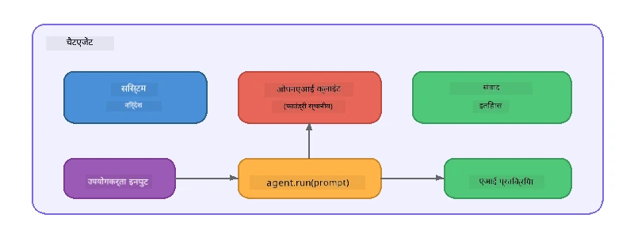

# भाग 5: एजेंट फ्रेमवर्क के साथ AI एजेंट बनाना

> **लक्ष्य:** Foundry Local के माध्यम से एक स्थानीय मॉडल द्वारा संचालित, लगातार निर्देशों और एक परिभाषित व्यक्तित्व वाले अपने पहले AI एजेंट का निर्माण करें।

## AI एजेंट क्या है?

एक AI एजेंट एक भाषा मॉडल को **सिस्टम निर्देशों** के साथ रैप करता है जो इसके व्यवहार, व्यक्तित्व, और सीमाओं को परिभाषित करते हैं। एकल चैट पूर्णता कॉल के विपरीत, एक एजेंट प्रदान करता है:

- **व्यक्तित्व** - एक सुसंगत पहचान ("आप एक मददगार कोड समीक्षक हैं")
- **स्मृति** - टर्न्स में बातचीत का इतिहास
- **विशेषीकरण** - अच्छी तरह से बनाए गए निर्देशों से संचालित फोकस्ड व्यवहार



---

## माइक्रोसॉफ्ट एजेंट फ्रेमवर्क

**Microsoft Agent Framework** (AGF) एक मानक एजेंट अमूर्तता प्रदान करता है जो विभिन्न मॉडल बैकेंड्स पर काम करता है। इस वर्कशॉप में हम इसे Foundry Local के साथ जोड़ते हैं ताकि सब कुछ आपकी मशीन पर चले - कोई क्लाउड आवश्यक नहीं।

| अवधारणा | विवरण |
|---------|-------------|
| `FoundryLocalClient` | Python: सेवा प्रारंभ, मॉडल डाउनलोड/लोड संभालता है, और एजेंट बनाता है |
| `client.as_agent()` | Python: Foundry Local क्लाइंट से एक एजेंट बनाता है |
| `AsAIAgent()` | C#: `ChatClient` पर एक्सटेंशन मेथड - एक `AIAgent` बनाता है |
| `instructions` | सिस्टम प्रॉम्प्ट जो एजेंट के व्यवहार को आकार देता है |
| `name` | मानव-पठनीय लेबल, मल्टी-एजेंट परिदृश्यों में उपयोगी |
| `agent.run(prompt)` / `RunAsync()` | उपयोगकर्ता संदेश भेजता है और एजेंट की प्रतिक्रिया लौटाता है |

> **नोट:** एजेंट फ्रेमवर्क के पास Python और .NET SDK हैं। जावास्क्रिप्ट के लिए, हम एक हल्का `ChatAgent` क्लास लागू करते हैं जो OpenAI SDK का सीधे उपयोग करते हुए समान पैटर्न को निभाता है।

---

## अभ्यास

### अभ्यास 1 - एजेंट पैटर्न को समझें

कोड लिखने से पहले, एक एजेंट के मुख्य घटकों का अध्ययन करें:

1. **मॉडल क्लाइंट** - Foundry Local के OpenAI-अनुकूल API से जुड़ता है
2. **सिस्टम निर्देश** - "व्यक्तित्व" प्रॉम्प्ट
3. **रन लूप** - उपयोगकर्ता इनपुट भेजें, आउटपुट प्राप्त करें

> **सोचिए:** सिस्टम निर्देश एक सामान्य उपयोगकर्ता संदेश से कैसे भिन्न होते हैं? यदि आप उन्हें बदलते हैं तो क्या होता है?

---

### अभ्यास 2 - सिंगल-एजेंट उदाहरण चलाएं

<details>
<summary><strong>🐍 Python</strong></summary>

**पूर्व आवश्यकताएँ:**
```bash
cd python
python -m venv venv

# विंडोज़ (पॉवरशेल):
venv\Scripts\Activate.ps1
# मैकओएस:
source venv/bin/activate

pip install -r requirements.txt
```

**चलाएं:**
```bash
python foundry-local-with-agf.py
```

**कोड वॉकथ्रू** (`python/foundry-local-with-agf.py`):

```python
import asyncio
from agent_framework_foundry_local import FoundryLocalClient

async def main():
    alias = "phi-4-mini"

    # FoundryLocalClient सेवा प्रारंभ, मॉडल डाउनलोड, और लोडिंग को संभालता है
    client = FoundryLocalClient(model_id=alias)
    print(f"Client Model ID: {client.model_id}")

    # सिस्टम निर्देशों के साथ एक एजेंट बनाएं
    agent = client.as_agent(
        name="Joker",
        instructions="You are good at telling jokes.",
    )

    # नॉन-स्ट्रीमिंग: एक बार में पूरा उत्तर प्राप्त करें
    result = await agent.run("Tell me a joke about a pirate.")
    print(f"Agent: {result}")

    # स्ट्रीमिंग: जैसे-जैसे परिणाम उत्पन्न होते हैं, उन्हें प्राप्त करें
    async for chunk in agent.run("Tell me another joke.", stream=True):
        if chunk.text:
            print(chunk.text, end="", flush=True)

asyncio.run(main())
```

**मुख्य बिंदु:**
- `FoundryLocalClient(model_id=alias)` सेवा शुरू करता है, डाउनलोड और मॉडल लोडिंग एक ही कदम में संभालता है
- `client.as_agent()` सिस्टम निर्देशों और नाम के साथ एक एजेंट बनाता है
- `agent.run()` गैर-स्ट्रीमिंग और स्ट्रीमिंग दोनों मोड्स का समर्थन करता है
- `pip install agent-framework-foundry-local --pre` के जरिए इंस्टॉल करें

</details>

<details>
<summary><strong>📦 JavaScript</strong></summary>

**पूर्व आवश्यकताएँ:**
```bash
cd javascript
npm install
```

**चलाएं:**
```bash
node foundry-local-with-agent.mjs
```

**कोड वॉकथ्रू** (`javascript/foundry-local-with-agent.mjs`):

```javascript
import { OpenAI } from "openai";
import { FoundryLocalManager } from "foundry-local-sdk";

class ChatAgent {
  constructor({ client, modelId, instructions, name }) {
    this.client = client;
    this.modelId = modelId;
    this.instructions = instructions;
    this.name = name;
    this.history = [];
  }

  async run(userMessage) {
    const messages = [
      { role: "system", content: this.instructions },
      ...this.history,
      { role: "user", content: userMessage },
    ];
    const response = await this.client.chat.completions.create({
      model: this.modelId,
      messages,
    });
    const assistantMessage = response.choices[0].message.content;

    // बहु-चरणीय बातचीत के लिए वार्तालाप इतिहास रखें
    this.history.push({ role: "user", content: userMessage });
    this.history.push({ role: "assistant", content: assistantMessage });
    return { text: assistantMessage };
  }
}

async function main() {
  FoundryLocalManager.create({ appName: "FoundryLocalWorkshop" });
  const manager = FoundryLocalManager.instance;
  await manager.startWebService();

  const catalog = manager.catalog;
  const model = await catalog.getModel("phi-3.5-mini");
  if (!model.isCached) {
    console.log("Downloading model: phi-3.5-mini...");
    await model.download();
  }
  await model.load();

  const client = new OpenAI({
    baseURL: manager.urls[0] + "/v1",
    apiKey: "foundry-local",
  });

  const agent = new ChatAgent({
    client,
    modelId: model.id,
    instructions: "You are good at telling jokes.",
    name: "Joker",
  });

  const result = await agent.run("Tell me a joke about a pirate.");
  console.log(result.text);
}

main();
```

**मुख्य बिंदु:**
- जावास्क्रिप्ट अपना खुद का `ChatAgent` क्लास बनाता है जो Python AGF पैटर्न की नकल करता है
- `this.history` बातचीत के टर्न्स को मल्टी-टर्न समर्थन के लिए संग्रहीत करता है
- स्पष्ट `startWebService()` → कैश जांच → `model.download()` → `model.load()` पूरी दृश्यता प्रदान करता है

</details>

<details>
<summary><strong>💜 C#</strong></summary>

**पूर्व आवश्यकताएँ:**
```bash
cd csharp
dotnet restore
```

**चलाएं:**
```bash
dotnet run agent
```

**कोड वॉकथ्रू** (`csharp/SingleAgent.cs`):

```csharp
using Microsoft.AI.Foundry.Local;
using Microsoft.Extensions.Logging.Abstractions;
using Microsoft.Agents.AI;
using OpenAI;
using System.ClientModel;

// 1. Start Foundry Local and load a model
var alias = "phi-3.5-mini";
await FoundryLocalManager.CreateAsync(
    new Configuration
    {
        AppName = "FoundryLocalSamples",
        Web = new Configuration.WebService { Urls = "http://127.0.0.1:0" }
    }, NullLogger.Instance, default);
var manager = FoundryLocalManager.Instance;
await manager.StartWebServiceAsync(default);

var catalog = await manager.GetCatalogAsync(default);
var model = await catalog.GetModelAsync(alias, default);

var isCached = await model.IsCachedAsync(default);
if (!isCached)
{
    Console.WriteLine($"Downloading model: {alias}...");
    await model.DownloadAsync(null, default);
}
await model.LoadAsync(default);

var key = new ApiKeyCredential("foundry-local");
var client = new OpenAIClient(key, new OpenAIClientOptions
{
    Endpoint = new Uri(manager.Urls[0] + "/v1")
});

// 2. Create an AIAgent using the Agent Framework extension method
AIAgent joker = client
    .GetChatClient(model.Id)
    .AsAIAgent(
        instructions: "You are good at telling jokes. Keep your jokes short and family-friendly.",
        name: "Joker"
    );

// 3. Run the agent (non-streaming)
var response = await joker.RunAsync("Tell me a joke about a pirate.");
Console.WriteLine($"Joker: {response}");

// 4. Run with streaming
await foreach (var update in joker.RunStreamingAsync("Tell me another joke."))
{
    Console.Write(update);
}
```

**मुख्य बिंदु:**
- `AsAIAgent()` `Microsoft.Agents.AI.OpenAI` से एक एक्सटेंशन मेथड है - किसी कस्टम `ChatAgent` क्लास की आवश्यकता नहीं
- `RunAsync()` पूरी प्रतिक्रिया लौटाता है; `RunStreamingAsync()` टोकन-बाय-टोकन स्ट्रीम करता है
- `dotnet add package Microsoft.Agents.AI.OpenAI --version 1.0.0-rc3` के माध्यम से इंस्टॉल करें

</details>

---

### अभ्यास 3 - व्यक्तित्व बदलें

एजेंट के `instructions` को बदलकर एक अलग व्यक्तित्व बनाएं। प्रत्येक को आजमाएं और देखें कि आउटपुट कैसे बदलता है:

| व्यक्तित्व | निर्देश |
|---------|-------------|
| कोड समीक्षक | `"आप एक विशेषज्ञ कोड समीक्षक हैं। पठनीयता, प्रदर्शन, और सटीकता पर केंद्रित रचनात्मक प्रतिक्रिया दें।"` |
| यात्रा गाइड | `"आप एक दोस्ताना यात्रा गाइड हैं। गंतव्यों, गतिविधियों, और स्थानीय व्यंजनों के लिए व्यक्तिगत सुझाव दें।"` |
| सूकरातिक शिक्षक | `"आप सूकरातिक शिक्षक हैं। कभी सीधे उत्तर न दें - बजाय इसके, सोच-समझ कर सवालों से छात्र का मार्गदर्शन करें।"` |
| तकनीकी लेखक | `"आप एक तकनीकी लेखक हैं। अवधारणाओं को स्पष्ट और संक्षिप्त रूप से समझाएं। उदाहरणों का उपयोग करें। जारगन से बचें।"` |

**आजमाएं:**
1. तालिका में से एक व्यक्तित्व चुनें
2. कोड में `instructions` स्ट्रिंग बदलें
3. उपयोगकर्ता प्रॉम्प्ट को मेल खाने के लिए समायोजित करें (जैसे कोड समीक्षक से कोई फ़ंक्शन देखें)
4. उदाहरण फिर चलाएं और आउटपुट की तुलना करें

> **संकेत:** एजेंट की गुणवत्ता निर्देशों पर बहुत निर्भर करती है। विशेष और अच्छी तरह से संरचित निर्देश अस्पष्ट निर्देशों की तुलना में बेहतर परिणाम देते हैं।

---

### अभ्यास 4 - मल्टी-टर्न बातचीत जोड़ें

उदाहरण का विस्तार करें ताकि एक मल्टी-टर्न चैट लूप समर्थित हो जिससे आप एजेंट के साथ संवाद कर सकें।

<details>
<summary><strong>🐍 Python - मल्टी-टर्न लूप</strong></summary>

```python
import asyncio
from agent_framework_foundry_local import FoundryLocalClient

async def main():
    client = FoundryLocalClient(model_id="phi-4-mini")

    agent = client.as_agent(
        name="Assistant",
        instructions="You are a helpful assistant.",
    )

    print("Chat with the agent (type 'quit' to exit):\n")
    while True:
        user_input = input("You: ")
        if user_input.strip().lower() in ("quit", "exit"):
            break
        result = await agent.run(user_input)
        print(f"Agent: {result}\n")

asyncio.run(main())
```

</details>

<details>
<summary><strong>📦 JavaScript - मल्टी-टर्न लूप</strong></summary>

```javascript
import { OpenAI } from "openai";
import { FoundryLocalManager } from "foundry-local-sdk";
import * as readline from "node:readline/promises";

// (अभ्यास 2 से ChatAgent क्लास का पुन: उपयोग करें)

async function main() {
  FoundryLocalManager.create({ appName: "FoundryLocalWorkshop" });
  const manager = FoundryLocalManager.instance;
  await manager.startWebService();

  const catalog = manager.catalog;
  const model = await catalog.getModel("phi-3.5-mini");
  if (!model.isCached) {
    console.log("Downloading model: phi-3.5-mini...");
    await model.download();
  }
  await model.load();

  const client = new OpenAI({
    baseURL: manager.urls[0] + "/v1",
    apiKey: "foundry-local",
  });

  const agent = new ChatAgent({
    client,
    modelId: model.id,
    instructions: "You are a helpful assistant.",
    name: "Assistant",
  });

  const rl = readline.createInterface({
    input: process.stdin,
    output: process.stdout,
  });

  console.log("Chat with the agent (type 'quit' to exit):\n");
  while (true) {
    const userInput = await rl.question("You: ");
    if (["quit", "exit"].includes(userInput.trim().toLowerCase())) break;
    const result = await agent.run(userInput);
    console.log(`Agent: ${result.text}\n`);
  }
  rl.close();
}

main();
```

</details>

<details>
<summary><strong>💜 C# - मल्टी-टर्न लूप</strong></summary>

```csharp
using Microsoft.AI.Foundry.Local;
using Microsoft.Extensions.Logging.Abstractions;
using Microsoft.Agents.AI;
using OpenAI;
using System.ClientModel;

var alias = "phi-3.5-mini";
var config = new Configuration
{
    AppName = "FoundryLocalSamples",
    Web = new Configuration.WebService { Urls = "http://127.0.0.1:0" }
};
await FoundryLocalManager.CreateAsync(config, NullLogger.Instance, default);
var manager = FoundryLocalManager.Instance;
await manager.StartWebServiceAsync(default);

var catalog = await manager.GetCatalogAsync(default);
var model = await catalog.GetModelAsync(alias, default);

var isCached = await model.IsCachedAsync(default);
if (!isCached)
{
    Console.WriteLine($"Downloading model: {alias}...");
    await model.DownloadAsync(null, default);
}
await model.LoadAsync(default);

var key = new ApiKeyCredential("foundry-local");
var client = new OpenAIClient(key, new OpenAIClientOptions
{
    Endpoint = new Uri(manager.Urls[0] + "/v1")
});

AIAgent agent = client
    .GetChatClient(model.Id)
    .AsAIAgent(
        instructions: "You are a helpful assistant.",
        name: "Assistant"
    );

Console.WriteLine("Chat with the agent (type 'quit' to exit):\n");
while (true)
{
    Console.Write("You: ");
    var userInput = Console.ReadLine();
    if (string.IsNullOrWhiteSpace(userInput) ||
        userInput.Equals("quit", StringComparison.OrdinalIgnoreCase) ||
        userInput.Equals("exit", StringComparison.OrdinalIgnoreCase))
        break;

    var result = await agent.RunAsync(userInput);
    Console.WriteLine($"Agent: {result}\n");
}
```

</details>

ध्यान दें कि एजेंट पिछले टर्न्स को याद रखता है - एक फॉलो-अप प्रश्न पूछें और देखें कि संदर्भ कैसे बना रहता है।

---

### अभ्यास 5 - संरचित आउटपुट

एजेंट को हमेशा एक विशिष्ट प्रारूप (जैसे JSON) में उत्तर देने का निर्देश दें और परिणाम पार्स करें:

<details>
<summary><strong>🐍 Python - JSON आउटपुट</strong></summary>

```python
import asyncio
import json
from agent_framework_foundry_local import FoundryLocalClient

async def main():
    client = FoundryLocalClient(model_id="phi-4-mini")

    agent = client.as_agent(
        name="SentimentAnalyzer",
        instructions=(
            "You are a sentiment analysis agent. "
            "For every user message, respond ONLY with valid JSON in this format: "
            '{"sentiment": "positive|negative|neutral", "confidence": 0.0-1.0, "summary": "brief reason"}'
        ),
    )

    result = await agent.run("I absolutely loved the new restaurant downtown!")
    print("Raw:", result)

    try:
        parsed = json.loads(str(result))
        print(f"Sentiment: {parsed['sentiment']} (confidence: {parsed['confidence']})")
    except json.JSONDecodeError:
        print("Agent did not return valid JSON - try refining the instructions.")

asyncio.run(main())
```

</details>

<details>
<summary><strong>💜 C# - JSON आउटपुट</strong></summary>

```csharp
using System.Text.Json;

AIAgent analyzer = chatClient.AsAIAgent(
    name: "SentimentAnalyzer",
    instructions:
        "You are a sentiment analysis agent. " +
        "For every user message, respond ONLY with valid JSON in this format: " +
        "{\"sentiment\": \"positive|negative|neutral\", \"confidence\": 0.0-1.0, \"summary\": \"brief reason\"}"
);

var response = await analyzer.RunAsync("I absolutely loved the new restaurant downtown!");
Console.WriteLine($"Raw: {response}");

try
{
    var parsed = JsonSerializer.Deserialize<JsonElement>(response.ToString());
    Console.WriteLine($"Sentiment: {parsed.GetProperty("sentiment")} " +
                      $"(confidence: {parsed.GetProperty("confidence")})");
}
catch (JsonException)
{
    Console.WriteLine("Agent did not return valid JSON - try refining the instructions.");
}
```

</details>

> **नोट:** छोटे स्थानीय मॉडल हमेशा पूरी तरह से मान्य JSON उत्पन्न नहीं कर सकते। आप निर्देशों में एक उदाहरण शामिल करके और अपेक्षित प्रारूप के बारे में स्पष्ट होकर विश्वसनीयता बढ़ा सकते हैं।

---

## मुख्य निष्कर्ष

| अवधारणा | आपने क्या सीखा |
|---------|-----------------|
| एजेंट बनाम कच्चा LLM कॉल | एजेंट मॉडल को निर्देशों और स्मृति के साथ रैप करता है |
| सिस्टम निर्देश | एजेंट व्यवहार को नियंत्रित करने का सबसे महत्वपूर्ण लीवर |
| मल्टी-टर्न बातचीत | एजेंट कई उपयोगकर्ता इंटरैक्शन में संदर्भ रख सकते हैं |
| संरचित आउटपुट | निर्देश आउटपुट प्रारूप लागू कर सकते हैं (JSON, मार्कडाउन, आदि) |
| स्थानीय निष्पादन | सब कुछ Foundry Local के माध्यम से डिवाइस पर चलता है - कोई क्लाउड आवश्यक नहीं |

---

## अगले कदम

**[भाग 6: मल्टी-एजेंट वर्कफ्लोज़](part6-multi-agent-workflows.md)** में, आप कई एजेंटों को एक समन्वित पाइपलाइन में संयोजित करेंगे जहां प्रत्येक एजेंट का एक विशेषीकृत रोल होगा।