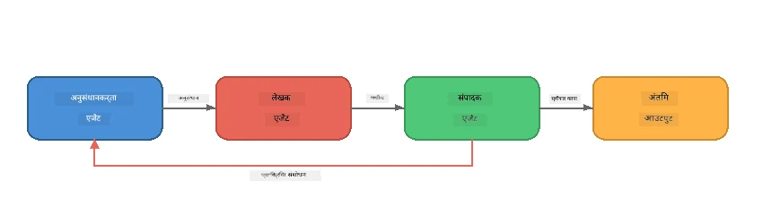
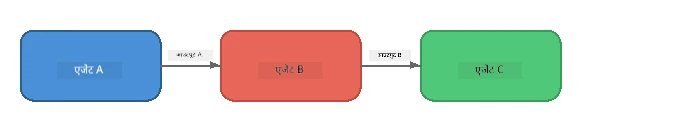
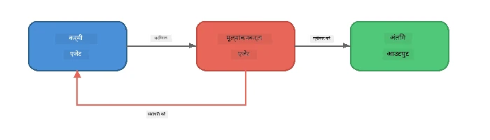
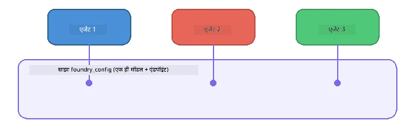

# भाग 6: मल्टी-एजेंट वर्कफ़्लोज़

> **लक्ष्य:** कई विशिष्ट एजेंट्स को समन्वित पाइपलाइनों में मिलाएं जो सहयोगी एजेंट्स के बीच जटिल कार्यों का विभाजन करें - यह सब Foundry Local के साथ स्थानीय रूप से चलता है।

## मल्टी-एजेंट क्यों?

एक अकेला एजेंट कई कार्य संभाल सकता है, लेकिन जटिल वर्कफ़्लोज़ को **विशेषीकरण** का लाभ होता है। एक एजेंट के रिसर्च, लेखन, और संपादन एक साथ करने की बजाय, आप काम को केंद्रित भूमिकाओं में विभाजित करते हैं:



| पैटर्न | विवरण |
|---------|-------------|
| **अनुक्रमिक** | एजेंट A का आउटपुट एजेंट B → एजेंट C में जाता है |
| **फीडबैक लूप** | एक मूल्यांकन एजेंट काम को संशोधन के लिए वापस भेज सकता है |
| **साझा संदर्भ** | सभी एजेंट एक ही मॉडल/एंडपॉइंट का उपयोग करते हैं, लेकिन अलग निर्देशों के साथ |
| **टाइप किया हुआ आउटपुट** | एजेंट संरचित परिणाम (JSON) उत्पन्न करते हैं ताकि विश्वसनीय हस्तांतरण हो सके |

---

## अभ्यास

### अभ्यास 1 - मल्टी-एजेंट पाइपलाइन चलाएं

कार्यशाला में एक पूरा Researcher → Writer → Editor वर्कफ़्लो शामिल है।

<details>
<summary><strong>🐍 पायथन</strong></summary>

**सेटअप:**
```bash
cd python
python -m venv venv

# विंडोज़ (पॉवरशेल):
venv\Scripts\Activate.ps1
# मैकओएस:
source venv/bin/activate

pip install -r requirements.txt
```

**चलाएं:**
```bash
python foundry-local-multi-agent.py
```

**क्या होता है:**
1. **Researcher** को विषय मिलता है और वह बुलेट-पॉइंट तथ्यों को लौटाता है
2. **Writer** रिसर्च लेकर ब्लॉग पोस्ट का मसौदा तैयार करता है (3-4 पैराग्राफ़)
3. **Editor** लेख की गुणवत्ता की समीक्षा करता है और ACCEPT या REVISE लौटाता है

</details>

<details>
<summary><strong>📦 जावास्क्रिप्ट</strong></summary>

**सेटअप:**
```bash
cd javascript
npm install
```

**चलाएं:**
```bash
node foundry-local-multi-agent.mjs
```

**वही तीन-चरणीय पाइपलाइन** - Researcher → Writer → Editor।

</details>

<details>
<summary><strong>💜 C#</strong></summary>

**सेटअप:**
```bash
cd csharp
dotnet restore
```

**चलाएं:**
```bash
dotnet run multi
```

**वही तीन-चरणीय पाइपलाइन** - Researcher → Writer → Editor।

</details>

---

### अभ्यास 2 - पाइपलाइन की संरचना

देखें कि एजेंट कैसे परिभाषित और जुड़े हुए हैं:

**1. साझा मॉडल क्लाइंट**

सभी एजेंट एक ही Foundry Local मॉडल साझा करते हैं:

```python
# Python - FoundryLocalClient सब कुछ संभालता है
from agent_framework_foundry_local import FoundryLocalClient

client = FoundryLocalClient(model_id="phi-3.5-mini")
```

```javascript
// JavaScript - OpenAI SDK फाउंड्री लोकल की ओर इशारा कर रहा है
const client = new OpenAI({
  baseURL: manager.urls[0] + "/v1",
  apiKey: "foundry-local",
});
```

```csharp
// C# - OpenAIClient pointed at Foundry Local
var key = new ApiKeyCredential("foundry-local");
var client = new OpenAIClient(key, new OpenAIClientOptions
{
    Endpoint = new Uri(manager.Urls[0] + "/v1")
});
var chatClient = client.GetChatClient(model.Id);
```

**2. विशिष्ट निर्देश**

प्रत्येक एजेंट की अलग पर्सोना है:

| एजेंट | निर्देश (संक्षेप) |
|-------|----------------------|
| Researcher | "प्रमुख तथ्य, आँकड़े, और पृष्ठभूमि प्रदान करें। इन्हें बुलेट पॉइंट्स में व्यवस्थित करें।" |
| Writer | "रिसर्च नोट्स से एक आकर्षक ब्लॉग पोस्ट (3-4 पैराग्राफ़) लिखें। तथ्यों का आविष्कार न करें।" |
| Editor | "स्पष्टता, व्याकरण और तथ्यात्मक सुसंगतता की समीक्षा करें। निर्णय: ACCEPT या REVISE।" |

**3. एजेंटों के बीच डेटा प्रवाह**

```python
# चरण 1 - शोधकर्ता का आउटपुट लेखक के लिए इनपुट बन जाता है
research_result = await researcher.run(f"Research: {topic}")

# चरण 2 - लेखक का आउटपुट संपादक के लिए इनपुट बन जाता है
writer_result = await writer.run(f"Write using:\n{research_result}")

# चरण 3 - संपादक शोध और लेख दोनों की समीक्षा करता है
editor_result = await editor.run(
    f"Research:\n{research_result}\n\nArticle:\n{writer_result}"
)
```

```csharp
// C# - same pattern, async calls with AIAgent
var researchNotes = await researcher.RunAsync(
    $"Research the following topic and provide key facts:\n{topic}");

var draft = await writer.RunAsync(
    $"Write a blog post based on these research notes:\n\n{researchNotes}");

var verdict = await editor.RunAsync(
    $"Review this article for quality and accuracy.\n\n" +
    $"Research notes:\n{researchNotes}\n\n" +
    $"Article:\n{draft}");
```

> **मुख्य अंतर्दृष्टि:** प्रत्येक एजेंट को पिछले एजेंटों का संचयी संदर्भ प्राप्त होता है। संपादक दोनों - मूल रिसर्च और ड्राफ्ट - देखता है ताकि वह तथ्यात्मक सुसंगतता जांच सके।

---

### अभ्यास 3 - चौथा एजेंट जोड़ें

पाइपलाइन का विस्तार करें एक नए एजेंट को जोड़कर। चुनें एक:

| एजेंट | उद्देश्य | निर्देश |
|-------|---------|-------------|
| **Fact-Checker** | लेख के दावों का सत्यापन करें | `"आप तथ्यात्मक दावों को सत्यापित करते हैं। प्रत्येक दावे के लिए बताएं कि वह रिसर्च नोट्स द्वारा समर्थित है या नहीं। सत्यापित/असत्यापित आइटम वाले JSON लौटाएं।"` |
| **Headline Writer** | आकर्षक शीर्षक बनाएं | `"लेख के लिए 5 शीर्षक विकल्प उत्पन्न करें। शैली में विविधता: सूचनात्मक, क्लिकबैट, प्रश्न, सूची, भावनात्मक।"` |
| **Social Media** | प्रचारात्मक पोस्ट बनाएं | `"इस लेख को प्रचारित करने वाले 3 सोशल मीडिया पोस्ट बनाएं: एक Twitter के लिए (280 अक्षर), एक LinkedIn के लिए (पेशेवर स्वर), और एक Instagram के लिए (सहज, इमोजी सुझाव के साथ)।"` |

<details>
<summary><strong>🐍 पायथन - Headline Writer जोड़ना</strong></summary>

```python
headline_agent = client.as_agent(
    name="HeadlineWriter",
    instructions=(
        "You are a headline specialist. Given an article, generate exactly "
        "5 headline options. Vary the style: informative, question-based, "
        "listicle, emotional, and provocative. Return them as a numbered list."
    ),
)

# संपादक द्वारा स्वीकार करने के बाद, शीर्षक उत्पन्न करें
headline_result = await headline_agent.run(
    f"Generate headlines for this article:\n\n{writer_result}"
)
print(f"\n--- Headlines ---\n{headline_result}")
```

</details>

<details>
<summary><strong>📦 जावास्क्रिप्ट - Headline Writer जोड़ना</strong></summary>

```javascript
const headlineAgent = new ChatAgent({
  client,
  modelId: modelInfo.id,
  instructions:
    "You are a headline specialist. Given an article, generate exactly " +
    "5 headline options. Vary the style: informative, question-based, " +
    "listicle, emotional, and provocative. Return them as a numbered list.",
  name: "HeadlineWriter",
});

const headlineResult = await headlineAgent.run(
  `Generate headlines for this article:\n\n${writerResult.text}`
);
console.log(`\n--- Headlines ---\n${headlineResult.text}`);
```

</details>

<details>
<summary><strong>💜 C# - Headline Writer जोड़ना</strong></summary>

```csharp
AIAgent headlineAgent = chatClient.AsAIAgent(
    name: "HeadlineWriter",
    instructions:
        "You are a headline specialist. Given an article, generate exactly " +
        "5 headline options. Vary the style: informative, question-based, " +
        "listicle, emotional, and provocative. Return them as a numbered list."
);

// After the editor accepts, generate headlines
var headlines = await headlineAgent.RunAsync(
    $"Generate headlines for this article:\n\n{draft}");
Console.WriteLine($"\n--- Headlines ---\n{headlines}");
```

</details>

---

### अभ्यास 4 - अपनी स्वयं की वर्कफ़्लो डिजाइन करें

एक अलग डोमेन के लिए मल्टी-एजेंट पाइपलाइन डिज़ाइन करें। यहाँ कुछ आइडियाज हैं:

| डोमेन | एजेंट | फ्लो |
|--------|--------|------|
| **कोड समीक्षा** | Analyser → Reviewer → Summariser | कोड संरचना का विश्लेषण → मुद्दों की समीक्षा → सारांश रिपोर्ट बनाएं |
| **कस्टमर सपोर्ट** | Classifier → Responder → QA | टिकट वर्गीकरण → प्रतिक्रिया मसौदा → गुणवत्ता जांच |
| **शिक्षा** | Quiz Maker → Student Simulator → Grader | क्विज़ जनरेट करें → उत्तर सिमुलेट करें → ग्रेड और व्याख्या करें |
| **डेटा विश्लेषण** | Interpreter → Analyst → Reporter | डेटा अनुरोध की व्याख्या करें → पैटर्न विश्लेषण करें → रिपोर्ट लिखें |

**कदम:**
1. 3+ एजेंट परिभाषित करें जिनके अलग `निर्देश` हों
2. डेटा फ्लो तय करें - प्रत्येक एजेंट क्या प्राप्त और उत्पादन करता है?
3. अभ्यास 1-3 के पैटर्न का उपयोग करके पाइपलाइन लागू करें
4. यदि कोई एजेंट अन्य के काम का मूल्यांकन करता है तो फीडबैक लूप जोड़ें

---

## संचालन पैटर्न

यहाँ संचालन के पैटर्न हैं जो किसी भी मल्टी-एजेंट सिस्टम पर लागू होते हैं ([भाग 7](part7-zava-creative-writer.md) में विस्तार से):

### अनुक्रमिक पाइपलाइन



प्रत्येक एजेंट पिछले एजेंट के आउटपुट को प्रक्रिया करता है। सरल और पूर्वानुमेय।

### फीडबैक लूप



एक मूल्यांकन एजेंट पहले के चरणों को पुनः निष्पादित करने के लिए ट्रिगर कर सकता है। Zava Writer इसका उपयोग करता है: संपादक रिसर्चर और राइटर को फीडबैक वापस भेज सकता है।

### साझा संदर्भ



सभी एजेंट एक ही `foundry_config` साझा करते हैं ताकि वे एक ही मॉडल और एंडपॉइंट का उपयोग करें।

---

## मुख्य निष्कर्ष

| अवधारणा | आप ने क्या सीखा |
|---------|-----------------|
| एजेंट विशेषीकरण | प्रत्येक एजेंट केंद्रित निर्देशों के साथ एक काम अच्छे से करता है |
| डेटा हेंडऑफ़ | एक एजेंट का आउटपुट अगले का इनपुट बनता है |
| फीडबैक लूप | एक मूल्यांकनकर्ता उच्च गुणवत्ता के लिए पुनः प्रयास को ट्रिगर कर सकता है |
| संरचित आउटपुट | JSON-फॉर्मेटेड प्रतिक्रियाएँ एजेंट-से-एजेंट विश्वसनीय संचार सक्षम करती हैं |
| संचालन | एक समन्वयक पाइपलाइन अनुक्रम और त्रुटि प्रबंधन संभालता है |
| उत्पादन पैटर्न | [भाग 7: Zava Creative Writer](part7-zava-creative-writer.md) में लागू किए गए |

---

## अगले कदम

[भाग 7: Zava Creative Writer - कैपस्टोन एप्लिकेशन](part7-zava-creative-writer.md) पर जाएं और देखें कि कैसे एक प्रोडक्शन-शैली मल्टी-एजेंट ऐप 4 विशिष्ट एजेंटों, स्ट्रीमिंग आउटपुट, उत्पाद खोज, और फीडबैक लूप्स के साथ बनाया जाता है - जो Python, JavaScript, और C# में उपलब्ध है।