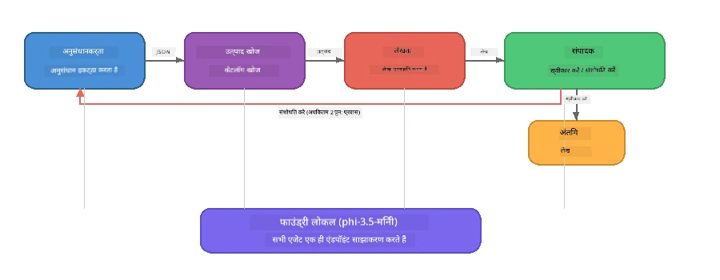

# भाग 7: Zava Creative Writer - कैपस्टोन एप्लिकेशन

> **लक्ष्य:** एक उत्पादन-शैली वाली मल्टी-एजेंट एप्लिकेशन का अन्वेषण करें जहाँ चार विशेषज्ञ एजेंट मिलकर Zava Retail DIY के लिए मैगज़ीन-गुणवत्ता वाले लेख उत्पादन करते हैं - जो पूरी तरह से आपके डिवाइस पर Foundry Local के साथ चलता है।

यह कार्यशाला का **कैपस्टोन लैब** है। यह उन सभी चीज़ों को एक साथ लाता है जो आपने सीखी हैं - SDK एकीकरण (भाग 3), स्थानीय डेटा से पुनःप्राप्ति (भाग 4), एजेंट व्यक्ति (भाग 5), और मल्टी-एजेंट ऑर्केस्ट्रेशन (भाग 6) - एक पूर्ण एप्लिकेशन में जो **Python**, **JavaScript**, और **C#** में उपलब्ध है।

---

## आप क्या अन्वेषण करेंगे

| अवधारणा | Zava Writer में कहाँ |
|---------|----------------------|
| 4-स्टेप मॉडल लोडिंग | साझा कॉन्फ़िग मॉड्यूल Foundry Local लॉन्च करता है |
| RAG-शैली पुनःप्राप्ति | उत्पाद एजेंट स्थानीय कैटलॉग खोजता है |
| एजेंट विशेषज्ञता | 4 एजेंट, प्रत्येक के अलग सिस्टम प्रांप्ट |
| स्ट्रीमिंग आउटपुट | लेखक वास्तविक समय में टोकन देता है |
| संरचित हैंड-ऑफ | शोधकर्ता → JSON, संपादक → JSON निर्णय |
| फीडबैक लूप्स | संपादक पुनः-कार्यवाही (अधिकतम 2 प्रयास) शुरू कर सकता है |

---

## वास्तुकला

Zava Creative Writer **मूल्यांकन-चालित फीडबैक के साथ अनुक्रमिक पाइपलाइन** का उपयोग करता है। सभी तीन भाषा संस्करण समान वास्तुकला का पालन करते हैं:



### चार एजेंट

| एजेंट | इनपुट | आउटपुट | उद्देश्य |
|-------|--------|---------|---------|
| **शोधकर्ता** | विषय + वैकल्पिक फीडबैक | `{"web": [{url, name, description}, ...]}` | LLM के माध्यम से पृष्ठभूमि शोध एकत्रित करता है |
| **उत्पाद खोज** | उत्पाद संदर्भ स्ट्रिंग | मेल खाने वाले उत्पादों की सूची | LLM-जनित प्रश्न + स्थानीय कैटलॉग के खिलाफ कीवर्ड खोज |
| **लेखक** | शोध + उत्पाद + असाइनमेंट + फीडबैक | स्ट्रीम किया गया लेख टेक्स्ट (`---` पर विभाजित) | वास्तविक समय में मैगज़ीन-गुणवत्ता वाला लेख प्रारूपित करता है |
| **संपादक** | लेख + लेखक के स्व-फीडबैक | `{"decision": "accept/revise", "editorFeedback": "...", "researchFeedback": "..."}` | गुणवत्ता की समीक्षा करता है, जरूरत पर पुनः प्रयास शुरू करता है |

### पाइपलाइन फ्लो

1. **शोधकर्ता** विषय प्राप्त करता है और संरचित शोध नोट्स (JSON) बनाता है
2. **उत्पाद खोज** LLM-जनित खोज शब्दों का उपयोग कर स्थानीय उत्पाद कैटलॉग में खोज करता है
3. **लेखक** शोध + उत्पाद + असाइनमेंट को मिलाकर स्ट्रीमिंग लेख तैयार करता है, `---` विभाजक के बाद स्व-फीडबैक जोड़ता है
4. **संपादक** लेख की समीक्षा करता है और JSON निर्णय लौटाता है:
   - `"accept"` → पाइपलाइन पूर्ण होती है
   - `"revise"` → फीडबैक शोधकर्ता और लेखक को भेजा जाता है (अधिकतम 2 प्रयास)

---

## आवश्यकताएँ

- पूरा करें [भाग 6: मल्टी-एजेंट वर्कफ़्लोज़](part6-multi-agent-workflows.md)
- Foundry Local CLI इंस्टॉल किया हो और `phi-3.5-mini` मॉडल डाउनलोड किया हो

---

## अभ्यास

### अभ्यास 1 - Zava Creative Writer चलाएँ

अपनी भाषा चुनें और एप्लिकेशन चलाएँ:

<details>
<summary><strong>🐍 Python - FastAPI वेब सेवा</strong></summary>

Python संस्करण एक **वेब सेवा** के रूप में REST API के साथ चलता है, जो उत्पादन बैकएंड निर्माण को दर्शाता है।

**सेटअप:**
```bash
cd zava-creative-writer-local/src/api
python -m venv venv

# विंडोज़ (पॉवरशेल):
venv\Scripts\Activate.ps1
# मैकओएस:
source venv/bin/activate

pip install -r requirements.txt
```

**चालू करें:**
```bash
uvicorn main:app --reload
```

**परीक्षण करें:**
```bash
curl -X POST http://localhost:8000/api/article \
  -H "Content-Type: application/json" \
  -d '{
    "research": "DIY home improvement trends",
    "products": "power tools and paints",
    "assignment": "Write an article about weekend renovation projects for DIY enthusiasts"
  }'
```

प्रतिक्रिया प्रत्येक एजेंट की प्रगति को newline-सीमांकित JSON संदेशों के रूप में स्ट्रीम करती है।

</details>

<details>
<summary><strong>📦 JavaScript - Node.js CLI</strong></summary>

JavaScript संस्करण एक **CLI एप्लिकेशन** के रूप में चलता है, एजेंट प्रगति और लेख सीधे कंसोल पर प्रिंट करता है।

**सेटअप:**
```bash
cd zava-creative-writer-local/src/javascript
npm install
```

**चालू करें:**
```bash
node main.mjs
```

आप देखेंगे:
1. Foundry Local मॉडल लोड हो रहा है (डाउनलोड के दौरान प्रगति पट्टी के साथ)
2. प्रत्येक एजेंट अनुक्रम में निष्पादित होता है, स्थिति संदेशों के साथ
3. लेख वास्तविक समय में कंसोल पर स्ट्रीम हो रहा है
4. संपादक का स्वीकार/संशोधन निर्णय

</details>

<details>
<summary><strong>💜 C# - .NET कंसोल ऐप</strong></summary>

C# संस्करण एक **.NET कंसोल एप्लिकेशन** के रूप में चलता है, समान पाइपलाइन और स्ट्रीमिंग आउटपुट के साथ।

**सेटअप:**
```bash
cd zava-creative-writer-local/src/csharp
dotnet restore
```

**चालू करें:**
```bash
dotnet run
```

JavaScript संस्करण की तरह आउटपुट पैटर्न - एजेंट स्थिति संदेश, स्ट्रीम किया लेख, और संपादक का फैसला।

</details>

---

### अभ्यास 2 - कोड संरचना का अध्ययन करें

प्रत्येक भाषा संस्करण में समान तार्किक घटक होते हैं। संरचनाओं की तुलना करें:

**Python** (`src/api/`):
| फ़ाइल | उद्देश्य |
|--------|----------|
| `foundry_config.py` | साझा Foundry Local मैनेजर, मॉडल, और क्लाइंट (4-स्टेप इनिशियलाइज़ेशन) |
| `orchestrator.py` | फीडबैक लूप सहित पाइपलाइन समन्वय |
| `main.py` | FastAPI एंडपॉइंट्स (`POST /api/article`) |
| `agents/researcher/researcher.py` | JSON आउटपुट के साथ LLM-आधारित शोध |
| `agents/product/product.py` | LLM-जनित प्रश्न + कीवर्ड खोज |
| `agents/writer/writer.py` | स्ट्रीमिंग लेख निर्माण |
| `agents/editor/editor.py` | JSON-आधारित स्वीकार/संशोधन निर्णय |

**JavaScript** (`src/javascript/`):
| फ़ाइल | उद्देश्य |
|--------|----------|
| `foundryConfig.mjs` | साझा Foundry Local कॉन्फ़िग (प्रगति पट्टी सहित 4-स्टेप इनिशियलाइज़ेशन) |
| `main.mjs` | ऑर्केस्ट्रेटर + CLI प्रवेश बिंदु |
| `researcher.mjs` | LLM-आधारित शोध एजेंट |
| `product.mjs` | LLM क्वेरी निर्माण + कीवर्ड खोज |
| `writer.mjs` | स्ट्रीमिंग लेख निर्माण (async generator) |
| `editor.mjs` | JSON स्वीकार/संशोधन निर्णय |
| `products.mjs` | उत्पाद कैटलॉग डेटा |

**C#** (`src/csharp/`):
| फ़ाइल | उद्देश्य |
|---------|----------|
| `Program.cs` | पूर्ण पाइपलाइन: मॉडल लोडिंग, एजेंट, ऑर्केस्ट्रेटर, फीडबैक लूप |
| `ZavaCreativeWriter.csproj` | Foundry Local + OpenAI पैकेजेस के साथ .NET 9 प्रोजेक्ट |

> **डिज़ाइन नोट:** Python प्रत्येक एजेंट को अलग फ़ाइल/डायरेक्टरी में रखता है (बड़ी टीमों के लिए अच्छा)। JavaScript एजेंट प्रति माड्यूल का उपयोग करता है (मध्यम परियोजनाओं के लिए उपयुक्त)। C# सब कुछ एक फ़ाइल में रखता है स्थानीय फ़ंक्शन के साथ (स्वयं-निहित उदाहरणों के लिए अच्छा)। उत्पादन में, अपनी टीम की प्रथाओं के अनुसार पैटर्न चुनें।

---

### अभ्यास 3 - साझा कॉन्फ़िगरेशन ट्रेस करें

पाइपलाइन के हर एजेंट के लिए एक ही Foundry Local मॉडल क्लाइंट साझा किया जाता है। देखें कि हर भाषा में इसे कैसे सेट किया गया है:

<details>
<summary><strong>🐍 Python - foundry_config.py</strong></summary>

```python
from foundry_local import FoundryLocalManager

MODEL_ALIAS = "phi-3.5-mini"

# चरण 1: प्रबंधक बनाएं और Foundry Local सेवा शुरू करें
manager = FoundryLocalManager()
manager.start_service()

# चरण 2: जांचें कि मॉडल पहले से डाउनलोड है या नहीं
cached = manager.list_cached_models()
catalog_info = manager.get_model_info(MODEL_ALIAS)
is_cached = any(m.id == catalog_info.id for m in cached) if catalog_info else False

if not is_cached:
    manager.download_model(MODEL_ALIAS)

# चरण 3: मॉडल को मेमोरी में लोड करें
manager.load_model(MODEL_ALIAS)
model_id = manager.get_model_info(MODEL_ALIAS).id

# साझा OpenAI क्लाइंट
client = openai.OpenAI(base_url=manager.endpoint, api_key=manager.api_key)
```

सभी एजेंट `from foundry_config import client, model_id` इम्पोर्ट करते हैं।

</details>

<details>
<summary><strong>📦 JavaScript - foundryConfig.mjs</strong></summary>

```javascript
import { FoundryLocalManager } from "foundry-local-sdk";
import { OpenAI } from "openai";

FoundryLocalManager.create({ appName: "ZavaCreativeWriter" });
const manager = FoundryLocalManager.instance;
await manager.startWebService();

// कैश जांचें → डाउनलोड करें → लोड करें (नया SDK पैटर्न)
const catalog = manager.catalog;
const model = await catalog.getModel(MODEL_ALIAS);
if (!model.isCached) {
  console.log(`Downloading model: ${MODEL_ALIAS}...`);
  await model.download();
}
await model.load();

const client = new OpenAI({ baseURL: manager.urls[0] + "/v1", apiKey: "foundry-local" });
const modelId = model.id;
export { client, modelId };
```

सभी एजेंट `{ client, modelId } from "./foundryConfig.mjs"` इम्पोर्ट करते हैं।

</details>

<details>
<summary><strong>💜 C# - Program.cs का शीर्षक</strong></summary>

```csharp
await FoundryLocalManager.CreateAsync(
    new Configuration
    {
        AppName = "ZavaCreativeWriter",
        Web = new Configuration.WebService { Urls = "http://127.0.0.1:0" }
    }, NullLogger.Instance, default);
var manager = FoundryLocalManager.Instance;
await manager.StartWebServiceAsync(default);

var catalog = await manager.GetCatalogAsync(default);
var catalogModel = await catalog.GetModelAsync(alias, default);
var isCached = await catalogModel.IsCachedAsync(default);
if (!isCached)
    await catalogModel.DownloadAsync(null, default);

await catalogModel.LoadAsync(default);
var key = new ApiKeyCredential("foundry-local");
var chatClient = new OpenAIClient(key, new OpenAIClientOptions
{
    Endpoint = new Uri(manager.Urls[0] + "/v1")
}).GetChatClient(catalogModel.Id);
```

`chatClient` को फिर उसी फ़ाइल में सभी एजेंट फंक्शन्स को पास किया जाता है।

</details>

> **महत्वपूर्ण पैटर्न:** मॉडल लोडिंग पैटर्न (सेवा प्रारंभ → कैश जांच → डाउनलोड → लोड) उपयोगकर्ता को स्पष्ट प्रगति दिखाता है और मॉडल को केवल एक बार डाउनलोड करता है। यह किसी भी Foundry Local एप्लिकेशन के लिए सर्वोत्तम प्रैक्टिस है।

---

### अभ्यास 4 - फीडबैक लूप समझें

फीडबैक लूप इसे "स्मार्ट" बनाता है - संपादक कार्य को संशोधन के लिए वापस भेज सकता है। लॉजिक देखें:

```
Orchestrator:
  1. researcher.research(topic, "No Feedback")    ← first pass
  2. product.findProducts(productContext)
  3. writer.write(research, products, assignment)  ← streams article
  4. Split article at "---" → article + writerFeedback
  5. editor.edit(article, writerFeedback)

  WHILE editor says "revise" AND retryCount < 2:
    6. researcher.research(topic, editor.researchFeedback)  ← refined
    7. writer.write(research, products, editor.editorFeedback)
    8. editor.edit(newArticle, newWriterFeedback)
    9. retryCount++
```

**सोचने के लिए प्रश्न:**
- पुनः प्रयास सीमा 2 क्यों निर्धारित है? यदि आप इसे बढ़ाते हैं तो क्या होगा?
- शोधकर्ता को `researchFeedback` क्यों मिलता है जबकि लेखक को `editorFeedback`?
- यदि संपादक हमेशा "revise" कहता है तो क्या होगा?

---

### अभ्यास 5 - किसी एजेंट को संशोधित करें

किसी एजेंट के व्यवहार में बदलाव करें और देखें कि पाइपलाइन पर इसका क्या प्रभाव पड़ता है:

| संशोधन | क्या बदलना है |
|---------|---------------|
| **कठोर संपादक** | संपादक के सिस्टम प्रांप्ट को हमेशा कम से कम एक संशोधन मांगने के लिए बदलें |
| **लंबे लेख** | लेखक के प्रांप्ट को "800-1000 शब्द" से बदलकर "1500-2000 शब्द" करें |
| **भिन्न उत्पाद** | उत्पाद कैटलॉग में उत्पाद जोड़ें या संशोधित करें |
| **नया शोध विषय** | डिफ़ॉल्ट `researchContext` को किसी अन्य विषय में बदलें |
| **केवल JSON शोधकर्ता** | शोधकर्ता को 3-5 की बजाय 10 आइटम लौटाने के लिए बनाएं |

> **टिप:** चूंकि सभी तीन भाषाओं में समान वास्तुकला है, आप अपने मनपसंद भाषा में एक ही संशोधन कर सकते हैं।

---

### अभ्यास 6 - पाँचवा एजेंट जोड़ें

पाइपलाइन में नया एजेंट जोड़ें। कुछ विचार:

| एजेंट | पाइपलाइन में कहाँ | उद्देश्य |
|--------|-------------------|------------|
| **फैक्ट-चेकर** | लेखक के बाद, संपादक से पहले | शोध डेटा के खिलाफ दावों को सत्यापित करें |
| **SEO ऑप्टिमाइज़र** | जब संपादक स्वीकार करता है | मेटा वर्णन, कीवर्ड, स्लग जोड़ें |
| **इलस्ट्रेटर** | जब संपादक स्वीकार करता है | लेख के लिए चित्र प्रांप्ट बनाएं |
| **अनुवादक** | जब संपादक स्वीकार करता है | लेख को दूसरी भाषा में अनुवादित करें |

**कदम:**
1. एजेंट का सिस्टम प्रांप्ट लिखें
2. एजेंट फ़ंक्शन बनाएँ (अपने भाषा के मौजूदा पैटर्न के अनुरूप)
3. इसे ऑर्केस्ट्रेटर में सही बिंदु पर डालें
4. आउटपुट/लॉगिंग अपडेट करें ताकि नए एजेंट का योगदान दिखे

---

## Foundry Local और एजेंट फ्रेमवर्क कैसे साथ काम करते हैं

यह एप्लिकेशन Foundry Local के साथ मल्टी-एजेंट सिस्टम बनाने के लिए अनुशंसित पैटर्न दिखाता है:

| स्तर | घटक | भूमिका |
|-------|-------|----------|
| **रनटाइम** | Foundry Local | मॉडल डाउनलोड, प्रबंधन और स्थानीय रूप से सेवा देना |
| **क्लाइंट** | OpenAI SDK | स्थानीय एन्डपॉइंट पर चैट पूरक भेजना |
| **एजेंट** | सिस्टम प्रांप्ट + चैट कॉल | केंद्रित निर्देशों के माध्यम से विशेषज्ञ व्यवहार |
| **ऑर्केस्ट्रेटर** | पाइपलाइन समन्वयक | डेटा प्रवाह, क्रम निर्धारण, और फीडबैक लूप प्रबंधन |
| **फ्रेमवर्क** | Microsoft Agent Framework | `ChatAgent` अमूर्तता और पैटर्न प्रदान करता है |

मुख्य अंतर्दृष्टि: **Foundry Local क्लाउड बैकएंड की जगह लेता है, एप्लिकेशन वास्तुकला नहीं।** वही एजेंट पैटर्न, ऑर्केस्ट्रेशन रणनीतियाँ, और संरचित हैंड-ऑफ जो क्लाउड-होस्टेड मॉडल्स के साथ काम करते हैं, स्थानीय मॉडलों के साथ भी समान रूप से काम करते हैं — आपको बस क्लाइंट को Azure एन्डपॉइंट के बजाय स्थानीय एन्डपॉइंट पर पॉइंट करना होता है।

---

## मुख्य सीख

| अवधारणा | आपने क्या सीखा |
|----------|----------------|
| उत्पादन वास्तुकला | साझा कॉन्फ़िग और अलग एजेंट्स के साथ मल्टी-एजेंट ऐप कैसे बनाएं |
| 4-स्टेप मॉडल लोडिंग | उपयोगकर्ता दृश्यमान प्रगति के साथ Foundry Local शुरू करने की सर्वोत्तम प्रथा |
| एजेंट विशेषज्ञता | 4 एजेंट प्रत्येक के केंद्रित निर्देश और विशेष आउटपुट प्रारूप |
| स्ट्रीमिंग निर्माण | लेखक वास्तविक समय में टोकन देता है, प्रतिक्रियाशील UI सक्षम करता है |
| फीडबैक लूप | संपादक-चालित पुनः प्रयास आउटपुट गुणवत्ता को बिना मानव हस्तक्षेप के सुधारता है |
| क्रॉस-भाषा पैटर्न | समान वास्तुकला Python, JavaScript, और C# में काम करती है |
| स्थानीय = उत्पादन-तैयार | Foundry Local वही OpenAI-संगत API देता है जो क्लाउड में उपयोग होता है |

---

## अगला कदम

[भाग 8: मूल्यांकन-नेतृत्व विकास](part8-evaluation-led-development.md) पर जाएं ताकि अपने एजेंट्स के लिए सुनियोजित मूल्यांकन फ़्रेमवर्क बनाएं, स्वर्ण datasets, नियम-आधारित चेक, और LLM-एज़-जज स्कोरिंग का उपयोग करके।