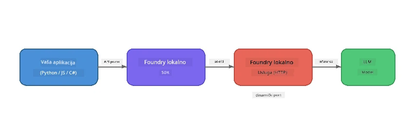

# Dio 1: Početak rada s Foundry Local


## Što je Foundry Local?

[Foundry Local](https://foundrylocal.ai) omogućuje vam pokretanje open-source AI jezičnih modela **izravno na vašem računalu** - bez interneta, bez troškova u oblaku i s potpunom privatnošću podataka. On:

- **Preuzima i pokreće modele lokalno** s automatskom optimizacijom hardvera (GPU, CPU ili NPU)
- **Pruža OpenAI-kompatibilan API** tako da možete koristiti poznate SDK-ove i alate
- **Ne zahtijeva Azure pretplatu** niti prijavu - samo instalirajte i počnite graditi

Zamislite to kao da imate vlastiti privatni AI koji se u potpunosti izvodi na vašem uređaju.

## Ciljevi učenja

Do kraja ovog laboratorija moći ćete:

- Instalirati Foundry Local CLI na svoj operativni sustav
- Razumjeti što su aliasi modela i kako funkcioniraju
- Preuzeti i pokrenuti svoj prvi lokalni AI model
- Poslati chat poruku lokalnom modelu iz komandne linije
- Razumjeti razliku između lokalnih i modela hostanih u oblaku

---

## Preduvjeti

### Sistemskih zahtjevi

| Zahtjev | Minimum | Preporučeno |
|---------|---------|-------------|
| **RAM** | 8 GB | 16 GB |
| **Prostor na disku** | 5 GB (za modele) | 10 GB |
| **CPU** | 4 jezgre | 8+ jezgri |
| **GPU** | Opcionalno | NVIDIA s CUDA 11.8+ |
| **OS** | Windows 10/11 (x64/ARM), Windows Server 2025, macOS 13+ | - |

> **Napomena:** Foundry Local automatski odabire najbolju varijantu modela za vaš hardver. Ako imate NVIDIA GPU, koristi CUDA ubrzanje. Ako imate Qualcomm NPU, koristi ga. Inače se koristi optimizirana CPU varijanta.

### Instalirajte Foundry Local CLI

**Windows** (PowerShell):
```powershell
winget install Microsoft.FoundryLocal
```

**macOS** (Homebrew):
```bash
brew tap microsoft/foundrylocal
brew install foundrylocal
```

> **Napomena:** Foundry Local trenutno podržava samo Windows i macOS. Linux trenutno nije podržan.

Provjerite instalaciju:
```bash
foundry --version
```

---

## Laboratorijske vježbe

### Vježba 1: Istražujte dostupne modele

Foundry Local uključuje katalog unaprijed optimiziranih open-source modela. Nabrojite ih:

```bash
foundry model list
```

Vidjet ćete modele poput:
- `phi-3.5-mini` - Microsoftov model s 3.8 milijardi parametara (brz, dobre kvalitete)
- `phi-4-mini` - Noviji, sposobniji Phi model
- `phi-4-mini-reasoning` - Phi model s lančanim razmišljanjem (`<think>` tagovi)
- `phi-4` - Najveći Microsoftov Phi model (10.4 GB)
- `qwen2.5-0.5b` - Vrlo mali i brz (dobar za uređaje s malim resursima)
- `qwen2.5-7b` - Snažan općenaravni model s podrškom za pozivanje alata
- `qwen2.5-coder-7b` - Optimiziran za generiranje koda
- `deepseek-r1-7b` - Snažan model za rezoniranje
- `gpt-oss-20b` - Veliki open-source model (MIT licenca, 12.5 GB)
- `whisper-base` - Pretvorba govora u tekst (383 MB)
- `whisper-large-v3-turbo` - Visoka točnost pretvorbe (9 GB)

> **Što je alias modela?** Aliasi poput `phi-3.5-mini` su prečaci. Kada koristite alias, Foundry Local automatski preuzima najbolju varijantu za vaš hardver (CUDA za NVIDIA GPU, optimizirano za CPU inače). Nikada ne morate brinuti o odabiru prave varijante.

### Vježba 2: Pokrenite svoj prvi model

Preuzmite i započnite interaktivni razgovor s modelom:

```bash
foundry model run phi-3.5-mini
```

Prilikom prvog pokretanja Foundry Local će:
1. Otkriti vaš hardver
2. Preuzeti optimalnu varijantu modela (ovo može potrajati nekoliko minuta)
3. Učitati model u memoriju
4. Pokrenuti interaktivnu chat sesiju

Pokušajte mu postaviti pitanja:
```
You: What is the golden ratio?
You: Can you explain it as if I were 10 years old?
You: Write a haiku about mathematics
```

Upišite `exit` ili pritisnite `Ctrl+C` za izlaz.

### Vježba 3: Prethodno preuzmite model

Ako želite preuzeti model bez pokretanja chata:

```bash
foundry model download phi-3.5-mini
```

Provjerite koji su modeli već preuzeti na vašem uređaju:

```bash
foundry cache list
```

### Vježba 4: Razumijevanje arhitekture

Foundry Local radi kao **lokalna HTTP usluga** koja izlaže OpenAI-kompatibilni REST API. To znači:

1. Usluga se pokreće na **dinamičkoj luci** (svaki put drugačija)
2. Koristite SDK za otkrivanje stvarne URL adrese krajnje točke
3. Možete koristiti **bilo koji** OpenAI-kompatibilni klijentski library za komunikaciju s njim



> **Važno:** Foundry Local svako pokretanje dodjeljuje **dinamičku luku**. Nikada nemojte koristiti tvrdo kodirani broj luke poput `localhost:5272`. Uvijek koristite SDK da otkrijete trenutni URL (npr. `manager.endpoint` u Pythonu ili `manager.urls[0]` u JavaScriptu).

---

## Ključne spoznaje

| Koncept | Što ste naučili |
|---------|------------------|
| AI na uređaju | Foundry Local pokreće modele u potpunosti na vašem uređaju bez oblaka, API ključeva i troškova |
| Alias modeli | Aliasi poput `phi-3.5-mini` automatski biraju najbolju varijantu za vaš hardver |
| Dinamičke luke | Usluga radi na dinamičkoj luci; uvijek koristite SDK za pronalazak krajnje točke |
| CLI i SDK | Možete komunicirati s modelima putem CLI-ja (`foundry model run`) ili programski putem SDK-a |

---

## Sljedeći koraci

Nastavite na [Dio 2: Dubinska analiza Foundry Local SDK-a](part2-foundry-local-sdk.md) da svladate SDK API za upravljanje modelima, uslugama i keširanjem programatski.

---

<!-- CO-OP TRANSLATOR DISCLAIMER START -->
**Odricanje od odgovornosti**:
Ovaj dokument je preveden korištenjem AI prevoditeljskog servisa [Co-op Translator](https://github.com/Azure/co-op-translator). Iako težimo točnosti, imajte na umu da automatski prijevodi mogu sadržavati greške ili netočnosti. Izvorni dokument na izvornom jeziku treba smatrati službenim izvorom. Za kritične informacije preporučuje se profesionalni ljudski prijevod. Nismo odgovorni za bilo kakva nesporazumevanja ili kriva tumačenja koja proizlaze iz korištenja ovog prijevoda.
<!-- CO-OP TRANSLATOR DISCLAIMER END -->