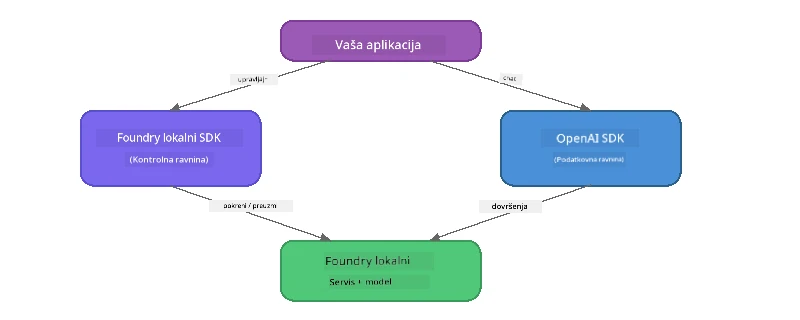

# Dio 3: Korištenje Foundry Local SDK-a s OpenAI

## Pregled

U Dijelu 1 koristili ste Foundry Local CLI za interaktivno pokretanje modela. U Dijelu 2 istražili ste cijeli SDK API. Sada ćete naučiti kako **integrirati Foundry Local u vaše aplikacije** koristeći SDK i OpenAI-kompatibilan API.

Foundry Local pruža SDK-ove za tri jezika. Izaberite onaj s kojim vam je najugodnije - koncepti su identični u sva tri.

## Ciljevi učenja

Do kraja ovog laboratorija moći ćete:

- Instalirati Foundry Local SDK za vaš jezik (Python, JavaScript ili C#)
- Inicijalizirati `FoundryLocalManager` za pokretanje servisa, provjeru cachea, preuzimanje i učitavanje modela
- Povezati se na lokalni model koristeći OpenAI SDK
- Slati chat zahtjeve i rukovati streaming odgovorima
- Razumjeti arhitekturu dinamičkih portova

---

## Preduvjeti

Prvo završite [Dio 1: Uvod u Foundry Local](part1-getting-started.md) i [Dio 2: Detaljan pregled Foundry Local SDK-a](part2-foundry-local-sdk.md).

Instalirajte **jedan** od sljedećih runtimeova za jezik:
- **Python 3.9+** - [python.org/downloads](https://www.python.org/downloads/)
- **Node.js 18+** - [nodejs.org](https://nodejs.org/)
- **.NET 9.0+** - [dot.net/download](https://dotnet.microsoft.com/download)

---

## Koncept: Kako SDK radi

Foundry Local SDK upravlja **kontrolnom ravninom** (pokretanje servisa, preuzimanje modela), dok OpenAI SDK upravlja **ravninom podataka** (slanje upita, primanje odgovora).



---

## Laboratorijske vježbe

### Vježba 1: Postavljanje okruženja

<details>
<summary><b>🐍 Python</b></summary>

```bash
cd python
python -m venv venv

# Aktivirajte virtualno okruženje:
# Windows (PowerShell):
venv\Scripts\Activate.ps1
# Windows (Command Prompt):
venv\Scripts\activate.bat
# macOS:
source venv/bin/activate

pip install -r requirements.txt
```

Datoteka `requirements.txt` instalira:
- `foundry-local-sdk` - Foundry Local SDK (uvozi se kao `foundry_local`)
- `openai` - OpenAI Python SDK
- `agent-framework` - Microsoft Agent Framework (koristi se u kasnijim dijelovima)

</details>

<details>
<summary><b>📘 JavaScript</b></summary>

```bash
cd javascript
npm install
```

Datoteka `package.json` instalira:
- `foundry-local-sdk` - Foundry Local SDK
- `openai` - OpenAI Node.js SDK

</details>

<details>
<summary><b>💜 C#</b></summary>

```bash
cd csharp
dotnet restore
dotnet build
```

Datoteka `csharp.csproj` koristi:
- `Microsoft.AI.Foundry.Local` - Foundry Local SDK (NuGet)
- `OpenAI` - OpenAI C# SDK (NuGet)

> **Struktura projekta:** C# projekt koristi komandni router u `Program.cs` koji poziva primjere u zasebnim datotekama. Pokrenite `dotnet run chat` (ili samo `dotnet run`) za ovaj dio. Ostali dijelovi koriste `dotnet run rag`, `dotnet run agent` i `dotnet run multi`.

</details>

---

### Vježba 2: Osnovni chat dovršetak

Otvorite osnovni primjer chat koda za svoj jezik i proučite kod. Svaki skript prati isti trostupanjski obrazac:

1. **Pokrenite servis** - `FoundryLocalManager` pokreće Foundry Local runtime
2. **Preuzmite i učitajte model** - provjerite cache, preuzmite ako je potrebno, zatim učitajte u memoriju
3. **Kreirajte OpenAI klijent** - povežite se na lokalnu krajnju točku i pošaljite streaming chat dovršetak

<details>
<summary><b>🐍 Python - <code>python/foundry-local.py</code></b></summary>

```python
import sys
import openai
from foundry_local import FoundryLocalManager

alias = "phi-3.5-mini"

# Korak 1: Kreirajte FoundryLocalManager i pokrenite uslugu
print("Starting Foundry Local service...")
manager = FoundryLocalManager()
manager.start_service()

# Korak 2: Provjerite je li model već preuzet
cached = manager.list_cached_models()
catalog_info = manager.get_model_info(alias)
is_cached = any(m.id == catalog_info.id for m in cached) if catalog_info else False

if is_cached:
    print(f"Model already downloaded: {alias}")
else:
    print(f"Downloading model: {alias} (this may take several minutes)...")
    manager.download_model(alias)
    print(f"Download complete: {alias}")

# Korak 3: Učitajte model u memoriju
print(f"Loading model: {alias}...")
manager.load_model(alias)

# Kreirajte OpenAI klijent koji pokazuje na LOKALNU Foundry uslugu
client = openai.OpenAI(
    base_url=manager.endpoint,   # Dinamički port - nikada nemojte koristiti fiksnu vrijednost!
    api_key=manager.api_key
)

# Generirajte streaming završetak chata
stream = client.chat.completions.create(
    model=manager.get_model_info(alias).id,
    messages=[{"role": "user", "content": "What is the golden ratio?"}],
    stream=True,
)

for chunk in stream:
    if chunk.choices[0].delta.content is not None:
        print(chunk.choices[0].delta.content, end="", flush=True)
print()
```

**Pokrenite ga:**
```bash
python foundry-local.py
```

</details>

<details>
<summary><b>📘 JavaScript - <code>javascript/foundry-local.mjs</code></b></summary>

```javascript
import { OpenAI } from "openai";
import { FoundryLocalManager } from "foundry-local-sdk";

const alias = "phi-3.5-mini";

// Korak 1: Pokrenite Foundry Local servis
console.log("Starting Foundry Local service...");
FoundryLocalManager.create({ appName: "FoundryLocalWorkshop" });
const manager = FoundryLocalManager.instance;
await manager.startWebService();

// Korak 2: Provjerite je li model već preuzet
const catalog = manager.catalog;
const model = await catalog.getModel(alias);

if (model.isCached) {
  console.log(`Model already downloaded: ${alias}`);
} else {
  console.log(`Downloading model: ${alias} (this may take several minutes)...`);
  await model.download();
  console.log(`Download complete: ${alias}`);
}

// Korak 3: Učitajte model u memoriju
console.log(`Loading model: ${alias}...`);
await model.load();
console.log(`Model loaded: ${model.id}`);

// Kreirajte OpenAI klijent koji pokazuje na LOCAL Foundry servis
const client = new OpenAI({
  baseURL: manager.urls[0] + "/v1",   // Dinamički port - nikada nemojte hardkodirati!
  apiKey: "foundry-local",
});

// Generirajte streaming chat završetak
const stream = await client.chat.completions.create({
  model: model.id,
  messages: [{ role: "user", content: "What is the golden ratio?" }],
  stream: true,
});

for await (const chunk of stream) {
  if (chunk.choices[0]?.delta?.content) {
    process.stdout.write(chunk.choices[0].delta.content);
  }
}
console.log();
```

**Pokrenite ga:**
```bash
node foundry-local.mjs
```

</details>

<details>
<summary><b>💜 C# - <code>csharp/BasicChat.cs</code></b></summary>

```csharp
using Microsoft.AI.Foundry.Local;
using Microsoft.Extensions.Logging.Abstractions;
using OpenAI;
using OpenAI.Chat;
using System.ClientModel;

var alias = "phi-3.5-mini";

// Step 1: Start the Foundry Local service
Console.WriteLine("Starting Foundry Local service...");
await FoundryLocalManager.CreateAsync(
    new Configuration
    {
        AppName = "FoundryLocalSamples",
        Web = new Configuration.WebService { Urls = "http://127.0.0.1:0" }
    }, NullLogger.Instance, default);
var manager = FoundryLocalManager.Instance;
await manager.StartWebServiceAsync(default);

// Step 2: Get the model from the catalog
var catalog = await manager.GetCatalogAsync(default);
var model = await catalog.GetModelAsync(alias, default);

// Step 3: Check if the model is already downloaded
var isCached = await model.IsCachedAsync(default);

if (isCached)
{
    Console.WriteLine($"Model already downloaded: {alias}");
}
else
{
    Console.WriteLine($"Downloading model: {alias} (this may take several minutes)...");
    await model.DownloadAsync(null, default);
    Console.WriteLine($"Download complete: {alias}");
}

// Step 4: Load the model into memory
Console.WriteLine($"Loading model: {alias}...");
await model.LoadAsync(default);
Console.WriteLine($"Loaded model: {model.Id}");
Console.WriteLine($"Endpoint: {manager.Urls[0]}");

// Create OpenAI client pointing to the LOCAL Foundry service
var key = new ApiKeyCredential("foundry-local");
var client = new OpenAIClient(key, new OpenAIClientOptions
{
    Endpoint = new Uri(manager.Urls[0] + "/v1")  // Dynamic port - never hardcode!
});

var chatClient = client.GetChatClient(model.Id);

// Stream a chat completion
var completionUpdates = chatClient.CompleteChatStreaming("What is the golden ratio?");

foreach (var update in completionUpdates)
{
    if (update.ContentUpdate.Count > 0)
    {
        Console.Write(update.ContentUpdate[0].Text);
    }
}
Console.WriteLine();
```

**Pokrenite ga:**
```bash
dotnet run chat
```

</details>

---

### Vježba 3: Eksperimentiranje s upitima

Kad se vaš osnovni primjer pokrene, pokušajte izmijeniti kod:

1. **Promijenite korisničku poruku** - isprobajte različita pitanja
2. **Dodajte sistemski prompt** - dodijelite modelu personu
3. **Isključite streaming** - postavite `stream=False` i isprintajte cijeli odgovor odjednom
4. **Isprobajte drugi model** - promijenite alias iz `phi-3.5-mini` u neki drugi model s liste `foundry model list`

<details>
<summary><b>🐍 Python</b></summary>

```python
# Dodajte sistemski upit - dajte modelu osobnost:
stream = client.chat.completions.create(
    model=manager.get_model_info(alias).id,
    messages=[
        {"role": "system", "content": "You are a pirate. Answer everything in pirate speak."},
        {"role": "user", "content": "What is the golden ratio?"}
    ],
    stream=True,
)

# Ili isključite streamanje:
response = client.chat.completions.create(
    model=manager.get_model_info(alias).id,
    messages=[{"role": "user", "content": "What is the golden ratio?"}],
    stream=False,
)
print(response.choices[0].message.content)
```

</details>

<details>
<summary><b>📘 JavaScript</b></summary>

```javascript
// Dodajte sistemsku naredbu - dajte modelu personu:
const stream = await client.chat.completions.create({
  model: modelInfo.id,
  messages: [
    { role: "system", content: "You are a pirate. Answer everything in pirate speak." },
    { role: "user", content: "What is the golden ratio?" },
  ],
  stream: true,
});

// Ili isključite streaming:
const response = await client.chat.completions.create({
  model: modelInfo.id,
  messages: [{ role: "user", content: "What is the golden ratio?" }],
  stream: false,
});
console.log(response.choices[0].message.content);
```

</details>

<details>
<summary><b>💜 C#</b></summary>

```csharp
// Add a system prompt - give the model a persona:
var completionUpdates = chatClient.CompleteChatStreaming(
    new ChatMessage[]
    {
        new SystemChatMessage("You are a pirate. Answer everything in pirate speak."),
        new UserChatMessage("What is the golden ratio?")
    }
);

// Or turn off streaming:
var response = chatClient.CompleteChat("What is the golden ratio?");
Console.WriteLine(response.Value.Content[0].Text);
```

</details>

---

### SDK Referenca metoda

<details>
<summary><b>🐍 Python SDK Metode</b></summary>

| Metoda | Namjena |
|--------|---------|
| `FoundryLocalManager()` | Kreira instancu managera |
| `manager.start_service()` | Pokreće Foundry Local servis |
| `manager.list_cached_models()` | Navodi modele preuzete na uređaju |
| `manager.get_model_info(alias)` | Dohvaća ID i metapodatke modela |
| `manager.download_model(alias, progress_callback=fn)` | Preuzima model s opcionalnim callbackom za napredak |
| `manager.load_model(alias)` | Učitava model u memoriju |
| `manager.endpoint` | Dohvaća URL dinamičke krajnje točke |
| `manager.api_key` | Dohvaća API ključ (placeholder za lokalno) |

</details>

<details>
<summary><b>📘 JavaScript SDK Metode</b></summary>

| Metoda | Namjena |
|--------|---------|
| `FoundryLocalManager.create({ appName })` | Kreira instancu managera |
| `FoundryLocalManager.instance` | Pristupa singleton manageru |
| `await manager.startWebService()` | Pokreće Foundry Local servis |
| `await manager.catalog.getModel(alias)` | Dohvaća model iz kataloga |
| `model.isCached` | Provjerava je li model već preuzet |
| `await model.download()` | Preuzima model |
| `await model.load()` | Učitava model u memoriju |
| `model.id` | Dohvaća ID modela za OpenAI API pozive |
| `manager.urls[0] + "/v1"` | Dohvaća URL dinamičke krajnje točke |
| `"foundry-local"` | API ključ (placeholder za lokalno) |

</details>

<details>
<summary><b>💜 C# SDK Metode</b></summary>

| Metoda | Namjena |
|--------|---------|
| `FoundryLocalManager.CreateAsync(config)` | Kreira i inicijalizira managera |
| `manager.StartWebServiceAsync()` | Pokreće Foundry Local web servis |
| `manager.GetCatalogAsync()` | Dohvaća katalog modela |
| `catalog.ListModelsAsync()` | Navodi sve dostupne modele |
| `catalog.GetModelAsync(alias)` | Dohvaća model prema aliasu |
| `model.IsCachedAsync()` | Provjerava je li model preuzet |
| `model.DownloadAsync()` | Preuzima model |
| `model.LoadAsync()` | Učitava model u memoriju |
| `manager.Urls[0]` | Dohvaća URL dinamičke krajnje točke |
| `new ApiKeyCredential("foundry-local")` | API ključni credential za lokalno |

</details>

---

### Vježba 4: Korištenje Native ChatClienta (alternativa OpenAI SDK-u)

U vježbama 2 i 3 koristili ste OpenAI SDK za chat dovršetke. JavaScript i C# SDK-ovi također pružaju **svoju vlastitu ChatClient klasu** koja u potpunosti uklanja potrebu za OpenAI SDK-om.

<details>
<summary><b>📘 JavaScript - <code>model.createChatClient()</code></b></summary>

```javascript
import { FoundryLocalManager } from "foundry-local-sdk";

const alias = "phi-3.5-mini";

FoundryLocalManager.create({ appName: "ChatClientDemo" });
const manager = FoundryLocalManager.instance;
await manager.startWebService();

const model = await manager.catalog.getModel(alias);
if (!model.isCached) await model.download();
await model.load();

// Nije potrebno uvoziti OpenAI — dohvatite klijenta izravno iz modela
const chatClient = model.createChatClient();

// Završetak bez prijenosa toka
const response = await chatClient.completeChat([
  { role: "system", content: "You are a pirate. Answer everything in pirate speak." },
  { role: "user", content: "What is the golden ratio?" }
]);
console.log(response.choices[0].message.content);

// Završetak s prijenosom toka (koristi callback obrazac)
await chatClient.completeStreamingChat(
  [{ role: "user", content: "What is the golden ratio?" }],
  (chunk) => {
    if (chunk.choices?.[0]?.delta?.content) {
      process.stdout.write(chunk.choices[0].delta.content);
    }
  }
);
console.log();
```

> **Napomena:** Metoda `completeStreamingChat()` ChatClienta koristi **callback** obrazac, ne async iterator. Proslijedite funkciju kao drugi argument.

</details>

<details>
<summary><b>💜 C# - <code>model.GetChatClientAsync()</code></b></summary>

```csharp
var catalog = await manager.GetCatalogAsync(default);
var model = await catalog.GetModelAsync("phi-3.5-mini", default);
if (!await model.IsCachedAsync(default))
    await model.DownloadAsync(null, default);
await model.LoadAsync(default);

// No OpenAI NuGet needed — get a client directly from the model
var chatClient = await model.GetChatClientAsync(default);

// Use it like a standard OpenAI ChatClient
var response = chatClient.CompleteChat("What is the golden ratio?");
Console.WriteLine(response.Value.Content[0].Text);
```

</details>

> **Kada koristiti što:**
> | Pristup | Najbolje za |
> |----------|-------------|
> | OpenAI SDK | Potpuna kontrola parametara, produkcijske aplikacije, postojeći OpenAI kod |
> | Native ChatClient | Brzi prototipovi, manje ovisnosti, jednostavnije postavljanje |

---

## Ključni zaključci

| Koncept | Što ste naučili |
|---------|-----------------|
| Kontrolna ravnina | Foundry Local SDK upravlja pokretanjem servisa i učitavanjem modela |
| Ravina podataka | OpenAI SDK upravlja chat dovršetcima i streamingom |
| Dinamički portovi | Uvijek koristite SDK za otkrivanje krajnje točke; nikada ne hardkodirajte URL-ove |
| Višejezičnost | Isti obrazac koda radi u Pythonu, JavaScriptu i C# |
| Kompatibilnost s OpenAI | Potpuna kompatibilnost znači da postojeći OpenAI kod radi uz minimalne promjene |
| Native ChatClient | `createChatClient()` (JS) / `GetChatClientAsync()` (C#) je alternativa za OpenAI SDK |

---

## Sljedeći koraci

Nastavite na [Dio 4: Izrada RAG aplikacije](part4-rag-fundamentals.md) i naučite kako izgraditi Retrieval-Augmented Generation pipeline koji radi potpuno lokalno na vašem uređaju.

---

<!-- CO-OP TRANSLATOR DISCLAIMER START -->
**Odricanje od odgovornosti**:  
Ovaj dokument preveden je korištenjem AI usluge prijevoda [Co-op Translator](https://github.com/Azure/co-op-translator). Iako nastojimo biti točni, imajte na umu da automatski prijevodi mogu sadržavati pogreške ili netočnosti. Izvorni dokument na izvornom jeziku treba smatrati autoritativnim izvorom. Za važne informacije preporučuje se profesionalni ljudski prijevod. Ne odgovaramo za bilo kakve nesporazume ili pogrešne interpretacije koje proizlaze iz korištenja ovog prijevoda.
<!-- CO-OP TRANSLATOR DISCLAIMER END -->