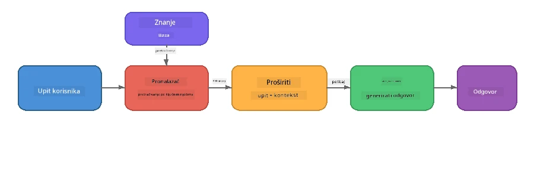

# Dio 4: Izrada RAG aplikacije s Foundry Local

## Pregled

Veliki jezični modeli su moćni, ali znaju samo ono što je bilo u njihovim podacima za treniranje. **Retrieval-Augmented Generation (RAG)** to rješava tako da modelu daje relevantan kontekst u trenutku upita - izvlačen iz vaših vlastitih dokumenata, baza podataka ili baza znanja.

U ovom laboratoriju izgradit ćete cjelovit RAG lanac koji radi **potpuno na vašem uređaju** koristeći Foundry Local. Nema oblačnih usluga, nema vektorskih baza podataka, nema API-ja za embedinge - samo lokalno dohvaćanje i lokalni model.

## Ciljevi učenja

Na kraju ovog laboratorija moći ćete:

- Objasniti što je RAG i zašto je važan za AI aplikacije
- Izgraditi lokalnu bazu znanja iz tekstualnih dokumenata
- Implementirati jednostavnu funkciju dohvaćanja relevantnog konteksta
- Sastaviti sistemsku poruku koja temelji model na dohvaćenim činjenicama
- Pokrenuti cjelokupni lanac Retrieve → Augment → Generate na uređaju
- Razumjeti kompromise između jednostavnog dohvaćanja ključnih riječi i vektorskog pretraživanja

---

## Preduvjeti

- Dovršiti [Dio 3: Korištenje Foundry Local SDK s OpenAI](part3-sdk-and-apis.md)
- Instalirani Foundry Local CLI i preuzet model `phi-3.5-mini`

---

## Koncept: Što je RAG?

Bez RAG-a, LLM može odgovarati samo iz svojih podataka za treniranje - koji mogu biti zastarjeli, nepotpuni ili bez vaših privatnih informacija:

```
User: "What is Zava's return policy?"
LLM:  "I do not have information about Zava's return policy."  ← No context!
```

Uz RAG, vi prvo **dohvaćate** relevantne dokumente, zatim **dopunjavate** prompt tim kontekstom prije nego što **generirate** odgovor:



Ključni uvid: **model ne mora "znati" odgovor; samo treba pročitati prave dokumente.**

---

## Laboratorijske vježbe

### Vježba 1: Razumjeti bazu znanja

Otvorite RAG primjer za svoj jezik i pregledajte bazu znanja:

<details>
<summary><b>🐍 Python: <code>python/foundry-local-rag.py</code></b></summary>

Baza znanja je jednostavna lista rječnika s poljima `title` i `content`:

```python
KNOWLEDGE_BASE = [
    {
        "title": "Foundry Local Overview",
        "content": (
            "Foundry Local brings the power of Azure AI Foundry to your local "
            "device without requiring an Azure subscription..."
        ),
    },
    {
        "title": "Supported Hardware",
        "content": (
            "Foundry Local automatically selects the best model variant for "
            "your hardware. If you have an Nvidia CUDA GPU it downloads the "
            "CUDA-optimized model..."
        ),
    },
    # ... još unosa
]
```

Svaki unos predstavlja "komad" znanja - fokusirani dio informacije o jednoj temi.

</details>

<details>
<summary><b>📘 JavaScript: <code>javascript/foundry-local-rag.mjs</code></b></summary>

Baza znanja koristi istu strukturu kao niz objekata:

```javascript
const KNOWLEDGE_BASE = [
  {
    title: "Foundry Local Overview",
    content:
      "Foundry Local brings the power of Azure AI Foundry to your local " +
      "device without requiring an Azure subscription...",
  },
  {
    title: "Supported Hardware",
    content:
      "Foundry Local automatically selects the best model variant for " +
      "your hardware...",
  },
  // ... još unosa
];
```

</details>

<details>
<summary><b>💜 C#: <code>csharp/RagPipeline.cs</code></b></summary>

Baza znanja koristi listu imenovanih tuplova:

```csharp
private static readonly List<(string Title, string Content)> KnowledgeBase =
[
    ("Foundry Local Overview",
     "Foundry Local brings the power of Azure AI Foundry to your local " +
     "device without requiring an Azure subscription..."),

    ("Supported Hardware",
     "Foundry Local automatically selects the best model variant for " +
     "your hardware..."),

    // ... more entries
];
```

</details>

> **U stvarnoj aplikaciji**, baza znanja bi dolazila iz datoteka na disku, baze podataka, indeksa pretraživanja ili API-ja. Za ovaj laboratorij koristimo listu u memoriji radi jednostavnosti.

---

### Vježba 2: Razumjeti funkciju dohvaćanja

Korak dohvaćanja pronalazi najrelevantnije dijelove za korisnikov upit. Ovaj primjer koristi **preklapanje ključnih riječi** - broji koliko riječi iz upita se pojavljuje u svakom dijelu:

<details>
<summary><b>🐍 Python</b></summary>

```python
def retrieve(query: str, top_k: int = 2) -> list[dict]:
    """Return the top-k knowledge chunks most relevant to the query."""
    query_words = set(query.lower().split())
    scored = []
    for chunk in KNOWLEDGE_BASE:
        chunk_words = set(chunk["content"].lower().split())
        overlap = len(query_words & chunk_words)
        scored.append((overlap, chunk))
    scored.sort(key=lambda x: x[0], reverse=True)
    return [item[1] for item in scored[:top_k]]
```

</details>

<details>
<summary><b>📘 JavaScript</b></summary>

```javascript
function retrieve(query, topK = 2) {
  const queryWords = new Set(query.toLowerCase().split(/\s+/));
  const scored = KNOWLEDGE_BASE.map((chunk) => {
    const chunkWords = new Set(chunk.content.toLowerCase().split(/\s+/));
    let overlap = 0;
    for (const w of queryWords) {
      if (chunkWords.has(w)) overlap++;
    }
    return { overlap, chunk };
  });
  scored.sort((a, b) => b.overlap - a.overlap);
  return scored.slice(0, topK).map((s) => s.chunk);
}
```

</details>

<details>
<summary><b>💜 C#</b></summary>

```csharp
private static List<(string Title, string Content)> Retrieve(string query, int topK = 2)
{
    var queryWords = new HashSet<string>(
        query.ToLowerInvariant().Split(' ', StringSplitOptions.RemoveEmptyEntries));

    return KnowledgeBase
        .Select(chunk =>
        {
            var chunkWords = new HashSet<string>(
                chunk.Content.ToLowerInvariant().Split(' ', StringSplitOptions.RemoveEmptyEntries));
            var overlap = queryWords.Intersect(chunkWords).Count();
            return (Overlap: overlap, Chunk: chunk);
        })
        .OrderByDescending(x => x.Overlap)
        .Take(topK)
        .Select(x => x.Chunk)
        .ToList();
}
```

</details>

**Kako radi:**
1. Podijelite upit u pojedinačne riječi
2. Za svaki komad znanja izbrojite koliko riječi iz upita se pojavljuje u tom komadu
3. Sortirajte rezultat po bodovima preklapanja (najveći prvi)
4. Vratite top-k najrelevantnijih komada

> **Kompromis:** Preklapanje ključnih riječi je jednostavno, ali ograničeno; ne razumije sinonime ili značenje. Produkcijski RAG sustavi obično koriste **embedding vektore** i **vektorske baze podataka** za semantičko pretraživanje. Međutim, preklapanje ključnih riječi je odlična polazna točka i ne zahtijeva dodatne ovisnosti.

---

### Vježba 3: Razumjeti dopunjeni prompt

Dohvaćeni kontekst se ubacuje u **sistemsku poruku** prije slanja modelu:

```python
system_prompt = (
    "You are a helpful assistant. Answer the user's question using ONLY "
    "the information provided in the context below. If the context does "
    "not contain enough information, say so.\n\n"
    f"Context:\n{context_text}"
)
```

Ključne odluke u dizajnu:
- **"SAMO informacije koje su dane"** - sprječava model da halucinira činjenice koje nisu u kontekstu
- **"Ako kontekst nema dovoljno informacija, reci to"** - potiče iskrene odgovore "Ne znam"
- Kontekst je smješten u sistemsku poruku kako bi oblikovao sve odgovore

---

### Vježba 4: Pokreni RAG lanac

Pokrenite cjelokupni primjer:

**Python:**
```bash
cd python
python foundry-local-rag.py
```

**JavaScript:**
```bash
cd javascript
node foundry-local-rag.mjs
```

**C#:**
```bash
cd csharp
dotnet run rag
```

Trebali biste vidjeti ispisano tri stvari:
1. **Pitanje** koje je postavljeno
2. **Dohvaćeni kontekst** - komadići odabrani iz baze znanja
3. **Odgovor** - generiran od modela koristeći samo taj kontekst

Primjer ispisa:
```
Question: How do I install Foundry Local and what hardware does it support?

--- Retrieved Context ---
### Installation
On Windows install Foundry Local with: winget install Microsoft.FoundryLocal...

### Supported Hardware
Foundry Local automatically selects the best model variant for your hardware...
-------------------------

Answer: To install Foundry Local, you can use the following methods depending
on your operating system: On Windows, run `winget install Microsoft.FoundryLocal`.
On macOS, use `brew install microsoft/foundrylocal/foundrylocal`...
```

Primijetite kako je odgovor modela **temeljen** na dohvaćenom kontekstu - spominju se samo činjenice iz dokumenata baze znanja.

---

### Vježba 5: Eksperimentiraj i proširi

Isprobajte ove izmjene za dublje razumijevanje:

1. **Promijenite pitanje** - postavite nešto što JE u bazi znanja nasuprot nečemu što NIJE:
   ```python
   question = "What programming languages does Foundry Local support?"  # ← U kontekstu
   question = "How much does Foundry Local cost?"                       # ← Nije u kontekstu
   ```
   Govori li model ispravno "Ne znam" kad odgovora nema u kontekstu?

2. **Dodajte novi komad znanja** - dodajte novi unos u `KNOWLEDGE_BASE`:
   ```python
   {
       "title": "Pricing",
       "content": "Foundry Local is completely free and open source under the MIT license.",
   }
   ```
   Sad ponovno postavite pitanje o cijenama.

3. **Promijenite `top_k`** - dohvatite više ili manje komada:
   ```python
   context_chunks = retrieve(question, top_k=3)  # Više konteksta
   context_chunks = retrieve(question, top_k=1)  # Manje konteksta
   ```
   Kako količina konteksta utječe na kvalitetu odgovora?

4. **Uklonite instrukciju o utemeljenju** - promijenite sistemsku poruku u samo "Ti si koristan asistent." i provjerite počinje li model halucinirati činjenice.

---

## Detaljno: Optimizacija RAG za rad na uređaju

Pokretanje RAG na uređaju uvodi ograničenja koja se ne susreću u oblaku: ograničena RAM memorija, nema posvećen GPU (izvršenje na CPU/NPU), i malen kontekstni prozor modela. Donje odluke u dizajnu direktno rješavaju ta ograničenja i bazirane su na obrascima iz produkcijskih lokalnih RAG aplikacija napravljenih s Foundry Local.

### Strategija dijeljenja: Fiksno veličinski klizni prozor

Dijeljenje - kako razbijate dokumente na dijelove - jedna je od najvažnijih odluka u bilo kojem RAG sustavu. Za scenarije na uređaju, preporuča se **fiksno veličinski klizni prozor s preklapanjem**:

| Parametar | Preporučena vrijednost | Zašto |
|-----------|------------------------|-------|
| **Veličina dijela** | ~200 tokena | Drži dohvaćeni kontekst kompaktim, ostavljajući prostora u kontekstnom prozoru Phi-3.5 Mini za sistemsku poruku, povijest razgovora i generirani izlaz |
| **Preklapanje** | ~25 tokena (12.5%) | Sprječava gubitak informacija na granicama dijelova - važno za procedure i upute korak-po-korak |
| **Tokenizacija** | Podjela po praznom prostoru | Nema ovisnosti, nije potrebna biblioteka tokenizer-a. Sav račun ostaje na LLM-u |

Preklapanje radi kao klizni prozor: svaki novi dio počinje 25 tokena prije završetka prethodnog, tako da rečenice koje se protežu preko granica dijelova pojavljuju se u oba dijela.

> **Zašto ne druge strategije?**
> - **Podjela na rečenice** daje nepredvidive veličine dijelova; neke sigurnosne procedure su dugačke jedne rečenice koje se teško dijele
> - **Podjela po sekcijama** (po `##` naslovima) stvara vrlo različite veličine dijelova - neki su preveliki, neki premali za kontekstni prozor modela
> - **Semantičko dijeljenje** (na osnovi embedinga za detekciju tema) daje najbolju kvalitetu dohvaćanja, ali zahtijeva drugi model u memoriji uz Phi-3.5 Mini - riskantno na hardveru s 8-16 GB zajedničke memorije

### Naprednije dohvaćanje: TF-IDF vektori

Pristup s preklapanjem ključnih riječi u ovom laboratoriju radi, ali ako želite bolje dohvaćanje bez dodavanja embedding modela, **TF-IDF (Term Frequency-Inverse Document Frequency)** je izvrsna sredina:

```
Keyword Overlap  →  TF-IDF Vectors  →  Embedding Models
    (this lab)     (lightweight upgrade)   (production)
  Simple & fast    Better ranking,         Best quality,
  No dependencies  still no ML model       requires embedding model
  ~Basic matching  ~1ms retrieval          ~100-500ms per query
```

TF-IDF pretvara svaki dio u numerički vektor baziran na važnosti svake riječi unutar tog dijela *u odnosu na sve dijelove*. U trenutku upita, pitanje se vektorizira na isti način i uspoređuje pomoću kosinusne sličnosti. Možete ovo implementirati sa SQLite i čistim JavaScript/Python kodom - bez vektorske baze podataka i bez embedding API-ja.

> **Performanse:** TF-IDF kosinusna sličnost preko fiksno veličinskih dijelova obično postiže **~1ms dohvaćanja**, u usporedbi s ~100-500ms kada embedding model kodira svaki upit. Svi 20+ dokumenata mogu se podijeliti i indeksirati za manje od sekunde.

### Edge/Compact način za uređaje s ograničenjima

Kod rada na vrlo ograničenom hardveru (stari laptopi, tableti, terenski uređaji), možete smanjiti korištenje resursa skraćivanjem triju postavki:

| Postavka | Standardni način | Edge/Compact način |
|----------|------------------|--------------------|
| **Sistemska poruka** | ~300 tokena | ~80 tokena |
| **Maksimalni izlaz tokena** | 1024 | 512 |
| **Dohvaćeni dijelovi (top-k)** | 5 | 3 |

Manje dohvaćenih dijelova znači manje konteksta za model, što smanjuje latenciju i opterećenje memorije. Kraća sistemska poruka ostavlja više prostora u kontekstnom prozoru za stvarni odgovor. Ovaj kompromis vrijedi na uređajima gdje svaki token kontekstnog prozora ima važnost.

### Jedan model u memoriji

Jedno od najvažnijih pravila za RAG na uređaju: **držite samo jedan model učitan**. Ako koristite embedding model za dohvaćanje *i* jezični model za generaciju, dijelite ograničene NPU/RAM resurse između dva modela. Lagano dohvaćanje (preklapanje ključnih riječi, TF-IDF) to u potpunosti izbjegava:

- Nema embedding modela koji se natječe za memoriju s LLM-om
- Brži hladni start - učitava se samo jedan model
- Predvidivo korištenje memorije - LLM dobiva sve dostupne resurse
- Radi na računalima s samo 8 GB RAM-a

### SQLite kao lokalna vektorska baza

Za male do srednje kolekcije dokumenata (stotine do tisuću dijelova), **SQLite je dovoljno brz** za brutalno pretraživanje kosinusnom sličnosti i ne uvodi dodatnu infrastrukturu:

- Jedna `.db` datoteka na disku - bez server procesa, bez konfiguracije
- Dolazi sa svakim glavnim runtimeom (Python `sqlite3`, Node.js `better-sqlite3`, .NET `Microsoft.Data.Sqlite`)
- Čuva dijelove dokumenata zajedno s njihovim TF-IDF vektorima u jednoj tablici
- Nema potrebe za Pinecone, Qdrant, Chroma ili FAISS u ovoj skali

### Sažetak performansi

Ove dizajnerske odluke zajedno pružaju responzivan RAG na potrošačkom hardveru:

| Metrika | Performanse na uređaju |
|---------|-----------------------|
| **Latencija dohvaćanja** | ~1ms (TF-IDF) do ~5ms (preklapanje ključnih riječi) |
| **Brzina unosa podataka** | 20 dokumenata podijeljeno i indeksirano u < 1 sekundu |
| **Modeli u memoriji** | 1 (samo LLM - nema embedding modela) |
| **Prostor za pohranu** | < 1 MB za dijelove + vektore u SQLite |
| **Hladni start** | Učitavanje jednog modela, bez pokretanja embedding okruženja |
| **Minimalni hardver** | 8 GB RAM, samo CPU (GPU nije potreban) |

> **Kada nadograditi:** Ako skalirate na stotine dugih dokumenata, mješovite tipove sadržaja (tablice, kod, prozu) ili trebate semantičko razumijevanje upita, razmislite o dodavanju embedding modela i prebacivanju na pretraživanje po sličnosti s vektorima. Za većinu slučajeva upotrebe na uređaju s fokusiranim skupovima dokumenata, TF-IDF + SQLite daje odlične rezultate s minimalnim resursima.

---

## Ključni koncepti

| Koncept | Opis |
|---------|-------|
| **Dohvaćanje** | Pronalaženje relevantnih dokumenata iz baze znanja na temelju upita korisnika |
| **Dopuna** | Umetanje dohvaćenih dokumenata u prompt kao kontekst |
| **Generacija** | LLM proizvodi odgovor temeljen na danom kontekstu |
| **Dijeljenje** | Razbijanje velikih dokumenata u manje, fokusirane dijelove |
| **Utemeljenje** | Ograničavanje modela da koristi samo dani kontekst (smanjuje halucinacije) |
| **Top-k** | Broj najrelevantnijih dijelova koje treba dohvatiti |

---

## RAG u produkciji naspram ovog laboratorija

| Aspekt | Ovaj laboratorij | Optimizirano za uređaj | Produkcija u oblaku |
|--------|------------------|-----------------------|---------------------|
| **Baza znanja** | Lista u memoriji | Datoteke na disku, SQLite | Baza podataka, indeks pretraživanja |
| **Dohvaćanje** | Preklapanje ključnih riječi | TF-IDF + kosinusna sličnost | Vektorski embedding + pretraživanje po sličnosti |
| **Embedding** | Nije potreban | Nije potreban - TF-IDF vektori | Embedding model (lokalno ili oblak) |
| **Vektorska baza** | Nije potrebna | SQLite (jedna `.db` datoteka) | FAISS, Chroma, Azure AI Search, itd. |
| **Dijeljenje** | Ručno | Fiksno veličinski klizni prozor (~200 tokena, 25 tokena preklapanje) | Semantičko ili rekurzivno dijeljenje |
| **Modeli u memoriji** | 1 (LLM) | 1 (LLM) | 2+ (embedding + LLM) |
| **Latencija dohvaćanja** | ~5ms | ~1ms | ~100-500ms |
| **Skala** | 5 dokumenata | Stotine dokumenata | Milijuni dokumenata |

Uzorke koje ovdje učite (dohvati, nadogradi, generiraj) isti su na bilo kojoj skali. Metoda dohvaćanja se poboljšava, ali cjelokupna arhitektura ostaje identična. Srednji stupac prikazuje što je moguće postići na uređaju s laganim tehnikama, često idealno za lokalne aplikacije gdje se razmjenjuje oblak u zamjenu za privatnost, mogućnost rada bez mreže i nultu latenciju prema vanjskim uslugama.

---

## Ključni zaključci

| Koncept | Što ste naučili |
|---------|------------------|
| RAG uzorak | Dohvati + Nadogradi + Generiraj: dajte modelu pravi kontekst i on može odgovoriti na pitanja o vašim podacima |
| Na uređaju | Sve radi lokalno bez API-ja u oblaku ili pretplata na vektorske baze podataka |
| Upute za utemeljenje | Ograničenja sistemskog prompta su kritična za sprječavanje halucinacija |
| Preklapanje ključnih riječi | Jednostavna, ali učinkovita početna točka za dohvaćanje |
| TF-IDF + SQLite | Lagani put nadogradnje koji održava dohvaćanje ispod 1ms bez modela ugradnje |
| Jedan model u memoriji | Izbjegavajte učitavanje modela ugradnje zajedno s LLM-om na ograničenom hardveru |
| Veličina odlomaka | Otprilike 200 tokena s preklapanjem balansira točnost dohvaćanja i efikasnost kontekstnog prozora |
| Edge/compact način | Koristite manje odlomaka i kraće promptove za vrlo ograničene uređaje |
| Univerzalni uzorak | Ista RAG arhitektura radi za bilo koji izvor podataka: dokumente, baze podataka, API-je ili wikipedije |

> **Želite vidjeti punu RAG aplikaciju na uređaju?** Pogledajte [Gas Field Local RAG](https://github.com/leestott/local-rag), produkcijski offline RAG agent izgrađen s Foundry Local i Phi-3.5 Mini koji demonstrira ove obrasce optimizacije s stvarnim skupom dokumenata.

---

## Sljedeći koraci

Nastavite na [Dio 5: Izgradnja AI agenata](part5-single-agents.md) da naučite kako izraditi inteligentne agente s personama, uputama i višekratnim razgovorima koristeći Microsoft Agent Framework.

---

<!-- CO-OP TRANSLATOR DISCLAIMER START -->
**Odricanje od odgovornosti**:
Ovaj dokument preveden je korištenjem AI usluge prevođenja [Co-op Translator](https://github.com/Azure/co-op-translator). Iako težimo točnosti, imajte na umu da automatski prijevodi mogu sadržavati pogreške ili netočnosti. Izvorni dokument na izvornom jeziku treba smatrati autoritativnim izvorom. Za važne informacije preporučuje se profesionalni ljudski prijevod. Ne snosimo odgovornost za bilo kakva nesporazuma ili kriva tumačenja koja proizlaze iz korištenja ovog prijevoda.
<!-- CO-OP TRANSLATOR DISCLAIMER END -->