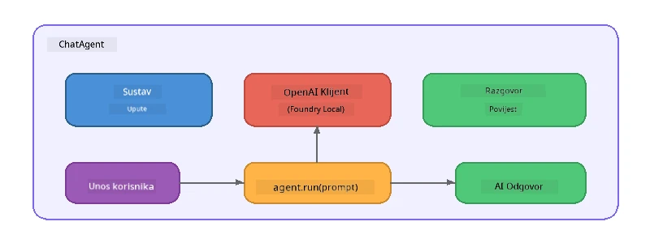

# Dio 5: Izgradnja AI agenata s Agent Frameworkom

> **Cilj:** Izgradite svog prvog AI agenta s trajnim uputama i definiranim likom, pokretanog lokalnim modelom putem Foundry Local.

## Što je AI agent?

AI agent omotava jezični model s **sistemskim uputama** koje definiraju njegovo ponašanje, osobnost i ograničenja. Za razliku od jednokratnog poziva za dovršetak chata, agent pruža:

- **Lik** - konzistentni identitet ("Vi ste koristan kod recenzent")
- **Memorija** - povijest razgovora kroz okretaje
- **Specijalizaciju** - usredotočeno ponašanje vođeno dobro osmišljenim uputama



---

## Microsoft Agent Framework

**Microsoft Agent Framework** (AGF) pruža standardnu apstrakciju agenta koja radi preko različitih pozadina modela. U ovom radionici ga uparujemo s Foundry Local kako bi sve radilo na vašem računalu - bez potrebe za cloudom.

| Koncept | Opis |
|---------|-------------|
| `FoundryLocalClient` | Python: upravlja pokretanjem servisa, preuzimanjem/učitavanjem modela i stvaranjem agenata |
| `client.as_agent()` | Python: stvara agenta iz Foundry Local klijenta |
| `AsAIAgent()` | C#: metoda proširenja na `ChatClient` - stvara `AIAgent` |
| `instructions` | Sistemski prompt koji oblikuje ponašanje agenta |
| `name` | Čitljiv naziv, koristan u scenarijima s više agenata |
| `agent.run(prompt)` / `RunAsync()` | Šalje korisničku poruku i vraća odgovor agenta |

> **Napomena:** Agent Framework ima SDK za Python i .NET. Za JavaScript implementiramo laganu klasu `ChatAgent` koja prati isti obrazac koristeći OpenAI SDK direktno.

---

## Vježbe

### Vježba 1 - Razumjeti obrazac agenta

Prije nego što pišete kod, proučite ključne komponente agenta:

1. **Klijent modela** - povezuje se s Foundry Local OpenAI-kompatibilnim API-jem
2. **Sistemske upute** - "osobnost" prompta
3. **Petlja izvršenja** - šalje korisnički unos, prima izlaz

> **Razmislite:** Kako se sistemske upute razlikuju od obične korisničke poruke? Što se događa ako ih promijenite?

---

### Vježba 2 - Pokreni primjer s jednim agentom

<details>
<summary><strong>🐍 Python</strong></summary>

**Preduvjeti:**
```bash
cd python
python -m venv venv

# Windows (PowerShell):
venv\Scripts\Activate.ps1
# macOS:
source venv/bin/activate

pip install -r requirements.txt
```

**Pokreni:**
```bash
python foundry-local-with-agf.py
```

**Objašnjenje koda** (`python/foundry-local-with-agf.py`):

```python
import asyncio
from agent_framework_foundry_local import FoundryLocalClient

async def main():
    alias = "phi-4-mini"

    # FoundryLocalClient upravlja pokretanjem usluge, preuzimanjem modela i učitavanjem
    client = FoundryLocalClient(model_id=alias)
    print(f"Client Model ID: {client.model_id}")

    # Kreirajte agenta s uputama sustava
    agent = client.as_agent(
        name="Joker",
        instructions="You are good at telling jokes.",
    )

    # Ne-streaming: dobijte cjeloviti odgovor odjednom
    result = await agent.run("Tell me a joke about a pirate.")
    print(f"Agent: {result}")

    # Streaming: dobijte rezultate kako se generiraju
    async for chunk in agent.run("Tell me another joke.", stream=True):
        if chunk.text:
            print(chunk.text, end="", flush=True)

asyncio.run(main())
```

**Ključne točke:**
- `FoundryLocalClient(model_id=alias)` upravlja pokretanjem servisa, preuzimanjem i učitavanjem modela u jednom koraku
- `client.as_agent()` stvara agenta sa sistemskim uputama i imenom
- `agent.run()` podržava i načine bez streaminga i streaming
- Instalirajte preko `pip install agent-framework-foundry-local --pre`

</details>

<details>
<summary><strong>📦 JavaScript</strong></summary>

**Preduvjeti:**
```bash
cd javascript
npm install
```

**Pokreni:**
```bash
node foundry-local-with-agent.mjs
```

**Objašnjenje koda** (`javascript/foundry-local-with-agent.mjs`):

```javascript
import { OpenAI } from "openai";
import { FoundryLocalManager } from "foundry-local-sdk";

class ChatAgent {
  constructor({ client, modelId, instructions, name }) {
    this.client = client;
    this.modelId = modelId;
    this.instructions = instructions;
    this.name = name;
    this.history = [];
  }

  async run(userMessage) {
    const messages = [
      { role: "system", content: this.instructions },
      ...this.history,
      { role: "user", content: userMessage },
    ];
    const response = await this.client.chat.completions.create({
      model: this.modelId,
      messages,
    });
    const assistantMessage = response.choices[0].message.content;

    // Čuvaj povijest razgovora za višekratne interakcije
    this.history.push({ role: "user", content: userMessage });
    this.history.push({ role: "assistant", content: assistantMessage });
    return { text: assistantMessage };
  }
}

async function main() {
  FoundryLocalManager.create({ appName: "FoundryLocalWorkshop" });
  const manager = FoundryLocalManager.instance;
  await manager.startWebService();

  const catalog = manager.catalog;
  const model = await catalog.getModel("phi-3.5-mini");
  if (!model.isCached) {
    console.log("Downloading model: phi-3.5-mini...");
    await model.download();
  }
  await model.load();

  const client = new OpenAI({
    baseURL: manager.urls[0] + "/v1",
    apiKey: "foundry-local",
  });

  const agent = new ChatAgent({
    client,
    modelId: model.id,
    instructions: "You are good at telling jokes.",
    name: "Joker",
  });

  const result = await agent.run("Tell me a joke about a pirate.");
  console.log(result.text);
}

main();
```

**Ključne točke:**
- JavaScript gradi vlastitu `ChatAgent` klasu koja prati Python AGF obrazac
- `this.history` sprema tokove razgovora za podršku višekratnom okretaju
- Izričito `startWebService()` → provjera cachea → `model.download()` → `model.load()` daje potpunu vidljivost

</details>

<details>
<summary><strong>💜 C#</strong></summary>

**Preduvjeti:**
```bash
cd csharp
dotnet restore
```

**Pokreni:**
```bash
dotnet run agent
```

**Objašnjenje koda** (`csharp/SingleAgent.cs`):

```csharp
using Microsoft.AI.Foundry.Local;
using Microsoft.Extensions.Logging.Abstractions;
using Microsoft.Agents.AI;
using OpenAI;
using System.ClientModel;

// 1. Start Foundry Local and load a model
var alias = "phi-3.5-mini";
await FoundryLocalManager.CreateAsync(
    new Configuration
    {
        AppName = "FoundryLocalSamples",
        Web = new Configuration.WebService { Urls = "http://127.0.0.1:0" }
    }, NullLogger.Instance, default);
var manager = FoundryLocalManager.Instance;
await manager.StartWebServiceAsync(default);

var catalog = await manager.GetCatalogAsync(default);
var model = await catalog.GetModelAsync(alias, default);

var isCached = await model.IsCachedAsync(default);
if (!isCached)
{
    Console.WriteLine($"Downloading model: {alias}...");
    await model.DownloadAsync(null, default);
}
await model.LoadAsync(default);

var key = new ApiKeyCredential("foundry-local");
var client = new OpenAIClient(key, new OpenAIClientOptions
{
    Endpoint = new Uri(manager.Urls[0] + "/v1")
});

// 2. Create an AIAgent using the Agent Framework extension method
AIAgent joker = client
    .GetChatClient(model.Id)
    .AsAIAgent(
        instructions: "You are good at telling jokes. Keep your jokes short and family-friendly.",
        name: "Joker"
    );

// 3. Run the agent (non-streaming)
var response = await joker.RunAsync("Tell me a joke about a pirate.");
Console.WriteLine($"Joker: {response}");

// 4. Run with streaming
await foreach (var update in joker.RunStreamingAsync("Tell me another joke."))
{
    Console.Write(update);
}
```

**Ključne točke:**
- `AsAIAgent()` je metoda proširenja iz `Microsoft.Agents.AI.OpenAI` - nije potrebna prilagođena `ChatAgent` klasa
- `RunAsync()` vraća puni odgovor; `RunStreamingAsync()` šalje tok po token
- Instalirajte preko `dotnet add package Microsoft.Agents.AI.OpenAI --version 1.0.0-rc3`

</details>

---

### Vježba 3 - Promijeni lik

Promijenite `instructions` agenta da stvorite drugačiji lik. Isprobajte svaki i promatrajte kako se izlaz mijenja:

| Lik | Upute |
|---------|-------------|
| Code Reviewer | `"You are an expert code reviewer. Provide constructive feedback focused on readability, performance, and correctness."` |
| Travel Guide | `"You are a friendly travel guide. Give personalized recommendations for destinations, activities, and local cuisine."` |
| Socratic Tutor | `"You are a Socratic tutor. Never give direct answers - instead, guide the student with thoughtful questions."` |
| Technical Writer | `"You are a technical writer. Explain concepts clearly and concisely. Use examples. Avoid jargon."` |

**Isprobajte:**
1. Odaberite lik iz tablice gore
2. Zamijenite `instructions` string u kodu
3. Prilagodite korisnički prompt (npr. zamolite recenzenta da pregleda funkciju)
4. Ponovno pokrenite primjer i usporedite izlaz

> **Savjet:** Kvaliteta agenta jako ovisi o uputama. Specifične, dobro strukturirane upute daju bolje rezultate od nejasnih.

---

### Vježba 4 - Dodaj višekratni razgovor

Proširite primjer da podrži višekratni chat loop tako da možete voditi dialog s agentom.

<details>
<summary><strong>🐍 Python - višekratni loop</strong></summary>

```python
import asyncio
from agent_framework_foundry_local import FoundryLocalClient

async def main():
    client = FoundryLocalClient(model_id="phi-4-mini")

    agent = client.as_agent(
        name="Assistant",
        instructions="You are a helpful assistant.",
    )

    print("Chat with the agent (type 'quit' to exit):\n")
    while True:
        user_input = input("You: ")
        if user_input.strip().lower() in ("quit", "exit"):
            break
        result = await agent.run(user_input)
        print(f"Agent: {result}\n")

asyncio.run(main())
```

</details>

<details>
<summary><strong>📦 JavaScript - višekratni loop</strong></summary>

```javascript
import { OpenAI } from "openai";
import { FoundryLocalManager } from "foundry-local-sdk";
import * as readline from "node:readline/promises";

// (ponovno koristite klasu ChatAgent iz Vježbe 2)

async function main() {
  FoundryLocalManager.create({ appName: "FoundryLocalWorkshop" });
  const manager = FoundryLocalManager.instance;
  await manager.startWebService();

  const catalog = manager.catalog;
  const model = await catalog.getModel("phi-3.5-mini");
  if (!model.isCached) {
    console.log("Downloading model: phi-3.5-mini...");
    await model.download();
  }
  await model.load();

  const client = new OpenAI({
    baseURL: manager.urls[0] + "/v1",
    apiKey: "foundry-local",
  });

  const agent = new ChatAgent({
    client,
    modelId: model.id,
    instructions: "You are a helpful assistant.",
    name: "Assistant",
  });

  const rl = readline.createInterface({
    input: process.stdin,
    output: process.stdout,
  });

  console.log("Chat with the agent (type 'quit' to exit):\n");
  while (true) {
    const userInput = await rl.question("You: ");
    if (["quit", "exit"].includes(userInput.trim().toLowerCase())) break;
    const result = await agent.run(userInput);
    console.log(`Agent: ${result.text}\n`);
  }
  rl.close();
}

main();
```

</details>

<details>
<summary><strong>💜 C# - višekratni loop</strong></summary>

```csharp
using Microsoft.AI.Foundry.Local;
using Microsoft.Extensions.Logging.Abstractions;
using Microsoft.Agents.AI;
using OpenAI;
using System.ClientModel;

var alias = "phi-3.5-mini";
var config = new Configuration
{
    AppName = "FoundryLocalSamples",
    Web = new Configuration.WebService { Urls = "http://127.0.0.1:0" }
};
await FoundryLocalManager.CreateAsync(config, NullLogger.Instance, default);
var manager = FoundryLocalManager.Instance;
await manager.StartWebServiceAsync(default);

var catalog = await manager.GetCatalogAsync(default);
var model = await catalog.GetModelAsync(alias, default);

var isCached = await model.IsCachedAsync(default);
if (!isCached)
{
    Console.WriteLine($"Downloading model: {alias}...");
    await model.DownloadAsync(null, default);
}
await model.LoadAsync(default);

var key = new ApiKeyCredential("foundry-local");
var client = new OpenAIClient(key, new OpenAIClientOptions
{
    Endpoint = new Uri(manager.Urls[0] + "/v1")
});

AIAgent agent = client
    .GetChatClient(model.Id)
    .AsAIAgent(
        instructions: "You are a helpful assistant.",
        name: "Assistant"
    );

Console.WriteLine("Chat with the agent (type 'quit' to exit):\n");
while (true)
{
    Console.Write("You: ");
    var userInput = Console.ReadLine();
    if (string.IsNullOrWhiteSpace(userInput) ||
        userInput.Equals("quit", StringComparison.OrdinalIgnoreCase) ||
        userInput.Equals("exit", StringComparison.OrdinalIgnoreCase))
        break;

    var result = await agent.RunAsync(userInput);
    Console.WriteLine($"Agent: {result}\n");
}
```

</details>

Primijetite kako se agent sjeća prethodnih okretaja - postavite dodatno pitanje i promatrajte kako se kontekst prenosi.

---

### Vježba 5 - Strukturirani izlaz

Naložite agentu da uvijek odgovori u određenom formatu (npr. JSON) i parsirajte rezultat:

<details>
<summary><strong>🐍 Python - JSON izlaz</strong></summary>

```python
import asyncio
import json
from agent_framework_foundry_local import FoundryLocalClient

async def main():
    client = FoundryLocalClient(model_id="phi-4-mini")

    agent = client.as_agent(
        name="SentimentAnalyzer",
        instructions=(
            "You are a sentiment analysis agent. "
            "For every user message, respond ONLY with valid JSON in this format: "
            '{"sentiment": "positive|negative|neutral", "confidence": 0.0-1.0, "summary": "brief reason"}'
        ),
    )

    result = await agent.run("I absolutely loved the new restaurant downtown!")
    print("Raw:", result)

    try:
        parsed = json.loads(str(result))
        print(f"Sentiment: {parsed['sentiment']} (confidence: {parsed['confidence']})")
    except json.JSONDecodeError:
        print("Agent did not return valid JSON - try refining the instructions.")

asyncio.run(main())
```

</details>

<details>
<summary><strong>💜 C# - JSON izlaz</strong></summary>

```csharp
using System.Text.Json;

AIAgent analyzer = chatClient.AsAIAgent(
    name: "SentimentAnalyzer",
    instructions:
        "You are a sentiment analysis agent. " +
        "For every user message, respond ONLY with valid JSON in this format: " +
        "{\"sentiment\": \"positive|negative|neutral\", \"confidence\": 0.0-1.0, \"summary\": \"brief reason\"}"
);

var response = await analyzer.RunAsync("I absolutely loved the new restaurant downtown!");
Console.WriteLine($"Raw: {response}");

try
{
    var parsed = JsonSerializer.Deserialize<JsonElement>(response.ToString());
    Console.WriteLine($"Sentiment: {parsed.GetProperty("sentiment")} " +
                      $"(confidence: {parsed.GetProperty("confidence")})");
}
catch (JsonException)
{
    Console.WriteLine("Agent did not return valid JSON - try refining the instructions.");
}
```

</details>

> **Napomena:** Mali lokalni modeli možda neće uvijek proizvesti savršeno valjani JSON. Pouzdanost možete poboljšati uključivanjem primjera u upute i vrlo jasnim navođenjem očekivanog formata.

---

## Ključne lekcije

| Koncept | Što ste naučili |
|---------|-----------------|
| Agent vs. izravan LLM poziv | Agent omotava model s uputama i memorijom |
| Sistemske upute | Najvažnija poluga za kontrolu ponašanja agenta |
| Višekratni razgovor | Agenti mogu nositi kontekst kroz više korisničkih interakcija |
| Strukturirani izlaz | Upute mogu osigurati izlazni format (JSON, markdown itd.) |
| Lokalno izvršenje | Sve radi lokalno preko Foundry Local - bez cloud potrebе |

---

## Sljedeći koraci

U **[Dio 6: Višestruki agenti radni tijekovi](part6-multi-agent-workflows.md)**, kombinirat ćete više agenata u koordinirani pipeline gdje svaki agent ima specijaliziranu ulogu.

---

<!-- CO-OP TRANSLATOR DISCLAIMER START -->
**Odricanje od odgovornosti**:
Ovaj je dokument preveden pomoću AI prevoditeljskog servisa [Co-op Translator](https://github.com/Azure/co-op-translator). Iako težimo točnosti, molimo imajte na umu da automatski prijevodi mogu sadržavati pogreške ili netočnosti. Izvorni dokument na izvornom jeziku treba se smatrati autoritativnim izvorom. Za kritične informacije preporuča se profesionalni ljudski prijevod. Nismo odgovorni za bilo kakve nesporazume ili pogrešne interpretacije koje proizlaze iz uporabe ovog prijevoda.
<!-- CO-OP TRANSLATOR DISCLAIMER END -->