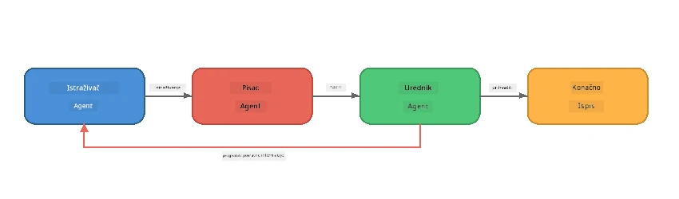
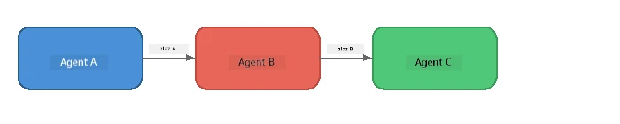
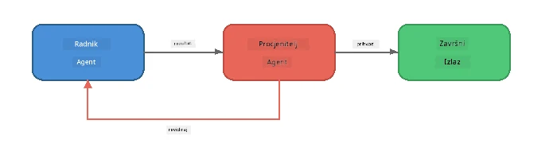
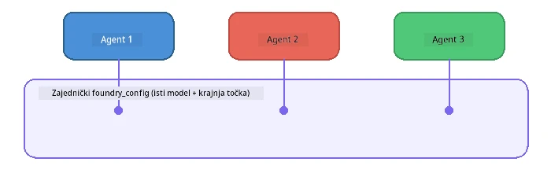

# Dio 6: Više-agentski radni tokovi

> **Cilj:** Kombinirati više specijaliziranih agenata u koordinirane tokove koji dijele složene zadatke između surađujućih agenata - sve lokalno s Foundry Local.

## Zašto više-agentski?

Jedan agent može obaviti mnoge zadatke, ali složeni radni tokovi koriste **specijalizaciju**. Umjesto da jedan agent istovremeno istražuje, piše i uređuje, rad se razdvaja u usredotočene uloge:



| Uzorak | Opis |
|---------|-------------|
| **Sekvencijalni** | Izlaz Agenta A ide u Agenta B → Agenta C |
| **Povratna petlja** | Evaluator agent može poslati rad natrag na reviziju |
| **Zajednički kontekst** | Svi agenti koriste isti model/endpoint, ali različite upute |
| **Tipizirani izlaz** | Agenti proizvode strukturirane rezultate (JSON) za pouzdanu predaju |

---

## Vježbe

### Vježba 1 - Pokreni Više-agentski tok

Radionica uključuje potpun radni tok Istraživač → Pisac → Urednik.

<details>
<summary><strong>🐍 Python</strong></summary>

**Postavljanje:**
```bash
cd python
python -m venv venv

# Windows (PowerShell):
venv\Scripts\Activate.ps1
# macOS:
source venv/bin/activate

pip install -r requirements.txt
```

**Pokretanje:**
```bash
python foundry-local-multi-agent.py
```

**Što se događa:**
1. **Istraživač** prima temu i vraća činjenice u obliku nabrajanja
2. **Pisac** koristi istraživanje i sastavlja blog post (3-4 odlomka)
3. **Urednik** pregledava članak radi kvalitete i vraća PRIHVATI ili REVIDIRAJ

</details>

<details>
<summary><strong>📦 JavaScript</strong></summary>

**Postavljanje:**
```bash
cd javascript
npm install
```

**Pokretanje:**
```bash
node foundry-local-multi-agent.mjs
```

**Isti trostupanjski tok** - Istraživač → Pisac → Urednik.

</details>

<details>
<summary><strong>💜 C#</strong></summary>

**Postavljanje:**
```bash
cd csharp
dotnet restore
```

**Pokretanje:**
```bash
dotnet run multi
```

**Isti trostupanjski tok** - Istraživač → Pisac → Urednik.

</details>

---

### Vježba 2 - Anatomija toka

Istražite kako su agenti definirani i povezani:

**1. Zajednički klijent modela**

Svi agenti dijele isti Foundry Local model:

```python
# Python - FoundryLocalClient upravlja sa svime
from agent_framework_foundry_local import FoundryLocalClient

client = FoundryLocalClient(model_id="phi-3.5-mini")
```

```javascript
// JavaScript - OpenAI SDK usmjeren na Foundry Local
const client = new OpenAI({
  baseURL: manager.urls[0] + "/v1",
  apiKey: "foundry-local",
});
```

```csharp
// C# - OpenAIClient pointed at Foundry Local
var key = new ApiKeyCredential("foundry-local");
var client = new OpenAIClient(key, new OpenAIClientOptions
{
    Endpoint = new Uri(manager.Urls[0] + "/v1")
});
var chatClient = client.GetChatClient(model.Id);
```

**2. specijalizirane upute**

Svaki agent ima posebnu osobnost:

| Agent | Upute (sažetak) |
|-------|----------------------|
| Istraživač | "Daj ključne činjenice, statistike i pozadinu. Organiziraj kao nabrajanje." |
| Pisac | "Napiši zanimljiv blog post (3-4 odlomka) na temelju istraživačkih bilješki. Ne izmišljaj činjenice." |
| Urednik | "Pregledaj jasnoću, gramatiku i činjenice. Presuda: PRIHVATI ili REVIDIRAJ." |

**3. Protok podataka između agenata**

```python
# Korak 1 - rezultat istraživača postaje ulaz za pisca
research_result = await researcher.run(f"Research: {topic}")

# Korak 2 - rezultat pisca postaje ulaz za urednika
writer_result = await writer.run(f"Write using:\n{research_result}")

# Korak 3 - urednik pregledava i istraživanje i članak
editor_result = await editor.run(
    f"Research:\n{research_result}\n\nArticle:\n{writer_result}"
)
```

```csharp
// C# - same pattern, async calls with AIAgent
var researchNotes = await researcher.RunAsync(
    $"Research the following topic and provide key facts:\n{topic}");

var draft = await writer.RunAsync(
    $"Write a blog post based on these research notes:\n\n{researchNotes}");

var verdict = await editor.RunAsync(
    $"Review this article for quality and accuracy.\n\n" +
    $"Research notes:\n{researchNotes}\n\n" +
    $"Article:\n{draft}");
```

> **Ključni uvid:** Svaki agent prima kumulativni kontekst od prethodnih agenata. Urednik vidi i izvornu studiju i nacrt – što mu omogućuje provjeru činjenica.

---

### Vježba 3 - Dodaj četvrtog agenta

Proširite tok dodavanjem novog agenta. Odaberite jedan:

| Agent | Svrha | Upute |
|-------|---------|-------------|
| **Provjeravatelj činjenica** | Provjerava tvrdnje u članku | `"Provjeravate činjenice. Za svaku tvrdnju navedite je li potkrepljena istraživačkim bilješkama. Vratite JSON s verificiranim/nepotvrđenim stavkama."` |
| **Pisac naslova** | Stvara upečatljive naslove | `"Generiraj 5 opcija naslova za članak. Variraj stil: informativno, clickbait, pitanje, listić, emotivno."` |
| **Društvene mreže** | Stvara promotivne objave | `"Kreirajte 3 objave za društvene mreže koje promoviraju ovaj članak: jednu za Twitter (280 znakova), jednu za LinkedIn (profesionalni ton), jednu za Instagram (opušteni s prijedlozima emoji-ja)."` |

<details>
<summary><strong>🐍 Python - dodavanje Pisca naslova</strong></summary>

```python
headline_agent = client.as_agent(
    name="HeadlineWriter",
    instructions=(
        "You are a headline specialist. Given an article, generate exactly "
        "5 headline options. Vary the style: informative, question-based, "
        "listicle, emotional, and provocative. Return them as a numbered list."
    ),
)

# Nakon što urednik prihvati, generiraj naslove
headline_result = await headline_agent.run(
    f"Generate headlines for this article:\n\n{writer_result}"
)
print(f"\n--- Headlines ---\n{headline_result}")
```

</details>

<details>
<summary><strong>📦 JavaScript - dodavanje Pisca naslova</strong></summary>

```javascript
const headlineAgent = new ChatAgent({
  client,
  modelId: modelInfo.id,
  instructions:
    "You are a headline specialist. Given an article, generate exactly " +
    "5 headline options. Vary the style: informative, question-based, " +
    "listicle, emotional, and provocative. Return them as a numbered list.",
  name: "HeadlineWriter",
});

const headlineResult = await headlineAgent.run(
  `Generate headlines for this article:\n\n${writerResult.text}`
);
console.log(`\n--- Headlines ---\n${headlineResult.text}`);
```

</details>

<details>
<summary><strong>💜 C# - dodavanje Pisca naslova</strong></summary>

```csharp
AIAgent headlineAgent = chatClient.AsAIAgent(
    name: "HeadlineWriter",
    instructions:
        "You are a headline specialist. Given an article, generate exactly " +
        "5 headline options. Vary the style: informative, question-based, " +
        "listicle, emotional, and provocative. Return them as a numbered list."
);

// After the editor accepts, generate headlines
var headlines = await headlineAgent.RunAsync(
    $"Generate headlines for this article:\n\n{draft}");
Console.WriteLine($"\n--- Headlines ---\n{headlines}");
```

</details>

---

### Vježba 4 - Osmisli vlastiti radni tok

Osmisli više-agentski tok za drugu domenu. Evo nekoliko ideja:

| Domena | Agenti | Tok |
|--------|--------|------|
| **Pregled koda** | Analizator → Recenzent → Sažetak | Analiziraj strukturu koda → pregledaj za probleme → proizvedi sažetak |
| **Podrška korisnicima** | Klasifikator → Odgovarač → Kontrola kvalitete | Klasificiraj tiket → sastavi odgovor → provjeri kvalitetu |
| **Obrazovanje** | Izradu kviza → Simulator učenika → Ocjenjivač | Generiraj kviz → simuliraj odgovore → ocijeni i objasni |
| **Analiza podataka** | Tumač → Analitičar → Izvještajni | Tumači zahtjev za podatke → analiziraj obrasce → napiši izvještaj |

**Koraci:**
1. Definiraj 3+ agenata sa različitim `uputama`
2. Odredi protok podataka - što svaki agent prima i proizvodi?
3. Implementiraj tok koristeći uzorke iz Vježbi 1-3
4. Dodaj povratnu petlju ako jedan agent treba procijeniti rad drugog

---

## Uzorci orkestracije

Evo uzoraka orkestracije koji vrijede za svaki više-agentski sustav (detaljno obrađeno u [Dio 7](part7-zava-creative-writer.md)):

### Sekvencijalni tok



Svaki agent obrađuje izlaz prethodnog. Jednostavno i predvidivo.

### Povratna petlja



Evaluator agent može pokrenuti ponovni rad ranijih faza. Zava Pisac koristi ovo: urednik može poslati povratne informacije istraživaču i piscu.

### Zajednički kontekst



Svi agenti dijele isti `foundry_config` pa koriste isti model i endpoint.

---

## Ključne pouke

| Koncept | Što ste naučili |
|---------|-----------------|
| Specijalizacija agenata | Svaki agent radi jednu stvar dobro s usredotočenim uputama |
| Predaja podataka | Izlaz jednog agenta postaje ulaz drugog |
| Povratne petlje | Evaluator može izazvati ponovne pokušaje za bolju kvalitetu |
| Strukturirani izlaz | Odgovori u JSON formatu omogućuju pouzdanu komunikaciju među agentima |
| Orkestracija | Koordinator upravlja redoslijedom i upravljanjem pogreškama |
| Produkcijski uzorci | Primijenjeno u [Dio 7: Zava Creative Writer](part7-zava-creative-writer.md) |

---

## Sljedeći koraci

Nastavi na [Dio 7: Zava Creative Writer - capstone aplikacija](part7-zava-creative-writer.md) za istraživanje produkcijski stilizirane više-agentske aplikacije s 4 specijalizirana agenta, streaming izlazom, pretragom proizvoda i povratnim petljama - dostupno u Pythonu, JavaScriptu i C#.

---

<!-- CO-OP TRANSLATOR DISCLAIMER START -->
**Izjava o odricanju od odgovornosti**:  
Ovaj dokument preveden je pomoću AI prevoditeljskog servisa [Co-op Translator](https://github.com/Azure/co-op-translator). Iako težimo točnosti, molimo imajte na umu da automatski prijevodi mogu sadržavati pogreške ili netočnosti. Izvorni dokument na izvornom jeziku treba smatrati službenim izvorom. Za kritične informacije preporučuje se profesionalni ljudski prijevod. Nismo odgovorni za bilo kakve nesporazume ili pogrešne interpretacije koje proizlaze iz korištenja ovog prijevoda.
<!-- CO-OP TRANSLATOR DISCLAIMER END -->