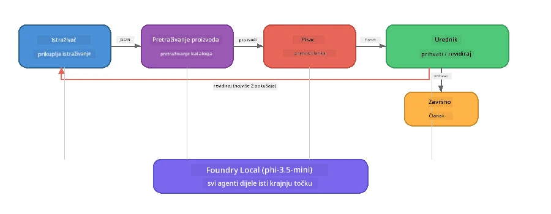

# Dio 7: Zava Creative Writer - završna aplikacija

> **Cilj:** Istražiti proizvodno višesloženu aplikaciju u kojoj četiri specijalizirana agenta surađuju na stvaranju članaka kakvi se nalaze u časopisima za Zava Retail DIY - koja se u potpunosti izvodi na vašem uređaju putem Foundry Local.

Ovo je **završna radionica** tečaja. Spaja sve što ste naučili - integraciju SDK-a (Dio 3), dohvat iz lokalnih podataka (Dio 4), ličnosti agenata (Dio 5) i orkestraciju višestrukih agenata (Dio 6) - u potpunu aplikaciju dostupnu u **Pythonu**, **JavaScriptu** i **C#**.

---

## Što ćete istražiti

| Koncept | Gdje u Zava Writeru |
|---------|---------------------|
| Učitavanje modela u 4 koraka | Zajednički konfiguracijski modul pokreće Foundry Local |
| Dohvat u RAG stilu | Agent za proizvod pretražuje lokalni katalog |
| Specijalizacija agenata | 4 agenta sa različitim sistemskim uputama |
| Streaming izlaz | Pisac isporučuje tokene u stvarnom vremenu |
| Strukturirane predaje | Istraživač → JSON, Urednik → JSON odluka |
| Povratni petlje | Urednik može pokrenuti ponovno izvršavanje (maks 2 pokušaja) |

---

## Arhitektura

Zava Creative Writer koristi **sekvencijalni pipeline s evaluacijskim povratnim informacijama**. Sve tri implementacije jezika slijede istu arhitekturu:



### Četiri agenta

| Agent | Ulaz | Izlaz | Svrha |
|-------|------|-------|-------|
| **Istraživač** | Tema + opcionalna povratna informacija | `{"web": [{url, name, description}, ...]}` | Prikuplja pozadinske istraživačke podatke putem LLM-a |
| **Pretraga proizvoda** | Kontekst proizvoda u tekstu | Popis podudarnih proizvoda | LLM generirane upite + pretraga ključnih riječi po lokalnom katalogu |
| **Pisac** | Istraživanje + proizvodi + zadatak + povratne informacije | Streamirani tekst članka (podijeljen `---`) | Skicira članak kvalitetan za časopis u stvarnom vremenu |
| **Urednik** | Članak + samopovratne informacije pisca | `{"decision": "accept/revise", "editorFeedback": "...", "researchFeedback": "..."}` | Pregledava kvalitetu, pokreće novi pokušaj ako je potrebno |

### Protok pipe-linea

1. **Istraživač** prima temu i generira strukturirane bilješke istraživanja (JSON)
2. **Pretraga proizvoda** upućuje upite lokalnom katalogu proizvoda koristeći LLM generirane termine pretraživanja
3. **Pisac** kombinira istraživanje + proizvode + zadatak u streaming članku, prilažući samopovratne informacije nakon separatora `---`
4. **Urednik** pregledava članak i vraća JSON presudu:
   - `"accept"` → pipeline se završava
   - `"revise"` → povratna informacija se šalje natrag Istraživaču i Piscu (maks 2 pokušaja)

---

## Preduvjeti

- Završiti [Dio 6: Multi-Agent Workflows](part6-multi-agent-workflows.md)
- Instaliran Foundry Local CLI i preuzet model `phi-3.5-mini`

---

## Vježbe

### Vježba 1 - Pokrenite Zava Creative Writer

Odaberite svoj jezik i pokrenite aplikaciju:

<details>
<summary><strong>🐍 Python - FastAPI web servis</strong></summary>

Python verzija radi kao **web servis** s REST API-jem, demonstrirajući kako izgraditi produkcijski backend.

**Postavljanje:**
```bash
cd zava-creative-writer-local/src/api
python -m venv venv

# Windows (PowerShell):
venv\Scripts\Activate.ps1
# macOS:
source venv/bin/activate

pip install -r requirements.txt
```

**Pokreni:**
```bash
uvicorn main:app --reload
```

**Testiraj:**
```bash
curl -X POST http://localhost:8000/api/article \
  -H "Content-Type: application/json" \
  -d '{
    "research": "DIY home improvement trends",
    "products": "power tools and paints",
    "assignment": "Write an article about weekend renovation projects for DIY enthusiasts"
  }'
```

Odgovor se strimuje natrag kao JSON poruke razdvojene novim redom koje prikazuju napredak svakog agenta.

</details>

<details>
<summary><strong>📦 JavaScript - Node.js CLI</strong></summary>

JavaScript verzija radi kao **CLI aplikacija**, ispisujući napredak agenta i članak direktno u konzolu.

**Postavljanje:**
```bash
cd zava-creative-writer-local/src/javascript
npm install
```

**Pokreni:**
```bash
node main.mjs
```

Vidjet ćete:
1. Učitavanje Foundry Local modela (s progres barom ako se preuzima)
2. Svaki agent se izvršava sekvencijalno s porukama o statusu
3. Članak se strimuje u konzolu u stvarnom vremenu
4. Odluka urednika prihvati/izmjeni

</details>

<details>
<summary><strong>💜 C# - .NET konzolna aplikacija</strong></summary>

C# verzija radi kao **.NET konzolna aplikacija** s istim pipeline-om i streaming izlazom.

**Postavljanje:**
```bash
cd zava-creative-writer-local/src/csharp
dotnet restore
```

**Pokreni:**
```bash
dotnet run
```

Isti obrazac izlaza kao JavaScript verzija - poruke o statusu agenata, streaming članka i urednikova presuda.

</details>

---

### Vježba 2 - Prouči strukturu koda

Svaka implementacija jezika ima iste logičke komponente. Usporedi strukture:

**Python** (`src/api/`):
| Datoteka | Svrha |
|----------|---------|
| `foundry_config.py` | Zajednički Foundry Local manager, model i klijent (inicijalizacija u 4 koraka) |
| `orchestrator.py` | Koordinacija pipeline-a s petljom za povratne informacije |
| `main.py` | FastAPI krajnje točke (`POST /api/article`) |
| `agents/researcher/researcher.py` | LLM istraživanje s JSON izlazom |
| `agents/product/product.py` | LLM generirani upiti + pretraga ključnih riječi |
| `agents/writer/writer.py` | Generiranje članka putem streaminga |
| `agents/editor/editor.py` | Odluka prihvati/izmjeni pomoću JSON-a |

**JavaScript** (`src/javascript/`):
| Datoteka | Svrha |
|----------|-------|
| `foundryConfig.mjs` | Zajednička Foundry Local konfiguracija (inicijalizacija u 4 koraka s progres barom) |
| `main.mjs` | Orkestrator + CLI ulazna točka |
| `researcher.mjs` | Istraživački agent temeljen na LLM-u |
| `product.mjs` | Generiranje upita LLM-om + pretraga ključnih riječi |
| `writer.mjs` | Streaming generiranje članka (async generator) |
| `editor.mjs` | Odluka prihvati/izmjeni u JSON formatu |
| `products.mjs` | Podaci o katalogu proizvoda |

**C#** (`src/csharp/`):
| Datoteka | Svrha |
|----------|-------|
| `Program.cs` | Kompletan pipeline: učitavanje modela, agenti, orkestrator, povratne informacije |
| `ZavaCreativeWriter.csproj` | .NET 9 projekt s Foundry Local + OpenAI paketima |

> **Dizajnerska bilješka:** Python odvaja svakog agenta u vlastitu datoteku/direktorij (pogodno za veće timove). JavaScript koristi jedan modul po agentu (pogodno za srednje projekte). C# drži sve u jednoj datoteci s lokalnim funkcijama (pogodno za samostalne primjere). U produkciji izaberite šablon koji odgovara timu.

---

### Vježba 3 - Prati zajedničku konfiguraciju

Svaki agent u pipelineu dijeli jednoga Foundry Local model klijenta. Prouči kako je to postavljeno u svakom jeziku:

<details>
<summary><strong>🐍 Python - foundry_config.py</strong></summary>

```python
from foundry_local import FoundryLocalManager

MODEL_ALIAS = "phi-3.5-mini"

# Korak 1: Kreirajte manager i pokrenite Foundry Local uslugu
manager = FoundryLocalManager()
manager.start_service()

# Korak 2: Provjerite je li model već preuzet
cached = manager.list_cached_models()
catalog_info = manager.get_model_info(MODEL_ALIAS)
is_cached = any(m.id == catalog_info.id for m in cached) if catalog_info else False

if not is_cached:
    manager.download_model(MODEL_ALIAS)

# Korak 3: Učitajte model u memoriju
manager.load_model(MODEL_ALIAS)
model_id = manager.get_model_info(MODEL_ALIAS).id

# Zajednički OpenAI klijent
client = openai.OpenAI(base_url=manager.endpoint, api_key=manager.api_key)
```

Svi agenti importaju `from foundry_config import client, model_id`.

</details>

<details>
<summary><strong>📦 JavaScript - foundryConfig.mjs</strong></summary>

```javascript
import { FoundryLocalManager } from "foundry-local-sdk";
import { OpenAI } from "openai";

FoundryLocalManager.create({ appName: "ZavaCreativeWriter" });
const manager = FoundryLocalManager.instance;
await manager.startWebService();

// Provjeri predmemoriju → preuzmi → učitaj (novi obrazac SDK-a)
const catalog = manager.catalog;
const model = await catalog.getModel(MODEL_ALIAS);
if (!model.isCached) {
  console.log(`Downloading model: ${MODEL_ALIAS}...`);
  await model.download();
}
await model.load();

const client = new OpenAI({ baseURL: manager.urls[0] + "/v1", apiKey: "foundry-local" });
const modelId = model.id;
export { client, modelId };
```

Svi agenti importaju `{ client, modelId } from "./foundryConfig.mjs"`.

</details>

<details>
<summary><strong>💜 C# - početak Program.cs</strong></summary>

```csharp
await FoundryLocalManager.CreateAsync(
    new Configuration
    {
        AppName = "ZavaCreativeWriter",
        Web = new Configuration.WebService { Urls = "http://127.0.0.1:0" }
    }, NullLogger.Instance, default);
var manager = FoundryLocalManager.Instance;
await manager.StartWebServiceAsync(default);

var catalog = await manager.GetCatalogAsync(default);
var catalogModel = await catalog.GetModelAsync(alias, default);
var isCached = await catalogModel.IsCachedAsync(default);
if (!isCached)
    await catalogModel.DownloadAsync(null, default);

await catalogModel.LoadAsync(default);
var key = new ApiKeyCredential("foundry-local");
var chatClient = new OpenAIClient(key, new OpenAIClientOptions
{
    Endpoint = new Uri(manager.Urls[0] + "/v1")
}).GetChatClient(catalogModel.Id);
```

`chatClient` se zatim prosljeđuje svim funkcijama agenata u istoj datoteci.

</details>

> **Ključni uzorak:** Uzorak učitavanja modela (pokreni servis → provjeri cache → preuzmi → učitaj) osigurava da korisnik vidi jasan progres i model se preuzima samo jednom. Ovo je najbolja praksa za svaku Foundry Local aplikaciju.

---

### Vježba 4 - Razumi petlju povratnih informacija

Petlja povratnih informacija je ono što ovaj pipeline čini "pametnim" - Urednik može poslati posao natrag na reviziju. Prouči logiku:

```
Orchestrator:
  1. researcher.research(topic, "No Feedback")    ← first pass
  2. product.findProducts(productContext)
  3. writer.write(research, products, assignment)  ← streams article
  4. Split article at "---" → article + writerFeedback
  5. editor.edit(article, writerFeedback)

  WHILE editor says "revise" AND retryCount < 2:
    6. researcher.research(topic, editor.researchFeedback)  ← refined
    7. writer.write(research, products, editor.editorFeedback)
    8. editor.edit(newArticle, newWriterFeedback)
    9. retryCount++
```

**Pitanja za razmišljanje:**
- Zašto je limit pokušaja 2? Što se događa ako ga povećaš?
- Zašto Istraživač dobiva `researchFeedback`, a Pisac `editorFeedback`?
- Što bi se dogodilo kada bi urednik uvijek rekao "izmijeni"?

---

### Vježba 5 - Izmijeni jednog agenta

Pokušaj promijeniti ponašanje jednog agenta i promatraj kako to utječe na pipeline:

| Izmjena | Što promijeniti |
|---------|-----------------|
| **Stroži urednik** | Promijeni urednikov sistemski prompt tako da uvijek traži barem jednu reviziju |
| **DužI članci** | Promijeni Pisčev prompt s "800-1000 riječi" na "1500-2000 riječi" |
| **Drugačiji proizvodi** | Dodaj ili izmijeni proizvode u katalogu proizvoda |
| **Nova tema istraživanja** | Promijeni zadani `researchContext` u drugu temu |
| **Samo JSON istraživač** | Neka istraživač vrati 10 stavki umjesto 3-5 |

> **Savjet:** Budući da sva tri jezika implementiraju istu arhitekturu, možeš napraviti istu izmjenu u bilo kojem jeziku s kojim se najbolje snalaziš.

---

### Vježba 6 - Dodaj petog agenta

Proširi pipeline novim agentom. Nekoliko ideja:

| Agent | Gdje u pipelineu | Svrha |
|-------|------------------|-------|
| **Provjeravatelj činjenica** | Nakon Pisca, prije Urednika | Provjerava tvrdnje u odnosu na istraživačke podatke |
| **SEO Optimizator** | Nakon prihvaćanja od Urednika | Dodaje meta opis, ključne riječi, slug |
| **Ilustrator** | Nakon prihvaćanja od Urednika | Generira slikovne promptove za članak |
| **Prevoditelj** | Nakon prihvaćanja od Urednika | Prevodi članak na drugi jezik |

**Koraci:**
1. Napiši sistemski prompt agenta
2. Kreiraj funkciju agenta (u skladu s postojećim šablonima u tvom jeziku)
3. Ubaci ga na pravo mjesto u orkestrator
4. Ažuriraj izlaz/log za prikaz novog doprinosa agenta

---

## Kako Foundry Local i Agent Framework surađuju

Ova aplikacija demonstrira preporučeni obrazac za izgradnju višestrukih agentskih sustava pomoću Foundry Local:

| Sloj | Komponenta | Uloga |
|-------|------------|-------|
| **Runtime** | Foundry Local | Preuzima, upravlja i lokalno servisira model |
| **Klijent** | OpenAI SDK | Šalje chat dovršenja lokalnoj endpoint adresi |
| **Agent** | Sistem prompt + chat poziv | specijalizirano ponašanje kroz fokusirane upute |
| **Orkestrator** | Koordinator pipelinea | Upravljanje protokom podataka, redoslijedom i povratnim petljama |
| **Framework** | Microsoft Agent Framework | Pruža apstrakciju `ChatAgent` i obrasce |

Ključna spoznaja: **Foundry Local zamjenjuje cloud backend, a ne arhitekturu aplikacije.** Isti obrasci agenata, orkestracijske strategije i strukturirane predaje koji rade s modelima u oblaku rade jednako dobro i s lokalnim modelima — samo klijent treba biti usmjeren na lokalnu endpoint adresu umjesto Azure endpointa.

---

## Ključne spoznaje

| Koncept | Što ste naučili |
|---------|-----------------|
| Produkcijska arhitektura | Kako strukturirati višestruku agentnu aplikaciju sa zajedničkom konfiguracijom i odvojenim agentima |
| Učitavanje modela u 4 koraka | Najbolja praksa za inicijalizaciju Foundry Local s vidljivim progresom za korisnika |
| Specijalizacija agenata | Svaki od 4 agenta ima fokusirane upute i specifičan izlazni format |
| Streaming generacija | Pisac isporučuje tokene u stvarnom vremenu, omogućujući responzivni UI |
| Povratne petlje | Pokušaji u kojima upravlja urednik poboljšavaju kvalitetu bez ljudske intervencije |
| Obrasci između jezika | Ista arhitektura radi u Pythonu, JavaScriptu i C# |
| Lokalno = spremno za produkciju | Foundry Local servisira isti OpenAI-kompatibilni API koji se koristi u cloud implementacijama |

---

## Sljedeći korak

Nastavite na [Dio 8: Evaluacija vođena razvojem](part8-evaluation-led-development.md) kako biste izgradili sustavni okvir za evaluaciju svojih agenata, koristeći zlatne skupove podataka, provjere zasnovane na pravilima i LLM kao suca za ocjenjivanje.

---

<!-- CO-OP TRANSLATOR DISCLAIMER START -->
**Odricanje od odgovornosti**:  
Ovaj je dokument preveden pomoću AI usluge prevođenja [Co-op Translator](https://github.com/Azure/co-op-translator). Iako nastojimo postići točnost, imajte na umu da automatski prijevodi mogu sadržavati pogreške ili netočnosti. Izvorni dokument na izvornom jeziku treba smatrati službenim izvorom. Za kritične informacije preporuča se profesionalni ljudski prijevod. Nismo odgovorni za bilo kakve nesporazume ili pogrešna tumačenja koja proizlaze iz korištenja ovog prijevoda.
<!-- CO-OP TRANSLATOR DISCLAIMER END -->