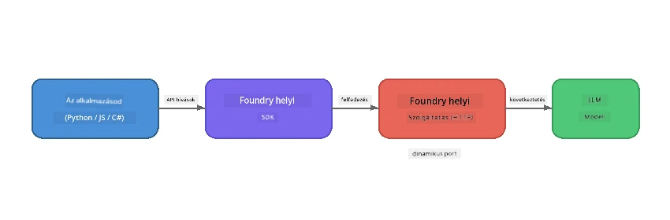

# 1. rész: Kezdés a Foundry Local-lel


## Mi az a Foundry Local?

A [Foundry Local](https://foundrylocal.ai) lehetővé teszi, hogy nyílt forráskódú AI nyelvi modelleket **közvetlenül a számítógépeden futtass** – internetkapcsolat nélkül, felhőköltségek nélkül, és teljes adatvédelmet biztosítva. Így működik:

- **Lehetővé teszi, hogy a modelleket helyben töltsd le és futtasd**, automatikus hardveroptimalizálással (GPU, CPU vagy NPU)
- **OpenAI-kompatibilis API-t biztosít**, így ismerős SDK-kat és eszközöket használhatsz
- **Nem igényel Azure előfizetést** vagy regisztrációt – csak telepítsd és kezdj építeni

Gondolj rá úgy, mint a saját privát AI-dra, amely teljes egészében a gépeden fut.

## Tanulási célok

A labor végére képes leszel:

- Telepíteni a Foundry Local CLI-t az operációs rendszereden
- Megérteni, mik azok a modell aliasok és hogyan működnek
- Letölteni és futtatni az első helyi AI modellt
- Parancssorból chat üzenetet küldeni egy helyi modellnek
- Megérteni a helyi és a felhőalapú AI modellek közötti különbséget

---

## Előfeltételek

### Rendszerkövetelmények

| Követelmény | Minimum | Ajánlott |
|-------------|---------|-------------|
| **RAM** | 8 GB | 16 GB |
| **Lemezterület** | 5 GB (modellekhez) | 10 GB |
| **CPU** | 4 mag | 8+ mag |
| **GPU** | Opcionális | NVIDIA CUDA 11.8+ támogatással |
| **Operációs rendszer** | Windows 10/11 (x64/ARM), Windows Server 2025, macOS 13+ | - |

> **Megjegyzés:** A Foundry Local automatikusan kiválasztja a legjobb modellváltozatot a hardveredhez. Ha NVIDIA GPU-d van, CUDA gyorsítást használ. Ha Qualcomm NPU-d van, azt veszi igénybe. Egyébként egy optimalizált CPU változatra tér át.

### Foundry Local CLI telepítése

**Windows** (PowerShell):
```powershell
winget install Microsoft.FoundryLocal
```

**macOS** (Homebrew):
```bash
brew tap microsoft/foundrylocal
brew install foundrylocal
```

> **Megjegyzés:** A Foundry Local jelenleg csak Windows és macOS rendszereket támogat. Linux jelenleg nem támogatott.

Ellenőrizd a telepítést:
```bash
foundry --version
```

---

## Laborfeladatok

### 1. feladat: Elérhető modellek felfedezése

A Foundry Local tartalmaz egy előre optimalizált nyílt forráskódú modellek katalógusát. Sorold fel őket:

```bash
foundry model list
```

Ilyen modelleket fogsz látni:
- `phi-3.5-mini` – a Microsoft 3,8 milliárd paraméteres modellje (gyors, jó minőségű)
- `phi-4-mini` – Újabb, képzettebb Phi modell
- `phi-4-mini-reasoning` – Phi modell láncolt gondolkodással (`<think>` címkékkel)
- `phi-4` – a Microsoft legnagyobb Phi modellje (10,4 GB)
- `qwen2.5-0.5b` – Nagyon kicsi és gyors (alkalmas kevés erőforrású eszközökre)
- `qwen2.5-7b` – Erős általános célú modell eszközhívási támogatással
- `qwen2.5-coder-7b` – Kódgenerálásra optimalizálva
- `deepseek-r1-7b` – Erős gondolkodási modell
- `gpt-oss-20b` – Nagy nyílt forráskódú modell (MIT licencia, 12,5 GB)
- `whisper-base` – Beszéd szöveggé alakítása (383 MB)
- `whisper-large-v3-turbo` – Nagy pontosságú átirat (9 GB)

> **Mi az a modell alias?** Az olyan aliasok, mint a `phi-3.5-mini`, gyorsgombok. Ha egy alias-t használsz, a Foundry Local automatikusan letölti a hardveredhez legalkalmasabb változatot (CUDA-t NVIDIA GPU-knak, CPU-optimalizáltat másoknak). Nem kell aggódnod, melyiket válaszd.

### 2. feladat: Első modell futtatása

Töltsd le és kezdd el a csevegést egy modellel interaktívan:

```bash
foundry model run phi-3.5-mini
```

Első futtatáskor a Foundry Local:
1. Felismeri a hardveredet
2. Letölti az optimális modellváltozatot (ez eltarthat pár percig)
3. Betölti a modellt a memóriába
4. Elindít egy interaktív chat munkamenetet

Próbálj meg tőle kérdéseket kérdezni:
```
You: What is the golden ratio?
You: Can you explain it as if I were 10 years old?
You: Write a haiku about mathematics
```

A kilépéshez írd be, hogy `exit` vagy nyomd meg a `Ctrl+C`-t.

### 3. feladat: Modell előzetes letöltése

Ha modellt csak le szeretnél tölteni, chat indítása nélkül:

```bash
foundry model download phi-3.5-mini
```

Ellenőrizd mely modellek vannak már letöltve a gépeden:

```bash
foundry cache list
```

### 4. feladat: Értsd meg az architektúrát

A Foundry Local **helyi HTTP szolgáltatásként** fut, amely OpenAI-kompatibilis REST API-t kínál. Ez azt jelenti:

1. A szolgáltatás egy **dinamikus porton** indul (minden alkalommal más port)
2. Az SDK-t használod az aktuális végpont URL-jének lekérdezésére
3. **Bármilyen** OpenAI-kompatibilis kliens könyvtárat használhatsz a kommunikációhoz



> **Fontos:** A Foundry Local minden induláskor **dinamikus portot** kap. Soha ne kódolj be fix portszámot, pl. `localhost:5272`. Mindig az SDK-val kérdezd le az aktuális URL-t (pl. `manager.endpoint` Pythonban vagy `manager.urls[0]` JavaScriptben).

---

## Főbb tanulságok

| Fogalom | Amit megtanultál |
|---------|------------------|
| Eszközön futó AI | A Foundry Local modelleket teljes egészében az eszközödön futtat, felhő, API kulcsok és költségek nélkül |
| Modell aliasok | Az olyan aliasok, mint a `phi-3.5-mini`, automatikusan a hardveredhez legjobb modellváltozatot választják |
| Dinamikus portok | A szolgáltatás dinamikus porton fut; az SDK-val kérdezd le mindig a végpontot |
| CLI és SDK | A modellekkel CLI-n (`foundry model run`) vagy programozottan az SDK-n keresztül is kommunikálhatsz |

---

## Következő lépések

Folytasd a [2. részt: Foundry Local SDK mélyreható bemutató](part2-foundry-local-sdk.md)-t, hogy profi legyél az SDK API kezelésében modellek, szolgáltatások és cache programozott kezeléséhez.