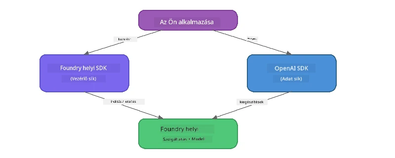

# 3. rész: A Foundry Local SDK használata az OpenAI-val

## Áttekintés

Az 1. részben interaktívan futtattad a modelleket a Foundry Local CLI segítségével. A 2. részben felfedezted az SDK teljes API felületét. Most megtanulod, hogyan integráld a **Foundry Local-ot az alkalmazásaidba** az SDK és az OpenAI-kompatibilis API használatával.

A Foundry Local három nyelvhez biztosít SDK-kat. Válaszd azt, amelyik a legkényelmesebb számodra – a koncepciók mindhárom nyelven azonosak.

## Tanulási célok

A labornak a végére képes leszel:

- Telepíteni a Foundry Local SDK-t a választott nyelvedhez (Python, JavaScript vagy C#)
- Inicializálni a `FoundryLocalManager`-t a szolgáltatás indításához, a cache ellenőrzéséhez, modell letöltéséhez és betöltéséhez
- Kapcsolódni a helyi modellhez az OpenAI SDK-val
- Chat befejezéseket küldeni és kezelni a streaming válaszokat
- Megérteni a dinamikus port architektúrát

---

## Előfeltételek

Először fejezd be a [1. rész: Első lépések a Foundry Local-lal](part1-getting-started.md) és a [2. rész: Foundry Local SDK Mélyreható](part2-foundry-local-sdk.md) anyagokat.

Telepítsd **egyiket** az alábbi nyelvi futtatókörnyezetek közül:
- **Python 3.9+** - [python.org/downloads](https://www.python.org/downloads/)
- **Node.js 18+** - [nodejs.org](https://nodejs.org/)
- **.NET 9.0+** - [dot.net/download](https://dotnet.microsoft.com/download)

---

## Koncepció: Hogyan működik az SDK

A Foundry Local SDK kezeli a **vezérlő síkot** (a szolgáltatás indítása, modellek letöltése), míg az OpenAI SDK a **adat síkot** (promptok küldése, válaszok fogadása).



---

## Laborfeladatok

### Feladat 1: Állítsd be a környezetedet

<details>
<summary><b>🐍 Python</b></summary>

```bash
cd python
python -m venv venv

# Aktiváld a virtuális környezetet:
# Windows (PowerShell):
venv\Scripts\Activate.ps1
# Windows (Parancssor):
venv\Scripts\activate.bat
# macOS:
source venv/bin/activate

pip install -r requirements.txt
```

A `requirements.txt` telepíti:
- `foundry-local-sdk` - A Foundry Local SDK (importálva `foundry_local` néven)
- `openai` - Az OpenAI Python SDK
- `agent-framework` - Microsoft Agent Framework (későbbi részekben használatos)

</details>

<details>
<summary><b>📘 JavaScript</b></summary>

```bash
cd javascript
npm install
```

A `package.json` telepíti:
- `foundry-local-sdk` - A Foundry Local SDK
- `openai` - Az OpenAI Node.js SDK

</details>

<details>
<summary><b>💜 C#</b></summary>

```bash
cd csharp
dotnet restore
dotnet build
```

A `csharp.csproj` használja:
- `Microsoft.AI.Foundry.Local` - A Foundry Local SDK (NuGet)
- `OpenAI` - Az OpenAI C# SDK (NuGet)

> **Projekt struktúra:** A C# projekt `Program.cs` fájlja egy parancssori routert használ, amely különálló példafájlokra irányítja a vezérlést. Futtasd a `dotnet run chat` (vagy csak `dotnet run`) parancsot ehhez a részhez. Más részekhez használd a `dotnet run rag`, `dotnet run agent`, illetve `dotnet run multi` parancsokat.

</details>

---

### Feladat 2: Alapvető chat befejezés

Nyisd meg az alap chat példát a választott nyelven és nézd át a kódot. Minden szkript ugyanazt a háromlépéses folyamatot követi:

1. **Indítsd el a szolgáltatást** - `FoundryLocalManager` elindítja a Foundry Local futtatókörnyezetet
2. **Töltsd le és töltsd be a modellt** - ellenőrizd a cache-t, ha kell, töltsd le, majd töltsd be memóriába
3. **Hozz létre egy OpenAI klienst** - csatlakozz a helyi végponthoz, és küldj streaming chat befejezést

<details>
<summary><b>🐍 Python - <code>python/foundry-local.py</code></b></summary>

```python
import sys
import openai
from foundry_local import FoundryLocalManager

alias = "phi-3.5-mini"

# 1. lépés: Hozzon létre egy FoundryLocalManager-t és indítsa el a szolgáltatást
print("Starting Foundry Local service...")
manager = FoundryLocalManager()
manager.start_service()

# 2. lépés: Ellenőrizze, hogy a modell már le van-e töltve
cached = manager.list_cached_models()
catalog_info = manager.get_model_info(alias)
is_cached = any(m.id == catalog_info.id for m in cached) if catalog_info else False

if is_cached:
    print(f"Model already downloaded: {alias}")
else:
    print(f"Downloading model: {alias} (this may take several minutes)...")
    manager.download_model(alias)
    print(f"Download complete: {alias}")

# 3. lépés: Töltse be a modellt a memóriába
print(f"Loading model: {alias}...")
manager.load_model(alias)

# Hozzon létre egy OpenAI klienst, amely a HELYI Foundry szolgáltatásra mutat
client = openai.OpenAI(
    base_url=manager.endpoint,   # Dinamikus port - soha ne kódolja be keményen!
    api_key=manager.api_key
)

# Generáljon egy folyamatos chat befejezést
stream = client.chat.completions.create(
    model=manager.get_model_info(alias).id,
    messages=[{"role": "user", "content": "What is the golden ratio?"}],
    stream=True,
)

for chunk in stream:
    if chunk.choices[0].delta.content is not None:
        print(chunk.choices[0].delta.content, end="", flush=True)
print()
```

**Futtasd a következővel:**
```bash
python foundry-local.py
```

</details>

<details>
<summary><b>📘 JavaScript - <code>javascript/foundry-local.mjs</code></b></summary>

```javascript
import { OpenAI } from "openai";
import { FoundryLocalManager } from "foundry-local-sdk";

const alias = "phi-3.5-mini";

// 1. lépés: Indítsa el a Foundry Local szolgáltatást
console.log("Starting Foundry Local service...");
FoundryLocalManager.create({ appName: "FoundryLocalWorkshop" });
const manager = FoundryLocalManager.instance;
await manager.startWebService();

// 2. lépés: Ellenőrizze, hogy a modell már le van-e töltve
const catalog = manager.catalog;
const model = await catalog.getModel(alias);

if (model.isCached) {
  console.log(`Model already downloaded: ${alias}`);
} else {
  console.log(`Downloading model: ${alias} (this may take several minutes)...`);
  await model.download();
  console.log(`Download complete: ${alias}`);
}

// 3. lépés: Töltse be a modellt a memóriába
console.log(`Loading model: ${alias}...`);
await model.load();
console.log(`Model loaded: ${model.id}`);

// Hozzon létre egy OpenAI klienst, amely a helyi Foundry szolgáltatásra mutat
const client = new OpenAI({
  baseURL: manager.urls[0] + "/v1",   // Dinamikus port - soha ne kódolja be szilárdan!
  apiKey: "foundry-local",
});

// Streaming chat befejezést generál
const stream = await client.chat.completions.create({
  model: model.id,
  messages: [{ role: "user", content: "What is the golden ratio?" }],
  stream: true,
});

for await (const chunk of stream) {
  if (chunk.choices[0]?.delta?.content) {
    process.stdout.write(chunk.choices[0].delta.content);
  }
}
console.log();
```

**Futtasd a következővel:**
```bash
node foundry-local.mjs
```

</details>

<details>
<summary><b>💜 C# - <code>csharp/BasicChat.cs</code></b></summary>

```csharp
using Microsoft.AI.Foundry.Local;
using Microsoft.Extensions.Logging.Abstractions;
using OpenAI;
using OpenAI.Chat;
using System.ClientModel;

var alias = "phi-3.5-mini";

// Step 1: Start the Foundry Local service
Console.WriteLine("Starting Foundry Local service...");
await FoundryLocalManager.CreateAsync(
    new Configuration
    {
        AppName = "FoundryLocalSamples",
        Web = new Configuration.WebService { Urls = "http://127.0.0.1:0" }
    }, NullLogger.Instance, default);
var manager = FoundryLocalManager.Instance;
await manager.StartWebServiceAsync(default);

// Step 2: Get the model from the catalog
var catalog = await manager.GetCatalogAsync(default);
var model = await catalog.GetModelAsync(alias, default);

// Step 3: Check if the model is already downloaded
var isCached = await model.IsCachedAsync(default);

if (isCached)
{
    Console.WriteLine($"Model already downloaded: {alias}");
}
else
{
    Console.WriteLine($"Downloading model: {alias} (this may take several minutes)...");
    await model.DownloadAsync(null, default);
    Console.WriteLine($"Download complete: {alias}");
}

// Step 4: Load the model into memory
Console.WriteLine($"Loading model: {alias}...");
await model.LoadAsync(default);
Console.WriteLine($"Loaded model: {model.Id}");
Console.WriteLine($"Endpoint: {manager.Urls[0]}");

// Create OpenAI client pointing to the LOCAL Foundry service
var key = new ApiKeyCredential("foundry-local");
var client = new OpenAIClient(key, new OpenAIClientOptions
{
    Endpoint = new Uri(manager.Urls[0] + "/v1")  // Dynamic port - never hardcode!
});

var chatClient = client.GetChatClient(model.Id);

// Stream a chat completion
var completionUpdates = chatClient.CompleteChatStreaming("What is the golden ratio?");

foreach (var update in completionUpdates)
{
    if (update.ContentUpdate.Count > 0)
    {
        Console.Write(update.ContentUpdate[0].Text);
    }
}
Console.WriteLine();
```

**Futtasd a következővel:**
```bash
dotnet run chat
```

</details>

---

### Feladat 3: Kísérletezz a promptokkal

Miután az alap példád fut, próbáld meg módosítani a kódot:

1. **Változtasd meg a felhasználói üzenetet** - próbálj ki különböző kérdéseket
2. **Adj hozzá egy rendszer promptot** - adj személyiséget a modellnek
3. **Kapcsold ki a streaminget** - állítsd `stream=False`-ra és egyszerre nyomtasd ki a teljes választ
4. **Próbálj ki más modellt** - változtasd meg az alias-t `phi-3.5-mini`-ről egy másik modellre a `foundry model list` alapján

<details>
<summary><b>🐍 Python</b></summary>

```python
# Adj hozzá egy rendszerüzenetet - adj a modellnek egy személyiséget:
stream = client.chat.completions.create(
    model=manager.get_model_info(alias).id,
    messages=[
        {"role": "system", "content": "You are a pirate. Answer everything in pirate speak."},
        {"role": "user", "content": "What is the golden ratio?"}
    ],
    stream=True,
)

# Vagy kapcsold ki a folyamatos adatátvitelt:
response = client.chat.completions.create(
    model=manager.get_model_info(alias).id,
    messages=[{"role": "user", "content": "What is the golden ratio?"}],
    stream=False,
)
print(response.choices[0].message.content)
```

</details>

<details>
<summary><b>📘 JavaScript</b></summary>

```javascript
// Adj hozzá egy rendszerüzenetet - adj a modellnek egy személyiséget:
const stream = await client.chat.completions.create({
  model: modelInfo.id,
  messages: [
    { role: "system", content: "You are a pirate. Answer everything in pirate speak." },
    { role: "user", content: "What is the golden ratio?" },
  ],
  stream: true,
});

// Vagy kapcsold ki a folyamatos adatfolyamot:
const response = await client.chat.completions.create({
  model: modelInfo.id,
  messages: [{ role: "user", content: "What is the golden ratio?" }],
  stream: false,
});
console.log(response.choices[0].message.content);
```

</details>

<details>
<summary><b>💜 C#</b></summary>

```csharp
// Add a system prompt - give the model a persona:
var completionUpdates = chatClient.CompleteChatStreaming(
    new ChatMessage[]
    {
        new SystemChatMessage("You are a pirate. Answer everything in pirate speak."),
        new UserChatMessage("What is the golden ratio?")
    }
);

// Or turn off streaming:
var response = chatClient.CompleteChat("What is the golden ratio?");
Console.WriteLine(response.Value.Content[0].Text);
```

</details>

---

### SDK Metódus Referencia

<details>
<summary><b>🐍 Python SDK Metódusok</b></summary>

| Metódus | Funkció |
|--------|---------|
| `FoundryLocalManager()` | Kezelő létrehozása |
| `manager.start_service()` | Foundry Local szolgáltatás indítása |
| `manager.list_cached_models()` | A készülékre letöltött modellek listázása |
| `manager.get_model_info(alias)` | Modell azonosító és metaadatok lekérése |
| `manager.download_model(alias, progress_callback=fn)` | Modell letöltése opcionális folyamatjelzővel |
| `manager.load_model(alias)` | Modell betöltése memóriába |
| `manager.endpoint` | A dinamikus végpont URL lekérése |
| `manager.api_key` | API kulcs lekérése (helyi esetben helyőrző) |

</details>

<details>
<summary><b>📘 JavaScript SDK Metódusok</b></summary>

| Metódus | Funkció |
|--------|---------|
| `FoundryLocalManager.create({ appName })` | Kezelő létrehozása |
| `FoundryLocalManager.instance` | Singleton kezelő elérése |
| `await manager.startWebService()` | Foundry Local szolgáltatás indítása |
| `await manager.catalog.getModel(alias)` | Modell lekérése a katalógusból |
| `model.isCached` | Ellenőrzés, hogy a modell le van-e töltve |
| `await model.download()` | Modell letöltése |
| `await model.load()` | Modell betöltése memóriába |
| `model.id` | Modell azonosító lekérése OpenAI API hívásokhoz |
| `manager.urls[0] + "/v1"` | Dinamikus végpont URL lekérése |
| `"foundry-local"` | API kulcs (helyi esetben helyőrző) |

</details>

<details>
<summary><b>💜 C# SDK Metódusok</b></summary>

| Metódus | Funkció |
|--------|---------|
| `FoundryLocalManager.CreateAsync(config)` | Kezelő létrehozása és inicializálása |
| `manager.StartWebServiceAsync()` | Foundry Local webszolgáltatás indítása |
| `manager.GetCatalogAsync()` | Modell katalógus lekérése |
| `catalog.ListModelsAsync()` | Elérhető modellek listázása |
| `catalog.GetModelAsync(alias)` | Egy adott modell lekérése alias alapján |
| `model.IsCachedAsync()` | Ellenőrzés, hogy a modell le van-e töltve |
| `model.DownloadAsync()` | Modell letöltése |
| `model.LoadAsync()` | Modell betöltése memóriába |
| `manager.Urls[0]` | Dinamikus végpont URL lekérése |
| `new ApiKeyCredential("foundry-local")` | API kulcs tanúsítvány helyi használathoz |

</details>

---

### Feladat 4: Natív ChatClient használata (Alternatíva az OpenAI SDK helyett)

A 2. és 3. feladatban az OpenAI SDK-val végeztél chat befejezéseket. A JavaScript és C# SDK-k natív **ChatClient**-et is biztosítanak, amely teljesen kiváltja az OpenAI SDK szükségességét.

<details>
<summary><b>📘 JavaScript - <code>model.createChatClient()</code></b></summary>

```javascript
import { FoundryLocalManager } from "foundry-local-sdk";

const alias = "phi-3.5-mini";

FoundryLocalManager.create({ appName: "ChatClientDemo" });
const manager = FoundryLocalManager.instance;
await manager.startWebService();

const model = await manager.catalog.getModel(alias);
if (!model.isCached) await model.download();
await model.load();

// Nem szükséges OpenAI import — közvetlenül a modelltől kapj egy klienst
const chatClient = model.createChatClient();

// Nem folyamatos kimenet
const response = await chatClient.completeChat([
  { role: "system", content: "You are a pirate. Answer everything in pirate speak." },
  { role: "user", content: "What is the golden ratio?" }
]);
console.log(response.choices[0].message.content);

// Folyamatos kimenet (callback mintát használ)
await chatClient.completeStreamingChat(
  [{ role: "user", content: "What is the golden ratio?" }],
  (chunk) => {
    if (chunk.choices?.[0]?.delta?.content) {
      process.stdout.write(chunk.choices[0].delta.content);
    }
  }
);
console.log();
```

> **Megjegyzés:** A ChatClient `completeStreamingChat()` metódusa **callback** mintát használ, nem aszinkron iterátort. Második paraméterként adj meg egy függvényt.

</details>

<details>
<summary><b>💜 C# - <code>model.GetChatClientAsync()</code></b></summary>

```csharp
var catalog = await manager.GetCatalogAsync(default);
var model = await catalog.GetModelAsync("phi-3.5-mini", default);
if (!await model.IsCachedAsync(default))
    await model.DownloadAsync(null, default);
await model.LoadAsync(default);

// No OpenAI NuGet needed — get a client directly from the model
var chatClient = await model.GetChatClientAsync(default);

// Use it like a standard OpenAI ChatClient
var response = chatClient.CompleteChat("What is the golden ratio?");
Console.WriteLine(response.Value.Content[0].Text);
```

</details>

> **Mikor melyiket használd:**
> | Megközelítés | Legalkalmasabb |
> |-------------|----------------|
> | OpenAI SDK | Teljes paramétervezérlés, éles alkalmazások, meglévő OpenAI kódok |
> | Natív ChatClient | Gyors prototipizálás, kevesebb függőség, egyszerűbb beállítás |

---

## Főbb tanulságok

| Koncepció | Amit megtanultál |
|-----------|------------------|
| Vezérlő sík | A Foundry Local SDK kezeli a szolgáltatás indítását és a modellek betöltését |
| Adat sík | Az OpenAI SDK kezeli a chat befejezéseket és streaminget |
| Dinamikus portok | Mindig az SDK-t használd a végpont felfedezéséhez; soha ne kódolj be URL-eket |
| Többnyelvű támogatás | Ugyanaz a kódséma működik Python, JavaScript és C# nyelveken |
| OpenAI kompatibilitás | Teljes OpenAI API kompatibilitás: a meglévő OpenAI kódok minimális módosítással működnek |
| Natív ChatClient | `createChatClient()` (JS) / `GetChatClientAsync()` (C#) alternatívát kínál az OpenAI SDK helyett |

---

## Következő lépések

Folytasd a [4. rész: RAG alkalmazás építése](part4-rag-fundamentals.md) anyaggal, hogy megtanuld, hogyan építs fel egy teljesen helyi eszközön futó Retrieval-Augmented Generation rendszert.