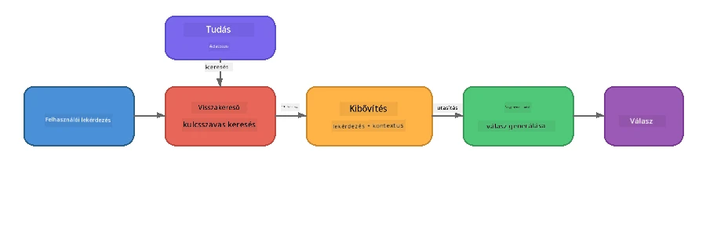

# 4. rész: RAG alkalmazás építése Foundry Local-lal

## Áttekintés

A Nagy Nyelvi Modellek hatékonyak, de csak azt tudják, ami a tanító adataikban volt. A **Retrieval-Augmented Generation (RAG)** ezt oldja meg azzal, hogy lekérdezéskor releváns kontextust ad a modellnek – a saját dokumentumaidból, adatbázisaidból vagy tudásbázisaidból kivéve.

Ebben a laborban egy teljes RAG folyamatot építesz, amely **teljes egészében a saját eszközödön fut** a Foundry Local segítségével. Nincs felhőszolgáltatás, nincs vektoralapú adatbázis, nincs beágyazás API – csak helyi lekérdezés és helyi modell.

## Tanulási célok

A labor végére képes leszel:

- Elmagyarázni, mi az a RAG és miért fontos az MI alkalmazások számára
- Helyi tudásbázist építeni szöveges dokumentumokból
- Egyszerű lekérdezési funkciót megvalósítani a releváns kontextus megtalálására
- Rendszerpromptot összeállítani, amely a modellt a lekért tényekre alapozza
- Lefuttatni a teljes Lekérés → Kibővítés → Generálás folyamatot az eszközön
- Megérteni az egyszerű kulcsszó alapú lekérés és a vektoros keresés közti kompromisszumokat

---

## Előfeltételek

- Teljesítsd a [3. részt: Foundry Local SDK használata OpenAI-ral](part3-sdk-and-apis.md)
- Telepített Foundry Local CLI és letöltött `phi-3.5-mini` modell

---

## Fogalom: Mi az a RAG?

RAG nélkül egy LLM csak a tanító adatból tud válaszolni – ami elavult, hiányos, vagy nem tartalmazza a te privát adataidat:

```
User: "What is Zava's return policy?"
LLM:  "I do not have information about Zava's return policy."  ← No context!
```
  
RAG-val először **lekéred** a releváns dokumentumokat, majd azokat a promptba **beilleszted** a válasz **generálása** előtt:



A kulcs: **a modellnek nem kell „tudnia” a választ; csak el kell olvasnia a helyes dokumentumokat.**

---

## Laborfeladatok

### 1. feladat: Ismerd meg a tudásbázist

Nyisd meg a RAG példát a saját nyelveden és vizsgáld meg a tudásbázist:

<details>
<summary><b>🐍 Python: <code>python/foundry-local-rag.py</code></b></summary>

A tudásbázis egyszerű szótárak listája, `title` és `content` mezőkkel:

```python
KNOWLEDGE_BASE = [
    {
        "title": "Foundry Local Overview",
        "content": (
            "Foundry Local brings the power of Azure AI Foundry to your local "
            "device without requiring an Azure subscription..."
        ),
    },
    {
        "title": "Supported Hardware",
        "content": (
            "Foundry Local automatically selects the best model variant for "
            "your hardware. If you have an Nvidia CUDA GPU it downloads the "
            "CUDA-optimized model..."
        ),
    },
    # ... több bejegyzés
]
```
  
Minden bejegyzés egy "darab" tudást reprezentál – egy adott témára fókuszált információt.

</details>

<details>
<summary><b>📘 JavaScript: <code>javascript/foundry-local-rag.mjs</code></b></summary>

A tudásbázis ugyanilyen szerkezetű objektumok tömbje:

```javascript
const KNOWLEDGE_BASE = [
  {
    title: "Foundry Local Overview",
    content:
      "Foundry Local brings the power of Azure AI Foundry to your local " +
      "device without requiring an Azure subscription...",
  },
  {
    title: "Supported Hardware",
    content:
      "Foundry Local automatically selects the best model variant for " +
      "your hardware...",
  },
  // ... több bejegyzés
];
```

</details>

<details>
<summary><b>💜 C#: <code>csharp/RagPipeline.cs</code></b></summary>

A tudásbázis egy névvel ellátott tuple listaként szerepel:

```csharp
private static readonly List<(string Title, string Content)> KnowledgeBase =
[
    ("Foundry Local Overview",
     "Foundry Local brings the power of Azure AI Foundry to your local " +
     "device without requiring an Azure subscription..."),

    ("Supported Hardware",
     "Foundry Local automatically selects the best model variant for " +
     "your hardware..."),

    // ... more entries
];
```

</details>

> **Egy valódi alkalmazásban** a tudásbázis fájlokból, adatbázisból, keresési indexből vagy API-ból származna. Ebben a laborban egyszerűség kedvéért memóriabeli lista.

---

### 2. feladat: Ismerd meg a lekérdezési funkciót

A lekérdezési lépés megtalálja a felhasználó kérdésére legrelevánsabb darabokat. Ez a példa **kulcsszó átfedésen** alapul – megszámolja, hány szó a lekérdezésből szerepel az egyes darabokban:

<details>
<summary><b>🐍 Python</b></summary>

```python
def retrieve(query: str, top_k: int = 2) -> list[dict]:
    """Return the top-k knowledge chunks most relevant to the query."""
    query_words = set(query.lower().split())
    scored = []
    for chunk in KNOWLEDGE_BASE:
        chunk_words = set(chunk["content"].lower().split())
        overlap = len(query_words & chunk_words)
        scored.append((overlap, chunk))
    scored.sort(key=lambda x: x[0], reverse=True)
    return [item[1] for item in scored[:top_k]]
```

</details>

<details>
<summary><b>📘 JavaScript</b></summary>

```javascript
function retrieve(query, topK = 2) {
  const queryWords = new Set(query.toLowerCase().split(/\s+/));
  const scored = KNOWLEDGE_BASE.map((chunk) => {
    const chunkWords = new Set(chunk.content.toLowerCase().split(/\s+/));
    let overlap = 0;
    for (const w of queryWords) {
      if (chunkWords.has(w)) overlap++;
    }
    return { overlap, chunk };
  });
  scored.sort((a, b) => b.overlap - a.overlap);
  return scored.slice(0, topK).map((s) => s.chunk);
}
```

</details>

<details>
<summary><b>💜 C#</b></summary>

```csharp
private static List<(string Title, string Content)> Retrieve(string query, int topK = 2)
{
    var queryWords = new HashSet<string>(
        query.ToLowerInvariant().Split(' ', StringSplitOptions.RemoveEmptyEntries));

    return KnowledgeBase
        .Select(chunk =>
        {
            var chunkWords = new HashSet<string>(
                chunk.Content.ToLowerInvariant().Split(' ', StringSplitOptions.RemoveEmptyEntries));
            var overlap = queryWords.Intersect(chunkWords).Count();
            return (Overlap: overlap, Chunk: chunk);
        })
        .OrderByDescending(x => x.Overlap)
        .Take(topK)
        .Select(x => x.Chunk)
        .ToList();
}
```

</details>

**Működés:**
1. Felbontja a lekérdezést egyedi szavakra
2. Minden tudásdarabban megszámolja, hány lekérdezett szó szerepel
3. Átfedési pontszám szerint sorba rendezi (legmagasabb elöl)
4. Visszaadja a legjobb k releváns darabot

> **Kompromisszum:** A kulcsszó átfedés egyszerű, de korlátozott; nem kezeli a szinonimákat vagy a jelentést. A termelési szintű RAG rendszerek általában **beágyazási vektorokat** és **vektor adatbázist** használnak szemantikus kereséshez. Viszont a kulcsszó átfedés jó kiindulópont extra függőségek nélkül.

---

### 3. feladat: Értsd meg a bővített promptot

A lekért kontextust a **rendszer promptba** illesztjük be, mielőtt a modellhez küldenénk:

```python
system_prompt = (
    "You are a helpful assistant. Answer the user's question using ONLY "
    "the information provided in the context below. If the context does "
    "not contain enough information, say so.\n\n"
    f"Context:\n{context_text}"
)
```
  
Fontos tervezési döntések:  
- **"CSAK az adott információ"** – megakadályozza, hogy a modell nem valós tényeket generáljon  
- **"Ha nincs elég információ, mondja, hogy nem tudja"** – bátorítja az őszinte "nem tudom" válaszokat  
- A kontextus a rendszerüzenetben van, így az összes választ alakítja

---

### 4. feladat: Futtasd a RAG folyamatot

Futtasd a teljes példát:

**Python:**  
```bash
cd python
python foundry-local-rag.py
```
  
**JavaScript:**  
```bash
cd javascript
node foundry-local-rag.mjs
```
  
**C#:**  
```bash
cd csharp
dotnet run rag
```
  
Három dolgot kell látnod:  
1. **A feltett kérdés**  
2. **A lekért kontextus** – a kiválasztott darabok a tudásbázisból  
3. **A válasz** – a modell által generált, csak az adott kontextus alapján

Példa kimenet:  
```
Question: How do I install Foundry Local and what hardware does it support?

--- Retrieved Context ---
### Installation
On Windows install Foundry Local with: winget install Microsoft.FoundryLocal...

### Supported Hardware
Foundry Local automatically selects the best model variant for your hardware...
-------------------------

Answer: To install Foundry Local, you can use the following methods depending
on your operating system: On Windows, run `winget install Microsoft.FoundryLocal`.
On macOS, use `brew install microsoft/foundrylocal/foundrylocal`...
```
  
Figyeld meg, hogy a modell válasza **a lekért kontextusra épül** – csak a tudásbázis dokumentumaiból származó tényeket említi.

---

### 5. feladat: Kísérletezz és bővíts

Próbáld ki ezeket, hogy mélyebben megértsd:

1. **Változtasd meg a kérdést** – kérdezz olyat, ami VAN a tudásbázisban, illetve olyat, ami NINCS:  
   ```python
   question = "What programming languages does Foundry Local support?"  # ← Kontextusban
   question = "How much does Foundry Local cost?"                       # ← Nem a kontextusban
   ```
   Megfelelően válaszol-e a modell "Nem tudom", ha nincs válasz a kontextusban?

2. **Adj hozzá új tudásdarabot** – told hozzá új bejegyzést a `KNOWLEDGE_BASE`-hez:  
   ```python
   {
       "title": "Pricing",
       "content": "Foundry Local is completely free and open source under the MIT license.",
   }
   ```
   Most tedd fel újra az árkérdést.

3. **Változtasd meg a `top_k` értékét** – kérj vissza több vagy kevesebb darabot:  
   ```python
   context_chunks = retrieve(question, top_k=3)  # Több kontextus
   context_chunks = retrieve(question, top_k=1)  # Kevesebb kontextus
   ```
   Hogyan befolyásolja a kontextus mennyisége a válasz minőségét?

4. **Távolítsd el a „grounding” utasítást** – változtasd a rendszer promptot csak "Segítőkész asszisztens vagy" szövegre, és nézd meg, kezd-e a modell tényeket kitalálni.

---

## Mélyebb betekintés: RAG optimalizálása eszközön futtatáshoz

Az eszközön futó RAG-korlátozásokkal jár, amik a felhőben nem jelentkeznek: korlátozott RAM, nincs dedikált GPU (CPU/NPU futtatás), és kicsi modell kontextusablak. Az alábbi tervezési döntések kifejezetten ezekre reflektálnak, és a Foundry Local-al épített termelési stílusú helyi RAG alkalmazások mintáin alapulnak.

### Darabolási stratégia: rögzített méretű csúszó ablak

A darabolás – hogyan bontod darabokra a dokumentumokat – az egyik legfontosabb döntés RAG rendszerekben. Eszközön futtatásnál a **rögzített méretű, átfedő csúszó ablak** a javasolt kiindulópont:

| Paraméter | Ajánlott érték | Miért |
|-----------|----------------|-------|
| **Darab mérete** | ~200 token | Kompakt kontextust tart fent, hagyva helyet Phi-3.5 Mini kontextus ablaknak a rendszer prompt, beszélgetési előzmények és generált válasz számára |
| **Átfedés** | ~25 token (12,5%) | Megakadályozza az információvesztést a darabhatárokon – fontos eljárásokhoz és lépésenkénti útmutatókhoz |
| **Tokenizálás** | Fehér szóköz szerinti bontás | Zero függőség, nincs szükség tokenizáló könyvtárra. Az összes erőforrás a LLM-hez marad.

Az átfedés úgy működik, mint egy csúszó ablak: minden új darab 25 tokennel korábban kezdődik, mint az előző véget ért, így a határokon átívelő mondatok mindkét darabban megjelennek.

> **Miért ne más stratégiát?**  
> - **Mondat alapú bontás** kiszámíthatatlan darabméreteket ad; egyes biztonsági eljárások egyetlen hosszú mondatból állnak, amit rosszul lehetne így bontani  
> - **Szakasz alapú bontás** (## fejezetek szerint) nagyon eltérő darabméreteket hoz létre – néhány túl pici, más túl nagy a modell kontextusablakához  
> - **Szemantikus darabolás** (beágyazás alapú témaészlelés) adja a legjobb lekérdezési minőséget, de egy másik modell futtatását igényli Phi-3.5 Mini mellett – kockázatos 8-16 GB megosztott memóriás gépeken

### Komfortosabb lekérés: TF-IDF vektorok

A kulcsszó átfedésű megközelítés működik, de ha jobb lekérést szeretnél beágyazási modell nélkül, a **TF-IDF (Term Frequency-Inverse Document Frequency)** remek középút:

```
Keyword Overlap  →  TF-IDF Vectors  →  Embedding Models
    (this lab)     (lightweight upgrade)   (production)
  Simple & fast    Better ranking,         Best quality,
  No dependencies  still no ML model       requires embedding model
  ~Basic matching  ~1ms retrieval          ~100-500ms per query
```
  
A TF-IDF minden darabot numerikus vektorrá alakít át annak alapján, milyen fontos egy-egy szó abban a darabban *a többi darabhoz képest*. Lekérdezéskor a kérdés ugyanígy vektorizálva van, majd koszinusz hasonlósággal kerül összehasonlításra. SQLite-val, tiszta JavaScript/Python kóddal megvalósítható – nincs szükség vektoradatbázisra vagy embedding API-ra.

> **Teljesítmény:** TF-IDF koszinusz hasonlóság fix méretű darabokon általában **~1 ms lekérést ad**, szemben az embedding modellel, ahol a lekérdezési kódolás 100-500 ms. Több mint 20 dokumentum darabolása és indexelése kevesebb mint 1 másodperc alatt kész.

### Edge/Compact mód korlátozott eszközökre

Nagyon korlátozott hardveren (régi laptopok, tabletek, terepi eszközök) az erőforrás-használat csökkenthető három kapcsoló szűkítésével:

| Beállítás | Standard mód | Edge/Compact mód |
|-----------|--------------|------------------|
| **Rendszer prompt** | ~300 token | ~80 token |
| **Max kimenet token** | 1024 | 512 |
| **Lekért darabok (top-k)** | 5 | 3 |

Kevesebb lekért darab kisebb kontextust jelent a modellnek, csökkentve késleltetést és memóriahasználatot. Rövidebb rendszerprompt több helyet ad a válasznak a kontextusablakban. Ez a kompromisszum megéri azokat az eszközöket, ahol minden token számít.

### Egyetlen modell memóriahasználatban

Az egyik legfontosabb elv eszközön futó RAG esetén: **csak egy modellt tarts beöltve**. Ha embedding modellt használsz lekéréshez és nyelvi modellt generáláshoz, két modell közt osztod meg az erőforrásokat. A könnyű lekérés (kulcsszó átfedés, TF-IDF) ezt teljesen elkerüli:

- Nincs embedding modell, ami memóriát vonna el az LLM-től  
- Gyors hidegindítás – csak egy modell töltődik be  
- Előrelátható memóriahasználat – az összes erőforrást a LLM kapja  
- Működik 8 GB RAM-mal, CPU-n, GPU nélkül is

### SQLite mint helyi vektor tároló

Kis-közepes dokumentumgyűjteményekhez (százaktól ezer számig darabokban) a **SQLite elég gyors**, hogy brute-force koszinusz hasonlóságot kiszolgáljon, ráadásul nem kell semmilyen extra infrastruktúrát telepíteni:

- Egyetlen `.db` fájl a lemezen – nincs szerver vagy konfiguráció  
- Minden főbb nyelvi környezet tartalmazza (Python `sqlite3`, Node.js `better-sqlite3`, .NET `Microsoft.Data.Sqlite`)  
- Egy táblában tárolja a tudásdarabokat és a TF-IDF vektoraikat  
- Nem kell Pinecone, Qdrant, Chroma vagy FAISS ehhez a mérethez

### Teljesítmény összegzés

Ezek a tervezési döntések együtt gyorsan reagáló RAG rendszert eredményeznek fogyasztói hardveren:

| Mutató | Eszközön futó teljesítmény |
|--------|----------------------------|
| **Lekérdezés késleltetés** | ~1 ms (TF-IDF) - ~5 ms (kulcsszavas átfedés) |
| **Feldolgozási sebesség** | 20 dokumentum darabolva és indexelve kevesebb mint 1 mp |
| **Memóriában lévő modellek** | 1 (csak LLM - nincs embedding modell) |
| **Tárolóhely attrópia** | < 1 MB darab + vektor SQLite táblában |
| **Hidegindítás** | Egy modell betöltése, nincs embedding modul indítás |
| **Minimum hardver** | 8 GB RAM, csak CPU (GPU nem kötelező) |

> **Mikor válts:** Ha százszámra hosszú, vegyes tartalmú (táblázat, kód, szöveg) dokumentumokkal kell dolgoznod, vagy szemantikus megértésre van szükséged, érdemes embedding modellt és vektoros keresést alkalmazni. A legtöbb eszközön futó, fókuszált dokumentumszettekhez a TF-IDF + SQLite kiváló, minimális erőforrás mellett.

---

## Kulcsfogalmak

| Fogalom | Leírás |
|---------|--------|
| **Lekérés** | A felhasználói lekérdezés alapján releváns dokumentumok megtalálása a tudásbázisból |
| **Bővítés** | Lekért dokumentumok beillesztése a promptba kontextusként |
| **Generálás** | Az LLM a megadott kontextus alapján válaszként generál |
| **Darabolás** | Nagy dokumentumok kisebb, fókuszált darabokra bontása |
| **Grounding** | A modell csak a megadott kontextust használhatja (csökkenti a „hallucinációt”) |
| **Top-k** | A lekért legrelevánsabb darabok száma |

---

## RAG termelésben vs. ez a labor

| Szempont | Ez a labor | Eszközön optimalizált | Felhő alapú termelés |
|----------|------------|----------------------|---------------------|
| **Tudásbázis** | Memóriabeli lista | Fájlok lemezen, SQLite | Adatbázis, keresési index |
| **Lekérés** | Kulcsszó átfedés | TF-IDF + koszinusz hasonlóság | Vektor beágyazások + vektoros keresés |
| **Beágyazások** | Nincs szükség | Nincs – TF-IDF vektorok | Embedding modell (helyi vagy felhő) |
| **Vektor tároló** | Nincs | SQLite (egy `.db` fájl) | FAISS, Chroma, Azure AI Search, stb. |
| **Darabolás** | Manuális | Fix méretű csúszó ablak (~200 token, 25 token átfedéssel) | Szemantikus vagy rekurzív darabolás |
| **Memóriában lévő modellek** | 1 (LLM) | 1 (LLM) | 2+ (embedding + LLM) |
| **Visszakeresési késleltetés** | ~5ms | ~1ms | ~100-500ms |
| **Méretarány** | 5 dokumentum | Több száz dokumentum | Millió dokumentum |

Az itt tanult minták (visszakeresés, kiegészítés, generálás) bármilyen méretnél ugyanazok. A visszakeresési módszer javul, de az összarchitektúra változatlan marad. A középső oszlop azt mutatja, hogy mi érhető el helyileg könnyű technikákkal, gyakran az a helyi alkalmazások ideális megoldása, ahol a felhőméretű skálázást adatvédelemért, offline használhatóságért és külső szolgáltatásokhoz való nullás késleltetésért cserébe felváltják.

---

## Főbb tanulságok

| Fogalom | Amit megtanultál |
|---------|------------------|
| RAG minta | Visszakeresés + Kiegészítés + Generálás: add meg a modellnek a megfelelő kontextust, és az képes válaszolni az adatokról szóló kérdésekre |
| Helyi eszközön | Minden helyileg fut, felhő API-k vagy vektor adatbázis előfizetés nélkül |
| Alapozási utasítások | A rendszerprompt korlátai kritikusak a hamis válaszok megakadályozásához |
| Kulcsszó átfedés | Egyszerű, de hatékony kiindulópont a visszakereséshez |
| TF-IDF + SQLite | Könnyű fejlesztési útvonal, amely 1ms alatt tartja a visszakeresést beágyazási modell nélkül |
| Egy modell a memóriában | Kerüld az embedding modell betöltését az LLM mellett korlátozott hardveren |
| Darabméret | Körülbelül 200 token átfedéssel kiegyensúlyozza a visszakeresés pontosságát és a kontextusablak hatékonyságát |
| Edge/kompakt mód | Kevesebb darabot és rövidebb promptokat használj nagyon korlátozott eszközöknél |
| Univerzális minta | Ugyanaz a RAG architektúra bármilyen adatforrás esetén működik: dokumentumok, adatbázisok, API-k vagy wikik |

> **Szeretnél látni egy teljes helyi RAG alkalmazást?** Nézd meg a [Gas Field Local RAG](https://github.com/leestott/local-rag) projektet, egy gyártási stílusú offline RAG ügynököt, amely a Foundry Local és Phi-3.5 Mini használatával mutatja be ezeket az optimalizálási mintákat egy valós dokumentumkészlettel.

---

## Következő lépések

Folytasd a [5. rész: AI ügynökök építése](part5-single-agents.md) tanulmányozását, hogy megtanuld, hogyan építhetsz intelligens ügynököket személyiségekkel, utasításokkal és többszörös fordulós beszélgetésekkel a Microsoft Agent Framework használatával.