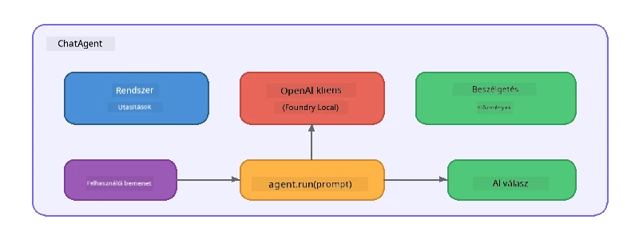

# 5. rész: AI ügynökök építése az Agent Framework segítségével

> **Cél:** Építsd meg az első AI ügynöködet állandó utasításokkal és meghatározott személyiséggel, amelyet helyi modell működtet a Foundry Local által.

## Mi az az AI ügynök?

Az AI ügynök egy nyelvi modellt burkol be **rendszerutasításokkal**, amelyek meghatározzák a viselkedését, személyiségét és korlátait. Egy egyszeri chat befejezési hívással ellentétben az ügynök a következőket nyújtja:

- **Személyiség** – egy állandó identitás („Hasznos kódértékelő vagy”)
- **Memória** – a beszélgetés előzményei körök között
- **Specializáció** – célzott viselkedés jól megfogalmazott utasítások alapján



---

## A Microsoft Agent Framework

A **Microsoft Agent Framework** (AGF) egy szabványos ügynök absztrakciót kínál, amely különböző modellháttérrel működik. Ebben a workshopban a Foundry Local-lal párosítjuk, így minden a gépeden fut – felhő nélkül.

| Fogalom | Leírás |
|---------|-------------|
| `FoundryLocalClient` | Python: kezeli a szolgáltatás indítását, modell letöltést/betöltést, és létrehozza az ügynököket |
| `client.as_agent()` | Python: létrehoz egy ügynököt a Foundry Local kliensből |
| `AsAIAgent()` | C#: `ChatClient` kiterjesztett metódusa - létrehoz egy `AIAgent` példányt |
| `instructions` | Rendszerutasítás, ami alakítja az ügynök viselkedését |
| `name` | Ember által olvasható címke, hasznos többugynökös forgatókönyvben |
| `agent.run(prompt)` / `RunAsync()` | Egy felhasználói üzenetet küld és visszaadja az ügynök válaszát |

> **Megjegyzés:** Az Agent Framework-nek van Python és .NET SDK-ja. JavaScript esetén egy könnyű `ChatAgent` osztályt valósítunk meg, amely közvetlenül az OpenAI SDK-val tükrözi ugyanezt a mintát.

---

## Gyakorlatok

### 1. gyakorlat – Ismerd meg az ügynök mintát

Írás helyett elemezd az ügynök kulcsfontosságú alkotóelemeit:

1. **Modell kliens** – kapcsolódik a Foundry Local OpenAI-kompatibilis API-hoz
2. **Rendszerutasítások** – a „személyiség” promptja
3. **Futás ciklus** – felhasználói bemenet küldése, kimenet fogadása

> **Gondolkozz el rajta:** Miben különböznek a rendszerutasítások a normál felhasználói üzenetektől? Mi történik, ha megváltoztatod őket?

---

### 2. gyakorlat – Fuss egy egyszemélyes ügynök példát

<details>
<summary><strong>🐍 Python</strong></summary>

**Előfeltételek:**
```bash
cd python
python -m venv venv

# Windows (PowerShell):
venv\Scripts\Activate.ps1
# macOS:
source venv/bin/activate

pip install -r requirements.txt
```

**Futtatás:**
```bash
python foundry-local-with-agf.py
```

**Kódismertetés** (`python/foundry-local-with-agf.py`):

```python
import asyncio
from agent_framework_foundry_local import FoundryLocalClient

async def main():
    alias = "phi-4-mini"

    # A FoundryLocalClient kezeli a szolgáltatás indítását, a modell letöltését és betöltését
    client = FoundryLocalClient(model_id=alias)
    print(f"Client Model ID: {client.model_id}")

    # Hozzon létre egy ügynököt rendszerszintű utasításokkal
    agent = client.as_agent(
        name="Joker",
        instructions="You are good at telling jokes.",
    )

    # Nem folyamatos: egyszerre kapja meg a teljes választ
    result = await agent.run("Tell me a joke about a pirate.")
    print(f"Agent: {result}")

    # Folyamatos: a válaszokat azonnal megkapja, ahogy keletkeznek
    async for chunk in agent.run("Tell me another joke.", stream=True):
        if chunk.text:
            print(chunk.text, end="", flush=True)

asyncio.run(main())
```

**Főbb pontok:**
- `FoundryLocalClient(model_id=alias)` egy lépésben kezeli a szolgáltatás indítását, letöltést és modell betöltést
- `client.as_agent()` létrehoz egy ügynököt rendszerutasításokkal és névvel
- `agent.run()` támogatja a nem-stream és stream módokat is
- Telepítsd: `pip install agent-framework-foundry-local --pre`

</details>

<details>
<summary><strong>📦 JavaScript</strong></summary>

**Előfeltételek:**
```bash
cd javascript
npm install
```

**Futtatás:**
```bash
node foundry-local-with-agent.mjs
```

**Kódismertetés** (`javascript/foundry-local-with-agent.mjs`):

```javascript
import { OpenAI } from "openai";
import { FoundryLocalManager } from "foundry-local-sdk";

class ChatAgent {
  constructor({ client, modelId, instructions, name }) {
    this.client = client;
    this.modelId = modelId;
    this.instructions = instructions;
    this.name = name;
    this.history = [];
  }

  async run(userMessage) {
    const messages = [
      { role: "system", content: this.instructions },
      ...this.history,
      { role: "user", content: userMessage },
    ];
    const response = await this.client.chat.completions.create({
      model: this.modelId,
      messages,
    });
    const assistantMessage = response.choices[0].message.content;

    // Tartsa meg a beszélgetés előzményeit többfordulós interakciókhoz
    this.history.push({ role: "user", content: userMessage });
    this.history.push({ role: "assistant", content: assistantMessage });
    return { text: assistantMessage };
  }
}

async function main() {
  FoundryLocalManager.create({ appName: "FoundryLocalWorkshop" });
  const manager = FoundryLocalManager.instance;
  await manager.startWebService();

  const catalog = manager.catalog;
  const model = await catalog.getModel("phi-3.5-mini");
  if (!model.isCached) {
    console.log("Downloading model: phi-3.5-mini...");
    await model.download();
  }
  await model.load();

  const client = new OpenAI({
    baseURL: manager.urls[0] + "/v1",
    apiKey: "foundry-local",
  });

  const agent = new ChatAgent({
    client,
    modelId: model.id,
    instructions: "You are good at telling jokes.",
    name: "Joker",
  });

  const result = await agent.run("Tell me a joke about a pirate.");
  console.log(result.text);
}

main();
```

**Főbb pontok:**
- A JavaScript a saját `ChatAgent` osztályát építi, amely a Python AGF mintát követi
- `this.history` tárolja a beszélgetési köröket többugynökös támogatáshoz
- Explicit `startWebService()` → gyorsítótár ellenőrzés → `model.download()` → `model.load()` teljes átláthatóságot ad

</details>

<details>
<summary><strong>💜 C#</strong></summary>

**Előfeltételek:**
```bash
cd csharp
dotnet restore
```

**Futtatás:**
```bash
dotnet run agent
```

**Kódismertetés** (`csharp/SingleAgent.cs`):

```csharp
using Microsoft.AI.Foundry.Local;
using Microsoft.Extensions.Logging.Abstractions;
using Microsoft.Agents.AI;
using OpenAI;
using System.ClientModel;

// 1. Start Foundry Local and load a model
var alias = "phi-3.5-mini";
await FoundryLocalManager.CreateAsync(
    new Configuration
    {
        AppName = "FoundryLocalSamples",
        Web = new Configuration.WebService { Urls = "http://127.0.0.1:0" }
    }, NullLogger.Instance, default);
var manager = FoundryLocalManager.Instance;
await manager.StartWebServiceAsync(default);

var catalog = await manager.GetCatalogAsync(default);
var model = await catalog.GetModelAsync(alias, default);

var isCached = await model.IsCachedAsync(default);
if (!isCached)
{
    Console.WriteLine($"Downloading model: {alias}...");
    await model.DownloadAsync(null, default);
}
await model.LoadAsync(default);

var key = new ApiKeyCredential("foundry-local");
var client = new OpenAIClient(key, new OpenAIClientOptions
{
    Endpoint = new Uri(manager.Urls[0] + "/v1")
});

// 2. Create an AIAgent using the Agent Framework extension method
AIAgent joker = client
    .GetChatClient(model.Id)
    .AsAIAgent(
        instructions: "You are good at telling jokes. Keep your jokes short and family-friendly.",
        name: "Joker"
    );

// 3. Run the agent (non-streaming)
var response = await joker.RunAsync("Tell me a joke about a pirate.");
Console.WriteLine($"Joker: {response}");

// 4. Run with streaming
await foreach (var update in joker.RunStreamingAsync("Tell me another joke."))
{
    Console.Write(update);
}
```

**Főbb pontok:**
- `AsAIAgent()` a `Microsoft.Agents.AI.OpenAI` kiterjesztett metódusa – nem kell egyéni `ChatAgent` osztály
- `RunAsync()` az egész választ adja vissza; `RunStreamingAsync()` tokenenként streameli
- Telepítés: `dotnet add package Microsoft.Agents.AI.OpenAI --version 1.0.0-rc3`

</details>

---

### 3. gyakorlat – Változtasd meg a személyiséget

Módosítsd az ügynök `instructions` mezőjét egy másik személyiség létrehozásához. Próbáld ki mindegyiket, és figyeld meg, hogyan változik a válasz:

| Személyiség | Utasítások |
|---------|-------------|
| Kódértékelő | `"Te egy szakértő kódértékelő vagy. Nyújts konstruktív visszajelzést az olvashatóságra, teljesítményre és helyességre fókuszálva."` |
| Utazási idegenvezető | `"Te egy barátságos utazási idegenvezető vagy. Adj személyre szabott ajánlásokat úti célokra, programokra és helyi konyhára."` |
| Szókratészi tanár | `"Te egy Szókratészi tanár vagy. Soha ne adj közvetlen válaszokat – inkább vezess rá az átgondolt kérdésekkel."` |
| Műszaki író | `"Te egy műszaki író vagy. Magyarázd el a fogalmakat világosan és tömören. Használj példákat. Kerüld a zsargont."` |

**Próbáld ki:**
1. Válassz egy személyiséget a táblázatból
2. Cseréld ki a `instructions` sztringet a kódban
3. Állítsd be a felhasználói promptot ennek megfelelően (pl. kérd meg a kódértékelőt, hogy értékeljen egy függvényt)
4. Futtasd újra a példát és hasonlítsd össze a válaszokat

> **Tipp:** Az ügynök minősége erősen függ az utasításoktól. Konkrét, jól strukturált utasítások jobb eredményt adnak, mint a homályosak.

---

### 4. gyakorlat – Többlépcsős beszélgetés hozzáadása

Bővítsd ki a példát egy többlépcsős chat ciklussal, hogy többszörös visszacsatolást folytathass az ügynökkel.

<details>
<summary><strong>🐍 Python - többlépcsős ciklus</strong></summary>

```python
import asyncio
from agent_framework_foundry_local import FoundryLocalClient

async def main():
    client = FoundryLocalClient(model_id="phi-4-mini")

    agent = client.as_agent(
        name="Assistant",
        instructions="You are a helpful assistant.",
    )

    print("Chat with the agent (type 'quit' to exit):\n")
    while True:
        user_input = input("You: ")
        if user_input.strip().lower() in ("quit", "exit"):
            break
        result = await agent.run(user_input)
        print(f"Agent: {result}\n")

asyncio.run(main())
```

</details>

<details>
<summary><strong>📦 JavaScript - többlépcsős ciklus</strong></summary>

```javascript
import { OpenAI } from "openai";
import { FoundryLocalManager } from "foundry-local-sdk";
import * as readline from "node:readline/promises";

// (a ChatAgent osztály újrafelhasználása a 2. feladatból)

async function main() {
  FoundryLocalManager.create({ appName: "FoundryLocalWorkshop" });
  const manager = FoundryLocalManager.instance;
  await manager.startWebService();

  const catalog = manager.catalog;
  const model = await catalog.getModel("phi-3.5-mini");
  if (!model.isCached) {
    console.log("Downloading model: phi-3.5-mini...");
    await model.download();
  }
  await model.load();

  const client = new OpenAI({
    baseURL: manager.urls[0] + "/v1",
    apiKey: "foundry-local",
  });

  const agent = new ChatAgent({
    client,
    modelId: model.id,
    instructions: "You are a helpful assistant.",
    name: "Assistant",
  });

  const rl = readline.createInterface({
    input: process.stdin,
    output: process.stdout,
  });

  console.log("Chat with the agent (type 'quit' to exit):\n");
  while (true) {
    const userInput = await rl.question("You: ");
    if (["quit", "exit"].includes(userInput.trim().toLowerCase())) break;
    const result = await agent.run(userInput);
    console.log(`Agent: ${result.text}\n`);
  }
  rl.close();
}

main();
```

</details>

<details>
<summary><strong>💜 C# - többlépcsős ciklus</strong></summary>

```csharp
using Microsoft.AI.Foundry.Local;
using Microsoft.Extensions.Logging.Abstractions;
using Microsoft.Agents.AI;
using OpenAI;
using System.ClientModel;

var alias = "phi-3.5-mini";
var config = new Configuration
{
    AppName = "FoundryLocalSamples",
    Web = new Configuration.WebService { Urls = "http://127.0.0.1:0" }
};
await FoundryLocalManager.CreateAsync(config, NullLogger.Instance, default);
var manager = FoundryLocalManager.Instance;
await manager.StartWebServiceAsync(default);

var catalog = await manager.GetCatalogAsync(default);
var model = await catalog.GetModelAsync(alias, default);

var isCached = await model.IsCachedAsync(default);
if (!isCached)
{
    Console.WriteLine($"Downloading model: {alias}...");
    await model.DownloadAsync(null, default);
}
await model.LoadAsync(default);

var key = new ApiKeyCredential("foundry-local");
var client = new OpenAIClient(key, new OpenAIClientOptions
{
    Endpoint = new Uri(manager.Urls[0] + "/v1")
});

AIAgent agent = client
    .GetChatClient(model.Id)
    .AsAIAgent(
        instructions: "You are a helpful assistant.",
        name: "Assistant"
    );

Console.WriteLine("Chat with the agent (type 'quit' to exit):\n");
while (true)
{
    Console.Write("You: ");
    var userInput = Console.ReadLine();
    if (string.IsNullOrWhiteSpace(userInput) ||
        userInput.Equals("quit", StringComparison.OrdinalIgnoreCase) ||
        userInput.Equals("exit", StringComparison.OrdinalIgnoreCase))
        break;

    var result = await agent.RunAsync(userInput);
    Console.WriteLine($"Agent: {result}\n");
}
```

</details>

Figyeld meg, hogyan emlékszik az ügynök az előző körökre – tegyél fel egy követő kérdést, és lásd, hogy átjön a kontextus.

---

### 5. gyakorlat – Strukturált kimenet

Utasítsd az ügynököt, hogy mindig adott formátumban (pl. JSON) válaszoljon, és dolgozd fel az eredményt:

<details>
<summary><strong>🐍 Python - JSON kimenet</strong></summary>

```python
import asyncio
import json
from agent_framework_foundry_local import FoundryLocalClient

async def main():
    client = FoundryLocalClient(model_id="phi-4-mini")

    agent = client.as_agent(
        name="SentimentAnalyzer",
        instructions=(
            "You are a sentiment analysis agent. "
            "For every user message, respond ONLY with valid JSON in this format: "
            '{"sentiment": "positive|negative|neutral", "confidence": 0.0-1.0, "summary": "brief reason"}'
        ),
    )

    result = await agent.run("I absolutely loved the new restaurant downtown!")
    print("Raw:", result)

    try:
        parsed = json.loads(str(result))
        print(f"Sentiment: {parsed['sentiment']} (confidence: {parsed['confidence']})")
    except json.JSONDecodeError:
        print("Agent did not return valid JSON - try refining the instructions.")

asyncio.run(main())
```

</details>

<details>
<summary><strong>💜 C# - JSON kimenet</strong></summary>

```csharp
using System.Text.Json;

AIAgent analyzer = chatClient.AsAIAgent(
    name: "SentimentAnalyzer",
    instructions:
        "You are a sentiment analysis agent. " +
        "For every user message, respond ONLY with valid JSON in this format: " +
        "{\"sentiment\": \"positive|negative|neutral\", \"confidence\": 0.0-1.0, \"summary\": \"brief reason\"}"
);

var response = await analyzer.RunAsync("I absolutely loved the new restaurant downtown!");
Console.WriteLine($"Raw: {response}");

try
{
    var parsed = JsonSerializer.Deserialize<JsonElement>(response.ToString());
    Console.WriteLine($"Sentiment: {parsed.GetProperty("sentiment")} " +
                      $"(confidence: {parsed.GetProperty("confidence")})");
}
catch (JsonException)
{
    Console.WriteLine("Agent did not return valid JSON - try refining the instructions.");
}
```

</details>

> **Megjegyzés:** A kis helyi modellek nem mindig állítanak elő tökéletesen érvényes JSON-t. A megbízhatóságot javíthatod példamintával az utasításokban, és egyértelmű formátummegadással.

---

## Fő tanulságok

| Fogalom | Amit megtanultál |
|---------|-----------------|
| Ügynök vs. nyers LLM hívás | Az ügynök modellt burkol utasításokkal és memóriával |
| Rendszerutasítások | A legfontosabb eszköz az ügynök viselkedésének szabályozására |
| Többlépcsős beszélgetés | Az ügynökök hordozhatnak kontextust több felhasználói interakció között |
| Strukturált kimenet | Az utasítások kimeneti formátumot (JSON, markdown stb.) kényszeríthetnek ki |
| Helyi futtatás | Minden a Foundry Local-on fut helyben – felhő nem szükséges |

---

## Következő lépések

A **[6. rész: Többugynökös munkafolyamatok](part6-multi-agent-workflows.md)** fejezetben több ügynököt fogsz összehangolt pipeline-ba szervezni, ahol mindegyik ügynök specializált szerepet tölt be.