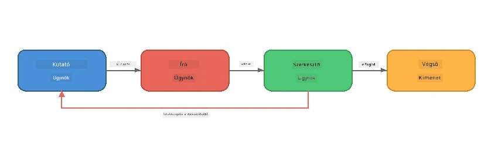
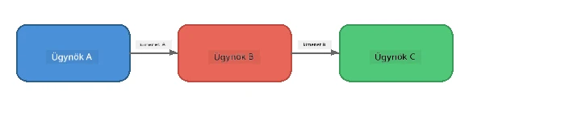
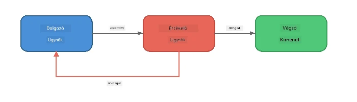
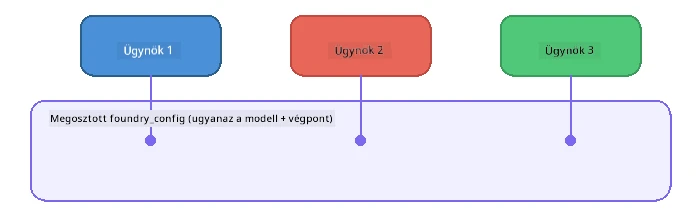

# 6. rész: Több ügynökös munkafolyamatok

> **Cél:** Több specializált ügynök összehangolt csővezetésekbe szervezése, amelyek komplex feladatokat osztanak szét az együttműködő ügynökök között – mind helyben, a Foundry Local használatával.

## Miért több ügynök?

Egyetlen ügynök sok feladatot el tud látni, de a bonyolult munkafolyamatok **specializációt** igényelnek. Ahelyett, hogy egy ügynök egyszerre kutatna, írna és szerkesztene, a munkát fókuszált szerepekre bontod:



| Minta | Leírás |
|---------|-------------|
| **Szekvenciális** | Az A ügynök kimenete a B ügynök bemenetévé válik → majd C |
| **Visszacsatolási kör** | Egy értékelő ügynök visszaküldheti a munkát javításra |
| **Megosztott kontextus** | Minden ügynök ugyanazt a modellt/endpointot használja, de eltérő utasításokat kap |
| **Típusos kimenet** | Az ügynökök strukturált eredményeket (JSON) adnak ki, így megbízható az átadás |

---

## Gyakorlatok

### 1. gyakorlat – Több ügynökös csővezeték futtatása

A workshop tartalmaz egy komplett Kutató → Író → Szerkesztő munkafolyamatot.

<details>
<summary><strong>🐍 Python</strong></summary>

**Beállítás:**
```bash
cd python
python -m venv venv

# Windows (PowerShell):
venv\Scripts\Activate.ps1
# macOS:
source venv/bin/activate

pip install -r requirements.txt
```

**Futtatás:**
```bash
python foundry-local-multi-agent.py
```

**Mi történik:**
1. A **Kutató** megkap egy témát és visszaküld felsorolásos tényeket
2. Az **Író** a kutatás alapján megír egy blogbejegyzést (3-4 bekezdés)
3. A **Szerkesztő** ellenőrzi a cikk minőségét, és ELFOGAD vagy JAVÍT visszajelzést ad

</details>

<details>
<summary><strong>📦 JavaScript</strong></summary>

**Beállítás:**
```bash
cd javascript
npm install
```

**Futtatás:**
```bash
node foundry-local-multi-agent.mjs
```

**Ugyanaz a háromlépcsős csővezeték** – Kutató → Író → Szerkesztő.

</details>

<details>
<summary><strong>💜 C#</strong></summary>

**Beállítás:**
```bash
cd csharp
dotnet restore
```

**Futtatás:**
```bash
dotnet run multi
```

**Ugyanaz a háromlépcsős csővezeték** – Kutató → Író → Szerkesztő.

</details>

---

### 2. gyakorlat – A csővezeték felépítése

Tanulmányozd, hogyan vannak meghatározva és összekapcsolva az ügynökök:

**1. Megosztott modell kliens**

Minden ügynök ugyanazt a Foundry Local modellt használja:

```python
# Python - A FoundryLocalClient mindent kezel
from agent_framework_foundry_local import FoundryLocalClient

client = FoundryLocalClient(model_id="phi-3.5-mini")
```

```javascript
// JavaScript - OpenAI SDK a Foundry Local-ra mutatva
const client = new OpenAI({
  baseURL: manager.urls[0] + "/v1",
  apiKey: "foundry-local",
});
```

```csharp
// C# - OpenAIClient pointed at Foundry Local
var key = new ApiKeyCredential("foundry-local");
var client = new OpenAIClient(key, new OpenAIClientOptions
{
    Endpoint = new Uri(manager.Urls[0] + "/v1")
});
var chatClient = client.GetChatClient(model.Id);
```

**2. Specializált utasítások**

Mindegyik ügynök eltérő személyiséggel rendelkezik:

| Ügynök | Utasítások (összefoglaló) |
|-------|----------------------|
| Kutató | "Add meg a kulcsfontosságú tényeket, statisztikákat és háttérinformációkat. Rendezve felsorolásban." |
| Író | "Írj egy érdekes blogbejegyzést (3-4 bekezdés) a kutatási jegyzetek alapján. Ne találj ki tényeket." |
| Szerkesztő | "Ellenőrizd a világosságot, nyelvtant és ténybeli összhangot. Ítélet: ELFOGAD vagy JAVÍT." |

**3. Adatfolyam az ügynökök között**

```python
# 1. lépés - a kutató kimenete lesz az író bemenete
research_result = await researcher.run(f"Research: {topic}")

# 2. lépés - az író kimenete lesz a szerkesztő bemenete
writer_result = await writer.run(f"Write using:\n{research_result}")

# 3. lépés - a szerkesztő áttekinte a kutatást és a cikket egyaránt
editor_result = await editor.run(
    f"Research:\n{research_result}\n\nArticle:\n{writer_result}"
)
```

```csharp
// C# - same pattern, async calls with AIAgent
var researchNotes = await researcher.RunAsync(
    $"Research the following topic and provide key facts:\n{topic}");

var draft = await writer.RunAsync(
    $"Write a blog post based on these research notes:\n\n{researchNotes}");

var verdict = await editor.RunAsync(
    $"Review this article for quality and accuracy.\n\n" +
    $"Research notes:\n{researchNotes}\n\n" +
    $"Article:\n{draft}");
```

> **Fontos felismerés:** Minden ügynök megkapja az előző ügynökök halmozott kontextusát. A szerkesztő látja az eredeti kutatást és a vázlatot is – így tudja ellenőrizni a ténybeli összhangot.

---

### 3. gyakorlat – Egy negyedik ügynök hozzáadása

Bővítsd ki a csővezetéket egy új ügynökkel. Válassz egyet:

| Ügynök | Cél | Utasítások |
|-------|---------|-------------|
| **Tényellenőr** | Az állítások ellenőrzése a cikkben | `"Ön ellenőrzi a tényállításokat. Minden állítás esetén jelezze, hogy a kutatási jegyzetek támogatják-e azt. JSON formátumban térjen vissza igazolt/igazolatlan tételekkel."` |
| **Címsoríró** | Figyelemfelkeltő címek készítése | `"Generáljon 5 címsorelválasztási lehetőséget a cikkhez. Változtassa a stílust: informatív, clickbait, kérdés, listicle, érzelmi."` |
| **Közösségi média** | Promóciós bejegyzések készítése | `"Készítsen 3 közösségi média posztot a cikk népszerűsítésére: egyet Twitterre (280 karakter), egyet LinkedIn-re (professzionális hangvétel), egyet Instagramra (közvetlen, emoji javaslatokkal)."` |

<details>
<summary><strong>🐍 Python – Címsoríró hozzáadása</strong></summary>

```python
headline_agent = client.as_agent(
    name="HeadlineWriter",
    instructions=(
        "You are a headline specialist. Given an article, generate exactly "
        "5 headline options. Vary the style: informative, question-based, "
        "listicle, emotional, and provocative. Return them as a numbered list."
    ),
)

# Az utómunkáló elfogadása után generáljon címsorokat
headline_result = await headline_agent.run(
    f"Generate headlines for this article:\n\n{writer_result}"
)
print(f"\n--- Headlines ---\n{headline_result}")
```

</details>

<details>
<summary><strong>📦 JavaScript – Címsoríró hozzáadása</strong></summary>

```javascript
const headlineAgent = new ChatAgent({
  client,
  modelId: modelInfo.id,
  instructions:
    "You are a headline specialist. Given an article, generate exactly " +
    "5 headline options. Vary the style: informative, question-based, " +
    "listicle, emotional, and provocative. Return them as a numbered list.",
  name: "HeadlineWriter",
});

const headlineResult = await headlineAgent.run(
  `Generate headlines for this article:\n\n${writerResult.text}`
);
console.log(`\n--- Headlines ---\n${headlineResult.text}`);
```

</details>

<details>
<summary><strong>💜 C# – Címsoríró hozzáadása</strong></summary>

```csharp
AIAgent headlineAgent = chatClient.AsAIAgent(
    name: "HeadlineWriter",
    instructions:
        "You are a headline specialist. Given an article, generate exactly " +
        "5 headline options. Vary the style: informative, question-based, " +
        "listicle, emotional, and provocative. Return them as a numbered list."
);

// After the editor accepts, generate headlines
var headlines = await headlineAgent.RunAsync(
    $"Generate headlines for this article:\n\n{draft}");
Console.WriteLine($"\n--- Headlines ---\n{headlines}");
```

</details>

---

### 4. gyakorlat – Tervezd meg saját munkafolyamatod

Tervezd meg egy másik területre a több ügynökös csővezetéket. Íme néhány ötlet:

| Terület | Ügynökök | Munkafolyamat |
|--------|--------|------|
| **Kódellenőrzés** | Elemző → Felülvizsgáló → Összefoglaló | Kódstruktúra elemzése → problémák felülvizsgálata → összefoglaló készítése |
| **Ügyfélszolgálat** | Osztályozó → Válaszadó → Minőségellenőrző | Jegy osztályozása → válasz tervezet → minőség ellenőrzés |
| **Oktatás** | Kvízkészítő → Tanuló szimulátor → Értékelő | Kvíz generálása → válaszok szimulálása → értékelés és magyarázat |
| **Adatfeldolgozás** | Értelmező → Elemző → Riporter | Adatkérés értelmezése → minták elemzése → jelentés írása |

**Lépések:**
1. Határozz meg 3+ ügynököt eltérő `utasításokkal`
2. Döntsd el az adatáramlást – mit kap és mit ad ki az egyes ügynök
3. Valósítsd meg a csővezetéket az 1-3. gyakorlat mintái szerint
4. Adj visszacsatolási kört, ha valamelyik ügynök értékel egy másikat

---

## Orkesztrációs minták

Itt vannak azok az orkesztrációs minták, amelyek bármilyen több ügynökös rendszerre alkalmazhatók (mélyebben a [7. részben](part7-zava-creative-writer.md)):

### Szekvenciális csővezeték



Minden ügynök feldolgozza az előző kimenetét. Egyszerű és kiszámítható.

### Visszacsatolási kör



Egy értékelő ügynök újrafuttathatja a korábbi szakaszokat. A Zava Writer így működik: a szerkesztő visszajelzést küld a kutatónak és írónak.

### Megosztott kontextus



Minden ügynök ugyanazt a `foundry_config`-ot használja, így ugyanazt a modellt és végpontot.

---

## Fő tanulságok

| Fogalom | Amit megtanultál |
|---------|-----------------|
| Ügynök specializáció | Minden ügynök jól végzi a saját feladatát, fókuszált utasításokkal |
| Adatátadás | Egy ügynök kimenete lesz a következő bemenete |
| Visszacsatolás | Egy értékelő újrapróbálkozásra késztetheti a jobb minőség érdekében |
| Strukturált kimenet | A JSON-formátum megbízható kommunikációt tesz lehetővé az ügynökök között |
| Orkesztráció | Egy koordinátor kezeli a csővezeték sorrendjét és hiba kezelést |
| Termelési minták | Alkalmazva a [7. részben: Zava Creative Writer](part7-zava-creative-writer.md) |

---

## Következő lépések

Folytasd a [7. rész: Zava Creative Writer – záróalkalmazás](part7-zava-creative-writer.md) fejezetet, ahol egy termelési szintű több ügynökös alkalmazást ismerhetsz meg 4 specializált ügynökkel, folyamatos kimenettel, termékkereséssel és visszacsatolási körökkel – elérhető Python, JavaScript és C# nyelven.