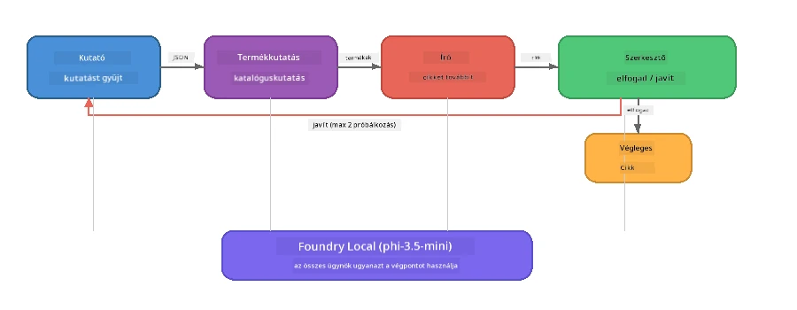

# 7. rész: Zava Kreatív Író - Záróalkalmazás

> **Cél:** Fedezz fel egy gyártás-stílusú többügynökös alkalmazást, ahol négy specializált ügynök együtt dolgozik magazinminőségű cikkek létrehozásán a Zava Retail DIY számára – az egész a készülékeden fut a Foundry Local segítségével.

Ez a workshop **zárólaborja**. Egyesíti mindazt, amit megtanultál - SDK integráció (3. rész), helyi adatok lekérése (4. rész), ügynök személyiségek (5. rész) és többügynökös összehangolás (6. rész) - egy teljes alkalmazásban, elérhető **Python**, **JavaScript** és **C#** nyelven.

---

## Amit felfedezel

| Fogalom | A Zava Íróban hol |
|---------|--------------------|
| 4 lépéses modellbetöltés | Közös konfigurációs modul indítja el a Foundry Localt |
| RAG-stílusú lekérés | Termékügynök keres a helyi katalógusban |
| Ügynökspecializáció | 4 ügynök különböző rendszerüzenetekkel |
| Streaming kimenet | Író valós időben adja az ideákat |
| Strukturált átadások | Kutató → JSON, Szerkesztő → JSON döntés |
| Visszacsatolási hurkok | A Szerkesztő újrafuttatást indíthat (max 2 próbálkozás) |

---

## Architektúra

A Zava Kreatív Író **sorrendben futó csővezeték visszacsatolásvezérelt értékeléssel**. Mindhárom nyelvi megvalósítás ugyanazt az architektúrát követi:



### A négy ügynök

| Ügynök | Bemenet | Kimenet | Cél |
|--------|---------|---------|-----|
| **Kutató** | Téma + opcionális visszacsatolás | `{"web": [{url, name, description}, ...]}` | Háttérkutatás LLM segítségével |
| **Termékkutató** | Termékkontextus sztring | Egyező termékek listája | LLM-által generált lekérdezések + kulcsszavas keresés helyi katalógusban |
| **Író** | Kutatás + termékek + feladat + visszacsatolás | Streamingben érkező cikk szöveg (szétválasztva `---`-nél) | Magazinminőségű cikk készítése valós időben |
| **Szerkesztő** | Cikk + író önreflexiója | `{"decision": "accept/revise", "editorFeedback": "...", "researchFeedback": "..."}` | Minőségellenőrzés, újrafuttatás indítása, ha szükséges |

### Csővezeték folyamata

1. **Kutató** megkapja a témát, strukturált kutatási jegyzeteket készít (JSON)
2. **Termékkutató** LLM által generált keresőkifejezésekkel lekérdezi a helyi termékkatalógust
3. **Író** a kutatást, termékeket és feladatot egy streaming cikkbe egyesíti, majd önreflexiós visszacsatolást fűz hozzá `---` elválasztó után
4. **Szerkesztő** átnézi a cikket, visszaad egy JSON döntést:
   - `"accept"` → csővezeték végrehajtása befejeződik
   - `"revise"` → visszacsatolás a Kutató és az Író számára (max 2 próbálkozás)

---

## Előfeltételek

- Készítsd el a [6. rész: Többügynökös munkafolyamatok](part6-multi-agent-workflows.md) részt
- Telepítsd a Foundry Local CLI-t és töltsd le a `phi-3.5-mini` modellt

---

## Feladatok

### 1. feladat - Futtasd a Zava Kreatív Írót

Válaszd ki a nyelved és futtasd az alkalmazást:

<details>
<summary><strong>🐍 Python - FastAPI Web Szolgáltatás</strong></summary>

A Python verzió egy **webszolgáltatásként** fut REST API-val, bemutatva, hogyan építhető gyártásra kész backend.

**Telepítés:**
```bash
cd zava-creative-writer-local/src/api
python -m venv venv

# Windows (PowerShell):
venv\Scripts\Activate.ps1
# macOS:
source venv/bin/activate

pip install -r requirements.txt
```

**Futtatás:**
```bash
uvicorn main:app --reload
```

**Tesztelés:**
```bash
curl -X POST http://localhost:8000/api/article \
  -H "Content-Type: application/json" \
  -d '{
    "research": "DIY home improvement trends",
    "products": "power tools and paints",
    "assignment": "Write an article about weekend renovation projects for DIY enthusiasts"
  }'
```

A válasz sortöréssel elválasztott JSON üzenetekben folyamatosan jön vissza, mutatva minden ügynök előrehaladását.

</details>

<details>
<summary><strong>📦 JavaScript - Node.js CLI</strong></summary>

A JavaScript verzió egy **CLI alkalmazásként** fut, az ügynökök előrehaladását és a cikket közvetlenül a konzolra írja.

**Telepítés:**
```bash
cd zava-creative-writer-local/src/javascript
npm install
```

**Futtatás:**
```bash
node main.mjs
```

Láthatod:
1. Foundry Local modell betöltést (ha letöltés van, akkor előrehaladási sávval)
2. Minden ügynök sorban végrehajtását állapotüzenetekkel
3. A cikk valós idejű streaming kimenetét a konzolon
4. A szerkesztő elfogadó/módosító döntését

</details>

<details>
<summary><strong>💜 C# - .NET Konzol Alkalmazás</strong></summary>

A C# verzió egy **.NET konzolalkalmazásként** fut, ugyanazzal a csővezetékkel és streaming kimenettel.

**Telepítés:**
```bash
cd zava-creative-writer-local/src/csharp
dotnet restore
```

**Futtatás:**
```bash
dotnet run
```

Azonos kimeneti minta, mint a JavaScript verziónál – ügynök állapotüzenetek, streaming cikk és szerkesztői döntés.

</details>

---

### 2. feladat - Tanulmányozd a kódszerkezetet

Mindhárom nyelvi megvalósításban ugyanazok a logikai komponensek vannak. Hasonlítsd össze a szerkezeteket:

**Python** (`src/api/`):
| Fájl | Cél |
|-------|------|
| `foundry_config.py` | Közös Foundry Local menedzser, modell és kliens (4 lépéses inicializálás) |
| `orchestrator.py` | Csővezeték koordináció visszacsatolási hurkokkal |
| `main.py` | FastAPI végpontok (`POST /api/article`) |
| `agents/researcher/researcher.py` | LLM-alapú kutatás JSON kimenettel |
| `agents/product/product.py` | LLM által generált lekérdezések + kulcsszavas keresés |
| `agents/writer/writer.py` | Streaming cikk generálás |
| `agents/editor/editor.py` | JSON alapú elfogadó/módosító döntés |

**JavaScript** (`src/javascript/`):
| Fájl | Cél |
|-------|-----|
| `foundryConfig.mjs` | Közös Foundry Local konfiguráció (4 lépéses inicializálás, előrehaladási sávval) |
| `main.mjs` | Összehangoló és CLI belépési pont |
| `researcher.mjs` | LLM alapú kutató ügynök |
| `product.mjs` | LLM lekérdezés generálás + kulcsszavas keresés |
| `writer.mjs` | Streaming cikk generálás (async generátor) |
| `editor.mjs` | JSON elfogadó/módosító döntés |
| `products.mjs` | Termékkatalógus adatok |

**C#** (`src/csharp/`):
| Fájl | Cél |
|-------|-----|
| `Program.cs` | Teljes csővezeték: modell betöltés, ügynökök, összehangoló, visszacsatolás |
| `ZavaCreativeWriter.csproj` | .NET 9 projekt Foundry Local + OpenAI csomagokkal |

> **Tervezési megjegyzés:** Python külön fájlba/mappába helyezi az ügynököket (jó nagyobb csapatoknak). JavaScript ügynökönkénti modult használ (közepes projektekhez). C# mindent egyetlen fájlba tesz helyi függvényekkel (önálló példákhoz). Produckcióban válaszd, ami illik a csapatod szokásaihoz.

---

### 3. feladat - Kövesd a közös konfigurációt

A pipeline összes ügynöke egyetlen Foundry Local modellklienst oszt meg. Tanulmányozd, hogyan készül ez mindhárom nyelven:

<details>
<summary><strong>🐍 Python - foundry_config.py</strong></summary>

```python
from foundry_local import FoundryLocalManager

MODEL_ALIAS = "phi-3.5-mini"

# 1. lépés: Hozza létre a menedzsert és indítsa el a Foundry Local szolgáltatást
manager = FoundryLocalManager()
manager.start_service()

# 2. lépés: Ellenőrizze, hogy a modell már le van-e töltve
cached = manager.list_cached_models()
catalog_info = manager.get_model_info(MODEL_ALIAS)
is_cached = any(m.id == catalog_info.id for m in cached) if catalog_info else False

if not is_cached:
    manager.download_model(MODEL_ALIAS)

# 3. lépés: Töltse be a modellt a memóriába
manager.load_model(MODEL_ALIAS)
model_id = manager.get_model_info(MODEL_ALIAS).id

# Megosztott OpenAI kliens
client = openai.OpenAI(base_url=manager.endpoint, api_key=manager.api_key)
```

Minden ügynök importálja `from foundry_config import client, model_id`.

</details>

<details>
<summary><strong>📦 JavaScript - foundryConfig.mjs</strong></summary>

```javascript
import { FoundryLocalManager } from "foundry-local-sdk";
import { OpenAI } from "openai";

FoundryLocalManager.create({ appName: "ZavaCreativeWriter" });
const manager = FoundryLocalManager.instance;
await manager.startWebService();

// Cache ellenőrzése → letöltés → betöltés (új SDK minta)
const catalog = manager.catalog;
const model = await catalog.getModel(MODEL_ALIAS);
if (!model.isCached) {
  console.log(`Downloading model: ${MODEL_ALIAS}...`);
  await model.download();
}
await model.load();

const client = new OpenAI({ baseURL: manager.urls[0] + "/v1", apiKey: "foundry-local" });
const modelId = model.id;
export { client, modelId };
```

Minden ügynök importálja `{ client, modelId } from "./foundryConfig.mjs"`.

</details>

<details>
<summary><strong>💜 C# - a Program.cs eleje</strong></summary>

```csharp
await FoundryLocalManager.CreateAsync(
    new Configuration
    {
        AppName = "ZavaCreativeWriter",
        Web = new Configuration.WebService { Urls = "http://127.0.0.1:0" }
    }, NullLogger.Instance, default);
var manager = FoundryLocalManager.Instance;
await manager.StartWebServiceAsync(default);

var catalog = await manager.GetCatalogAsync(default);
var catalogModel = await catalog.GetModelAsync(alias, default);
var isCached = await catalogModel.IsCachedAsync(default);
if (!isCached)
    await catalogModel.DownloadAsync(null, default);

await catalogModel.LoadAsync(default);
var key = new ApiKeyCredential("foundry-local");
var chatClient = new OpenAIClient(key, new OpenAIClientOptions
{
    Endpoint = new Uri(manager.Urls[0] + "/v1")
}).GetChatClient(catalogModel.Id);
```

A `chatClient` mindenkinek a fájlon belüli ügynökfüggvényeihez átadva.

</details>

> **Kulcsminta:** A modell betöltési minta (szolgáltatás indítása → cache ellenőrzése → letöltés → betöltés) biztosítja, hogy a felhasználó egyértelmű előrehaladást lásson, és a modell egyszer töltsön le. Ez jó gyakorlat bármilyen Foundry Local alkalmazáshoz.

---

### 4. feladat - Értsd meg a visszacsatolási hurkot

A visszacsatolási hurok teszi ezt a csővezetéket "okossá" – a szerkesztő munkát küldhet vissza átdolgozásra. Kövesd a logikát:

```
Orchestrator:
  1. researcher.research(topic, "No Feedback")    ← first pass
  2. product.findProducts(productContext)
  3. writer.write(research, products, assignment)  ← streams article
  4. Split article at "---" → article + writerFeedback
  5. editor.edit(article, writerFeedback)

  WHILE editor says "revise" AND retryCount < 2:
    6. researcher.research(topic, editor.researchFeedback)  ← refined
    7. writer.write(research, products, editor.editorFeedback)
    8. editor.edit(newArticle, newWriterFeedback)
    9. retryCount++
```

**Felmerülő kérdések:**
- Miért van a retry limit 2-re állítva? Mi történik, ha növeled?
- Miért kap a kutató `researchFeedback`-et, míg az író `editorFeedback`-et?
- Mi történne, ha a szerkesztő mindig "revise"-t mondana?

---

### 5. feladat - Módosíts egy ügynököt

Próbáld megváltoztatni egy ügynök viselkedését, és figyeld meg, hogyan hat a csővezetékre:

| Módosítás | Mit változtass meg |
|-----------|---------------------|
| **Szigorúbb szerkesztő** | Változtasd meg a szerkesztő rendszerüzenetét, hogy mindig legalább egy javítást kérjen |
| **Hosszabb cikkek** | Változtasd meg az író utasítását "800-1000 szó"-ról "1500-2000 szóra" |
| **Más termékek** | Adj hozzá vagy módosíts termékeket a termékkatalógusban |
| **Új kutatási téma** | Változtasd meg az alapértelmezett `researchContext` témát másra |
| **Csak JSON-kutató** | Tegyél úgy, hogy a kutató 10 elemet adjon vissza 3-5 helyett |

> **Tipp:** Mivel mindhárom nyelv ugyanazt az architektúrát valósítja meg, ugyanazt a módosítást megteheted bármely nyelven, amelyikben kényelmesebb vagy.

---

### 6. feladat - Adj hozzá egy ötödik ügynököt

Bővítsd a csővezetéket egy új ügynökkel. Néhány ötlet:

| Ügynök | A csővezetéken belül | Cél |
|---------|---------------------|-----|
| **Valóságellenőr** | Az Író után, a Szerkesztő előtt | Ellenőrizze az állításokat a kutatási adatok alapján |
| **SEO-optimalizáló** | A Szerkesztő elfogadása után | Meta leírás, kulcsszavak, slug hozzáadása |
| **Illusztrátor** | A Szerkesztő elfogadása után | Kép utasítások generálása a cikkhez |
| **Fordító** | A Szerkesztő elfogadása után | A cikk más nyelvre fordítása |

**Lépések:**
1. Írd meg az ügynök rendszerüzenetét
2. Készítsd el az ügynök funkciót (a nyelven a meglévő minta szerint)
3. Illeszd be az összehangolóba a megfelelő ponton
4. Frissítsd a kimenetet/loggolást az új ügynök hozzájárulásának megjelenítéséhez

---

## Hogyan működik együtt a Foundry Local és az Ügynök Keretrendszer

Ez az alkalmazás bemutatja a javasolt mintát többügynökös rendszerek építésére Foundry Localal:

| Réteg | Komponens | Szerep |
|--------|-----------|---------|
| **Futásidő** | Foundry Local | Letölti, kezeli és helyileg szolgálja a modellt |
| **Kliens** | OpenAI SDK | Chat kéréseket küld a helyi végpontra |
| **Ügynök** | Rendszerüzenet + chat hívás | Specializált viselkedés fókuszált utasításokon keresztül |
| **Összehangoló** | Csővezeték koordinátor | Adatáramlás, szekvencia és visszacsatolási hurkok kezelése |
| **Keretrendszer** | Microsoft Agent Framework | Biztosítja a `ChatAgent` absztrakciót és mintákat |

Lényegi meglátás: **A Foundry Local a felhőalapú backendet helyettesíti, nem az alkalmazás architektúráját.** Ugyanazok az ügynök minták, összehangolási stratégiák és strukturált átadások működnek felhőben hosztolt modellekkel, mint helyi modellekkel — csak a kliens a helyi végpontra mutat, nem pedig Azure végpontra.

---

## Fő tanulságok

| Fogalom | Amit tanultál |
|---------|---------------|
| Gyártási architektúra | Hogyan struktúrálj többügynökös alkalmazást megosztott konfigurációval és különálló ügynökökkel |
| 4 lépéses modellbetöltés | Jó gyakorlat a Foundry Local inicializálására felhasználói látható előrehaladással |
| Ügynökspecializáció | 4 ügynök külön fókuszált utasításokkal és specifikus kimeneti formátummal |
| Streaming generálás | Az író valós időben adja a tokeneket, ami gyors UI-t tesz lehetővé |
| Visszacsatolási hurkok | Szerkesztő által vezérelt újrapróbálkozás javítja a minőséget emberi beavatkozás nélkül |
| Nyelvközi minták | Ugyanez az architektúra működik Pythonban, JavaScriptben és C#-ban |
| Helyi = gyártásra kész | A Foundry Local ugyanazt az OpenAI-kompatibilis API-t szolgálja, mint a felhői telepítések |

---

## Következő lépés

Folytasd a [8. rész: Értékelés-vezérelt fejlesztés](part8-evaluation-led-development.md) témakörrel, hogy rendszeres értékelési keretrendszert építs az ügynökeidnek, aranyszabályos adatbázisokkal, szabályalapú ellenőrzésekkel és LLM mint döntőbíró pontozással.