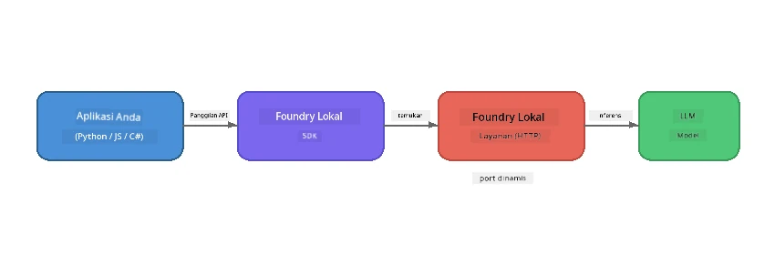

# Bagian 1: Memulai dengan Foundry Local


## Apa itu Foundry Local?

[Foundry Local](https://foundrylocal.ai) memungkinkan Anda menjalankan model bahasa AI sumber terbuka **secara langsung di komputer Anda** - tanpa perlu internet, tanpa biaya cloud, dan privasi data yang lengkap. Ini:

- **Mengunduh dan menjalankan model secara lokal** dengan optimisasi perangkat keras otomatis (GPU, CPU, atau NPU)
- **Menyediakan API kompatibel OpenAI** sehingga Anda dapat menggunakan SDK dan alat yang sudah dikenal
- **Tidak memerlukan langganan Azure** atau pendaftaran - hanya instal dan mulai membangun

Anggap saja seperti memiliki AI pribadi yang berjalan sepenuhnya di mesin Anda.

## Tujuan Pembelajaran

Pada akhir lab ini Anda akan dapat:

- Menginstal Foundry Local CLI di sistem operasi Anda
- Memahami apa itu alias model dan bagaimana cara kerjanya
- Mengunduh dan menjalankan model AI lokal pertama Anda
- Mengirim pesan chat ke model lokal melalui baris perintah
- Memahami perbedaan antara model AI lokal dan yang dihosting di cloud

---

## Prasyarat

### Persyaratan Sistem

| Persyaratan | Minimum | Direkomendasikan |
|-------------|---------|------------------|
| **RAM** | 8 GB | 16 GB |
| **Ruang Disk** | 5 GB (untuk model) | 10 GB |
| **CPU** | 4 core | 8+ core |
| **GPU** | Opsional | NVIDIA dengan CUDA 11.8+ |
| **OS** | Windows 10/11 (x64/ARM), Windows Server 2025, macOS 13+ | - |

> **Catatan:** Foundry Local secara otomatis memilih varian model terbaik sesuai perangkat keras Anda. Jika Anda memiliki GPU NVIDIA, akan menggunakan akselerasi CUDA. Jika Anda memiliki NPU Qualcomm, akan menggunakan itu. Jika tidak, akan menggunakan varian CPU yang dioptimalkan.

### Instal Foundry Local CLI

**Windows** (PowerShell):
```powershell
winget install Microsoft.FoundryLocal
```

**macOS** (Homebrew):
```bash
brew tap microsoft/foundrylocal
brew install foundrylocal
```

> **Catatan:** Saat ini Foundry Local hanya mendukung Windows dan macOS. Linux belum didukung untuk saat ini.

Verifikasi instalasi:
```bash
foundry --version
```

---

## Latihan Lab

### Latihan 1: Jelajahi Model yang Tersedia

Foundry Local menyertakan katalog model sumber terbuka yang sudah dioptimalkan sebelumnya. Daftarkan mereka:

```bash
foundry model list
```

Anda akan melihat model seperti:
- `phi-3.5-mini` - model 3.8 miliar parameter dari Microsoft (cepat, kualitas bagus)
- `phi-4-mini` - model Phi terbaru yang lebih canggih
- `phi-4-mini-reasoning` - model Phi dengan penalaran rantai pemikiran (`<think>` tag)
- `phi-4` - model Phi terbesar dari Microsoft (10.4 GB)
- `qwen2.5-0.5b` - sangat kecil dan cepat (baik untuk perangkat dengan sumber daya terbatas)
- `qwen2.5-7b` - model serbaguna kuat dengan dukungan pemanggilan alat
- `qwen2.5-coder-7b` - dioptimalkan untuk pembuatan kode
- `deepseek-r1-7b` - model penalaran yang kuat
- `gpt-oss-20b` - model sumber terbuka besar (lisensi MIT, 12.5 GB)
- `whisper-base` - transkripsi suara ke teks (383 MB)
- `whisper-large-v3-turbo` - transkripsi akurasi tinggi (9 GB)

> **Apa itu alias model?** Alias seperti `phi-3.5-mini` adalah jalan pintas. Saat Anda menggunakan alias, Foundry Local secara otomatis mengunduh varian terbaik untuk perangkat keras spesifik Anda (CUDA untuk GPU NVIDIA, atau dioptimalkan CPU jika tidak). Anda tidak perlu khawatir memilih varian yang tepat.

### Latihan 2: Jalankan Model Pertama Anda

Unduh dan mulai mengobrol dengan model secara interaktif:

```bash
foundry model run phi-3.5-mini
```

Pertama kali Anda menjalankan ini, Foundry Local akan:
1. Mendeteksi perangkat keras Anda
2. Mengunduh varian model optimal (bisa memakan waktu beberapa menit)
3. Memuat model ke memori
4. Memulai sesi chat interaktif

Coba tanyakan beberapa pertanyaan:
```
You: What is the golden ratio?
You: Can you explain it as if I were 10 years old?
You: Write a haiku about mathematics
```

Ketik `exit` atau tekan `Ctrl+C` untuk keluar.

### Latihan 3: Unduh Model Terlebih Dahulu

Jika Anda ingin mengunduh model tanpa memulai chat:

```bash
foundry model download phi-3.5-mini
```

Cek model mana yang sudah diunduh di mesin Anda:

```bash
foundry cache list
```

### Latihan 4: Pahami Arsitektur

Foundry Local berjalan sebagai **layanan HTTP lokal** yang mengeluarkan API REST kompatibel OpenAI. Artinya:

1. Layanan mulai pada **port dinamis** (port berbeda setiap kali)
2. Anda menggunakan SDK untuk menemukan URL endpoint yang sebenarnya
3. Anda dapat menggunakan **klien OpenAI kompatibel apa pun** untuk berkomunikasi dengannya



> **Penting:** Foundry Local memberikan **port dinamis** setiap kali dijalankan. Jangan pernah menetapkan nomor port statis seperti `localhost:5272`. Selalu gunakan SDK untuk menemukan URL saat ini (misal `manager.endpoint` di Python atau `manager.urls[0]` di JavaScript).

---

## Poin Penting

| Konsep | Apa yang Anda Pelajari |
|---------|-----------------------|
| AI di perangkat | Foundry Local menjalankan model sepenuhnya di perangkat Anda tanpa cloud, tanpa kunci API, dan tanpa biaya |
| Alias model | Alias seperti `phi-3.5-mini` otomatis memilih varian terbaik untuk perangkat keras Anda |
| Port dinamis | Layanan berjalan di port dinamis; selalu gunakan SDK untuk menemukan endpoint |
| CLI dan SDK | Anda dapat berinteraksi dengan model melalui CLI (`foundry model run`) atau secara programatik melalui SDK |

---

## Langkah Selanjutnya

Lanjutkan ke [Bagian 2: Penjelajahan Mendalam Foundry Local SDK](part2-foundry-local-sdk.md) untuk menguasai API SDK dalam mengelola model, layanan, dan caching secara programatik.