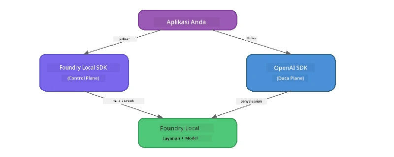

# Bagian 3: Menggunakan Foundry Local SDK dengan OpenAI

## Ikhtisar

Di Bagian 1 Anda menggunakan Foundry Local CLI untuk menjalankan model secara interaktif. Di Bagian 2 Anda menjelajahi seluruh permukaan API SDK. Sekarang Anda akan belajar untuk **mengintegrasikan Foundry Local ke dalam aplikasi Anda** menggunakan SDK dan API yang kompatibel dengan OpenAI.

Foundry Local menyediakan SDK untuk tiga bahasa. Pilih yang paling Anda kuasai - konsepnya identik di ketiganya.

## Tujuan Pembelajaran

Pada akhir lab ini Anda akan mampu:

- Menginstal Foundry Local SDK untuk bahasa Anda (Python, JavaScript, atau C#)
- Menginisialisasi `FoundryLocalManager` untuk memulai layanan, memeriksa cache, mengunduh, dan memuat model
- Terhubung ke model lokal menggunakan OpenAI SDK
- Mengirim penyelesaian obrolan dan menangani respon streaming
- Memahami arsitektur port dinamis

---

## Prasyarat

Selesaikan [Bagian 1: Memulai dengan Foundry Local](part1-getting-started.md) dan [Bagian 2: Pendalaman Foundry Local SDK](part2-foundry-local-sdk.md) terlebih dahulu.

Instal **salah satu** runtime bahasa berikut:
- **Python 3.9+** - [python.org/downloads](https://www.python.org/downloads/)
- **Node.js 18+** - [nodejs.org](https://nodejs.org/)
- **.NET 9.0+** - [dot.net/download](https://dotnet.microsoft.com/download)

---

## Konsep: Cara Kerja SDK

Foundry Local SDK mengatur **control plane** (memulai layanan, mengunduh model), sementara OpenAI SDK mengurus **data plane** (mengirim prompt, menerima penyelesaian).



---

## Latihan Lab

### Latihan 1: Menyiapkan Lingkungan Anda

<details>
<summary><b>🐍 Python</b></summary>

```bash
cd python
python -m venv venv

# Aktifkan lingkungan virtual:
# Windows (PowerShell):
venv\Scripts\Activate.ps1
# Windows (Command Prompt):
venv\Scripts\activate.bat
# macOS:
source venv/bin/activate

pip install -r requirements.txt
```

`requirements.txt` menginstal:
- `foundry-local-sdk` - Foundry Local SDK (diimpor sebagai `foundry_local`)
- `openai` - OpenAI Python SDK
- `agent-framework` - Microsoft Agent Framework (digunakan di bagian berikutnya)

</details>

<details>
<summary><b>📘 JavaScript</b></summary>

```bash
cd javascript
npm install
```

`package.json` menginstal:
- `foundry-local-sdk` - Foundry Local SDK
- `openai` - OpenAI Node.js SDK

</details>

<details>
<summary><b>💜 C#</b></summary>

```bash
cd csharp
dotnet restore
dotnet build
```

`csharp.csproj` menggunakan:
- `Microsoft.AI.Foundry.Local` - Foundry Local SDK (NuGet)
- `OpenAI` - OpenAI C# SDK (NuGet)

> **Struktur proyek:** Proyek C# menggunakan router baris perintah di `Program.cs` yang memanggil ke file contoh terpisah. Jalankan `dotnet run chat` (atau cukup `dotnet run`) untuk bagian ini. Bagian lain menggunakan `dotnet run rag`, `dotnet run agent`, dan `dotnet run multi`.

</details>

---

### Latihan 2: Penyelesaian Obrolan Dasar

Buka contoh obrolan dasar untuk bahasa Anda dan pelajari kodenya. Setiap skrip mengikuti pola tiga langkah yang sama:

1. **Mulai layanan** - `FoundryLocalManager` memulai runtime Foundry Local
2. **Unduh dan muat model** - periksa cache, unduh jika perlu, lalu muat ke memori
3. **Buat klien OpenAI** - sambungkan ke endpoint lokal dan kirim penyelesaian obrolan streaming

<details>
<summary><b>🐍 Python - <code>python/foundry-local.py</code></b></summary>

```python
import sys
import openai
from foundry_local import FoundryLocalManager

alias = "phi-3.5-mini"

# Langkah 1: Buat FoundryLocalManager dan mulai layanan
print("Starting Foundry Local service...")
manager = FoundryLocalManager()
manager.start_service()

# Langkah 2: Periksa apakah model sudah diunduh
cached = manager.list_cached_models()
catalog_info = manager.get_model_info(alias)
is_cached = any(m.id == catalog_info.id for m in cached) if catalog_info else False

if is_cached:
    print(f"Model already downloaded: {alias}")
else:
    print(f"Downloading model: {alias} (this may take several minutes)...")
    manager.download_model(alias)
    print(f"Download complete: {alias}")

# Langkah 3: Muat model ke dalam memori
print(f"Loading model: {alias}...")
manager.load_model(alias)

# Buat klien OpenAI yang mengarah ke layanan Foundry LOKAL
client = openai.OpenAI(
    base_url=manager.endpoint,   # Port dinamis - jangan pernah hardcode!
    api_key=manager.api_key
)

# Hasilkan penyelesaian obrolan streaming
stream = client.chat.completions.create(
    model=manager.get_model_info(alias).id,
    messages=[{"role": "user", "content": "What is the golden ratio?"}],
    stream=True,
)

for chunk in stream:
    if chunk.choices[0].delta.content is not None:
        print(chunk.choices[0].delta.content, end="", flush=True)
print()
```

**Jalankan:**
```bash
python foundry-local.py
```

</details>

<details>
<summary><b>📘 JavaScript - <code>javascript/foundry-local.mjs</code></b></summary>

```javascript
import { OpenAI } from "openai";
import { FoundryLocalManager } from "foundry-local-sdk";

const alias = "phi-3.5-mini";

// Langkah 1: Mulai layanan Foundry Lokal
console.log("Starting Foundry Local service...");
FoundryLocalManager.create({ appName: "FoundryLocalWorkshop" });
const manager = FoundryLocalManager.instance;
await manager.startWebService();

// Langkah 2: Periksa apakah model sudah diunduh
const catalog = manager.catalog;
const model = await catalog.getModel(alias);

if (model.isCached) {
  console.log(`Model already downloaded: ${alias}`);
} else {
  console.log(`Downloading model: ${alias} (this may take several minutes)...`);
  await model.download();
  console.log(`Download complete: ${alias}`);
}

// Langkah 3: Muat model ke dalam memori
console.log(`Loading model: ${alias}...`);
await model.load();
console.log(`Model loaded: ${model.id}`);

// Buat klien OpenAI yang diarahkan ke layanan Foundry LOKAL
const client = new OpenAI({
  baseURL: manager.urls[0] + "/v1",   // Port dinamis - jangan pernah dikodekan secara statis!
  apiKey: "foundry-local",
});

// Hasilkan penyelesaian chat streaming
const stream = await client.chat.completions.create({
  model: model.id,
  messages: [{ role: "user", content: "What is the golden ratio?" }],
  stream: true,
});

for await (const chunk of stream) {
  if (chunk.choices[0]?.delta?.content) {
    process.stdout.write(chunk.choices[0].delta.content);
  }
}
console.log();
```

**Jalankan:**
```bash
node foundry-local.mjs
```

</details>

<details>
<summary><b>💜 C# - <code>csharp/BasicChat.cs</code></b></summary>

```csharp
using Microsoft.AI.Foundry.Local;
using Microsoft.Extensions.Logging.Abstractions;
using OpenAI;
using OpenAI.Chat;
using System.ClientModel;

var alias = "phi-3.5-mini";

// Step 1: Start the Foundry Local service
Console.WriteLine("Starting Foundry Local service...");
await FoundryLocalManager.CreateAsync(
    new Configuration
    {
        AppName = "FoundryLocalSamples",
        Web = new Configuration.WebService { Urls = "http://127.0.0.1:0" }
    }, NullLogger.Instance, default);
var manager = FoundryLocalManager.Instance;
await manager.StartWebServiceAsync(default);

// Step 2: Get the model from the catalog
var catalog = await manager.GetCatalogAsync(default);
var model = await catalog.GetModelAsync(alias, default);

// Step 3: Check if the model is already downloaded
var isCached = await model.IsCachedAsync(default);

if (isCached)
{
    Console.WriteLine($"Model already downloaded: {alias}");
}
else
{
    Console.WriteLine($"Downloading model: {alias} (this may take several minutes)...");
    await model.DownloadAsync(null, default);
    Console.WriteLine($"Download complete: {alias}");
}

// Step 4: Load the model into memory
Console.WriteLine($"Loading model: {alias}...");
await model.LoadAsync(default);
Console.WriteLine($"Loaded model: {model.Id}");
Console.WriteLine($"Endpoint: {manager.Urls[0]}");

// Create OpenAI client pointing to the LOCAL Foundry service
var key = new ApiKeyCredential("foundry-local");
var client = new OpenAIClient(key, new OpenAIClientOptions
{
    Endpoint = new Uri(manager.Urls[0] + "/v1")  // Dynamic port - never hardcode!
});

var chatClient = client.GetChatClient(model.Id);

// Stream a chat completion
var completionUpdates = chatClient.CompleteChatStreaming("What is the golden ratio?");

foreach (var update in completionUpdates)
{
    if (update.ContentUpdate.Count > 0)
    {
        Console.Write(update.ContentUpdate[0].Text);
    }
}
Console.WriteLine();
```

**Jalankan:**
```bash
dotnet run chat
```

</details>

---

### Latihan 3: Bereksperimen dengan Prompt

Setelah contoh dasar Anda berjalan, coba modifikasi kode:

1. **Ubah pesan pengguna** - coba pertanyaan berbeda
2. **Tambahkan prompt sistem** - beri model persona
3. **Nonaktifkan streaming** - set `stream=False` dan cetak respon penuh sekaligus
4. **Coba model lain** - ubah alias dari `phi-3.5-mini` ke model lain dari `foundry model list`

<details>
<summary><b>🐍 Python</b></summary>

```python
# Tambahkan prompt sistem - berikan model sebuah persona:
stream = client.chat.completions.create(
    model=manager.get_model_info(alias).id,
    messages=[
        {"role": "system", "content": "You are a pirate. Answer everything in pirate speak."},
        {"role": "user", "content": "What is the golden ratio?"}
    ],
    stream=True,
)

# Atau matikan streaming:
response = client.chat.completions.create(
    model=manager.get_model_info(alias).id,
    messages=[{"role": "user", "content": "What is the golden ratio?"}],
    stream=False,
)
print(response.choices[0].message.content)
```

</details>

<details>
<summary><b>📘 JavaScript</b></summary>

```javascript
// Tambahkan prompt sistem - berikan model sebuah persona:
const stream = await client.chat.completions.create({
  model: modelInfo.id,
  messages: [
    { role: "system", content: "You are a pirate. Answer everything in pirate speak." },
    { role: "user", content: "What is the golden ratio?" },
  ],
  stream: true,
});

// Atau matikan streaming:
const response = await client.chat.completions.create({
  model: modelInfo.id,
  messages: [{ role: "user", content: "What is the golden ratio?" }],
  stream: false,
});
console.log(response.choices[0].message.content);
```

</details>

<details>
<summary><b>💜 C#</b></summary>

```csharp
// Add a system prompt - give the model a persona:
var completionUpdates = chatClient.CompleteChatStreaming(
    new ChatMessage[]
    {
        new SystemChatMessage("You are a pirate. Answer everything in pirate speak."),
        new UserChatMessage("What is the golden ratio?")
    }
);

// Or turn off streaming:
var response = chatClient.CompleteChat("What is the golden ratio?");
Console.WriteLine(response.Value.Content[0].Text);
```

</details>

---

### Referensi Metode SDK

<details>
<summary><b>🐍 Metode SDK Python</b></summary>

| Metode | Tujuan |
|--------|---------|
| `FoundryLocalManager()` | Membuat instance manager |
| `manager.start_service()` | Memulai layanan Foundry Local |
| `manager.list_cached_models()` | Daftar model yang sudah diunduh di perangkat Anda |
| `manager.get_model_info(alias)` | Mendapatkan ID model dan metadata |
| `manager.download_model(alias, progress_callback=fn)` | Mengunduh model dengan callback progres opsional |
| `manager.load_model(alias)` | Memuat model ke memori |
| `manager.endpoint` | Mendapatkan URL endpoint dinamis |
| `manager.api_key` | Mendapatkan kunci API (placeholder untuk lokal) |

</details>

<details>
<summary><b>📘 Metode SDK JavaScript</b></summary>

| Metode | Tujuan |
|--------|---------|
| `FoundryLocalManager.create({ appName })` | Membuat instance manager |
| `FoundryLocalManager.instance` | Mengakses singleton manager |
| `await manager.startWebService()` | Memulai layanan Foundry Local |
| `await manager.catalog.getModel(alias)` | Mendapatkan model dari katalog |
| `model.isCached` | Memeriksa apakah model sudah diunduh |
| `await model.download()` | Mengunduh model |
| `await model.load()` | Memuat model ke memori |
| `model.id` | Mendapatkan ID model untuk panggilan API OpenAI |
| `manager.urls[0] + "/v1"` | Mendapatkan URL endpoint dinamis |
| `"foundry-local"` | Kunci API (placeholder untuk lokal) |

</details>

<details>
<summary><b>💜 Metode SDK C#</b></summary>

| Metode | Tujuan |
|--------|---------|
| `FoundryLocalManager.CreateAsync(config)` | Membuat dan menginisialisasi manager |
| `manager.StartWebServiceAsync()` | Memulai layanan web Foundry Local |
| `manager.GetCatalogAsync()` | Mendapatkan katalog model |
| `catalog.ListModelsAsync()` | Daftar semua model yang tersedia |
| `catalog.GetModelAsync(alias)` | Mendapatkan model spesifik berdasarkan alias |
| `model.IsCachedAsync()` | Memeriksa jika model sudah diunduh |
| `model.DownloadAsync()` | Mengunduh model |
| `model.LoadAsync()` | Memuat model ke memori |
| `manager.Urls[0]` | Mendapatkan URL endpoint dinamis |
| `new ApiKeyCredential("foundry-local")` | Kredensial kunci API untuk lokal |

</details>

---

### Latihan 4: Menggunakan ChatClient Native (Alternatif ke OpenAI SDK)

Di Latihan 2 dan 3 Anda menggunakan OpenAI SDK untuk penyelesaian obrolan. SDK JavaScript dan C# juga menyediakan **ChatClient native** yang menghilangkan kebutuhan OpenAI SDK sepenuhnya.

<details>
<summary><b>📘 JavaScript - <code>model.createChatClient()</code></b></summary>

```javascript
import { FoundryLocalManager } from "foundry-local-sdk";

const alias = "phi-3.5-mini";

FoundryLocalManager.create({ appName: "ChatClientDemo" });
const manager = FoundryLocalManager.instance;
await manager.startWebService();

const model = await manager.catalog.getModel(alias);
if (!model.isCached) await model.download();
await model.load();

// Tidak perlu impor OpenAI — dapatkan klien langsung dari model
const chatClient = model.createChatClient();

// Penyelesaian non-streaming
const response = await chatClient.completeChat([
  { role: "system", content: "You are a pirate. Answer everything in pirate speak." },
  { role: "user", content: "What is the golden ratio?" }
]);
console.log(response.choices[0].message.content);

// Penyelesaian streaming (menggunakan pola callback)
await chatClient.completeStreamingChat(
  [{ role: "user", content: "What is the golden ratio?" }],
  (chunk) => {
    if (chunk.choices?.[0]?.delta?.content) {
      process.stdout.write(chunk.choices[0].delta.content);
    }
  }
);
console.log();
```

> **Catatan:** `completeStreamingChat()` di ChatClient menggunakan pola **callback**, bukan iterator async. Kirim fungsi sebagai argumen kedua.

</details>

<details>
<summary><b>💜 C# - <code>model.GetChatClientAsync()</code></b></summary>

```csharp
var catalog = await manager.GetCatalogAsync(default);
var model = await catalog.GetModelAsync("phi-3.5-mini", default);
if (!await model.IsCachedAsync(default))
    await model.DownloadAsync(null, default);
await model.LoadAsync(default);

// No OpenAI NuGet needed — get a client directly from the model
var chatClient = await model.GetChatClientAsync(default);

// Use it like a standard OpenAI ChatClient
var response = chatClient.CompleteChat("What is the golden ratio?");
Console.WriteLine(response.Value.Content[0].Text);
```

</details>

> **Kapan menggunakan yang mana:**
> | Pendekatan | Terbaik untuk |
> |----------|----------|
> | OpenAI SDK | Kontrol parameter penuh, aplikasi produksi, kode OpenAI yang sudah ada |
> | ChatClient Native | Prototipe cepat, lebih sedikit dependensi, setup lebih sederhana |

---

## Poin Penting

| Konsep | Apa yang Anda Pelajari |
|---------|------------------|
| Control plane | Foundry Local SDK mengatur pemanggilan layanan dan memuat model |
| Data plane | OpenAI SDK mengatur penyelesaian obrolan dan streaming |
| Port dinamis | Selalu gunakan SDK untuk menemukan endpoint; jangan hardcode URL |
| Lintas bahasa | Pola kode yang sama bekerja di Python, JavaScript, dan C# |
| Kompatibilitas OpenAI | Kompatibilitas penuh API OpenAI berarti kode OpenAI yang sudah ada dapat digunakan dengan perubahan minimal |
| ChatClient Native | `createChatClient()` (JS) / `GetChatClientAsync()` (C#) menyediakan alternatif untuk OpenAI SDK |

---

## Langkah Selanjutnya

Lanjutkan ke [Bagian 4: Membangun Aplikasi RAG](part4-rag-fundamentals.md) untuk belajar cara membangun pipeline Retrieval-Augmented Generation yang berjalan sepenuhnya di perangkat Anda.