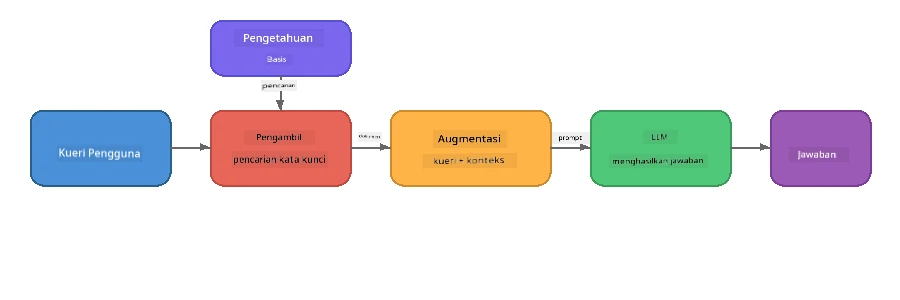

# Bagian 4: Membangun Aplikasi RAG dengan Foundry Local

## Ikhtisar

Model Bahasa Besar sangat kuat, tetapi mereka hanya mengetahui apa yang ada dalam data pelatihan mereka. **Retrieval-Augmented Generation (RAG)** menyelesaikan ini dengan memberikan konteks relevan kepada model saat waktu kueri - diambil dari dokumen, basis data, atau basis pengetahuan Anda sendiri.

Dalam lab ini Anda akan membangun pipeline RAG lengkap yang berjalan **sepenuhnya di perangkat Anda** menggunakan Foundry Local. Tidak ada layanan cloud, tidak ada basis data vektor, tidak ada API embeddings - hanya pengambilan lokal dan model lokal.

## Tujuan Pembelajaran

Pada akhir lab ini Anda akan dapat:

- Menjelaskan apa itu RAG dan mengapa penting untuk aplikasi AI
- Membangun basis pengetahuan lokal dari dokumen teks
- Mengimplementasikan fungsi pengambilan sederhana untuk menemukan konteks relevan
- Menyusun prompt sistem yang mendasarkan model pada fakta yang diambil
- Menjalankan pipeline penuh Retrieve → Augment → Generate di perangkat
- Memahami pertukaran antara pengambilan kata kunci sederhana dan pencarian vektor

---

## Prasyarat

- Menyelesaikan [Bagian 3: Menggunakan Foundry Local SDK dengan OpenAI](part3-sdk-and-apis.md)
- Foundry Local CLI terpasang dan model `phi-3.5-mini` sudah diunduh

---

## Konsep: Apa itu RAG?

Tanpa RAG, LLM hanya dapat menjawab dari data pelatihannya - yang mungkin sudah usang, tidak lengkap, atau tidak menyertakan informasi pribadi Anda:

```
User: "What is Zava's return policy?"
LLM:  "I do not have information about Zava's return policy."  ← No context!
```

Dengan RAG, Anda **mengambil** dokumen relevan terlebih dahulu, lalu **menambahkan** konteks tersebut ke prompt sebelum **menghasilkan** jawaban:



Wawasan kunci: **model tidak perlu "tahu" jawabannya; ia hanya perlu membaca dokumen yang tepat.**

---

## Latihan Lab

### Latihan 1: Memahami Basis Pengetahuan

Buka contoh RAG untuk bahasa Anda dan periksa basis pengetahuan:

<details>
<summary><b>🐍 Python: <code>python/foundry-local-rag.py</code></b></summary>

Basis pengetahuan adalah daftar sederhana dari kamus dengan bidang `title` dan `content`:

```python
KNOWLEDGE_BASE = [
    {
        "title": "Foundry Local Overview",
        "content": (
            "Foundry Local brings the power of Azure AI Foundry to your local "
            "device without requiring an Azure subscription..."
        ),
    },
    {
        "title": "Supported Hardware",
        "content": (
            "Foundry Local automatically selects the best model variant for "
            "your hardware. If you have an Nvidia CUDA GPU it downloads the "
            "CUDA-optimized model..."
        ),
    },
    # ... lebih banyak entri
]
```

Setiap entri mewakili "potongan" pengetahuan - sepotong informasi terfokus pada satu topik.

</details>

<details>
<summary><b>📘 JavaScript: <code>javascript/foundry-local-rag.mjs</code></b></summary>

Basis pengetahuan menggunakan struktur yang sama sebagai array objek:

```javascript
const KNOWLEDGE_BASE = [
  {
    title: "Foundry Local Overview",
    content:
      "Foundry Local brings the power of Azure AI Foundry to your local " +
      "device without requiring an Azure subscription...",
  },
  {
    title: "Supported Hardware",
    content:
      "Foundry Local automatically selects the best model variant for " +
      "your hardware...",
  },
  // ... lebih banyak entri
];
```

</details>

<details>
<summary><b>💜 C#: <code>csharp/RagPipeline.cs</code></b></summary>

Basis pengetahuan menggunakan daftar tuple bernama:

```csharp
private static readonly List<(string Title, string Content)> KnowledgeBase =
[
    ("Foundry Local Overview",
     "Foundry Local brings the power of Azure AI Foundry to your local " +
     "device without requiring an Azure subscription..."),

    ("Supported Hardware",
     "Foundry Local automatically selects the best model variant for " +
     "your hardware..."),

    // ... more entries
];
```

</details>

> **Dalam aplikasi nyata**, basis pengetahuan biasanya berasal dari file di disk, basis data, indeks pencarian, atau API. Untuk lab ini, kita menggunakan daftar di memori agar lebih sederhana.

---

### Latihan 2: Memahami Fungsi Pengambilan

Langkah pengambilan menemukan potongan paling relevan untuk pertanyaan pengguna. Contoh ini menggunakan **tumpang tindih kata kunci** - menghitung berapa banyak kata dalam query yang juga muncul di setiap potongan:

<details>
<summary><b>🐍 Python</b></summary>

```python
def retrieve(query: str, top_k: int = 2) -> list[dict]:
    """Return the top-k knowledge chunks most relevant to the query."""
    query_words = set(query.lower().split())
    scored = []
    for chunk in KNOWLEDGE_BASE:
        chunk_words = set(chunk["content"].lower().split())
        overlap = len(query_words & chunk_words)
        scored.append((overlap, chunk))
    scored.sort(key=lambda x: x[0], reverse=True)
    return [item[1] for item in scored[:top_k]]
```

</details>

<details>
<summary><b>📘 JavaScript</b></summary>

```javascript
function retrieve(query, topK = 2) {
  const queryWords = new Set(query.toLowerCase().split(/\s+/));
  const scored = KNOWLEDGE_BASE.map((chunk) => {
    const chunkWords = new Set(chunk.content.toLowerCase().split(/\s+/));
    let overlap = 0;
    for (const w of queryWords) {
      if (chunkWords.has(w)) overlap++;
    }
    return { overlap, chunk };
  });
  scored.sort((a, b) => b.overlap - a.overlap);
  return scored.slice(0, topK).map((s) => s.chunk);
}
```

</details>

<details>
<summary><b>💜 C#</b></summary>

```csharp
private static List<(string Title, string Content)> Retrieve(string query, int topK = 2)
{
    var queryWords = new HashSet<string>(
        query.ToLowerInvariant().Split(' ', StringSplitOptions.RemoveEmptyEntries));

    return KnowledgeBase
        .Select(chunk =>
        {
            var chunkWords = new HashSet<string>(
                chunk.Content.ToLowerInvariant().Split(' ', StringSplitOptions.RemoveEmptyEntries));
            var overlap = queryWords.Intersect(chunkWords).Count();
            return (Overlap: overlap, Chunk: chunk);
        })
        .OrderByDescending(x => x.Overlap)
        .Take(topK)
        .Select(x => x.Chunk)
        .ToList();
}
```

</details>

**Cara kerjanya:**
1. Pisahkan query menjadi kata-kata individu
2. Untuk setiap potongan pengetahuan, hitung berapa banyak kata query muncul di potongan tersebut
3. Urutkan berdasarkan skor tumpang tindih (tertinggi terlebih dahulu)
4. Kembalikan top-k potongan yang paling relevan

> **Pertukaran:** Tumpang tindih kata kunci sederhana tetapi terbatas; ia tidak memahami sinonim atau makna. Sistem RAG produksi biasanya menggunakan **vektor embedding** dan **basis data vektor** untuk pencarian semantik. Namun, tumpang tindih kata kunci adalah titik mulai yang baik dan tidak memerlukan dependensi tambahan.

---

### Latihan 3: Memahami Prompt yang Diperkuat

Konteks yang diambil disisipkan ke dalam **prompt sistem** sebelum dikirim ke model:

```python
system_prompt = (
    "You are a helpful assistant. Answer the user's question using ONLY "
    "the information provided in the context below. If the context does "
    "not contain enough information, say so.\n\n"
    f"Context:\n{context_text}"
)
```

Keputusan desain kunci:
- **"HANYA informasi yang diberikan"** - mencegah model membuat halusinasi fakta yang tidak ada dalam konteks
- **"Jika konteks tidak mengandung cukup informasi, katakan begitu"** - mendorong jawaban jujur "Saya tidak tahu"
- Konteks ditempatkan di pesan sistem agar memengaruhi semua respons

---

### Latihan 4: Menjalankan Pipeline RAG

Jalankan contoh lengkap:

**Python:**
```bash
cd python
python foundry-local-rag.py
```

**JavaScript:**
```bash
cd javascript
node foundry-local-rag.mjs
```

**C#:**
```bash
cd csharp
dotnet run rag
```

Anda akan melihat tiga hal tercetak:
1. **Pertanyaan** yang diajukan
2. **Konteks yang diambil** - potongan yang dipilih dari basis pengetahuan
3. **Jawaban** - dihasilkan oleh model menggunakan hanya konteks tersebut

Contoh output:
```
Question: How do I install Foundry Local and what hardware does it support?

--- Retrieved Context ---
### Installation
On Windows install Foundry Local with: winget install Microsoft.FoundryLocal...

### Supported Hardware
Foundry Local automatically selects the best model variant for your hardware...
-------------------------

Answer: To install Foundry Local, you can use the following methods depending
on your operating system: On Windows, run `winget install Microsoft.FoundryLocal`.
On macOS, use `brew install microsoft/foundrylocal/foundrylocal`...
```

Perhatikan bagaimana jawaban model **berdasarkan** pada konteks yang diambil - hanya menyebutkan fakta dari dokumen basis pengetahuan.

---

### Latihan 5: Bereksperimen dan Memperluas

Coba modifikasi berikut untuk memperdalam pemahaman Anda:

1. **Ubah pertanyaannya** - tanya sesuatu yang ADA dalam basis pengetahuan versus yang TIDAK ADA:
   ```python
   question = "What programming languages does Foundry Local support?"  # ← Dalam konteks
   question = "How much does Foundry Local cost?"                       # ← Tidak dalam konteks
   ```
   Apakah model benar mengatakan "Saya tidak tahu" ketika jawaban tidak ada dalam konteks?

2. **Tambah potongan pengetahuan baru** - tambahkan entri baru ke `KNOWLEDGE_BASE`:
   ```python
   {
       "title": "Pricing",
       "content": "Foundry Local is completely free and open source under the MIT license.",
   }
   ```
   Sekarang tanyakan pertanyaan harga lagi.

3. **Ubah `top_k`** - ambil lebih banyak atau lebih sedikit potongan:
   ```python
   context_chunks = retrieve(question, top_k=3)  # Lebih banyak konteks
   context_chunks = retrieve(question, top_k=1)  # Lebih sedikit konteks
   ```
   Bagaimana jumlah konteks memengaruhi kualitas jawaban?

4. **Hapus instruksi dasar** - ubah prompt sistem menjadi hanya "Anda adalah asisten yang membantu." dan lihat apakah model mulai berhalusinasi fakta.

---

## Penjelajahan Mendalam: Mengoptimalkan RAG untuk Performa di Perangkat

Menjalankan RAG di perangkat memperkenalkan keterbatasan yang tidak Anda hadapi di cloud: RAM terbatas, tanpa GPU khusus (eksekusi CPU/NPU), dan jendela konteks model yang kecil. Keputusan desain berikut secara langsung mengatasi keterbatasan ini dan berdasar pada pola dari aplikasi RAG lokal gaya produksi yang dibangun dengan Foundry Local.

### Strategi Pembagian Potongan: Jendela Geser Ukuran Tetap

Pembagian potongan - bagaimana Anda memecah dokumen menjadi bagian-bagian - adalah salah satu keputusan paling berdampak di sistem RAG manapun. Untuk skenario perangkat, **jendela geser ukuran tetap dengan tumpang tindih** adalah titik mulai yang disarankan:

| Parameter | Nilai yang Disarankan | Alasan |
|-----------|----------------------|--------|
| **Ukuran potongan** | ~200 token | Menjaga konteks yang diambil tetap ringkas, memberi ruang di jendela konteks Phi-3.5 Mini untuk prompt sistem, histori percakapan, dan keluaran yang dihasilkan |
| **Tumpang tindih** | ~25 token (12,5%) | Mencegah kehilangan informasi di batas potongan - penting untuk prosedur dan instruksi langkah demi langkah |
| **Tokenisasi** | Pemisahan spasi putih | Tanpa dependensi, tidak perlu pustaka tokenizer. Semua anggaran komputasi tetap di LLM |

Tumpang tindih bekerja seperti jendela geser: setiap potongan baru mulai 25 token sebelum potongan sebelumnya berakhir, sehingga kalimat yang melintasi batas potongan muncul di kedua potongan.

> **Kenapa tidak strategi lain?**
> - **Pemecahan berbasis kalimat** menghasilkan ukuran potongan yang tidak terduga; beberapa prosedur keselamatan adalah kalimat panjang tunggal yang tidak akan terbagi dengan baik
> - **Pemecahan sadar bagian** (berdasarkan judul `##`) membuat ukuran potongan sangat bervariasi - beberapa terlalu kecil, lainnya terlalu besar untuk jendela konteks model
> - **Pembagian semantik** (deteksi topik berbasis embedding) memberikan kualitas pengambilan terbaik, tapi membutuhkan model kedua di memori bersama Phi-3.5 Mini - berisiko pada perangkat dengan memori 8-16 GB yang terbagi

### Meningkatkan Pengambilan: Vektor TF-IDF

Pendekatan tumpang tindih kata kunci dalam lab ini bekerja, tetapi jika Anda ingin pengambilan yang lebih baik tanpa menambah model embedding, **TF-IDF (Term Frequency-Inverse Document Frequency)** adalah pilihan tengah yang sangat bagus:

```
Keyword Overlap  →  TF-IDF Vectors  →  Embedding Models
    (this lab)     (lightweight upgrade)   (production)
  Simple & fast    Better ranking,         Best quality,
  No dependencies  still no ML model       requires embedding model
  ~Basic matching  ~1ms retrieval          ~100-500ms per query
```

TF-IDF mengonversi setiap potongan menjadi vektor numerik berdasarkan betapa pentingnya setiap kata dalam potongan tersebut *relatif terhadap semua potongan*. Saat waktu kueri, pertanyaan juga divedektori dengan cara yang sama dan dibandingkan menggunakan kemiripan kosinus. Anda dapat mengimplementasikannya dengan SQLite dan JavaScript/Python murni - tanpa basis data vektor, tanpa API embedding.

> **Performa:** Kemiripan kosinus TF-IDF pada potongan ukuran tetap biasanya mencapai **~1ms pengambilan**, dibandingkan ~100-500ms saat model embedding mengkodekan setiap kueri. Semua dokumen 20+ dapat dipotong dan diindeks dalam waktu kurang dari satu detik.

### Mode Edge/Compact untuk Perangkat Terbatas

Saat dijalankan di perangkat dengan hardware sangat terbatas (laptop lama, tablet, perangkat lapangan), Anda dapat mengurangi penggunaan sumber daya dengan mengecilkan tiga pengaturan:

| Pengaturan | Mode Standar | Mode Edge/Compact |
|------------|--------------|-------------------|
| **Prompt sistem** | ~300 token | ~80 token |
| **Maks token output** | 1024 | 512 |
| **Potongan yang diambil (top-k)** | 5 | 3 |

Lebih sedikit potongan yang diambil berarti konteks lebih sedikit untuk diproses model, yang mengurangi latensi dan tekanan memori. Prompt sistem yang lebih singkat membebaskan lebih banyak jendela konteks untuk jawaban sebenarnya. Pertukaran ini sangat berharga di perangkat di mana setiap token jendela konteks berarti.

### Satu Model di Memori

Salah satu prinsip penting untuk RAG di perangkat: **hanya muat satu model**. Jika Anda menggunakan model embedding untuk pengambilan *dan* model bahasa untuk generasi, Anda membagi sumber daya NPU/RAM terbatas di antara dua model. Pengambilan ringan (tumpang tindih kata kunci, TF-IDF) menghindari ini sepenuhnya:

- Tidak ada model embedding yang bersaing dengan LLM untuk memori
- Startup lebih cepat - hanya satu model yang dimuat
- Penggunaan memori dapat diprediksi - LLM mendapat semua sumber daya yang tersedia
- Bekerja di mesin dengan memori serendah 8 GB

### SQLite sebagai Penyimpanan Vektor Lokal

Untuk koleksi dokumen kecil hingga menengah (ratusan hingga ribuan potongan rendah), **SQLite cukup cepat** untuk pencarian kemiripan kosinus brute-force dan tidak memerlukan infrastruktur tambahan:

- File `.db` tunggal di disk - tanpa proses server, tanpa konfigurasi
- Termasuk di setiap runtime bahasa utama (Python `sqlite3`, Node.js `better-sqlite3`, .NET `Microsoft.Data.Sqlite`)
- Menyimpan potongan dokumen beserta vektor TF-IDF mereka dalam satu tabel
- Tidak perlu Pinecone, Qdrant, Chroma, atau FAISS pada skala ini

### Ringkasan Performa

Pilihan desain ini digabungkan untuk memberikan RAG yang responsif di perangkat konsumen:

| Metrik | Performa Di Perangkat |
|--------|----------------------|
| **Latensi pengambilan** | ~1ms (TF-IDF) hingga ~5ms (tumpang tindih kata kunci) |
| **Kecepatan ingest** | 20 dokumen dipotong dan diindeks dalam waktu < 1 detik |
| **Model di memori** | 1 (hanya LLM - tanpa model embedding) |
| **Overhead penyimpanan** | < 1 MB untuk potongan + vektor di SQLite |
| **Cold start** | Muatan model tunggal, tanpa startup runtime embedding |
| **Batas hardware** | 8 GB RAM, CPU-only (tidak perlu GPU) |

> **Kapan ingin upgrade:** Jika Anda mengelola ratusan dokumen panjang, tipe konten campuran (tabel, kode, prosa), atau perlu pemahaman semantik kueri, pertimbangkan menambahkan model embedding dan beralih ke pencarian kemiripan vektor. Untuk sebagian besar kasus penggunaan di perangkat dengan kumpulan dokumen yang terfokus, TF-IDF + SQLite memberikan hasil hebat dengan penggunaan sumber daya minimal.

---

## Konsep Utama

| Konsep | Deskripsi |
|---------|-------------|
| **Pengambilan** | Menemukan dokumen relevan dari basis pengetahuan berdasarkan kueri pengguna |
| **Penambahan** | Menyisipkan dokumen yang diambil ke dalam prompt sebagai konteks |
| **Generasi** | LLM menghasilkan jawaban yang didasarkan pada konteks yang disediakan |
| **Pembagian potongan** | Memecah dokumen besar menjadi bagian lebih kecil dan terfokus |
| **Dasar** | Membatasi model hanya menggunakan konteks yang diberikan (mengurangi halusinasi) |
| **Top-k** | Jumlah potongan paling relevan yang diambil |

---

## RAG dalam Produksi vs. Lab Ini

| Aspek | Lab Ini | Optimalisasi Di Perangkat | Produksi Cloud |
|--------|----------|------------------------|---------------|
| **Basis pengetahuan** | Daftar di memori | File di disk, SQLite | Basis data, indeks pencarian |
| **Pengambilan** | Tumpang tindih kata kunci | TF-IDF + kemiripan kosinus | Embedding vektor + pencarian kemiripan |
| **Embeddings** | Tidak diperlukan | Tidak - vektor TF-IDF | Model embedding (lokal atau cloud) |
| **Penyimpanan vektor** | Tidak diperlukan | SQLite (file `.db` tunggal) | FAISS, Chroma, Azure AI Search, dll. |
| **Pembagian potongan** | Manual | Jendela geser ukuran tetap (~200 token, tumpang tindih 25 token) | Pembagian semantik atau rekursif |
| **Model di memori** | 1 (LLM) | 1 (LLM) | 2+ (embedding + LLM) |
| **Latensi pengambilan** | ~5ms | ~1ms | ~100-500ms |
| **Skala** | 5 dokumen | Ratusan dokumen | Jutaan dokumen |

Polapola yang Anda pelajari di sini (ambil, tambahkan, hasilkan) sama pada skala mana pun. Metode pengambilan meningkat, tetapi arsitektur keseluruhan tetap identik. Kolom tengah menunjukkan apa yang dapat dicapai di perangkat dengan teknik ringan, sering menjadi titik manis untuk aplikasi lokal di mana Anda menukar skala cloud demi privasi, kemampuan offline, dan latensi nol ke layanan eksternal.

---

## Poin Penting

| Konsep | Apa yang Anda Pelajari |
|---------|-----------------------|
| Pola RAG | Ambil + Tambah + Hasilkan: berikan model konteks yang tepat dan model dapat menjawab pertanyaan tentang data Anda |
| Di perangkat | Semua berjalan secara lokal tanpa API cloud atau langganan database vektor |
| Instruksi pembumian | Batasan prompt sistem sangat penting untuk mencegah halusinasi |
| Tumpang tindih kata kunci | Titik awal sederhana tapi efektif untuk pengambilan |
| TF-IDF + SQLite | Jalur peningkatan ringan yang menjaga pengambilan di bawah 1ms tanpa model embed |
| Satu model di memori | Hindari memuat model embed bersama dengan LLM pada perangkat dengan sumber daya terbatas |
| Ukuran chunk | Sekitar 200 token dengan tumpang tindih menyeimbangkan presisi pengambilan dan efisiensi jendela konteks |
| Mode edge/compact | Gunakan chunk lebih sedikit dan prompt lebih pendek untuk perangkat yang sangat terbatas |
| Pola universal | Arsitektur RAG yang sama bekerja untuk sumber data apa pun: dokumen, basis data, API, atau wiki |

> **Ingin melihat aplikasi RAG penuh di perangkat?** Lihat [Gas Field Local RAG](https://github.com/leestott/local-rag), agen RAG offline gaya produksi yang dibangun dengan Foundry Local dan Phi-3.5 Mini yang menunjukkan pola optimasi ini dengan set dokumen dunia nyata.

---

## Langkah Selanjutnya

Lanjutkan ke [Bagian 5: Membangun Agen AI](part5-single-agents.md) untuk belajar cara membangun agen cerdas dengan persona, instruksi, dan percakapan multi-putaran menggunakan Microsoft Agent Framework.