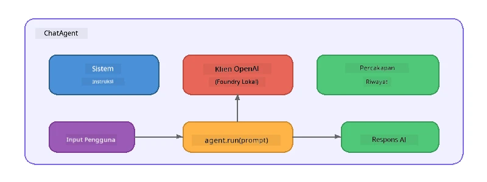

# Bagian 5: Membangun Agen AI dengan Agent Framework

> **Tujuan:** Membangun agen AI pertamamu dengan instruksi yang persisten dan persona yang ditentukan, didukung oleh model lokal melalui Foundry Local.

## Apa Itu Agen AI?

Agen AI membungkus model bahasa dengan **instruksi sistem** yang menentukan perilakunya, kepribadian, dan batasannya. Tidak seperti panggilan chat completion tunggal, agen menyediakan:

- **Persona** - identitas konsisten ("Anda adalah peninjau kode yang membantu")
- **Memori** - riwayat percakapan antar giliran
- **Spesialisasi** - perilaku terfokus yang didorong oleh instruksi yang disusun dengan baik



---

## Microsoft Agent Framework

**Microsoft Agent Framework** (AGF) menyediakan abstraksi agen standar yang bekerja lintas backend model berbeda. Dalam lokakarya ini, kami memadukannya dengan Foundry Local sehingga semuanya berjalan di mesin Anda - tanpa perlu cloud.

| Konsep | Deskripsi |
|---------|-------------|
| `FoundryLocalClient` | Python: menangani mulai layanan, unduh/muat model, dan membuat agen |
| `client.as_agent()` | Python: membuat agen dari klien Foundry Local |
| `AsAIAgent()` | C#: metode ekstensi pada `ChatClient` - membuat `AIAgent` |
| `instructions` | Prompt sistem yang membentuk perilaku agen |
| `name` | Label yang dapat dibaca manusia, berguna dalam skenario multi-agen |
| `agent.run(prompt)` / `RunAsync()` | Mengirim pesan pengguna dan mengembalikan respons agen |

> **Catatan:** Agent Framework memiliki SDK Python dan .NET. Untuk JavaScript, kami mengimplementasikan kelas `ChatAgent` ringan yang mencerminkan pola yang sama dengan menggunakan SDK OpenAI secara langsung.

---

## Latihan

### Latihan 1 - Memahami Pola Agen

Sebelum menulis kode, pelajari komponen kunci dari agen:

1. **Klien model** - menghubungkan ke API yang kompatibel OpenAI dari Foundry Local
2. **Instruksi sistem** - prompt "kepribadian"
3. **Loop menjalankan** - kirim input pengguna, terima output

> **Pikirkan:** Bagaimana instruksi sistem berbeda dari pesan pengguna biasa? Apa yang terjadi jika Anda mengubahnya?

---

### Latihan 2 - Jalankan Contoh Agen Tunggal

<details>
<summary><strong>🐍 Python</strong></summary>

**Persyaratan:**
```bash
cd python
python -m venv venv

# Windows (PowerShell):
venv\Scripts\Activate.ps1
# macOS:
source venv/bin/activate

pip install -r requirements.txt
```

**Jalankan:**
```bash
python foundry-local-with-agf.py
```

**Penjelasan kode** (`python/foundry-local-with-agf.py`):

```python
import asyncio
from agent_framework_foundry_local import FoundryLocalClient

async def main():
    alias = "phi-4-mini"

    # FoundryLocalClient menangani mulai layanan, unduh model, dan pemuatan
    client = FoundryLocalClient(model_id=alias)
    print(f"Client Model ID: {client.model_id}")

    # Buat agen dengan instruksi sistem
    agent = client.as_agent(
        name="Joker",
        instructions="You are good at telling jokes.",
    )

    # Non-streaming: dapatkan respons lengkap sekaligus
    result = await agent.run("Tell me a joke about a pirate.")
    print(f"Agent: {result}")

    # Streaming: dapatkan hasil saat mereka dihasilkan
    async for chunk in agent.run("Tell me another joke.", stream=True):
        if chunk.text:
            print(chunk.text, end="", flush=True)

asyncio.run(main())
```

**Poin-poin kunci:**
- `FoundryLocalClient(model_id=alias)` menangani mulai layanan, unduh, dan pemuatan model dalam satu langkah
- `client.as_agent()` membuat agen dengan instruksi sistem dan nama
- `agent.run()` mendukung mode non-streaming dan streaming
- Pasang melalui `pip install agent-framework-foundry-local --pre`

</details>

<details>
<summary><strong>📦 JavaScript</strong></summary>

**Persyaratan:**
```bash
cd javascript
npm install
```

**Jalankan:**
```bash
node foundry-local-with-agent.mjs
```

**Penjelasan kode** (`javascript/foundry-local-with-agent.mjs`):

```javascript
import { OpenAI } from "openai";
import { FoundryLocalManager } from "foundry-local-sdk";

class ChatAgent {
  constructor({ client, modelId, instructions, name }) {
    this.client = client;
    this.modelId = modelId;
    this.instructions = instructions;
    this.name = name;
    this.history = [];
  }

  async run(userMessage) {
    const messages = [
      { role: "system", content: this.instructions },
      ...this.history,
      { role: "user", content: userMessage },
    ];
    const response = await this.client.chat.completions.create({
      model: this.modelId,
      messages,
    });
    const assistantMessage = response.choices[0].message.content;

    // Simpan riwayat percakapan untuk interaksi multi-putaran
    this.history.push({ role: "user", content: userMessage });
    this.history.push({ role: "assistant", content: assistantMessage });
    return { text: assistantMessage };
  }
}

async function main() {
  FoundryLocalManager.create({ appName: "FoundryLocalWorkshop" });
  const manager = FoundryLocalManager.instance;
  await manager.startWebService();

  const catalog = manager.catalog;
  const model = await catalog.getModel("phi-3.5-mini");
  if (!model.isCached) {
    console.log("Downloading model: phi-3.5-mini...");
    await model.download();
  }
  await model.load();

  const client = new OpenAI({
    baseURL: manager.urls[0] + "/v1",
    apiKey: "foundry-local",
  });

  const agent = new ChatAgent({
    client,
    modelId: model.id,
    instructions: "You are good at telling jokes.",
    name: "Joker",
  });

  const result = await agent.run("Tell me a joke about a pirate.");
  console.log(result.text);
}

main();
```

**Poin-poin kunci:**
- JavaScript membuat kelas `ChatAgent` sendiri yang mencerminkan pola AGF Python
- `this.history` menyimpan giliran percakapan untuk dukungan multi-giliran
- Urutan eksplisit `startWebService()` → cek cache → `model.download()` → `model.load()` memberikan visibilitas penuh

</details>

<details>
<summary><strong>💜 C#</strong></summary>

**Persyaratan:**
```bash
cd csharp
dotnet restore
```

**Jalankan:**
```bash
dotnet run agent
```

**Penjelasan kode** (`csharp/SingleAgent.cs`):

```csharp
using Microsoft.AI.Foundry.Local;
using Microsoft.Extensions.Logging.Abstractions;
using Microsoft.Agents.AI;
using OpenAI;
using System.ClientModel;

// 1. Start Foundry Local and load a model
var alias = "phi-3.5-mini";
await FoundryLocalManager.CreateAsync(
    new Configuration
    {
        AppName = "FoundryLocalSamples",
        Web = new Configuration.WebService { Urls = "http://127.0.0.1:0" }
    }, NullLogger.Instance, default);
var manager = FoundryLocalManager.Instance;
await manager.StartWebServiceAsync(default);

var catalog = await manager.GetCatalogAsync(default);
var model = await catalog.GetModelAsync(alias, default);

var isCached = await model.IsCachedAsync(default);
if (!isCached)
{
    Console.WriteLine($"Downloading model: {alias}...");
    await model.DownloadAsync(null, default);
}
await model.LoadAsync(default);

var key = new ApiKeyCredential("foundry-local");
var client = new OpenAIClient(key, new OpenAIClientOptions
{
    Endpoint = new Uri(manager.Urls[0] + "/v1")
});

// 2. Create an AIAgent using the Agent Framework extension method
AIAgent joker = client
    .GetChatClient(model.Id)
    .AsAIAgent(
        instructions: "You are good at telling jokes. Keep your jokes short and family-friendly.",
        name: "Joker"
    );

// 3. Run the agent (non-streaming)
var response = await joker.RunAsync("Tell me a joke about a pirate.");
Console.WriteLine($"Joker: {response}");

// 4. Run with streaming
await foreach (var update in joker.RunStreamingAsync("Tell me another joke."))
{
    Console.Write(update);
}
```

**Poin-poin kunci:**
- `AsAIAgent()` adalah metode ekstensi dari `Microsoft.Agents.AI.OpenAI` - tidak perlu kelas `ChatAgent` khusus
- `RunAsync()` mengembalikan respons penuh; `RunStreamingAsync()` melakukan streaming token per token
- Pasang melalui `dotnet add package Microsoft.Agents.AI.OpenAI --version 1.0.0-rc3`

</details>

---

### Latihan 3 - Ubah Persona

Modifikasi `instructions` agen untuk membuat persona berbeda. Coba tiap-tiap dan amati bagaimana outputnya berubah:

| Persona | Instruksi |
|---------|-------------|
| Peninjau Kode | `"Anda adalah peninjau kode ahli. Berikan umpan balik konstruktif fokus pada keterbacaan, performa, dan ketepatan."` |
| Pemandu Wisata | `"Anda adalah pemandu wisata yang ramah. Beri rekomendasi personal untuk destinasi, aktivitas, dan kuliner lokal."` |
| Tutor Socrates | `"Anda adalah tutor Socrates. Jangan pernah memberikan jawaban langsung - melainkan, pandulah murid dengan pertanyaan yang penuh pemikiran."` |
| Penulis Teknis | `"Anda adalah penulis teknis. Jelaskan konsep dengan jelas dan ringkas. Gunakan contoh. Hindari jargon."` |

**Coba:**
1. Pilih persona dari tabel di atas
2. Ganti string `instructions` di kode
3. Sesuaikan prompt pengguna agar cocok (misal minta peninjau kode meninjau fungsi)
4. Jalankan contohnya lagi dan bandingkan outputnya

> **Tip:** Kualitas agen sangat bergantung pada instruksi. Instruksi yang spesifik dan terstruktur baik menghasilkan hasil yang lebih baik dibanding yang samar.

---

### Latihan 4 - Tambahkan Percakapan Multi-Giliran

Perluas contoh untuk mendukung loop chat multi-giliran agar Anda bisa melakukan percakapan bolak-balik dengan agen.

<details>
<summary><strong>🐍 Python - loop multi-giliran</strong></summary>

```python
import asyncio
from agent_framework_foundry_local import FoundryLocalClient

async def main():
    client = FoundryLocalClient(model_id="phi-4-mini")

    agent = client.as_agent(
        name="Assistant",
        instructions="You are a helpful assistant.",
    )

    print("Chat with the agent (type 'quit' to exit):\n")
    while True:
        user_input = input("You: ")
        if user_input.strip().lower() in ("quit", "exit"):
            break
        result = await agent.run(user_input)
        print(f"Agent: {result}\n")

asyncio.run(main())
```

</details>

<details>
<summary><strong>📦 JavaScript - loop multi-giliran</strong></summary>

```javascript
import { OpenAI } from "openai";
import { FoundryLocalManager } from "foundry-local-sdk";
import * as readline from "node:readline/promises";

// (gunakan kembali kelas ChatAgent dari Latihan 2)

async function main() {
  FoundryLocalManager.create({ appName: "FoundryLocalWorkshop" });
  const manager = FoundryLocalManager.instance;
  await manager.startWebService();

  const catalog = manager.catalog;
  const model = await catalog.getModel("phi-3.5-mini");
  if (!model.isCached) {
    console.log("Downloading model: phi-3.5-mini...");
    await model.download();
  }
  await model.load();

  const client = new OpenAI({
    baseURL: manager.urls[0] + "/v1",
    apiKey: "foundry-local",
  });

  const agent = new ChatAgent({
    client,
    modelId: model.id,
    instructions: "You are a helpful assistant.",
    name: "Assistant",
  });

  const rl = readline.createInterface({
    input: process.stdin,
    output: process.stdout,
  });

  console.log("Chat with the agent (type 'quit' to exit):\n");
  while (true) {
    const userInput = await rl.question("You: ");
    if (["quit", "exit"].includes(userInput.trim().toLowerCase())) break;
    const result = await agent.run(userInput);
    console.log(`Agent: ${result.text}\n`);
  }
  rl.close();
}

main();
```

</details>

<details>
<summary><strong>💜 C# - loop multi-giliran</strong></summary>

```csharp
using Microsoft.AI.Foundry.Local;
using Microsoft.Extensions.Logging.Abstractions;
using Microsoft.Agents.AI;
using OpenAI;
using System.ClientModel;

var alias = "phi-3.5-mini";
var config = new Configuration
{
    AppName = "FoundryLocalSamples",
    Web = new Configuration.WebService { Urls = "http://127.0.0.1:0" }
};
await FoundryLocalManager.CreateAsync(config, NullLogger.Instance, default);
var manager = FoundryLocalManager.Instance;
await manager.StartWebServiceAsync(default);

var catalog = await manager.GetCatalogAsync(default);
var model = await catalog.GetModelAsync(alias, default);

var isCached = await model.IsCachedAsync(default);
if (!isCached)
{
    Console.WriteLine($"Downloading model: {alias}...");
    await model.DownloadAsync(null, default);
}
await model.LoadAsync(default);

var key = new ApiKeyCredential("foundry-local");
var client = new OpenAIClient(key, new OpenAIClientOptions
{
    Endpoint = new Uri(manager.Urls[0] + "/v1")
});

AIAgent agent = client
    .GetChatClient(model.Id)
    .AsAIAgent(
        instructions: "You are a helpful assistant.",
        name: "Assistant"
    );

Console.WriteLine("Chat with the agent (type 'quit' to exit):\n");
while (true)
{
    Console.Write("You: ");
    var userInput = Console.ReadLine();
    if (string.IsNullOrWhiteSpace(userInput) ||
        userInput.Equals("quit", StringComparison.OrdinalIgnoreCase) ||
        userInput.Equals("exit", StringComparison.OrdinalIgnoreCase))
        break;

    var result = await agent.RunAsync(userInput);
    Console.WriteLine($"Agent: {result}\n");
}
```

</details>

Perhatikan bagaimana agen mengingat giliran sebelumnya - tanyakan pertanyaan lanjutan dan lihat konteks yang terbawa.

---

### Latihan 5 - Output Terstruktur

Instruksikan agen untuk selalu merespons dengan format spesifik (misal JSON) dan parsing hasilnya:

<details>
<summary><strong>🐍 Python - output JSON</strong></summary>

```python
import asyncio
import json
from agent_framework_foundry_local import FoundryLocalClient

async def main():
    client = FoundryLocalClient(model_id="phi-4-mini")

    agent = client.as_agent(
        name="SentimentAnalyzer",
        instructions=(
            "You are a sentiment analysis agent. "
            "For every user message, respond ONLY with valid JSON in this format: "
            '{"sentiment": "positive|negative|neutral", "confidence": 0.0-1.0, "summary": "brief reason"}'
        ),
    )

    result = await agent.run("I absolutely loved the new restaurant downtown!")
    print("Raw:", result)

    try:
        parsed = json.loads(str(result))
        print(f"Sentiment: {parsed['sentiment']} (confidence: {parsed['confidence']})")
    except json.JSONDecodeError:
        print("Agent did not return valid JSON - try refining the instructions.")

asyncio.run(main())
```

</details>

<details>
<summary><strong>💜 C# - output JSON</strong></summary>

```csharp
using System.Text.Json;

AIAgent analyzer = chatClient.AsAIAgent(
    name: "SentimentAnalyzer",
    instructions:
        "You are a sentiment analysis agent. " +
        "For every user message, respond ONLY with valid JSON in this format: " +
        "{\"sentiment\": \"positive|negative|neutral\", \"confidence\": 0.0-1.0, \"summary\": \"brief reason\"}"
);

var response = await analyzer.RunAsync("I absolutely loved the new restaurant downtown!");
Console.WriteLine($"Raw: {response}");

try
{
    var parsed = JsonSerializer.Deserialize<JsonElement>(response.ToString());
    Console.WriteLine($"Sentiment: {parsed.GetProperty("sentiment")} " +
                      $"(confidence: {parsed.GetProperty("confidence")})");
}
catch (JsonException)
{
    Console.WriteLine("Agent did not return valid JSON - try refining the instructions.");
}
```

</details>

> **Catatan:** Model lokal kecil mungkin tidak selalu menghasilkan JSON yang valid sempurna. Anda bisa meningkatkan keandalannya dengan menyertakan contoh dalam instruksi dan sangat eksplisit tentang format yang diharapkan.

---

## Hal Penting yang Dipelajari

| Konsep | Apa yang Anda Pelajari |
|---------|-----------------|
| Agen vs. panggilan LLM mentah | Agen membungkus model dengan instruksi dan memori |
| Instruksi sistem | Tuas terpenting untuk mengendalikan perilaku agen |
| Percakapan multi-giliran | Agen dapat membawa konteks di beberapa interaksi pengguna |
| Output terstruktur | Instruksi dapat memaksa format output (JSON, markdown, dll.) |
| Eksekusi lokal | Semua berjalan secara lokal melalui Foundry Local - tanpa cloud diperlukan |

---

## Langkah Selanjutnya

Di **[Bagian 6: Alur Kerja Multi-Agen](part6-multi-agent-workflows.md)**, Anda akan menggabungkan beberapa agen menjadi pipeline terkoordinasi di mana setiap agen memiliki peran spesialisasi.